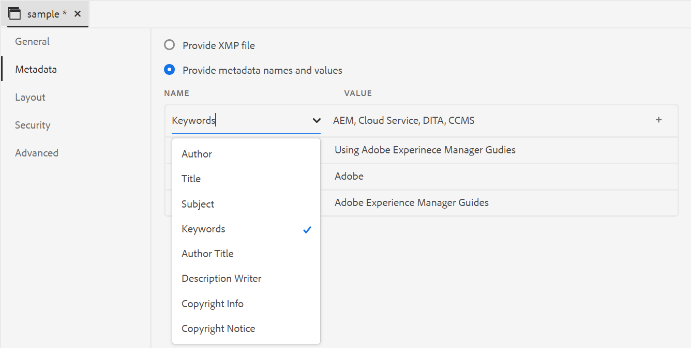
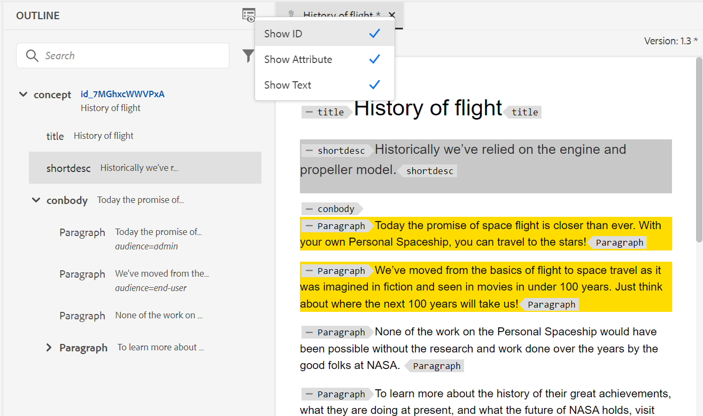
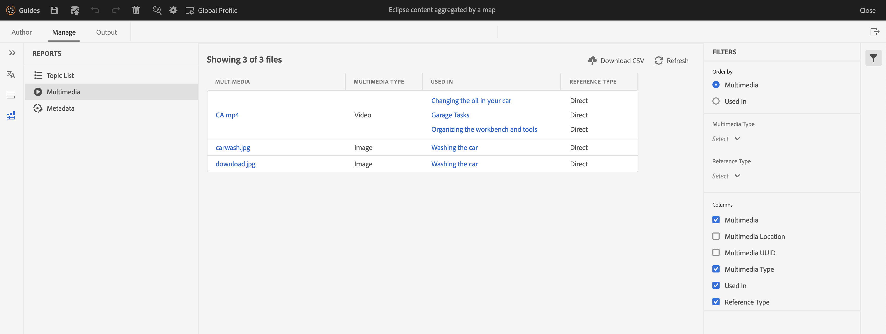

# Novità della versione 4.2.1 delle guide di Adobe Experience Manager (maggio 2023)

Questo articolo descrive le funzioni nuove e migliorate della versione 4.2.1 delle Guide di Adobe Experience Manager (in seguito denominate *Guide AEM*).

Per ulteriori dettagli sulle istruzioni di aggiornamento, sulla matrice di compatibilità e sui problemi risolti in questa versione, vedi [Note sulla versione](release-notes-4-2-1.md) articolo.

## Passare dall&#39;Editor Web alla home page AEM

Ora è possibile passare facilmente dall’Editor Web alla pagina di navigazione AEM.

{width="800" align="left"}

* Fai clic su **Guide** icona ( ), per tornare alla pagina di navigazione AEM.

Per ulteriori dettagli, consulta [Pagina di navigazione AEM](../user-guide/web-editor-launch-editor.md#id2056BG00RZJ).

## Supporto avanzato dei metadati nella pubblicazione PDF

Le guide AEM ora forniscono supporto avanzato per i metadati mappati sui metadati nell’output PDF. Le opzioni relative ai metadati includono informazioni sul documento e sul relativo contenuto, ad esempio il nome dell&#39;autore, il titolo del documento, le parole chiave, le informazioni sul copyright e altri campi dati.

Potete importare un file XMP e le guide AEM possono scegliere le informazioni dal file. Puoi anche fornire i nomi e i valori dei metadati utilizzando il menu a discesa. Puoi anche aggiungere metadati personalizzati digitando direttamente nel campo del nome.

Per ulteriori dettagli, consulta **Metadati** descrizione della funzione in [Creare un predefinito di output PDF](../web-editor/native-pdf-web-editor.md).

### Pannello Visualizzazione Struttura migliorata

Le guide AEM forniscono un pannello migliorato Visualizzazione struttura in cui è possibile ottenere la visualizzazione gerarchica degli elementi utilizzati nel documento.

La vista Struttura offre i seguenti miglioramenti:

* Il menu a discesa Opzioni vista (View Options) viene visualizzato sopra il pannello Visualizzazione struttura (Outline View). Se un elemento ha un ID, un attributo e un testo, puoi selezionarli dal menu a discesa per visualizzarli insieme all’elemento. Gli attributi che possono essere visualizzati nel pannello Visualizzazione struttura sono determinati dalle impostazioni Attributi di visualizzazione configurate dall&#39;amministratore all&#39;interno del **Impostazioni editor**.

* Utilizzando la funzione di ricerca, puoi cercare un elemento in base al suo nome, ID, testo o valore dell’attributo.

Per ulteriori dettagli, consultate la descrizione della funzione Visualizzazione Struttura in [Pannello sinistro](../user-guide/web-editor-features.md#id2051EA0M0HS) sezione.

## Generare il rapporto Multimedia dall’editor web

Guide AEM fornisce la funzione di generare i rapporti per i documenti tecnici.  È possibile utilizzare questa funzione per visualizzare l&#39;elenco degli argomenti e gestire i metadati dei documenti. Ora puoi anche vedere i contenuti multimediali utilizzati in tutti i riferimenti per la mappa corrente dalla sezione **Rapporti** nell&#39;editor Web.

È possibile generare il report multimediale che contiene informazioni dettagliate sul file multimediale utilizzato nei riferimenti all&#39;interno della mappa corrente. È possibile filtrare e ordinare i file multimediali elencati nel report.
È inoltre possibile generare il file CSV per scaricare l&#39;istantanea corrente dei file multimediali utilizzati nella mappa DITA.

Per ulteriori dettagli, vedi la descrizione della funzione Generate a multimedia report (Genera un report multimediale) in [Report mappa DITA dall&#39;editor Web](../user-guide/reports-web-editor.md) sezione.

## Native PDF | Barra delle modifiche per indicare gli argomenti modificati nel sommario

Le guide AEM ora consentono di identificare rapidamente gli argomenti modificati nel sommario dell’output PDF.  Viene visualizzata una barra di modifica a sinistra degli argomenti modificati nel sommario. Puoi fare clic sull’argomento nel sommario e visualizzare le modifiche dettagliate.

Per ulteriori dettagli, consulta [Utilizzare gli stili delle barre di modifica personalizzati](../native-pdf/change-bar-style.md).

## Native PDF | Personalizzare lo stile del marcatore pagina nel componente Nota a piè di pagina

Ora è possibile applicare uno stile al marcatore di pagina nelle note a piè di pagina. Ad esempio, è possibile aggiungere parentesi quadre o modificarne il colore. Questi stili consentono agli utenti di identificare facilmente gli indicatori di pagina nel documento.

Per ulteriori dettagli, consulta [Usa stili personalizzati nelle note a piè di pagina](../native-pdf/footnote-number-style.md).

## Aprire e riprodurre file video o audio nell&#39;editor Web

Le guide AEM ora forniscono la funzione di aprire e riprodurre i file audio o video nell’editor web. È possibile modificare il volume o la visualizzazione del video. Nel menu di scelta rapida sono inoltre disponibili le opzioni per **Scarica**, modifica **Velocità di riproduzione**, o visualizzazione **Immagine nell’immagine**.

Per ulteriori dettagli, consulta la descrizione della funzione Visualizzazione archivio in [Pannello sinistro](../user-guide/web-editor-features.md#id2051EA0M0HS) sezione.
