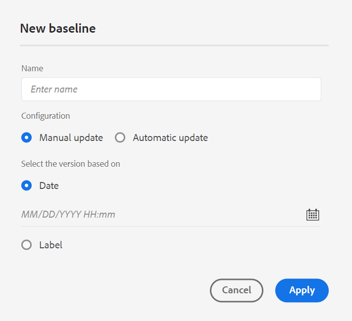

# Novità della versione 4.4.0 (gennaio 2024)

Questo articolo descrive le funzioni nuove e migliorate della versione 4.4.0 delle Guide di Adobe Experience Manager.

Per l’elenco dei problemi risolti in questa versione, visualizza [Sono stati risolti dei problemi nella versione 4.4.0 di](../release-info/fixed-issues-4-4.md).

Informazioni su [istruzioni di aggiornamento per la versione 4.4.0](../release-info/upgrade-instructions-4-4.md).

## Funzione di cronologia delle versioni rinnovata nell’editor web

Experience Manager Guide fornisce ora una funzione avanzata di cronologia delle versioni che consente di confrontare le modifiche apportate a un documento nel tempo. Nella nuova visualizzazione affiancata è possibile confrontare facilmente il contenuto e i metadati della versione corrente con qualsiasi versione precedente dello stesso documento. Puoi anche visualizzare le etichette e i commenti per le versioni confrontate. In qualità di amministratore, puoi controllare i metadati della versione dell’argomento e i relativi valori da visualizzare nel **Cronologia versioni** .

{width="800" align="left"}
*Visualizzare in anteprima le modifiche apportate alle diverse versioni di un argomento.*

Ulteriori informazioni su **Cronologia versioni** descrizione della funzione in [Pannello sinistro](../user-guide/web-editor-features.md#id2051EA0M0HS) sezione.

## Gestire i predefiniti per le condizioni

È possibile definire gli attributi della condizione negli argomenti DITA. Quindi, utilizzate gli attributi condizione nel predefinito condizione per pubblicare il contenuto in una mappa DITA. Experience Manager Guides ora offre anche un’esperienza arricchita nell’editor web, che consente di creare e gestire in modo più efficiente i predefiniti per le condizioni. È inoltre possibile modificarli, duplicarli o eliminarli facilmente.

{width="550" align="left"}

Per ulteriori dettagli, vedi [Utilizzare i predefiniti per le condizioni](../user-guide/generate-output-use-condition-presets.md).

## Esperienza rinnovata per modificare gli attributi

Ora puoi ottenere un’esperienza rinnovata per aggiungere o modificare gli attributi di un elemento dalla sezione **Proprietà contenuto** nell&#39;editor Web.

{width="300" align="left"}

*Aggiungete gli attributi dal pannello Proprietà contenuto.*

È inoltre possibile modificare ed eliminare facilmente gli attributi.
Per ulteriori informazioni, consulta **Proprietà contenuto** descrizione della funzione all’interno di [Pannello a destra](../user-guide/web-editor-features.md#id2051EB003YK) sezione.

## Modificare i metadati durante l’authoring

Ora, durante l’authoring, è possibile aggiornare i tag di metadati dei file utilizzando il menu a discesa **Proprietà file** nel pannello a destra. Puoi anche selezionare **Modifica altre proprietà** per aggiornare altri metadati.

{width="300" align="left"}

*Aggiorna i metadati e modifica le proprietà del file dal pannello di destra.*

Per ulteriori informazioni, consulta **Proprietà file** descrizione della funzione all’interno di [Pannello a destra](../user-guide/web-editor-features.md#id2051EB003YK) sezione.

## Visualizzare gli attributi chiave nella vista Mappa

Quando definite gli attributi chiave per i riferimenti argomento o mappa, potete anche visualizzare il titolo, l&#39;icona corrispondente e il tasto nel pannello sinistro. La chiave viene visualizzata come `key=<key-name>`.

 {width="300" align="left"}

*Visualizzare l&#39;attributo chiave nella vista Mappa.*

Per ulteriori informazioni, consulta **Vista mappa** descrizione della funzione in [Pannello sinistro](../user-guide/web-editor-features.md#id2051EA0M0HS) sezione.

## Possibilità di duplicare una linea di base in base all’etichetta

Experience Manager Guides ora offre un’esperienza utente migliorata per la creazione delle linee di base dall’editor web.
Le opzioni **Aggiornamento manuale** e **Aggiornamento automatico** sono più intuitive e consentono di scegliere facilmente se creare una linea di base statica o aggiornarla automaticamente in base alle etichette.

 {width="300" align="left"}
*Creare una baseline dall&#39;editor Web.*

Consente inoltre di duplicare una baseline basata sull&#39;etichetta. La versione di riferimento viene scelta in base all&#39;etichetta specificata (se esiste) durante la duplicazione, oppure seleziona la versione dalla baseline duplicata.

 {width="300" align="left"}

*Duplicare una linea di base basata su un&#39;etichetta o creare una copia esatta.*

Ulteriori informazioni su come [creare e gestire le linee di base dall&#39;editor Web](../user-guide/web-editor-baseline.md).

## Dashboard di raccolta mappe migliorato

Experience Manager Guides fornisce un dashboard avanzato per la raccolta mappe. In una raccolta di mappe, è possibile configurare rapidamente le proprietà dei metadati in blocco per le mappe DITA. Questa funzione è utile in quanto non è necessario aggiornare le proprietà dei metadati per ogni singola mappa DITA.

È ora possibile visualizzare il nome del file della mappa DITA. È inoltre possibile visualizzare le baseline. Questo consente di trovare rapidamente la linea di base utilizzata per un predefinito.

{width="800" align="left"}

*Visualizza, modifica e genera output dal dashboard di raccolta mappe.*

Scopri come [utilizzare la raccolta di mappe per la generazione dell&#39;output](../user-guide/generate-output-use-map-collection-output-generation.md).

## Pannello Traduzione avanzata

Il **Traduzione** è stato migliorato.  È possibile visualizzare **Lingue disponibili** e seleziona rapidamente le impostazioni internazionali in cui desideri tradurre il progetto. Con una singola selezione, puoi anche scegliere **Seleziona tutto** per tradurre il progetto in tutte le lingue disponibili.

{width="300" align="left"}

*Seleziona le lingue in cui desideri tradurre il progetto. Scegliere il valore predefinito, la baseline o la versione più recente dei file da tradurre.*

Ulteriori informazioni su come [tradurre il contenuto](../user-guide/translation.md).

## Miglioramento della logica di ricerca nella finestra di dialogo Inserisci elemento

È ora possibile trovare facilmente gli elementi nella finestra di dialogo Inserisci elemento.  È possibile digitare una stringa nella casella di ricerca e ottenere un elenco di tutti gli elementi validi che iniziano con la stringa immessa.

Ad esempio, quando modifichi un paragrafo in cui desideri inserire un elemento, puoi cercare un carattere &quot;t&quot; per ottenere tutti gli elementi validi che iniziano con &quot;t&quot;.

{width="300" align="left"}

*Digitare un carattere per cercare tutti gli elementi validi che iniziano con il carattere.*

Per ulteriori dettagli, vedi **Inserisci elemento** descrizione della funzione in [Pannello sinistro](../user-guide/web-editor-features.md#id2051EA0M0HS) sezione.

## Possibilità di dividere un elenco allo stesso livello

Ora è possibile suddividere facilmente l&#39;elenco nell&#39;Editor Web. Seleziona la **Elenco suddiviso** nel menu di scelta rapida di una voce di elenco per dividere l&#39;elenco corrente. Viene creato un nuovo elenco allo stesso livello, a partire dalla voce di elenco selezionata per la suddivisione.

{width="300" align="left"}

*Selezionare l&#39;opzione per dividere l&#39;elenco corrente.*

Per ulteriori dettagli, vedi **Inserisci elenco** descrizione della funzione in [Pannello sinistro](../user-guide/web-editor-features.md#id2051EA0M0HS) sezione.

## Estrai facilmente il wrapping degli elementi DITA

Ora è possibile decomprimere facilmente un elemento utilizzando l’opzione dal menu di scelta rapida di un elemento nell’Editor web. Questo consente di unire facilmente il testo dell’elemento con il relativo elemento padre.
Per ulteriori dettagli, vedi **Annullare il wrapping di un elemento** sezione dalla sezione [altre funzioni dell&#39;editor Web](../user-guide/web-editor-other-features.md).

## Accedere alle proprietà del file nella modalità di origine dell&#39;authoring

Ora puoi accedere ai pannelli a destra **Proprietà file** in tutte e quattro le modalità o visualizzazioni: Layout, Autore, Origine e Anteprima.  In questo modo è possibile visualizzare le proprietà del file anche quando si passa da una modalità all&#39;altra.

Per ulteriori dettagli, vedi **Proprietà file** descrizione della funzione in [Pannello a destra](../user-guide/web-editor-features.md#id2051EB003YK) sezione.

## Visualizza i file per titolo o nomi file

È ora possibile scegliere la modalità predefinita di visualizzazione dei file nell&#39;editor Web. È possibile visualizzare l’elenco dei file in base ai titoli o ai nomi dei file dai vari pannelli nella vista Autore.

{width="550" align="left"}

*Modificare la modalità predefinita di visualizzazione dei file da **Preferenze utente**.*

## Ripristina schede file all&#39;aggiornamento del browser

Experience Manager Guide ripristina lo stato delle schede dei file aperte nell&#39;editor Web quando si aggiorna il browser. Per ulteriori dettagli, vedi **Aggiorna il browser durante la modifica dei file** sezione in [Modificare gli argomenti nell&#39;editor Web](../user-guide/web-editor-edit-topics.md).

## Possibilità di navigare utilizzando le scelte rapide da tastiera

Experience Manager Guide consente ora di utilizzare le scelte rapide da tastiera per spostare il cursore nell&#39;editor Web. È possibile utilizzare le scelte rapide da tastiera per spostare rapidamente una parola verso sinistra o verso destra. È inoltre possibile spostarsi all&#39;inizio o alla fine della riga con l&#39;aiuto delle scelte rapide da tastiera.
Ora è anche possibile utilizzare i tasti di scelta rapida per spostare il cursore all&#39;inizio dell&#39;elemento successivo o alla fine dell&#39;elemento precedente.
Ulteriori informazioni su [scelte rapide da tastiera nell’Editor web](../user-guide/web-editor-keyboard-shortcuts.md).

## Risoluzione dei collegamenti incrociati nell’output del sito AEM

Il rendering dei collegamenti delle mappe incrociate (XREF con peer ambito) nell&#39;output del sito AEM viene ora risolto in base al titolo del file del contesto di pubblicazione impostato per la mappa generata.

## Configura l’URL dell’output del sito AEM per utilizzare il titolo del documento

Experience Manager Guides consente di configurare l&#39;URL dell&#39;output del sito AEM come amministratore. Se il nome del file non esiste o contiene tutti i caratteri speciali, puoi configurare per sostituirli con un separatore nell’URL dell’output del sito AEM. È inoltre possibile sostituirli con il nome del primo argomento secondario. Scopri come [configura l’URL dell’output del sito AEM per utilizzare il titolo del documento](../cs-install-guide/conf-output-generation.md#configure-the-url-of-the-aem-site-output-to-use-the-document-title).

## Pubblicare più predefiniti di output in parallelo

L&#39;Experience Manager fornisce la funzione per la creazione delle linee di base selezionando automaticamente gli argomenti in base all&#39;etichetta ad esse applicata. Ora è anche possibile pubblicare facilmente più predefiniti di output con linee di base automatiche della stessa mappa DITA. Non è necessario pubblicare un solo predefinito alla volta, ma è possibile pubblicare facilmente più predefiniti di output in parallelo.

Ulteriori informazioni su come [creare e gestire le linee di base dall&#39;editor Web](../user-guide/web-editor-baseline.md).

## Miglioramenti di Native PDF

Nella versione 4.4.0 sono stati apportati i seguenti miglioramenti a Native PDF:

### Utilizzare le variabili nell’output di PDF

È possibile utilizzare le variabili per inserire e gestire in modo dinamico le informazioni riutilizzabili. Experience Manager Guides consente di creare, modificare e visualizzare in anteprima le variabili durante la generazione dell’output PDF. È possibile modificare rapidamente i valori delle variabili e rendere i documenti facilmente trasferibili e aggiornabili.

{width="800" align="left"}

*Crea e gestisci le variabili nell’editor web.*

Puoi anche creare set di variabili che sostituiscono i valori predefiniti e assegnare valori alternativi alle variabili. Inserire queste variabili all&#39;interno del layout di pagina e utilizzare lo stesso layout di PDF. Non è necessario creare layout separati per ogni insieme di valori. Ad esempio, puoi creare un set di variabili per ogni versione del prodotto. Questo set di variabili può essere costituito da variabili per diversi dettagli del prodotto come nome del prodotto, numero di versione e data di rilascio. Quindi puoi aggiungere valori diversi per queste variabili.

**Set di variabili 1: set di Adobi 1**

* ProductName: guide Experience Manager
* Numero di versione: 2311
* Data di rilascio: 11/02/2023

**Set di variabili 2: set di Adobi 2**

* ProductName: guide Experience Manager
* Numero di versione: 2310
* Data di rilascio: 09/27/2023

*Genera l’output PDF utilizzando le variabili nel layout PDF.*

Per formattare le variabili è possibile applicare gli stili e utilizzare il markup HTML.  Puoi anche aggiornare rapidamente i valori per qualsiasi variabile ogni volta che sia necessario e rigenerare l’output. Ad esempio, se è necessario aggiornare i dettagli di una versione, è possibile modificare il valore della versione nella variabile VersionNumber e rigenerare l&#39;output.

Scopri come utilizzare [variabili nell’output di PDF](../native-pdf/native-pdf-variables.md).

### Propagazione dei metadati delle risorse nell’output PDF

Experience Manager ora offre la possibilità di trasferire le proprietà dei metadati delle risorse dalla mappa DITA all’output PDF.
Dal predefinito di output di PDF nativo è possibile scegliere i metadati che si desidera propagare al processo di pubblicazione di PDF. Puoi selezionare sia le proprietà personalizzate che quelle predefinite.  Le proprietà dei metadati selezionate vengono trasferite al file PDF generato utilizzando Native PDF.

Questa funzione è utile in quanto consente di mantenere coerenti le proprietà della risorsa, ad esempio l’autore, la data di creazione o il titolo del documento. Ciò semplifica l&#39;organizzazione, la ricerca e la classificazione dei documenti.

Per ulteriori dettagli, vedi **Avanzate** impostazioni in [Pubblica output PDF](../web-editor/native-pdf-web-editor.md).

### Utilizzare i metadati aggiunti in `topicmeta` elemento per l&#39;output PDF

La funzione metadati nella pubblicazione nativa di PDF facilita la gestione dei contenuti e la ricerca di file su Internet.

*Seleziona un’opzione per aggiungere e personalizzare le opzioni dei metadati.*

Ora Experience Manager Guides offre l’opzione di utilizzare i metadati aggiunti nel `topicmeta` elemento della mappa DITA per compilare i campi di metadati dell&#39;output PDF. Questa opzione è selezionata per impostazione predefinita.

Questa funzione consente una migliore gestione dei documenti, garantisce coerenza e rende i documenti ricercabili.

Per ulteriori informazioni, consulta **Metadati** scheda in [Pubblica output PDF](../web-editor/native-pdf-web-editor.md).

### Utilizzare e duplicare modelli di PDF predefiniti

Experience Manager Guides fornisce modelli predefiniti o standard di PDF. Duplicare i modelli di factory PDF per creare i modelli di PDF personalizzati.

Ora è possibile anche visualizzare in anteprima l&#39;immagine miniatura di un modello durante la creazione e la duplicazione di un modello. Puoi anche modificare o eliminare questa immagine. Questa funzione è utile per marcare o distinguere i modelli con nomi simili.
Ulteriori informazioni su [Modello PDF](../native-pdf/pdf-template.md).

{width="550" align="left"}

*Duplica un modello di PDF esistente.*

### Modificare l&#39;ordine delle pagine e pubblicare più pagine per foglio

Oltre a pubblicare le pagine in base al documento di origine, è possibile modificare l’ordine delle pagine in PDF durante la pubblicazione di un documento con più pagine.  Questo offre la flessibilità di pubblicare le pagine in vari ordini, come prima tutte le pagine dispari o tutte le pagine pari. Puoi anche pubblicare come opuscolo e leggere le pagine come un libro. Puoi anche decidere il numero di pagine da pubblicare su un singolo foglio. Per ulteriori dettagli, vedi [Organizzazione pagina](../native-pdf/components-pdf-template.md#page-organization) sezione.

### Ordinare i termini del glossario in base ai tasti di ordinamento

Ora è anche possibile ordinare i termini del glossario in base ai tasti di ordinamento. È possibile utilizzare il tag ‘sort-as’ per definire una chiave di ordinamento per i termini del glossario. Quindi, puoi ordinarli in base ai tasti di ordinamento al posto dei termini. Questo consente di ordinare i termini del glossario in base ai termini utilizzati in lingue diverse. È inoltre possibile definire una singola chiave di ordinamento per un termine del glossario con una frase o un gruppo di parole.
Per ulteriori dettagli, vedi [Impostazioni avanzate di PDF](../native-pdf/components-pdf-template.md#advanced-pdf-settings).

### Gestione delle risorse migliorata per i modelli di PDF nativi

Experience Manager Guides ora ha migliorato la gestione delle risorse per i modelli Native PDF. È ora possibile condividere e riutilizzare le risorse, come immagini, file CSS e file font, tra più modelli di Native PDF. Grazie a questo miglioramento, la gestione delle risorse per un set elevato di modelli è molto più semplice. Non è necessario creare risorse duplicate per ciascun modello, ma è possibile mantenerle in una cartella condivisa e utilizzarle in tutti i modelli di PDF nativi.
Per ulteriori dettagli, vedi [Modello PDF](../native-pdf/pdf-template.md).

