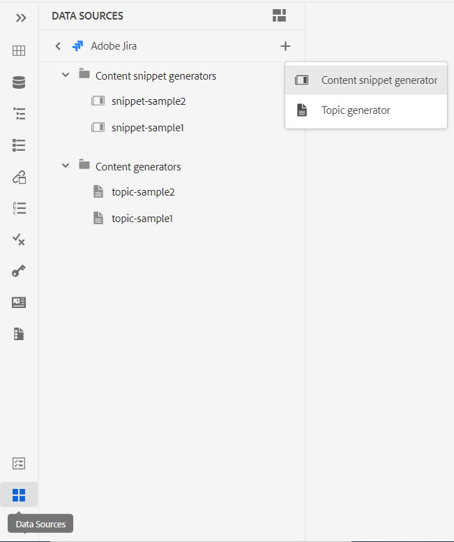

# Novità della versione 4.3.0 delle guide di Adobe Experience Manager (luglio 2023)

Questo articolo descrive le funzioni nuove e migliorate della versione 4.3.0 delle Guide di Adobe Experience Manager (in seguito denominate *Guide AEM*).

Per ulteriori dettagli sulle istruzioni di aggiornamento, sulla matrice di compatibilità e sui problemi risolti in questa versione, consulta [Note sulla versione](./release-notes-4.3.md).

## Connettersi a un&#39;origine dati e inserire dati negli argomenti

Ora è possibile connettersi rapidamente alle origini dati utilizzando i connettori predefiniti delle guide AEM. La connessione a un&#39;origine dati consente di mantenere le informazioni sincronizzate con l&#39;origine e qualsiasi aggiornamento dei dati viene riflesso automaticamente, rendendo le guide AEM un vero e proprio hub di contenuti. Questa funzione ti consente di risparmiare tempo e fatica nell’aggiungere o copiare manualmente i dati.

Le guide AEM consentono all&#39;amministratore di configurare i connettori predefiniti per i database JIRA e SQL (MySQL, PostgreSQL, SQL Server, SQLite). Possono inoltre aggiungere altri connettori estendendo le interfacce predefinite.
Una volta aggiunti, puoi visualizzare i connettori configurati elencati nel pannello Origini dati nell’Editor web.

Crea uno snippet di contenuto per recuperare i dati da un’origine dati connessa. È quindi possibile inserire i dati negli argomenti e modificarli. Dopo aver creato un generatore di frammenti di contenuto, puoi riutilizzarlo per inserire i dati in qualsiasi argomento.

Ora è anche possibile creare un argomento da un&#39;origine dati connessa. Un argomento può contenere dati in vari formati, ad esempio tabelle, elenchi e paragrafi. Consente inoltre di creare una mappa DITA per tutti gli argomenti. È possibile associare i metadati all&#39;argomento quando si estrae da un&#39;origine dati.

Per ulteriori dettagli, vedi [Utilizzare dati dall’origine dati](../user-guide/web-editor-content-snippet.md).

## Aggiungere citazioni al contenuto

Le citazioni sono riferimenti all’origine delle informazioni aggiunte al contenuto. Le citazioni ti aiutano a stabilire credibilità e a prevenire il plagio. Le citazioni consentono ai lettori di individuare la sorgente e verificare le informazioni presentate nel testo.

Nelle guide AEM, puoi aggiungere citazioni o importarle e applicarle al contenuto. È possibile aggiungere queste citazioni da qualsiasi origine di libri, siti Web e giornali.

Dopo aver inserito le citazioni negli argomenti, è possibile visualizzarne l&#39;anteprima nell&#39;editor Web. Puoi anche pubblicare i contenuti con le citazioni utilizzando Native PDF.

{width="300" align="left"}

Per ulteriori dettagli, vedi [Aggiungere e gestire le citazioni nel contenuto](../user-guide/web-editor-apply-citations.md).

## Pubblicare in un frammento di contenuto

I frammenti di contenuto sono parti discrete di contenuto nell’AEM. Sono contenuti strutturati basati su un modello di contenuto. I frammenti di contenuto sono contenuti puri senza informazioni di progettazione o layout. Possono essere creati e gestiti indipendentemente dai canali supportati dall’AEM. La modularità e la riutilizzabilità dei frammenti di contenuto determinano maggiore flessibilità, coerenza, efficienza e gestione più semplice.

Ora le guide AEM offrono un modo per pubblicare un argomento o gli elementi all’interno di un argomento in un frammento di contenuto. Puoi creare una mappatura basata su JSON tra un argomento e un modello per frammenti di contenuto. Utilizza questa mappatura per pubblicare in un frammento di contenuto il contenuto presente in alcuni o in tutti gli elementi di un argomento.

Sfrutta la potenza delle guide AEM e dei frammenti di contenuto e utilizza i frammenti di contenuto in qualsiasi sito AEM. Puoi anche estrarre i dettagli tramite API supportate da frammenti di contenuto.

{width="550" align="left"}

## Revisione dei miglioramenti

Le guide AEM forniscono ora una funzionalità di revisione migliorata con le seguenti funzionalità:

### Pannello Revisione per mostrare i progetti di revisione e le attività di revisione attive

Ora AEM Guide rende le tue recensioni più fluide. Fornisce il pannello Revisioni all&#39;interno dell&#39;Editor Web. Il pannello Revisioni visualizza tutti i progetti di revisione e le attività di revisione attive all&#39;interno dei progetti di revisione di cui fai parte.

In qualità di autore, questa funzione consente di aprire facilmente le attività di revisione, visualizzare i commenti e indirizzarli rapidamente in una visualizzazione centralizzata.
{width="800" align="left"}
Per ulteriori dettagli, vedi **Revisione** descrizione della funzione all’interno di [Pannello sinistro](../user-guide/web-editor-features.md#id2051EA0M0HS) sezione.

### Cerca argomenti di revisione

La conduzione delle revisioni è una caratteristica fondamentale delle Guide dell&#39;AEM. Aiuta i revisori a rivedere i documenti loro assegnati .
È ora possibile cercare un argomento immettendo una parte del testo del titolo o del percorso file nella barra di ricerca della visualizzazione argomenti del pannello di revisione. È inoltre possibile scegliere di visualizzare tutti gli argomenti o visualizzare gli argomenti con commenti. Per impostazione predefinita, è possibile visualizzare tutti gli argomenti presenti nell&#39;attività di revisione.

{width="800" align="left"}

Per ulteriori dettagli, vedi [Rivedi argomenti](../user-guide/review-topics.md).

## Framework di estensione delle guide

Crea pacchetti personalizzati sopra le guide AEM per fornire estensibilità utilizzando il framework di estensione delle guide AEM. Questi pacchetti sono utili per sviluppatori e consulenti e consentono l’estensibilità ai componenti nell’editor. Possono eseguire il targeting di pulsanti, finestre di dialogo e menu a discesa e aggiungere JavaScript personalizzati che possono interagire facilmente con l’interfaccia utente delle guide dell’AEM.

## Miglioramenti di Native PDF

I seguenti miglioramenti di Native PDF sono stati apportati nella versione 4.3.0 per rendere le guide AEM un prodotto più robusto:

### Supporto per le variabili di lingua

Le guide AEM supportano le variabili di linguaggio. È possibile utilizzare le variabili di lingua per definire una versione localizzata delle etichette predefinite, ad esempio Nota, Avvertenza e Avvertenza, o del testo statico nell’output di PDF.
Puoi aggiungere le variabili di lingua o la versione localizzata delle etichette alle sezioni appropriate nell’output di PDF e nei modelli di output.

#### Variabili di lingua nell’output di PDF

È possibile utilizzare le variabili di lingua per definire etichette localizzate per elementi quali Nota, Attenzione e Avvertenza. Puoi aggiornare il valore di queste variabili in una o più lingue, quindi il valore localizzato viene selezionato automaticamente nell’output di PDF.
Ad esempio, puoi presentare l’etichetta Nota nell’output PDF nei seguenti modi:

* Inglese: Note
* Francese: Remarque
* Tedesco: Hinweis

#### Variabili di lingua nei modelli di output

Per creare l&#39;output di PDF in diverse lingue, è necessario creare diversi modelli di PDF contenenti testo localizzato per ogni lingua. Ora, con la funzione Variabili di lingua, è sufficiente creare il modello una sola volta. Quindi, per qualsiasi testo statico da localizzare, puoi creare variabili di lingua corrispondenti e utilizzarle nel modello.
Puoi creare variabili di lingua per testo più lungo, ad esempio una frase intera o anche un paragrafo. Puoi anche applicare stili e utilizzare il markup HTML per formattare queste variabili di lingua.

Per ulteriori dettagli, vedi [Supporto per le variabili di lingua](../native-pdf/native-pdf-language-variables.md).

### Aggiungere una filigrana all&#39;output PDF per i documenti bozza

Ora è possibile aggiungere una filigrana all’output PDF del documento che non è ancora stato approvato. Questa filigrana non viene visualizzata se si genera il PDF per il documento nello stato &quot;Approvato&quot;. Ad esempio, puoi aggiungere una bozza di filigrana per l’output PDF.

Per ulteriori dettagli, vedi [Aggiungere una filigrana all&#39;output PDF per le bozze di documenti](../native-pdf/use-javascript-content-style.md#watermark-draft-document).

### Possibilità di utilizzare i metadati dell’AEM nei layout PDF

I metadati sono la descrizione o la definizione del contenuto. Questi metadati vengono memorizzati nel contenuto della mappa DITA di origine.

Ora nelle guide AEM puoi anche selezionare le proprietà dei metadati delle risorse e aggiungerle al layout di pagina. Le guide AEM selezionano quindi queste proprietà di metadati delle risorse e le pubblicano nell’output PDF.

{width="300" align="left"}

>[!NOTE]
>
> Le guide AEM supportano anche le proprietà dei metadati per le mappe DITA.

Per ulteriori dettagli, vedi [Aggiungere campi e metadati](../native-pdf/design-page-layout.md#add-fields-metadata).

### Ordinare le pagine nell’output di PDF

Puoi mostrare o nascondere le seguenti sezioni nel PDF e anche disporre l’ordine in cui devono essere visualizzate nell’output PDF finale:

* Sommario
* Capitoli e argomenti
* Elenco delle figure
* Elenco delle tabelle
* Indice
* Glossario
* Citazione
* Layout di pagina

Se non desideri visualizzare una particolare sezione nell’output PDF, puoi nasconderla disattivando l’interruttore.

Per ulteriori dettagli, vedi [Ordine pagine](../native-pdf/components-pdf-template.md#page-order).

### Unisci pagine

In un output di PDF nativo per impostazione predefinita, tutte le sezioni iniziano su una nuova pagina. È ora possibile unire una sezione alla pagina precedente o a quella successiva. In questo modo la sezione viene pubblicata insieme alla pagina selezionata nell’output di PDF e non vi è alcuna interruzione di pagina tra le pagine.

Per ulteriori dettagli, consulta la descrizione della funzione Unisci pagine in [Ordine pagine](../native-pdf/components-pdf-template.md#page-order) sezione.

### Pagine statiche

Puoi anche creare layout di pagina personalizzati e pubblicarli come pagine statiche nell’output di PDF. Questo consente di aggiungere qualsiasi contenuto statico come note o pagine vuote.

Per ulteriori dettagli, consulta la descrizione della funzione Pagine statiche in [Ordine pagine](../native-pdf/components-pdf-template.md#page-order) sezione.

### Variabili nei riferimenti incrociati

Potete utilizzare le variabili per definire un riferimento incrociato. Quando utilizzi una variabile, il relativo valore viene selezionato dalle proprietà.

Ora puoi anche utilizzare {figure} e {table}.
Utilizzare {figure}per aggiungere un riferimento incrociato al numero di figura. Il numero di figura viene selezionato dagli stili di numerazione automatica definiti per la didascalia delle figure.

Utilizzare {table} per aggiungere un riferimento incrociato al numero di tabella. Seleziona il numero di tabella dagli stili di numerazione automatica definiti per la didascalia.

Per ulteriori dettagli, vedi [Riferimenti incrociati](../native-pdf/components-pdf-template.md##cross-references).

### Inizia qualsiasi capitolo dalla pagina corrente

È possibile impostare le impostazioni di configurazione di base per l&#39;avvio di un capitolo da una pagina pari o dispari, la struttura del sommario e definire il formato della linea guida per le voci del sommario.

Ora è anche possibile iniziare un capitolo dalla pagina corrente. Se scegli di farlo, tutti i capitoli vengono pubblicati in continuazione senza interruzioni di pagina. Ad esempio, se un capitolo termina a metà della pagina 15, anche il capitolo successivo inizia dalla quindicesima pagina.

### Possibilità di accedere ai file temporanei di HTML durante la generazione dell&#39;output nativo di PDF

Ora AEM Guides consente di scaricare i file HTML temporanei creati durante la generazione dell’output PDF nativo. Nelle impostazioni del predefinito di output, seleziona l’opzione per scaricare i file temporanei.  Le guide AEM consentono quindi di scaricare i file temporanei creati durante la generazione dell’output utilizzando tale predefinito.

Questa funzione consente di ottenere informazioni migliori sul processo di generazione con accesso a stili e layout provvisori e consente di correggere o modificare gli stili CSS in base alle esigenze.

{width="800" align="left"}

Per ulteriori dettagli, vedi [Creare un predefinito di output PDF](../web-editor/native-pdf-web-editor.md#create-output-preset).

### Riprogettazione dell’editor CSS

Ora l’editor CSS è stato riprogettato per offrire una migliore esperienza utente con selettori e proprietà di stile.

#### Miglioramento della finestra di dialogo Aggiungi stile

Ora puoi utilizzare selettori personalizzati per aggiungere stili complessi. Il nuovo campo Selettore consente di aggiungere selettori personalizzati oltre alla combinazione di Classe, Tag e Pseudo classe. Ad esempio, puoi creare `table a.link` stile per tutti i collegamenti ipertestuali di una tabella.

{width="300" align="left"}

#### Personalizzare le proprietà dello stile

Ora AEM Guides presenta un nuovo pannello proprietà nella sezione di anteprima degli stili. Potete modificare le proprietà degli stili in modo più efficiente e rapido dal pannello delle proprietà.

## Rinominare e spostare i file nella vista Archivio

Ora è anche possibile rinominare o spostare un file dal pannello dell’archivio. Questa funzione è utile e consente di gestire facilmente i file dal pannello Archivio. È possibile selezionare un file e rinominarlo o spostarlo utilizzando **Opzioni** per il file selezionato. Le guide AEM visualizzano un messaggio di operazione riuscita quando si sposta o si rinomina un file.

{width="550" align="left"}

Per ulteriori dettagli sul menu Opzioni di un file, visualizzare **Vista archivio** descrizione della funzione in [Pannello sinistro](../user-guide/web-editor-features.md#id2051EA0M0HS) sezione.

## Rapporto Collegamenti interrotti nell’editor web

Le guide AEM consentono di verificare la completezza complessiva dei documenti tecnici e generare report dall’editor web. Ora, a giugno 2023, la versione AEM Guides offre la funzione per visualizzare e correggere i collegamenti interrotti. Si tratta di un report utile che consente di gestire i collegamenti interrotti. È possibile visualizzare facilmente i collegamenti interrotti presenti nella mappa DITA e correggerli.
{width="800" align="left"}

Una volta corretto un collegamento, questo non viene visualizzato nell’elenco dei collegamenti interrotti.

Per ulteriori dettagli, consulta [Visualizzare e correggere i collegamenti interrotti](../user-guide/reports-web-editor.md#report-broken-links).

## Miglioramenti apportati a Schematron

### Utilizzare le istruzioni di report per verificare la presenza di regole in Schematron

Le guide dell’AEM supportano ora anche le dichiarazioni contenute nelle relazioni presentate con Schematron. Un’istruzione di report genera un messaggio quando un’istruzione di test restituisce true. Ad esempio, se desideri che la descrizione breve sia inferiore o uguale a 150 caratteri, puoi definire un’istruzione di rapporto per verificare gli argomenti in cui la descrizione breve è superiore a 150 caratteri.

Per ulteriori dettagli, vedi [Utilizzare le istruzioni di asserzione e di report per verificare la presenza di regole](../user-guide/support-schematron-file.md#schematron-assert-report).

### Usa espressioni Regex

È inoltre possibile utilizzare le espressioni Regex per definire una regola con la funzione matches() e quindi eseguire la convalida utilizzando il file Schematron.

Per ulteriori dettagli, vedi [Usa espressioni Regex](../user-guide/support-schematron-file.md#schematron-assert-report).

### Definire pattern astratti

Le guide AEM supportano anche i modelli astratti in Schematron. È possibile definire pattern astratti generici e riutilizzarli. I modelli astratti possono semplificare lo schema Schematron e aiutarti a gestire e aggiornare la logica di convalida.

Per ulteriori dettagli, vedi [Definire pattern astratti](../user-guide/support-schematron-file.md#schematron-abstract-patterns).

## Supporto per il formato XLIFF nella traduzione

Le guide AEM forniscono inoltre il supporto per il formato XLIFF (XML Localization Interchange File Format) in traduzione. Ora puoi anche scegliere di **Crea un nuovo progetto di traduzione XLIFF** per convertire il contenuto XML nel formato XLIFF. Le guide AEM supportano XLIFF versione 1.2.

Utilizzando questo formato, puoi esportare il contenuto nel formato XLIFF standard di settore e quindi fornire lo stesso ai fornitori di traduzione. Per ulteriori dettagli, vedi [Creare un progetto di traduzione](../user-guide/translate-documents-web-editor.md#create-translation-project).

{width="350" align="left"}

## Miglioramenti alla raccolta mappe

Una raccolta di mappe consente di organizzare più mappe e di pubblicarle in batch. Sono stati apportati molti nuovi miglioramenti alla raccolta Mappa:

* Ora è possibile aggiungere predefiniti di output di PDF nativi a una raccolta di mappe e utilizzarli per generare l&#39;output di PDF.
* Puoi visualizzare i predefiniti per i profili globali e delle cartelle creati dall’amministratore e utilizzarli per generare l’output PDF.
* Ora non solo è possibile selezionare un singolo predefinito, ma è anche possibile abilitare tutti i predefiniti del profilo di cartella per una mappa DITA in un&#39;unica operazione.
  {width="800" align="left"}

Per ulteriori dettagli, vedi [Usa raccolta mappe per la generazione dell&#39;output](../user-guide/generate-output-use-map-collection-output-generation.md).

## Supporto di PDF nativi nel dashboard di pubblicazione in blocco

Con la funzione di attivazione in blocco delle guide AEM, puoi attivare in modo rapido e semplice i contenuti dall’istanza di authoring a quella di pubblicazione. Nella mappa Bulk Activation puoi includere il predefinito di output PDF nativo, l’output Sito AEM, PDF, HTML5, Personalizzato e JSON.
Per ulteriori dettagli, vedi [Attivazione in blocco di contenuti pubblicati](../user-guide/conf-bulk-activation.md).

## Migliorato strumento di spostamento in blocco

Ora, in qualità di amministratore, puoi utilizzare il migliorato strumento Sposta in blocco per spostare cartelle con molti file da una posizione all’altra.
È possibile utilizzare la finestra di dialogo Sfoglia file per selezionare le cartelle di origine che si desidera spostare. È inoltre possibile selezionare il percorso di destinazione per spostare le cartelle di origine. Seleziona  {width="25" align="left"} vicino a un campo per visualizzare ulteriori informazioni.

Per ulteriori dettagli, vedi [Spostare i file in blocco](../user-guide/authoring-file-management.md#move-files-bulk).

## Pannello Preferiti migliorato

Le guide AEM consentono di creare una raccolta o un elenco di file e cartelle preferito e di utilizzarli facilmente. Ora **Opzioni** è disponibile anche nel **Preferiti** pannello. È possibile rinominare la raccolta selezionata o eliminarla dal **Opzioni** menu. È possibile selezionare **Aggiorna** per ottenere un nuovo elenco di file o cartelle dal repository. Puoi anche visualizzare il contenuto della cartella nell’interfaccia utente di Assets.

{width="650" align="left"}

>[!NOTE]
>
> È inoltre possibile aggiornare l&#39;elenco utilizzando **Aggiorna** nella parte superiore.

Per ulteriori dettagli su **Opzioni** di un insieme Preferiti, visualizzare **Preferiti** descrizione della funzione in [Pannello sinistro](../user-guide/web-editor-features.md#id2051EA0M0HS) sezione.

## Passa al tema di sistema

Ora puoi anche utilizzare il tema del dispositivo. Utilizzo di **Preferenze utente**, è possibile configurare le guide AEM per passare automaticamente dai temi chiari a quelli scuri in base al tema del dispositivo.

{width="550" align="left"}

Per ulteriori dettagli, vedi **Preferenze utente** descrizione della funzione in [Barra degli strumenti principale](../user-guide/web-editor-features.md#id2051EA0G05Z) sezione.
