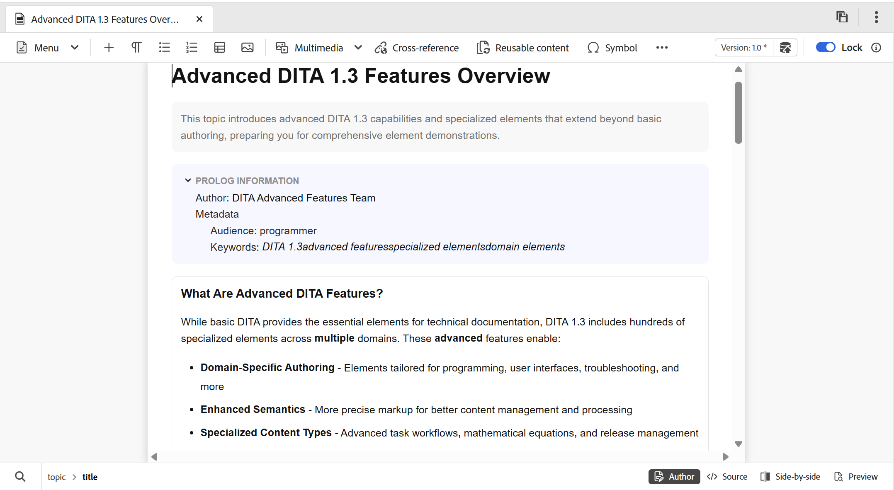
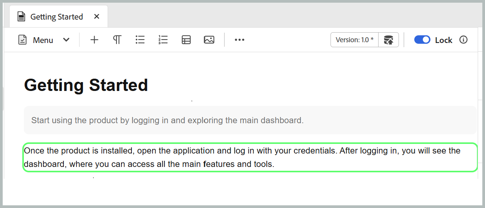
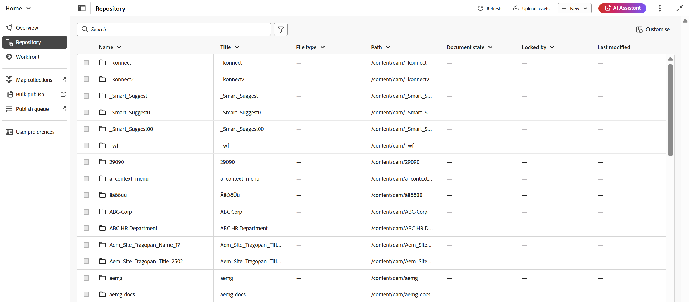
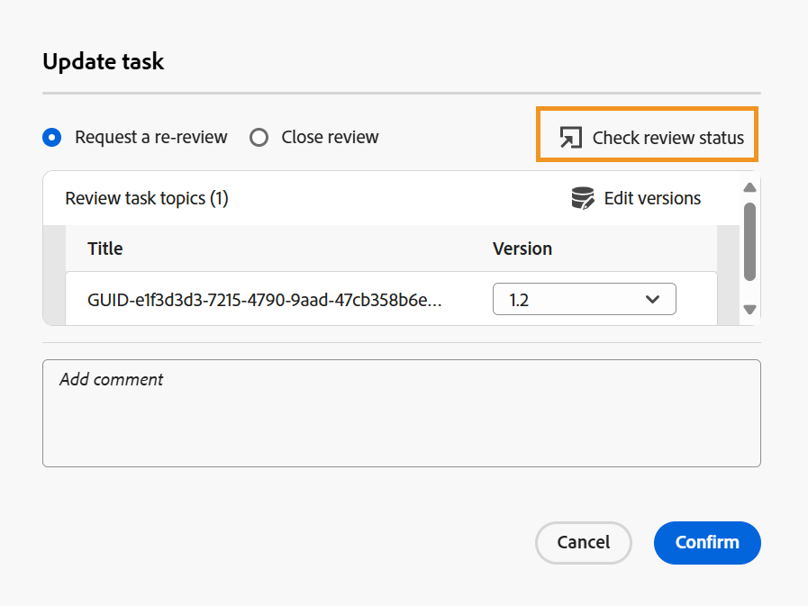

# Novità della versione 5.2.0 (maggio 2026)

Questo articolo descrive le funzioni nuove e migliorate introdotte con la versione 5.2.0 di Adobe Experience Manager Guides as a Cloud Service.

Per l&#39;elenco dei problemi risolti in questa versione, visualizzare [Problemi risolti nella versione 5.2.0](../release-info/fixed-issues-5-2-0.md).

Scopri le [istruzioni di aggiornamento per la versione 5.2.0](../release-info/upgrade-instructions-5-2-0.md).

## Introduzione a Editor 2.0

L’editor 2.0 (noto anche come nuovo editor) offre funzioni di authoring semplificate, che consentono di creare contenuti in modo più efficiente sia nelle modalità tag che in quelle diverse da tag, grazie a un’esperienza più intuitiva. Questa versione offre prestazioni migliorate, velocizza il caricamento delle pagine e semplifica le operazioni di modifica, anche per argomenti complessi e di grandi dimensioni. Offre inoltre una maggiore stabilità, colmando le principali lacune nell’authoring, in particolare per quanto riguarda la navigazione e il comportamento dei cursori. Inoltre, un’interfaccia moderna offre un’interfaccia utente aggiornata e intuitiva che bilancia le funzionalità con la facilità d’uso. Per ulteriori dettagli, visualizzare [Introduzione all&#39;editor](../user-guide/web-editor.md).

Ecco una panoramica video che evidenzia le funzionalità di Editor 2.0.

>[!VIDEO](https://video.tv.adobe.com/v/3484007)

Di seguito sono riportati i miglioramenti che rendono l’authoring più semplice ed efficiente.

### Interfaccia utente ed esperienza riprogettate

Un’interfaccia aggiornata migliora l’usabilità complessiva, rendendo la navigazione e l’authoring dei contenuti più intuitivi e coerenti.

- **CSS più ricco per gli elementi in modalità Creazione e Anteprima**: i CSS predefiniti migliorati per gli elementi consentono una migliore formattazione e una migliore coerenza visiva sia nelle modalità di creazione che in quelle di anteprima.

  {width="650"}

- **Supporto per tema scuro**: il supporto per un tema scuro nell&#39;area di modifica dei contenuti migliora l&#39;esperienza di authoring per gli utenti che preferiscono lavorare con un&#39;interfaccia scura.

  {width="650"}

- **Impostazioni dell&#39;editor a livello utente consolidate**: nuovo pannello delle impostazioni centralizzato che offre agli autori un migliore controllo sul comportamento dell&#39;editor, consentendo agli utenti di gestire le preferenze più facilmente da un&#39;unica posizione. Le opzioni di configurazione includono, possibilità di abilitare/disabilitare:

   - Spazi unificatori in modalità Creazione
   - Impostazioni di visibilità dei tag con attributi o senza attributi
   - Commenti XML in modalità Creazione
   - Menu di inserimento rapido per l&#39;inserimento di elementi nell&#39;editor

  {width="350"}

  Per ulteriori informazioni su come configurare le impostazioni dell&#39;editor, visualizzare [Impostazioni editor](../user-guide/config-editor-settings.md).

- **Migliore rappresentazione del contenuto condizionale in modalità Creazione**: il contenuto condizionale viene visualizzato più chiaramente in modalità Creazione, consentendo agli autori di identificare e gestire le varianti in modo più efficace. Per informazioni dettagliate, visualizza [Condizioni](../user-guide/web-editor-left-panel.md#conditions) nel pannello sinistro dell&#39;editor.

  {width="650"}

### Funzionalità di authoring migliorate

Offre strumenti migliorati e flessibilità per semplificare la creazione e la modifica dei contenuti nei flussi di lavoro.

- **Visualizza gli attributi insieme agli elementi in modalità tag**: gli autori possono ora visualizzare gli attributi degli elementi in modalità tag, offrendo maggiore visibilità e controllo sui contenuti strutturati. Per configurare questa funzionalità, visualizzare [Impostazioni editor](../user-guide/config-editor-settings.md).

  {width="650"}

- **Menu inserimento rapido**: consente di aggiungere elementi direttamente durante la modifica in modalità Creazione in corrispondenza del cursore senza passare alla barra degli strumenti. Gli elementi utilizzati di frequente possono anche essere configurati nella sezione Preferiti tramite le impostazioni dell’editor per un accesso più rapido. Per ulteriori dettagli, visualizzare [Modifica argomenti](../user-guide/web-editor-edit-topics.md).

  {width="650"}

- **Possibilità di visualizzare, modificare e inserire commenti XML in modalità Autore**: consente agli autori di visualizzare, modificare e inserire commenti XML direttamente in modalità Autore per una migliore visibilità all&#39;interno del contenuto. Per configurare questa funzionalità, visualizzare [Impostazioni editor](../user-guide/config-editor-settings.md).

  {width="650"}

- **Modalità affiancata**: consente la visualizzazione simultanea delle modalità Autore e Source, con entrambe le visualizzazioni che rimangono sincronizzate per facilitare il confronto, la modifica e la convalida delle modifiche al contenuto. Per ulteriori dettagli, visualizzare [Visualizzazioni editor](../user-guide/web-editor-views.md).

  {width="650"}

- **Miglioramento dell&#39;authoring delle tabelle**: migliora l&#39;esperienza complessiva di authoring delle tabelle con interazioni più intuitive ed efficienti per la creazione e la gestione delle tabelle.

   - Interazioni fluide e intuitive: inserimento semplificato di righe e colonne, con supporto della funzione di trascinamento della selezione per riordinare righe e colonne.
   - Barra degli strumenti contestuale: consente di accedere ad azioni specifiche della tabella, ad esempio formattazione, allineamento, unione e altre azioni aggiuntive direttamente all’interno della tabella.
   - Configurazione delle tabelle: puoi aggiungere più righe o colonne in un’unica azione, riducendo i passaggi ripetitivi e migliorando l’efficienza.

  {width="650"}

  Per ulteriori dettagli, visualizzare [Operazioni con le tabelle](../user-guide/web-editor-other-features.md#work-with-tables-in-the-new-editor).

### Prestazioni migliorate per argomenti di grandi dimensioni

Il nuovo editor offre un’esperienza di lavoro migliore con argomenti complessi e di grandi dimensioni, velocizzando il rendering dei contenuti, rendendo più affidabili le funzionalità di annullamento e ripristino e aggiungendo un marcatore sporco per indicare chiaramente le modifiche non salvate.

## Introduzione di un nuovo archivio sulla pagina Home e di un’esperienza di ricerca avanzata

L’archivio, ora accessibile direttamente dalla home page, funge da spazio centralizzato per migliorare la reperibilità di cartelle e file. Sono disponibili **il pannello di navigazione delle cartelle** dedicato e una **visualizzazione tabulare personalizzabile dell&#39;archivio**. La rinnovata esperienza di ricerca e filtro semplifica notevolmente la ricerca e l’individuazione dei file. Per ulteriori dettagli, visualizzare [Conoscere l&#39;interfaccia dell&#39;archivio](../user-guide/home-page-repository-view.md).

Nell’editor, l’esperienza di ricerca e filtro per i file è ora coerente con la pagina Home. Per visualizzare i risultati della ricerca viene introdotto un nuovo [pannello di ricerca](../user-guide/search-panel-explorer.md) che si trova nella parte inferiore dell&#39;interfaccia dell&#39;editor. Inoltre, il repository è ora rinominato in **Explorer** nell&#39;editor, consentendo di sfogliare cartelle e file come prima.

### Supporto per il filtro dello stato del documento

È inoltre possibile filtrare i risultati della ricerca nel repository in base allo stato corrente del documento dei file. Tramite il filtro dello stato del documento, è possibile limitare la ricerca utilizzando i valori di filtro disponibili definiti nel file `ui_config.json` all&#39;interno del profilo della cartella.

I valori di filtro predefiniti disponibili per lo stato del documento sono: Bozza, Modifica, In revisione, Approvato, Rivisto e Fine.

<!-- For details on customizing the default document state filters values, view [Configure document state filters](../install-conf-guide/conf-doc-state-filters.md).  -->

>[!NOTE]
>
> Se utilizzi impostazioni personalizzate per `ui_config.json`, assicurati di riprenderle prima dell&#39;aggiornamento. Dopo l’aggiornamento, rivedi e regola le impostazioni per allinearle alle modifiche introdotte nell’ultima versione.

### Icona miniatura per contenuti multimediali

Tutti i file multimediali vengono visualizzati con icone di miniatura che semplificano l&#39;identificazione visiva e l&#39;individuazione delle immagini nel **repository**. Questo miglioramento si applica anche alla ricerca di file nel **pannello di ricerca**, per consentire di distinguere rapidamente le risorse multimediali da altri tipi di file.

## Introduzione alla ricerca in modalità Source in Trova e sostituisci

Experience Manager Guides ha introdotto diversi miglioramenti alla funzione Trova e sostituisci disponibile nel pannello a sinistra dell’interfaccia dell’editor. Oltre a un&#39;interfaccia utente migliorata per una migliore usabilità, questa versione introduce un nuovo interruttore **Usa modalità origine** nel pannello **Trova e sostituisci**.

L’attivazione di questa modalità consente di eseguire una ricerca globale non solo sul contenuto visibile, ma anche sul contenuto sorgente sottostante (struttura XML, inclusi elementi, tag e valori di attributi) della stringa cercata. Questa modalità garantisce una ricerca completa nell’intero contenuto.

{width="650"}

In questa modalità è possibile applicare i filtri per restringere la ricerca in base al tipo di file, allo stato del documento, alla data dell&#39;ultima modifica e altro ancora. Puoi anche scaricare un rapporto CSV dettagliato dopo aver eseguito l’operazione Sostituisci tutto, che fornisce un’istantanea di tutte le azioni di sostituzione eseguite insieme al loro stato di esito positivo e negativo.

Per ulteriori dettagli, visualizzare la sezione [Trova e sostituisci](../user-guide/web-editor-left-panel.md#find-and-replace) in _Pannello sinistro nell&#39;editor_.

>[!NOTE]
>
> Per **Utilizzare la funzionalità della modalità di origine** nel pannello Trova e sostituisci, la reindicizzazione deve prima essere completata.

## Esperienza di esplorazione file e cartelle migliorata

Questa versione introduce un’interfaccia più pulita e intuitiva per la navigazione dei file e dei percorsi delle cartelle in Experience Manager Guides.

Durante l&#39;esplorazione dei file, la finestra di dialogo **Seleziona file** rinnovata presenta ora un layout a schede con due visualizzazioni: **Archivio** per l&#39;esplorazione dell&#39;intero archivio dei contenuti in formato tabulare e **Raccolte** per l&#39;accesso rapido ad argomenti, mappe e immagini utilizzati di frequente.

{width="650"}

I miglioramenti principali includono:

- Visualizzazione tabulare di file e cartelle per la navigazione organizzata.
- Breadcrumb e pannello di navigazione delle cartelle per spostarsi facilmente all’interno delle cartelle.
- Supporto per la selezione di più file per contenuti riutilizzabili, riferimenti ad argomenti, schemi, predefiniti di output (utilizzando DITAVAL) e Workfront.
- Visualizzate in anteprima i file selezionati per una facile revisione; per selezioni multiple, visualizzate in anteprima tutti i file e rimuovetene alcuni dal pannello Anteprima, se necessario.
- Opzioni di ricerca e filtro per limitare i risultati per nome, titolo, tipo di file, stato del documento e tag.

La finestra di dialogo **Seleziona percorso** offre anche una visualizzazione struttura migliorata per la navigazione delle cartelle, garantendo un modo più organizzato ed efficiente di selezionare i percorsi nell&#39;archivio dei contenuti.

{width="350"}

Per ulteriori dettagli, visualizzare [Esplorazione di file e cartelle nella sezione di Experience Manager Guides](../user-guide/web-editor-other-features.md#browse-files-and-folders-in-experience-manager-guides) in _Altre funzionalità nell&#39;editor_.

## Miglioramenti all’authoring

In questa versione sono stati apportati i seguenti miglioramenti all’authoring:

### Accedere al percorso e all’UUID dei riferimenti nei file dal pannello Proprietà contenuto

Ora puoi utilizzare **Percorso collegamento** per visualizzare il percorso relativo del riferimento selezionato e **Collega UUID** per visualizzarne l&#39;identificatore univoco dal pannello delle proprietà del contenuto. Puoi anche copiare il percorso assoluto completo e l’UUID associato direttamente dall’interfaccia utilizzando le icone accanto a Percorso collegamento e UUID collegamento, per tracciare e riutilizzare più facilmente le risorse collegate.

Per ulteriori dettagli, visualizzare [Proprietà contenuto](../user-guide/web-editor-right-panel.md#content-properties).

### Indicatore della copia di lavoro per le modifiche ai metadati

Qualsiasi modifica ai campi metadati disponibili in **Proprietà file** o applicata nel backend attiverà anche l&#39;asterisco (*) nella versione del documento. Una versione del documento è contrassegnata come _dirty (*)_ ogni volta che si aggiungono, eliminano o modificano campi di metadati predefiniti o personalizzati. Per evitare che gli aggiornamenti dei metadati generati dal sistema influiscano su questo indicatore, gli amministratori possono configurare un elenco da ignorare per le proprietà dei metadati. Per informazioni dettagliate su come configurare le proprietà dei metadati, visualizzare [Configurare l&#39;elenco di proprietà dei metadati da ignorare](../install-conf-guide/conf-metadata-prop.md).

### Miglioramenti al pannello di convalida Schematron

Sono stati apportati i seguenti miglioramenti all’interfaccia utente di Schematron per migliorare la chiarezza, l’usabilità e i risultati di convalida:

- Nel pannello Convalida, quando non viene aggiunto alcun file Schematron, viene visualizzato un messaggio a stato vuoto che fornisce maggiore chiarezza e direzione per i passaggi successivi.

  {width="350"}

- Quando vengono aggiunti più file Schematron, questi vengono organizzati in un pannello a soffietto consolidato, fornendo una migliore visibilità nei file Schematron configurati.

  {width="350"}

- In base all&#39;attributo di ruolo definito nel file Schematron, i risultati della convalida sono ora classificati come: `Fatal`, `Error`, `Warn` o `Info`. Ogni categoria include un conteggio visibile insieme a una descrizione contestuale per un’interpretazione più chiara.

  {width="350"}

Per ulteriori dettagli sull&#39;utilizzo dei file Schematron in Experience Manager Guides, visualizzare [Supporto per i file Schematron](../user-guide/support-schematron-file.md).

### Le copie per lingua di traduzione sono ora disponibili nel pannello a destra dell’interfaccia dell’editor

Una nuova sezione **Traduzioni** è ora disponibile nel pannello a destra in *Proprietà file* nell&#39;editor. Questa sezione fornisce accesso diretto a tutte le copie per lingua disponibili per la risorsa attualmente aperta (mappa, argomento, immagine, ecc.). Non è più necessario passare all’interfaccia utente di Assets per visualizzare o accedere a queste copie per lingua.

{width="350"}

Per ogni copia per lingua, puoi passare il cursore sul file per individuarne il percorso nell’archivio o selezionarlo semplicemente per aprirlo nell’editor. Oltre ad aprire i file, è possibile eseguire molte azioni utilizzando il menu **Opzioni**. Alcune delle azioni che puoi eseguire includono Modifica, Anteprima, Copia UUID, Copia percorso, Aggiungi a raccolte e Proprietà.

Per ulteriori dettagli, visualizza il [pannello destro nell&#39;editor](../user-guide/web-editor-right-panel.md#file-properties).

### Aggiorna argomenti o mappa in modalità Anteprima

>[!NOTE]
>
>Questo comportamento si applica solo al vecchio editor. Nel nuovo editor, il contenuto di anteprima viene aggiornato automaticamente.

Presentazione della nuova funzionalità **Aggiorna** per le mappe già aperte in modalità Anteprima. Con questa nuova funzione, è possibile aggiornare facilmente il contenuto dell&#39;intera mappa o dei singoli argomenti presenti al suo interno.

- Per aggiornare l&#39;intera mappa (inclusi tutti gli argomenti), nell&#39;angolo in alto a sinistra dell&#39;editor verrà introdotto un nuovo pulsante **Aggiorna**.

  {width="600"}

- Per aggiornare il contenuto di singoli argomenti, nel menu di scelta rapida viene introdotta una nuova opzione **Aggiorna argomento**.

  {width="600"}

Per ulteriori dettagli, visualizzare [le funzionalità dell&#39;editor di mappe](../user-guide/map-editor-advanced-map-editor.md).

### Conteggio delle parole per argomenti e mappe

È ora possibile tenere traccia del numero di parole presenti in un file mappa o argomento. Nel nuovo campo **Conteggio parole** nel pannello di destra verrà visualizzato il numero totale di parole presenti in un argomento (o mappa), dove le parole separate da spazi vengono conteggiate come singole parole. Si aggiorna automaticamente ogni volta che si salvano le modifiche. Per i riferimenti incrociati, è incluso solo il testo visualizzato, mentre le chiavi sono escluse.

{width="350"}

Per ulteriori dettagli, visualizzare il [pannello destro nell&#39;editor](../user-guide/web-editor-right-panel.md#file-properties).

### Identificare e correggere facilmente gli ID duplicati negli argomenti e nelle mappe nella visualizzazione Autore

Experience Manager Guides ora include un pulsante **ID duplicati** nell&#39;editor per identificare e correggere rapidamente gli ID duplicati presenti in un singolo argomento o mappa. Quando vengono rilevati ID duplicati, questo pulsante viene visualizzato nell&#39;angolo inferiore sinistro dell&#39;interfaccia dell&#39;editor nella visualizzazione **Autore**. Quando selezioni il pulsante, in un messaggio a comparsa viene visualizzato un elenco di tutte le istanze con ID duplicati. Selezionando un’istanza viene evidenziato il contenuto corrispondente nell’argomento o nella mappa, consentendo di individuare e correggere gli ID duplicati dal pannello di destra.

Per ulteriori dettagli, visualizzare [Altre funzionalità nell&#39;editor](../user-guide/web-editor-other-features.md).

{width="350"}

### Miglioramenti all’archivio e ai filtri per i rapporti

Il filtro **Bloccato da** nei filtri Avanzati dell&#39;archivio e il filtro **Autore** nella mappa DITA ora caricano gli elenchi utente gradualmente durante lo scorrimento, anziché tutti contemporaneamente. Questo caricamento impaginato migliora la velocità e rende più efficiente e semplice l’utilizzo di set di dati per utenti di grandi dimensioni.

### Cerca citazioni in tutti i campi del diario

È ora possibile cercare le citazioni in tutti i campi di Journal, ad esempio *Titolo*, *Titolo diario*, *Autore*, *Anno*, *Volume*, *Numero* e *Pagine*, utilizzando l&#39;opzione **Qualsiasi campo** nella finestra di dialogo **Aggiungi citazione**. La ricerca restituisce la citazione corrispondente più vicina in base al testo immesso.

Per ulteriori dettagli sull&#39;aggiunta di citazioni in Experience Manager Guides, visualizzare [Aggiungere e gestire citazioni nel contenuto](../user-guide/web-editor-apply-citations.md).

{width="350"}

### Ora le impostazioni sono state rinominate in impostazioni Workspace e sono accessibili dalla homepage

Per migliorare la navigazione e l’usabilità, sono stati introdotti i seguenti miglioramenti:

- **Impostazioni** nel menu **Altre azioni** dell&#39;editor è stato rinominato in **Impostazioni Workspace**.
- Il menu **Altre azioni** (il menu a tre punti), in precedenza disponibile solo nell&#39;interfaccia della console Editor e Mappa, è ora accessibile dalla [homepage](../user-guide/intro-home-page.md).

  

### Indicizzazione migliorata per suggerimenti avanzati nell’Assistente IA

Ora è possibile tracciare facilmente lo stato di ogni tentativo di indicizzazione di suggerimenti avanzati in AI Assistant con nuovi indicatori di stato: Indicizzazione completata, Non sincronizzato, In corso e Indicizzazione non riuscita. L’ultima marca temporale di indicizzazione viene ora registrata a livello del profilo della cartella per una migliore tracciabilità. Inoltre, quando si specifica una cartella o un percorso di file per l’indicizzazione, vengono applicate le restrizioni per le cartelle padre-figlio.

Per ulteriori dettagli, visualizzare [Configurare l&#39;Assistente di intelligenza artificiale per la Guida e l&#39;authoring](../install-conf-guide/conf-profiles.md#configure-ai-assistant-for-smart-help-and-authoring-only-for-cloud-service).

## Miglioramenti della revisione

I seguenti miglioramenti alla funzione Revisione sono stati apportati come parte di questa versione:

### Promemoria automatici per le attività di revisione

È ora possibile abilitare **Promemoria automatici** per pianificare le notifiche di AEM e i promemoria e-mail per i revisori, sia prima della scadenza di un&#39;attività di revisione che dopo la scadenza. È possibile configurare più promemoria in ogni caso, con promemoria scaduti inviati in una sequenza definita e promemoria scaduti attivati dopo che l&#39;attività è stata contrassegnata come scaduta, in base alla pianificazione del promemoria configurata. Per ulteriori dettagli, visualizzare [Invia argomenti per la revisione](../user-guide/review-send-topics-for-review.md).

### Cronologia delle versioni

I revisori possono ora accedere alla cronologia delle versioni per gli argomenti in revisione, consentendo loro di visualizzare e confrontare le versioni precedentemente esaminate e aggiornate dello stesso argomento nelle attività di revisione precedenti. In questo modo i revisori possono convalidare le modifiche apportate dai cicli di revisione precedenti e mantenere la continuità esaminando commenti, etichette e altri dettagli correlati all&#39;interno del contesto di revisione corrente. Per ulteriori dettagli, visualizzare la cronologia delle versioni [per il revisore](../user-guide/review-topics.md#version-history-for-the-reviewer).

### Accedere allo stato delle attività di revisione direttamente dal pannello Revisione

In qualità di iniziatore di un’attività di revisione, ora puoi controllare lo stato dell’attività di revisione direttamente dal pannello Revisione. Con gli ultimi miglioramenti, la finestra di dialogo **Aggiorna attività** nel pannello Revisione include una nuova opzione **Controlla stato revisione**. Selezionando questa opzione si passa direttamente al dashboard di revisione, in cui è possibile visualizzare lo stato dell&#39;attività per ogni revisore, consentendo un accesso più rapido all&#39;avanzamento dell&#39;attività senza dover cambiare contesto.

Per ulteriori dettagli, visualizzare [Richiedere un riesame o chiudere un&#39;attività di revisione come autore](../user-guide/review-close-review-task.md).

{width="350"}

### Assegnazione del revisore in base alla selezione del progetto attivo

- L’assegnazione di un revisore a un’attività di revisione dipende ora dalla selezione di un progetto attivo. Il campo **Assegna a** nella pagina *Crea attività di revisione* rimane disabilitato fino a quando non viene selezionato un progetto attivo. Dopo aver selezionato un progetto, il campo **Assegna a** è attivato e contiene un elenco solo degli utenti e dei gruppi di utenti associati al progetto. In questo modo le attività di revisione vengono assegnate solo a membri validi del progetto e si evita la selezione involontaria di revisori.

  

- Il campo **Assegna a** ora supporta la ricerca automatica e consente di individuare rapidamente utenti o gruppi di utenti digitando del testo.

Insieme, questi miglioramenti rendono la selezione dei revisori più precisa, efficiente e allineata ai flussi di lavoro di revisione specifici per il progetto.

Per ulteriori dettagli, visualizzare [Invia argomenti per la revisione](../user-guide/review-send-topics-for-review.md).

### Modifica attività di revisione in corso

È possibile aggiungere nuovi argomenti a un&#39;attività di revisione in corso (se non sono stati precedentemente inviati per la revisione) o rimuovere argomenti da un&#39;attività di revisione in corso senza influire sul flusso di lavoro di revisione. Nella pagina **Dettagli attività**, è sufficiente selezionare o deselezionare gli argomenti per modificare l&#39;elenco degli argomenti. I revisori ricevono notifiche (tramite AEM e e-mail) su eventuali modifiche apportate agli argomenti assegnati tramite AEM e notifiche e-mail. Per ulteriori dettagli, visualizzare [Invia argomenti per la revisione](../user-guide/review-send-topics-for-review.md).

{width="650"}

## Miglioramenti alla traduzione

In questa versione sono stati apportati i seguenti miglioramenti alla traduzione:

### Indicatore per risorse senza versione inviate per la traduzione

Durante la gestione delle traduzioni, è importante assicurarsi che tutte le versioni siano state salvate prima di inviarle per l’elaborazione. Per facilitare questa fase, Experience Manager Guides fornisce ora un chiaro indicatore per gli argomenti in cui sono state salvate modifiche ma non sono ancora presenti versioni.

Se un file contiene modifiche senza versione (non salvate come nuova versione nella mappa), accanto al file viene visualizzata un&#39;icona _info_ che indica che sono presenti aggiornamenti. Per concentrarti rapidamente su questi file, abilita l&#39;opzione **Mostra solo le risorse con modifiche senza versione** nel pannello Filtri.

Per ulteriori dettagli, visualizzare [Traduci documenti dalla console Mappa](../user-guide/translate-documents-web-editor.md).

{width="650"}

## Miglioramenti alla gestione delle risorse

Questa versione introduce i seguenti miglioramenti alla gestione delle risorse:

### Utilizzare la gerarchia dei file Flatten per scaricare mappe con nomi di file originali e metadati associati

Ora puoi utilizzare l’opzione Flatten file hierarchy per scaricare una mappa con il suo nome file originale. Inoltre, il pacchetto scaricato include un file `metadata.json`, rendendo i metadati associati facilmente accessibili e riutilizzabili al di fuori di Experience Manager Guides.

Per ulteriori dettagli sul download di file in Experience Manager Guides, visualizzare [Scarica file](../user-guide/authoring-download-assets.md).

### Le proprietà dei metadati non sono più modificabili per i file di sola lettura

Con questa versione, quando l&#39;impostazione `Disable edit without locking the file` è abilitata, le proprietà del file non possono più essere modificate se un file è in modalità **Sola lettura**.

Questa limitazione si applica a tutti i punti di ingresso in cui è possibile modificare le proprietà per i file DITA e Markdown, tra cui:

- Il **pannello a destra** dell&#39;interfaccia dell&#39;editor
- Opzione **Proprietà** nel menu di scelta rapida del file
- Il rapporto metadati di una mappa
- Interfaccia utente di Assets

Per le risorse non DITA (come immagini e file multimediali), le proprietà dei metadati rimangono modificabili anche in modalità di sola lettura.

Se un file è di sola lettura, è necessario estrarlo prima di apportare modifiche alle proprietà. Questa modifica applica controlli delle autorizzazioni più severi e garantisce che gli aggiornamenti delle proprietà seguano le stesse regole di estrazione e blocco delle modifiche al contenuto.

### Usa regex per abilitare o disabilitare la post-elaborazione

Ora puoi utilizzare regex per abilitare o disabilitare la post-elaborazione per le cartelle. Questo miglioramento consente agli amministratori di definire regole di post-elaborazione da applicare a più cartelle o gerarchie di cartelle intere utilizzando una singola configurazione, invece di specificare percorsi di cartelle individuali.

Per ulteriori dettagli, visualizzare [Utilizzare regex per abilitare o disabilitare la post-elaborazione](../install-conf-guide/conf-folder-post-processing.md).

- Eseguire l’elaborazione delle risorse a livello di cartella e di singolo file
- Per filtrare le risorse, scegli tipi di risorse specifici, ad esempio argomenti, mappe, Markdown, HTML/CSS, DITAVAL o altri file supportati, in modo da elaborare solo i file necessari.
- Applica filtri basati sulla data per limitare l’ambito di elaborazione per un intervallo temporale specificato.
- Rielabora le risorse direttamente utilizzando la nuova opzione (**Rielabora risorse**) disponibile nel menu di scelta rapida dei file e delle cartelle nella vista Archivio e nel pannello Esplora risorse.

Per ulteriori dettagli sull&#39;elaborazione delle risorse, visualizzare [Elabora risorse](../user-guide/asset-processor.md).

### Pulizia automatizzata dell&#39;albero B per prestazioni ottimali

Per mantenere l&#39;efficienza del sistema e prevenire la congestione delle risorse, un nuovo processo di background ripulisce regolarmente gli alberi B a livello di sistema. In questo modo, le risorse che non esistono più o che sono state aggiunte temporaneamente non occupano spazio superfluo.

Il sistema identifica in modo intelligente i candidati per la pulizia ed esegue la rimozione automatica. Inoltre, questa funzione è configurabile e consente agli amministratori di controllarne il comportamento in base alle esigenze operative.

Per ulteriori dettagli, visualizzare [Configura pulizia albero B](../install-conf-guide/conf-btree-cleanup.md).

### Gestione migliorata delle mappe DITA con un numero elevato di chiavi

È ora possibile lavorare senza problemi con le mappe DITA che contengono un numero elevato di chiavi. Questo miglioramento garantisce un caricamento più rapido e prestazioni migliori, semplificando la gestione di mappe complesse senza interruzioni.

Dopo l’aggiornamento della build, il sistema potrebbe notare un aumento temporaneo del carico, che causa un ritardo nella post-elaborazione dei nuovi dati caricati. Ciò è dovuto all&#39;esecuzione in background di uno script in esecuzione una tantum automatico. Al termine dello script, le prestazioni del sistema torneranno alla normalità.

### Elaborazione delle risorse migliorata

- È stato introdotto un processo automatizzato per mantenere aggiornate le risorse in `/content/dam`. Il sistema attiva la rielaborazione delle risorse ogni 15 minuti. Durante ogni ciclo, le risorse aggiunte o non elaborate nell’intervallo di 15 minuti più recente vengono prelevate e rielaborate, migliorando l’efficienza e la coerenza nell’archivio dei contenuti.
- Eseguire l’elaborazione delle risorse a livello di cartella e di singolo file
- Per filtrare le risorse, scegli tipi di risorse specifici, ad esempio argomenti, mappe, Markdown, HTML/CSS, DITAVAL o altri file supportati, in modo da elaborare solo i file necessari.
- Applica filtri basati sulla data per limitare l’ambito di elaborazione per un intervallo temporale specificato.
- Rielabora le risorse direttamente utilizzando la nuova opzione (**Rielabora risorse**) disponibile nel menu di scelta rapida dei file e delle cartelle nella vista Archivio e nel pannello Esplora risorse.

Per informazioni dettagliate sull&#39;elaborazione delle risorse, visualizzare [Elabora risorse](../user-guide/asset-processor.md).

## Miglioramenti alla pubblicazione

In questa versione sono stati apportati i seguenti miglioramenti alla pubblicazione:

### Configurare rappresentazioni di immagini personalizzate per predefiniti di output specifici

È ora possibile configurare diverse rappresentazioni di immagini per singoli predefiniti di output nello stesso tipo di output utilizzando l&#39;attributo `outputName` in `renditionmapping.xml`. Questo miglioramento offre maggiore flessibilità quando si pubblicano contenuti che richiedono risoluzioni di immagine diverse per scenari diversi. Ad esempio, potresti desiderare un’immagine ad alta risoluzione per l’output principale di HTML5 mentre utilizzi una miniatura più piccola per un predefinito leggero.

Per ulteriori dettagli, visualizzare [Gestire la rappresentazione dell&#39;immagine nella generazione dell&#39;output](../install-conf-guide/conf-output-generation.md#handle-image-rendition-during-output-generation).

### Scaricare i registri per l’output generato

Durante la generazione dell&#39;output e la visualizzazione dei registri, è ora disponibile un nuovo pulsante **Scarica registri** che consente di scaricare i registri nel dispositivo locale per accedervi e rivederli più facilmente.

### Variabili di lingua per riferimenti incrociati nell’output PDF nativo

Quando si pubblica l&#39;output di PDF nativo, è possibile utilizzare [variabili di linguaggio](../native-pdf/native-pdf-language-variables.md) per tradurre testo di rimando statico come _Vedere nel capitolo_ o _Vedere a pagina_. La variabile utilizza il linguaggio definito nell&#39;argomento tramite l&#39;attributo `xml:lang`.

Per informazioni dettagliate sulla configurazione del predefinito di output del PDF nativo e delle impostazioni dei riferimenti incrociati, visualizzare [Predefinito di output del PDF nativo](../web-editor/native-pdf-web-editor.md).

### Supporto per la mappatura dei componenti a livello di elemento nella pubblicazione in AEM Sites (utilizzando la mappatura dei componenti compositi)

Experience Manager Guides ora supporta la mappatura dei componenti a livello di elemento nell’output di AEM Sites (utilizzando la mappatura dei componenti compositi), fornendo ai team un controllo preciso sul rendering degli elementi DITA utilizzando `componentmapping.json`. Mappando `topicref`, titoli, immagini, tabelle e altro ancora ai componenti core di AEM appropriati, si ottiene una struttura più pulita invece di tutte le impostazioni predefinite del componente Testo. Ciò si traduce in prestazioni migliori e sfrutta esperienze Sites più ricche e moderne.

Per ulteriori dettagli, visualizzare [Mappatura componenti per AEM Sites](../install-conf-guide/component-mapping.md).

## Nuova esperienza linea di base introdotta in Experience Manager Guides

La gestione di baseline grandi e complesse è ora più veloce, più stabile e più semplice da scalare con la **nuova esperienza di base**, basata su un&#39;architettura di base riprogettata. Questo aggiornamento affronta le problematiche di prestazioni e affidabilità che si pongono da tempo, preservando al contempo i flussi di lavoro esistenti.

Disponibile come miglioramento della versione beta, questo aggiornamento fornisce una soluzione ai punti critici più comuni, quali il caricamento lento, gli stati di base incoerenti e la gestibilità limitata, offrendo un’esperienza di base più rapida, stabile e prevedibile, con un ulteriore supporto per l’automazione e le operazioni di base su larga scala. I principali miglioramenti sono i seguenti:

- Prestazioni e scalabilità migliorate
- Maggiore coerenza nell’interfaccia utente e nel back-end
- Filtro, navigazione e visibilità delle dipendenze espansi

Per informazioni dettagliate, visualizzare [Nuova esperienza linea di base (Beta) in Experience Manager Guides](../user-guide/web-editor-baseline-v2.md).

## Miglioramenti API

Con questa versione sono stati apportati i seguenti miglioramenti API:

- Vengono introdotte nuove API per creare un nuovo progetto di traduzione e tracciarne lo stato. Queste API consentono di automatizzare il processo di traduzione, riducendo lo sforzo manuale e migliorando l’efficienza. Per informazioni dettagliate, visualizza [Crea progetto di traduzione](../api-reference/translation-project.md)
- API di elaborazione delle risorse migliorate con una migliore funzionalità di filtro per file e cartelle. Per ulteriori dettagli, visualizzare [Elabora risorse](../api-reference/bulk-assets-processing.md).
- È disponibile una nuova API per monitorare lo stato di post-elaborazione di singole risorse e cartelle. Questa funzione è particolarmente utile per i team che utilizzano flussi di lavoro automatizzati, in cui la pubblicazione deve avvenire solo dopo che il contenuto è stato completamente elaborato. L’API offre un modo affidabile per confermare la preparazione, riducendo il rischio di errori di pubblicazione causati da un’elaborazione incompleta. Inoltre, con l’introduzione di questa API, gli eventi di post-elaborazione delle risorse non verranno attivati automaticamente. Gli amministratori possono ora abilitare questo evento tramite un&#39;impostazione in `fmdita config manager`.
Per informazioni dettagliate, visualizza [API per tenere traccia dello stato di post-elaborazione di singole risorse e cartelle](../api-reference/track-post-processing-status.md) e [Impostazioni del gestore eventi di post-elaborazione in Gestione configurazione fmdita](../api-reference/post-process-event.md)

## Presentazione dei contenuti di formazione e apprendimento dei prodotti in Experience Manager Guides

La funzionalità di contenuto **Formazione e apprendimento del prodotto** in Experience Manager Guides consente ai team di formazione e ai designer di formazione di creare corsi di eLearning interattivi direttamente dall&#39;interfaccia di Experience Manager Guides.

Grazie all’authoring basato su modelli, ai componenti dei corsi interattivi e al supporto per le valutazioni, i team possono sviluppare contenuti di formazione di alta qualità in linea con i loro obiettivi organizzativi.

>[!NOTE]
> 
> La funzione del contenuto di apprendimento e formazione del prodotto rimane disabilitata per impostazione predefinita per tutte le istanze di Experience Manager Guides as a Cloud Service. Gli amministratori possono abilitare questa funzione a livello di profilo della cartella da **Impostazioni Workspace** > **Generale**.

Le funzionalità principali sono le seguenti:

- Gestione centralizzata dei contenuti di apprendimento
- Authoring basato su modelli
- Supporto per il riutilizzo dei contenuti
- Creazione e gestione della valutazione
- Flussi di lavoro di revisione basati sul web
- Gestione delle traduzioni leader del settore
- Pubblicazione multicanale tramite i formati di output standard SCORM e PDF

Per ulteriori dettagli, fare riferimento alle [guide introduttive](../learning-content/course-overview.md) e [guide alla configurazione](../lc-config-guide/introduction.md).