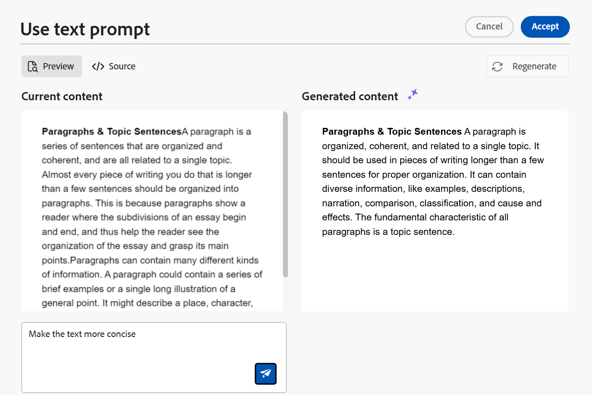

# Creare i documenti in modo intelligente con l&#39;Assistente IA (Beta)

Adobe Experience Manager Guides fornisce uno strumento di assistenza AI che consente di rendere l’authoring più intelligente e veloce. Utilizzando questo strumento, puoi visualizzare i suggerimenti avanzati per riutilizzare il contenuto dell’archivio dei contenuti esistente. Utilizza la funzione di prompt di testo per inviare un prompt e modificare il contenuto in base alle tue esigenze. Utilizza l’Assistente AI per convertire in modo intelligente un paragrafo in un elenco. È possibile creare una breve descrizione per l&#39;argomento corrente in base al contenuto selezionato. Questa funzione consente inoltre di migliorare e tradurre facilmente il contenuto selezionato.

>[!NOTE]
>
> Questa funzione di authoring è disponibile solo per gli argomenti DITA ed è accessibile solo dall&#39;interfaccia dell&#39;editor. Nella home page e nella console Mappa viene visualizzato solo il pannello **Guida**. Le opzioni disponibili nella funzione di authoring vengono configurate a livello di profilo della cartella dagli amministratori mediante le impostazioni dell’editor.

Dopo aver selezionato il testo in un argomento, puoi scegliere di eseguire una delle azioni dell’Assistente AI:

{width="300" align="left"}

## Suggerisci contenuti riutilizzabili

Utilizza la funzionalità **Suggerisci contenuto riutilizzabile**  per creare contenuti in modo coerente e preciso. È possibile selezionare il contenuto e Experience Manager Guides fornisce suggerimenti su come riutilizzare il contenuto esistente nell’archivio.
Ulteriori informazioni sull&#39;utilizzo di [suggerimenti avanzati basati sull&#39;intelligenza artificiale per l&#39;authoring dei contenuti](authoring-ai-based-smart-suggestions.md).

## Usa prompt di testo

Un prompt di testo è un’istruzione, una domanda o un’istruzione che guida l’Assistente AI nella generazione di una risposta specifica.

È possibile utilizzare un prompt di testo per modificare il contenuto. Ad esempio, puoi selezionare il contenuto dell&#39;argomento corrente e utilizzare il prompt *Rendere il testo più conciso*. Allo stesso modo, puoi utilizzare un prompt di testo per aggiungere un attributo al tag utilizzato nel contenuto selezionato.

1. Selezionare il testo per il quale si desidera utilizzare il prompt di testo.
1. Selezionare **Usa prompt di testo** dal pannello **Authoring**.
1. Chiedi conferma in uno dei modi seguenti:

   - Scegliete un prompt dai prompt suggeriti.
   - Modifica o modifica un prompt suggerito per creare un prompt personalizzato in base alle tue esigenze.

     >[!NOTE]
     >
     > I prompt suggeriti sono configurati in `ui_config.json` dall&#39;amministratore.

   - Immettere il prompt nella casella di testo.

1. Seleziona **Rigenera**  per un&#39;altra risposta o output in base alla richiesta.

1. (Facoltativo) Seleziona **Espandi**  per aprire l&#39;editor **Utilizza prompt di testo**. Vengono visualizzati il contenuto corrente e quello generato. Puoi modificare il contenuto del layout sorgente e controllare l’anteprima.

   

   >[!NOTE]
   >
   > Le risposte vengono generate in base al contenuto selezionato.

1. Puoi anche modificare il prompt nell’editor e rigenerare la risposta. Ad esempio, è possibile modificare il prompt per rendere il testo più conciso, impostandolo su circa 40 parole.

1. Puoi verificare l’origine del contenuto generato e modificarla, se necessario.

1. Seleziona **Accetta** per sostituire il contenuto selezionato nell&#39;argomento con il contenuto generato.
1. **Annulla**: annulla l&#39;azione del prompt di testo. Torna al pannello Authoring.

   >[!NOTE]
   >
   > Selezionando l&#39;icona **Ignora** nel pannello Authoring si ritorna allo stato iniziale dell&#39;Assistente AI.

## Migliorare i contenuti

Utilizza la funzione **Migliora contenuto** per migliorare la qualità del contenuto selezionato dell&#39;argomento corrente. Puoi selezionare il contenuto per il controllo ortografico, linguistico e grammaticale e suggerirne una versione migliore. Migliora anche la qualità delle frasi.

1. Seleziona il contenuto.
1. Seleziona **Migliora contenuto**  per trovare i suggerimenti per il contenuto migliorato.
1. Seleziona **Rigenera** per un altro suggerimento di contenuto migliorato.

1. (Facoltativo) Seleziona **Espandi** per aprire l&#39;editor di contenuti migliorato. Vengono visualizzati il contenuto corrente e quello generato. Puoi modificare il contenuto nel layout sorgente e anche controllare l’anteprima.

   

Accettate il suggerimento, modificate la risposta nella vista sorgente prima di accettarla, rigenerate il modello per un&#39;altra risposta o annullate l&#39;azione per tornare allo stato precedente.

## Creare collegamenti

Crea una breve descrizione dell&#39;argomento in base al contenuto selezionato in circa 30-50 parole. La breve descrizione consente agli utenti di cercare e trovare contenuti rilevanti.
Ad esempio, puoi elencare i requisiti di sistema e generare una breve descrizione di conseguenza.

1. Seleziona il contenuto.
1. Selezionare **Crea collegamento**  per creare una breve descrizione per l&#39;argomento corrente.
1. Selezionare **Accetta** per creare una nuova breve descrizione se questa non è già presente. Se è presente una breve descrizione, è necessario confermarla prima di sostituirla con la nuova breve descrizione.

È inoltre possibile eseguire le azioni seguenti:

- Seleziona **Rigenera** per generare un&#39;altra breve descrizione per il tuo argomento.
- Seleziona **Espandi** per aprire l&#39;editor **Crea collegamento**.

  

## Dettagli contenuto

Questa funzione converte in modo intelligente un paragrafo selezionato in un elenco.  Analizza il contenuto e crea un elenco logico di elementi. Non è necessario creare manualmente gli elementi. Ad esempio, se disponi di un paragrafo che descrive i passaggi necessari per creare un account utente, lo strumento può trasformarlo in un elenco dettagliato, eliminando la necessità di creare manualmente gli elementi uno alla volta.

1. Seleziona il contenuto.
1. Selezionare **Icona Dettaglio contenuto**  per convertire il contenuto selezionato in un elenco.
Lo strumento di authoring nel pannello Assistente AI converte il contenuto in modo intelligente in un elenco di elementi.
1. (Facoltativo) Seleziona **Espandi** per aprire l&#39;editor di **Dettagli contenuto**.
1. Quando l’elenco è pronto, accetta le modifiche nel contenuto generato. Il contenuto generato sostituisce quindi il contenuto selezionato.

## Tradurre il contenuto

Utilizza questa funzione intelligente per tradurre il contenuto selezionato nella lingua di destinazione, rendendolo molto utile quando si aggiungono note in lingue diverse. Ad esempio, puoi aggiungere contenuti in inglese e tradurli rapidamente in arabo.

Per tradurre il contenuto, effettua le seguenti operazioni:

1. Seleziona il contenuto da tradurre.
1. Seleziona **Traduci contenuto**  dal pannello **Authoring**.
1. Seleziona la lingua di destinazione dal menu a discesa. Il contenuto tradotto viene visualizzato nel pannello Assistente AI.

1. (Facoltativo) Seleziona **Espandi** per aprire l&#39;editor **Traduci contenuto**.
1. Puoi anche selezionare un’altra lingua dal menu a discesa e rigenerare il contenuto nella lingua scelta. Se ad esempio si seleziona Francese e quindi si seleziona **Rigenera**, il contenuto verrà tradotto in francese.

