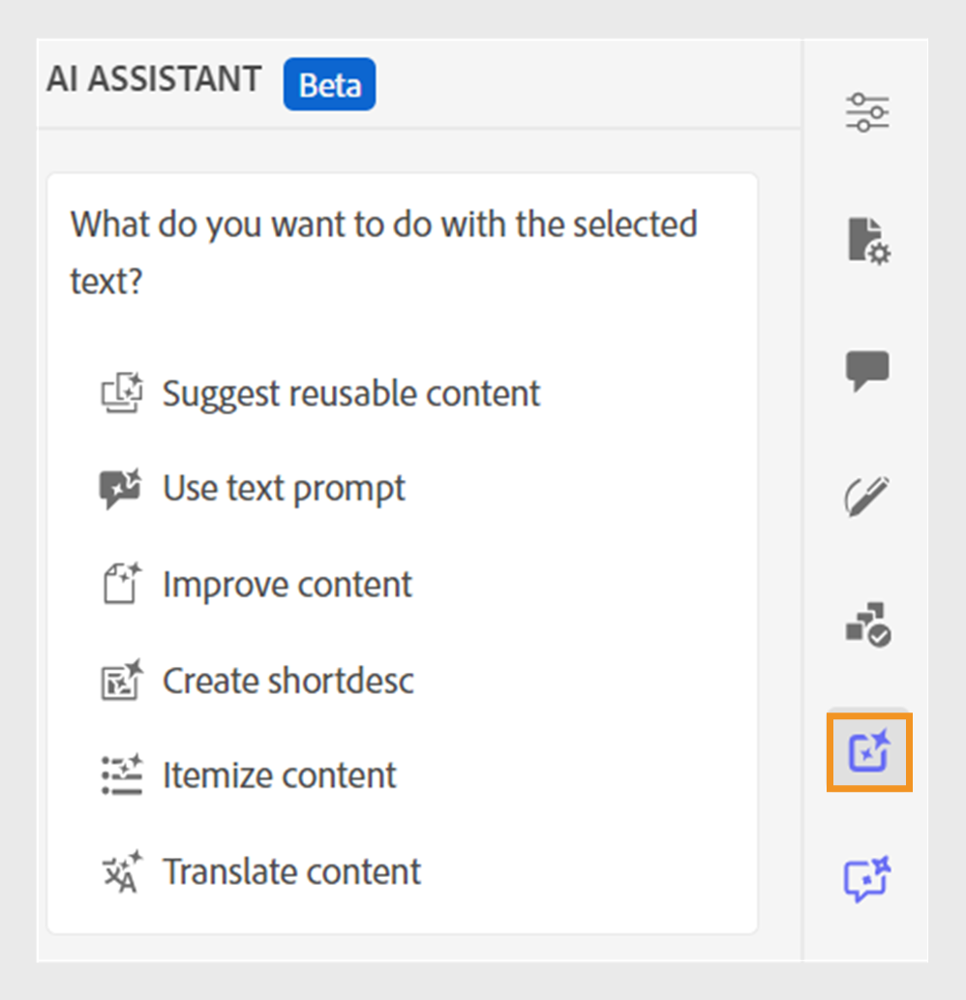

# Assistente IA (Beta)

L&#39;**Assistente AI** in Adobe Experience Manager Guides è uno strumento potente e basato sull&#39;intelligenza artificiale progettato per migliorare la produttività tramite le funzioni di creazione e guida intelligente. Riunisce due solide funzionalità di intelligenza artificiale, **Authoring** e **Guida**, nell&#39;interfaccia di Experience Manager Guides, consentendo di creare contenuti e accedere alle informazioni dalla documentazione di Experience Manager Guides in modo più rapido ed efficiente.

>[!NOTE]
>
> La funzione Assistente IA è attualmente disponibile per Adobe Experience Manager Guides as a Cloud Service.

La funzionalità **Authoring** nell&#39;Assistente di intelligenza artificiale rende il processo di authoring più intelligente e veloce. Offre funzionalità quali la generazione di suggerimenti intelligenti per il riutilizzo dei contenuti, la traduzione dei contenuti, il miglioramento della qualità dei contenuti e altro ancora, tutto in base al contenuto selezionato. Questa funzione migliora l’esperienza complessiva di authoring e la produttività degli autori.

Per ulteriori dettagli, visualizzare [Authoring](./ai-assistant-right-panel.md).

La funzionalità **Help** nell&#39;Assistente di intelligenza artificiale è uno strumento intuitivo basato su chat progettato per aiutarti a comprendere meglio Experience Manager Guides, risolvere i problemi e cercare informazioni nella documentazione di Adobe Experience Manager Guides. Anziché eseguire ricerche nelle guide utente e nei documenti di riferimento, è possibile utilizzare la funzionalità **Guida** per trovare rapidamente risposte pertinenti alle query. Ciò consente di risparmiare tempo e di concentrarsi sulla creazione dei contenuti, con conseguente aumento della produttività e dell&#39;efficienza.

Per ulteriori dettagli, visualizzare la [Guida](./ai-based-smart-help.md).

## Introduzione all’Assistente IA

Quando utilizzi **AI Asistant** per la prima volta, ti viene richiesto di inviare il consenso prima di utilizzare le funzionalità di Experience Manager Guides Generative AI.

Per avviare l’Assistente IA, effettua le seguenti operazioni:

1. Accedi a Experience Manager Guides
1. Nella home page, selezionare **Assistente AI** dall&#39;alto.   Assicurati che la funzione Assistente AI sia abilitata dall’amministratore.

   La pagina dell&#39;Assistente AI viene visualizzata evidenziandone le caratteristiche chiave, il collegamento alle linee guida utente e un pulsante **Inizia**.

   

1. Leggere attentamente le linee guida per l&#39;utente, quindi selezionare **Inizia** per avviare l&#39;Assistente IA.

**Argomenti correlati**

[Domande frequenti sulla sicurezza di Assistente IA](./ai-assistant-faq.md)

[Comunicazioni di Adobe Experience Manager Guides Generative AI](./adobe-generative-ai-disclosures.md)

[Configurare l’Assistente AI per la guida e l’authoring avanzati](../cs-install-guide/conf-smart-suggestions.md)
