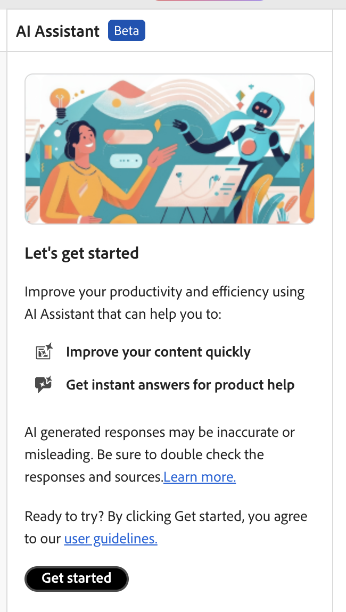

# Assistente IA (Beta)

L&#39;**Assistente AI** in Adobe Experience Manager Guides è uno strumento potente e basato sull&#39;intelligenza artificiale progettato per migliorare la produttività tramite le funzioni di smart help, authoring e assegnazione tag. In modalità **Standard**, riunisce due solide funzionalità di intelligenza artificiale: **Authoring** e **Guida** nell&#39;interfaccia di Experience Manager Guides, consentendo di creare contenuti e accedere alle informazioni dalla documentazione di Experience Manager Guides in modo più rapido ed efficiente. In modalità **Agente**, l&#39;Assistente AI offre invece **Applicazione di tag avanzati**, che consente di richiedere, tramite una finestra di messaggio di richiesta, i consigli sui tag per il contenuto e di applicarli in uno o più argomenti.

>[!NOTE]
>
> La funzione Assistente IA è attualmente disponibile per Adobe Experience Manager Guides as a Cloud Service.

## Modalità Assistente AI

>[!NOTE]
>
>Per abilitare l’Assistente AI in modalità Agentic per il tuo ambiente, contatta il Customer Success Team.

L&#39;Assistente IA è disponibile in due modalità: **Agentic** e **Standard**. Gli amministratori possono scegliere tra le due modalità dalla sezione **Assistente AI** della scheda **Generale** in **Impostazioni Workspace**. Il pannello Assistente AI rimane lo stesso in entrambe le modalità nell’editor, ma le funzionalità disponibili al suo interno differiscono:

* La modalità **Agentic** utilizza l&#39;abilità **Tag avanzati** di Adobe CX Enterprise Coworker per analizzare il contenuto e consigliare tag rilevanti in base alla tassonomia della tua organizzazione.
* La modalità **Standard** fornisce l&#39;esperienza dell&#39;Assistente di intelligenza artificiale esistente, con le schede **Help** e **Authoring** nel pannello dell&#39;Assistente di intelligenza artificiale.

## Modalità agente

### Applicazione di tag avanzati

L’Assistente IA in modalità Agentic rende più semplice e veloce l’assegnazione di tag al contenuto tramite una finestra di prompt conversazionale. Utilizzando l’abilità di assegnazione tag avanzata per gli agenti di Adobe CX Enterprise Coworker, l’Assistente AI consiglia tag rilevanti per il contenuto quando glielo chiedi. Per mantenere il controllo, rivedi i tag suggeriti e scegli di applicarli a uno o più argomenti, inclusi più argomenti all’interno di una mappa.

Per ulteriori dettagli, visualizzare [Introduzione all&#39;Assistente di IA per l&#39;analisi dei dati](./ai-assistant-agentic.md).

## Modalità standard

### Authoring

Quando l&#39;Assistente IA è configurato in modalità **Standard**, la funzionalità **Authoring** dell&#39;Assistente AI rende il processo di authoring più intelligente e veloce. Offre funzionalità quali la generazione di suggerimenti intelligenti per il riutilizzo dei contenuti, la traduzione dei contenuti, il miglioramento della qualità dei contenuti e altro ancora, tutto in base al contenuto selezionato. Questa funzione migliora l’esperienza complessiva di authoring e la produttività degli autori.

Per ulteriori dettagli, visualizzare [Authoring](./ai-assistant-right-panel.md).

### Aiuto

Quando l&#39;Assistente IA è configurato in modalità **Standard**, la funzionalità **Guida** offre un&#39;esperienza intuitiva basata su chat che consente di comprendere Experience Manager Guides, risolvere i problemi e trovare informazioni nella documentazione di Adobe Experience Manager Guides. Anziché eseguire ricerche nelle guide utente e nei documenti di riferimento, è possibile utilizzare la funzionalità **Guida** per trovare rapidamente risposte pertinenti alle query. Ciò consente di risparmiare tempo e di concentrarsi sulla creazione dei contenuti, con conseguente aumento della produttività e dell&#39;efficienza.

Per ulteriori dettagli, visualizzare la [Guida](./ai-based-smart-help.md).

## Introduzione all’Assistente IA in modalità Standard

Quando si utilizza **Assistente IA** in modalità Standard per la prima volta, viene richiesto di inviare il consenso prima di utilizzare le funzionalità di IA generativa di Experience Manager Guides.

Per avviare l’Assistente IA, effettua le seguenti operazioni:

1. Accedi a Experience Manager Guides.
1. Nella home page, selezionare **Assistente AI** dall&#39;alto. Assicurati che l’amministratore abbia abilitato la funzione Assistente AI nella modalità desiderata.

L&#39;Assistente AI visualizza le funzionalità chiave, il collegamento alle linee guida utente e un pulsante **Inizia**.

Leggere attentamente le linee guida per l&#39;utente, quindi selezionare **Inizia** per avviare l&#39;Assistente IA.

**Argomenti correlati**

[Domande frequenti sulla sicurezza di Assistente IA](./ai-assistant-faq.md)

[Comunicazioni di Adobe Experience Manager Guides Generative AI](./adobe-generative-ai-disclosures.md)

[Configurare l’Assistente AI per la guida e l’authoring avanzati](../cs-install-guide/conf-smart-suggestions.md)
