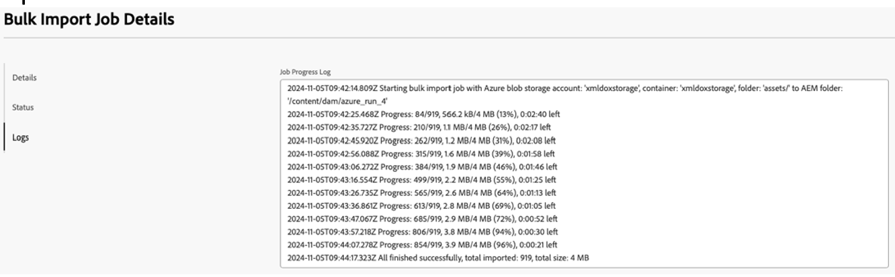

# Elaborazione risorse

L’elaborazione delle risorse è un flusso di lavoro fondamentale che garantisce la struttura, la convalida, l’indicizzazione e l’accessibilità delle risorse di contenuto all’interno della piattaforma. Con l&#39;evolversi delle esigenze di scalabilità e dei requisiti nativi per il cloud, l&#39;architettura ha subito una trasformazione significativa da modello di elaborazione gerarchica a thread singolo a sistema multithread distribuito e con supporto grafico.

## Flusso di lavoro di elaborazione risorse corrente

### Panoramica sull’elaborazione

Quando una risorsa viene importata in Experience Manager Guides, vengono eseguiti i seguenti passaggi di elaborazione sequenziali:

- Assegnazione chiave univoca: a ogni documento viene assegnato un identificatore univoco per garantire la tracciabilità e l&#39;integrità dei riferimenti.
- Analisi sintattica (parsing): il contenuto (ad esempio, XML DITA) viene analizzato in componenti strutturati per una comprensione a livello di sistema.
- Convalida: la convalida strutturale e dello schema garantisce la conformità agli standard dei documenti.
- Risoluzione dei riferimenti: i riferimenti incrociati (collegamenti, immagini, dipendenze) vengono risolti tra le risorse.
- Estrazione metadati: i metadati come titolo, autore e attributi personalizzati vengono estratti per l’indicizzazione e la ricerca.
- Rielaborazione in caso di modifica: la rielaborazione incrementale garantisce la coerenza dopo gli aggiornamenti dei contenuti.

### Caratteristiche architettoniche

- **Elaborazione a thread singolo**: impedisce il danneggiamento delle strutture JCR (Java Content Repository), che si basano sulle implementazioni della struttura B.In questo modo viene garantita l’integrità dei dati, ma vengono introdotti colli di bottiglia nell’elaborazione durante l’acquisizione in blocco.

- **Dipendenza mappa padre**: mantiene relazioni gerarchiche tra le risorse utilizzando l&#39;attraversamento grafico. Si tratta di operazioni intensive con latenza elevata durante l&#39;elaborazione su larga scala con sovraccarico di calcolo aumentato e sovraccarico dovuto a operazioni traversal-heavy.

## Nuovo flusso di elaborazione risorse

I passaggi di elaborazione principali rimangono funzionalmente coerenti, ma vengono ora eseguiti all’interno di un framework distribuito e parallelizzato, migliorando in modo significativo la velocità effettiva.

### Miglioramenti architetturali

- **Integrazione del database grafico**:
   - Transizione da JCR gerarchico a database grafico nativo
   - Gestione efficiente di relazioni e dipendenze
   - Eliminazione della complessità di simulazione delle operazioni grafiche sullo storage gerarchico
- **Elaborazione distribuita multi-thread**:
   - L’elaborazione viene eseguita su più pod in un ambiente cloud
   - Rimuove la dipendenza da un singolo nodo principale
   - Scalabilità orizzontale ed esecuzione parallela
- **Eliminazione della dipendenza della mappa padre:**
   - Elimina la necessità di attraversamento esplicito dei grafici
   - Riduzione delle operazioni di I/O e della latenza di elaborazione
   - Semplifica la pipeline di elaborazione
- **Allocazione ID univoco sincronizzata**
   - Il coordinamento centralizzato garantisce:
   - Nessuna duplicazione degli ID documento
   - Coerenza tra nodi distribuiti
   - Mantiene l&#39;integrità referenziale in un ambiente simultaneo
- **Database scalabile nativo per il cloud (ospitato da AWS)**
   - Livello di database ad alta disponibilità e resilienza
   - Supporta il ridimensionamento elastico in base al carico di lavoro
   - Migliora l&#39;affidabilità e le prestazioni complessive del sistema


## Vantaggi della nuova architettura

- Miglioramenti delle prestazioni:
   - L’esecuzione parallela riduce notevolmente i tempi di elaborazione
   - L&#39;eliminazione delle operazioni di traversal-heavy riduce la latenza
   - La gestione ottimizzata dei grafici migliora la velocità di risoluzione delle dipendenze
- Scalabilità:
   - Il ridimensionamento orizzontale tra i pod consente la gestione di grandi volumi di acquisizione
   - L&#39;infrastruttura nativa per il cloud si adatta dinamicamente alle esigenze del carico di lavoro
- Affidabilità e disponibilità
   - L’elaborazione distribuita rimuove un singolo punto di errore
   - Il database ospitato da AWS garantisce elevata disponibilità e tolleranza di errore
- Maggiore efficienza:
   - Riduzione del sovraccarico di I/O a causa della rimozione del traversal della mappa padre
   - Migliore utilizzo delle risorse tra i nodi di elaborazione
- Integrità dei dati:
   - L&#39;allocazione sincronizzata degli ID garantisce la coerenza tra i sistemi distribuiti
   - Mantiene la solidità e consente la concorrenza

## Configurare il database

Experience Manager Guides semplifica la configurazione del database per gli ambienti AEM Cloud. Per configurare il database per l’istanza di AEM Cloud, effettua le seguenti operazioni:

1. Accedi a AEM Cloud Manager: passa a Adobe Experience Cloud Manager utilizzando l&#39;URL seguente, sostituendo i segnaposto con i dettagli dell&#39;organizzazione, del programma e dell&#39;ambiente: `https://experience.adobe.com/#/${orgName}/cloud-manager/environments.html/program/${programId}/environment/${envId}`

1. Configurare l’ambiente: dopo aver aperto la pagina di configurazione dell’ambiente tramite Cloud Manager, potrai regolare le impostazioni specifiche dell’istanza, inclusa la configurazione delle configurazioni di database richieste.

Questo approccio semplificato garantisce un accesso e una configurazione semplificati per gli ambienti AEM all’interno dell’infrastruttura cloud Adobe.

1. Configura le seguenti proprietà:


| Nome proprietà | Valore | Servizio applicato | Tipo |
|----------------------------------|--------------------------------|-----------------|----------|
| DATABASE_URL | `<host>:<port>/<db_name>` | Autore | Variabile |
| GUIDES_ENABLE_DATABASE | `true` | Autore | Variabile |
| DATABASE_PASSWORD | `password` | Autore | Segreto |
| DATABASE_USERNAME | `username` | Autore | Variabile |
| RUN_POSTPROCESS_IN_PHASES | `true` | Autore | Variabile |
| DATABASE_CONNECTION_POOL_SIZE | `10` | Autore | Variabile |


{width="350"}

1. Salva modifiche: dopo aver apportato le modifiche alla configurazione, assicurati di **salvarle** nell&#39;interfaccia di Cloud Manager.

1. Disponibilità del sistema: una volta che le configurazioni sono state completamente applicate, aprire GET `http://host/bin/guides/v1/system/status` e verificare le proprietà seguenti:
   - `<isDatabase>`: deve essere true
   - `<databaseConnectionCheck>`: deve essere passato

   Se i valori di cui sopra sono corretti nella risposta, il sistema è disponibile per essere utilizzato con il database appena configurato.

Seguendo questa procedura, avrai un ambiente cloud AEM configurato e pronto all’uso correttamente.

>[!NOTE]
>
> Se esegui la migrazione a un ambiente esistente con contenuti preesistenti, devi prima eseguire la fase 2 (Migrazione dei contenuti esistenti) prima di acquisire nuovi contenuti. In questo modo, i GUID temporanei verranno assegnati correttamente al nuovo contenuto.

## Acquisire dati in AEM DAM (ambiente cloud) (fase 1)

Per impostare una nuova cartella in AEM DAM (Digital Asset Manager), acquisire i dati e confrontarli con un ambiente basato su JCR, procedi come segue.

1. Crea una nuova cartella in DAM.

2. Acquisire dati utilizzando lo strumento Caricamento dati: per informazioni dettagliate, vedi **Caricamento di Assets in AEM Cloud**.

3. Verificare il sistema
   - Al termine del caricamento, verifica che le risorse siano presenti in DAM.
   - Assicurati che i metadati (come tipi di file, descrizioni e tag) siano stati estratti e associati alle risorse.
   - Controlla l’elaborazione Experience Manager Guides (multithread) per verificare che tutti i riferimenti, l’estrazione dei metadati e le convalide siano andati a buon fine.
   - Eseguire il test di accesso e modifica di un documento per confermare l&#39;integrità del sistema.

4. Confronto con l’ambiente basato su JCR
   - Confrontare i risultati tra vari test case.
   - Valuta la velocità di acquisizione.


Per migrare il contenuto caricato ed elaborato prima di passare a una configurazione basata su database per Experience Manager Guides, è possibile utilizzare uno script di migrazione. Lo script sfrutta un set di API per avviare e monitorare il processo di migrazione. Le seguenti fasi delineano l’approccio consigliato.

## Migrazione dei contenuti da JCR al database (fase 2)

Per migrare il contenuto caricato ed elaborato prima di passare a una configurazione basata su database per Experience Manager Guides, è necessario utilizzare uno script di migrazione. Lo script sfrutta un set di API per avviare e monitorare il processo di migrazione. Le seguenti fasi delineano l’approccio consigliato.

1. Attiva l’API di migrazione utilizzando qualsiasi client REST.
2. Controlla l’avanzamento della migrazione.
3. Monitora la migrazione fino al completamento: continua il monitoraggio fino a quando l’API di avanzamento segnala il completamento al 100%. Una volta completato, tutti i contenuti precedentemente caricati ed elaborati dall’archivio JCR vengono migrati al database.

   >[!NOTE]
   >
   > - Assicurati che le intestazioni di autorizzazione richieste (come token OAuth, chiavi API o token di accesso dalla console per sviluppatori) siano incluse per autenticare le richieste con AEM.
   > - La durata della migrazione dipende dalle dimensioni dell’archivio dei contenuti. Si raccomandano controlli periodici dei progressi, insieme al monitoraggio per individuare eventuali errori o interruzioni.
   > - Rivedi i registri di migrazione, se disponibili, per valutare le prestazioni della migrazione e identificare eventuali problemi.

4. Per supportare la migrazione per repository di grandi dimensioni, attieniti alla configurazione seguente

   >[!NOTE]
   >
   > Applica questa configurazione solo se durante la migrazione si verificano errori di attraversamento dell’archivio.

   `file name: `org.apache.jackrabbit.oak.query.QueryEngineSettingsService.xml&quot;

   ```xml
   <?xml version="1.0" encoding="UTF-8"?>
   <jcr:root xmlns:jcr="http://www.jcp.org/jcr/1.0"
         xmlns:sling="http://sling.apache.org/jcr/sling/1.0"
         jcr:primaryType="sling:OsgiConfig"
         queryLimitInMemory="5000000"
         queryLimitReads="1000000"
   />
   ```


## API di migrazione

### Avvia migrazione

- endpoint: `POST /bin/guides/v1/assets/process`
- corpo della richiesta: (`application/json`):

```json
  {
    "path": "/content/dam/dita-templates",
    "excludedPaths": [
      "/content/dam/demo",
      "/content/dam/demo1"
    ],
    "type": "ASSET_PROCESSING"
  }
```

- restituisce l’processingId per la migrazione.
- attiva il flusso di lavoro di elaborazione delle risorse integrato nel prodotto.

### Controllare lo stato della migrazione

endpoint: `GET /bin/guides/v1/assets/process/status?processingId=<processingId>`

### Annullare una migrazione in esecuzione

- endpoint: `POST /bin/guides/v1/assets/process/cancel`
- corpo della richiesta (application/json):

  ```
  {
   "processingId": "processingId"
  }
  ```

### Riprendere una migrazione non riuscita o annullata

- endpoint: `POST /bin/guides/v1/assets/process/resume`
- corpo della richiesta (application/json):

  ```
  {
   "processingId": "processingId"
  }
  ```

## Caricare risorse su AEM Cloud

Adobe Experience Manager (AEM) as a Cloud Service offre diversi approcci per l’acquisizione in blocco di contenuti. Per garantire prestazioni ottimali, in particolare per la post-elaborazione Experience Manager Guides, è essenziale adottare una strategia di acquisizione supportata e scalabile.

### Acquisizione in blocco tramite integrazioni di archiviazione cloud

AEM supporta l’acquisizione di contenuti in blocco tramite i provider di archiviazione cloud supportati, consentendo alle organizzazioni di collegare la soluzione di archiviazione preferita e importare i contenuti direttamente in AEM. Questo approccio è consigliato per l’acquisizione su larga scala e sensibile alle prestazioni, per i seguenti vantaggi:

- Infrastruttura scalabile: il processo di acquisizione viene eseguito su un’infrastruttura cloud gestita da Adobe, abilitando la scalabilità automatica in base al carico e al volume dei contenuti. Questo garantisce prestazioni di acquisizione coerenti anche per set di dati di grandi dimensioni.

- Pianificazione dell’acquisizione prevedibile: gli utenti possono stimare in anticipo la durata dell’acquisizione, utile per la pianificazione del rilascio, la pianificazione e il coordinamento con i team dipendenti.

  {width="350"}

- Registrazione e tracciamento completi: il flusso di lavoro di acquisizione include funzionalità di registrazione e tracciamento dettagliate che forniscono visibilità sull’avanzamento, gli stati di successo e i potenziali problemi durante il processo di importazione.

  {width="350"}

- Acquisizione pianificata: l’acquisizione dei contenuti può essere pianificata in modo che avvenga durante intervalli di tempo predefiniti, garantendo un impatto minimo o nullo sugli utenti finali e sulle operazioni in corso.

Per ulteriori informazioni, visualizzare [Utilizzo dell&#39;importazione in blocco](https://experienceleague.adobe.com/it/docs/experience-manager-learn/cloud-service/migration/bulk-import).

## Acquisizione in blocco tramite caricamento AEM

AEM fornisce anche [AEM upload](https://github.com/adobe/aem-uploa), una libreria e un&#39;interfaccia CLI (Command-Line Interface) che consentono agli utenti di acquisire contenuto direttamente da un file system locale. Questa opzione può essere integrata in soluzioni personalizzate o utilizzata come strumento CLI indipendente per caricare contenuti.

Poiché questo approccio viene eseguito sul computer locale degli utenti, richiede una connessione di rete stabile e ininterrotta per garantire un’esperienza di acquisizione affidabile e fluida.


## Verifica stato connettività database Experience Manager Guides

Le implementazioni di Experience Manager Guides configurate per l&#39;utilizzo di un database richiedono una connettività stabile e coerente per funzionare in modo affidabile. La verifica dello stato di connessione al database è un passaggio chiave di verifica dello stato per escludere problemi correlati alla connettività che potrebbero influire sulle funzionalità del sistema.

Questa verifica stato consente agli utenti di verificare se il database è configurato, raggiungibile e funzionante come previsto. Per verificare lo stato della connessione DB, effettuare le seguenti operazioni.

1. Aprire un browser o un client REST
2. Attiva una chiamata GET utilizzando questo [URL](https://host:port/bin/guides/v1/system/status)
3. I campi seguenti possono essere utilizzati per determinare la configurazione del sistema e lo stato di integrità
   1. isDatabase:
      - true: l&#39;ambiente è configurato con il database.
      - false: l’ambiente non utilizza il database

   2. databaseConnectionCheck:
      - passato: Experience Manager Guides verificherà lo stato della connessione e se Guide è in grado di connettersi al database restituirà lo stato passato.
      - non riuscito: l’ambiente non è in grado di comunicare con il database. I clienti devono interrompere immediatamente l’utilizzo del sistema e contattare il supporto Adobe.

## Monitoraggio registro

Experience Manager Guides con Database registra in modo efficiente i dettagli per fornire a un insight lo stato del sistema.
Utilizza le query seguenti in Splunk per ottenere i registri per scenari diversi.

1. Registri di migrazione:
   - `index IN ("dx_aem_engineering") aem_service=cm-${programid}-${environmentId} sourcetype=aemerror "AssetProcessingJob" OR "AssetJobProducerDb" NOT "ServiceEvent"`
2. Registri di post-elaborazione:
   - `index IN ("dx_aem_engineering") aem_service= cm-${programid}-${environmentId} sourcetype=aemerror com.adobe.fmdita.uuid.concrete.Cor*`


>[!NOTE]
>
> Ulteriori informazioni sulle [funzionalità di query Splunk](https://www.splunk.com/en_us/blog/learn/splunk-cheat-sheet-query-spl-regex-commands.html) per filtrare questi registri in base alla durata, al livello di registro o per la ricerca di alcuni modelli specifici.


