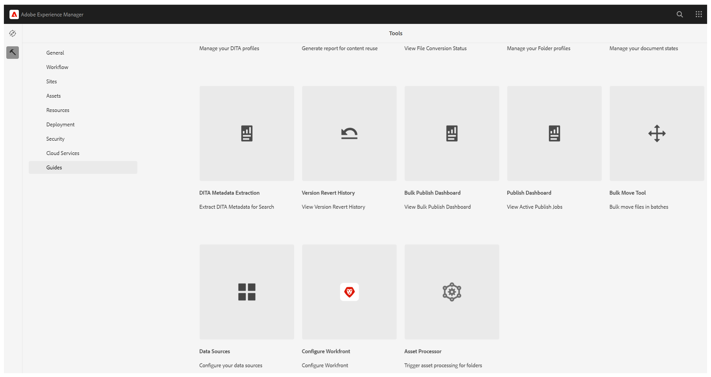
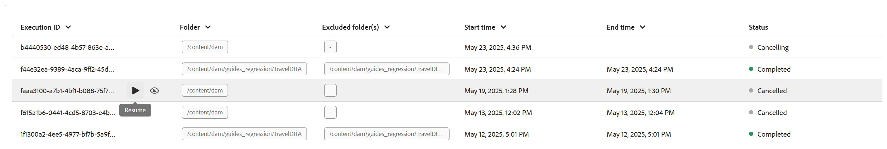

# Elaborazione o rielaborazione delle risorse

Nei flussi di lavoro a uso intensivo di dati, come la pubblicazione, una gestione efficiente delle risorse è fondamentale per mantenere prestazioni e affidabilità. Il processo di elaborazione o rielaborazione delle risorse è progettato appositamente per gestire le risorse specifiche dell&#39;utente che richiedono operazioni intensive sui dati. Questo approccio affronta due scenari principali: quando l’elaborazione iniziale delle risorse rileva errori o quando i file non sono stati elaborati a causa dell’assenza di un trigger di post-elaborazione. Grazie all’elaborazione mirata a livello di cartella, gli utenti possono isolare ed elaborare solo le risorse necessarie, evitando in tal modo il sovraccarico di calcoli non necessari. Questo approccio selettivo migliora in modo significativo le prestazioni, riducendo il tempo necessario per operazioni critiche come la pubblicazione e la generazione di report. In generale, contribuisce a una maggiore efficienza e velocità nella gestione di attività di dati complesse.

>[!NOTE]
>
> Per i set di dati di grandi dimensioni, è consigliabile eseguire l’elaborazione nelle ore non di picco per evitare di influire sulle prestazioni del sistema. Al termine dell’attività di elaborazione, puoi rivedere i dettagli per analizzare i risultati.

## Elaborazione delle risorse

Per elaborare o rielaborare le risorse, effettua le seguenti operazioni:

1. Seleziona il logo Adobe Experience Manager nella parte superiore e scegli **Strumenti**.
1. Nel pannello **Strumenti** seleziona **Guide**.
1. Selezionare il riquadro **Processore risorse**.

   {width="550" align="left"}

1. Viene visualizzata la finestra Processore risorse guide con i dettagli riportati di seguito. Inoltre, in questa finestra vengono visualizzate solo le informazioni relative alle ultime cinque migrazioni.

   - **ID esecuzione**: è l&#39;ID univoco per ogni attività di rielaborazione eseguita.

   - **Cartella**: mostra la cartella selezionata per la rielaborazione.

   - **Cartelle escluse**: punta alla cartella che è esclusa dalla rielaborazione.

   - **Ora di inizio:** mostra la data e l&#39;ora in cui è stato avviato il processo di rielaborazione.

   - **Ora di fine**: mostra la data e l&#39;ora in cui termina il processo di rielaborazione.

   - **Stato**: indica lo stato della rielaborazione come In corso, Completato o Annullato.

   {width="550" align="left"}

1. Seleziona la scheda **Nuovo processo** nell&#39;angolo superiore destro della finestra per avviare una nuova attività di elaborazione.

   {width="550" align="left"}

1. Selezionare la cartella che si desidera elaborare o rielaborare. Puoi anche selezionare le cartelle (all’interno della cartella selezionata principale) che desideri escludere o ignorare.

   >[!NOTE]
   >
   >È possibile selezionare una sola cartella alla volta per l’elaborazione. Per operazioni specifiche, puoi escludere più cartelle.

1. Seleziona **Crea**. Viene visualizzato un pop-up che mostra **Operazione completata e il processo è stato attivato correttamente** come mostrato nel frammento. Lo stesso si riflette nell’elenco. Nella finestra è possibile visualizzare lo stato dell&#39;operazione di rielaborazione.

   {width="550" align="left"}

## Opzioni aggiuntive per l’elaborazione delle attività

Dopo l’avvio dell’attività di elaborazione, sono disponibili opzioni aggiuntive. Per accedere a queste opzioni, passa il cursore sull’ID di esecuzione dell’attività. I dettagli di queste opzioni sono riportati di seguito:

- **Riavvia**: riavvia l&#39;attività di elaborazione delle risorse precedentemente completata.

  {width="550" align="left"}

- **Riprendi**: riprende l&#39;attività di elaborazione delle risorse annullata o non riuscita in precedenza.

  {width="550" align="left"}

- **Annulla**: annulla l&#39;attività di elaborazione delle risorse attualmente in corso.

  {width="550" align="left"}

- **Visualizza registri**: mostra i registri per l&#39;attività di elaborazione delle risorse. Per le attività in corso, il registro mostra informazioni di elaborazione dettagliate, tra cui il tempo rimanente stimato e lo stato delle risorse. Questo elenco di registri visualizza fino alle ultime 500 voci. È possibile scaricare il registro completo.

  {width="550" align="left"}

