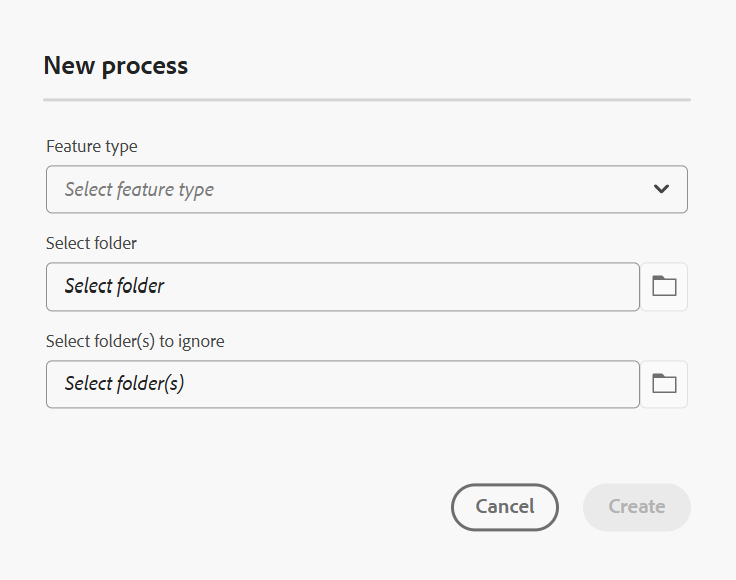
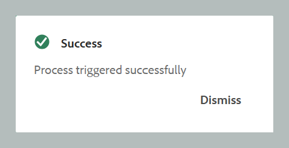
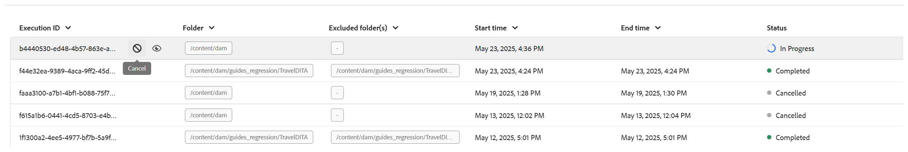

# Elaborare risorse

Nei flussi di lavoro a uso intensivo di dati, come la pubblicazione, una gestione efficiente delle risorse è fondamentale per mantenere prestazioni e affidabilità. Il flusso di lavoro di elaborazione delle risorse è progettato per gestire le risorse specifiche dell’utente che richiedono operazioni intensive sui dati. Vengono trattati principalmente due casi: quando l’elaborazione iniziale non riesce a causa di errori o quando i file non vengono elaborati perché non è stato avviato alcun trigger di elaborazione delle risorse. Grazie all’elaborazione mirata a livello di cartella, gli utenti possono isolare ed elaborare solo le risorse necessarie, evitando in tal modo il sovraccarico di calcoli non necessari. Questo approccio selettivo migliora in modo significativo le prestazioni, riducendo il tempo necessario per operazioni critiche come la pubblicazione e la generazione di report. In generale, contribuisce a una maggiore efficienza e velocità nella gestione di attività di dati complesse.

>[!NOTE]
>
> - Per i set di dati di grandi dimensioni, è consigliabile eseguire l’elaborazione nelle ore non di picco per evitare di influire sulle prestazioni del sistema. Al termine dell&#39;attività di elaborazione, è possibile esaminare i dettagli per analizzare i risultati. 
>- Il sistema attiva l&#39;elaborazione delle risorse per la cartella `/content/dam` ogni 15 minuti. Durante ciascun ciclo, le risorse aggiunte di recente o non elaborate nell’intervallo di 15 minuti più recente vengono prelevate e rielaborate. Per configurare la visualizzazione della funzionalità di elaborazione automatica delle risorse, [Configurare la funzionalità di elaborazione delle risorse](../cs-install-guide/configure-asset-processing-cs.md).

## Elaborazione delle risorse

Per elaborare le risorse, segui i passaggi indicati di seguito:

1. Seleziona il logo Adobe Experience Manager nella parte superiore e scegli **Strumenti**.
1. Nel pannello **Strumenti** seleziona **Guide**.
1. Selezionare il riquadro **Processore di massa**.

   

1. Viene visualizzata la finestra Processore di massa guide con i dettagli riportati di seguito. Inoltre, in questa finestra vengono visualizzate solo le informazioni relative alle ultime cinque migrazioni.

   - **Tipo di funzionalità**: mostra la funzionalità del processo in esecuzione.

   - **ID esecuzione**: è l&#39;ID univoco per ogni attività di elaborazione eseguita.

   - **Cartella**: mostra la cartella selezionata per l&#39;elaborazione.

   - **Cartelle escluse**: mostra la cartella esclusa dall&#39;elaborazione.

   - **Creato da**: mostra chi ha creato l&#39;attività o il processo. Può essere lei come il sistema.

   - **Ora di inizio:** mostra la data e l&#39;ora di avvio del processo di elaborazione.

   - **Ora di fine**: mostra la data e l&#39;ora di fine del processo di elaborazione.

   - **Stato**: mostra lo stato dell&#39;elaborazione come In corso, Completato o Annullato.

   

1. Seleziona la scheda **Nuovo processo** nell&#39;angolo superiore destro della finestra per avviare una nuova attività di elaborazione.

   Viene visualizzata la finestra di dialogo **Nuovo processo**.

   {width="350"}

1. Fornisci i seguenti dettagli nella finestra di dialogo:

   1. **Tipo di funzionalità**: seleziona **Elaborazione risorse** dal menu a discesa.
   1. **Selezionare cartelle e file**: spostarsi e scegliere una o più cartelle e file da elaborare.
   1. **Selezionare le cartelle da ignorare**: è possibile selezionare sottocartelle all&#39;interno della cartella principale selezionata da escludere dall&#39;elaborazione.
   1. **Tipo risorsa**: dal menu a discesa, seleziona il tipo di risorsa specifico da elaborare (ad esempio Argomento DITA, Mappa DITA, Markdown, HTML/CSS, DITAVAL o altri file). Solo il tipo di risorsa selezionato viene elaborato dalle cartelle specificate in precedenza.
Esempio: la selezione di Argomento DITA elabora solo gli argomenti DITA all&#39;interno della cartella selezionata, abilitando il filtro mirato.
   1. **Creato dopo/Creato prima**: applica filtri di data per elaborare le risorse create entro l&#39;intervallo di tempo specificato.

   >[!NOTE]
   >
   > Se per una cartella è già in esecuzione un processo, non è possibile avviare un nuovo processo per la stessa cartella fino al completamento dell&#39;operazione corrente.

1. Seleziona **Crea**. Viene visualizzato un pop-up che mostra **Operazione completata e il processo è stato attivato correttamente**. Nella finestra è possibile visualizzare lo stato dell&#39;operazione di elaborazione.

   {width="350"}

## Opzioni aggiuntive per le attività di elaborazione delle risorse

Dopo l’avvio dell’attività di elaborazione, sono disponibili opzioni aggiuntive. Per accedere a queste opzioni, passa il cursore sull’ID di esecuzione dell’attività. I dettagli di queste opzioni sono riportati di seguito:

- **Riavvia**: riavvia l&#39;attività di elaborazione delle risorse precedentemente completata.

  {width="650"}

- **Riprendi**: riprende l&#39;attività di elaborazione delle risorse annullata o non riuscita in precedenza.

  {width="650"}

- **Annulla**: annulla l&#39;attività di elaborazione delle risorse attualmente in corso.

  {width="650"}

- **Visualizza registri**: mostra i registri per l&#39;attività di elaborazione delle risorse. Per le attività in corso, il registro mostra informazioni di elaborazione dettagliate, tra cui il tempo rimanente stimato e lo stato delle risorse. Questo elenco di registri visualizza fino alle ultime 500 voci. È possibile scaricare il registro completo.

  {width="650"}
