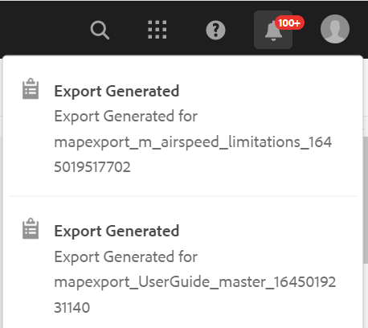

# Scarica file {#id216MC0H0BE8}

È possibile scaricare risorse, inclusi file DITA e non DITA. Esistono diversi modi per scaricare le risorse, alcuni metodi sono nativi per Adobe Experience Manager e altri sono supportati da Adobe Experience Manager Guides. Per informazioni sul download di risorse Adobe Experience Manager native, visualizza [Scarica risorse da Adobe Experience Manager](https://experienceleague.adobe.com/docs/experience-manager-cloud-service/assets/manage/download-assets-from-aem.html) nella documentazione di Adobe Experience Manager. La sezione seguente spiega il meccanismo di download dei file in Experience Manager Guides.

## Scaricare un file di mappa DITA dall&#39;editor

Per scaricare un file di mappa DITA dall&#39;editor, effettuare le seguenti operazioni:

1. Passare alla mappa DITA da scaricare.
1. Selezionare la mappa DITA per aprirla nell&#39;editor.

1. Nella vista Mappa, seleziona l&#39;icona **Opzioni** e scegli **Scarica mappa** dall&#39;elenco.

   

   Viene visualizzata la finestra di dialogo **Scarica mappa**.

   {width="300"}

1. Nella finestra di dialogo Scarica mappa puoi scegliere le seguenti opzioni:

   - **Usa baseline**: selezionare questa opzione per ottenere un elenco di baseline create per la mappa DITA. Per scaricare il file mappa e il relativo contenuto in base a una baseline specifica, selezionare la baseline dall&#39;elenco a discesa. Per ulteriori dettagli sull&#39;utilizzo delle baseline, visualizzare [Utilizzo delle baseline](generate-output-use-baseline-for-publishing.md#).

   - **Opzioni per la gerarchia dei file**: è inoltre possibile utilizzare il menu a discesa della gerarchia dei file per scegliere la modalità di gestione della struttura delle cartelle per i file di mappa scaricati. Opzioni disponibili:

      - **Mantieni gerarchia file**: selezionare questa opzione dal menu a discesa per mantenere la struttura di cartelle esistente per i file scaricati.
      - **Flatten file hierarchy**: seleziona questa opzione dal menu a discesa per scaricare tutti gli argomenti e i file multimediali a cui si fa riferimento in un&#39;unica cartella.

     Per ogni opzione, è possibile specificare ulteriormente la modalità di gestione dei nomi dei file per i file scaricati. Sono disponibili le seguenti opzioni di nome file:

      - **Usa nome file GUID**: scarica il file di mapping con GUID come nome file.
      - **Usa nome file effettivo**: scarica il file mappa con il nome file originale. Quando questa opzione viene utilizzata con la gerarchia dei file Flatten, tutti i nomi di file duplicati nella mappa vengono risolti automaticamente aggiungendo suffissi numerici (_2, _3 e così via) per garantire nomi di file univoci.

   >[!NOTE]
   >
   > È inoltre possibile scaricare il file mappa senza selezionare alcuna opzione. In tal caso, viene scaricata l&#39;ultima versione persistente degli argomenti e dei file multimediali di riferimento.

1. Seleziona **Scarica**.

   La richiesta di download della mappa è in coda.

   

   Riceverai la seguente notifica quando la mappa sarà pronta per il download.

   {width="550"}

1. Seleziona **Scarica** per scaricare il file mappa in formato `.zip`. In alternativa, scaricalo in un secondo momento dalla casella in entrata di AEM.

   >[!NOTE]
   >
   > Per impostazione predefinita, le mappe scaricate rimangono per cinque giorni nella casella in entrata delle notifiche Adobe Experience Manager.

Una volta scaricata la mappa, puoi selezionarla e utilizzare l’icona Apri nella parte superiore per aprire il contenuto scaricato. Per visualizzare i metadati associati alla mappa scaricata, aprire il file `metdata.json` incluso nel contenuto scaricato. Questo file è disponibile per entrambe le opzioni *Gerarchia file*: Flatten file hierarchy e Retain file hierarchy.

## Scaricare un file di mappa DITA dal dashboard Mappa

Dopo aver inserito il file mappa DITA nell&#39;archivio di Adobe Experience Manager, è possibile scaricare il file mappa insieme ai relativi dipendenti. Questo offre la flessibilità di condividere l&#39;intero file di mappa per la modifica, la convalida, la revisione o semplicemente la creazione di un backup.

Per scaricare un file mappa DITA insieme ai relativi file dipendenti, effettuare le seguenti operazioni:

1. Nell&#39;interfaccia utente di Assets, passare alla mappa DITA che si desidera scaricare.

1. Selezionare la mappa DITA per aprirla nella console delle mappe DITA.

1. Selezionare la scheda **Argomenti** per visualizzare l&#39;elenco degli argomenti disponibili nella mappa DITA.

1. Nella barra degli strumenti principale, seleziona **Scarica mappa**.

   Viene visualizzata la finestra di dialogo Scarica mappa.

   {width="300"}

1. Seleziona **Scarica**. Nella finestra di dialogo Scarica mappa puoi scegliere le seguenti opzioni:

   - **Usa baseline**: selezionare questa opzione per ottenere un elenco delle baseline create per la mappa DITA. Per scaricare il file mappa e il relativo contenuto in base a una baseline specifica, selezionare la baseline dall&#39;elenco a discesa. Per ulteriori dettagli sull&#39;utilizzo delle baseline, visualizzare [Utilizzo delle baseline](generate-output-use-baseline-for-publishing.md#).

   - **Flatten File Hierarchy**: selezionare questa opzione per salvare tutti gli argomenti e i file multimediali di riferimento in un&#39;unica cartella.

   >[!NOTE]
   >
   > È inoltre possibile scaricare il file mappa senza selezionare alcuna opzione. In tal caso, viene scaricata l&#39;ultima versione persistente degli argomenti e dei file multimediali di riferimento.

1. Dopo aver selezionato il pulsante **Scarica**, la richiesta di download della mappa è in coda. Riceverai la seguente notifica quando la mappa sarà pronta per il download.

   {width="550"}

   - Seleziona **Scarica** per scaricare il file mappa in formato.zip.

   - Seleziona **Scarica più tardi** per scaricare il file mappa in un secondo momento. Il collegamento per il download è accessibile dalla casella in entrata delle notifiche Adobe Experience Manager. Seleziona la notifica della mappa generata nella casella in entrata per scaricare la mappa in formato .zip.

   >[!NOTE]
   >
   > Per impostazione predefinita, le mappe scaricate rimangono per cinque giorni nella casella in entrata delle notifiche Adobe Experience Manager.

{width="300"}

Una volta scaricata la mappa, puoi selezionarla e utilizzare l’icona Apri nella parte superiore per aprire il contenuto scaricato.

**Argomento padre:**[ Gestisci contenuto](authoring.md)
