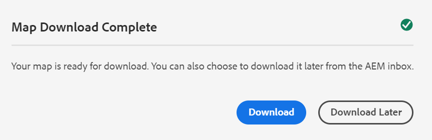

# Scarica file {#id216MC0H0BE8}

È possibile scaricare risorse, inclusi file DITA e non DITA. Esistono diversi modi per scaricare le risorse, alcuni metodi sono nativi dell’AEM e altri sono supportati dalle guide dell’AEM. Per informazioni sul download delle risorse AEM native, consulta [Scaricare risorse da Adobe Experience Manager](https://experienceleague.adobe.com/docs/experience-manager-cloud-service/assets/manage/download-assets-from-aem.html) nella documentazione AEM. La sezione seguente spiega il meccanismo di download dei file tramite la console delle mappe DITA nelle guide AEM.

## Esportare un file di mapping DITA

Dopo aver inserito il file mappa DITA nell&#39;archivio AEM, è possibile scaricare il file mappa insieme ai relativi dipendenti. Questo offre la flessibilità di condividere l&#39;intero file di mappa per la modifica, la convalida, la revisione o semplicemente la creazione di un backup.

Per scaricare un file mappa DITA insieme ai relativi file dipendenti, effettuare le seguenti operazioni:

1. Nell’interfaccia utente Assets, individua la mappa DITA da scaricare.

1. Fare clic sulla mappa DITA per aprirla nella console delle mappe DITA.

1. Seleziona la **Argomenti** per visualizzare un elenco di argomenti disponibili nella mappa DITA.

1. Nella barra degli strumenti principale, fai clic su **Scarica mappa**.

   Viene visualizzata la finestra di dialogo Scarica mappa.

   {width="300" align="left"}

1. Clic **Scarica**. Nella finestra di dialogo Scarica mappa puoi scegliere le seguenti opzioni:

   - **Usa linea di base**: selezionare questa opzione per ottenere un elenco di baseline create per la mappa DITA. Per scaricare il file mappa e il relativo contenuto in base a una baseline specifica, selezionare la baseline dall&#39;elenco a discesa. Per ulteriori dettagli sull&#39;utilizzo delle baseline, vedere [Utilizzare la previsione](generate-output-use-baseline-for-publishing.md#).
   - **Flatten File Hierarchy**: seleziona questa opzione per salvare tutti gli argomenti e i file multimediali a cui si fa riferimento in un’unica cartella.
   >[!NOTE]
   >
   > È inoltre possibile scaricare il file mappa senza selezionare alcuna opzione. In tal caso, viene scaricata l&#39;ultima versione persistente degli argomenti e dei file multimediali di riferimento.

1. Dopo aver fatto clic su **Scarica** , la richiesta di download della mappa è in coda. Riceverai la seguente notifica quando la mappa sarà pronta per il download.

   {width="550" align="left"}

   - Clic **Scarica** per scaricare il file di mappa in formato.zip.

   - Clic **Scarica più tardi** per scaricare il file mappa in un secondo momento. Il link per il download è accessibile dalla casella in entrata delle notifiche AEM. Fai clic sulla notifica della mappa generata nella casella in entrata per scaricare la mappa in formato .zip.

   >[!NOTE]
   >
   > Per impostazione predefinita, le mappe scaricate rimangono per cinque giorni nella casella in entrata delle notifiche AEM.

{width="300" align="left"}

Una volta scaricata la mappa, puoi selezionarla e utilizzare l’icona Apri nella parte superiore per aprire il rapporto selezionato.

**Argomento padre:**[ Gestire i contenuti](authoring.md)
