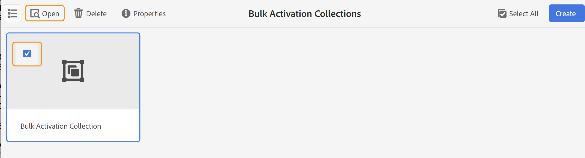

# Attiva output {#id214GGF00V5U}

Dopo aver creato una raccolta di mappe per l’attivazione in blocco, il passaggio successivo consiste nell’attivare il contenuto nell’istanza di pubblicazione. Per attivare il contenuto, effettua le seguenti operazioni:

1. Seleziona **Guide** dall&#39;elenco degli strumenti.

1. Fai clic sul collegamento Adobe Experience Manager in alto e scegli **Strumenti**.

1. Fai clic sul pulsante **Dashboard pubblicazione in blocco** affiancare.

   Viene visualizzato un elenco delle raccolte di mappe di attivazione in blocco.

1. Seleziona la raccolta da pubblicare e fai clic su **Apri**.

   {width="800" align="left"}

1. \(*Facoltativo*\) Applica i filtri richiesti dalla barra a sinistra per filtrare la mappa in base alla lingua, al predefinito di output o alla versione modificata di \(stato\).

   >[!NOTE]
   >
   >Genera l&#39;output per la mappa utilizzando il predefinito di output prima di attivarlo nella raccolta di mappe.

Visualizza i diversi modi per attivare la raccolta in base alla configurazione.

 Servizi cloud 

{width="650" align="left"}

Puoi attivare l’output in **Anteprima** o **Pubblica** istanze.

**Anteprima**

* Per attivare l&#39;output delle mappe selezionate, selezionate l&#39;output delle mappe pregenerato e selezionate **Pubblica in** > **Anteprima**.
* Per attivare l&#39;output di tutte le mappe DITA con i relativi predefiniti configurati, selezionare la casella di controllo accanto a **Mappa** e quindi selezionare **Pubblica in** > **Pubblica**.

**Pubblica**

* Per attivare l&#39;output delle mappe selezionate, selezionate l&#39;output delle mappe pregenerato e selezionate **Pubblica in** > **Pubblica**.

* Per attivare l&#39;output di tutte le mappe DITA con i relativi predefiniti configurati, selezionare la casella di controllo accanto a Mappa (colonna), quindi selezionare **Pubblica in** > **Pubblica**.

>[!NOTE]
> 
> La casella di controllo per un output mappa è abilitata solo se è stato generato l&#39;output per una mappa.

Quando l’output della mappa viene inserito nella coda per la pubblicazione, viene visualizzato un messaggio di operazione riuscita.

Una volta attivato l’output per i file di mappa selezionati, viene aggiornata la scheda della cronologia del controllo e viene visualizzato l’output attivato più recente. Il **Pubblicato** viene aggiornata con la data e l’ora di pubblicazione.

    

  Software on-premise 

Effettua una delle operazioni seguenti:

* Per attivare l&#39;output delle mappe selezionate, selezionate l&#39;output delle mappe pregenerato e selezionate **Pubblicazione rapida**.
* Per attivare l&#39;output di tutte le mappe DITA con i relativi predefiniti configurati, selezionare la casella di controllo accanto a Mappa (colonna), quindi selezionare **Pubblicazione rapida.**
  {width="650" align="left"}

  >[!NOTE]
  > 
  >La casella di controllo per un output mappa è abilitata solo se è stato generato l&#39;output per una mappa.

Quando l’output della mappa viene inserito nella coda per la pubblicazione, viene visualizzato un messaggio di operazione riuscita.

Una volta attivato l’output per i file di mappa selezionati, viene aggiornata la scheda della cronologia del controllo e viene visualizzato l’output attivato più recente. Il **Pubblicato** viene aggiornata con la data e l’ora di pubblicazione.

**Argomento principale: **[Attivazione in blocco di contenuti pubblicati](conf-bulk-activation.md)
