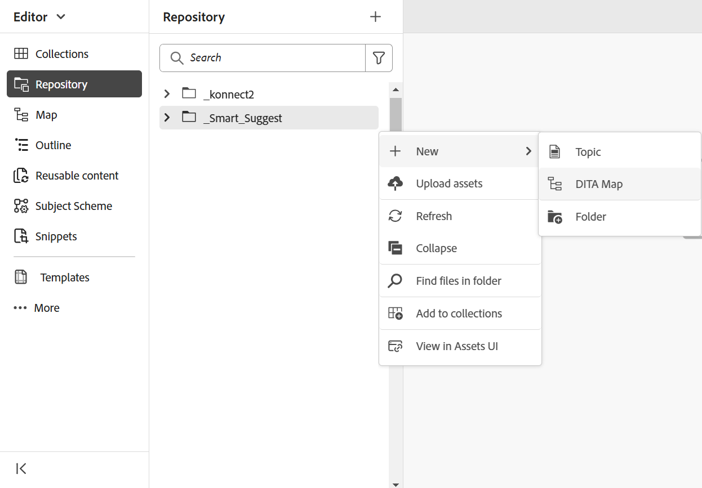

# Creare mappe in base a modelli personalizzati {#id225VF0808MP}

È possibile creare modelli di mappa personalizzati e utilizzarli per creare mappe DITA insieme ai modelli di argomento e ai modelli di mappa a cui si fa riferimento nel modello di mappa

Puoi fare riferimento ad altri modelli di mappa e modelli di argomento dal modello di mappa personalizzato. I modelli di mappa indicati possono fare riferimento a vari modelli di mappa, modelli di argomento, argomenti, mappe, immagini, video e altre risorse. Il modello di mappa personalizzato può aiutarti a replicare molto facilmente i modelli di mappa e l’intera struttura di cartelle a cui si fa riferimento. Questi modelli personalizzati sono particolarmente utili per creare e ricreare più mappe che hanno strutture e riferimenti ricorsivi.

>[!NOTE]
>
> I modelli di argomento non vengono creati ricorsivamente. Vengono generati solo i modelli di argomento che si trovano direttamente all&#39;interno del modello di mappa e qualsiasi modello di argomento all&#39;interno di un modello di argomento viene semplicemente indicato direttamente nell&#39;elemento padre.

## Creare modelli personalizzati

Adobe Experience Manager Guides consente di creare mappe e argomenti personalizzati dalla cartella modelli dita. Puoi utilizzare questi modelli personalizzati per creare la mappa e l’argomento. Puoi anche condividere questi modelli con gli autori, che possono utilizzarli per creare i loro file. Utilizzando questi modelli, puoi consentire agli autori di conservare copie separate di determinate risorse all’interno della cartella dei modelli.

>[!NOTE]
>
> Tutte le risorse a cui fare riferimento e che devono essere mantenute in devono essere mantenute all’esterno della cartella dei modelli.


È possibile creare modelli di mappe e argomenti nei modi seguenti:
- [Creare modelli personalizzati dall’editor](#create-customized-templates-from-the-editor)
- [Creare modelli personalizzati dall’interfaccia utente di Assets](#create-customized-templates-from-the-assets-ui)


### Creare modelli personalizzati dall’editor

La funzionalità **Modelli** è presente nel [pannello sinistro dell&#39;interfaccia Editor](./web-editor-features.md#left-panel) ed è disponibile solo per gli amministratori. Utilizzando questo pannello, l’amministratore può creare e gestire facilmente modelli che possono quindi essere utilizzati dagli autori. Per impostazione predefinita, i modelli sono classificati nei modelli di tipo *map* e *topic*.

{width="300" align="left"}

Per impostazione predefinita, è possibile visualizzare i file in base ai titoli. Passando il puntatore del mouse su un modello, è possibile visualizzare il titolo e il nome del file come descrizione comando.

>[!NOTE]
>
> In qualità di amministratore, puoi anche scegliere di visualizzare l’elenco dei file nell’editor. Selezionare l&#39;opzione **Nome file** della sezione **Configurazione di visualizzazione dei file dell&#39;editor** in **Preferenze utente**.

Per creare un argomento o un modello di mappa dall’editor, effettua le seguenti operazioni:

1. Apri il pannello **Modelli** nell&#39;editor e seleziona l&#39;icona **Crea modello DITA**.

   {width="500" align="left"}

1. Scegliere **Modello argomento** o **Modello mappa** dal menu a discesa in base al tipo di modello che si desidera creare.
1. Se si seleziona **Modello argomento**, verrà visualizzata la finestra di dialogo **Nuovo modello argomento**.

   {width="300" align="left"}

   Se si seleziona **Modello mappa**, viene visualizzata la finestra di dialogo **Nuovo modello mappa**.

   {width="300" align="left"}

   È inoltre possibile selezionare **Cartella** dall&#39;elenco a discesa se si desidera creare prima una cartella all&#39;interno della cartella **topic** o **mappa**.

1. Nella finestra di dialogo **Nuovo modello di argomento**/ **Nuovo modello di mappa**, specifica il **Titolo**, che viene visualizzato nel pannello **Modelli**. Il **Nome** del modello viene suggerito automaticamente in base al titolo, tuttavia è possibile specificare un nome file diverso.
Scegliere inoltre il tipo di modello da creare dall&#39;elenco a discesa **Modello**.

   >[!NOTE]
   >
   > Se l’amministratore ha abilitato i nomi di file automatici in base all’impostazione UUID, il campo Nome non verrà visualizzato.

1. Seleziona **Crea**.

Una volta creato il modello, è necessario aggiungerlo al profilo globale o a livello di cartella. Dopo l’aggiunta del modello, gli autori inizieranno a visualizzare il nuovo modello nel processo di creazione dell’argomento o della mappa.

Utilizzando il menu **Opzioni** su un modello esistente, puoi scegliere di **Modifica** o **Duplica**. In caso di duplicazione, la struttura e il tipo \(di documento\) del modello vengono mantenuti ed è possibile riutilizzarli per creare un altro modello da esso.

{width="500" align="left"}

### Creare modelli personalizzati dall’interfaccia utente di Assets

Per creare una mappa o un modello di argomento dall’interfaccia utente di Assets, effettua le seguenti operazioni:

1. Nell&#39;**interfaccia utente di Assets**, passare alla cartella dei modelli dita.

   {align="left"}

1. Apri la cartella **topic** se vuoi creare un modello **Topic**. Apri la cartella **mappe** se vuoi creare un modello **Mappa**.
1. Selezionare **Crea \> Modello DITA**.

   {width="300" align="left"}
1. Nella pagina Blueprint, seleziona **Argomento \> Successivo** per creare un modello di argomento. Altrimenti, seleziona **Mappa \> Successivo** per creare un modello di mappa.
1. Nella pagina Proprietà, specifica il modello **Titolo**.
1. Specificare il file **Name**.

   >[!NOTE]
   >
   > Il nome del file deve avere l&#39;estensione .dita.

1. \(Facoltativo\) Aggiungere una descrizione.
1. Seleziona **Crea**.

   Viene visualizzato il messaggio di creazione del modello di argomento. È quindi possibile aprire il modello e modificarlo. Per un modello di mappa, puoi anche aggiungere i riferimenti per i modelli di argomento, i modelli di mappa e altre risorse nel modello di mappa.


**Menu Opzioni nell&#39;interfaccia utente di Assets**

Per creare una mappa o un modello di argomento utilizzando il menu Opzioni nell’interfaccia utente di Assets, effettua le seguenti operazioni:

1. Selezionare la cartella **Mappa** o **Argomento** nella cartella dei modelli corrente. Ad esempio, la cartella `dita-templates`.
1. Dal menu **Opzioni**, selezionare **Crea modello mappa** o **Crea modello argomento**.

   Viene visualizzata la finestra di dialogo **Crea nuovo modello mappa** o **Crea nuovo modello argomento**.
1. Immetti il titolo e il nome del nuovo modello.
1. Scegliere il tipo di modello da creare dall&#39;elenco a discesa **Modello**.

Viene visualizzato il messaggio di creazione del modello di mappa. Puoi aggiungere il modello al tuo profilo globale o a livello di cartella. Il nuovo modello viene quindi visualizzato nel processo di creazione di argomenti o mappe e può essere utilizzato per creare mappe o argomenti.

L’amministratore può anche creare una cartella e configurarla come la cartella in cui puoi creare e salvare i modelli.

In base alla configurazione, scopri come configurare il percorso della cartella del modello DITA personalizzato:
<details>
    <summary> Servizi cloud </summary>

Scopri come [configurare il percorso della cartella dei modelli DITA personalizzati](../install-guide/conf-template-tags-custom-dita-topic-template.md#configure-custom-dita-template-folder-path-id191lcf0095z) nella Guida all&#39;installazione e alla configurazione di Cloud Services.
</details>

<details>
    <summary> Software on-premise</summary>

Scopri come [configurare il percorso della cartella del modello DITA personalizzato](../cs-install-guide/conf-template-tags-custom-dita-topic-template.md#configure-custom-dita-template-folder-path-id191lcf0095z) nella Guida all&#39;installazione e alla configurazione on-premise.
</details>

## Trasmettere il titolo definito nei modelli

Se si desidera passare il titolo dell&#39;argomento o della mappa utilizzata all&#39;interno del modello alle mappe DITA create utilizzando tale modello, utilizzare parentesi graffe intorno al titolo.

Esempio

```XML
<pubtitle>
   <mainpubtitle outputclass="booktitle">
   {title}
   </mainpubtitle>
   <subtitle>Subtitle</subtitle>
</pubtitle>

The resultant DITA map with title "Rootmap1" will look like as follows:
<pubtitle>
   <mainpubtitle outputclass="booktitle">Rootmap1
   </mainpubtitle>
   <subtitle>Subtitle</subtitle>
</pubtitle>
```

>[!NOTE]
> Solo la prima occorrenza della parentesi graffa verrà sostituita con il titolo.

Se non si utilizzano parentesi graffe attorno al titolo, la mappa DITA risultante verrà selezionata solo per il primo elemento e la nidificazione del titolo non verrà selezionata dal modello e avrà il seguente aspetto:

```XML
<pubtitle> Rootmap1 </pubtitle>
```

>[!NOTE]
> È inoltre possibile utilizzare le parentesi graffe intorno al testo per passare la struttura nidificata dai modelli personalizzati alle mappe DITA.

Esempio

```XML
<title>    
    <sub>        
        <b>{title}</b>    
    </sub>
</title>
```

## Utilizza il modello di mappa per creare nuove mappe

>[!NOTE]
>
> Il modello di mappa deve essere configurato dall’amministratore e reso disponibile per l’authoring. Per ulteriori dettagli, vedi *Configurare i modelli di authoring* nella sezione Installare e configurare Adobe Experience Manager Guides as a Cloud Service.

Nell&#39;**Editor**, eseguire i passaggi seguenti per creare una mappa utilizzando il modello di mappa personalizzato:

1. Nell&#39;**Editor** spostarsi nella cartella in cui si desidera creare la mappa.
1. Dal menu Opzioni della cartella, selezionare **Nuovo \> Mappa DITA**.

   {width="500" align="left"}
1. Viene visualizzata la finestra di dialogo **Nuova mappa**.
1. Nella finestra di dialogo **Nuova mappa**, specifica la mappa **Titolo**, il file **Nome** e seleziona il modello di mappa da utilizzare.

   Ad esempio, se hai creato un modello di mappa &quot;test-template&quot;, selezionalo.

1. Seleziona **Crea**.

   Viene visualizzato il messaggio Mappa creata.

Nell&#39;**interfaccia utente di Assets**, eseguire i passaggi seguenti per creare una mappa utilizzando il modello di mappa personalizzato:

1. Nell&#39;interfaccia utente di **Assets,** passa alla cartella in cui desideri creare la mappa.
1. Selezionare **Crea \> Mappa DITA**.
1. Nella pagina Blueprint, seleziona il modello di mappa che desideri utilizzare e fai clic su **Successivo**. Ad esempio, se hai creato un modello di mappa &quot;test-template&quot;, selezionalo.
1. Nella pagina Proprietà, specifica la mappa **Titolo**.
1. Specificare il file **Name**.

   >[!NOTE]
   >
   > Il nome del file deve avere l&#39;estensione .ditamap.

1. Seleziona **Crea**. Viene visualizzato il messaggio Mappa creata.

## Note aggiuntive per le mappe DITA create utilizzando modelli personalizzati


La mappa genera tutte le risorse a cui si fa riferimento all’interno della cartella dei modelli. Alcuni tipi di risorse a cui si fa riferimento in una mappa possono essere i seguenti:

- Se la mappa contiene il riferimento a un modello di argomento, ne viene creata una copia all&#39;interno della cartella, nella stessa gerarchia della cartella topic nella cartella `dita-templates`.
- Se la mappa contiene il riferimento a un modello di mappa, ne viene creata una copia all&#39;interno della cartella, nella stessa gerarchia della cartella delle mappe nella cartella `dita-templates`.
- Se la mappa contiene il riferimento generico a un argomento o a una mappa all&#39;esterno della cartella `dita-templates/topics` o `dita-templates/maps`, viene fatto riferimento allo stesso solo e non viene creata alcuna copia.

  >[!NOTE]
  >
  > `dita-templates/topics` e `dita-templates/maps` sono i percorsi predefiniti nelle Guide e sono configurabili.


  Se all’interno del modello mappa è presente una definizione di chiave del modello argomento, viene creata una nuova chiave \(quindi nuovo argomento\) a cui viene fatto riferimento nella mappa.

- Se nella cartella viene creato un altro argomento o mappa allo stesso livello, i nomi delle nuove risorse vengono aggiunti 0, 1, 2 e così via. È possibile scegliere di aprire la mappa per la modifica o salvare il file di mappa nel repository.

**Argomento padre:**&#x200B;[&#x200B; Introduzione all&#39;editor mappe](map-editor.md)
