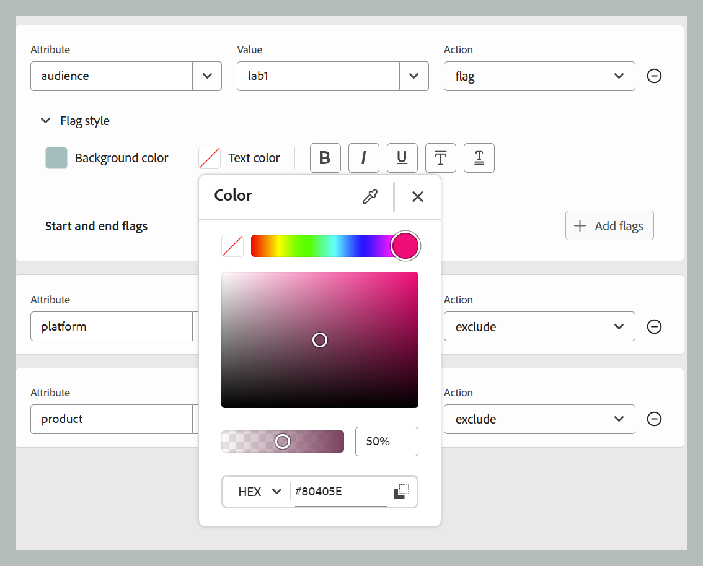

# editor DITAVAL {#ditaval-editor}

I file DITAVAL vengono utilizzati per generare output condizionale. In un singolo argomento, puoi aggiungere condizioni utilizzando gli attributi dell’elemento per condizionare il contenuto. Quindi, create un file DITAVAL in cui specificate le condizioni che devono essere selezionate per generare il contenuto e quali condizioni devono essere escluse dall&#39;output finale.

Adobe Experience Manager Guides consente di creare e modificare facilmente i file DITAVAL mediante l&#39;editor DITAVAL. L&#39;editor DITAVAL recupera gli attributi (che possono essere utilizzati come condizioni) definiti nel sistema ed è possibile utilizzarli per creare o modificare i file DITAVAL. Per ulteriori dettagli sulla creazione e la gestione delle condizioni in Adobe Experience Manager, visualizzare la sezione [Amministrazione dei tag](https://experienceleague.adobe.com/docs/experience-manager-cloud-service/sites/authoring/features/tags.html?lang=en) nella documentazione di Adobe Experience Manager.

Nelle sezioni seguenti vengono descritte le opzioni disponibili per un file DITAVAL in Experience Manager Guides.

- [Crea file DITAVAL](#create-ditaval-file)
- [Modifica file DITAVAL](#edit-ditaval-file)
- [Visualizzazioni editor file DITAVAl](#ditaval-editor-views)
- [Utilizzo del file DITAVAL nell’interfaccia utente di Assets](#working-with-ditaval-files-in-the-assets-ui)

## Crea file DITAVAL

Per creare un file DITAVAL, effettuate le seguenti operazioni:

1. Nel pannello Archivio, seleziona l&#39;icona **Nuovo file**, quindi seleziona **Argomento** dal menu a discesa.

   {width="300" align="left"}

   È inoltre possibile accedere a questa opzione dalla [home page di Experience Manager Guides](./intro-home-page.md) e dal menu delle opzioni di una cartella nella visualizzazione Archivio.

2. Viene visualizzata la finestra di dialogo **Nuovo argomento**.

3. Nella finestra di dialogo **Nuovo argomento**, fornisci i seguenti dettagli:
   - Titolo per l&#39;argomento.
   - \(Facoltativo\)* Nome file dell&#39;argomento. Il nome del file viene suggerito automaticamente in base al Titolo dell’argomento. Se l’amministratore ha abilitato i nomi di file automatici in base all’impostazione UUID, il campo Nome non verrà visualizzato.
   - Modello su cui verrà basato l&#39;argomento. Per un file DITAVAL, selezionare **Ditaval** dall&#39;elenco a discesa.
   - Percorso in cui salvare il file dell&#39;argomento. Per impostazione predefinita, il percorso della cartella attualmente selezionata nell’archivio viene visualizzato nel campo Percorso.

   {width="300" align="left"}

4. Seleziona **Crea**.

L&#39;argomento viene creato nel percorso specificato. Inoltre, l’argomento viene aperto nell’Editor per la modifica.

{align="left"}

## Modifica file DITAVAL

Quando si crea un argomento DITAVAL, questo viene aperto nell&#39;Editor per la modifica. Per modificare un argomento DITAVAL esistente, passare alla cartella o alla mappa in cui si trova l&#39;argomento DITAVAL, quindi selezionare **Modifica** dal menu **Opzioni**.

L&#39;editor DITAVAL consente di eseguire più attività come elencato di seguito utilizzando le opzioni disponibili nella barra degli strumenti dell&#39;editor.

### Opzioni della barra degli strumenti dell’editor

#### Menu a discesa

Il menu a discesa consente di accedere alle azioni di modifica, Trova e sostituisci, Cronologia versioni, Etichetta versione, Unione, Crea attività di revisione, Traccia modifiche e Funzione tag.
Per ulteriori dettagli, visualizza [Opzioni menu a discesa](./web-editor-toolbar.md#menu-dropdown)

#### Aggiungi proprietà

Aggiungi una singola proprietà nel file DITAVAL.

{width="650" align="left"}

Nel primo elenco a discesa sono elencati gli attributi DITA consentiti che è possibile utilizzare nel file DITAVAL.

Il secondo elenco a discesa mostra i valori configurati per l’attributo selezionato. Nell&#39;elenco a discesa successivo vengono quindi visualizzate le azioni che è possibile configurare per l&#39;attributo selezionato. I valori consentiti nel menu a discesa delle azioni sono - `include`, `exclude`, `passthrough` e `flag`. Per ulteriori informazioni su questi valori, vedere la definizione dell&#39;elemento [prop](http://docs.oasis-open.org/dita/dita/v1.3/errata01/os/complete/part3-all-inclusive/langRef/ditaval/ditaval-prop.html#ditaval-prop) nella documentazione OASIS DITA. Per informazioni dettagliate sull&#39;azione delle proprietà aggiunte negli attributi, visualizzare [Azioni per la proprietà](#actions-for-property).

#### Aggiungi proprietà Rev

Per aggiungere un numero di revisione specifico a un tag in XML, puoi utilizzare l’opzione Add rev prop. Questo aggiunge un attributo di revisione al tag, con il valore definito nel campo Valore insieme all’azione selezionata per la proprietà. Questo attributo di revisione può essere utilizzato in seguito per filtrare il contenuto XML pertinente in base al numero di revisione specificato durante la generazione dell’output.

{width="650" align="left"}

#### Aggiungi tutte le proprietà

Per aggiungere tutte le proprietà condizionali o gli attributi definiti nel sistema con un solo clic, utilizzate la funzione Aggiungi tutte le proprietà. I valori consentiti nel menu a discesa delle azioni sono - `include`, `exclude`, `passthrough` e `flag`. I dettagli di tali azioni sono indicati di seguito.

>[!NOTE]
>
> Se tutte le proprietà condizionali definite esistono già nel file DITAVAL, non è possibile aggiungere altre proprietà. Viene visualizzato un messaggio di errore in questo scenario.

{width="650" align="left"}

##### Azioni per la proprietà

Per una determinata proprietà sono disponibili principalmente quattro azioni elencate di seguito:

**Includi:** Includi il contenuto nell&#39;output. Questo è il comportamento predefinito, a meno che non venga impostato diversamente.

**Escludi:** Escludi il contenuto dall&#39;output (se tutti i valori nell&#39;attributo specifico sono esclusi).

**Passthrough:** includere il contenuto nell&#39;output e mantenere il valore dell&#39;attributo come parte del flusso di output per l&#39;ulteriore elaborazione da parte di un motore di runtime, ad esempio il filtro di runtime in base alle impostazioni dei singoli utenti.

**Aggiungi flag:** Per contrassegnare il contenuto nell&#39;output, è possibile impostare il contrassegno come azione per l&#39;attributo desiderato nel file. Puoi anche applicare stili di flag diversi utilizzando il menu a discesa **Stile flag** come mostrato nel frammento di seguito.

{width="650" align="left"}

- **Colore di sfondo**: selezionare la tonalità, la saturazione e il contrasto dal colore di sfondo. Il valore HEX corrispondente viene aggiornato automaticamente in base alla selezione. È inoltre possibile cambiare il formato dello spazio colore utilizzando il menu a discesa per scegliere tra HEX, RGB e HSB.

{width="650" align="left"}

- **Colore testo**: selezionare la tonalità, la saturazione e il contrasto dal colore Testo. Il valore HEX corrispondente viene aggiornato automaticamente in base alla selezione. È inoltre possibile cambiare il formato dello spazio colore utilizzando il menu a discesa per scegliere tra HEX, RGB e HSB.

{width="650" align="left"}

- **Opzioni di stile**: è possibile aggiungere alcune opzioni di stile come Grassetto, Corsivo, Sottolineato, Sovrapposto, Doppio sottolineato.

{width="650" align="left"}

- **Flag iniziale e finale**: è possibile inserire immagini come flag iniziale e finale utilizzando il pulsante **Aggiungi flag**. Per scegliere le immagini, utilizzare **Sfoglia Assets** per effettuare la selezione dall&#39;archivio Guide o **Aggiungi file** per il caricamento dal sistema locale. È inoltre possibile specificare testo alternativo per le immagini.

{width="650" align="left"}

- **Conflitto di stili**: risolve i conflitti che si verificano quando un singolo elemento contiene più proprietà con stili di contrassegno diversi. In questi casi, viene selezionato il valore definito nelle proprietà dei conflitti di stile, che funge da selettore di valori predefinito per i colori dello sfondo e del testo.

{width="650" align="left"}

#### Informazioni sulla versione e Salva come nuova versione

La funzione Informazioni sulla versione e Salva come nuova versione combina il tracciamento delle versioni e il salvataggio dei contenuti in un’unica funzionalità.
Per ulteriori dettagli, visualizza [Salva come nuova versione](./web-editor-toolbar.md#version-information-and-save-as-new-version)

#### Blocca/sblocca

Blocca o sblocca il file corrente. Il blocco di un file consente di accedere in scrittura in modo esclusivo al file.
Per ulteriori dettagli, visualizzare [Blocca sblocca il file](./web-editor-toolbar.md#lockunlock)

### Salvare il contenuto

Dopo aver modificato il file DITAVAL, seleziona **Salva** nella barra delle schede.

>[!NOTE]
>
> Se si chiude il file senza salvare, le modifiche andranno perse. Se non desideri eseguire il commit delle modifiche nell&#39;archivio di Adobe Experience Manager, seleziona **Chiudi**, quindi seleziona **Chiudi senza salvare** nella finestra di dialogo **Modifiche non salvate**.

## Visualizzazioni dell’editor DITAVAL

L’editor DITAVAL di Adobe Experience Manager Guides supporta la visualizzazione dei file DITAVAL in due diverse modalità o visualizzazioni:

**Autore**:   Questa è una tipica visualizzazione di What You See is What You Get \(WYSISYG\) dell&#39;editor DITAVAL. Puoi aggiungere o rimuovere proprietà utilizzando la semplice interfaccia utente, che presenta le proprietà, i relativi valori e le azioni nell’elenco a discesa. Nella vista Autore sono disponibili le opzioni per inserire una singola proprietà e tutte le proprietà con un solo clic.

Per trovare la versione del file DITAVAL su cui si sta attualmente lavorando, posizionare il puntatore del mouse sul nome del file.

**Source**:   Nella vista Source viene visualizzato il codice XML sottostante che costituisce il file DITAVAL. Oltre a eseguire modifiche regolari del testo in questa visualizzazione, un autore può anche aggiungere o modificare proprietà utilizzando Smart Catalog.

Per richiamare lo Smart Catalog, posizionare il cursore alla fine di qualsiasi definizione di proprietà e immettere &quot;&lt;&quot;. Nell&#39;editor verrà visualizzato un elenco di tutti gli elementi XML validi che è possibile inserire in tale posizione.

## Utilizzo dei file DITAVAL nell’interfaccia utente di Assets

Puoi anche creare un file DITAVAL dall’interfaccia utente di Assets. I passaggi per creare un nuovo argomento DITAVAL sono i seguenti:

1. Nell’interfaccia utente di Assets, individua il percorso in cui desideri creare il file DITAVAL.

1. Selezionare **Crea** \> **Argomento DITA**.

1. Nella pagina Blueprint, seleziona il modello di file DITAVAL e seleziona **Avanti**.

1. Nella pagina Proprietà, specifica **Titolo** e **Nome** per il file DITAVAL.

   >[!NOTE]
   >
   > Il nome viene suggerito automaticamente in base al Titolo del file. Se si desidera specificare manualmente il nome del file, assicurarsi che il nome non contenga spazi, apostrofi o parentesi graffe e che termini con .ditaval.

1. Seleziona **Crea**.

   Viene visualizzato il messaggio Topic Created (Creazione argomento).

Potete scegliere di aprire il file DITAVAL per la modifica nell&#39;editor DITAVAL o salvare il file dell&#39;argomento nel repository di Adobe Experience Manager.

Per modificare un file DITAVAL esistente, effettuate le seguenti operazioni:

1. Nell’interfaccia utente di Assets, individua il file DITAVAL da modificare.

1. Per ottenere un blocco esclusivo sul file, selezionare il file e selezionare **Estrai**.

1. Selezionare il file e selezionare **Modifica** per aprire il file nell&#39;editor DITAVAL di Adobe Experience Manager Guides.

