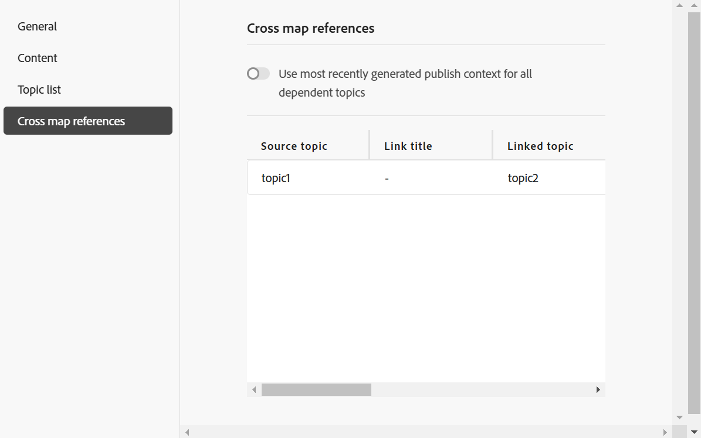

# Predefinito AEM Sites nella console Mappa

Puoi creare un predefinito di AEM Sites dalla console Mappa e configurarlo per generare l’output di AEM Sites. Esistono due modi per creare l’output di AEM Sites:

- [Usa mapping di componenti compositi](#use-composite-component-mapping)
- [Usa mappatura componenti legacy](#use-legacy-component-mapping)

>[!TIP]
>
> Per migliorare le prestazioni, si consiglia di utilizzare la mappatura dei componenti compositi, disponibile in Experience Manager Guides 2502 e nelle versioni più recenti.

## Usa mappatura componenti compositi

La mappatura dei componenti compositi offre una pubblicazione su AEM Sites più rapida e scalabile rispetto alla mappatura dei componenti legacy. Viene fornito con modelli modificabili predefiniti che possono essere personalizzati in base alle tue esigenze utilizzando l’editor di modelli di AEM. I modelli utilizzano una combinazione di componenti di base WCM e di `guides-components` specifici per garantire agli utenti finali un&#39;esperienza ottimale sulle pagine AEM Sites. Puoi anche personalizzare i modelli esistenti utilizzando il metodo di mappatura dei componenti compositi.

Experience Manager Guides fornisce modelli predefiniti per la creazione di AEM Sites. Questi modelli consentono di garantire la coerenza nel layout e nella struttura del contenuto.
- [Crea le home page](../cs-install-guide/download-install-aem-sites-templates-cs.md#create-a-home-page-using-the-template) in base a questi modelli predefiniti.
- Puoi [modificare i modelli di argomento](../cs-install-guide/download-install-aem-sites-templates-cs.md#package-installation) e applicare gli stili in base alle tue esigenze.
- Puoi anche [personalizzare i modelli AEM Sites esistenti](../cs-install-guide/download-install-aem-sites-templates-cs.md#customize-existing-aem-sites-templates).

**Crea predefinito AEM Sites**

Per creare il predefinito AEM Sites utilizzando la mappatura di componenti compositi, effettua le seguenti operazioni:

1. [Aprire il file mappa DITA nella console mappe](./open-files-map-console.md).
1. Nel pannello **Predefiniti di output**, seleziona l&#39;icona + per creare un predefinito di output.
1. Selezionare **AEM Sites** dal menu a discesa **Tipo** nella finestra di dialogo **Nuovo predefinito di output**.
1. Deseleziona l&#39;opzione **Usa mapping di componenti legacy**.
1. Selezionare l&#39;opzione **Aggiungi al profilo cartella corrente** per creare un predefinito di output nel profilo cartella corrente. L&#39;icona  indica un predefinito a livello di profilo della cartella.

   Ulteriori informazioni su [Gestire i predefiniti di output per profili globali e cartelle](./web-editor-manage-output-presets.md).

1. Seleziona **Aggiungi**.

   Viene creato il predefinito per AEM Sites.

   {width="300" align="left"}

<!-----------------------
### Generate the AEM Sites output using the templates

Once, the preset is created, you can configure the various options available for AEM Sites output generation. Experience Manager Guides allows you to use the out of the box templates or add your own AEM Sites templates.

You can configure the Out-of-the-box Sites template  in two ways:

- In the **Sites** field, select the AEM sites where you want to publish your output.  For example, `AEMG Docs`.

    The **Publish path** and the **Topic page template** options are automatically set in the dropdown.  For example,  `AEMG-Docs-Site/en/docs/product1` and `Topic page` are set respectively. You can also choose the other options from the dropdown.

- Or, Select the **Use Sites path** option to select the complete Sites path, and then select a **Map page template**. 

    You can browse a predefined Sites path or specify a custom path even if the specified path has not been pre-created within the AEM Sites structure. In such cases, the system creates the necessary structure during the publishing process by using the selected map homepage template.

   For example, you can specify the path `/content/AEMG-Docs-Site/en/docs/product4` where the `product4`does not exist in the strcuture. In this case, the system automatically creates `product4` using the selected **Map page template** and publish the output within this newly created page. 
   
   The **Topic page template** is automatically set as `Topic Page`. However, you can choose to select other available options in the dropdown.

--->

### Configurazione predefinita di AEM Sites per la mappatura di componenti compositi

>[!NOTE]
>
> Prima di configurare il predefinito AEM Sites per Experience Manager Guides, l’amministratore deve creare una struttura AEM Sites utilizzando i modelli.

- **Software on-premise**: ulteriori informazioni su come [scaricare e installare modelli AEM Sites](../install-guide/download-install-aem-sites-templates.md) per software on-premise.
- **Cloud Service**: ulteriori informazioni su come [scaricare e installare modelli AEM Sites](../cs-install-guide/download-install-aem-sites-templates-cs.md) per Cloud Service.

Nella console Mappa (Map), le opzioni di configurazione predefinite per la mappatura dei componenti compositi sono organizzate nelle seguenti schede:

- Generale
- Contenuto
- Elenco argomenti
- Riferimenti a mappe incrociate

{width="650" align="left"}

**Generale**

La scheda **Generale** contiene le seguenti opzioni di configurazione:

| Opzioni AEM Sites | Descrizione |
| --- | --- |
| Usa percorso del sito | Utilizza questa opzione per pubblicare i contenuti in un sito Experience Manager. |
| Percorso sito | **Questa opzione viene visualizzata se si seleziona** Usa opzione percorso sito ****. Sfoglia il percorso predefinito del sito Experience Manager o specifica un percorso personalizzato in cui desideri pubblicare l’output. L&#39;opzione **Usa siti** consente di specificare l&#39;intero percorso di pubblicazione anche se il percorso specificato non è stato creato in precedenza all&#39;interno della struttura AEM Sites. In questi casi, il sistema crea la struttura necessaria durante il processo di pubblicazione utilizzando il modello di home page della mappa selezionato.  È inoltre possibile utilizzare le variabili durante l&#39;impostazione del percorso del sito. Per ulteriori dettagli, visualizzare [Utilizzare le variabili per impostare le opzioni Percorso di destinazione, Nome sito o Nome file](./generate-output-use-variables.md) |
| Mappa modello pagina | **Questa opzione viene visualizzata se si seleziona** Usa opzione percorso sito ****. Selezionare il modello da applicare alle home page delle mappe. |
| Sito | Nome del Experience Manager Sites in cui desideri pubblicare il contenuto. Le opzioni nel menu a discesa vengono compilate in base all’elenco dei siti disponibili in AEM Sites.  Seleziona **Aggiorna**  per recuperare un nuovo elenco di opzioni e riflettere i dati aggiornati. |
| Percorso di pubblicazione | Il percorso all’interno dell’archivio AEM in cui è memorizzato l’output. Il Percorso di pubblicazione viene compilato con tutti i percorsi che contengono pagine create in base al modello della home page. L&#39;output AEM Sites della mappa DITA viene generato in questo percorso.  Se ad esempio si specifica il sito come `AEMG-Docs` e il percorso di pubblicazione come `aemg-docs-en/docs/product-abc.`, l&#39;output di AEM Sites verrà generato nel nodo `aemg-docs-en/docs/product-abc/` in `crx/de`. |
| Modello pagina argomento | Selezionare il modello da applicare a tutti gli argomenti di output. |
| Genera nomi di pagina in base a | **Nome file argomento**: utilizza il nome file dell&#39;argomento DITA per creare l&#39;URL del sito.   **Titolo argomento**: utilizza il titolo dell&#39;argomento DITA per creare i nomi dei siti Experience Manager. |
| Pulizia delle pagine generate in precedenza | - **Elimina le pagine generate in precedenza per l&#39;argomento rimosse dalla mappa**: se la struttura della mappa DTIA cambia, è possibile utilizzare questa opzione per rimuovere le pagine generate in precedenza per gli argomenti rimossi. Questa funzione è disponibile solo per la pubblicazione di mappe complete.  Si supponga di aver pubblicato una mappa DITA contenente gli argomenti a.dita, b.dita e c.dita. Prima di pubblicare di nuovo la mappa, hai rimosso l’argomento b.dita dalla mappa. Ora, se hai selezionato questa opzione, tutto il contenuto relativo a b.dita viene rimosso dall’output di AEM Sites e vengono pubblicati solo a.dita e c.dita.  **Nota**: le informazioni sulle pagine eliminate vengono acquisite anche nei registri di generazione dell&#39;output. Per ulteriori informazioni sull&#39;accesso ai file di log, [Visualizzare e controllare il file di log](generate-output-basic-troubleshooting.md#id1821I0Y0G0A__id1822G0P0CHS).   **Attenzione**: quando si eliminano gli argomenti, le pagine non sono più disponibili nel sito pubblicato. Pertanto, prima di eliminare gli argomenti, viene visualizzato un avviso. Conferma l&#39;eliminazione.  - **Elimina tutte le pagine create da altre origini nel percorso**: se si seleziona questa opzione, verranno eliminate tutte le pagine pubblicate nel percorso da altre mappe, singoli argomenti o qualsiasi altra origine. Le pagine non sono più disponibili dal sito pubblicato. Pertanto, prima di eliminare gli argomenti, viene visualizzato un avviso. Conferma l&#39;eliminazione. |
| Flusso di lavoro di post-generazione | Quando scegli questa opzione, viene visualizzato un nuovo elenco a discesa Flusso di lavoro di post-generazione contenente tutti i flussi di lavoro configurati in AEM. È necessario selezionare un flusso di lavoro da eseguire dopo il completamento del flusso di lavoro di generazione dell&#39;output. |

**Contenuto**

La scheda **Contenuto** contiene le seguenti opzioni di configurazione:

| Opzioni AEM Sites | Descrizione |
| --- | --- |
| Usa linea di base | Se è stata creata una baseline per la mappa DITA selezionata, selezionare questa opzione per specificare la versione da pubblicare.  Visualizza [Utilizza la previsione](generate-output-use-baseline-for-publishing.md#id1825FI0J0PF) per ulteriori dettagli. |
| Filtro condizionale | Selezionare una delle opzioni seguenti:  **Nessuna**: selezionare questa opzione se non si desidera applicare alcuna condizione all&#39;output pubblicato. **Utilizzo di DITAVAL**: selezionare i file DITAVal per generare contenuto condizionale. È possibile selezionare più file DITAVal utilizzando la finestra di dialogo Sfoglia o digitando il percorso del file. Utilizza l’icona a forma di croce accanto al nome del file per rimuoverlo. I file DITAVal vengono valutati nell&#39;ordine specificato, pertanto le condizioni specificate nel primo file hanno la precedenza rispetto a quelle specificate nei file successivi. È possibile mantenere l&#39;ordine dei file aggiungendo o eliminando file. Se il file DITAVal viene spostato in un&#39;altra posizione o eliminato, non viene eliminato automaticamente dal dashboard delle mappe. È necessario aggiornare il percorso nel caso in cui i file vengano spostati o eliminati. Passa il cursore del mouse sul nome del file per visualizzare il percorso nell’archivio AEM in cui è memorizzato il file. È possibile selezionare solo i file DITAVal e viene visualizzato un errore se si seleziona un altro tipo di file. **Predefinito condizione**: seleziona un predefinito condizione dall&#39;elenco a discesa per applicare una condizione durante la pubblicazione dell&#39;output. Questa opzione è visibile se è stata aggiunta una condizione per il file di mapping DITA. Le impostazioni condizionali sono disponibili nella scheda Predefiniti condizione della console delle mappe DITA. Per ulteriori informazioni sul predefinito di condizione, visualizzare [Usa predefiniti di condizione](generate-output-use-condition-presets.md#id1825FL004PN). |
| Argomenti aggiuntivi della riga di comando DITA-OT | Specificare gli argomenti aggiuntivi che si desidera vengano elaborati da DITA-OT durante la generazione dell&#39;output. Per informazioni dettagliate sugli argomenti della riga di comando supportati in DITA-OT, visualizzare la [documentazione DITA-OT](https://www.dita-ot.org/). |
| Metadati    Proprietà file (Assets) | Seleziona le proprietà da elaborare come metadati. Queste proprietà vengono impostate dalla pagina Proprietà del file mappa DITA o del file mappa segnalibro. Le proprietà selezionate dall&#39;elenco a discesa vengono visualizzate nel campo **Proprietà file**. Seleziona l’icona a forma di croce accanto alla proprietà per rimuoverla.   **Nota**: le proprietà dei metadati fanno distinzione tra maiuscole e minuscole.  *Se è stata selezionata una baseline, i valori delle proprietà si basano sulla versione della baseline selezionata. * Se non è stata selezionata una baseline, i valori delle proprietà si basano sulla versione più recente.  È inoltre possibile trasferire i metadati all&#39;output utilizzando la pubblicazione DITA-OT. Per ulteriori dettagli, [Trasmettere i metadati all&#39;output utilizzando DITA-OT](pass-metadata-dita-ot.md#id21BJ00QD0XA).  **Nota**: se non hai definito `cq:tags` nell&#39;opzione Proprietà, i valori per `cq:tags` vengono scelti dalla copia di lavoro corrente anche se hai selezionato una previsione per la pubblicazione. |
| Metadati    Utilizza le proprietà mappa come fallback | Se questa opzione è selezionata, le proprietà definite per il file mappa vengono copiate anche negli argomenti in cui tali proprietà non sono definite. Durante l&#39;utilizzo di questa opzione, prendere in considerazione i seguenti punti:  *È possibile passare alle pagine del sito AEM solo le proprietà String, Date o Long (singole e multivalore). * I valori dei metadati per una proprietà di tipo String non supportano caratteri speciali (ad esempio `@, #, " "`). * Questa opzione deve essere utilizzata insieme all&#39;opzione `Properties`. |

**Elenco argomenti**

Nella scheda **Elenco argomenti** viene visualizzato l&#39;elenco degli argomenti presenti nella copia di lavoro corrente della mappa DITA. Per impostazione predefinita, sono inclusi tutti gli argomenti. Puoi selezionare argomenti specifici e generare l’output di AEM Sites solo per essi. Ad esempio, sono stati aggiornati alcuni argomenti in modo da poter pubblicare solo tali argomenti anziché l&#39;intera mappa DITA.

 {align="left"}

>[!NOTE]
>
> Quando si seleziona una baseline nella scheda **Contenuto**, nell&#39;elenco Argomento vengono visualizzati gli argomenti e le relative versioni della baseline allegata. Inoltre, la pubblicazione incrementale dall’elenco Argomenti deve essere utilizzata solo quando non vi è alcuna modifica nella struttura della mappa. Se si verifica una modifica nella struttura della mappa o nel sommario, l’intera mappa deve essere pubblicata una volta per aggiornare il sommario.

**Riferimenti tra mappe**

Questo elenco contiene argomenti contenenti riferimenti a mappe incrociate con `scope ="peer"`. È possibile specificare il contesto di pubblicazione per un elenco di riferimenti a mappe incrociate con `scope="peer"` ad argomenti disponibili in altre mappe DITA. Questa scheda viene visualizzata se si utilizza la versione di Experience Manager Guides (UUID).

Per ulteriori dettagli, fare riferimento alla sezione [Utilizzo degli argomenti collegati](#working-with-linked-topics) di seguito.

Una volta configurate, salvate le modifiche apportate al predefinito e selezionate **Genera** per generare AEM Sites per la mappa corrispondente.

>[!NOTE]
>
> Se pubblichi il contenuto in AEM Sites per la prima volta, si consiglia di pubblicare le pagine a livello di sito. In questo modo l&#39;output verrà visualizzato correttamente nell&#39;istanza **Pubblica** senza alcuna interruzione CSS.

## Usa mappatura componenti legacy

I passaggi per creare il predefinito AEM Sites utilizzando la mappatura dei componenti legacy sono gli stessi descritti nella sezione [Mappatura dei componenti compositi](#use-composite-component-mapping) precedente. Tuttavia, durante la creazione del predefinito, accertati di selezionare l&#39;opzione **Usa mapping di componenti legacy** nella finestra di dialogo **Nuovo predefinito di output**.

 {width="300" align="left"}

Nella console Mappa, le opzioni di configurazione predefinite per la mappatura dei componenti legacy sono organizzate nelle seguenti schede:

- Generale
- Contenuto
- Riferimenti a mappe incrociate

{width="500" align="left"}

**Generale**

La scheda **Generale** contiene le seguenti opzioni di configurazione:

| Opzioni AEM Sites | Descrizione |
| --- | --- |
| Nome sito | Nome del sito in cui l’output viene memorizzato nell’archivio AEM.  Viene creato un nodo nell&#39;archivio AEM con il nome specificato qui. Se non si specifica il nome del sito, il nodo del sito viene creato con il nome del file mappa DITA.  Il nome del sito specificato viene utilizzato anche come titolo nella scheda del browser.  È inoltre possibile utilizzare le variabili durante l&#39;impostazione del nome del sito. Per ulteriori dettagli, visualizzare [Utilizzare le variabili per impostare le opzioni Percorso di destinazione, Nome sito o Nome file](./generate-output-use-variables.md) |
| Percorso di output | Il percorso all’interno dell’archivio AEM in cui è memorizzato l’output. Durante la generazione dell’output finale, il nome del sito e il percorso di output vengono combinati. Ad esempio, se si specifica il nome del sito come `user-guide` e il percorso di output come `/content/output/aem-guides`, l&#39;output finale viene generato nel nodo `/content/output/aem-guides/user-guide`.  È inoltre possibile utilizzare le variabili durante l&#39;impostazione del percorso di output. Per ulteriori dettagli, visualizzare [Utilizzare le variabili per impostare le opzioni Percorso di destinazione, Nome sito o Nome file](./generate-output-use-variables.md) |
| Pagine di output esistenti | Selezionare l&#39;opzione **Sovrascrivi contenuto** per sovrascrivere il contenuto nelle pagine esistenti. Questa opzione sovrascrive solo il contenuto presente nei nodi content e head della pagina. Questa opzione consente la pubblicazione mista dei contenuti. Selezionando questa opzione è possibile selezionare l&#39;eliminazione di pagine orfane dall&#39;output pubblicato. Opzione *default* per la creazione dell&#39;output di AEM Sites.  Selezionare l&#39;opzione **Elimina e crea** per forzare l&#39;eliminazione delle pagine esistenti durante la pubblicazione. Questa opzione elimina il nodo della pagina insieme al relativo contenuto e a tutte le pagine figlie al suo interno. Utilizza questa opzione se hai modificato il modello di progettazione del predefinito di output o se desideri rimuovere eventuali pagine aggiuntive già presenti nella destinazione. |
| Elimina le pagine generate in precedenza per gli argomenti rimossi dalla mappa | Se la struttura della mappa DTIA cambia, è possibile utilizzare questa opzione per rimuovere le pagine generate in precedenza per gli argomenti rimossi. Questa funzione è disponibile solo per la pubblicazione di mappe complete.  Si supponga di aver pubblicato una mappa DITA contenente gli argomenti a.dita, b.dita e c.dita. Prima di pubblicare di nuovo la mappa, hai rimosso l’argomento b.dita dalla mappa. Ora, se hai selezionato questa opzione, tutto il contenuto relativo a b.dita viene rimosso dall’output di AEM Sites e vengono pubblicati solo a.dita e c.dita.  **Nota**: le informazioni sulle pagine eliminate vengono acquisite anche nei registri di generazione dell&#39;output. Per ulteriori informazioni sull&#39;accesso ai file di log, [Visualizzare e controllare il file di log](generate-output-basic-troubleshooting.md#id1821I0Y0G0A__id1822G0P0CHS).   **Attenzione**: quando si eliminano gli argomenti, le pagine non sono più disponibili nel sito pubblicato. Pertanto, prima di eliminare gli argomenti, viene visualizzato un avviso. Conferma l&#39;eliminazione. |
| Design | Selezionare il modello struttura da utilizzare per generare l&#39;output.  Per informazioni dettagliate sull&#39;utilizzo di modelli di progettazione personalizzati per generare output, contattare l&#39;amministratore della pubblicazione. |
| Flusso di lavoro di post-generazione | Quando scegli questa opzione, viene visualizzato un nuovo elenco a discesa Flusso di lavoro di post-generazione contenente tutti i flussi di lavoro configurati in AEM. È necessario selezionare un flusso di lavoro da eseguire dopo il completamento del flusso di lavoro di generazione dell&#39;output. |
| Mantieni file temporanei | Selezionare questa opzione per mantenere i file temporanei generati da DITA-OT. Se si verificano errori durante la generazione dell&#39;output tramite DITA-OT, selezionare questa opzione per mantenere i file temporanei. È quindi possibile utilizzare tali file per risolvere eventuali errori di generazione dell&#39;output.    Dopo aver generato l&#39;output, selezionare l&#39;icona **Scarica file temporanei**  per scaricare la cartella ZIP contenente i file temporanei.    **Nota**: se le proprietà del file vengono aggiunte durante la generazione, i file temporanei di output includono anche un file *metadata.xml* contenente tali proprietà. |

**Contenuto**

{width="650" align="left"}

La scheda **Contenuto** contiene le seguenti opzioni di configurazione:

| Opzioni AEM Sites | Descrizione |
| --- | --- |
| Usa linea di base | Se è stata creata una baseline per la mappa DITA selezionata, selezionare questa opzione per specificare la versione da pubblicare.  Visualizza [Utilizza la previsione](./web-editor-baseline.md) per ulteriori dettagli. |
| Filtro condizionale | Selezionare una delle opzioni seguenti:  **Nessuna**: selezionare questa opzione se non si desidera applicare alcuna condizione all&#39;output pubblicato. **Utilizzo di DITAVAL**: selezionare i file DITAVal per generare contenuto condizionale. È possibile selezionare più file DITAVal utilizzando la finestra di dialogo Sfoglia o digitando il percorso del file. Utilizza l’icona a forma di croce accanto al nome del file per rimuoverlo. I file DITAVal vengono valutati nell&#39;ordine specificato, pertanto le condizioni specificate nel primo file hanno la precedenza rispetto a quelle specificate nei file successivi. È possibile mantenere l&#39;ordine dei file aggiungendo o eliminando file. Se il file DITAVal viene spostato in un&#39;altra posizione o eliminato, non viene eliminato automaticamente dal dashboard delle mappe. È necessario aggiornare il percorso nel caso in cui i file vengano spostati o eliminati. Passa il cursore del mouse sul nome del file per visualizzare il percorso nell’archivio AEM in cui è memorizzato il file. È possibile selezionare solo i file DITAVal e viene visualizzato un errore se si seleziona un altro tipo di file. **Predefinito condizione**: seleziona un predefinito condizione dall&#39;elenco a discesa per applicare una condizione durante la pubblicazione dell&#39;output. Questa opzione è visibile se è stata aggiunta una condizione per il file di mapping DITA. Le impostazioni condizionali sono disponibili nella scheda Predefiniti condizione della console delle mappe DITA. Per ulteriori informazioni sul predefinito di condizione, visualizzare [Usa predefiniti di condizione](generate-output-use-condition-presets.md#id1825FL004PN). |
| Metadati    Proprietà file (Assets) | Seleziona le proprietà da elaborare come metadati. Queste proprietà vengono impostate dalla pagina Proprietà del file mappa DITA o del file mappa segnalibro. Le proprietà selezionate dall&#39;elenco a discesa vengono visualizzate nel campo **Proprietà file**. Seleziona l’icona a forma di croce accanto alla proprietà per rimuoverla.   **Nota**: le proprietà dei metadati fanno distinzione tra maiuscole e minuscole.  *Se è stata selezionata una baseline, i valori delle proprietà si basano sulla versione della baseline selezionata. * Se non è stata selezionata una baseline, i valori delle proprietà si basano sulla versione più recente.  È inoltre possibile trasferire i metadati all&#39;output utilizzando la pubblicazione DITA-OT. Per ulteriori dettagli, [Trasmettere i metadati all&#39;output utilizzando DITA-OT](pass-metadata-dita-ot.md#id21BJ00QD0XA).  **Nota**: se non hai definito `cq:tags` nell&#39;opzione Proprietà, i valori per `cq:tags` vengono scelti dalla copia di lavoro corrente anche se hai selezionato una previsione per la pubblicazione. |
| Metadati    Utilizza le proprietà mappa come fallback | Se questa opzione è selezionata, le proprietà definite per il file mappa vengono copiate anche negli argomenti in cui tali proprietà non sono definite. Durante l&#39;utilizzo di questa opzione, prendere in considerazione i seguenti punti:  *È possibile passare alle pagine del sito AEM solo le proprietà String, Date o Long (singole e multivalore). * I valori dei metadati per una proprietà di tipo String non supportano caratteri speciali (ad esempio `@, #, " "`). * Questa opzione deve essere utilizzata insieme all&#39;opzione `Properties`. |

**Riferimenti tra mappe**

Questo elenco contiene argomenti contenenti riferimenti a mappe incrociate con `scope ="peer"`. È possibile specificare il contesto di pubblicazione per un elenco di riferimenti a mappe incrociate con `scope="peer"` ad argomenti disponibili in altre mappe DITA. Questa scheda viene visualizzata se si utilizza la versione di Experience Manager Guides (UUID).

Per ulteriori dettagli, fare riferimento alla sezione [Utilizzo degli argomenti collegati](#working-with-linked-topics) di seguito.

## Utilizzo di argomenti collegati

Experience Manager Guides consente di creare riferimenti ad argomenti utilizzando `peer @scope`. Puoi quindi definire il contesto di pubblicazione di questi riferimenti dai predefiniti di AEM Sites e infine generare l’output degli argomenti collegati.

Per ulteriori dettagli, visualizzare [Genera output di argomenti di collegamento da altre mappe](../user-guide/generate-output-aem-site.md#generate-output-linking-topics-from-other-maps).

Per specificare il contesto di pubblicazione per i file con collegamento incrociato, effettua le seguenti operazioni:

1. Apri la scheda **Riferimenti cross map**. Per visualizzare questa scheda, verificare che `<xrefs>` disponga di ID univoci. Gli ID univoci per `<xrefs>` verranno generati automaticamente quando si modifica o si salva il contenuto precedente, se l&#39;ID non è presente.

   Non potrai visualizzare il collegamento delle mappe incrociate nei seguenti casi:
   - Per i predefiniti creati prima della versione 4.6, la scheda Cross references (Riferimenti incrociati) è disabilitata e viene visualizzata una descrizione comando, **Refer to Map dashboard**.
   - Per i predefiniti creati dal dashboard delle mappe, viene visualizzata la descrizione comando **Fai riferimento a dashboard delle mappe**.
   - Per i predefiniti preconfigurati, viene visualizzata la descrizione comando **Fai riferimento a Dashboard mappa**.
   - Per i predefiniti globali, create una copia locale di questo predefinito globale per impostare i riferimenti delle mappe incrociate.

1. Viene visualizzato un elenco di argomenti e relativi riferimenti

   >[!NOTE]
   >
   >La scheda **Riferimenti a mappe incrociate** mostra gli argomenti collegati solo con `scope="peer"`. Per i collegamenti con `scope="local"`, non è necessario specificare il contesto di pubblicazione.

   Per impostazione predefinita, per tutti gli argomenti collegati vengono selezionati il predefinito di output e la mappa più recente. Per impostazione predefinita, il contesto di pubblicazione per tutti gli argomenti collegati è impostato su `<Most recently generated>` mappa.

   

1. Se si desidera utilizzare l&#39;output pubblicato più di recente di ciascun file dipendente nella mappa, selezionare **Usa contesto di pubblicazione generato più di recente** per tutti gli argomenti dipendenti.
È necessario pubblicare la mappa selezionata come mappa padre prima di pubblicare la mappa contenente gli argomenti collegati. Se la mappa con argomenti collegati non è pubblicata, i collegamenti verranno visualizzati come testo normale anziché come collegamenti ipertestuali nell’output di AEM Sites.
Seleziona lo stesso tipo di predefinito AEM Sites per l’argomento collegato. Ad esempio, se il predefinito AEM Sites corrente utilizza la mappatura di componenti legacy, seleziona un predefinito AEM Sites simile all’argomento collegato.
1. Nell&#39;elenco a discesa Mappa padre selezionare il file di mappa con il quale si desidera collegare l&#39;output della mappa corrente.
Quando si seleziona un file di mappa, nella colonna UUID mappa principale viene visualizzato l&#39;UUID della mappa. I predefiniti di output associati alla mappa selezionata sono elencati nell&#39;elenco Predefiniti mappa padre. Ad esempio, l&#39;argomento 1 nella Mappa A contiene un riferimento all&#39;argomento 2. L&#39;argomento 2 può essere presente in una o più mappe. Per ogni collegamento puoi selezionare la mappa principale e un predefinito specifico oppure l’output pubblicato più di recente.

1. Se in un file si fa riferimento allo stesso argomento più di una volta, è possibile aggiungere un contesto di pubblicazione diverso per ogni istanza. Questo offre maggiore flessibilità e controllo sui contenuti. Ad esempio, l&#39;argomento 3 è presente sia nella Mappa B che nella Mappa C. L&#39;argomento 1 contiene due riferimenti all&#39;argomento 3. Potete scegliere Mappa B come mappa padre per il primo collegamento e Mappa C come mappa padre per il secondo collegamento.

1. Nell&#39;elenco a discesa Predefinito mappa padre selezionare il predefinito di output con cui si desidera collegare l&#39;output della mappa corrente.
   >[!NOTE]
   >
   > I diversi predefiniti di AEM Sites della mappa corrente vengono visualizzati nell’elenco a discesa. Se non selezioni un predefinito, viene visualizzata un’icona di avviso e la generazione dell’output ha esito negativo.

1. Selezionare la mappa richiesta e il relativo predefinito di output per tutti gli argomenti di origine, quindi selezionare **Genera**.

**Argomento padre:** [Informazioni sui predefiniti di output](generate-output-understand-presets.md)