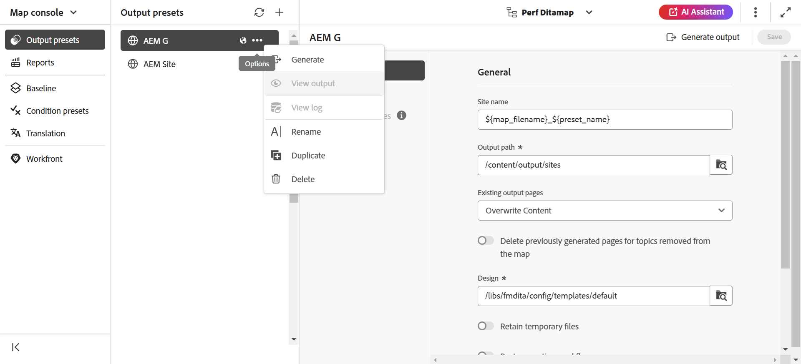
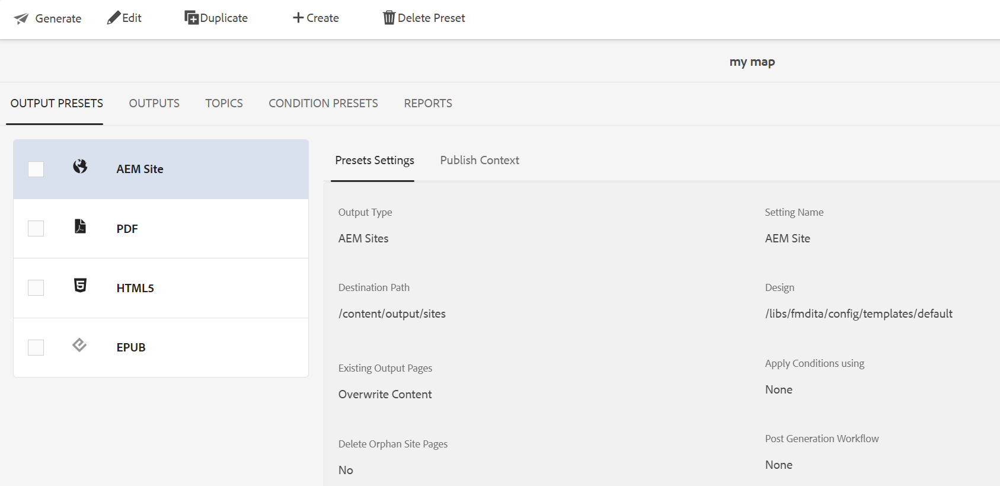

# Modificare, duplicare o eliminare un predefinito di output {#id205BEH0K09Z}

Puoi gestire i predefiniti di output dalla console Mappa e dal dashboard Mappa. In entrambi i modi, è possibile modificare, duplicare ed eliminare un predefinito di output come illustrato nella sezione seguente.

## Utilizzo della console Mappa

È possibile modificare il predefinito di output selezionato modificando direttamente i campi obbligatori con le impostazioni predefinite necessarie.

È inoltre possibile duplicare o eliminare un predefinito di output utilizzando il menu a discesa **Opzioni**, come illustrato di seguito.

>[!NOTE]
>
>Non è possibile modificare, duplicare o eliminare un predefinito modello. Queste azioni sono riservate agli amministratori. Per ulteriori informazioni sui predefiniti modello, vedere [Predefiniti modello](../install-conf-guide/template-presets-output-generation.md).

## Utilizzo del dashboard delle mappe

Potete modificare, duplicare ed eliminare un predefinito di output utilizzando il quadro comandi Mappa (Map) selezionando la scheda desiderata dalla barra superiore, come mostrato di seguito.

**Argomento padre:**[ Generazione output](generate-output.md)
