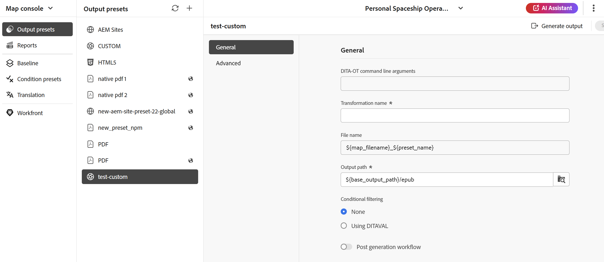

# Personalizzato {#id205BEF00PX0}

I predefiniti di output personalizzati sono disponibili per i plug-in DITA-OT personalizzati. È possibile creare un predefinito di output DITA-OT personalizzato per pubblicare l&#39;output utilizzando il plug-in DITA-OT personalizzato.

Il predefinito personalizzato può essere creato in due modi:

- [Creare il predefinito personalizzato dalla console Mappa](#create-the-custom-preset-from-the-map-console)
- [Crea il predefinito personalizzato dal dashboard delle mappe](#create-the-custom-preset-from-the-map-dashboard)

## Creare il predefinito personalizzato dalla console Mappa

Per creare il predefinito personalizzato dalla console Mappa, effettua le seguenti operazioni:

1. [Aprire un file mappa DITA nella console Mappa](./open-files-map-console.md).

   Puoi anche accedere al file mappa dal widget **File recenti** nella [sezione Panoramica](./intro-home-page.md#overview). Il file di mappa selezionato viene aperto nella console Mappa.
1. Nella scheda **Predefiniti di output**, seleziona l&#39;icona + per creare un predefinito di output.
1. Seleziona **Personalizzato** dal menu a discesa Tipo nella finestra di dialogo **Nuovo predefinito di output**.
1. Nel campo **Name**, specifica un nome per questo predefinito.
1. Selezionare l&#39;opzione **Aggiungi al profilo cartella corrente** per creare un predefinito di output nel profilo cartella corrente. L&#39;icona  indica un predefinito a livello di profilo della cartella.

   Ulteriori informazioni su [Gestire i predefiniti di output per profili globali e cartelle](./web-editor-manage-output-presets.md).

1. Seleziona **Aggiungi**.

   Viene creato il predefinito personalizzato.

   {width="300" align="left"}

Nella console Mappa, le opzioni di configurazione del predefinito sono organizzate nelle schede **Generale** e **Avanzate**.

{align="left"}

La scheda **Generale** contiene le seguenti opzioni di configurazione:

- Argomenti riga di comando DITA-OT
- Nome della trasformazione
- Nome file
- Percorso di output
- Filtro condizionale \(Se le condizioni sono definite per una mappa\)
- Usa baseline \(Se viene creata una baseline per una mappa\)
- Flusso di lavoro di post generazione

**Avanzate**

La scheda Avanzate contiene le seguenti opzioni di configurazione:

- Mantieni file temporanei
- Proprietà file

Per informazioni dettagliate sulle opzioni di configurazione del predefinito, consulta la sezione [Configurazione del predefinito personalizzato](#custom-preset-configuration).

## Creare il predefinito personalizzato dal dashboard Mappa

Per creare il predefinito personalizzato dal dashboard Mappa, effettua le seguenti operazioni:

1. Nell&#39;interfaccia utente di Assets, accedi alla mappa DITA e selezionala per aprirla nel dashboard Mappa.
1. Verificare che la scheda **Predefiniti di output** sia selezionata.
1. Seleziona **Crea** nella barra degli strumenti.

   Viene visualizzato un nuovo modulo per la creazione di predefiniti di output.

   {width="650" align="left"}

1. Immettete i dettagli di configurazione richiesti per il predefinito personalizzato.
1. Seleziona **Fine** per salvare le impostazioni del predefinito.

Per informazioni dettagliate sulle opzioni di configurazione del predefinito, consulta la sezione [Configurazione del predefinito personalizzato](#custom-preset-configuration).

## Configurazione predefinita personalizzata

Le opzioni di configurazione variano leggermente a seconda che il predefinito sia configurato dalla console Mappa o dal dashboard Mappa. Alcune opzioni sono valide solo per il dashboard Mappa, mentre altre sono valide per entrambe.

Nei casi in cui la stessa configurazione abbia due etichette di campo diverse, un **/** le separa nella tabella seguente. Il primo rappresenta l’etichetta nella console Mappa e il secondo rappresenta l’etichetta nel dashboard Mappa.

Ad esempio, **Percorso di output/Percorso di destinazione** - In questo caso, **Percorso di output** è l&#39;etichetta utilizzata nella console Mappa, mentre **Percorso di destinazione** è l&#39;etichetta utilizzata nel dashboard Mappa per la stessa configurazione.

| Opzioni di output personalizzate | Descrizione |
| --- | --- |
| Tipo di output (*Applicabile solo per dashboard mappe*) | Tipo di output che si desidera generare. Per generare l&#39;output utilizzando il plug-in DITA-OT personalizzato, scegliete l&#39;opzione Personalizzato. |
| Nome impostazione (*Applicabile solo per dashboard mappa*) | Assegna un nome descrittivo alle impostazioni di output che stai creando. Ad esempio, puoi specificare _Output clienti interni_ o _Output utenti finali_. |
| Argomenti riga di comando DITA-OT | Specificare gli argomenti aggiuntivi che si desidera vengano elaborati da DITA-OT durante la generazione dell&#39;output. Per informazioni dettagliate sugli argomenti della riga di comando supportati in DITA-OT, visualizzare la [documentazione DITA-OT](https://www.dita-ot.org/). |
| Nome della trasformazione | Specifica il tipo di output da generare. Questa opzione è necessaria se si desidera generare l&#39;output utilizzando un plug-in personalizzato, integrato nel plug-in DITA-OT. Se ad esempio si desidera generare l&#39;output XHTML, specificare `xhtml`. Per un elenco delle trasformazioni disponibili in DITA-OT, visualizzare [Trasformazioni DITA-OT (formati di output)](http://www.dita-ot.org/2.3/user-guide/AvailableTransforms.html) nella Guida utente OASIS DITA-OT. |
| Nome file | Specificare il nome del file con cui si desidera salvare l&#39;output.  **Nota**: se non si specifica un nome di file, verrà utilizzato il titolo della mappa DITA per generare il nome del file di output finale. Se la mappa non ha un titolo, viene utilizzato il nome file della mappa DITA come output finale. Il nome del file viene bonificato utilizzando le regole configurate nel sistema per gestire qualsiasi carattere non valido. |
| Filtro condizionale/Applica condizioni tramite | Selezionare una delle opzioni seguenti:  * **Nessuna applicazione**: selezionare questa opzione se non si desidera applicare alcuna condizione all&#39;output pubblicato. * **File DITAVal**: selezionare i file DITAVal per generare contenuto personalizzato. È possibile selezionare più file DITAVal utilizzando la finestra di dialogo Sfoglia o digitando il percorso del file. Utilizza l’icona a forma di croce accanto al nome del file per rimuoverlo. I file DITAVal vengono valutati nell&#39;ordine specificato, pertanto le condizioni specificate nel primo file hanno la precedenza rispetto a quelle specificate nei file successivi. È possibile mantenere l&#39;ordine dei file aggiungendo o eliminando file. Se il file DITAVal viene spostato in un&#39;altra posizione o eliminato, non viene eliminato automaticamente dal dashboard delle mappe. È necessario aggiornare il percorso nel caso in cui i file vengano spostati o eliminati. Passa il cursore del mouse sul nome del file per visualizzare il percorso nell’archivio AEM in cui è memorizzato il file. È possibile selezionare solo i file DITAVal e viene visualizzato un errore se è stato selezionato un altro tipo di file. * **Predefinito condizione**: seleziona un predefinito condizione dall&#39;elenco a discesa per applicare una condizione durante la pubblicazione dell&#39;output. L&#39;opzione è visibile se è stata aggiunta una condizione presente nella scheda Predefiniti condizione della console Mappa DITA. Per ulteriori informazioni sul predefinito di condizione, visualizzare [Usa predefiniti di condizione](generate-output-use-condition-presets.md#id1825FL004PN). |
| Percorso di output/Percorso di destinazione | Il percorso all’interno dell’archivio AEM in cui è memorizzato l’output di EPUB. |
| Mantieni file temporanei | Selezionare questa opzione per mantenere i file temporanei generati da DITA-OT. Se si verificano errori durante la generazione dell&#39;output tramite DITA-OT, selezionare questa opzione per mantenere i file temporanei. È quindi possibile utilizzare tali file per risolvere eventuali errori di generazione dell&#39;output.    Dopo aver generato l&#39;output, selezionare l&#39;icona **Scarica file temporanei**  per scaricare la cartella ZIP contenente i file temporanei.    **Nota**: se le proprietà del file vengono aggiunte durante la generazione, i file temporanei di output includono anche un file *metadata.xml* contenente tali proprietà. |
| Esegui flusso di lavoro di post-generazione | Quando scegli questa opzione, viene visualizzato un nuovo elenco a discesa Flusso di lavoro di post-generazione contenente tutti i flussi di lavoro configurati in AEM. È necessario selezionare un flusso di lavoro da eseguire dopo il completamento del flusso di lavoro di generazione dell&#39;output.  **Nota**: per ulteriori informazioni sulla creazione di un flusso di lavoro di generazione post-output personalizzato, visualizza _Personalizza flusso di lavoro di generazione post-output_ in Installare e configurare Adobe Experience Manager Guides as a Cloud Service. |
| Usa linea di base | Se è stata creata una baseline per la mappa DITA selezionata, selezionare questa opzione per specificare la versione da pubblicare.   Visualizza [Utilizza la Baseline](generate-output-use-baseline-for-publishing.md#id1825FI0J0PF) per ulteriori dettagli. |
| Proprietà/Proprietà file | Seleziona le proprietà da elaborare come metadati. Queste proprietà vengono impostate dalla pagina Proprietà del file mappa DITA o del file mappa segnalibro. Le proprietà selezionate dall&#39;elenco a discesa vengono visualizzate nel campo **Proprietà file**. Seleziona l’icona a forma di croce accanto alla proprietà per rimuoverla.   **Nota**: è inoltre possibile passare i metadati all&#39;output utilizzando la pubblicazione DITA-OT. Per ulteriori dettagli, [Trasmettere i metadati all&#39;output utilizzando DITA-OT](pass-metadata-dita-ot.md#id21BJ00QD0XA). |

**Argomento padre:**[ Informazioni sui predefiniti di output](generate-output-understand-presets.md)

