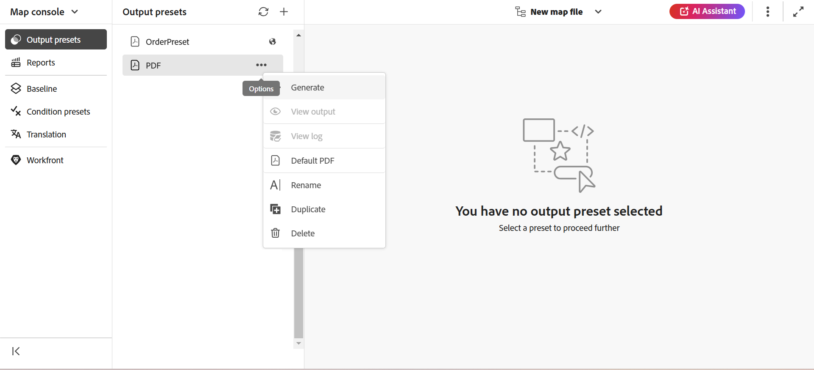

# Genera output

Esistono due modi per generare l&#39;output per una mappa DITA:

- [Genera output per una mappa DITA dalla console Mappa](#generate-output-for-a-dita-map-from-the-map-console)
- [Genera output per una mappa DITA dal dashboard Mappa](#generate-output-for-a-dita-map-from-the-map-dashboard)

## Genera output per una mappa DITA dalla console Mappa

Per generare l&#39;output per una mappa DITA mediante la console Mappa, effettuare le seguenti operazioni:

1. [Aprire un file di mappa nella console Mappa](./open-files-map-console.md).
2. La console delle mappe DITA viene visualizzata con l&#39;elenco di **Predefiniti di output** disponibili per generare l&#39;output.

3. Aprire il predefinito che si desidera utilizzare per generare l&#39;output e selezionare **Genera output** per avviare il processo di generazione.

   

   Oppure, passa il puntatore del mouse sul predefinito e seleziona **Genera** dal menu di scelta rapida predefinito.

   

Al termine della generazione dell&#39;output, selezionare **Visualizza output** per visualizzare l&#39;output.

Una finestra di dialogo **Operazione riuscita** è visibile nell&#39;angolo inferiore destro dello schermo.

Se un output non ha esito positivo, viene visualizzato il seguente messaggio di errore.

Per visualizzare il log degli errori, selezionare **Ignora**, passare il puntatore del mouse sulla scheda del predefinito selezionato e selezionare **Visualizza log** dal menu di scelta rapida predefinito.

## Genera output per una mappa DITA dal dashboard Mappa

Per generare l&#39;output per una mappa DITA mediante il dashboard Mappa, effettuare le operazioni riportate di seguito.

1. Nell&#39;interfaccia utente di Assets, passare al file di mapping DITA che si desidera pubblicare e selezionarlo.

   Viene visualizzata la console Mappa DITA con l&#39;elenco dei predefiniti di output disponibili per generare l&#39;output.

1. Selezionate uno o più predefiniti di output da utilizzare per generare l&#39;output.

   {align="left"}

1. Seleziona l&#39;icona **Genera** per avviare il processo di generazione dell&#39;output.

Puoi visualizzare lo stato corrente della richiesta di generazione output nella scheda **Output**. Per ulteriori informazioni, visualizzare [Visualizzare lo stato dell&#39;attività di generazione output](./generate-output-manage-process.md#view-the-status-of-the-output-generation-task).

>[!IMPORTANT]
>
> Se un processo di generazione dell&#39;output per un predefinito è in coda o in corso, non è possibile avviare un&#39;altra operazione di generazione dell&#39;output per lo stesso predefinito.

È inoltre possibile generare l&#39;output di AEM Sites per uno o più argomenti o per l&#39;intera mappa DITA dalla console Mappa. Per ulteriori dettagli, visualizzare [Genera output Knowledge Base](web-editor-article-publishing.md#id218CK0U019I).

## Unione di argomenti diversi in una mappa DITA tramite l&#39;attributo `chunk`

Una mappa DITA può includere diversi tipi di argomenti, ad esempio riferimento, concetto e attività. L&#39;attributo `chunk=to-content` consente di unire questi argomenti per generare un output a pagina singola in AEM Sites. Tuttavia, per pubblicare correttamente l&#39;argomento unito, verificare che l&#39;amministratore abbia configurato il catalogo XML corretto nei profili DITA.

Il sistema richiede un ID pubblico con la parola chiave `composite` nel catalogo XML per identificare e applicare correttamente la regola DTD appropriata.
Questa configurazione è inclusa per impostazione predefinita nel catalogo XML standard. Tuttavia, se utilizzi un catalogo XML personalizzato, assicurati che l’amministratore abbia aggiunto l’ID pubblico alla configurazione. Senza di esso, l’argomento unito potrebbe non essere pubblicato correttamente.

Per informazioni dettagliate sull&#39;utilizzo dell&#39;ID pubblico e dell&#39;ID di sistema nelle DTD/XSD personalizzate, visualizzare [Integrare la specializzazione DITA](../cs-install-guide/dita-ot-specialization.md#integrate-dita-specialization-id211mb0e00xa).

**Argomento padre:**[ Generazione output](generate-output.md)
