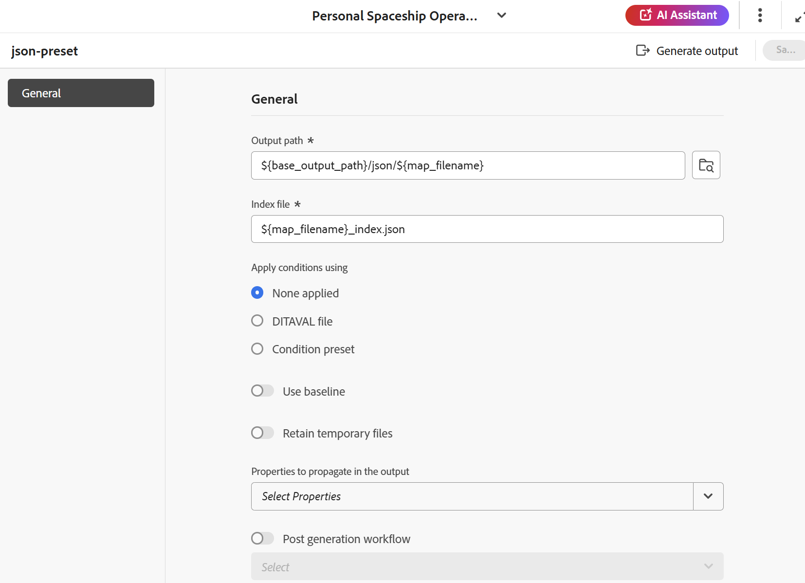

# JSON {#id231KK0180T4}

Per creare il predefinito JSON dalla console Mappa, effettua le seguenti operazioni:

1. [Aprire un file mappa DITA nella console Mappa](./open-files-map-console.md).

   Puoi anche accedere al file mappa dal widget **File recenti** nella [sezione Panoramica](./intro-home-page.md#overview). Il file di mappa selezionato viene aperto nella console Mappa.
1. Nella scheda **Predefiniti di output**, seleziona l&#39;icona + per creare un predefinito di output.
1. Seleziona **JSON** dal menu a discesa Tipo nella finestra di dialogo **Nuovo predefinito di output**.
1. Nel campo **Name**, specifica un nome per questo predefinito.
1. Selezionare l&#39;opzione **Aggiungi al profilo cartella corrente** per creare un predefinito di output nel profilo cartella corrente. L&#39;icona  indica un predefinito a livello di profilo della cartella.

   Ulteriori informazioni su [Gestire i predefiniti di output per profili globali e cartelle](./web-editor-manage-output-presets.md).

1. Seleziona **Aggiungi**.

   Viene creato il predefinito JSON.

   {width="300" align="left"}

Una volta creato il predefinito, potete configurare le seguenti configurazioni di predefiniti disponibili nella scheda Generale (General).

- Percorso di output
- File indice
- Applica condizioni utilizzando \(se le condizioni sono definite per una mappa\)
- Usa baseline \(Se viene creata una baseline per una mappa\)
- Mantieni file temporanei
- Proprietà da propagare nell’output
- Flusso di lavoro di post generazione

Per ulteriori informazioni, vedere [Configurazione JSON](#json-configuration).

{align="left"}

## Configurazione JSON

Per il predefinito JSON sono disponibili le seguenti opzioni:

>[!NOTE]
>
> Puoi anche modificare il file JSON nell’editor.

| Opzioni JSON | Descrizione |
| --- | --- |
| Percorso di output | Il percorso all’interno dell’archivio AEM in cui è memorizzato l’output JSON. Il percorso di output è impostato tramite la variabile `${base_output_path}`, configurata dall&#39;amministratore. Per configurare il percorso di output, visualizzare [Configurare il percorso di output di base per i servizi cloud](../native-pdf/configure-base-location-cs.md) o [Configurare il percorso di output di base per i servizi locali](../native-pdf/configure-base-output-location.md) in base al servizio in uso. |
| File indice | Puoi assegnare un nome al file di indice che stai creando per l’output JSON. Per impostazione predefinita, seleziona il nome del file della mappa DITA e aggiunge un suffisso (ad esempio `map_filename_index.json`).  È inoltre possibile utilizzare le variabili durante l&#39;impostazione del file di indice. Per ulteriori dettagli sull&#39;utilizzo delle variabili, visualizzare [Utilizzare le variabili per impostare le opzioni Percorso di destinazione, Nome sito o Nome file](generate-output-use-variables.md#id18BUG70K05Z). |
| Applica condizioni utilizzando | Selezionare una delle opzioni seguenti:  * **Nessuna applicazione**: selezionare questa opzione se non si desidera applicare alcuna condizione all&#39;output pubblicato. * **File DITAVAL**: selezionare i file DITAVAL per generare contenuto personalizzato. È possibile selezionare più file DITAVAL utilizzando la finestra di dialogo Sfoglia o digitando il percorso del file. Utilizza l’icona a forma di croce accanto al nome del file per rimuoverlo. I file DITAVAL vengono valutati nell&#39;ordine specificato, pertanto le condizioni specificate nel primo file hanno la precedenza rispetto a quelle specificate nei file successivi. È possibile mantenere l&#39;ordine dei file aggiungendo o eliminando file. È inoltre possibile applicare contrassegni all&#39;interno di un file DITAVAL per contrassegnare visivamente il contenuto. Ogni flag può includere un’immagine e avere uno stile utilizzando una formattazione come il grassetto o il corsivo. Per ulteriori dettagli sulla personalizzazione degli stili di contrassegno o sulla risoluzione dei conflitti di formattazione, vedere [Utilizzare l&#39;editor DITAVAL](../user-guide/ditaval-editor.md). Se il file DITAVAL viene spostato in un&#39;altra posizione o eliminato, non viene eliminato automaticamente dal dashboard delle mappe. È necessario aggiornare il percorso nel caso in cui i file vengano spostati o eliminati. Passa il cursore del mouse sul nome del file per visualizzare il percorso nell’archivio AEM in cui è memorizzato il file. È possibile selezionare solo i file DITAVAL e viene visualizzato un errore se è stato selezionato un altro tipo di file. * **Predefinito condizione**: seleziona un predefinito condizione dall&#39;elenco a discesa per applicare una condizione durante la pubblicazione dell&#39;output. L&#39;opzione è visibile se è stata aggiunta una condizione presente nella scheda Predefiniti condizione della console Mappa DITA. Per ulteriori informazioni sul predefinito di condizione, visualizzare [Usa predefiniti di condizione](generate-output-use-condition-presets.md#id1825FL004PN). |
| Usa linea di base | Se è stata creata una baseline per la mappa DITA selezionata, selezionare questa opzione per specificare la versione da pubblicare.  Visualizza [Utilizza la previsione](generate-output-use-baseline-for-publishing.md#id1825FI0J0PF) per ulteriori dettagli. |
| Mantieni file temporanei | Selezionare questa opzione per mantenere i file temporanei generati da DITA-OT. Se si verificano errori durante la generazione dell&#39;output tramite DITA-OT, selezionare questa opzione per mantenere i file temporanei. È quindi possibile utilizzare tali file per risolvere eventuali errori di generazione dell&#39;output.    Dopo aver generato l&#39;output, selezionare l&#39;icona **Scarica file temporanei**  per scaricare la cartella ZIP contenente i file temporanei. I file scaricati includerebbero anche `system_config.xml` file che fornisce informazioni sull&#39;URL dell&#39;autore, sull&#39;URL locale e sull&#39;URL di pubblicazione. Questi URL sono configurati nelle impostazioni di esternalizzazione di AEM e si riflettono nel file `system_config.xml`.    **Nota**: se le proprietà del file vengono aggiunte durante la generazione, i file temporanei di output includono anche un file *metadata.xml* contenente tali proprietà. |
| Proprietà da propagare nell’output | Seleziona le proprietà da elaborare come metadati. Queste proprietà vengono impostate dalla pagina Proprietà del file mappa DITA o del file mappa segnalibro. Le proprietà selezionate dall&#39;elenco a discesa sono elencate sotto il campo Proprietà.  **Nota**: è inoltre possibile definire proprietà personalizzate e passare i metadati all&#39;output utilizzando la pubblicazione DITA-OT. Per ulteriori dettagli, [Utilizzare i metadati](metadata-dita.md#id21BJ00QD0XA). |
| Flusso di lavoro di post generazione | Quando scegli questa opzione, viene visualizzato un nuovo elenco a discesa Flusso di lavoro di post-generazione contenente tutti i flussi di lavoro configurati in AEM. È necessario selezionare un flusso di lavoro da eseguire dopo il completamento del flusso di lavoro di generazione dell&#39;output.  **Nota**: per ulteriori informazioni sulla creazione di un flusso di lavoro di generazione post-output personalizzato, vedere _Personalizzare il flusso di lavoro di generazione post-output_ nella guida Installare e configurare Adobe Experience Manager Guides as a Cloud Service. |

**Argomento padre:**&#x200B;[&#x200B; Informazioni sui predefiniti di output](generate-output-understand-presets.md)
