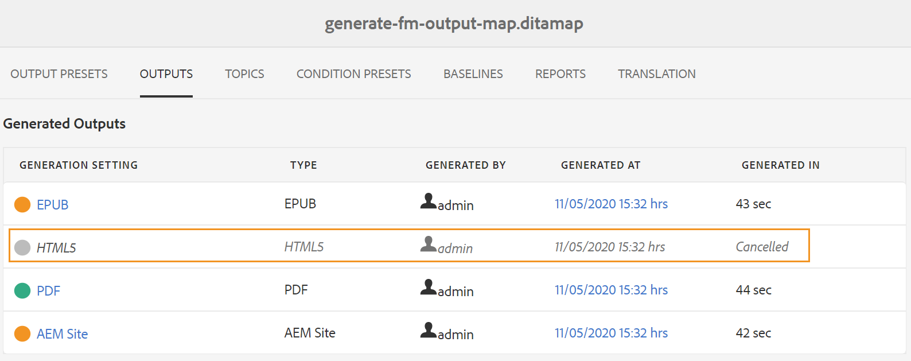

# Gestisci processo di generazione output

Adobe Experience Manager Guides consente di eseguire le seguenti azioni sull’output generato:

- [Visualizza lo stato dell&#39;attività di generazione output](#view-the-status-of-the-output-generation-task)
- [Annullare un&#39;attività di generazione output](#cancel-an-output-generation-task)
- [Eliminare un’attività di output](#delete-an-output-task)

## Visualizza lo stato dell&#39;attività di generazione output

Dopo aver avviato l&#39;attività di generazione dell&#39;output per una mappa o rigenerato gli argomenti selezionati, Experience Manager Guides invia l&#39;operazione alla coda di generazione dell&#39;output. Questa coda viene aggiornata in tempo reale, mostrando lo stato di ogni operazione di generazione output nella coda.

1. Nell’interfaccia utente di Assets, individua e apri il file di mappa di cui desideri controllare lo stato di generazione dell’output.

1. Selezionare **OUTPUT**.

   {align="left"}

   La pagina Output è divisa in due parti:

   - **Output in coda:**

     Elenca gli output in attesa di generazione o in fase di generazione. Le attività in coda o in corso vengono visualizzate con un&#39;icona blu prima del nome del predefinito. È inoltre possibile trovare l&#39;impostazione di generazione dell&#39;output o il predefinito utilizzato per l&#39;attività in coda, il tipo, l&#39;utente che ha avviato l&#39;attività, il tempo trascorso dalla data di accodamento dell&#39;attività e lo stato corrente.

     Selezionare il collegamento per accedere al **Dashboard di pubblicazione** e visualizzare lo stato di esecuzione corrente. Nel dashboard di pubblicazione è disponibile un elenco di tutte le attività di pubblicazione attive. I **Output in coda** e il collegamento **Dashboard di pubblicazione** vengono visualizzati solo quando sono presenti output in attesa di generazione o in fase di generazione. Non vengono visualizzate al completamento delle attività di output.Per ulteriori dettagli su Dashboard di pubblicazione, visualizzare [Gestisci attività di pubblicazione tramite Dashboard di pubblicazione](generate-output-publish-dashboard.md#).

   - **Output generati**

     Elenca le attività di output completate. Anche in questo caso, le informazioni mostrate qui sono simili a quelle della sezione Output in coda, ma con alcune differenze. Sono disponibili nuove informazioni sotto forma di icona dei risultati di output e del tempo di generazione dell&#39;output.

     In questo elenco è possibile che siano presenti attività eseguite correttamente, attività eseguite con un messaggio o attività non riuscite. Le attività completate vengono visualizzate con l&#39;icona verde, quelle con un messaggio con l&#39;icona arancione e quelle non riuscite con l&#39;icona rossa.

     Per tutte le attività, il processo di pubblicazione crea un file di registro \(logs.txt\) a cui è possibile accedere selezionando il collegamento nella colonna Generato a. Per le attività con errori o messaggi, è possibile controllare il file di log, illustrato nella sezione [Visualizza e controllare il file di log](generate-output-basic-troubleshooting.md#id1822G0P0CHS).

     >[!NOTE]
     >
     > Quando selezioni il collegamento dell’output PDF generato, ti viene chiesto di scaricare PDF.

## Annullare un&#39;attività di generazione output

Experience Manager Guides offre agli editori un modo semplice per annullare qualsiasi attività di pubblicazione in corso. In qualità di editore, puoi annullare un&#39;attività di pubblicazione in corso dalla console delle mappe DITA o dal [Dashboard di pubblicazione](generate-output-publish-dashboard.md#).

Per annullare un&#39;attività di generazione output dalla console delle mappe DITA, effettuare le seguenti operazioni:

1. Nell’interfaccia utente di Assets, individua e apri il file di mappa di cui desideri annullare un’attività di generazione output in corso.

1. Selezionare **OUTPUT**.

1. Nell&#39;elenco **Output in coda**, posizionare il puntatore del mouse su un&#39;attività che si desidera annullare.

1. Selezionare l&#39;icona **Annulla processo**.

   {align="left"}

1. Selezionare **Sì** al prompt dei messaggi **Conferma annullamento**.

   {align="left"}

   Se l&#39;attività non è ancora stata avviata, il comando di annullamento viene eseguito sull&#39;attività. Per un&#39;attività che viene annullata, lo stato è impostato su Annullamento.

   Una volta annullata, l&#39;attività viene spostata nell&#39;elenco **Output generati** con stato **Annullato**. Quando passi il cursore del mouse sull’attività annullata, viene visualizzato il nome dell’utente che ha annullato l’attività. Nella schermata seguente, l&#39;attività *HTML5* è stata annullata.

   {align="left"}

## Eliminare un’attività di output

Quando si generano più output per una mappa DITA, in un periodo di tempo l&#39;elenco Output generati per tale mappa diventa molto lungo. In qualità di editore, è possibile cancellare la cronologia di output di qualsiasi file mappa rimuovendo le attività obsolete dall&#39;elenco *Output generati*. L&#39;output non viene rimosso dal sistema, ma solo la voce dell&#39;output generato viene rimossa dall&#39;elenco *Output generati*.

Per rimuovere un task di output dall&#39;elenco Output generato, effettuare le operazioni riportate di seguito.

1. Nell’interfaccia utente di Assets, individua e apri il file di mappa da cui desideri eliminare le attività.

1. Selezionare **OUTPUT**.

1. Nell&#39;elenco **Output generati**, posizionare il puntatore del mouse su un&#39;attività che si desidera eliminare.

1. Seleziona l’icona Elimina.

   {align="left"}

1. Selezionare **Sì** nella **Conferma eliminazione**.

   L&#39;attività viene eliminata dall&#39;elenco Output generati.
