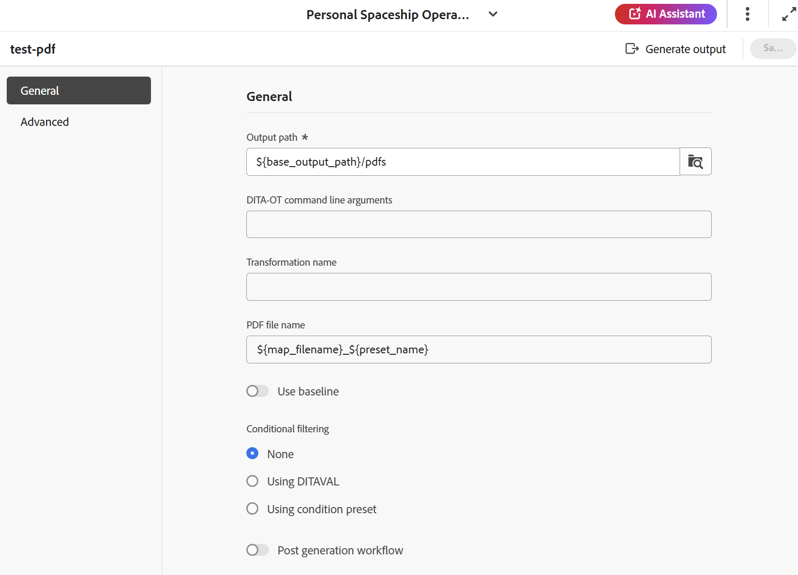

# Crea predefinito di output PDF DITA-OT {#id205BE600HAH}

È possibile creare il predefinito di output PDF DITA-OT in due modi:

- [Creare il predefinito PDF DITA-OT dalla console Mappa](#create-the-dita-ot-pdf-preset-from-the-map-console)
- [Creare il predefinito PDF DITA-OT dal dashboard Mappa](#create-the-dita-ot-pdf-preset-from-the-map-dashboard)

## Creare il predefinito PDF DITA-OT dalla console Mappa

Per creare il predefinito PDF dalla console Mappa, effettua le seguenti operazioni:

1. [Aprire un file mappa DITA nella console Mappa](./open-files-map-console.md).

   Puoi anche accedere al file mappa dal widget **File recenti** nella [sezione Panoramica](./intro-home-page.md#overview). Il file di mappa selezionato viene aperto nella console Mappa.
1. Nella scheda **Predefiniti di output**, seleziona l&#39;icona + per creare un predefinito di output.
1. Selezionare **PDF** dal menu a discesa Tipo nella finestra di dialogo **Nuovo predefinito di output**.
1. Nel campo **Name**, specifica un nome per questo predefinito.
1. Nel campo **Genera PDF utilizzando**, selezionare **DITA-OT**.
1. Selezionare l&#39;opzione **Aggiungi al profilo cartella corrente** per creare un predefinito di output nel profilo cartella corrente. L&#39;icona  indica un predefinito a livello di profilo della cartella.

   Ulteriori informazioni su [Gestire i predefiniti di output per profili globali e cartelle](./web-editor-manage-output-presets.md).

1. Seleziona **Aggiungi**.

   Viene creato il predefinito per PDF.

   {width="350" align="left"}

Nella console Mappa, le opzioni di configurazione predefinite per DITA-OT sono organizzate nelle schede **Generale** e **Avanzate** nella console Mappa.

{width="350" align="left"}

**Generale**

La scheda **Generale** contiene le seguenti opzioni di configurazione:

- Percorso di output
- Argomenti riga di comando DITA-OT
- Nome file PDF
- Filtro condizionale \(Se le condizioni sono definite per una mappa\)
- Usa baseline \(Se viene creata una baseline per una mappa\)
- Flusso di lavoro di post generazione

**Avanzate**

La scheda **Avanzate** contiene le opzioni di configurazione seguenti:

- Abilita controllo delle versioni
- Mantieni file temporanei
- Proprietà file

Per informazioni dettagliate sulle opzioni di configurazione del predefinito, consulta la sezione [Configurazione del predefinito PDF](#pdf-preset-configuration).

## Creare il predefinito PDF DITA-OT dal dashboard Mappa

Per creare il predefinito PDF dal dashboard delle mappe, effettua le seguenti operazioni:

1. Nell&#39;interfaccia utente di Assets, accedi alla mappa DITA e selezionala per aprirla nel dashboard delle mappe.
1. Verificare che la scheda **Predefiniti di output** sia selezionata.
1. Seleziona **Crea** nella barra degli strumenti.

   Viene visualizzato un nuovo modulo per la creazione di predefiniti di output.

1. Immettete i dettagli di configurazione richiesti per il predefinito PDF.
1. Seleziona **Fine** per salvare le impostazioni del predefinito.

## Configurazione del predefinito PDF

Le opzioni di configurazione variano leggermente a seconda che il predefinito sia configurato dalla console Mappa o dal dashboard Mappa. Alcune opzioni sono valide solo per il dashboard Mappa, mentre altre sono valide per entrambe.

Nei casi in cui la stessa configurazione abbia due etichette di campo diverse, un **/** le separa nella tabella seguente. Il primo rappresenta l’etichetta nella console Mappa e il secondo rappresenta l’etichetta nel dashboard Mappa.

Ad esempio, **Percorso di output/Percorso di destinazione** - In questo caso, **Percorso di output** è l&#39;etichetta utilizzata nella console Mappa, mentre **Percorso di destinazione** è l&#39;etichetta utilizzata nel dashboard Mappa per la stessa configurazione.

| Opzioni PDF | Descrizione |
| --- | --- |
| Tipo di output (*Applicabile solo per dashboard mappe*) | Tipo di output che si desidera generare. Per generare l&#39;output di PDF, scegliere l&#39;opzione PDF. |
| Nome impostazione (*Applicabile solo per dashboard mappa*) | Assegna un nome descrittivo alle impostazioni di output di PDF che stai creando. Ad esempio, puoi specificare _Output clienti interni_ o _Output utenti finali_. |
| Genera PDF utilizzando (*Applicabile solo per dashboard mappe*) | Selezionare **DITA-OT** per generare l&#39;output di PDF. Seleziona **FrameMaker Publishing Server** se l&#39;amministratore ha configurato questa opzione. Alcune delle opzioni di configurazione variano quando si seleziona FMPS. Inoltre, l&#39;opzione di configurazione FMPS è disponibile solo nel dashboard Mappa. |
| Percorso di output/Percorso di destinazione | Il percorso all’interno dell’archivio AEM in cui è memorizzato PDF. Il percorso di output è impostato tramite la variabile `${base_output_path}`, configurata dall&#39;amministratore. Per configurare il percorso di output, visualizzare [Configurare il percorso di output di base per i servizi cloud](../native-pdf/configure-base-location-cs.md) o [Configurare il percorso di output di base per i servizi locali](../native-pdf/configure-base-output-location.md) in base ai servizi in uso.  È inoltre possibile utilizzare alcune variabili predefinite per definire il percorso di output, visualizzare [Utilizzare le variabili per impostare le opzioni Percorso di destinazione, Nome sito o Nome file](generate-output-use-variables.md#id18BUG70K05Z). |
| Argomenti riga di comando DITA-OT | Specificare gli argomenti aggiuntivi che si desidera vengano elaborati da DITA-OT durante la generazione dell&#39;output. Per informazioni dettagliate sugli argomenti della riga di comando supportati in DITA-OT, visualizzare la [documentazione DITA-OT](https://www.dita-ot.org/). |
| Nome della trasformazione | Specifica il tipo di output da generare. Questa opzione è necessaria se si desidera generare l&#39;output utilizzando un plug-in personalizzato, integrato nel plug-in DITA-OT. Se ad esempio si desidera generare l&#39;output XHTML, specificare `xhtml`. Per un elenco delle trasformazioni disponibili in DITA-OT, visualizzare [Trasformazioni DITA-OT (formati di output)](http://www.dita-ot.org/2.3/user-guide/AvailableTransforms.html) nella Guida utente OASIS DITA-OT. |
| Nome file/Nome file PDF | Specificare il nome del file con cui si desidera salvare il PDF.  È inoltre possibile utilizzare le variabili durante l&#39;impostazione del nome del file PDF. Per ulteriori dettagli sull&#39;utilizzo delle variabili, visualizzare [Utilizzare le variabili per impostare le opzioni Percorso di destinazione, Nome sito o Nome file](generate-output-use-variables.md#id18BUG70K05Z).  **Nota**: se non si specifica un nome di file, verrà utilizzato il titolo della mappa DITA per generare il nome di file finale di PDF. Se la mappa non ha un titolo, viene utilizzato il nome file della mappa DITA per assegnare il nome al PDF finale. Il nome del file viene bonificato utilizzando le regole configurate nel sistema per gestire qualsiasi carattere non valido. |
| Filtro condizionale/Applica condizioni tramite | Selezionare una delle opzioni seguenti:  * **Nessuna applicazione**: selezionare questa opzione se non si desidera applicare alcuna condizione all&#39;output pubblicato. * **File DITAVAL**: selezionare i file DITAVAL per generare contenuto personalizzato. È possibile selezionare più file DITAVAL utilizzando la finestra di dialogo Sfoglia o digitando il percorso del file. Utilizza l’icona a forma di croce accanto al nome del file per rimuoverlo. I file DITAVAL vengono valutati nell&#39;ordine specificato, pertanto le condizioni specificate nel primo file hanno la precedenza rispetto a quelle specificate nei file successivi. È possibile mantenere l&#39;ordine dei file aggiungendo o eliminando file.  È inoltre possibile applicare contrassegni all&#39;interno di un file DITAVAL per contrassegnare visivamente il contenuto. Ogni flag può includere un’immagine e avere uno stile utilizzando una formattazione come il grassetto o il corsivo. Per ulteriori dettagli sulla personalizzazione degli stili di contrassegno o sulla risoluzione dei conflitti di formattazione, vedere [Utilizzare l&#39;editor DITAVAL](../user-guide/ditaval-editor.md). Se il file DITAVAL viene spostato in un&#39;altra posizione o eliminato, non viene eliminato automaticamente dal dashboard delle mappe. È necessario aggiornare il percorso nel caso in cui i file vengano spostati o eliminati. Passa il cursore del mouse sul nome del file per visualizzare il percorso nell’archivio AEM in cui è memorizzato il file. È possibile selezionare solo i file DITAVAL e viene visualizzato un errore se è stato selezionato un altro tipo di file. FrameMaker Publishing Server non supporta più file DITAVAL. * **Predefinito condizione**: seleziona un predefinito condizione dall&#39;elenco a discesa per applicare una condizione durante la pubblicazione dell&#39;output. L&#39;opzione è visibile se è stata aggiunta una condizione presente nella scheda Predefiniti condizione della console Mappa DITA. Per ulteriori informazioni sul predefinito di condizione, visualizzare [Usa predefiniti di condizione](generate-output-use-condition-presets.md#id1825FL004PN). |
| Esegui flusso di lavoro di post-generazione | Quando scegli questa opzione, viene visualizzato un nuovo elenco a discesa Flusso di lavoro di post-generazione contenente tutti i flussi di lavoro configurati in AEM. È necessario selezionare un flusso di lavoro da eseguire dopo il completamento del flusso di lavoro di generazione dell&#39;output.  **Nota**: per ulteriori informazioni sulla creazione di un flusso di lavoro di generazione post-output personalizzato, vedi Personalizzare il flusso di lavoro di generazione post-output in Installare e configurare Adobe Experience Manager Guides as a Cloud Service. |
| Usa linea di base | Se è stata creata una baseline per la mappa DITA selezionata, selezionare questa opzione per specificare la versione da pubblicare.  Visualizza [Utilizza la previsione](generate-output-use-baseline-for-publishing.md#id1825FI0J0PF) per ulteriori dettagli. |
| Mantieni file temporanei | Selezionare questa opzione per mantenere i file temporanei generati da DITA-OT. Se si verificano errori durante la generazione dell&#39;output tramite DITA-OT, selezionare questa opzione per mantenere i file temporanei. È quindi possibile utilizzare tali file per risolvere eventuali errori di generazione dell&#39;output.    Dopo aver generato l&#39;output, selezionare l&#39;icona **Scarica file temporanei**  per scaricare la cartella ZIP contenente i file temporanei. I file scaricati includerebbero anche `system_config.xml` file che fornisce informazioni sull&#39;URL dell&#39;autore, sull&#39;URL locale e sull&#39;URL di pubblicazione. Questi URL sono configurati nelle impostazioni di esternalizzazione di AEM e si riflettono nel file `system_config.xml`.   **Nota**: se le proprietà del file vengono aggiunte durante la generazione, i file temporanei di output includono anche un file *metadata.xml* contenente tali proprietà. |
| Proprietà file | Seleziona le proprietà da elaborare come metadati. Queste proprietà vengono impostate dalla pagina Proprietà del file mappa DITA o del file mappa segnalibro. Le proprietà selezionate dall&#39;elenco a discesa vengono visualizzate nel campo **Proprietà file**. Seleziona l’icona a forma di croce accanto alla proprietà per rimuoverla.   Nota: è inoltre possibile trasferire i metadati all&#39;output utilizzando la pubblicazione DITA-OT. Per ulteriori dettagli, [Trasmettere i metadati all&#39;output utilizzando DITA-OT](pass-metadata-dita-ot.md#id21BJ00QD0XA). |

**Argomento padre:**[ Informazioni sui predefiniti di output](generate-output-understand-presets.md)
