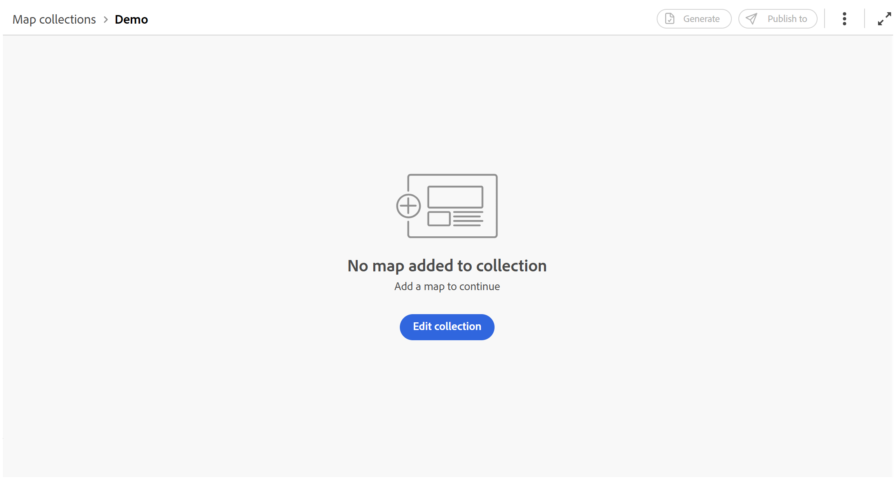
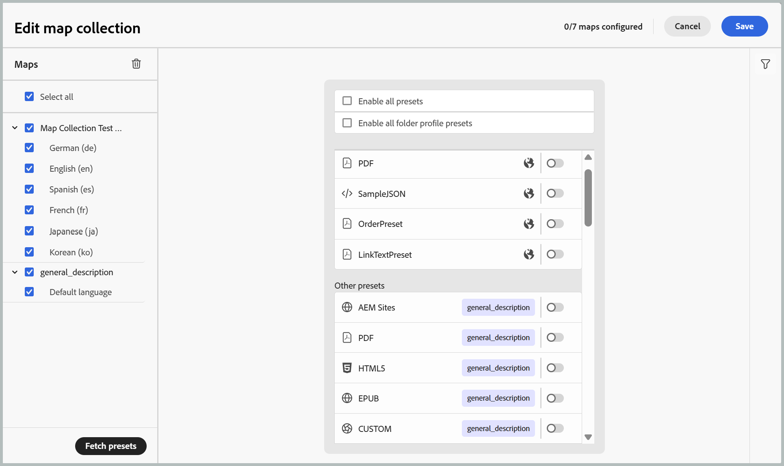

# Usa nuova raccolta mappe per la generazione dell&#39;output (Beta)

>[!IMPORTANT]
>
> La nuova raccolta di mappe è disponibile in Experience Manager Guides as a Cloud Service a partire dalla versione 2026.06.0. Contatta il team di successo del cliente per abilitare questa funzione.

La raccolta delle mappe in Adobe Experience Manager Guides consente agli specialisti della pubblicazione di organizzare più documenti in un’unica raccolta, controllare l’output generato per ciascun documento e generare e pubblicare in modo efficiente gli output in batch da un dashboard centralizzato. Inoltre, fornisce visibilità sull’avanzamento della generazione dell’output, evidenzia le modifiche apportate alle mappe dall’ultimo output pubblicato e consente di ripubblicare il contenuto quando necessario.

La nuova raccolta mappe consolida le funzionalità precedentemente distribuite nella vecchia raccolta mappe e la pubblicazione in blocco in un&#39;unica interfaccia unificata. Una volta abilitate, è possibile gestire mappe, predefiniti, cronologia di generazione, cronologia di pubblicazione, metadati e appartenenza alle raccolte da un&#39;unica posizione.

## Creare una raccolta di mappe e aggiungere mappe DITA

Per creare una raccolta di mappe e aggiungervi le mappe, effettuare le seguenti operazioni:

1. Apri la home page di Experience Manager Guides e seleziona **Nuove raccolte mappe**.

   Viene aperta la pagina **Mappa raccolte**.

   {width="650"}

1. Nella pagina **Mappa raccolte**, seleziona **Crea** in alto a destra e fornisci **Nome** per la nuova raccolta mappe.

   {width="350"}

1. Seleziona **Crea**.

   Al momento della creazione della raccolta di mappe viene visualizzato un messaggio di operazione riuscita.

1. Apri la raccolta di mappe desiderata a cui desideri aggiungere le mappe.

   

   Passando il puntatore del mouse sul titolo della raccolta di mappe, puoi eseguire le azioni seguenti:

   - **Genera cronologia**: consente di passare direttamente alla scheda Cronologia generata in cui sono elencate tutte le mappe con output generati per i predefiniti definiti.
   - **Cronologia pubblicazione**: consente di passare direttamente alla scheda Cronologia pubblicata, in cui sono elencate tutte le mappe con output pubblicato per i predefiniti definiti.
   - **Rinomina**: rinomina la raccolta mappe.

1. Seleziona **Modifica raccolta**, quindi seleziona **Aggiungi mappe**.

   

1. Seleziona le mappe desiderate e abilita l&#39;interruttore **Seleziona traduzioni disponibili** per aggiungere automaticamente tutte le copie di traduzione disponibili di quella mappa alla raccolta di mappe. Se la mappa non dispone di copie di traduzione, la lingua predefinita viene aggiunta alla mappa.

   

1. Seleziona **Aggiungi**.

   I file di mappa sono elencati insieme a tutte le copie tradotte disponibili. Per le mappe che non hanno copie tradotte, viene visualizzata la lingua predefinita.

   

1. Seleziona le mappe richieste o tutte le mappe elencate, quindi seleziona il pulsante **Recupera predefiniti** per recuperare i predefiniti disponibili per le mappe selezionate.

   Viene visualizzato un elenco di tutti i predefiniti disponibili per le mappe selezionate, raggruppati in due categorie: **Predefiniti profilo cartella** e **Altri predefiniti**. **I predefiniti del profilo cartella** sono comuni a tutte le mappe selezionate, mentre **Altri predefiniti** sono specifici per le singole mappe. Per i predefiniti in **Altri predefiniti**, la mappa associata è indicata accanto all&#39;interruttore corrispondente.

   

1. Seleziona **Abilita tutti i predefiniti** o **Abilita tutti i predefiniti del profilo di cartella**, a seconda delle tue esigenze. Per limitare l’elenco, puoi anche utilizzare l’icona Filtro a destra. Il filtro fornisce due livelli di filtro: **Tipi di predefinito** per limitare i predefiniti elencati e **Stato mappa** per scegliere mappe specifiche dal pannello Mappe.

   

1. Seleziona **Salva**.

Ottieni un elenco di tutte le mappe desiderate con il titolo della mappa, il nome file corrispondente, la lingua in cui è disponibile e i predefiniti configurati.

La scheda **Mappe e predefiniti** presenta le informazioni in base alle mappe selezionate per una lingua specifica nelle colonne seguenti:

- **Predefinito**: mostra il tipo di predefinito di output configurato nel file di mappa.
- **Linea di base**: mostra la linea di base utilizzata dal predefinito di output.  Se non viene utilizzata alcuna linea di base, verrà visualizzato un trattino `-`.
- **Modificato dalla generazione**: indica se la mappa DITA viene aggiornata dopo la generazione. In base a queste informazioni, è possibile decidere se pubblicare o meno l&#39;output per questa mappa DITA.
- **Modificato dalla pubblicazione**: indica se la mappa DITA è stata aggiornata dopo l&#39;ultima pubblicazione. In base a queste informazioni, è possibile decidere se ripubblicare o meno l&#39;output per questa mappa DITA.
- **Ultima generazione**: mostra la data e l&#39;ora dell&#39;ultimo output generato.
- **Ultima pubblicazione**: mostra la data e l&#39;ora dell&#39;ultimo output pubblicato.

**Opzioni di filtro**

Nel pannello a destra della pagina Mappe e predefiniti sono disponibili le seguenti opzioni di filtro:

- **Modificato dalla generazione**: selezionare Sì, No o Non ancora generato. Se si seleziona Sì, nella scheda Mappe e predefiniti vengono visualizzate solo le mappe che sono state modificate dopo la generazione.
- **Modificato dopo la pubblicazione**: è possibile selezionare Sì, No o Non ancora generato. Se selezioni Sì, nella scheda Mappe e predefiniti vengono visualizzate solo le mappe che sono state modificate dopo la pubblicazione.
- **Predefiniti**: selezionare un predefinito per il quale si desidera filtrare i file di mappa. Se ad esempio si sceglie il predefinito *Sito AEM*, verranno visualizzate solo le mappe con il predefinito di output *Sito AEM* configurato.
- **Lingua**: è possibile selezionare qualsiasi codice lingua disponibile e visualizzare solo la lingua selezionata nella scheda Mappe e predefiniti.

  

## Generare l’output utilizzando una raccolta di mappe

Per generare l&#39;output utilizzando una raccolta di mappe, effettuare le seguenti operazioni:

1. Apri la raccolta di mappe. Puoi visualizzare i vari predefiniti di output come AEM Sites, PDF (incluso Native PDF), HTML5, EPUB e Predefiniti personalizzati in base alla configurazione.

1. Per generare l&#39;output per le mappe selezionate, selezionare i file di mappa richiesti e i predefiniti specifici, quindi selezionare **Genera**.

   >[!IMPORTANT]
   >
   > Se un processo di generazione dell&#39;output per un predefinito o una mappa DITA è in coda o in corso, non è possibile avviare un&#39;altra attività di generazione dell&#39;output per lo stesso predefinito o mappa.

1. Una volta generato l&#39;output, passa alla scheda **Cronologia generata** per visualizzare l&#39;elenco di tutte le mappe generate. È possibile tenere traccia dell&#39;avanzamento della generazione nella colonna **Stato**, che indica se una generazione è in esecuzione o completata.

   

1. Seleziona **Aggiorna** per visualizzare lo stato più recente del processo di generazione. La colonna Stato (Status) viene aggiornata per riflettere lo stato corrente di ciascuna mappa e dei relativi predefiniti associati:

   - **Completato (verde)**: generazione completata.
   - **Fine (rosso)**: generazione completata con errori. I dettagli dell’errore possono essere visualizzati nei registri.
   - **Esecuzione (blu)**: generazione in corso.

   

1. È inoltre possibile annullare l&#39;attività di generazione dell&#39;output finché lo stato dell&#39;attività non viene eseguito selezionando l&#39;icona **Annulla generazione**.

   

1. Inoltre, puoi visualizzare l&#39;output generato per le mappe la cui generazione di output è stata completata selezionando l&#39;icona **Apri output** che viene visualizzata quando passi il cursore sul nome della mappa, oppure visualizzare i registri di generazione selezionando l&#39;icona adiacente **Registri**.

   

## Pubblicare l’output utilizzando una raccolta di mappe

Per pubblicare (se configurato) l’output utilizzando una raccolta di mappe, effettua le seguenti operazioni:

1. Seleziona le mappe desiderate dalla scheda **Mappe e predefiniti** o dalla scheda **Cronologia generata** e seleziona **Pubblica in**.
1. Selezionare l&#39;ambiente di destinazione in cui si desidera pubblicare l&#39;output: **Anteprima** o **Pubblica** istanza.

   

1. Passa alla scheda **Cronologia pubblicata** per monitorare lo stato dell&#39;attività di pubblicazione.

   

1. Seleziona **Aggiorna** per visualizzare lo stato più recente dell&#39;attività.
1. Quando lo stato diventa **Completato**, verifica il contenuto pubblicato nell&#39;istanza di destinazione selezionata.

## Configurare le proprietà dei metadati

Nell&#39;insieme map è possibile configurare le proprietà dei metadati in blocco per le mappe DITA. Seleziona l&#39;icona **Configura metadati** dalla scheda **Mappe e predefiniti** per aprire la pagina **Metadati risorsa**. Nella pagina **Metadati risorsa**, tutte le mappe presenti nella raccolta sono elencate a sinistra.

Per configurare le proprietà dei metadati, effettua le seguenti operazioni:

1. Puoi scegliere le mappe per le quali desideri aggiornare i metadati. Per impostazione predefinita, vengono selezionate tutte le mappe DITA presenti.

1. Dopo aver selezionato le mappe DITA, è possibile visualizzare proprietà quali metadati, attivazione o disattivazione della pianificazione, riferimenti, stato del documento e altro ancora.

1. Aggiorna le proprietà dei metadati.

1. Seleziona **Salva e chiudi** in alto per salvare gli aggiornamenti.
1. (Facoltativo) Quando aggiorni i tag, puoi anche selezionare Aggiungi nel menu a discesa **Salva e chiudi** per aggiungere i nuovi tag all&#39;elenco esistente.
1. Seleziona **Invia** dal menu a discesa **Salva e chiudi**.
Le proprietà dei metadati vengono aggiornate in blocco per le mappe DITA selezionate dall&#39;insieme di mappe.

>[!NOTE]
> 
>Per il menu a discesa **Stato documento**, è possibile selezionare solo gli stati del documento che sono consentiti in comune per tutte le mappe DITA selezionate. Per ulteriori informazioni, visualizzare [**Stato documento**](./web-editor-document-states.md).

Le proprietà dei metadati sono sincronizzate con le proprietà del file. Dopo averli aggiornati, puoi visualizzarli dal pannello **Proprietà file** nell&#39;editor.

**Argomento padre:**&#x200B;[&#x200B; Generazione output](generate-output.md)
