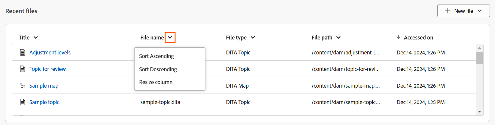
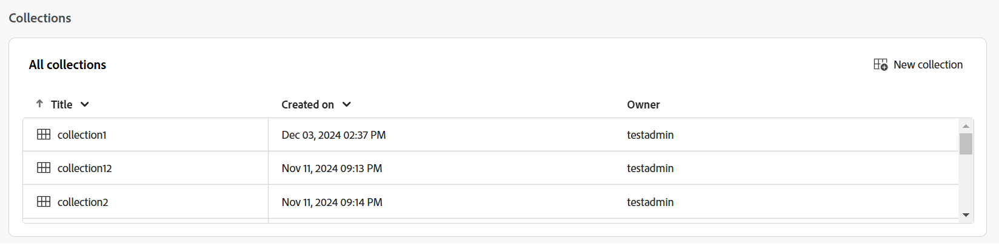

# Esperienza della pagina Home di Experience Manager Guides

La home page è la prima schermata visualizzata al momento dell&#39;accesso a Experience Manager Guides. Offre un’esperienza di schermata di benvenuto unificata e intuitiva, con una visualizzazione rapida dei file a cui hai effettuato l’accesso di recente, delle raccolte e altro ancora.

{align="left"}

La home page di Experience Manager Guides è suddivisa nelle sezioni seguenti:

- Barra intestazione
- Barra di spostamento
- Pannello sinistro

## Barra intestazione

La barra dell’intestazione è la barra superiore della home page in cui viene visualizzato il logo Adobe Experience Manager (o Unified Shell, se utilizzi Unified Shell come interfaccia utente di Experience Manager Guides). Quando selezioni il logo, viene visualizzata la pagina di navigazione di Experience Manager.

{align="left"}

## Barra di spostamento

La barra di navigazione mette in primo piano gli strumenti per passare da una navigazione all’altra, personalizzare il layout della panoramica e regolare la visualizzazione della pagina. Viene inoltre visualizzato il profilo di cartella corrente in uso.

>[!NOTE]
>
> Se utilizzi Adobe Experience Manager Guides as a Cloud Service, nella barra di navigazione viene visualizzata una funzione aggiuntiva denominata **Assistente IA**.

{align="left"}

Le funzioni disponibili nella barra di navigazione sono illustrate come segue:

- **Commutatore di navigazione**: consente la navigazione diretta ad altre pagine:
   - **Home**: pagina predefinita visualizzata all&#39;accesso a Experience Manager Guides.
   - **Editor**: un editor basato su Web di facile utilizzo che consente di creare e gestire documenti strutturati in Experience Manager Guides. [Scopri l&#39;interfaccia dell&#39;editor](./web-editor.md).
   - **Console mappe**: fornisce un&#39;area di lavoro dedicata per gestire tutti gli aspetti della gestione delle mappe e della pubblicazione. [Scopri l&#39;interfaccia della console Mappa](./map-console-overview.md).
- **Assistente AI**: uno strumento potente e basato sull&#39;intelligenza artificiale progettato per migliorare la produttività tramite le funzionalità di assistenza avanzata. Inoltre, quando lavori nell’interfaccia dell’editor, puoi sfruttare le funzionalità di authoring intelligente di AI Assistant che rende il processo di authoring più intelligente e veloce attraverso suggerimenti intelligenti per il riutilizzo e l’ottimizzazione dei contenuti.

  La funzionalità [Assistente AI](./ai-assistant.md) è attualmente disponibile solo per Adobe Experience Manager as a Cloud Service.
- **Personalizza sezione panoramica**: consente di nascondere o visualizzare i widget nella sezione Widget.
- **Profilo cartella in uso**: visualizza il profilo cartella attualmente in uso.
- **Altre azioni**: consente di accedere a opzioni aggiuntive. Selezionando questo pulsante si apre un menu con le seguenti opzioni:

   - **Assets**: ti porta a una destinazione in base alla tua configurazione.
      - **Servizi cloud**: se utilizzi Servizi cloud, quando selezioni l&#39;opzione **Assets** vieni reindirizzato alla pagina di navigazione di AEM.

      - **Software on-premise**: se si utilizza Adobe Experience Manager Guides (4.2.1 e versioni successive), se si seleziona l&#39;opzione **Assets**, verrà visualizzato il percorso del file corrente nell&#39;interfaccia utente di Assets.
   - **Impostazioni Workspace**: consente di accedere alla finestra di dialogo **Impostazioni Workspace**. Per ulteriori dettagli, visualizzare [Configurazione impostazioni di Workspace](../cs-install-guide/workspace-settings.md).

     >[!NOTE]
     >
     > Nella pagina Home, l’opzione delle impostazioni di Workspace è disponibile solo per l’impostazione dei servizi cloud. In una configurazione locale, l’opzione Altre azioni non è disponibile nella pagina Home. Tuttavia, è ancora possibile accedere alle impostazioni pertinenti tramite l’interfaccia dell’editor e la console Mappa, passando a Più opzioni > Impostazioni.

- **Espandi visualizzazione**: consente di espandere la visualizzazione della pagina utilizzando l&#39;icona **Espandi**. In questa visualizzazione, la barra dell’intestazione è nascosta e lo spazio disponibile risulta quindi notevolmente ridotto. Per tornare alla visualizzazione standard, utilizzare l&#39;icona **Esci dalla visualizzazione espansa**.

## Pannello sinistro

Il pannello a sinistra consente di accedere rapidamente alle funzioni Panoramica, Mappa raccolte, Pubblicazione in blocco, Coda di pubblicazione e Preferenze utente. Puoi espandere il pannello selezionando l&#39;icona **Espandi** posta nell&#39;angolo inferiore sinistro dell&#39;interfaccia. Una volta espanso, utilizza l&#39;icona **Comprimi** per comprimere il pannello.

{width="300" align="left"}

Ciò che visualizzi in questo pannello dipende dal tuo ruolo utente. Nella tabella seguente sono elencati i ruoli e le rispettive sezioni visualizzati nel pannello sinistro.

- **Amministratore e Publisher**: possibilità di visualizzare tutte le sezioni nel pannello.
- **Autore**: possibilità di visualizzare tutte le sezioni, ad eccezione della pubblicazione. Gli autori non hanno accesso alla sezione Mappa raccolte, Coda di pubblicazione e Pubblicazione in blocco.
- **Revisore**: possibilità di visualizzare solo la sezione Panoramica. Selezionando la sezione Panoramica viene visualizzato un messaggio di stato vuoto predefinito o il widget delle attività di Workfront a seconda che Adobe Workfront sia configurato o meno.

Le funzioni disponibili nel pannello a sinistra sono illustrate come segue:

- [Panoramica](#overview)
- [Mappa raccolte](#map-collections)
- [Pubblica in blocco](#bulk-publish)
- [Coda di pubblicazione](#publish-queue)
- [Preferenze utente](#user-preferences)

>[!NOTE]
>
> Inoltre, se l&#39;amministratore ha configurato l&#39;integrazione di Adobe Workfront nel sistema, nel pannello a sinistra viene visualizzata anche l&#39;opzione **Workfront**. Informazioni sull&#39;[integrazione Adobe Workfront](./workfront-integration.md) in Experience Manager Guides.

### Panoramica

**Panoramica** funziona come un dashboard personalizzato progettato per aumentare la produttività. È dotato di diversi widget che ti aiutano a rimanere organizzato e concentrato.

I widget consentono inoltre di ordinare e ridimensionare le colonne. Per visualizzare queste opzioni, seleziona l’intestazione della colonna e le opzioni vengono visualizzate in un elenco.

I widget seguenti sono presenti nella sezione Widget:

- **File recenti**: il widget fornisce un&#39;istantanea dei file aperti di recente (un elenco di file a cui si è effettuato l&#39;accesso nell&#39;editor) insieme ai dettagli chiave dei file, inclusi Titolo, Nome file, Tipo file, Percorso file e Accesso alle date.

  {align="left"}

  Puoi ordinare e ridimensionare le colonne selezionando le opzioni dal menu a discesa delle colonne. Per impostazione predefinita, i dati vengono ordinati in base alla data e all’ora dell’ultimo accesso.

  {align="left"}

  Da [Preferenze utente](#user-preferences), è possibile impostare il numero massimo di file che è possibile visualizzare in questo widget. Per impostazione predefinita, questo limite è impostato su **20**.

  Quando passi il cursore su un file, sono disponibili le seguenti opzioni:

   - **Apri nell&#39;editor**: consente di aprire il file nell&#39;editor. È inoltre possibile aprire un file selezionandolo semplicemente.
   - **Aggiungi/Rimuovi**: consente di aggiungere uno o più file al widget File recenti. I file bloccati vengono visualizzati nella parte superiore dell&#39;elenco dei widget. Per rimuovere un file, utilizzare l&#39;opzione **Rimuovi**.
   - **Rimuovi**: consente di rimuovere il file dal widget File recenti.

  **Crea nuovo file dal menu a discesa Nuovo file**

  Il menu a discesa **Nuovo file** consente di creare un argomento o una mappa DITA direttamente dal widget **File recenti**. Una volta creato correttamente il file, verrai reindirizzato all’interfaccia dell’editor in cui potrai lavorare sul file.

- **Raccolte**: se lavori su un set di file o cartelle, puoi aggiungerli a questo widget per accedervi rapidamente. Una volta aggiunti, puoi visualizzare i file per Titolo insieme ad altri dettagli chiave come Proprietario e Data di creazione. Quando selezioni il menu a discesa della colonna, puoi visualizzare le opzioni per ordinare e ridimensionare la colonna.

  {align="left"}

  Le breadcrumb della raccolta selezionata vengono visualizzate nella parte superiore del widget Raccolta. Puoi selezionarla per tornare a una cartella specifica all’interno della gerarchia.

  {align="left"}

  Quando passi il cursore su una raccolta e selezioni l&#39;icona Altro , sono disponibili le seguenti opzioni:

   - **Rinomina**: consente di rinominare la raccolta.
   - **Elimina**: consente di eliminare la raccolta.
   - **Visualizza nell&#39;interfaccia utente di Assets**: consente di aprire la raccolta nell&#39;interfaccia utente di Assets.

  Per aprire una raccolta, seleziona il relativo titolo. Quando passi il cursore su un file di raccolta e selezioni l&#39;icona Altro , sono disponibili le seguenti opzioni:

   - **Apri nell&#39;editor**: consente di aprire il file nell&#39;editor. In alternativa, è possibile selezionare il titolo del file per aprirlo.
   - **Apri nella console mappe**: consente di aprire il file mappa nella console mappe. Disponibile solo per un file di mappa DITA.
   - **Aggiungi a raccolte**: consente di aggiungere il file a una raccolta nuova o esistente.
   - **Rimuovi dalle raccolte**: consente di rimuovere il file dall&#39;elenco delle raccolte.
   - **Visualizza nell&#39;interfaccia utente di Assets**: consente di individuare il file nell&#39;interfaccia utente di Assets.

  **Crea una nuova raccolta dal menu a discesa Nuova raccolta**

  Il menu a discesa **Nuova raccolta** consente di creare una nuova raccolta e di aggiungerla al widget **Raccolte**.

>[!NOTE]
>
> Inoltre, se l&#39;amministratore ha configurato l&#39;integrazione di Adobe Workfront nel sistema, **Il widget delle attività** viene visualizzato anche nella sezione Widget. Ulteriori informazioni sull&#39;[integrazione Adobe Workfront](./workfront-integration.md#working-with-the-your-tasks-widget) in Experience Manager Guides.

### Mappare le raccolte

Experience Manager Guides consente di organizzare i contenuti per la pubblicazione utilizzando un dashboard denominato **Mappare le raccolte**. Per utilizzare questa funzione, seleziona **Mappa raccolte** dal pannello a sinistra. Viene visualizzata la pagina Mappa raccolte nell&#39;**interfaccia utente di Assets** in cui è possibile [utilizzare la raccolta mappe per la generazione dell&#39;output.](./generate-output-use-map-collection-output-generation.md)

### Pubblicazione in blocco

La funzione di attivazione in blocco consente di attivare in modo rapido e semplice il contenuto dall’istanza di authoring a quella di pubblicazione. Per utilizzare questa funzione, seleziona **Pubblicazione in blocco** dal pannello a sinistra. Viene visualizzata la pagina Bulk Activation Collections (Raccolte per attivazione in blocco) nell&#39;interfaccia utente di Assets, in cui puoi creare e gestire [l&#39;attivazione in blocco di contenuti pubblicati](./conf-bulk-activation.md).

### Coda di pubblicazione

Quando nel sistema è in esecuzione un set elevato di attività di pubblicazione, diventa praticamente impossibile controllare singolarmente ogni mappa DITA per monitorare l&#39;attività di pubblicazione. Experience Manager Guides offre agli amministratori e agli editori una visualizzazione unificata di tutte le attività di pubblicazione in esecuzione nel sistema.

Per utilizzare questa funzione, seleziona **Coda di pubblicazione** dal pannello a sinistra. Viene visualizzata la pagina Pubblica dashboard nell&#39;interfaccia utente di Assets, in cui è possibile [gestire le attività di pubblicazione tramite la dashboard di pubblicazione](./generate-output-publish-dashboard.md).

### Preferenze utente

Le Preferenze utente sono disponibili per tutti gli autori. Utilizzando le preferenze, puoi configurare le seguenti impostazioni:

- **Generale**: la scheda Generale consente di configurare le impostazioni seguenti:

  {align="left"}

   - **Profilo cartella**: il profilo cartella controlla varie configurazioni relative agli attributi condizionali, ai modelli di authoring, ai predefiniti di output e alle configurazioni dell&#39;editor. Il profilo Globale è visualizzato per impostazione predefinita. Inoltre, se l’amministratore ha configurato i profili delle cartelle nel sistema, anche tali profili vengono visualizzati nell’elenco Profili cartella.
   - **Percorso base**: per impostazione predefinita, quando si accede all&#39;archivio di Experience Manager Guides dall&#39;editor, vengono visualizzate le risorse dalla posizione /content/dam. La cartella di lavoro potrebbe essere costituita da alcune cartelle all’interno della cartella /content/dam/. È possibile impostare il percorso di base della cartella di lavoro e la vista Archivio mostra quindi in primo piano il contenuto di tale posizione. Questo riduce il tempo necessario per accedere alla cartella di lavoro. Inoltre, quando si inserisce un file di riferimento o multimediale nell&#39;argomento, il percorso di esplorazione dei file inizia con la cartella impostata nel percorso di base.
   - **Seleziona mappa radice**: selezionare un file di mappa DITA per risolvere i riferimenti chiave o le voci del glossario. La mappa principale selezionata ha la precedenza più alta per risolvere i riferimenti chiave. Per ulteriori dettagli, visualizzare [Risolvi riferimenti chiave](./map-editor-other-features.md).
   - **Numero massimo di file recenti**: utilizzare questo campo per impostare un limite massimo per i file visualizzati nel widget File recenti.
   - **Preferenze di apertura per le mappe**: qui è possibile selezionare un comportamento predefinito che il sistema seguirà durante l&#39;apertura di un file di mappe DITA.

- **Aspetto**: la scheda Aspetto consente di selezionare i temi per l&#39;applicazione e la visualizzazione origine dell&#39;area di modifica dei contenuti. Utilizzare questa scheda per configurare le impostazioni seguenti:

  {align="left"}

   - **Tema applicazione e visualizzazione Source**: è possibile scegliere tra i temi Chiaro o Scuro per l&#39;applicazione e la visualizzazione origine. Nel caso del tema Luce, le barre degli strumenti e i pannelli utilizzano uno sfondo grigio chiaro. Nel caso del tema Scuro, le barre degli strumenti e i pannelli utilizzano uno sfondo di colore nero. Seleziona **Usa tema dispositivo** per consentire a Experience Manager Guides di selezionare i temi chiari e scuri in base al tema del dispositivo.

     In tutti i temi, l&#39;area di modifica del contenuto viene visualizzata in bianco come sfondo nella vista Autore.

   - **Configurazione di visualizzazione dei file dell&#39;editor**: selezionare la modalità predefinita di visualizzazione dei file nell&#39;editor. È possibile visualizzare l’elenco dei file in base ai titoli o ai nomi dei file dai vari pannelli nella vista Autore. Per impostazione predefinita, i file vengono visualizzati per titolo nell’editor.

   - **Individua sempre i file nel repository**: selezionare questa opzione per visualizzare il percorso di un file nel repository durante la modifica nell&#39;editor.
