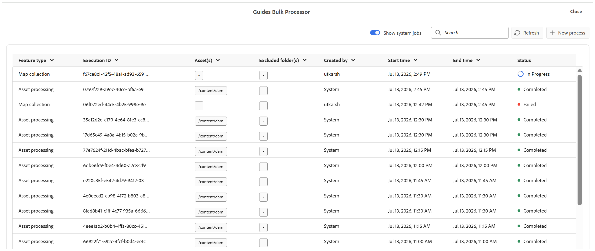

# Migrare le vecchie raccolte mappe a nuove raccolte mappe

Se disponi già di raccolte mappe configurate nel formato precedente, non è necessario ricrearle da zero quando si passa alla nuova esperienza. Puoi ricrearli manualmente o utilizzare lo strumento di migrazione integrato per spostare tutto in un unico passaggio.

Lo strumento di migrazione, aggiunto come nuovo tipo di processo all&#39;interno del **processore in blocco**, legge le vecchie raccolte di mappe esistenti e crea automaticamente nuove raccolte di mappe corrispondenti. Questo articolo illustra come eseguire la migrazione ed evidenzia alcuni comportamenti chiave da conoscere prima di utilizzarla.

>[!NOTE]
>
> La funzione di attivazione in blocco non viene migrata alla nuova esperienza di raccolta mappe. Se necessario, ricrea le raccolte mappe utilizzate per l’attivazione in blocco nella nuova esperienza di raccolta mappe.

## Migra a nuova raccolta mappe

Per migrare le vecchie raccolte di mappe in nuove raccolte di mappe, effettua le seguenti operazioni:

1. Selezionare il logo Adobe Experience Manager e scegliere **Strumenti**.
1. Nel pannello **Strumenti**, seleziona **Guide**.
1. Selezionare il riquadro **Processore di massa**.

   

1. Viene visualizzata la finestra Guide - Processore di massa con i seguenti dettagli:

   - **Tipo di funzionalità**: mostra la funzionalità del processo in esecuzione.

   - **ID esecuzione**: è l&#39;ID univoco per ogni attività di migrazione eseguita.

   - **Creato da**: mostra chi ha creato l&#39;attività.

   - **Ora di inizio**: mostra la data e l&#39;ora in cui è stata avviata la migrazione.

   - **Ora di fine**: mostra la data e l&#39;ora in cui termina la migrazione.

   - **Stato**: mostra lo stato della migrazione come In corso, Completato o Non riuscito.

   

1. Seleziona la scheda **Nuovo processo** nell&#39;angolo superiore destro della finestra per avviare una nuova attività di migrazione.

   Viene visualizzata la finestra di dialogo **Nuovo processo**.

    {width="350"}

1. Seleziona **Raccolta mappe** dal menu a discesa **Tipo di funzionalità**.

    {width="350"}

1. Seleziona **Crea**.

In questo modo viene eseguito un singolo processo che esegue la migrazione di tutte le vecchie raccolte di mappe esistenti in nuove raccolte di mappe. Non è richiesta alcuna configurazione aggiuntiva.

>[!NOTE]
>
> Se l&#39;attività di migrazione non riesce, puoi controllare l&#39;opzione **Visualizza registri** passando il puntatore sull&#39;ID esecuzione.

## Considerazioni importanti

- **Riesecuzione della migrazione:** Se il processo di migrazione viene eseguito nuovamente, non verifica la presenza di modifiche nelle raccolte di mappe di origine (precedenti). Migrerà incondizionatamente o sovrascriverà le nuove raccolte di mappe.
- **Marca temporale e univocità:** Ogni raccolta di mappe migrata memorizza la marca temporale da cui è stata eseguita la migrazione. Questa marca temporale viene utilizzata per mantenere l’univocità del record migrato. Per questo motivo, la raccolta di mappe migrata non rifletterà gli aggiornamenti successivi apportati alla raccolta di mappe originale (di origine), ma verrà acquisito solo lo stato al momento della migrazione.

