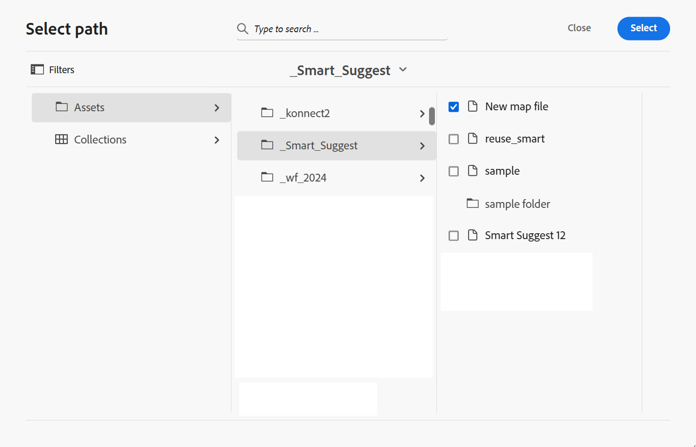
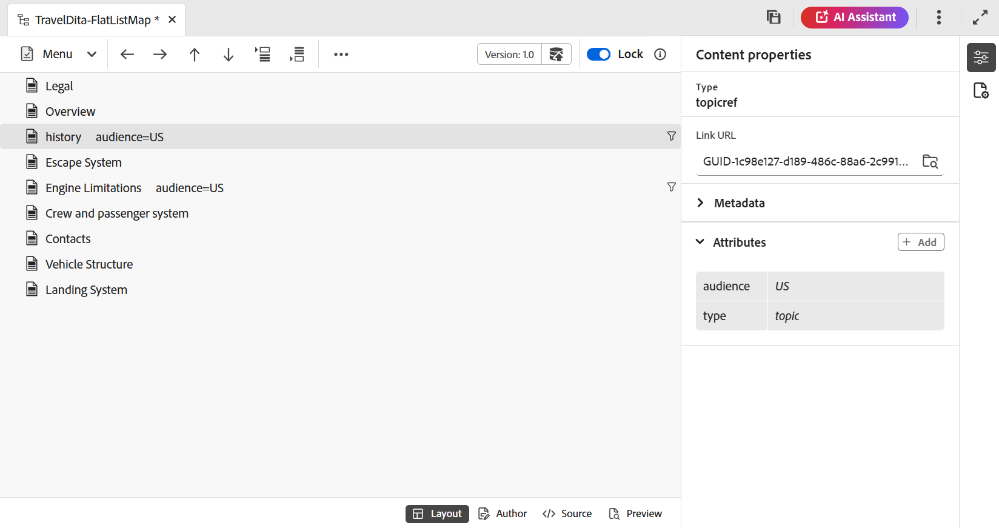

# Funzioni dell’editor mappa {#id1942D0S0IHS}

La barra degli strumenti nell&#39;Editor mappa è simile all&#39;Editor argomenti. Le operazioni di base, come l’attivazione del pannello sinistro, il salvataggio della mappa, la creazione di una nuova versione della mappa, l’annullamento/ripristino dell’ultima operazione e l’eliminazione degli elementi selezionati, sono comuni in entrambi gli editor. Per informazioni dettagliate sul funzionamento di queste operazioni, visualizzare [Barra degli strumenti nella sezione Editor](web-editor-toolbar.md#).

Le opzioni visualizzate nella barra degli strumenti dell’editor si basano sulla vista Editor mappa. Nell’Editor mappa sono disponibili quattro visualizzazioni:

- [Layout](#layout-view)
- [Autore](#author-view)
- [Origine](#source-view)
- [Anteprima](#preview)

Nelle sezioni seguenti sono descritte le opzioni della barra degli strumenti disponibili nelle diverse viste dell’Editor mappa:

## Vista Layout

Quando apri una mappa per la modifica, viene aperta la vista Layout dell’Editor mappa. La vista Layout visualizza la gerarchia delle mappe in una vista a struttura e consente di organizzare gli argomenti in una mappa.

>[!NOTE]
>
> Nella vista Layout vengono visualizzati solo i riferimenti presenti in una mappa. Se alcuni riferimenti sono interrotti, a sinistra del riferimento viene visualizzato un piccolo simbolo di croce

Nella barra degli strumenti della visualizzazione Layout sono disponibili le seguenti opzioni:

**Riferimento argomento** - 

Visualizza la finestra di dialogo di ricerca dell&#39;argomento. Passare al file argomento/mappa che si desidera inserire e scegliere **Seleziona** per aggiungerlo alla mappa.

{align="left"}

**Gruppo di argomenti** - 

Inserire l&#39;elemento `topicgroup`. Per ulteriori informazioni sul raggruppamento di argomenti, vedere la documentazione [topicgroup](https://docs.oasis-open.org/dita/v1.0/langspec/topicgroup.html) in Specifiche lingua OASIS DITA.

**Definizione chiave** - 

Visualizza la finestra di dialogo Inserisci keydef. Utilizzare questa finestra di dialogo per definire qualsiasi definizione di chiave che si desidera utilizzare nella mappa.

{width="300" align="left"}

**Inserisci prima/Inserisci dopo** -  / 

Visualizza la finestra di dialogo Inserisci elemento. Selezionare l&#39;elemento che si desidera inserire nella mappa. A seconda dell&#39;operazione, il nuovo elemento viene inserito prima o dopo l&#39;elemento corrente nella mappa.

**Inserisci elemento anteriore** - 

Questa icona viene visualizzata quando apri una mappa segnalibro per la modifica. È possibile inserire componenti all&#39;inizio del libro come un sommario, un indice e un elenco di tabelle.

**Inserisci argomento posteriore** - 

Questa icona viene visualizzata quando apri una mappa segnalibro per la modifica. È possibile inserire componenti per alla fine del libro, ad esempio un indice, un glossario e un elenco di figure.

**Sposta l&#39;elemento selezionato a sinistra/destra** -  / 

Selezionare la freccia sinistra per spostare l&#39;argomento verso il lato sinistro nella gerarchia. Questo essenzialmente promuove il rispettivo argomento di un livello superiore nella gerarchia. Se ad esempio si seleziona la freccia sinistra mentre è selezionato un argomento figlio, impostare l&#39;argomento come elemento di pari livello dell&#39;argomento al di sopra di esso. Analogamente, se si seleziona la freccia destra, l&#39;argomento viene spinto verso destra, rendendolo figlio dell&#39;argomento al di sopra di esso.

**Sposta l&#39;elemento selezionato su/giù**  - / 

Selezionare le icone della freccia su o giù per spostare l&#39;argomento verso l&#39;alto o verso il basso nella gerarchia.

>[!NOTE]
>
> Potete anche trascinare i riferimenti per spostarli in una mappa.

**Blocca/Sblocca**

Ottiene un blocco sul file mappa e lo rilascia. Se nel file di mappa sono presenti modifiche non salvate, al momento del rilascio del blocco viene richiesto di salvare il file di mappa. Le modifiche vengono salvate nella versione corrente del file di mappa.

**Unisci** - 

Per ulteriori dettagli sull&#39;unione del contenuto di una versione diversa dello stesso file o di un file diverso, visualizzare [Unione](web-editor-features.md#menu-dropdown) nell&#39;editor.

**Cronologia versioni** - 

Controlla le versioni e le etichette disponibili nell’argomento attivo e ripristina eventuali versioni dall’editor stesso.

**Etichetta versione** - 

Visualizza la finestra di dialogo Gestione etichette versione. Seleziona una versione dall’elenco a discesa. Scegli l&#39;etichetta da applicare alla versione selezionata e seleziona **Aggiungi etichetta** per aggiungerla.

**Mostra nome file**

Mostra il nome del file dei titoli degli argomenti.

>[!NOTE]
>
> Quando si posiziona il puntatore del mouse sul titolo di un argomento, viene visualizzato il percorso del file.

**Mostra numeri di riga**

Mostra o nasconde il numero di riga per ciascun argomento. I numeri di riga vengono visualizzati a seconda del livello nella gerarchia.

**Mostra casella di controllo**

Mostra o nasconde una casella di controllo per ciascun argomento. È possibile utilizzare la casella di controllo per selezionare l&#39;argomento\(s\) ed eseguire varie attività utilizzando il menu Opzioni.

**Menu Opzioni nella visualizzazione Layout**

Oltre ad organizzare gli argomenti nel file mappa, è possibile eseguire le azioni seguenti utilizzando il menu Opzioni che viene visualizzato quando si passa il puntatore del mouse su un file o si fa clic con il pulsante destro del mouse all&#39;interno dell&#39;editor nella visualizzazione Layout:

{width="650" align="left"}

- **Aggiungi**: puoi scegliere di aggiungere un nuovo argomento o un riferimento vuoto dall&#39;Editor mappe:
   - **Riferimento vuoto**: questa opzione consente di aggiungere un riferimento vuoto nella mappa DITA. In seguito è possibile fare doppio clic sul riferimento vuoto inserito e aggiungere i dettagli dell&#39;argomento.
   - **Nuovo argomento**: quando si sceglie di creare un nuovo argomento dal menu, viene visualizzata la finestra di dialogo **Nuovo argomento**. Nella finestra di dialogo **Nuovo argomento**, fornisci i dettagli richiesti e seleziona **Crea**.
- **Sposta**: puoi scegliere di spostare un argomento verso l&#39;alto/il basso/a destra/a sinistra nella gerarchia. Puoi anche trascinare un argomento o una mappa dal pannello dell’archivio alla mappa aperta nell’Editor mappe.
- **Annulla**: annulla l&#39;ultima operazione nella visualizzazione Layout.
- **Ripeti**: ripeti l&#39;ultima operazione nella visualizzazione Layout.
- **Copia**: copia il riferimento selezionato dal file mappa.

  >[!NOTE]
  >
  > Potete visualizzare e quindi selezionare le caselle di controllo per copiare più riferimenti.

- **Incolla**: incolla i riferimenti copiati nella posizione corrente della gerarchia.
- **Elimina**: elimina i riferimenti selezionati dal file di mapping.

  >[!NOTE]
  >
  > È possibile visualizzare e quindi selezionare le caselle di controllo per eliminare più riferimenti.

**Visualizza argomenti in base ai filtri condizionali**

Se hai applicato una condizione a un argomento, a destra dell’argomento viene visualizzata un’icona di filtro. Quando passi il puntatore del mouse su un’icona di filtro, viene visualizzata la condizione applicata e il relativo valore di attributo.

## Visualizzazione Autore

La visualizzazione **Autore** consente di modificare la mappa DITA nell&#39;editor. Mostra la vista WYSIWYG dell’Editor mappe e alcune delle icone visualizzate nella vista Author sono uguali alla vista Layout.

{align="left"}

Inoltre, è possibile visualizzare le icone seguenti ed eseguire le attività correlate dalla vista Autore:

**Inserisci prima/Inserisci dopo** -  / 

Visualizza la finestra di dialogo **Inserisci elemento prima o &#x200B;** Inserisci elemento dopo. Selezionare l&#39;elemento che si desidera inserire nella mappa. A seconda dell&#39;operazione, il nuovo elemento viene inserito prima o dopo l&#39;elemento corrente nella mappa.

**Elemento** - 

Visualizza la finestra di dialogo **Inserisci elemento**. Seleziona l’elemento da inserire. È possibile utilizzare la tastiera per scorrere l&#39;elenco degli elementi e premere Invio per inserire l&#39;elemento richiesto. In alternativa, puoi selezionare l’elemento da inserire nella mappa.

<!-----------------------------------------------------------

**Relationship table** - 

Inserts a relationship table in the map.

Perform the following steps to work with relationship tables in the Basic Map Editor:

1.  In the Assets UI, navigate to the DITA map in which you want to create the relationship table.

1.  Select the DITA map to open it in DITA map console.

1.  Select the **Topics** tab to view a list of topics available in the DITA map.

    >[!TIP]
    >
    > The Topics tab gives you an option to download the map file with its dependents. For more details, view [Export a DITA map file](authoring-download-assets.md#id218UBA00IXA).

1.  In the main toolbar, select **Edit**.

    The map file is opened in the Advanced Map Editor.

1.  Select **Reltable** from the toolbar.

    {width="650" align="left"}

1.  Drag-and-drop topics from the topic list to the Reltable editor.

    >[!NOTE]
    >
    > You can add topics from any folder in the References rail.

    {width="550" align="left"}

1.  To add a header to your relationship table, click **Add Relheader**.

1.  To add a column to your relationship table, click **Add a Column**.

    {width="550" align="left"}

1.  Click **Save**.

You can also perform the following actions from the relationship table editor:

**Delete rows or columns**

If you want to delete a column from your table, select the checkbox in the column header and click Delete. If you want to remove a row from table, select the checkbox in the first column of the respective row and click Delete.

**Delete a topic**

If you want to delete a topic from your table, click the cross icon next to the topic.

**Delete the relationship table**

If you want to delete the relationship table, click anywhere outside the relationship table and click Delete. For details, view [Work with relationship tables in the Map Editor](map-editor-basic-map-editor.md).
----->

**Contenuto riutilizzabile** - 

Visualizza la finestra di dialogo **Riutilizza contenuto**. Utilizzare questa finestra di dialogo per inserire il contenuto che si desidera riutilizzare nella mappa.

**Aggiorna attributo titolo navigazione** - 

Consente di mantenere sincronizzati l&#39;attributo `@navtitle` e l&#39;elemento `title` di un file di riferimento. È possibile aggiungere diversi tipi di file a una mappa, ad esempio argomenti, attività, riferimenti o sottopagine. La maggior parte di questi supporta l&#39;attributo `@navtitle`, che controlla la modalità di visualizzazione del nome del file nella mappa o nel sommario. Se un file contiene l&#39;attributo `@navtitle`, viene aggiornato l&#39;attributo `@navtitle` per lo stesso file nella mappa. Se l&#39;attributo `@navtitle` non è presente, l&#39;attributo `@navtitle` viene aggiunto a tale file di riferimento e anche il relativo `title` viene aggiornato per visualizzare l&#39;attributo `@navtitle`.

>[!NOTE]
>
> L’amministratore può scegliere di mostrare o nascondere questo pulsante nella barra degli strumenti dell’Editor mappe utilizzando una proprietà di configurazione. Possono inoltre abilitare l&#39;aggiunta automatica dell&#39;attributo `@navtitle` quando i file vengono aggiunti a una mappa. Per ulteriori dettagli, visualizzare [Includi attributo @navtitle per impostazione predefinita](../cs-install-guide/auto-add-navtitle.md)* in Installare e configurare Adobe Experience Manager Guides as a Cloud Service.

**Tag**

Mostra o nasconde i tag XML. I tag fungono da segnali visivi che indicano il limite di un elemento. In questa modalità, se desideri inserire un riferimento ad argomento/mappa, trascina il file desiderato prima o dopo il tag. La barra orizzontale non viene visualizzata nella modalità Visualizzazione tag.

**Rileva modifiche** - 

È possibile tenere traccia di tutti gli aggiornamenti effettuati nel file di mappa attivando la modalità Revisioni. Dopo aver abilitato le modifiche di traccia, tutti gli inserimenti e le eliminazioni vengono acquisiti nel documento. Per ulteriori dettagli, visualizza [Rileva modifiche](web-editor-features.md#track-changes) nell&#39;editor.

**Crea attività di revisione** - 

È possibile creare un&#39;attività di revisione dell&#39;argomento corrente o un file di mappa direttamente dall&#39;editor. Aprire il file per il quale si desidera creare l&#39;attività di revisione e selezionare **Crea attività di revisione** per avviare il processo di creazione della revisione. Segui le istruzioni fornite nell&#39;[Introduzione alla revisione](review.md#) per ulteriori dettagli.

## Vista Source

Questa vista consente di modificare il contenuto nel suo formato non elaborato, fornendo un controllo completo sulla struttura e sulla formattazione.

{align="left"}

In questa visualizzazione, la barra degli strumenti fornisce le opzioni di base per la modifica e l&#39;inserimento del contenuto disponibili nel menu a discesa **Menu**, inclusi Taglia, Copia, Annulla, Ripeti, Elimina, Trova e sostituisci, Etichetta versione, Unisci, Salva come nuova versione, Blocca e Sblocca.

## Anteprima

La modalità Anteprima esegue il rendering del contenuto così come verrà visualizzato nell’output finale, consentendo di rivedere il layout e la formattazione prima di pubblicarlo.

Oltre a poter visualizzare la posizione di ciascun file di argomento all&#39;interno di una mappa, è consigliabile visualizzare il contenuto della mappa in un unico flusso consecutivo. La funzione Anteprima mappa consente di visualizzare l&#39;intero contenuto del file mappa con un solo clic. Non è necessario generare un output del file di mappa per visualizzare come si presenterà l&#39;intera mappa dopo la pubblicazione. Potete semplicemente accedere all&#39;anteprima della mappa e tutti gli argomenti e le mappe secondarie vengono visualizzati sotto forma di libro.

{align="left"}

>[!NOTE]
>
> Nella barra degli strumenti in modalità Anteprima non sono disponibili opzioni di modifica o inserimento del contenuto. Non è possibile modificare il contenuto in questa visualizzazione. È tuttavia possibile utilizzare le funzionalità **Salva come nuova versione** e **Blocca** o **Sblocca**.

Nella modalità di anteprima puoi eseguire le seguenti attività aggiuntive:

- Fare clic con il pulsante destro del mouse su un argomento e selezionare **Modifica** per aprire l&#39;argomento per la modifica in una nuova scheda.

  >[!NOTE]
  >
  > Se non si dispone dei diritti di modifica, l&#39;argomento verrà aperto in modalità di sola lettura.

- Passa all’argomento desiderato selezionando il titolo dell’argomento nella struttura ad albero della mappa \(nel pannello a sinistra\).

- L&#39;argomento corrente nell&#39;anteprima della mappa viene evidenziato anche nella struttura della mappa.

**Altri modi per visualizzare in anteprima un file di mappa**

Puoi accedere all’anteprima di una mappa da:

- **Interfaccia utente di Assets**: nell&#39;interfaccia utente di Assets, passare alla posizione della mappa, selezionare il file della mappa e scegliere **Anteprima mappa** nella barra degli strumenti. L’anteprima della mappa viene visualizzata in una nuova scheda. È possibile visualizzare il contenuto di tutti gli argomenti nella modalità anteprima. In questa visualizzazione non è possibile modificare alcun argomento.

  >[!NOTE]
  >
  > Se l&#39;opzione *Anteprima mappa* non è visibile nella barra degli strumenti principale, potrebbe essere stata spostata nel menu della barra degli strumenti **Altro**.

- **Editor mappe**: nell&#39;Editor mappe, selezionare **Anteprima** dal menu Opzioni per visualizzare l&#39;anteprima della mappa corrente.

  {width="650" align="left"}

  L&#39;anteprima della mappa viene visualizzata in una casella a comparsa.

  {width="500" align="left"}

**Mappa proprietà**

Visualizza la finestra di dialogo Proprietà mappa, in cui è possibile impostare gli attributi e le informazioni sui metadati per la mappa.

## Modifica argomenti tramite mappa DITA {#id17ACJ0F0FHS}

La modifica di un singolo argomento non fornisce all&#39;autore il contesto completo. L&#39;autore non dispone di informazioni sulla posizione di un argomento in una mappa DITA. Senza queste informazioni contestuali, per gli autori diventa un po’ difficile creare contenuti.

Experience Manager Guides consente agli autori di aprire una mappa DITA nell&#39;Editor e di visualizzare il posizionamento degli argomenti all&#39;interno della mappa. In questo modo gli autori possono sapere esattamente dove si trova l’argomento all’interno della mappa e creare contenuti più rilevanti. Inoltre, se più autori lavorano a un progetto, possono sapere quali argomenti sono disponibili nella mappa e riutilizzare il contenuto, se necessario.

Per modificare gli argomenti tramite una mappa DITA, effettuare le seguenti operazioni:

1. Nel pannello Repository, individuate e aprite il file di mapping DITA che desiderate modificare.

   Il file mappa si apre nella vista Mappa.

>[!NOTE]
>
> È inoltre possibile utilizzare l&#39;interfaccia utente di Assets per aprire un file di mappa DITA. Passare al file di mapping DITA contenente gli argomenti che si desidera modificare e selezionare **Modifica argomenti** nella barra degli strumenti principale per avviare l&#39;editor.

1. Seleziona un collegamento argomento per aprirlo nell’editor per la modifica.

   È possibile aprire più argomenti nell&#39;editor e ogni argomento viene aperto in una nuova scheda nell&#39;editor. Anche se la mappa DITA contiene mappe secondarie, gli argomenti delle mappe secondarie vengono aperti in una nuova scheda per la modifica. Se desideri visualizzare gli argomenti sotto una mappa secondaria, puoi selezionare ed espandere la mappa secondaria.

   {align="left"}

   Se si seleziona un file di mappa, la mappa viene aperta in una nuova scheda dell&#39;editor.

1. Dopo aver modificato gli argomenti, puoi effettuare le seguenti operazioni:

   - Puoi salvarli singolarmente. Se si chiude senza salvare gli argomenti, verrà visualizzata una finestra di dialogo in cui viene richiesto di salvare gli argomenti non salvati:

     {width="300" align="left"}

     È possibile scegliere di salvare tutti gli argomenti selezionati o deselezionare gli argomenti che non si desidera salvare.

   - È possibile sbloccare l&#39;argomento utilizzando l&#39;opzione **Salva come nuova versione**. Quando si salva una versione dell&#39;argomento, viene creata una nuova versione e viene rilasciato anche il blocco.

     Si consiglia di salvare le modifiche prima di sbloccare i file.  Quando si salvano le modifiche, il file XML viene convalidato.

   - È inoltre possibile visualizzare l&#39;avanzamento degli argomenti nella finestra di dialogo **Salva come nuova versione**. Quando i file vengono sbloccati, viene visualizzato un messaggio di operazione riuscita.

   - Se l&#39;amministratore ha attivato l&#39;opzione di sblocco dei file alla chiusura, verrà richiesto di salvare i file alla chiusura dei file bloccati. Con questa opzione attivata, quando chiudi l’editor con i file modificati, viene visualizzato l’elenco dei file bloccati che devono essere salvati. I file bloccati vengono visualizzati con un&#39;icona di blocco:

     {width="350" align="left"}

## Pannello a destra nell’Editor mappa

Nel pannello di destra vengono visualizzate le Proprietà contenuto e le Proprietà mappa nella vista Layout dell’Editor mappa.

**Proprietà contenuto**

Il pannello Proprietà contenuto contiene informazioni sul tipo di argomento attualmente selezionato nella mappa, il relativo URL di collegamento e i relativi attributi. Per ulteriori dettagli, visualizzare [Proprietà contenuto](web-editor-features.md#right-panel) nell&#39;editor.

- **Altri attributi** Se l&#39;amministratore ha creato un profilo per gli attributi, questi verranno ottenuti insieme ai relativi valori configurati. Utilizzando il pannello delle proprietà del contenuto, potete scegliere questi attributi e assegnarli al contenuto pertinente nell&#39;argomento. Puoi anche assegnare gli attributi configurati dall&#39;amministratore in **Visualizza attributi**. Gli attributi definiti per un elemento vengono visualizzati nella vista Layout e Struttura. Questo consente di esaminare rapidamente tutti gli argomenti di una mappa per cui è definito un attributo specifico. Ad esempio, tutti gli argomenti con l&#39;attributo `audience` sono definiti come `US`.

  {width="650" align="left"}

  Per ulteriori dettagli, visualizzare [Attributi di visualizzazione](../cs-install-guide/workspace-settings.md#display-attributes).

- **Metadati** Utilizzando i metadati, puoi impostare le informazioni sui metadati. Puoi definire il Titolo navigazione, il Testo collegamento, la Descrizione breve e le Parole chiave.

Per ulteriori informazioni sugli attributi e i metadati standard dell&#39;argomento, vedere la documentazione [topicref](https://docs.oasis-open.org/dita/v1.2/os/spec/langref/topicref.html) in Specifiche del linguaggio OASIS DITA.

**Argomento padre:** [Introduzione all&#39;editor mappe](map-editor.md)
