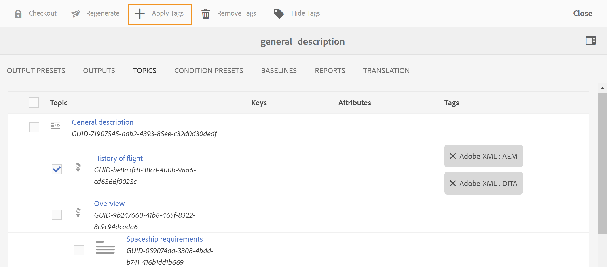

# Applicazione di tag in blocco a contenuto DITA {#id179SG0TN05Z}

I tag ti consentono di raggruppare o classificare il contenuto all’interno dell’archivio dei contenuti e anche nell’output pubblicato. Se sono stati applicati tag al contenuto, è possibile trovare facilmente argomenti correlati all&#39;interno di una mappa DITA che possono essere utili per l&#39;authoring dei contenuti. Con l’output pubblicato, gli utenti finali saranno in grado di individuare più rapidamente il contenuto corretto con i tag corretti.

Le guide AEM consentono di assegnare tag ai contenuti DITA in pochi clic. È possibile utilizzare la funzione di assegnazione tag in blocco per applicare più tag a più argomenti, a una mappa DITA o a una mappa secondaria. In alternativa, è possibile applicare i tag anche a un singolo argomento. L’assegnazione tag è la funzione nativa dell’AEM. Per ulteriori informazioni sulla creazione e la gestione dei tag, consulta [Amministrazione dei tag](https://experienceleague.adobe.com/docs/experience-manager-cloud-service/sites/authoring/features/tags.html?lang=en) sezione nella documentazione AEM.

Per impostazione predefinita, le guide AEM non concedono l’accesso in lettura ad alcun utente della cartella in cui sono memorizzati tutti i tag nell’archivio AEM. Per utilizzare i tag definiti nell’archivio AEM, è necessario chiedere all’amministratore di sistema di concedere l’accesso alla cartella in cui sono memorizzati i tag.

## Applicare tag collettivi

Utilizza la funzione di assegnazione tag in blocco per applicare più tag contemporaneamente. Per applicare tag agli argomenti di una mappa DITA, effettuare le seguenti operazioni:

1. Nell’interfaccia utente Assets, passa a e fai clic sul file di mappa DITA.

   Viene visualizzata la console Mappa DITA con l&#39;elenco dei predefiniti di output disponibili per generare l&#39;output.

1. Clic **Argomenti**.

   Viene visualizzato un elenco di argomenti disponibili nella mappa DITA. Gli UUID degli argomenti sono mostrati sotto il titolo dell’argomento.

1. Selezionare gli argomenti o la mappa secondaria a cui si desidera applicare i tag.

   {width="650" align="left"}

   >[!NOTE]
   >
   > La schermata precedente mostra una mappa secondaria selezionata ed espansa. Quando selezioni la mappa secondaria, vengono selezionati anche tutti gli argomenti sotto la mappa secondaria.

1. Clic **Applica tag**.

   Viene visualizzata la finestra di dialogo Seleziona tag.

1. Selezionare uno o più tag da applicare agli argomenti selezionati.

1. Conferma la selezione.

   I tag selezionati vengono applicati agli argomenti e visualizzati accanto al titolo dell&#39;argomento.

   >[!NOTE]
   >
   > Dopo aver aggiunto i tag agli argomenti, se si sposta o si elimina un argomento, verranno rimossi anche i tag per tali argomenti. Tuttavia, l&#39;argomento rimane nella mappa fino a quando non viene rimosso.

## Applicare tag a un singolo argomento

Per applicare i tag a un singolo argomento, effettuare le operazioni riportate di seguito.

1. Nell’interfaccia utente Assets, individua e seleziona il file di argomenti a cui desideri applicare i tag.

1. Nella barra degli strumenti, fai clic su **Proprietà**.

   Viene visualizzata la pagina delle proprietà dell&#39;argomento.

1. Nella scheda Base, fai clic sull’icona Sfoglia accanto a **Tag** campo.

1. Selezionare uno o più tag da applicare all&#39;argomento selezionato.

1. Conferma la selezione.

1. Clic **Applica tag**.

   I tag selezionati vengono applicati all&#39;argomento e visualizzati nel campo Tag.

1. Fai clic su **Salva e chiudi**.

## Rimuovi tag

In base alle esigenze aziendali, è possibile modificare le informazioni sui tag per qualsiasi argomento DITA. È possibile rimuovere tutti i tag contemporaneamente o solo quelli non validi per l&#39;argomento.

Per rimuovere tutti i tag da uno o più argomenti, effettua le seguenti operazioni:

1. Nell’interfaccia utente Assets, passa a e fai clic sul file di mappa DITA.

   Viene visualizzata la console Mappa DITA con l&#39;elenco dei predefiniti di output disponibili per generare l&#39;output.

1. Clic **Argomenti**.

   Viene visualizzato un elenco di argomenti disponibili nella mappa DITA.

1. Selezionare gli argomenti da cui si desidera rimuovere i tag.

1. Clic **Rimuovi tag**.

   >[!NOTE]
   >
   > Se l’icona Elimina tag non è visibile, accertati di non aver attivato la funzione Nascondi tag.

1. Nella finestra di dialogo Conferma eliminazione, fai clic su **OK** per rimuovere i tag dagli argomenti selezionati.

## Mostra o nascondi tag

Se agli argomenti sono stati applicati numerosi tag, la navigazione potrebbe risultare un po&#39; complicata. È possibile nascondere facilmente i tag nella vista della console delle mappe DITA facendo clic sull&#39;icona Nascondi tag. Allo stesso modo, quando i tag non sono visibili, facendo clic su Mostra tag vengono visualizzati tutti i tag.

**Argomento padre:**[ Gestione metadati](manage-metadata.md)
