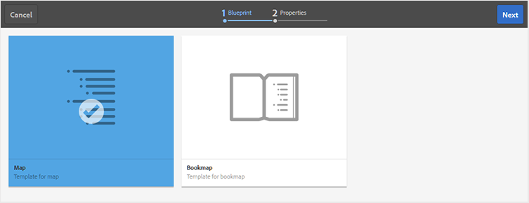

# Creare una mappa {#id176FEN0D05Z}

Adobe Experience Manager Guides fornisce due modelli di mappe preconfigurati: DITA map e Bookmap. Puoi anche creare modelli di mappa personalizzati e condividerli con gli autori per creare file di mappa.

Per creare una mappa, effettua le seguenti operazioni:

1. Nel pannello Archivio selezionare l&#39;icona **Nuovo file**, quindi selezionare **Mappa DITA** dal menu a discesa.

   {width="800" align="left"}

   È inoltre possibile accedere a questa opzione dalla [home page di Experience Manager Guides](./intro-home-page.md) e dal menu delle opzioni di una cartella nella visualizzazione Archivio.

2. Viene visualizzata la finestra di dialogo **Nuova mappa**.

3. Nella finestra di dialogo **Nuova mappa**, fornisci i seguenti dettagli:
   - Un Titolo per la mappa.
   - \(Facoltativo\)* Nome del file per la mappa. Il nome del file viene suggerito automaticamente in base al Titolo dell’argomento. Se l’amministratore ha abilitato i nomi di file automatici in base all’impostazione UUID, il campo Nome non verrà visualizzato.
   - Modello su cui verrà basato l&#39;argomento. Per un file di mappa, le opzioni disponibili sono **Bookmap**, **Map** e **Schema soggetto**.
   - Percorso in cui si desidera salvare il file mappa. Per impostazione predefinita, il percorso della cartella attualmente selezionata nell’archivio viene visualizzato nel campo Percorso.

   {width="300" align="left"}

4. Seleziona **Crea**.

La mappa viene creata nel percorso specificato. Inoltre, la mappa viene aperta nell’Editor mappa per la modifica.

{width="800" align="left"}

## Aggiungere argomenti a un file di mappa

Oltre a modificare i file delle mappe direttamente dall&#39;editor, è possibile aprire i file degli argomenti in una mappa per modificare l&#39;editor. È possibile aggiungere argomenti a un file di mapping.

Per aggiungere argomenti a un file di mappa dalla console Mappa, effettua le seguenti operazioni:

1. Nella vista Archivio individuare e aprire il file di mapping che si desidera modificare.
1. Seleziona l&#39;icona **Modifica**.

   {width="450" align="left"}

1. Il file di mappa viene aperto nell&#39;Editor mappa. Se hai aperto un nuovo file di mappa, nell’editor viene visualizzato solo il titolo della mappa.

   {width="800" align="left"}

   - **A** - \(*Barra delle schede*\): simile alla barra delle schede dell&#39;editor. Visualizza [barra delle schede](./web-editor-features.md#tab-bar) nell&#39;editor per ulteriori dettagli.

   - **B** - \(*Barra degli strumenti*\) Questa è la barra degli strumenti che consente di utilizzare i file di mapping. Per ulteriori informazioni sulle funzionalità disponibili tramite la barra degli strumenti, visualizzare [Funzionalità disponibili nella barra degli strumenti dell&#39;Editor mappe](#features-available-in-the-map-editors-toolbar).

   - **C** - \(*Visualizzazioni mappa*\): consente di passare dall&#39;Editor mappa a Layout, Autore, Source e Anteprima. La visualizzazione **Layout** consente di organizzare gli argomenti in una mappa DITA. In questo modo viene visualizzata la struttura o la struttura gerarchica della mappa. La visualizzazione **Autore** consente di modificare gli argomenti nell&#39;Editor mappa. Questo offre anche la vista WYSIWYG del file di mappa. La visualizzazione **Source** consente di utilizzare l&#39;XML sottostante del file di mapping. L&#39;anteprima offre una visualizzazione consolidata di tutti gli argomenti e delle mappe secondarie all&#39;interno del file di mappa.

   - **D** - \(*Pannello sinistro*\): consente di accedere al pannello sinistro che consente di accedere alle raccolte, all&#39;archivio, alla mappa, alla struttura e ad altre funzionalità. Puoi espanderla o comprimerla selezionando l’icona Espandi/Comprimi. Per ulteriori dettagli sulle funzionalità disponibili nel pannello sinistro, visualizza [Pannello sinistro](./web-editor-features.md#left-panel) nell&#39;editor.

   - **E** - \(*Area centrale*\): area di modifica contenuto mappa.

   - **F** - \(*Pannello destro*\): consente di accedere al pannello Proprietà. È possibile visualizzare le proprietà del contenuto e le proprietà della mappa dell&#39;argomento o della mappa selezionata. Per ulteriori dettagli sulle funzionalità disponibili in questo pannello, visualizza [Pannello a destra](web-editor-features.md#right-panel) nell&#39;editor.

1. Nel pannello sinistro passare alla visualizzazione **Archivio**.

1. Nell&#39;archivio di Adobe Experience Manager passare alla cartella contenente gli argomenti o le mappe secondarie che si desidera aggiungere.

1. Selezionare l&#39;argomento o il file di mapping nella visualizzazione **Archivio** e trascinarlo nell&#39;area di modifica del contenuto di mapping \(middle\).

   L&#39;argomento viene aggiunto nella mappa.

   {width="800" align="left"}

1. Per aggiungere argomenti successivi o una mappa secondaria, trascinare l&#39;argomento o la mappa secondaria nella posizione desiderata nella mappa.

   Durante la creazione del file di mappa, considera i punti seguenti:

   - Il file viene aggiunto in un punto in cui la barra del rettangolo tratteggiata viene visualizzata nell&#39;area di modifica delle mappe. Nella schermata seguente, l&#39;argomento *Un argomento di esempio* verrà aggiunto tra gli argomenti *Suggerimenti avanzati 1* e *Suggerimenti avanzati 2*.

     {width="800" align="left"}

   - Per sostituire un argomento, trascinare e rilasciare il nuovo argomento sopra l&#39;argomento che si desidera sostituire. e rilasciarlo indica che verrà sostituito con l&#39;argomento che viene rilasciato su di esso.

   - Se si aggiunge una mappa secondaria alla mappa DITA, questa verrà visualizzata come collegamento nella mappa DITA. Per visualizzare tutti gli argomenti della mappa secondaria, fare clic sul collegamento corrispondente. Il contenuto della mappa secondaria viene visualizzato in una nuova scheda. Allo stesso modo, per aprire un argomento dalla mappa DITA, fare clic sul collegamento dell&#39;argomento tenendo premuto Ctrl e si apre nella nuova scheda.

   - È possibile utilizzare i tasti di scelta rapida CTRL+Z e CTRL+Y o le rispettive icone nella barra degli strumenti per annullare o ripristinare eventuali modifiche apportate alla mappa.

   - Per modificare la posizione di un argomento, selezionare l&#39;argomento \(selezionando l&#39;icona dell&#39;argomento\), quindi trascinarlo nella posizione desiderata nel file di mappa. Nella schermata seguente, l&#39;argomento *Smart Suggest 1* viene spostato dopo il *A Sample topic*.

     {width="800" align="left"}

   - Per verificare le proprietà del file mappa, fare clic con il pulsante destro del mouse in un punto qualsiasi dell&#39;area di modifica delle mappe e scegliere **Proprietà** dal menu di scelta rapida. In base alla versione di Adobe Experience Manager in uso, è possibile visualizzare proprietà quali metadati, pianificazione \(de\)attivazione, riferimenti, stato del documento e altro ancora.

1. Seleziona **Salva**.

## Creare una mappa dall’interfaccia utente di Assets

Puoi anche creare un file mappa dall’interfaccia utente di Assets e aprirlo nell’editor mappa per modificarlo.

Per creare una mappa dall’interfaccia utente di Assets, effettua le seguenti operazioni:

1. Nell’interfaccia utente di Assets, individua il percorso in cui desideri creare il file mappa.

1. Selezionare **Crea** \> **Mappa DITA**.

1. Nella pagina Blueprint, seleziona il tipo di modelli di mappa che desideri utilizzare e seleziona **Successivo**.

   >[!NOTE]
   >
   > Il modo in cui gli argomenti vengono trattati in un file di mappa dipende dal modello di mappa. Se ad esempio si seleziona il modello Mappa, verranno utilizzati i riferimenti agli argomenti \(`topicref`\) per fare riferimento agli argomenti. In caso di Bookmap, i riferimenti agli argomenti vengono creati utilizzando l&#39;elemento `chapter` in DITA.

   {width="800" align="left"}

1. Nella pagina Proprietà, specifica la mappa **Titolo**.

1. \(Facoltativo\) Specificare il file **Name**.

   Se l’amministratore ha configurato il nome file automatico in base all’impostazione UUID, non visualizzerai l’opzione per specificare il nome file. Al file viene automaticamente assegnato un nome di file basato su UUID.

   Se è disponibile l’opzione di denominazione del file, anche il nome viene suggerito automaticamente in base al Titolo della mappa. Se si desidera specificare manualmente il nome del file di mapping, verificare che il nome del file non contenga spazi, apostrofi o parentesi graffe e termini con `.ditamap`.

1. Seleziona **Crea**.

   Viene visualizzato il messaggio Mappa creata.

   A ogni nuovo file di mappa creato dall’interfaccia utente di Assets o dall’editor viene assegnato un ID di mappa univoco. Inoltre, la nuova mappa viene salvata come copia di lavoro più recente in DAM. Fino a quando non si salva una revisione di una mappa appena creata, non verrà visualizzato alcun numero di versione nella Cronologia versioni. Se apri la mappa per la modifica, le informazioni sulla versione vengono visualizzate nell’angolo superiore destro della scheda del file mappa:

   {width="800" align="left"}

   Le informazioni sulla versione di una mappa appena creata vengono visualizzate come *none*. Quando salvi una nuova versione, ad essa viene assegnato il numero di versione 1.0. Per ulteriori informazioni sul salvataggio di una nuova versione, visualizzare [Salva come nuova versione](web-editor-features.md#save-as-new-version).

   Puoi scegliere di aprire la mappa per la modifica nell’editor di mappe configurato oppure di salvare il file di mappa nell’archivio di Adobe Experience Manager.

   >[!NOTE]
   >
   > Per utilizzare l&#39;Editor mapping avanzato, accedere al file di mapping nell&#39;editor. Se l&#39;amministratore ha configurato l&#39;Editor mapping avanzato come editor predefinito nei file di mapping, il file di mapping viene aperto direttamente nell&#39;Editor mapping avanzato per la modifica. Visualizza *Imposta l&#39;Editor mappe avanzate come sezione predefinita* in Installare e configurare Adobe Experience Manager Guides as a Cloud Service.

### Aggiungere argomenti a un file di mappa dall’interfaccia utente di Assets

Per aggiungere argomenti a un file di mappa dall’interfaccia utente di Assets, effettua le seguenti operazioni:

1. Nell’interfaccia utente di Assets, individua il file di mappa da modificare.

   >[!NOTE]
   >
   > Assicurati di non aver attivato la modalità di selezione delle risorse.

1. Per ottenere un blocco esclusivo sul file di mappa, selezionare il file di mappa, quindi selezionare l&#39;opzione **Estrai** nella parte superiore.

   >[!NOTE]
   >
   > Una volta impostato un blocco esclusivo su un file di mappa, gli altri utenti non potranno modificare la mappa. Tuttavia, sarebbero in grado di lavorare sugli argomenti all&#39;interno del file di mappa. Se l&#39;amministratore ha configurato l&#39;editor in modo da bloccare i file prima della modifica, non sarà possibile modificare un file finché non viene bloccato.

1. Con il file mappa selezionato, selezionare **Modifica argomenti**.

   {width="800" align="left"}

   Oppure, puoi anche selezionare l&#39;opzione **Modifica argomenti** dal menu Azioni del file di mappa:

   {width="800" align="left"}

   Il file di mappa viene aperto per la modifica nell&#39;editor. Per aggiungere argomenti al file mappa, seguire i passaggi (4-8) descritti in [Aggiungere argomenti a un file mappa](#add-topics-to-a-map-file).

**Argomento padre: [Introduzione all&#39;editor mappe](map-editor.md)
