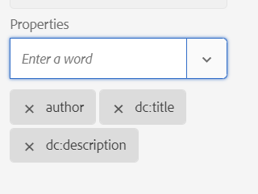

# Trasmettere i metadati all&#39;output utilizzando DITA-OT {#id21BJ00QD0XA}

I metadati sono informazioni aggiuntive sull’output. In Adobe Experience Manager Guides, puoi trasmettere i metadati esistenti o creare tag di metadati personalizzati. È possibile trasmettere metadati agli output di formato AEM, PDF, HTML5, EPUB e Personalizzato utilizzando la pubblicazione DITA-OT.

Esistono due modi per trasmettere i metadati all&#39;output utilizzando DITA-OT:

- [Utilizzo della console Mappa](#using-map-console)
- [Utilizzo del dashboard delle mappe](#using-map-dashboard)

## Utilizzo della console Mappa

Per trasferire i metadati all&#39;output utilizzando la pubblicazione DITA-OT, effettuare le seguenti operazioni:

1. [Aprire il file mappa DITA nella console mappe](./open-files-map-console.md) per la quale si desidera passare i metadati al DITA-OT.
1. Seleziona e apri un predefinito di output a cui desideri trasmettere i campi di metadati. Ad esempio, seleziona Predefinito di output PDF. Verificare che sia stato creato utilizzando l&#39;opzione **DITA-OT**.
1. Dall&#39;elenco a discesa **Proprietà file** selezionare i metadati che si desidera passare alla pubblicazione DITA-OT.

   {align="left"}

   Nel menu a discesa Proprietà sono elencate sia le proprietà personalizzate che quelle predefinite. Ad esempio, nella schermata precedente `dc:description`, `dc:language`, `dc:title` e `docstate` sono le proprietà predefinite.

   >[!NOTE]
   >
   > Queste proprietà vengono selezionate dal file metadataList disponibile nel percorso seguente:`/libs/fmdita/config/metadataList`. Per impostazione predefinita, in questo file sono elencate quattro proprietà: `dc:description`, `dc:language`, `dc:title` e `docstate`.

   Il file può essere sovrapposto in: `/apps/fmdita/config/metadataList`.

   Per passare una proprietà personalizzata per la quale sono già stati definiti i valori, visualizzare [Utilizzare i metadati di AEM nell&#39;output di PDF DITA-OT](https://experienceleaguecommunities.adobe.com/t5/xml-documentation-discussions/use-aem-metadata-in-dita-ot-pdf-output/td-p/411880).

1. Le proprietà selezionate sono elencate sotto il menu a discesa.

   {width="300" align="left"}

1. Seleziona **Salva** in alto a destra per salvare le modifiche.
1. Selezionare **Genera output**.

Le proprietà dei metadati selezionate verranno passate all&#39;output generato utilizzando DITA-OT.

>[!NOTE]
>
> A partire dalla versione 2502 di Experience Manager Guides, la funzionalità di trasmissione degli argomenti dei metadati delle mappe radice tramite la riga di comando DITA-OT è stata dichiarata obsoleta. Tuttavia, per evitare interruzioni, è stata aggiunta una nuova proprietà in `Config.Manager` per abilitare o disabilitare la funzionalità.  Per ulteriori dettagli, visualizzare [Configurare le impostazioni di generazione output](../cs-install-guide/conf-output-generation.md#configure-the-dita-ot-command-line-arguement-field-on-the-dita-map-dashboard).

## Utilizzo del dashboard delle mappe

Se si lavora nell&#39;**interfaccia utente di Assets**, eseguire la procedura seguente per passare i metadati all&#39;output utilizzando la pubblicazione DITA-OT:

1. Nell&#39;**interfaccia utente di Assets**, passare al file di mapping DITA per il quale si desidera passare i metadati al DITA-OT e selezionarlo.
1. Seleziona e modifica un predefinito di output a cui desideri trasmettere i campi di metadati. Ad esempio, seleziona Predefinito di output PDF.
1. Selezionare l&#39;opzione **DITA-OT** nel predefinito di output selezionato.

   {align="left"}

1. Dal menu a discesa Proprietà, selezionare i metadati che si desidera trasmettere alla pubblicazione DITA-OT.

   Nel menu a discesa Proprietà sono elencate sia le proprietà personalizzate che quelle predefinite. Ad esempio, nella schermata precedente l&#39;autore è la proprietà personalizzata, mentre `dc:description`, `dc:language`, `dc:title` e `docstate` sono le proprietà predefinite.

   >[!NOTE]
   >
   > Queste proprietà vengono selezionate dal file metadataList disponibile nel percorso seguente:`/libs/fmdita/config/metadataList`. Per impostazione predefinita, in questo file sono elencate quattro proprietà: `dc:description`, `dc:language`, `dc:title` e `docstate`.

   Il file può essere sovrapposto in: `/apps/fmdita/config/metadataList`.

   Per passare una proprietà personalizzata per la quale sono già stati definiti i valori, visualizzare [Utilizzare i metadati di AEM nell&#39;output di PDF DITA-OT](https://experienceleaguecommunities.adobe.com/t5/xml-documentation-discussions/use-aem-metadata-in-dita-ot-pdf-output/td-p/411880).

1. Dal menu a discesa **Proprietà**, seleziona le proprietà personalizzate e predefinite richieste. Selezionare ad esempio `author`, `dc:title` e `dc:description`. Questi sono i `metadata/properties` standard che vengono creati dopo la creazione di un file. Le proprietà selezionate sono elencate sotto la dropbox.

   {width="300" align="left"}

1. Seleziona **Fine** in alto a sinistra per salvare le modifiche.
1. Genera l’output.

Le proprietà dei metadati selezionate verranno passate all&#39;output generato utilizzando DITA-OT.

**Argomento padre:**&#x200B;[&#x200B; Generazione output](generate-output.md)
