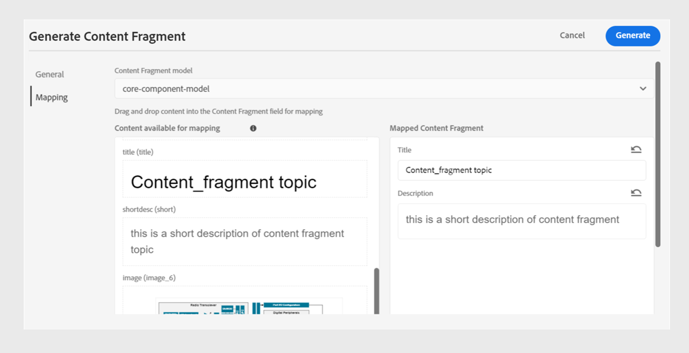

# Pubblicare frammenti di contenuto

I frammenti di contenuto sono parti discrete di contenuto in Adobe Experience Manager. Sono contenuti strutturati basati su un modello di contenuto. I frammenti di contenuto sono contenuti puri senza informazioni di progettazione o layout. Possono essere creati e gestiti indipendentemente dai canali supportati da Adobe Experience Manager. I frammenti di contenuto sono modulari, dove il contenuto viene suddiviso in componenti più piccoli.

Experience Manager Guides consente di pubblicare un argomento o i relativi elementi in un frammento di contenuto.

>[!NOTE]
>
>Puoi scegliere solo gli elementi in un argomento per i quali è stato definito un attributo id.

Per creare un frammento di contenuto, effettua le seguenti operazioni:

1. Crea un [modello per frammenti di contenuto](https://experienceleague.adobe.com/docs/experience-manager-65/assets/content-fragments/content-fragments-models.html?lang=it) in Adobe Experience Manager Assets.
1. Crea una cartella in cui salvare i frammenti di contenuto creati in base al modello Frammento di contenuto. Ad esempio, &quot;stock-content-fragments&quot;.
1. Modifica le proprietà della cartella (ad esempio, &quot;stock-content-fragments&quot;) e aggiungi il percorso della cartella, che contiene il modello Frammento di contenuto nella configurazione cloud.
Aggiungere ad esempio `/conf/we-retail` nella configurazione cloud. Questa configurazione collega tutti i modelli per frammenti di contenuto alla cartella.\
   {width="650" align="left"}
   *Aggiungi la configurazione cloud nelle proprietà della cartella per collegarla ai modelli di frammenti.*

1. Per generare un frammento di contenuto, selezionare **Nuovo output**  dalla sezione **Output** nelle **Proprietà file** di un argomento.
1. Seleziona **Frammento di contenuto**.\
    {width="300" align="left"}

   *Aggiungere un nuovo frammento di contenuto dalle proprietà del file di un argomento*.

1. Nella finestra di dialogo **Genera frammento di contenuto**, compila i seguenti dettagli nelle schede **Generale** e **Mappatura**.

   Scheda **Generale**
   
   *Aggiungi il percorso, il nome, il titolo e il filtro delle condizioni per pubblicare un argomento o i relativi elementi come frammento di contenuto.*

   * **Percorso**: sfoglia e seleziona il percorso della cartella in cui desideri pubblicare il frammento di contenuto. Se selezioni un frammento di contenuto esistente, questo sovrascrive il contenuto dei campi mappati.
   * **Titolo**: digita il titolo del frammento di contenuto. Per impostazione predefinita, il titolo viene compilato con il titolo dell’argomento. Puoi modificarlo. Questo titolo viene utilizzato per generare il nome del frammento di contenuto.
   * **Nome**: digitare il nome del frammento di contenuto. Per impostazione predefinita, il nome viene compilato con il titolo dell&#39;argomento e gli spazi vengono sostituiti con &quot;_&quot;. Ad esempio, *sample_content_fragment*. Puoi modificarlo.  Questo nome viene utilizzato per generare l’URL per il frammento di contenuto.

   * Puoi selezionare condizioni diverse per creare varianti di frammenti di contenuto. Selezionare una delle opzioni seguenti:

     >[!NOTE]
     > 
     > Le condizioni sono abilitate solo se gli attributi della condizione sono definiti nell&#39;argomento.

      * **Nessuno**: selezionare questa opzione se non si desidera applicare alcuna condizione all&#39;output pubblicato.
      * **Utilizzo di DITAVAL**: selezionare il file DITAVAL per includere o escludere contenuto specifico nell&#39;output generato. Potete selezionare il file DITAVAL utilizzando la finestra di dialogo Sfoglia (Browse) o digitando il percorso del file.
      * **Utilizzo di attributi**: è possibile definire attributi di condizione negli argomenti DITA. Quindi, seleziona l’attributo della condizione per pubblicare il contenuto pertinente.

   Scheda **Mappatura**

   

   *Selezionare il modello per frammenti di contenuto e aggiungere i dettagli di mappatura per pubblicare un argomento o i relativi elementi come frammento di contenuto.*

   * **Modello**: seleziona il modello per frammenti di contenuto da utilizzare per creare il frammento di contenuto. I modelli vengono selezionati dalla cartella, che hai configurato sul server Experience Manager Guides.
   * **Mappatura**: puoi visualizzare gli elementi dell&#39;argomento a cui è applicato un attributo id. Trascina gli elementi argomento nei campi presenti nel modello per frammenti di contenuto.
Se è presente un frammento di contenuto, a destra vengono inseriti i contenuti del frammento di contenuto pubblicato. Se necessario, questi possono essere sovrascritti con il contenuto dell’argomento. Puoi anche selezionare **Annulla** per ripristinare le modifiche di mappatura.

     >[!NOTE]
     >
     > Se utilizzi la versione 4.4 o precedenti, seleziona una mappatura dal menu a discesa. Seleziona le mappature dal file *contentFragmentMapping.json*.  L&#39;amministratore può aggiungere le mappature nel file *contentFragmentMapping.json*. Ulteriori informazioni su come [creare una mappatura tra un argomento e un frammento di contenuto](../cs-install-guide/conf-content-fragment-mapping-cs.md) nella Guida all&#39;installazione e alla configurazione.

1. Seleziona **Genera** per pubblicare il frammento di contenuto.

1. Puoi visualizzare i Frammenti di contenuto per un argomento nella sezione **Output** delle **Proprietà file**.

   {width="300" align="left"}

   *Visualizza i frammenti di contenuto presenti in un argomento e ripubblicali.*

Dopo aver pubblicato i frammenti di contenuto, puoi utilizzarli in qualsiasi sito Adobe Experience Manager.

## Menu Opzioni per un frammento di contenuto

Per un frammento di contenuto è inoltre possibile eseguire le azioni seguenti dal menu **Opzioni**:

* **Genera**: ripubblica il frammento di contenuto per aggiornarlo con il contenuto più recente dell&#39;argomento DITA. Quando rigeneri l’output, puoi modificare il percorso, il nome, il titolo, il modello e la mappatura del frammento di contenuto. Durante la rigenerazione dell&#39;output potete anche selezionare condizioni diverse.

* **Duplicato**: duplicare un frammento di contenuto. È possibile modificare il percorso, il nome, il titolo, il modello e la mappatura. Puoi anche selezionare condizioni diverse quando duplichi un frammento di contenuto per creare una variante di frammento di contenuto.

* **Rimuovi**: rimuovi un frammento di contenuto dall&#39;elenco degli output. Viene visualizzata una richiesta di conferma. Dopo la conferma, il frammento di contenuto viene rimosso dall&#39;elenco **Output**.

  >[!NOTE]
  >
  > Con questa azione nessun contenuto viene eliminato dal frammento di contenuto.

* **Visualizza**: visualizza l&#39;editor frammenti di contenuto. Puoi anche apportare modifiche e salvarle.