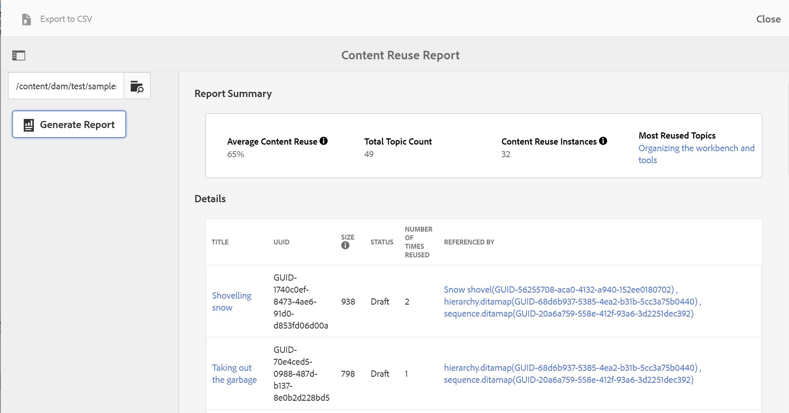

# Rapporto sul riutilizzo dei contenuti {#id205BB900OQD}

Un altro rapporto utile che puoi generare è il Rapporto sul riutilizzo dei contenuti. Questo rapporto calcola la percentuale di utilizzo media del contenuto, che è molto utile per i project manager e i proprietari di business per visualizzare la quantità di contenuto riutilizzato.

>[!TIP]
>
> Per garantire il corretto funzionamento del rapporto sul riutilizzo dei contenuti, devi abilitare il flusso di lavoro di post-elaborazione. Contatta l’amministratore di sistema per abilitare i flussi di lavoro di post-elaborazione.

Per visualizzare il rapporto sul riutilizzo del contenuto, effettua le seguenti operazioni:

1. Seleziona il logo Adobe Experience Manager nella parte superiore e scegli **Strumenti**.

1. Seleziona **Guide** dall&#39;elenco degli strumenti.

1. Selezionare il riquadro **Report riutilizzo contenuto**.

1. Seleziona **Sfoglia** per scegliere un percorso in cui risiedono gli argomenti o immetti manualmente il percorso.

   Il rapporto viene generato analizzando il contenuto della cartella principale e di tutte le cartelle secondarie.

1. Selezionare **Genera report** per ottenere il report di riutilizzo del contenuto.

   

   La pagina del rapporto è divisa in due parti:

   - **Riepilogo report:**

     Elenca il riutilizzo medio del contenuto, calcolato come Istanze di riutilizzo del contenuto/Conteggio totale argomenti. Questo rapporto prende in considerazione tutti i riferimenti diretti ai contenuti di primo livello e i riferimenti agli argomenti per il calcolo. Il valore Istanze di riutilizzo del contenuto viene calcolato come la somma totale dei valori nel campo Numero di volte riutilizzate. L’argomento più ampiamente riutilizzato è elencato anche nel Riepilogo del rapporto. Se si seleziona il collegamento dell&#39;argomento nell&#39;argomento più riutilizzato, viene aperta l&#39;anteprima dell&#39;argomento.

   - **Dettagli:**

     La sezione Dettagli contiene le colonne seguenti:

      - **Titolo**: titolo dell&#39;argomento. Selezionando il collegamento del titolo dell&#39;argomento si apre l&#39;anteprima dell&#39;argomento.

      - **UUID**: identificatore univoco universale \(UUID\) del file.

      - **Dimensione**: dimensione file in byte.

      - **Stato**: lo stato corrente del documento: Bozza, In revisione o Esaminato.

      - **Numero di riutilizzi**: numero di riutilizzi dell&#39;argomento corrispondente. Calcolato come somma totale delle voci nelle colonne Con riferimento da meno 1.

      - **Con riferimento da**: gli argomenti in cui è stato fatto riferimento all&#39;argomento corrispondente. In questo caso, vengono considerati solo i riferimenti diretti \(primo livello\). Più argomenti sono separati da virgole. Tra parentesi è indicato anche l’UUID del file di riferimento.Selezionando il collegamento del titolo dell&#39;argomento si apre l&#39;anteprima dell&#39;argomento.

>[!NOTE]
>
> Puoi anche esportare il rapporto sul riutilizzo dei contenuti in formato CSV. A questo scopo, seleziona il collegamento Esporta in CSV nell’angolo in alto a sinistra dello schermo e scegli una posizione in cui salvare il file CSV. Puoi quindi aprire il file CSV in qualsiasi editor CSV.

**Argomento padre:**[ Introduzione ai report](reports-intro.md)
