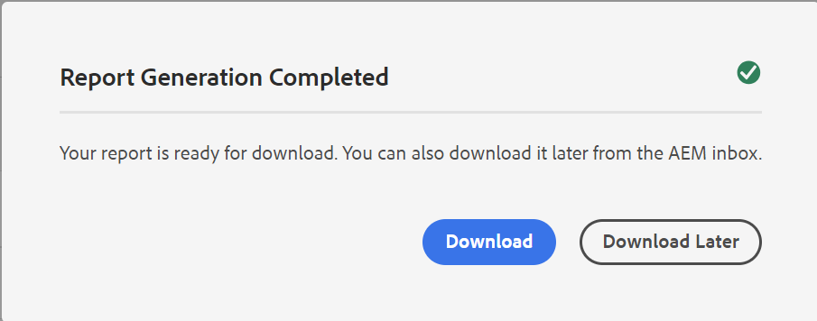

# Rapporto mappa DITA dal dashboard delle mappe {#id205BB800EEN}

Adobe Experience Manager Guides fornisce agli amministratori le funzionalità di reporting per verificare l’integrità complessiva della documentazione prima che venga trasmessa in diretta o resa disponibile agli utenti finali. Il report mappa DITA dal dashboard delle mappe in Experience Manager Guides fornisce informazioni preziose come gli argomenti mancanti, gli argomenti con elementi mancanti, l&#39;UUID degli argomenti e dei file multimediali di riferimento e lo stato di revisione di ciascun argomento. Un report dettagliato a livello di singolo argomento fornisce inoltre informazioni relative al contenuto DITA, ad esempio riferimenti al contenuto e immagini mancanti o rimandi.

>[!NOTE]
>
>Experience Manager Guides aggiorna questo rapporto su ogni evento che determina una modifica nel file di mappa o quando viene aggiornato qualsiasi riferimento all’interno del file dell’argomento.

Per visualizzare il rapporto Mappa DITA, effettuare le seguenti operazioni:

1. Nell&#39;interfaccia utente di Assets, passare al file di mapping DITA per il quale si desidera visualizzare il report e selezionarlo.

1. Seleziona **Report**.

   {align="left"}

   La pagina Rapporti è divisa in due parti:

   - **Riepilogo argomenti:**

     Elenca il riepilogo generale del file di mapping selezionato. Osservando il Riepilogo, è possibile conoscere rapidamente il numero totale di argomenti nella mappa, gli argomenti mancanti, il numero di argomenti con elementi mancanti, lo stato degli argomenti: In bozza, In revisione o Rivisto.

   - **Dettagli:**

     Quando si seleziona un argomento, viene visualizzato un report dettagliato dell&#39;argomento selezionato.

     {align="left"}

     Gli elementi evidenziati in **A**, **B**, **C** e **D** sono descritti di seguito:

      - **Argomento**: titolo dell&#39;argomento specificato nella mappa DITA. Passando il puntatore del mouse sul titolo dell&#39;argomento viene visualizzato il percorso completo dell&#39;argomento. In caso di problemi nell&#39;argomento, come riferimenti o immagini mancanti, viene visualizzato un punto rosso prima del titolo dell&#39;argomento.

      - **Nome file**: nome del file.

      - **UUID**: identificatore univoco universale \(UUID\) del file.

      - **Autore**: utente che ha lavorato per ultimo su questo argomento.

      - **Stato documento**: lo stato corrente del documento: Bozza, In revisione o Rivisto.

      - **Elementi mancanti**: elenca il numero di immagini mancanti o di riferimenti incrociati interrotti, se presenti.

      - **Argomenti mancanti \(B\)**: se sono presenti argomenti con riferimenti interrotti, questi verranno elencati nell&#39;elenco Argomenti mancanti.

      - **Apri in Framemaker \(C\)**: elenca il numero di immagini mancanti o di riferimenti incrociati interrotti, se presenti.

      - **Apri nell&#39;editor \(D\)**: se si seleziona questa icona, l&#39;argomento verrà aperto nell&#39;editor.

   Gli elementi evidenziati in **E** sono descritti di seguito:

   - **Multimedia**: il percorso delle immagini utilizzate nell&#39;argomento viene visualizzato insieme al relativo UUID. Se si seleziona il percorso dell&#39;immagine, l&#39;immagine corrispondente viene aperta in una finestra popup. I collegamenti immagine interrotti sono elencati in rosso.

   - **Riferimenti contenuto**: il percorso del contenuto a cui si fa riferimento nell&#39;argomento viene visualizzato insieme al relativo UUID. Se selezioni il titolo del contenuto a cui si fa riferimento, l’argomento corrispondente viene aperto in modalità Anteprima.

   - **Riferimento incrociato**: viene visualizzato il percorso del contenuto con riferimenti incrociati insieme al relativo UUID. Se selezioni il titolo del contenuto a cui si fa riferimento, l’argomento corrispondente viene aperto in modalità Anteprima. I riferimenti incrociati interrotti sono elencati in rosso.

   - **Revisione**: mostra lo stato dell&#39;attività di revisione dell&#39;argomento. È possibile visualizzare lo stato \(aperto o chiuso\), la data di scadenza e l&#39;assegnatario per l&#39;argomento in revisione. Se si seleziona il collegamento dell&#39;argomento, l&#39;argomento viene aperto in modalità di revisione.

   - **Usato in**: mostra un elenco di altri argomenti o mappe in cui viene utilizzato l&#39;argomento. È elencato anche l’UUID di tutti questi argomenti e mappe.

Oltre al report per ogni singolo argomento, gli amministratori hanno anche accesso a informazioni quali la cronologia di pubblicazione di una mappa DITA. Per ulteriori informazioni sulla cronologia degli output generati, vedere [Visualizzare lo stato dell&#39;attività di generazione dell&#39;output](generate-output-for-a-dita-map.md#viewing_output_history).

## Genera il rapporto mappa CSV di DITA

È possibile scaricare ed esportare il file CSV di un rapporto mappa DITA. Il file CSV contiene il rapporto dettagliato sulla mappa DITA.

Per generare il file CSV di un rapporto mappa DITA, effettuare le seguenti operazioni:

1. Selezionare **Genera report** in alto a sinistra per generare il report mappa DITA.

   {align="left"}

1. Riceverai una notifica quando il report sarà pronto per il download. Seleziona **Scarica** per scaricare il file CSV del rapporto generato.

   {width="550" align="left"}

   Puoi anche scaricare il file CSV del rapporto generato in un secondo momento dalla casella in entrata delle notifiche di Experience Manager.

   Seleziona il rapporto generato nella casella in entrata per scaricarlo.

   {width="300" align="left"}

Una volta scaricato il rapporto nella casella in entrata, puoi anche selezionarlo e utilizzare l’icona Apri nella parte superiore per aprire il rapporto selezionato.

**Argomento padre:**&#x200B;[ Introduzione ai report](reports-intro.md)
