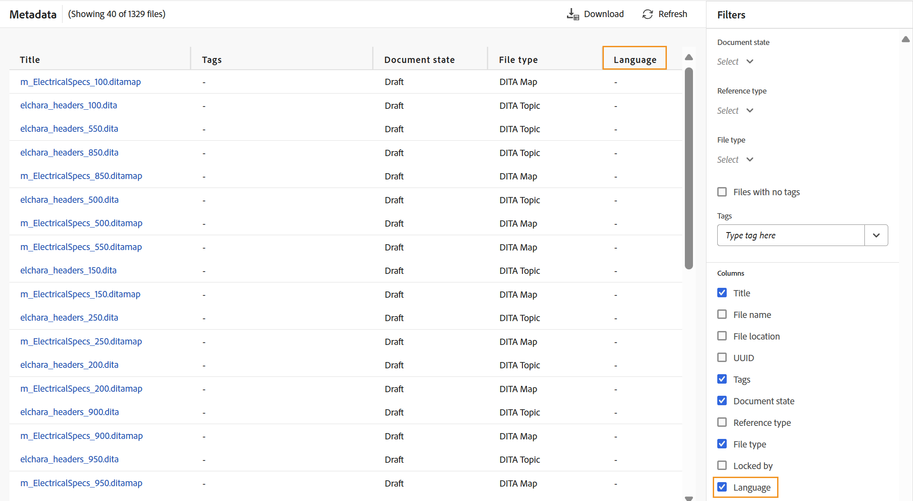
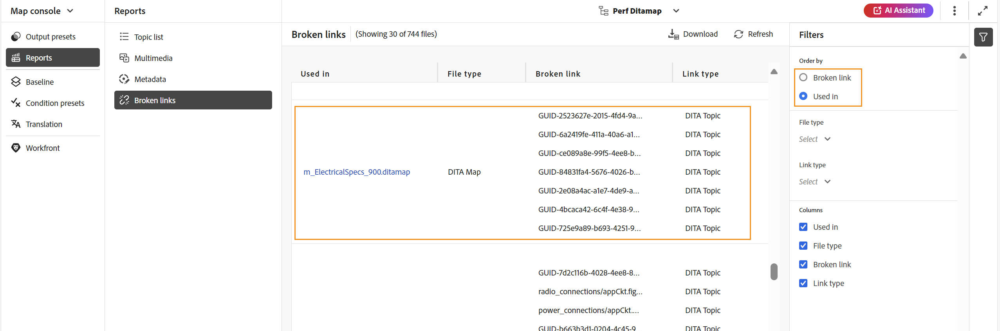

# Rapporto mappa DITA dalla console Mappa {#id231HF0Z0NXA}

Adobe Experience Manager Guides dispone di una funzione nella console Mappa che consente di verificare l’integrità complessiva della mappa e generare i relativi rapporti.

È possibile visualizzare l&#39;elenco degli argomenti, gestire i metadati di tutti i riferimenti, visualizzare l&#39;elenco di elementi multimediali e correggere tutti i collegamenti interrotti per la mappa corrente dalla scheda **Report** nella console Mappa, alla quale è possibile accedere come segue:

1. Nel pannello **Archivio**, aprire il file mappa DITA in visualizzazione Mappa.

   >[!NOTE]
   >
   > Puoi anche aprire una mappa DITA direttamente nella scheda **Console mappe** dal menu a discesa nella parte superiore sinistra della home page.

1. Seleziona l&#39;icona **Apri nella console delle mappe**.

   {width="600" align="left"}

1. Seleziona **Report** dal pannello a sinistra.

Puoi individuare tutti e quattro i rapporti dal pannello **Rapporti**. In base alle tue esigenze, puoi selezionare qualsiasi rapporto come mostrato qui.

{align="left"}

Il pannello Rapporti consente di accedere a quattro diversi tipi di rapporti. Ogni rapporto, insieme alle relative caratteristiche di accessibilità, viene discusso in dettaglio di seguito.

## Report elenco argomenti

Il report **Elenco argomenti** fornisce informazioni dettagliate sugli argomenti, ad esempio il tipo di riferimento, lo stato del documento e l&#39;autore.

È possibile visualizzare il rapporto elenco argomenti di una mappa eseguendo i seguenti passaggi:

1. Selezionare **Elenco argomenti** dal pannello Rapporti. Viene visualizzato l&#39;elenco degli argomenti presenti nella mappa DITA.

   {align="left"}

1. Dal pannello **Filtri** è possibile filtrare gli argomenti in base al **Tipo di riferimento** \(diretto o indiretto\), **Stato documento** \(ad esempio se gli argomenti sono in stato Modifica, In-Review o Rivisto, questi sono elencati\) o al **Autore** dell&#39;argomento.

   >[!NOTE]
   >
   > Tutti i filtri forniscono un elenco completo delle opzioni presenti nel sistema.

1. È inoltre possibile utilizzare le opzioni di filtro degli argomenti seguenti per scegliere di visualizzare le colonne seguenti nell&#39;elenco:

   - **Titolo** Il titolo dell&#39;argomento è specificato nella mappa DITA. È possibile selezionare l&#39;argomento da modificare.
   - **Nome file** Nome del file.
   - **UUID** L&#39;identificatore univoco universale \(UUID\) del file.
   - **Percorso file** Percorso completo dell&#39;argomento.
   - **Tipo di riferimento** Il tipo di riferimento - diretto o indiretto.
   - **Stato documento** Lo stato dell&#39;argomento.
   - **Autore** l&#39;ultimo utente che ha lavorato sull&#39;argomento.
   - **Mappa padre** L&#39;elenco di tutte le mappe in cui si fa riferimento direttamente all&#39;argomento.
   >[!NOTE]
   >
   > Seleziona **Aggiorna** per ottenere un nuovo elenco di argomenti e visualizzare eventuali modifiche nel file di mappa o se un riferimento all&#39;interno del file di argomenti viene aggiornato.

1. Selezionare **Scarica** per scaricare lo snapshot di tutti gli argomenti nella mappa DITA. Il foglio Excel contiene le colonne selezionate e gli argomenti filtrati nella visualizzazione **Elenco argomenti**.

## Rapporto metadati

Il **report metadati** fornisce un report dettagliato dei riferimenti nella mappa DITA corrente, ad esempio il tipo di riferimento, lo stato del documento, i tag, la posizione del file e così via.

Per visualizzare il rapporto metadati di una mappa, effettua le seguenti operazioni:

1. Selezionare **Metadati** dal pannello Rapporti. L&#39;elenco di tutti i riferimenti di una mappa viene visualizzato insieme ai relativi metadati, ad esempio tag, stato del documento e metadati personalizzati. Per aggiungere una nuova colonna di metadati personalizzata, fare riferimento alla sezione [Aggiungi colonne di metadati personalizzate](#add-custom-metadata-columns).

   {align="left"}

1. Dal pannello **Filtri** è possibile filtrare gli argomenti in base al **Stato documento** \(ad esempio se gli argomenti sono in stato Modifica, In revisione o Rivisto, sono elencati\), **Riferimenti** \(diretti o indiretti\), **Tipo file** \(Mappa, Argomento, Documento, Immagine, Video e altri\) del riferimento.

   >[!NOTE]
   >
   > Tutti i filtri forniscono un elenco completo delle opzioni presenti nel sistema.

1. È inoltre possibile scegliere di visualizzare solo i **file senza tag** oppure di scegliere tag specifici dal filtro **Tag** per visualizzare i file ad essi associati.
1. È inoltre possibile utilizzare le opzioni di filtro degli argomenti seguenti per scegliere di visualizzare le colonne seguenti nell&#39;elenco metadati:
   - **Titolo** \(selezionato per impostazione predefinita\) Il titolo del file di riferimento è specificato nella mappa DITA. Puoi selezionare il file per modificarlo.

     >[!NOTE]
     >
     > Accanto al titolo di un file estratto viene visualizzata anche un&#39;icona di estrazione. Passa il cursore del mouse sull’icona per visualizzare il nome dell’utente.

   - **Nome file** Il nome del file.
   - **Posizione file** Percorso completo del file.
   - **UUID** L&#39;identificatore univoco universale \(UUID\) del file.
   - **Tag** \(selezionati per impostazione predefinita\) Tag applicati al file.

     >[!NOTE]
     >
     > Per impostazione predefinita, è possibile visualizzare due tag per un file. Per visualizzare altri tag, selezionare **Mostra altri**. Seleziona **Mostra meno** per comprimere nuovamente l&#39;elenco.

   - **Stato documento** \(selezionato per impostazione predefinita\) Lo stato corrente del file di riferimento.
   - **Tipo di riferimento** Il tipo di riferimento - diretto o indiretto
   - **Tipo file** \(selezionato per impostazione predefinita\) Tipo del file di origine. Le opzioni disponibili sono Mappa, Argomento e Immagine.
   - **Bloccato da** l&#39;utente che ha bloccato il file.

1. Selezionare **Scarica** per scaricare lo snapshot di tutti i riferimenti nella mappa DITA. Il foglio Excel contiene le colonne selezionate e i riferimenti filtrati nella visualizzazione **Metadati**.

### Gestire in blocco i metadati dal rapporto Metadati

È possibile applicare tag a un singolo argomento oppure utilizzare la funzione di assegnazione tag in blocco per applicare più tag a più argomenti, a una mappa DITA o a una mappa secondaria. È inoltre possibile modificare lo stato del documento di tutti gli argomenti selezionati al successivo possibile stato comune del documento.

### Aggiornare i metadati

Per aggiornare i metadati, effettuare le seguenti operazioni:

1. Per aggiornare i metadati, selezionare i file da aggiornare. È possibile selezionare i file visualizzati nel pannello Metadati selezionando la casella di controllo accanto a **Titolo**. Per selezionare tutti i record, utilizzare la scheda **Seleziona tutti** sopra la barra del titolo, come illustrato di seguito.

   >[!NOTE]
   >
   > Non è possibile selezionare i file estratti. Accanto al titolo di un file estratto viene visualizzata anche un&#39;icona di estrazione. Passa il cursore del mouse sull’icona per visualizzare il nome dell’utente.

   {align="left"}

1. Seleziona **Gestisci** dall&#39;inizio.

   {width="350" align="left"}

1. Se desideri aggiungere nuovi tag, seleziona nuovi tag dall’elenco a discesa per applicarli a tutti gli argomenti selezionati. Puoi anche eliminare qualsiasi tag selezionando l’icona a forma di croce accanto al tag.

   >[!NOTE]
   >
   > Vengono elencati i tag comuni applicati a tutti gli argomenti selezionati.

1. Selezionare un nuovo stato del documento per modificare lo stato di tutti i riferimenti selezionati. Nell’elenco a discesa viene visualizzato lo stato comune possibile per tutti gli argomenti selezionati. Ad esempio, se lo stato corrente degli argomenti è In revisione, è possibile visualizzare lo stato Bozza, Approvato o Rivisto.
1. Seleziona **Aggiorna** per aggiornare i metadati. Viene visualizzato un messaggio di conferma per i metadati, indipendentemente dal fatto che siano stati aggiornati correttamente o con aggiornamenti non riusciti. È inoltre possibile selezionare **Scarica report** per scaricare lo snapshot del report. Questa istantanea contiene i dettagli dello stato aggiornato per i riferimenti selezionati.

### Aggiungere colonne di metadati personalizzate

Questa funzione consente di aggiungere colonne di metadati personalizzate in base alle esigenze, che vengono quindi visualizzate nei rapporti sui metadati. Offre inoltre maggiore flessibilità nella generazione di rapporti sui metadati. Per aggiungere una nuova colonna di metadati personalizzata, effettua le seguenti operazioni:

1. Per aggiungere una colonna di metadati personalizzata, seleziona **Impostazioni** dai tre punti nell&#39;angolo in alto a destra della pagina dei metadati.

   {width="600" align="left"}

1. Selezionare **Metadati** nel pannello sinistro del popup visualizzato.
1. Aggiungi un nuovo campo metadati personalizzato in base al requisito utilizzando la scheda **Aggiungi**.

   {width="600" align="left"}

1. Specifica un percorso di metadati specifico e un titolo appropriato per lo stesso elemento da aggiungere nelle colonne del rapporto metadati. Ad esempio, viene aggiunto un metadati personalizzato con la lingua del titolo e un percorso specifico.

   >[!NOTE]
   >
   > Se si desidera rimuovere una particolare colonna di metadati, è possibile eliminarla dall&#39;elenco visualizzato. È inoltre possibile modificare l&#39;**etichetta** per modificare il titolo di visualizzazione della colonna.

   {width="600" align="left"}

1. Seleziona **Salva** e **Aggiorna** la visualizzazione metadati. Una nuova colonna personalizzata **Lingua** è stata aggiunta all&#39;elenco delle colonne nel pannello Filtro.

   >[!NOTE]
   >
   > L&#39;aggiunta di una nuova colonna di metadati si riflette anche nel pannello **Cronologia versione** nell&#39;editor. Per ulteriori informazioni, visualizzare **[Metadati](web-editor-features.md)**.

   {width="600" align="left"}

Allo stesso modo, puoi seguire i passaggi sopra indicati per aggiungere nuovi campi di metadati personalizzati in base ai requisiti necessari nei rapporti sui metadati.

## Rapporto multimediale

Il report **Multimedia** fornisce informazioni dettagliate sugli elementi multimediali utilizzati nella mappa, ad esempio il titolo, il tipo \(audio, video e immagini\), i file in cui vengono utilizzati gli elementi multimediali e il tipo di riferimento dei file in cui sono stati utilizzati. Puoi anche visualizzare l’UUID e la posizione del contenuto multimediale all’interno dell’archivio. È possibile visualizzare un rapporto del file multimediale eseguendo le seguenti operazioni:

1. Selezionare **Multimedia** dal pannello Report. Viene visualizzato l&#39;elenco degli elementi multimediali presenti nella mappa DITA.
1. Dal pannello **Filtri** è possibile ordinare l&#39;elenco per file multimediali o in base ai nomi di utilizzati nei riferimenti.

   - Quando si ordina per **Multimedia**, il nome del contenuto multimediale viene visualizzato nella prima colonna e quindi i nomi di tutti i riferimenti in cui sono stati utilizzati vengono visualizzati in un&#39;altra colonna sulla stessa riga. Ad esempio, la schermata seguente mostra il testSong.mp3 multimediale nella prima colonna e due riferimenti in cui viene utilizzato sono visualizzati nella terza colonna sulla stessa riga.

     {width="650" align="left"}

   - Se si ordina per la colonna **Usato in**, verrà visualizzata la vista trasposta in cui i nomi dei riferimenti in cui sono stati utilizzati i contenuti multimediali sono elencati nella prima colonna, mentre i nomi dei contenuti multimediali sono elencati in un&#39;altra colonna su righe separate. Ad esempio, la schermata seguente mostra i nomi di due riferimenti \(testing_Indian e Video content Topic\) nella prima colonna e il test multimedialeSong.mp3 viene visualizzato nella terza colonna su due righe separate.

     {width="650" align="left"}

1. Puoi filtrare i contenuti multimediali in base al **Tipo di contenuti multimediali** e al **Tipo di riferimento**. L’elenco dei file multimediali viene visualizzato in base alla selezione effettuata nel menu a discesa. Ad esempio, è possibile scegliere di visualizzare solo i riferimenti audio nella mappa DITA e un file mostra solo i riferimenti audio utilizzati.

1. È inoltre possibile utilizzare le seguenti opzioni di filtro per scegliere di visualizzare le colonne seguenti nell&#39;elenco:

   - **Multimedia** \(selezionato per impostazione predefinita\) Il titolo del contenuto multimediale è specificato nella mappa DITA. È possibile selezionare il file multimediale per modificarlo.
   - **Posizione multimedia** Percorso completo del contenuto multimediale.
   - **UUID multimedia** L&#39;identificatore univoco universale \(UUID\) del file.
   - **Tipo multimediale** \(selezionato per impostazione predefinita\) Tipo del file multimediale. Le opzioni disponibili sono Audio, Video o Immagine.
   - **Usato In** \(selezionato per impostazione predefinita\) I riferimenti in cui è stato utilizzato il contenuto multimediale. Potete selezionare il riferimento per modificarlo.
   - **Tipo di riferimento** \(selezionato per impostazione predefinita\) Il tipo di riferimento - diretto o indiretto.
   >[!NOTE]
   >
   > Selezionare **Aggiorna** per ottenere un nuovo elenco di elementi multimediali e visualizzare eventuali modifiche nel file di mappa o eventuali elementi multimediali nella mappa DITA aggiornati.

1. Selezionare **Scarica** per scaricare lo snapshot di tutti i file multimediali nella mappa DITA. Il foglio Excel contiene le colonne selezionate e il contenuto multimediale filtrato nella visualizzazione **Multimedia**.

## Rapporto collegamenti interrotti

**Collegamenti interrotti** è un report utile che fornisce i dettagli dei collegamenti interrotti presenti nella mappa corrente. È possibile visualizzare i collegamenti interrotti, che possono essere per argomenti DITA, riferimenti a file multimediali, riferimenti a chiavi di contenuto e così via. Inoltre, è possibile correggerli direttamente qui.
Il report fornisce informazioni dettagliate quali il collegamento interrotto, il tipo di collegamento, i file in cui viene utilizzato il riferimento e il tipo di file in cui sono stati utilizzati.
Per visualizzare il rapporto relativo ai collegamenti interrotti, eseguire la procedura seguente:

1. Seleziona **Collegamenti interrotti** dal pannello Rapporti. Viene visualizzato l&#39;elenco dei collegamenti o dei riferimenti interrotti presenti nella mappa DITA.
1. Dal pannello **Filtri** è possibile ordinare l&#39;elenco in base ai collegamenti o ai nomi di utilizzati nei riferimenti.

   - Quando si ordina per **Collegamento interrotto**, i percorsi dei collegamenti interrotti vengono visualizzati nella prima colonna e quindi i nomi di tutti i riferimenti in cui sono stati utilizzati vengono visualizzati in un&#39;altra colonna su righe separate. Se lo stesso collegamento interrotto viene utilizzato in più file, questi vengono visualizzati su una riga e vengono mostrati come raggruppati o sotto-righe. Nella schermata seguente, ad esempio, vengono mostrati due collegamenti interrotti nella prima colonna e il riferimento in cui sono utilizzati, `m_ElectricalSpecs_900.ditamap` viene visualizzato nella terza colonna in due righe separate.

   {align="left"}

   - Se si ordina per **Usato nella colonna**, verrà visualizzata la visualizzazione trasposta in cui i nomi dei riferimenti in cui sono stati utilizzati i collegamenti interrotti sono elencati nella prima colonna, mentre i collegamenti interrotti sono elencati in un&#39;altra colonna sulla stessa riga. Ad esempio, la schermata seguente mostra il riferimento (in cui viene utilizzato il collegamento interrotto) `m_ElectricalSpecs_900.ditamap` nella prima colonna e i collegamenti interrotti vengono visualizzati nella terza colonna sulla stessa riga.

   {align="left"}

1. Puoi filtrare i collegamenti interrotti in base al **tipo di file** e al **tipo di collegamento**. L’elenco dei collegamenti interrotti viene visualizzato in base alla selezione effettuata nel menu a discesa. Ad esempio, è possibile scegliere di visualizzare solo i riferimenti di contenuto nella mappa DITA e un file mostra solo i riferimenti di contenuto interrotto utilizzati.

   Argomento DITA, Mappa DITA, Riferimento file, Riferimento chiave, Riferimento contenuto, Riferimento chiave contenuto, Riferimento immagine, Riferimento file multimediale e Riferimento chiave multimediale sono valori disponibili per l&#39;elenco a discesa **Tipo di collegamento** e Argomento DITA, Mappa DITA, Documento, Immagine, Video, Audio e altri sono valori disponibili per l&#39;elenco a discesa **Tipo file**.
1. È inoltre possibile utilizzare le seguenti opzioni di filtro per scegliere di visualizzare le colonne seguenti nell&#39;elenco:

   - **Collegamento interrotto** (selezionato per impostazione predefinita) Il percorso del collegamento interrotto è specificato nella mappa DITA.

   - **Tipo di collegamento** (selezionato per impostazione predefinita) Il tipo di collegamento. Le opzioni disponibili sono Argomento DITA, Mappa DITA, Riferimento file, Riferimento chiave, Riferimento contenuto, Riferimento chiave contenuto, Riferimento immagine, Riferimento file multimediale e Riferimento chiave multimediale.

   - **Usato In** (selezionato per impostazione predefinita) I riferimenti in cui è stato utilizzato il collegamento interrotto. Puoi selezionare il riferimento per visualizzarlo in modalità di authoring.

   - **Tipo file** (selezionato per impostazione predefinita) Il tipo di riferimento: Argomento DITA, Mappa DITA, Documento, Immagine, Video, Audio e altri.

   Seleziona **Aggiorna** per ottenere un nuovo elenco di collegamenti interrotti e visualizzare eventuali modifiche nel file di mappa o se eventuali collegamenti interrotti nella mappa DITA vengono aggiornati.
1. Puoi fare clic sull&#39;icona **Collegamento di correzione** () per correggere il collegamento interrotto.

   >[!NOTE]
   >
   > Passa il puntatore del mouse sul percorso del collegamento interrotto nella colonna Collegamento interrotto per visualizzare l&#39;icona Correggi collegamento ().

   È possibile correggere un collegamento in entrambe le visualizzazioni se sono stati ordinati **Collegamenti interrotti** o **Usati in**.

   >[!NOTE]
   >
   > Quando si corregge un collegamento interrotto mentre è stato ordinato per collegamenti interrotti, il collegamento verrà corretto in tutti i file in cui viene utilizzato (raggruppati in un&#39;unica riga).

1. È necessario aggiornare i dettagli di riferimento richiesti nella finestra di dialogo **Aggiorna collegamento**. I dettagli richiesti nella finestra di dialogo **Aggiorna collegamento** dipendono dal tipo di riferimento.\
   Una volta corretto un collegamento, questo non viene visualizzato nell’elenco dei collegamenti interrotti. È invece possibile visualizzarlo in Elenco argomenti o Metadati.

1. Selezionare **Scarica** per scaricare lo snapshot di tutti i collegamenti interrotti nella mappa DITA. Il file Excel contiene le colonne selezionate e i collegamenti interrotti filtrati nella visualizzazione Collegamenti interrotti.

**Argomento padre:**[ Introduzione ai report](reports-intro.md)
