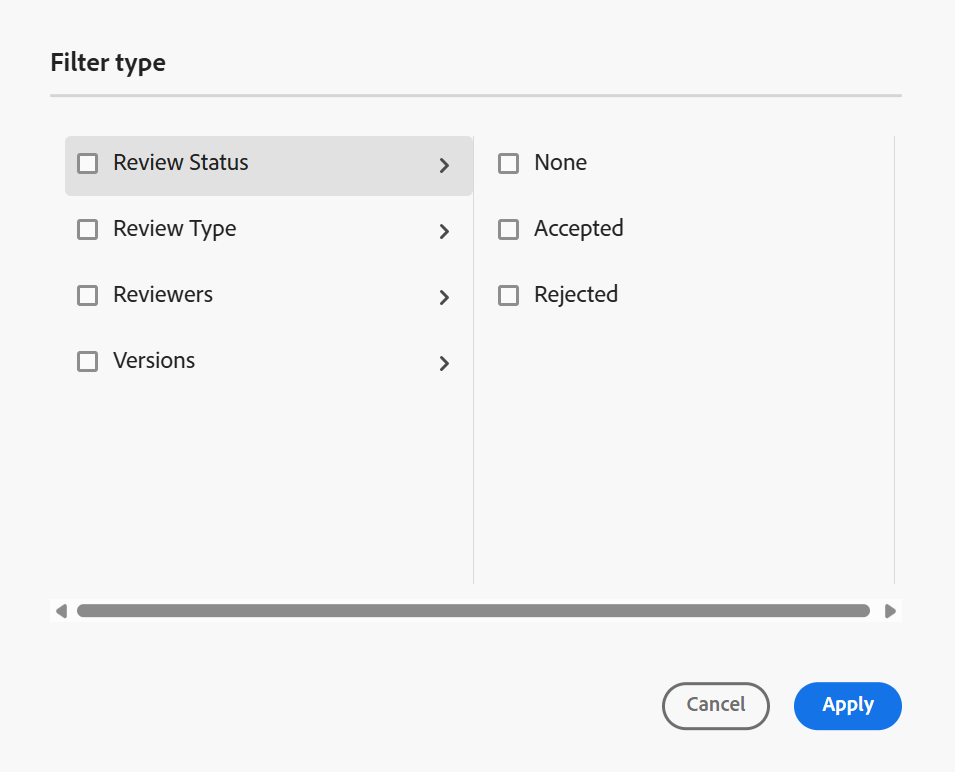
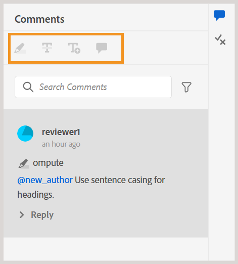

# Commenti sulla revisione degli indirizzi {#id2056B0X0KBI}

In qualità di autore, puoi indirizzare i commenti in un argomento utilizzando l’Editor. I commenti vengono caricati in base all&#39;attività di revisione selezionata nel pannello Revisione. Per ulteriori dettagli, visualizzare la descrizione della funzionalità **del pannello** Review nella sezione [Left Panel](../user-guide/web-editor-features.md#id2051EA0M0HS).

Nelle sezioni seguenti vengono descritti i modi in cui i commenti vengono inseriti nell’editor.

Un autore può indirizzare i commenti di un documento dall’editor. Vengono forniti indicatori visivi che indicano se i commenti inseriti \(testo\), eliminati o evidenziati. Anche il tipo di commento è menzionato nella parte superiore di ogni voce di commento.

>[!NOTE]
>
> Quando si affrontano i commenti di revisione \(per un documento di revisione attivo\), assicurarsi di non aprire l&#39;argomento in-review in più schede con la vista tag completi abilitata, non passare dalla modalità di visualizzazione Autore a quella di Source.

{align="left"}

Nell’editor, il pannello a destra contiene le icone Revisione e Traccia modifiche. Il pannello Revisione mostra tutti i commenti aggiunti nel documento dai revisori. Il pannello **Rileva modifiche** mostra lo stato di tutti i commenti inseriti ed eliminati nel documento.

- **A**: selezionare un&#39;attività di revisione per visualizzare i commenti di revisione. Se l&#39;argomento è stato condiviso per la revisione in più attività di revisione, verranno visualizzate le attività elencate in questo elenco a discesa.

  Quando si seleziona un&#39;attività di revisione dall&#39;elenco, è possibile visualizzare i commenti dei revisori dell&#39;attività. È possibile indirizzare i commenti di revisione in modo indipendente nelle attività, il che significa che qualsiasi aggiornamento di un commento è visibile solo ai revisori della rispettiva attività.

- **B:** Seleziona **Dettagli revisione**  nel pannello **Commenti** per visualizzare ulteriori informazioni sull&#39;attività di revisione:

   - **Nome**: nome dell&#39;attività di revisione.
   - **Versione revisione**: visualizza la versione associata all&#39;attività di revisione selezionata. Questo ti aiuta a tenere traccia della versione che hai condiviso per la revisione
   - **Stato**: stato corrente dell&#39;attività di revisione.

  >[!NOTE]
  >
  > Se la mappa radice dell&#39;attività di revisione è diversa dalla mappa radice di creazione, le informazioni vengono visualizzate per indicare che la mappa radice di creazione e la mappa radice di revisione non corrispondono.

- **C**: se l&#39;argomento è stato aggiornato dopo l&#39;avvio della revisione, se si seleziona l&#39;icona **Ripristina argomento alla versione di revisione**, la copia di lavoro verrà ripristinata alla versione condivisa per la revisione. In questo modo è più facile incorporare il feedback di revisione direttamente nella versione condivisa per la revisione. Dopo aver incorporato il feedback, puoi salvare le modifiche nella versione ripristinata o creare una nuova revisione dell’argomento. Se si sceglie di creare una nuova revisione dell&#39;argomento, viene creato un nuovo ramo dalla versione dell&#39;argomento condivisa per la revisione. Ad esempio, se la versione `1.2` di un argomento è stata condivisa per la revisione mentre la versione di authoring corrente è `1.3`, è possibile utilizzare questa icona per tornare alla versione `1.2` per incorporare i commenti di revisione. Se si sceglie di creare una nuova revisione dopo aver incorporato le modifiche alla versione `1.2`, verrà creato un nuovo ramo con la versione `1.2.0` per l&#39;argomento.

  In genere, dopo aver incorporato il feedback di revisione, si desidera unire le modifiche apportate dall&#39;ultima versione dell&#39;argomento. A tale scopo, utilizzare la funzionalità [Unisci](web-editor-features.md#id205DF04E0HS) per ottenere tutti gli aggiornamenti apportati dopo che l&#39;argomento è stato condiviso per la revisione.

- **D**: aprire la visualizzazione affiancata per visualizzare la versione con commenti dell&#39;argomento. Come mostrato nella schermata precedente, la sezione più a sinistra è l’ultima versione dell’argomento in cui puoi apportare modifiche. La sezione successiva è la versione commentata dell’argomento. Quando si passa da un commento all&#39;altro nell&#39;argomento, la vista laterale cambia e viene visualizzata la versione dell&#39;argomento in cui è stato inserito il commento. Ogni commento nel pannello dei commenti è collegato al testo corrispondente in questa sezione. Consente di identificare il testo commentato. I commenti vengono visualizzati nell&#39;ordine del testo commentato nel documento.

  Puoi visualizzare il numero di versione nella parte superiore della vista laterale. Se si seleziona nuovamente questa icona, verrà nascosta la versione con commenti dell&#39;argomento.

- E: Importa direttamente i commenti \(o Barrato\) inseriti ed eliminati nell’argomento. Dopo aver selezionato l&#39;icona Importa, nella copia di lavoro dell&#39;argomento vengono visualizzati tutti gli inserimenti e le eliminazioni di testo. Ci sono due modi per accettare o rifiutare i commenti.

  Per incorporare la modifica suggerita \(inserimento o eliminazione\) una alla volta, fare clic con il pulsante destro del mouse sul commento nel contenuto e selezionare Accetta modifica o Rifiuta modifica. A seconda della selezione, il commento viene accettato o rifiutato. In caso di commento accettato, il contenuto viene aggiunto al contenuto e, in caso di rifiuto, viene rimosso dal contenuto. Inoltre, lo stato del commento viene modificato nel pannello Revisione.

  {align="left"}

  Potete inoltre utilizzare il pannello Revisioni per accettare o rifiutare i commenti. Se si seleziona un commento, quest&#39;ultimo verrà evidenziato nel documento.

  {align="left"}

  >[!IMPORTANT]
  >
  > La funzione di importazione di commenti funziona solo sui documenti che non sono stati modificati da quando sono stati condivisi per la revisione. Se dopo aver inviato il documento per la revisione hai apportato delle modifiche, riceverai un avviso per **Importare forzatamente** commenti nel tuo documento. Tuttavia, questa operazione comporterà la perdita di tutti gli aggiornamenti effettuati nel documento. Viene inoltre visualizzato l&#39;avviso **Forza importazione** se il documento viene creato all&#39;esterno e quindi condiviso per la revisione. Potete importare i commenti.

  Quando e quando si accetta o si rifiuta un commento, questo viene rimosso dall&#39;elenco delle revisioni. Questo serve anche da indicatore del numero di commenti che devono essere trattati nel documento.

- **F**: dal menu Altre opzioni, scaricare tutti gli allegati disponibili nell&#39;argomento di revisione.
- **G**: cerca un testo all&#39;interno di commenti.
- **H**: accettare o rifiutare un commento.

- **I**: applica un filtro ai commenti. È possibile filtrare per visualizzare i commenti in base a Tipo di revisione \(tutti, evidenziati, eliminati, inseriti o note di Sticky Notes\), Stato revisione \(tutti, accettati, rifiutati o nessuno\), Revisori \(tutti o specifici revisori\(s\)\) o Versioni dell&#39;argomento. Per impostazione predefinita, nessuno dei filtri è selezionato.

  {width="350" align="left"}
  **Rispondi a un commento assegnando tag ad altri utenti**

In qualità di autore e di iniziatore dell&#39;attività di revisione, è possibile rispondere ai commenti di revisione e assegnare tag ad altri utenti coinvolti nella stessa attività di revisione per indirizzare la loro attenzione o assegnare follow-up. Questa funzionalità è disponibile solo per le attività di revisione attive.

>[!NOTE]
>
> Per visualizzare l&#39;elenco degli utenti assegnati a un&#39;attività di revisione e assegnare loro un tag in un commento, è necessario disporre dell&#39;accesso *Lettura* sui nodi `/home/users and /home/groups`. Per ulteriori dettagli, visualizzare [Amministrazione utente e sicurezza](../cs-install-guide/user-admin-sec.md#additional-notes-on-user-groups).   Se l&#39;assegnazione dei tag non è ancora disponibile dopo la conferma dell&#39;accesso, l&#39;amministratore potrebbe dover assegnare una licenza `user-admin` per abilitare questa funzionalità.

{width="350" align="left"}
*Didascalia:Tag utenti come iniziatore/autore*

Gli utenti taggati ricevono sia un’e-mail che una notifica AEM, assicurandosi di essere prontamente informati. Per ulteriori dettagli su come attivare le notifiche di revisione, visualizzare [Informazioni sulle notifiche di revisione](./review-understanding-review-notifications.md).

**Accedere ai commenti di revisione utilizzando l&#39;interfaccia utente Revisione**

Se sei l&#39;iniziatore o l&#39;autore di un&#39;attività di revisione e la apri dalla console **Progetti**, l&#39;argomento verrà avviato nell&#39;interfaccia utente di revisione. Poiché questa attività non è assegnata all&#39;utente, è possibile visualizzare e rispondere ai commenti ma non eseguire alcuna azione di revisione. La barra degli strumenti Commenti rimane disabilitata per gli utenti che non sono assegnati all&#39;attività.

{width="350" align="left"}

**Argomento padre:**[ Introduzione alla revisione](review.md)
