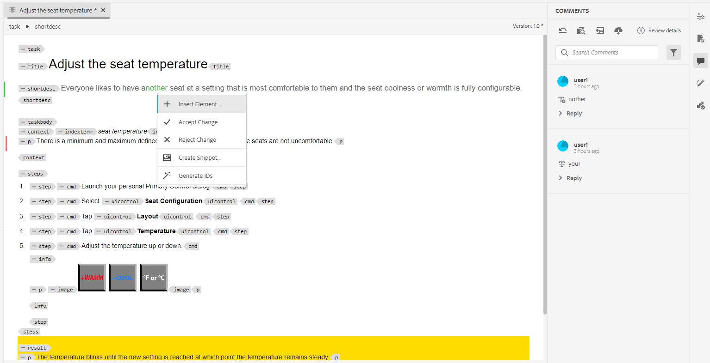

# Commenti sulla revisione degli indirizzi {#id2056B0X0KBI}

In qualità di autore, è possibile indirizzare i commenti in un argomento utilizzando l&#39;Editor Web. I commenti vengono caricati in base all&#39;attività di revisione selezionata nel pannello Revisione. Per ulteriori dettagli, vedi **Revisione** pannello  descrizione della funzione in [Pannello sinistro](../user-guide/web-editor-features.md#id2051EA0M0HS) sezione.

Nelle sezioni seguenti vengono descritte le modalità di modifica dei commenti nell&#39;Editor Web.

Un autore può indirizzare commenti in un documento dall&#39;editor Web. Vengono forniti indicatori visivi che indicano se i commenti inseriti \(testo\), eliminati o evidenziati. Anche il tipo di commento è menzionato nella parte superiore di ogni voce di commento.

>[!NOTE]
>
> Quando si affrontano i commenti di revisione \(per un documento di revisione attivo\), accertarsi di non aprire l&#39;argomento in-review in più schede con la vista tag completi abilitata, e di non passare dalla modalità di visualizzazione Creazione a quella Origine.

{width="800" align="left"}

Nella modalità Editor Web, il pannello di destra contiene le icone Revisione e Tracciamento modifiche. Il pannello Revisione mostra tutti i commenti inseriti nel documento dai revisori. Il **Modifiche tracciate** nel pannello viene visualizzato lo stato di tutti i commenti inseriti ed eliminati nel documento.

- **A**: seleziona un’attività di revisione per visualizzare i commenti di revisione. Se l&#39;argomento è stato condiviso per la revisione in più attività di revisione, verranno visualizzate quelle elencate in questo elenco a discesa.

  Quando si seleziona un&#39;attività di revisione dall&#39;elenco, è possibile visualizzare i commenti dei revisori dell&#39;attività. È possibile indirizzare i commenti di revisione in modo indipendente nelle attività, il che significa che qualsiasi aggiornamento di un commento è visibile solo ai revisori della rispettiva attività.

- **B:**  Seleziona **Dettagli revisione**  nel **Commenti** per visualizzare ulteriori informazioni sull&#39;attività di revisione:

   - **Nome**: nome dell&#39;attività di revisione .
   - **Revisione versione**: visualizza la versione associata all’attività di revisione selezionata. Questo ti aiuta a tenere traccia della versione che hai condiviso per la revisione
   - **Stato**: stato corrente dell’attività di revisione.

  >[!NOTE]
  >
  > Se la mappa radice dell&#39;attività di revisione è diversa dalla mappa radice di creazione, le informazioni vengono visualizzate per indicare che la mappa radice di creazione e la mappa radice di revisione non corrispondono.

- **C**: se l’argomento è stato aggiornato dopo l’avvio della revisione, facendo clic sull’icona Ripristina argomento alla versione di revisione, la copia di lavoro viene ripristinata alla versione condivisa per la revisione. In questo modo è più facile incorporare il feedback di revisione direttamente nella versione condivisa per la revisione. Dopo aver incorporato il feedback, puoi salvare le modifiche nella versione ripristinata o creare una nuova revisione dell’argomento. Se si sceglie di creare una nuova revisione dell&#39;argomento, viene creato un nuovo ramo dalla versione dell&#39;argomento condivisa per la revisione. Ad esempio, se hai condiviso una versione `1.2` di un argomento da rivedere mentre la versione di authoring corrente è `1.3`, quindi puoi utilizzare questa icona per tornare alla versione `1.2` per l&#39;inserimento delle osservazioni sul riesame. Se scegli di creare una nuova revisione dopo aver incorporato le modifiche alla versione `1.2`, quindi un nuovo ramo con la versione `1.2.0` viene creato per l&#39;argomento.

  In genere, dopo aver incorporato il feedback di revisione, si desidera unire le modifiche apportate dall&#39;ultima versione dell&#39;argomento. A tale scopo, utilizza [Unisci](web-editor-features.md#id205DF04E0HS) per ottenere tutti gli aggiornamenti effettuati dopo che l’argomento è stato condiviso per la revisione.

- **D**: consente di aprire la visualizzazione affiancata per visualizzare la versione con commenti dell’argomento. Come mostrato nella schermata precedente, la sezione più a sinistra è l’ultima versione dell’argomento in cui puoi apportare modifiche. La sezione successiva è la versione commentata dell’argomento. Quando si passa da un commento all&#39;altro nell&#39;argomento, la vista laterale cambia e viene visualizzata la versione dell&#39;argomento in cui è stato inserito il commento. Ogni commento nel pannello dei commenti è collegato al testo corrispondente in questa sezione. Consente di identificare il testo commentato. I commenti vengono visualizzati nell&#39;ordine del testo commentato nel documento.

  Il numero di versione è riportato nella parte superiore della vista laterale. Facendo nuovamente clic su questa icona, viene nascosta la versione commentata dell’argomento.

- E: Importa direttamente i commenti \(o Barrato\) inseriti ed eliminati nell’argomento. Dopo aver fatto clic sull&#39;icona Importa, tutti gli inserimenti e le eliminazioni di testo vengono visualizzati nella copia di lavoro dell&#39;argomento. Ci sono due modi per accettare o rifiutare i commenti.

  Per incorporare la modifica suggerita \(inserimento o eliminazione\) una alla volta, fare clic con il pulsante destro del mouse sul commento nel contenuto e selezionare Accetta modifica o Rifiuta modifica. A seconda della selezione, il commento viene accettato o rifiutato. In caso di commento accettato, il contenuto viene aggiunto al contenuto e, in caso di rifiuto, viene rimosso dal contenuto. Inoltre, lo stato del commento viene modificato nel pannello Revisione.

  {width="800" align="left"}

  Potete inoltre utilizzare la funzione di revisione nel pannello di destra per accettare o rifiutare i commenti. Facendo clic su un commento, questo viene evidenziato nel documento.

  {width="800" align="left"}

  >[!IMPORTANT]
  >
  > La funzione di importazione di commenti funziona solo sui documenti che non sono stati modificati da quando sono stati condivisi per la revisione. Se sono state apportate modifiche dopo aver inviato il documento per la revisione, verrà visualizzato un avviso a **Forza importazione** commenti nel documento. Tuttavia, questa operazione comporterà la perdita di tutti gli aggiornamenti effettuati nel documento. Il **Forza importazione** viene inoltre visualizzato un avviso se il documento viene creato all&#39;esterno e quindi condiviso per la revisione. Potete importare i commenti.

  Quando e quando si accetta o si rifiuta un commento, questo viene rimosso dall&#39;elenco delle revisioni. Questo serve anche da indicatore del numero di commenti che devono essere trattati nel documento.

- **F**: dal menu Altre opzioni, scarica tutti gli allegati disponibili nell’argomento di revisione.
- **G**: cerca un testo all’interno di commenti.
- **H**: accetta o rifiuta un commento.

- **I**: applica un filtro ai commenti. È possibile filtrare per visualizzare i commenti in base a Tipo di revisione \(tutti, evidenziati, eliminati, inseriti o note di Sticky Notes\), Stato revisione \(tutti, accettati, rifiutati o nessuno\), Revisori \(tutti o specifici revisori\(s\)\) o Versioni dell&#39;argomento.

**Argomento padre:**[ Rivedi argomenti o mappe](review.md)
