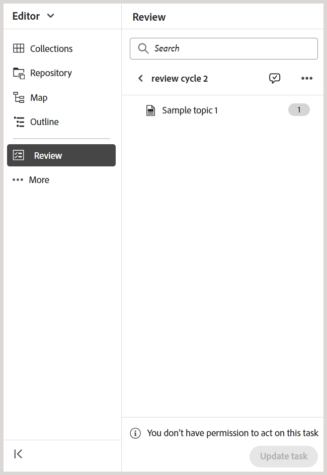

# Richiedere un riesame o chiudere un&#39;attività di revisione come autore

>[!IMPORTANT]
>
> Le nuove funzioni descritte in questo articolo sono abilitate per impostazione predefinita con la versione 2508 di Experience Manager Guides as a Cloud Service. Le revisioni create prima della migrazione non sono interessate e continueranno a utilizzare il flusso di lavoro precedente. Se preferisci continuare a utilizzare le funzioni esistenti senza questi aggiornamenti, contatta il team Customer Success per disabilitare le nuove funzioni.

Quando un&#39;attività di revisione viene contrassegnata come completata da un revisore, viene attivata una notifica all&#39;iniziatore dell&#39;attività, che consente di accedere all&#39;attività e ai relativi commenti a livello di attività e di rivederli.

In qualità di iniziatore dell’attività di revisione, puoi quindi decidere come procedere in base al feedback ricevuto. Opzioni disponibili:

- Richiedi un riesame
- Chiudi l&#39;attività di revisione

## Richiedere un riesame o chiudere un&#39;attività di revisione

Per richiedere un riesame o chiudere un&#39;attività di revisione, effettuare le operazioni riportate di seguito.

1. Apri il pannello **Revisione** dal pannello sinistro dell&#39;editor.
2. Selezionare dall&#39;elenco **Attività attive** l&#39;attività di revisione che si desidera chiudere o inviare nuovamente per la revisione.

   >[!NOTE]
   >
   > È possibile accedere alla pagina **Dettagli attività** per gestire l&#39;attività di revisione. A tale scopo, selezionare **Apri dettagli attività** dal menu Opzioni di qualsiasi attività di revisione attiva. Questa operazione apre i dettagli dell’attività nella console Progetti.

   
3. Seleziona l&#39;icona **Commenti attività** per accedere e rivedere i commenti a livello di attività aggiunti dal revisore.

   .

   La finestra di dialogo **Commenti attività** è visualizzata a destra.

   {width="350" align="left"}.
4. Seleziona **Aggiorna attività** per eseguire ulteriori azioni sull&#39;attività di revisione selezionata.
5. Nella finestra di dialogo **Aggiorna attività**, scegli una delle azioni seguenti:

   - **Richiedi revisione**: avvia un altro ciclo di revisione. È possibile selezionare una versione diversa dell&#39;argomento da rivedere. Per impostazione predefinita, viene selezionata la versione più recente (o l&#39;ultima modifica) del file argomento o mappa inviato per la revisione. È inoltre possibile utilizzare l&#39;opzione **Modifica versioni** per impostare la versione degli argomenti selezionati su **Versione più recente** o **Previsione** in base alle esigenze.  I revisori che hanno completato la revisione precedente riceveranno una notifica per fornire un feedback sulla versione aggiornata. Gli altri revisori, che non hanno contrassegnato l&#39;attività di revisione come completata, ricevono una notifica sull&#39;aggiornamento dell&#39;argomento.

   - **Chiudi revisione**: chiude l&#39;attività di revisione. Il pulsante **Aggiorna attività** presente nella parte inferiore del pannello Revisione diventa **Chiuso** e viene inviata una notifica a tutti gli utenti coinvolti nell&#39;attività di revisione che ne indica la chiusura.

   Per informazioni dettagliate su come attivare le notifiche di revisione, visualizzare [Informazioni sulle notifiche di revisione](./review-understanding-review-notifications.md).

   {width="350" align="left"}

   Puoi anche [controllare lo stato dell&#39;attività di revisione](./review-manage-tasks-review-dashboard.md#check-the-status-of-a-review-task) utilizzando l&#39;opzione **Controlla stato revisione** presente nella finestra di dialogo Aggiorna attività. Se si seleziona questa opzione, viene visualizzata la dashboard Revisione in cui viene visualizzato il rapporto sullo stato dell&#39;attività di revisione.

   {width="650" align="left"}

6. Seleziona **Conferma**.

Come Autore o iniziatore di un&#39;attività di revisione, quando chiudi l&#39;attività, il pulsante **Aggiorna attività** presente nella parte inferiore del pannello Revisione viene modificato in **Chiuso**, a indicare che l&#39;attività non è più attiva.

{width="350" align="left"}

Inoltre, il pulsante **Aggiorna attività** presente nel pannello Revisione rimane disattivato per gli altri utenti dell&#39;attività di revisione. Ad esempio, se apri l&#39;attività nell&#39;editor come revisore di un&#39;attività di revisione, il pulsante Aggiorna attività verrà disattivato con un messaggio **Non disponi dell&#39;autorizzazione per questa attività**. Solo l&#39;iniziatore di un&#39;attività di revisione è autorizzato ad aggiornare l&#39;attività dall&#39;editor.

{width="350" align="left"}

