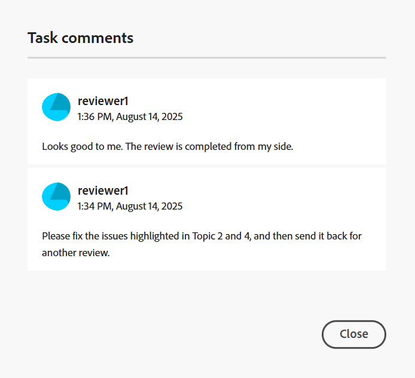

# Completa l&#39;attività di revisione come revisore

>[!IMPORTANT]
>
> Le nuove funzioni descritte in questo articolo sono abilitate per impostazione predefinita con la versione 2508 di Experience Manager Guides as a Cloud Service. Le revisioni create prima della migrazione non sono interessate e continueranno a utilizzare il flusso di lavoro precedente. Se preferisci continuare a utilizzare le funzioni esistenti senza questi aggiornamenti, contatta il team Customer Success per disabilitare le nuove funzioni.

In qualità di revisore, puoi contrassegnare un’attività di revisione come completata dopo aver rivisto tutto il contenuto e aver richiesto una notifica all’autore. In questa fase è inoltre possibile lasciare eventuali commenti finali.

Per completare un&#39;attività di revisione, effettuare le seguenti operazioni:

1. Aprire l&#39;attività di revisione assegnata all&#39;utente.
2. Seleziona **Contrassegna come completato** dall&#39;alto come mostrato di seguito:

   {width="350"}

   Viene visualizzata la finestra di dialogo **Attività completata**.
3. Nella finestra di dialogo **Completa attività**, aggiungi i commenti finali per l&#39;autore e seleziona **Completa**.

   >[!NOTE]
   >
   > I commenti a livello di attività fungono da riepilogo o commenti finali e sono distinti dai commenti a livello di testo aggiunti durante la revisione dell&#39;argomento. In questa finestra di dialogo è possibile delineare azioni di follow-up, ad esempio richiedere all’autore di rispondere a commenti specifici e inviare nuovamente l’attività per la revisione, oppure indicare che la revisione è completa.

   Ad esempio, in qualità di Revisore, puoi aggiungere un commento come azione di follow-up per l’Autore:

   {width="350"}

   Oppure, aggiungi un commento per indicare il completamento dell’attività come mostrato di seguito:

   {width="350"}

L&#39;attività è stata contrassegnata come completata e il relativo stato è ora impostato su **Completata**. Non sono consentite ulteriori azioni dopo che l’attività è contrassegnata come completata. Viene inviata una notifica all’Autore o all’iniziatore dell’attività di revisione per attirare la loro attenzione immediata. Per ulteriori dettagli su come attivare le notifiche di revisione, visualizzare [Informazioni sulle notifiche di revisione](./review-understanding-review-notifications.md).

{width="350"}

In base al feedback, se l&#39;autore o l&#39;iniziatore dell&#39;attività decide di [chiudere l&#39;attività di revisione](./review-close-review-task.md), lo stato dell&#39;attività nell&#39;interfaccia utente di revisione viene modificato in **Chiuso**.

{width="350"}

>[!NOTE]
>
>Per impostazione predefinita, quando un revisore contrassegna un&#39;attività di revisione come **Completa**, l&#39;attività rimane nella cartella Posta in arrivo di AEM fino a quando l&#39;autore o l&#39;iniziatore dell&#39;attività non rivede il feedback e chiude l&#39;attività di revisione.
>
>Tuttavia, puoi scegliere di abilitare la sincronizzazione delle attività tra l’interfaccia utente di revisione e la casella in entrata di AEM. Quando questa funzione è abilitata, contrassegnando un&#39;attività di revisione come **Completa** nell&#39;interfaccia utente Revisione, l&#39;attività corrispondente viene automaticamente completata e rimossa dalla casella in entrata di AEM del revisore. Analogamente, il completamento di un’attività dalla casella in entrata di AEM la contrassegna automaticamente come completata nell’interfaccia utente di revisione.
>
>L’autore o l’iniziatore dell’attività può comunque rivedere il feedback e riassegnare l’attività se è necessaria un’ulteriore revisione. Quando un’attività viene riassegnata, viene generata una nuova notifica Casella in entrata AEM per il revisore, che consente di rivedere nuovamente l’attività.
>
>Per abilitare questa funzione nel tuo ambiente, contatta il team Customer Success.

## Visualizza commenti a livello di attività

Tutti i commenti a livello di attività vengono visualizzati nella finestra di dialogo **Commenti attività**, disponibile in modalità di sola lettura. Quando completate un&#39;attività di revisione con un commento finale, il vostro input viene registrato in questa finestra di dialogo per riferimento futuro.

Per accedere ai commenti a livello di attività dall&#39;interfaccia utente Revisione, passa al pannello a sinistra e seleziona l&#39;icona **Commenti attività**.

{width="350"}

La finestra di dialogo **Commenti attività** è visualizzata a destra.

{width="350"}

I commenti all&#39;interno della finestra di dialogo vengono visualizzati in ordine cronologico, con i commenti recenti visualizzati per primi e i commenti meno recenti visualizzati per ultimi. Questo ordine ti aiuta a seguire la conversazione come progrediva nel tempo.

La finestra di dialogo **Commenti attività** è accessibile a tutti gli utenti coinvolti nell&#39;attività di revisione, inclusi l&#39;autore o l&#39;iniziatore dell&#39;attività di revisione e altri revisori. Di conseguenza, i commenti di altri revisori (se coinvolti) potrebbero essere visualizzati anche nella finestra di dialogo Commenti attività. Ciò consente di garantire una comunicazione chiara e tracciabile durante l’intero processo di revisione.

Dopo aver esaminato il feedback a livello di attività, l’Autore può richiedere un riesame o chiudere l’attività di revisione. In entrambi i casi, tutti i commenti acquisiti durante il processo di revisione rimangono disponibili come riferimento nella finestra di dialogo **Commenti attività**.
