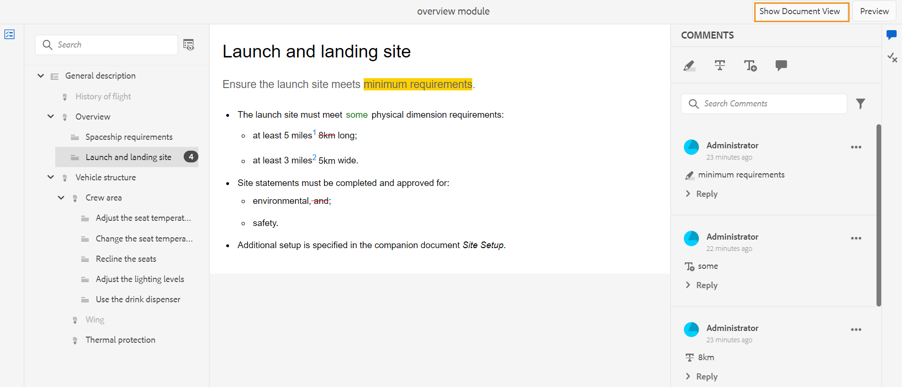
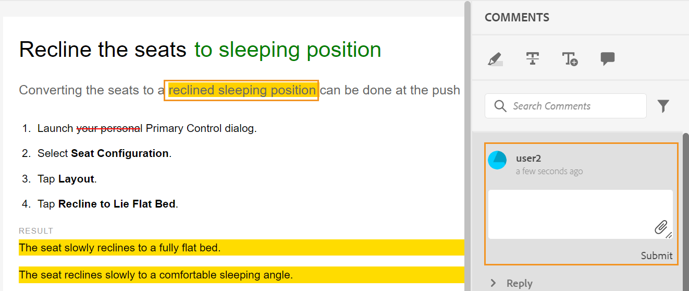
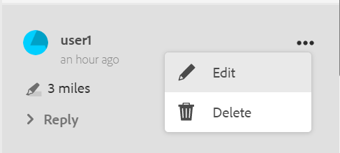
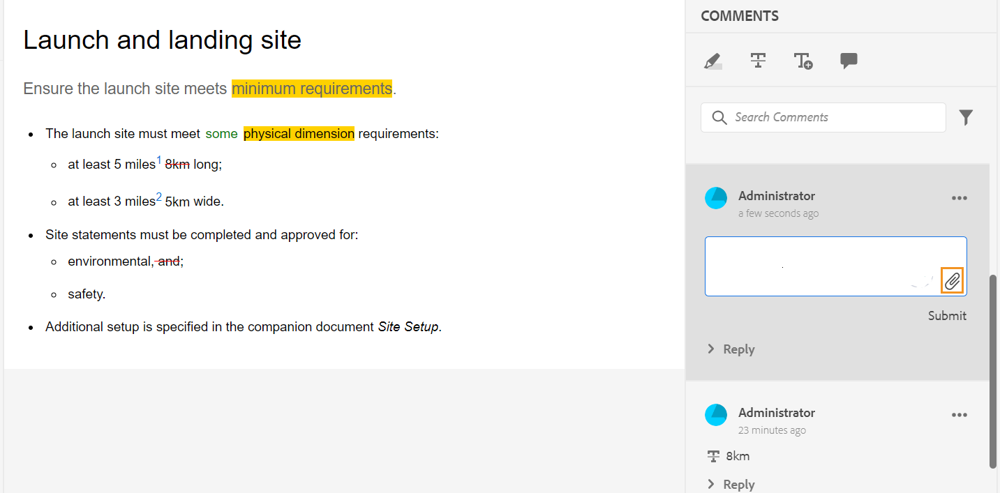
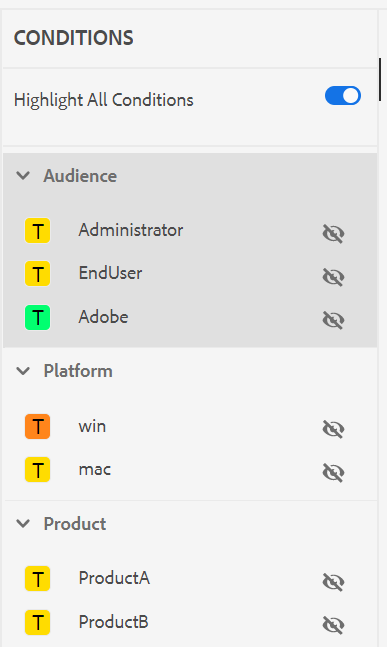

# Rivedi argomenti {#id2056B0W0FBI}

Se sei un revisore, riceverai un’e-mail di richiesta di revisione con il collegamento agli argomenti di revisione. Facendo clic sul collegamento si accede alla pagina di revisione in cui è possibile aggiungere il proprio feedback sugli argomenti condivisi.

Per rivedere un argomento, effettua le seguenti operazioni:

1. Fai clic sul collegamento diretto fornito nell’e-mail della richiesta di revisione.

   Il collegamento argomento o mappa viene aperto in un browser.

   >[!NOTE]
   >
   > Puoi anche accedere al collegamento di revisione dell’argomento dalla tua casella in entrata nell’interfaccia utente dell’AEM.

1. A seconda del modo in cui viene avviata la revisione dell’argomento, è possibile visualizzare una delle due schermate seguenti:

   >[!NOTE]
   >
   > L’interfaccia utente potrebbe essere diversa se hai creato la revisione in:
   >
   > - Guide AEM as a Cloud Service a partire dalla versione di novembre 2022
   > - Guide AEM versione 4.1 o precedente

   Quando si utilizza una mappa DITA per avviare il flusso di lavoro di revisione, viene visualizzata la seguente schermata:

   {width="800" align="left"}

   In questa schermata sono disponibili le seguenti opzioni:

   - **A**: nome dell’attività di revisione.
   - **B**: fai clic sull’icona Visualizzazione argomenti per mostrare o nascondere il pannello argomenti.

   - **C**: per cercare l’argomento richiesto, immetti una parte del testo del titolo o del percorso file nella barra di ricerca.

     Seleziona   accanto alla barra di ricerca per scegliere di visualizzare tutti gli argomenti o visualizzare gli argomenti con commenti. Per impostazione predefinita, è possibile visualizzare tutti gli argomenti presenti nell&#39;attività di revisione.

   - **D**: i numeri evidenziati da ***F*** può essere filtrato scegliendo l’opzione di filtro desiderata da qui. È possibile filtrare i commenti in base al tipo, allo stato, al revisore o alla versione. Ad esempio, per visualizzare il numero di commenti barrati in ciascun argomento della sezione Revisione, fare clic sull&#39;icona del filtro e quindi scegliere **Tipo di revisione** \> **Eliminazione**.

     >[!NOTE]
     >
     > Quando applicate i filtri, nel pannello dei commenti vengono visualizzati solo i commenti che corrispondono ai filtri selezionati. Il numero di commenti filtrati viene visualizzato a sinistra nel pannello degli argomenti.

   - **E**: un argomento assegnato per la revisione al revisore corrente viene visualizzato in nero ed è cliccabile. Quando il revisore fa clic su un collegamento di argomento, l’argomento viene riportato in alto sullo schermo.
   - **F**: un argomento non disponibile per la revisione è disattivato. L&#39;argomento viene visualizzato in modalità di sola lettura e non è consentito aggiungere commenti di revisione su tali argomenti.

   - **G**: numero di commenti ricevuti su un argomento. Questo numero cambia in base al filtro applicato.

   Tutti gli argomenti della mappa vengono visualizzati come un unico documento composito. Gli argomenti che il revisore può esaminare vengono visualizzati normalmente. Gli argomenti che non possono essere esaminati dalla revisione non vengono visualizzati.

   {width="800" align="left"}

   Nella schermata precedente, l’argomento Descrizione generale è condiviso per la revisione del revisore corrente, che viene visualizzato normalmente. Tuttavia, l’argomento successivo, Cronologia del contenuto del volo, non viene condiviso per la revisione e viene visualizzato in modalità di sola lettura. L’argomento attualmente in discussione è evidenziato anche nel sommario.

   Quando si selezionano e si condividono uno o più argomenti per la revisione, viene visualizzata la seguente schermata:

   {width="800" align="left"}

   >[!NOTE]
   >
   > In caso di più argomenti, questi vengono visualizzati come un unico documento composito nella visualizzazione documento. La schermata precedente evidenzia due diversi argomenti presentati uno dopo l’altro in un’unica vista.

1. Aprire il pannello Commenti facendo clic sul pulsante **Commenti** in alto a destra nella barra degli strumenti.

   Fornisci i commenti di revisione selezionando un tipo di commento appropriato dalla barra degli strumenti e premendo Invio per inviare il commento.

   >[!NOTE]
   >
   > Il pannello Commenti mostra i commenti forniti solo sugli argomenti correnti. Quando si sposta lo stato attivo su un altro argomento, vengono visualizzati i commenti relativi all&#39;altro argomento.

1. Clic **Chiudi** dopo aver completato la revisione dell&#39;argomento. Facendo clic su **Chiudi** , verrai reindirizzato alla pagina da cui hai effettuato l’accesso all’argomento della revisione.

## Funzionalità aggiuntive disponibili nella schermata di revisione

**Visualizzazione documento e visualizzazione argomento** - Per impostazione predefinita, se più argomenti sono condivisi per la revisione, viene mostrata ai revisori una visualizzazione di documento composito degli argomenti. In caso di revisione di mappe DITA, tutti gli argomenti della mappa vengono presentati sotto forma di un singolo documento, simile a una visualizzazione libro. Se lo desideri, puoi anche fare clic su un particolare argomento e solo tale argomento viene quindi visualizzato nella schermata di revisione.

Quando si visualizza un singolo argomento, viene visualizzata un&#39;opzione aggiuntiva per tornare alla visualizzazione del documento. Nella schermata seguente, viene aperto per la revisione un particolare argomento di un file di mappa. Opzione evidenziata — **Mostra visualizzazione documento** consente all&#39;utente di tornare alla visualizzazione documento del file mappa.

{width="800" align="left"}

**Utilizzo di diversi tipi di strumenti per la creazione di commenti** - È possibile aggiungere commenti in linea evidenziando il testo, barrando il testo, inserendo testo o aggiungendo una nota di commento. Di seguito sono descritti i diversi tipi di strumenti per la creazione di commenti disponibili nella barra degli strumenti Commenti:

{width="350" align="left"}

- **Evidenzia** \(\): per aggiungere un commento di evidenziazione, seleziona il testo e fai clic sull’icona Evidenzia. Oppure, fai clic sull’icona Evidenzia e seleziona il testo desiderato:

  {width="650" align="left"}

  Nel pannello Commenti viene visualizzato un pop-up in cui è possibile aggiungere il commento per il contenuto evidenziato.

- **Barrato** \(\): per suggerire la rimozione del contenuto, selezionarlo e fare clic sull&#39;icona Barrato. Oppure, seleziona il testo desiderato e fai clic sul tasto Canc:

  Nel pannello Commenti viene visualizzato un pop-up in cui è possibile aggiungere il commento per il contenuto eliminato.

- **Inserisci testo** \(\): se si desidera inserire del testo, fare clic sull&#39;icona Inserisci testo e posizionare il cursore nel punto in cui si desidera inserire il testo e digitare le informazioni. In alternativa, posizionare il cursore nel punto in cui si desidera inserire il testo e iniziare a digitare. Le informazioni aggiunte vengono visualizzate in verde:

- **Aggiungi commento**\(\): per aggiungere un commento di tipo nota, fate clic sull&#39;icona Aggiungi commento e immettete il commento nel pop-up.

**Barra degli strumenti contestuale**

È inoltre possibile evidenziare o barrare rapidamente il testo con la barra degli strumenti contestuale. Per aggiungere un commento utilizzando la barra degli strumenti contestuale, effettua le seguenti operazioni:

1. Selezionate il testo da evidenziare o barrare. Viene visualizzata la barra degli strumenti contestuale.

   {width="550" align="left"}

1. Fai clic su **Evidenzia** o **Barrato** icona.
1. È possibile aggiungere commenti nel pannello dei commenti per l&#39;azione di evidenziazione o barratura.

**Revisione tramite il pannello Commenti** - Nel pannello Commenti viene visualizzato un elenco di commenti relativi all&#39;argomento corrente. In questo pannello sono elencati anche i commenti di altri revisori, se l&#39;argomento viene inviato a più revisori. Ogni commento nel pannello dei commenti è collegato al testo corrispondente nell&#39;argomento corrente. Consente di identificare il testo commentato. Ogni commento visualizza il nome del revisore che lo ha aggiunto insieme alla marca temporale.

I commenti vengono visualizzati nell&#39;ordine del testo commentato nel documento. Ad esempio, è presente un commento di evidenziazione sulla prima frase e un commento di testo di inserimento sulla seconda frase nel primo paragrafo, quindi il commento di testo di evidenziazione viene visualizzato prima del commento di testo inserito.

Di seguito sono descritte le attività che è possibile eseguire utilizzando il pannello Commenti:

- Facendo clic su un commento viene evidenziata e visualizzata la posizione del commento corrispondente nel documento.
- È possibile aggiungere risposte ai commenti.
- Per modificare un commento personalizzato, fai clic sul testo del commento nel pannello Commenti e seleziona **Modifica** dal menu Opzioni.
- Per eliminare i commenti, fate clic sul commento nel pannello Commenti e selezionate **Elimina** dal menu Opzioni.

  {width="300" align="left"}

  >[!NOTE]
  >
  > Il menu Opzioni viene visualizzato solo quando si passa il puntatore del mouse sui commenti. Non viene visualizzato per i commenti degli altri revisori.

- Tutti gli utenti partecipanti possono rispondere ai commenti inviati da altri utenti. In un commento, fai clic su **Rispondi** e premi Invio per inviare una risposta.

**Modalità anteprima**

- L&#39;apertura di un argomento in modalità Anteprima mostra come verrà visualizzato un argomento quando viene visualizzato da un autore dopo l&#39;applicazione di tutte le modifiche. Ad esempio, tutto il testo inserito viene visualizzato come testo normale e tutto il testo cancellato \(eliminato\) viene rimosso dal contenuto.

- La schermata seguente mostra il contenuto in *Revisione* modalità:

{width="550" align="left"}

La schermata seguente mostra il contenuto in *Anteprima* modalità:

{width="550" align="left"}

**Aggiungere allegati ai commenti** - Se si desidera integrare il commento fornendo informazioni aggiuntive disponibili in altri file, è possibile allegarle al commento. In qualità di revisore, puoi aggiungere facilmente uno o più file dal sistema locale al commento. È possibile aggiungere un file a tutti i tipi di commenti supportati: Evidenziazione, Barrato, Inserisci testo o Commento.

Quando inserite uno dei commenti, viene visualizzata la finestra a comparsa relativa. Dopo aver inserito ulteriori commenti o informazioni nel pop-up, premete Invio. Una volta aggiunto il commento, è possibile aggiungere un allegato.

{width="800" align="left"}

Nella schermata precedente, il documento contiene la finestra a comparsa del commento di evidenziazione e il commento viene aggiunto anche nel pannello Commenti. Icona del file allegato è disponibile insieme al commento in entrambe le posizioni.

Per aggiungere un allegato al commento, effettua le seguenti operazioni:

1. Fai clic su *Aggiungi allegato* icona  sul commento con cui si desidera aggiungere un allegato.

   Viene visualizzata la finestra di dialogo Apri file.

1. Selezionare uno o più file da allegare.

   I file selezionati vengono visualizzati insieme al commento nel pannello Commenti.

   Nel pannello Commenti potete visualizzare il nome del file e le relative dimensioni. È inoltre possibile rimuovere un file facendo clic sull&#39;icona Elimina.  associato al nome del file.

1. Fai clic su **Invia**.

   Gli allegati vengono caricati e aggiunti al commento.

**Note aggiuntive sull&#39;utilizzo degli allegati:**

- Per impostazione predefinita, vengono visualizzati solo due file allegati con un commento. Se sono presenti altri file, **Visualizza allegato** a destra mostra il numero di tutti gli allegati \(che sono più di due\) associati al commento. Fare clic sul numero per visualizzare tutti gli allegati. Se ad esempio sono presenti quattro allegati con un commento, sul pulsante verrà visualizzato +2.

{width="550" align="left"}

- Passando il puntatore del mouse su un allegato è possibile scaricare o rimuovere l&#39;allegato. La rimozione dell’allegato è disponibile solo se il revisore corrente ha aggiunto tale commento, come illustrato nella schermata seguente:

{width="550" align="left"}

Gli altri revisori o autori ottengono solo l’opzione Scarica allegato.

{width="550" align="left"}

- È possibile scaricare tutti gli allegati associati a un commento da **Visualizza allegati** . Selezionare gli allegati e fare clic su **Scarica** a livello di commento.

- È inoltre possibile eliminare gli allegati associati a un commento da **Visualizza allegati** . Selezionare gli allegati e fare clic su **Elimina** icona.

{width="550" align="left"}

**Pannello Condizioni** - Se il tuo argomento ha un contenuto condizionale, visualizzerai **Condizioni** \(\) a destra. Clic su **Condizioni** Questa icona apre il pannello Condizioni, che consente di evidenziare il contenuto in base alle condizioni disponibili nell’argomento.

: per impostazione predefinita **Evidenzia tutte le condizioni** l’opzione è abilitata, tutte le condizioni sono selezionate, viene visualizzato l’intero contenuto e il contenuto condizionale viene visualizzato come evidenziato sia in modalità revisione che anteprima.

: puoi disattivare **Evidenzia tutte le condizioni** e visualizzare tutto il contenuto presente nell’argomento come testo normale senza evidenziazioni.

{width="350" align="left"}

Puoi scegliere di nascondere o mostrare una condizione specifica.

- Se nascondi una condizione, il contenuto che la presenta non viene evidenziato nella modalità di revisione.
- Se mostri una condizione, il contenuto condizionale viene evidenziato nella modalità di revisione. Ad esempio, nella schermata seguente, solo il contenuto utilizza due condizioni: `win` e `mac` viene evidenziato.

{width="650" align="left"}

Nella modalità anteprima, il contenuto non condizionato e il contenuto condizionato che utilizza le due condizioni visualizzate: `win` e `mac` viene visualizzato. Il contenuto condizionale rimanente per il quale le condizioni sono nascoste non viene visualizzato.

**Revisione in tempo reale** - Il pannello Commenti viene aggiornato in tempo reale con i commenti e il feedback o l’azione eseguita dall’autore sui commenti.

- Più revisori potranno lasciare commenti o rispondere ai commenti contemporaneamente sullo stesso documento. Per individuare il revisore del documento, posizionare il puntatore del mouse sull&#39;icona utente nell&#39;angolo in alto a destra dello schermo.

- Se un argomento fa parte di più attività di revisione, i commenti aggiunti in un&#39;attività non vengono visualizzati nell&#39;altra attività.

- Fare clic sull&#39;icona Commento obsoleto \(\) visualizza le differenze tra la versione più recente e la versione con commenti del documento. I numeri di versione \(delle versioni confrontate\) vengono visualizzati nella parte superiore dei documenti.

  {width="800" align="left"}

  >[!NOTE]
  >
  > Quando passi il cursore sull’icona Commento obsoleto, viene visualizzato il numero di versione dell’argomento su cui è stato aggiunto il commento. Ad esempio, se un commento è stato dato alla versione 1.0, viene visualizzato lo stesso.

- Se si fa clic su un commento non aggiornato, nel pannello a sinistra viene visualizzata la relativa versione. La versione precedente viene visualizzata nel pannello a sinistra, mentre la versione corrente nel pannello a destra. Tutti i commenti sulla versione obsoleta vengono importati sul lato sinistro. Puoi confrontare la versione precedente con la versione corrente.

**Filtra commenti** - È possibile filtrare i commenti in un documento per visualizzare i commenti specifici in base alle esigenze. Per filtrare i commenti, fare clic su **Filtro** icona \(\) visualizzato nel menu a destra della casella di testo Cerca commenti nel pannello Commenti.

Seleziona una o più delle seguenti opzioni di filtro da **Tipo di filtro** e fai clic su **Applica**.

- **Tipo di revisione** - Filtra in base al tipo di commento: Evidenzia, Elimina, Inserimento o Commento.
- **Stato revisione** - Filtra in base allo stato del commento come Accettato, Rifiutato o Nessuno.
- **Revisori** - Filtra in base al nome del revisore.

- **Versioni** - Filtrare in base ai commenti ricevuti su una particolare versione dell&#39;argomento.

  Quando si utilizzano i filtri, i commenti nel pannello di destra vengono filtrati in base alla selezione e il numero di commenti nel pannello di sinistra viene aggiornato di conseguenza.

Per rimuovere il filtro e visualizzare tutti i commenti, deseleziona tutti i filtri dal **Tipo di filtro** e fai clic su **Applica**.

**Argomento padre:**[ Rivedi argomenti o mappe](review.md)
