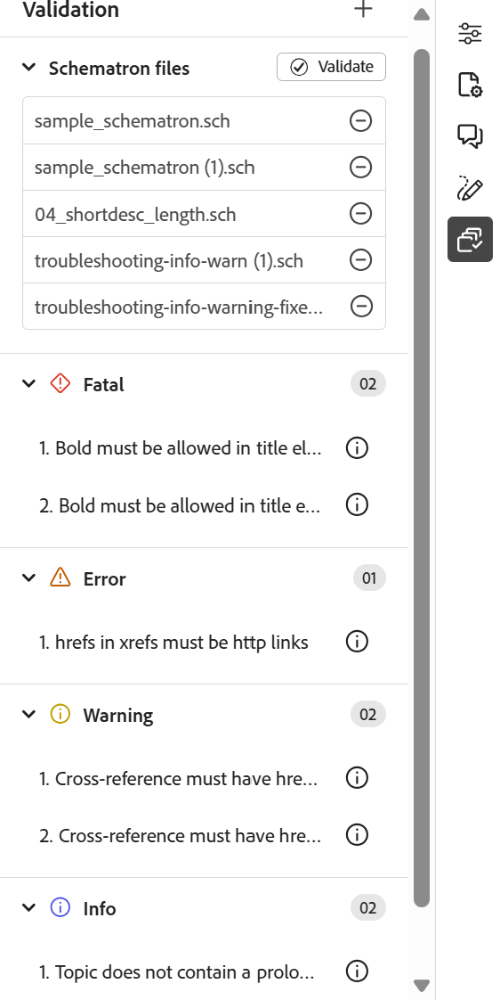

# Supporto per i file Schematron

&quot;Schematron&quot; si riferisce a un linguaggio di convalida basato su regole utilizzato per definire test per un file XML. L&#39;editor supporta i file Schematron. Potete importare i file Schematron e modificarli nell&#39;Editor. Utilizzando un file Schematron è possibile definire determinate regole e quindi convalidarle per un argomento o una mappa DITA.

>[!NOTE]
>
> Editor supporta ISO Schematron.


## Importa file Schematron

Per importare i file Schematron, effettuate le seguenti operazioni:

1. Passare alla cartella desiderata (in cui si desidera caricare i file) nel *repository*.
1. Seleziona l&#39;icona **Opzioni** per aprire il menu di scelta rapida e scegli **Carica risorse**.
1. Nella finestra di dialogo **Carica risorse**, puoi modificare la cartella di destinazione nel campo **Seleziona cartella risorse**.
1. Selezionare **Scegli file** e selezionare i file Schematron. Puoi selezionare uno o più file Schematron, quindi selezionare **Carica**.

## Convalidare un argomento o una mappa DITA con Schematron

Dopo aver importato i file Schematron, potete modificarli nell&#39;Editor. È possibile utilizzare i file Schematron per convalidare gli argomenti o una mappa DITA. Ad esempio, è possibile creare le regole seguenti per una mappa o un argomento DITA:

* Per una mappa DITA viene definito un titolo.
* È stata aggiunta una breve descrizione di una certa lunghezza.
* Deve essere presente almeno un topicref nella mappa.

Quando aprite un argomento nell&#39;editor, a destra viene visualizzato il pannello Convalida schema. Per aggiungere e convalidare un argomento o una mappa con un file Schematron, effettuare le seguenti operazioni:

{width="350" align="left"}

1. Selezionate l&#39;icona Schematron per aprire il pannello Schematron.
1. Utilizzare **Aggiungi file di schema** per aggiungere file di schema.

   >[!NOTE]
   >
   > Quando si aggiunge un file Schematron non valido, nel pannello Convalida viene visualizzato un messaggio di errore.

   {width="350" align="left"}

1. Se il file Schematron non presenta errori, viene aggiunto ed elencato nel pannello Convalida. Viene visualizzato un messaggio di errore per il file Schematron contenente errori.

   >[!NOTE]
   >
   >Per rimuoverla, potete utilizzare l&#39;icona croce accanto al nome del file Schematron.

1. Seleziona **Convalida** per convalidare l&#39;argomento con i file Schematron aggiunti.

   * Se l’argomento non rispetta alcuna regola, viene visualizzato il messaggio di convalida riuscita per il file.
   * Se l&#39;argomento non rispetta una regola, ad esempio se non contiene un titolo ed è convalidato per lo Schematron specificato in precedenza, viene visualizzato un errore di convalida.

   >[!NOTE]
   >
   > I risultati della convalida vengono visualizzati in base all&#39;attributo del ruolo definito nel file Schematron. Per ulteriori dettagli, visualizzare [Informazioni sui risultati della convalida e sui livelli di gravità](#understanding-validation-results-and-serverity-levels).

1. Seleziona il messaggio di errore per evidenziare l’elemento contenente l’errore nell’argomento/mappa aperto.

Il supporto Schematron nell’Editor consente di convalidare i file in base a un set di regole e di mantenere coerenza e correttezza tra gli argomenti.

## Informazioni sui risultati della convalida e sui livelli di gravità

I risultati della convalida vengono visualizzati in base all&#39;attributo del ruolo definito nel file Schematron. I problemi sono classificati come `Fatal`, `Error`, `Warn` o `Info`, con un conteggio visibile per ogni categoria nel pannello Convalida.

{width="350" align="left"}

Per determinare la gravità di un problema, viene valutato il valore _case-senstive_ dell&#39;attributo di ruolo definito nel file Schematron corrispondente.

Lo snippet seguente mostra i valori degli attributi di ruolo supportati definiti in una regola Schematron:

* `<sch:assert role="error" test="@id">Element must have an ID.</sch:assert>`
* `<sch:report role="info" test="not(@alt)">Image should have an alt attribute.</sch:report>`
* `<sch:assert role= "fatal" test="b"> Bold must be there in <sch:name/> element</sch:assert>`
* `<sch:assert role= "warn" test="b"> Recommended formatting is missing in <sch:name/> element</sch:assert>`

Se l&#39;attributo del ruolo non è specificato o se viene utilizzato un valore non supportato, il problema viene classificato come `Error` nel pannello Convalida. Questo comportamento si applica anche ai file Schematron esistenti che non definiscono un attributo di ruolo; in questi casi, tutti i problemi sono raggruppati in `Error`.

**Scenari di salvataggio file**

Il salvataggio di un file dipende dal controllo di convalida **Esegui prima di salvare l&#39;impostazione del file** nelle [impostazioni Workspace](../cs-install-guide/workspace-settings.md#validation):

* Se questa opzione è attivata, non è possibile salvare il file finché i problemi di livello `Fatal` o `Error` non vengono risolti.
* Se l&#39;opzione è disabilitata, i controlli di convalida non vengono eseguiti e i file possono essere salvati anche se sono presenti `Fatal` o `Error` problemi di livello.

## Utilizzare le istruzioni di asserzione e di report per verificare la presenza di regole{#schematron-assert-report}

Experience Manager Guides supporta anche le istruzioni di asserzione e di rapporto in Schematron. Queste istruzioni consentono di convalidare gli argomenti DITA.

### Dichiarazione asserzione

Un’istruzione assert genera un messaggio quando un’istruzione di test restituisce false. Ad esempio, se desideri che il titolo sia in grassetto, puoi definire un’istruzione di asserzione per esso.

```XML
<sch:rule context="title"> 
    <sch:assert test = "b"> Title should be bold </sch:assert>
  </sch:rule>
```

Quando si convalidano gli argomenti DITA con Schematron, viene visualizzato un messaggio per gli argomenti in cui il titolo non è in grassetto.

### Dichiarazione rapporto

Un’istruzione di report genera un messaggio quando un’istruzione di test restituisce true. Ad esempio, se desideri che la descrizione breve sia inferiore o uguale a 150 caratteri, puoi definire un’istruzione di rapporto per verificare gli argomenti in cui la descrizione breve è superiore a 150 caratteri.
Quando si convalidano gli argomenti DITA con Schematron, si ottiene un report completo delle regole in cui l&#39;istruzione report restituisce true. Viene visualizzato un messaggio per gli argomenti in cui la descrizione breve supera i 150 caratteri.


```XML
<sch:rule context="shortdesc"> 
        <sch:let name="characters" value="string-length(.)"/> 
        <sch:report test="$characters &gt; 150">  
        The short description has <sch:value-of select="$characters"/> characters. It should contain more than 150 characters.      
        </sch:report>   
    </sch:rule> 
```

>[!NOTE]
>
> Utilizzare solo espressioni Xpath 2.0 durante la scrittura delle regole Schematron.

## Usa espressioni Regex{#schematron-regex-espressions}

È inoltre possibile utilizzare le espressioni Regex per definire una regola con la funzione matches() e quindi eseguire la convalida utilizzando il file Schematron.

Ad esempio, puoi utilizzarlo per visualizzare un messaggio se il titolo contiene una sola parola.

```XML
<assert test="not(matches(.,'^\w+$'))"> 
No one word titles.
</assert>  
```


## Definire pattern astratti{#schematron-abstract-patterns}

Experience Manager Guides supporta anche i modelli astratti in Schematron. È possibile definire pattern astratti generici riutilizzandoli.  Potete creare parametri segnaposto che specificano il pattern effettivo.


L’utilizzo di modelli astratti può semplificare lo schema Schematron riducendo la duplicazione delle regole e semplificando la gestione e l’aggiornamento della logica di convalida. Può inoltre semplificare la comprensione dello schema, in quanto consente di definire logiche di convalida complesse in un unico modello astratto che può essere riutilizzato in tutto lo schema.


Ad esempio, il codice XML seguente crea un modello astratto a cui fa riferimento il modello effettivo utilizzando l&#39;ID.

```XML
<sch:pattern abstract="true" id="LimitNoOfWords"> 

<sch:rule context="$parentElement"> 

<sch:let name="words" value="string-length(.)"/> 

<sch:assert test="$words &lt; $maxWords"> 

You have <sch:value-of select="$words"/> letters. This should be lesser than <sch:value-of select="$maxWords"/>. 

</sch:assert>  

<sch:assert test="$words &gt; $minWords"> 

You have <sch:value-of select="$words"/> letters. This should be greater than <sch:value-of select="$minWords"/>. 

</sch:assert>  

</sch:rule> 

</sch:pattern> 

<sch:pattern is-a="LimitNoOfWords" id="extend-LimitNoOfWords"> 

<sch:param name="parentElement" value="title"/> 

<param name="minWords" value="1"/> 

<param name="maxWords" value="8"/> 

</sch:pattern> 
```
