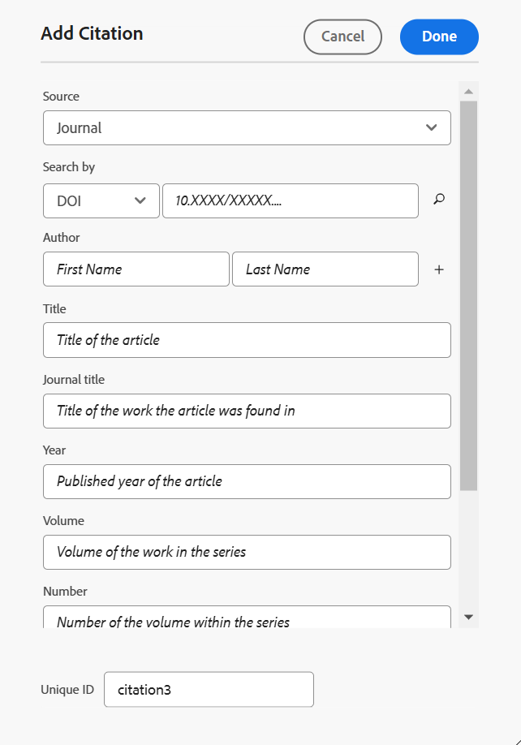
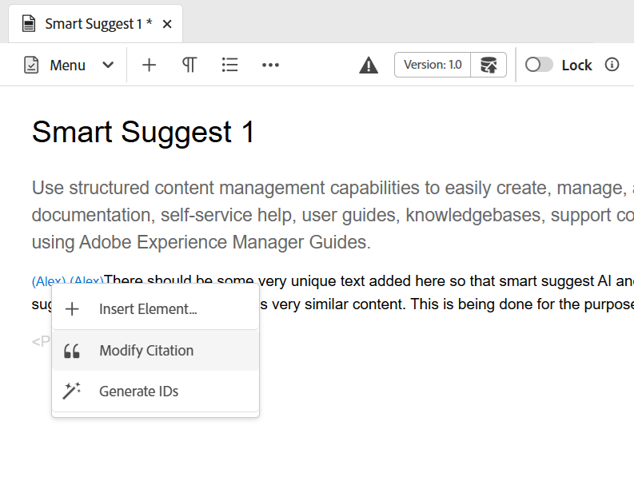

# Aggiungere e gestire le citazioni nel contenuto

Le citazioni sono riferimenti all’origine delle informazioni aggiunte al contenuto. Utilizzando le citazioni, è possibile accreditare gli autori delle informazioni di origine e aiutare i lettori a completare le informazioni di origine. L’aggiunta di citazioni rende il contenuto più affidabile e impedisce il plagio. Consentono inoltre di visualizzare contenuti di alta qualità.

In Adobe Experience Manager Guides, puoi aggiungere e importare citazioni e applicarle al contenuto. È possibile aggiungere queste citazioni da qualsiasi origine di libri, siti Web e giornali.

Experience Manager Guides consente di modificare, visualizzare in anteprima e ordinare le citazioni. Dopo aver aggiunto le citazioni nel contenuto, puoi generare l’output utilizzando PDF nativo. Puoi anche aggiungere la bibliografia o la pagina dei riferimenti nell’output del PDF nativo.

Experience Manager Guides supporta diversi stili di citazioni, come Modern Language Association (MLA), American Psychological Association (APA), Chicago, Institute for Electrical and Electronics Engineers (IEEE) e American Heart Association (AHA). La raccomandazione è di utilizzarli in modo chiaro e coerente.

>[!NOTE]
>
>Attualmente Experience Manager Guides supporta solo PDF nativo per le citazioni.

## Aggiungi citazioni

Per aggiungere le citazioni, effettua le seguenti operazioni:

1. Seleziona l&#39;icona **Citazioni**  nel pannello a sinistra.

   Viene aperto il pannello **Citazioni**.

   {width="350" align="left"}

1. Nel pannello **Citazioni**, seleziona . Dal menu a discesa puoi scegliere di aggiungere una nuova citazione o di importarne una.

1. Seleziona **Nuova citazione** per aggiungere una nuova citazione.

   Viene visualizzata la finestra di dialogo **Aggiungi citazione**.

    {width="300" align="left"}

1. Compila i campi nella finestra di dialogo **Aggiungi citazione**.

   >[!NOTE]
   >
   >Puoi anche aggiungere l’ID ISBN, DOI o PubMed. AEM Guides compila automaticamente gli altri campi.

   | Libro | Sito Web | Diario |
   | --- | ---|---|
   | **Source**   Dall&#39;elenco a discesa, selezionare l&#39;origine della citazione come registro. | **Source**  Selezionare l&#39;origine della citazione come sito Web dall&#39;elenco a discesa. | **Source**   Selezionare l&#39;origine della citazione come diario dal menu a discesa. |
   | **Cerca per**   Seleziona **ISBN** o **DOI** dal menu a discesa per cercare l&#39;ID digitale collegato alla citazione.    DOI: Identificatore oggetto digitale   ISBN: Identificatore univoco registro numerico | **Cerca per**   Seleziona **DOI** dal menu a discesa per cercare l&#39;ID digitale collegato alla citazione. | **Cerca per**   Seleziona **DOI** o ID PubMed dall&#39;elenco a discesa per cercare l&#39;ID digitale collegato alla citazione.      |
   | **Autore**   Aggiungere il nome e il cognome dell&#39;autore della citazione. Selezionare  per aggiungere altri nomi. | **Autore**   Aggiungere il nome e il cognome dell&#39;autore della citazione. Selezionare  per aggiungere altri nomi. | **Autore**   Aggiungere il nome e il cognome dell&#39;autore della citazione. Selezionare  per aggiungere altri nomi. |
   | **Titolo**   Aggiungi il titolo del libro. | **Titolo**   Aggiungi il titolo della pagina Web. | **Titolo**   Aggiungi il titolo dell&#39;articolo. |
   | **Editor**   Aggiungi l&#39;editor del libro. | **Nome sito Web**   Aggiungere il nome del sito Web. | **Titolo diario**   Aggiungi il titolo del lavoro in cui è stato trovato l&#39;articolo. |
   | **Edizione**   Aggiungi l&#39;edizione del libro. | **URL**   Aggiungi il collegamento Web del sito Web per sfogliare il contenuto. | **Anno**   Aggiungi l&#39;anno di pubblicazione dell&#39;articolo. |
   | **Città**   Aggiungi la città della pubblicazione. | **Data di accesso**  Aggiungere la data di accesso al contenuto del sito Web. | **Volume**   Aggiungere il volume del lavoro nella serie. |
   | **Editore**   Aggiungere il nome dell&#39;editore del libro. | **Data pubblicazione**   Aggiungere la data di pubblicazione del contenuto del sito Web. | **Numero**   Aggiungere il numero del volume all&#39;interno della serie. |
   | **Anno**   Aggiungere l&#39;anno di pubblicazione del libro. | **Data aggiornamento**   Aggiungere la data di aggiornamento del contenuto del sito Web. | **Pagine**   Aggiungi il numero di pagina o l&#39;intervallo di pagine in cui è stato trovato l&#39;articolo. |
   | **Versione**   Aggiungi la versione del libro. | **ID univoco**   Aggiungi un ID univoco per la citazione. Un ID univoco è un identificatore univoco della citazione. | **URL**  Aggiungi il collegamento Web al giornale di registrazione. |
   | **Serie**  Aggiungi la serie del libro. |  | **ID univoco**   Aggiungi un ID univoco per la citazione. Un ID univoco è un identificatore univoco per la citazione. |
   | **URL**   Aggiungi il collegamento Web al registro. |
   | **ID univoco**   Aggiungi un ID univoco per la citazione. Un ID univoco è un identificatore univoco della citazione. |

1. Seleziona **Fine**.

   Viene aggiunta una nuova citazione al pannello Citazione.

>[!NOTE]
>
> L’aggiunta di un ID univoco per il campo della citazione è obbligatoria.  Una volta aggiunta la citazione, non è possibile modificare l’ID univoco.

## Importa citazioni

Per importare le citazioni, eseguire la procedura seguente:

1. Nel pannello a sinistra, seleziona **Citazioni** .

   Viene aperto il pannello **Citazioni**.

1. Nel pannello **Citazioni**, seleziona , quindi seleziona **Importa** dal menu a discesa.
1. Sfoglia un file .bib dal tuo sistema e importalo.

   >[!TIP]
   >
   > L&#39;estensione del nome file .bib è un file del database bibliografico BibTeX. Si tratta di un file di testo formattato appositamente che elenca i riferimenti relativi a una particolare fonte di informazioni.

   Una volta importato correttamente il file, potete visualizzare i riferimenti nel pannello delle citazioni.

   >[!NOTE]
   > <ol><li> Experience Manager Guides importa solo le citazioni univoche e non già presenti.
    &gt; <li> Experience Manager Guides può importare citazioni da un libro, un diario o un sito Web. Attualmente non supporta citazioni provenienti da altre fonti.

## Gestire le citazioni

Le citazioni sono ordinate alfabeticamente nel pannello a sinistra. Cercare le citazioni in base alle fonti da utilizzare nell&#39;argomento.

### Filtro

Seleziona l&#39;icona **Filtro**  accanto alla barra di ricerca e seleziona le opzioni di origine dal menu a discesa per filtrare l&#39;elenco delle citazioni. Consente selezioni sia singole che multiple.

* **Tutte le origini**: viene visualizzato un elenco completo delle citazioni, incluse tutte le origini.

* **Libro**: mostra l&#39;elenco delle citazioni provenienti dai libri.

* **Sito Web**: mostra l&#39;elenco delle citazioni provenienti dai siti Web.

* **Diario**: mostra l&#39;elenco delle citazioni originate dai diari.

### Ricerca

Cerca il contenuto nella citazione.

1. Nel pannello a sinistra, seleziona Citazioni.
Viene aperto il pannello **Citazioni**.

1. Utilizzare la barra di ricerca per cercare la citazione appropriata da un elenco lungo.

### Cambia stile citazione {#change-citation-style}

L&#39;amministratore di sistema può modificare lo stile delle citazioni dal menu a discesa **Citazioni** nella scheda **Generale** delle **Impostazioni**.
Questi stili determinano il modo in cui le citazioni vengono visualizzate nel riquadro di anteprima o nell&#39;output PDF nativo.

Nel menu a discesa sono disponibili le seguenti opzioni:

| MLA | APA | Chicago | IEEE | AHA |
|---|---|---|---|---|
| Stile associazione lingua moderna   | Stile associazione psicologica americana | Manuale di stile di Chicago | Stile dell&#39;Institute for Electrical and Electronics Engineers | Stile American Heart Association |
| Esempio:  Crawford, Claire, et al. *Contenuto emotivo di memorie oscure*.Modificato da Memory, vol 16, 2010, Amsterdam. | Esempio:   Crawford, C., J., &amp; , C. (2010). *Contenuto emotivo di memorie oscure* (505-16 ed.). 10,1080/09658210902067289 | Esempio:   Crawford, Claire, et al. *Contenuto emotivo di memorie oscure*. 505-16, 2010. | Esempio:   C. Crawford, J. e C. , *Contenuto emotivo di memorie oscure*. Amsterdam, 2010. | Esempio:   C. Crawford, J. e C. , *Contenuto emotivo di memorie oscure*. Amsterdam, 2010. |

## Modificare una citazione

Per modificare la citazione, effettuare le seguenti operazioni:

1. Passa il puntatore del mouse sul nome della citazione dall’elenco. Selezionare  l&#39;icona **Opzioni**.

1. Seleziona **Modifica**.

Viene visualizzata la finestra di dialogo **Modifica citazione**.

1. Apporta le modifiche necessarie. Seleziona **Fine**.
La citazione selezionata viene modificata.

>[!NOTE]
>
>Una volta aggiunta la citazione, non è possibile modificare l’ID univoco.

## Anteprima di una citazione

Per visualizzare l&#39;anteprima di una citazione, effettuare le seguenti operazioni:

Passa il puntatore del mouse sul nome della citazione dall’elenco. Seleziona     Icona  **Opzioni**.

1. Selezionare **Anteprima**.
È possibile visualizzare in anteprima il contenuto e il formato della citazione nel riquadro di anteprima.

   >[!NOTE]
   >
   >L&#39;anteprima si basa sullo stile di citazione selezionato dall&#39;amministratore nelle **Impostazioni**.

1. Selezionate un punto qualsiasi dello schermo per chiudere la casella di anteprima.

   {width="550" align="left"}

>[!NOTE]
>
> Puoi anche visualizzare in anteprima una citazione inserita in un argomento dall’interfaccia utente di Assets o dalla scheda Anteprima dell’editor.

## Inserisci citazioni

Per inserire citazioni in un argomento, effettuare le seguenti operazioni:
1. Selezionare l&#39;argomento nel pannello del repository, quindi fare doppio clic per aprirlo nella finestra di modifica.
1. Posizionare il cursore nel punto in cui si desidera aggiungere la citazione.

È possibile inserire le citazioni per l&#39;argomento dalla barra degli strumenti principale o dal pannello sinistro.

### Dalla barra degli strumenti principale

1. Selezionare l&#39;icona **Citazioni**  nella barra degli strumenti principale.
1. Nella finestra di dialogo **Citazioni**, scegli la citazione. È inoltre possibile selezionare più citazioni.
   {width="300" align="left"}
1. È possibile filtrare le citazioni digitando i primi alfabeti nel pannello di ricerca della finestra di dialogo **Citazione**.

1. Seleziona **Fine**.
La citazione selezionata viene aggiunta nella posizione del cursore nell&#39;argomento.

### Dal pannello a sinistra

>[!NOTE]
> 
>Per visualizzare l&#39;icona **Citazioni** dal pannello sinistro, l&#39;amministratore di sistema deve abilitare l&#39;opzione **Citazioni** nella scheda **Pannelli** in **Impostazioni**.

1. Seleziona **Citazioni**  nel pannello a sinistra.
1. Trascina la citazione dal pannello **Citazioni** e rilasciala nella posizione appropriata nell&#39;argomento.

   È inoltre possibile selezionare **Inserisci** da  **Opzioni** per inserire una citazione.

   
1. Per selezionare più citazioni, fare clic con il pulsante destro del mouse su una citazione nell&#39;argomento e selezionare **Modifica citazione** dal menu di scelta rapida.
1. Selezionare le citazioni che si desidera inserire dalla finestra di dialogo **citazione**.
1. Seleziona **Fine** per aggiungerli all&#39;argomento.

Dopo aver inserito le citazioni nell&#39;argomento, è possibile visualizzarne l&#39;anteprima nell&#39;editor Web. Puoi anche pubblicare contenuti con citazioni utilizzando il PDF nativo.

## Eliminare una citazione

Potete eliminare una citazione dal pannello Citazioni o da un argomento in cui è stata inserita.

### Eliminare un citazione dal pannello Citazioni

Per eliminare una citazione dal pannello Citazioni, effettuate le seguenti operazioni:

1. Passa il puntatore del mouse sul nome della citazione dall’elenco.
1. Selezionare l&#39;icona  **Opzioni**.
1. Seleziona la   **Elimina** .
Viene visualizzata la finestra di dialogo di conferma.
1. Selezionare **Sì**.
La citazione selezionata viene eliminata dal pannello citazioni.

### Eliminare una citazione da un argomento

Per eliminare una citazione già utilizzata nell&#39;argomento, eseguire la procedura seguente:

Nell&#39;argomento posizionare il cursore alla fine della citazione.

1. Fare clic con il pulsante destro del mouse su una citazione nell&#39;argomento e selezionare **Modifica citazione** dal menu di scelta rapida. Viene visualizzata la finestra di dialogo Citazione.
   

1. È possibile scegliere le citazioni da inserire nel documento.

   >[!NOTE]
   >
   >Le citazioni già utilizzate nell’argomento vengono sostituite con le citazioni selezionate nella finestra di dialogo.

1. Seleziona **Fine**.

## Genera output di contenuto con citazioni

Dopo aver inserito le citazioni nell’argomento, puoi pubblicare il contenuto con le citazioni utilizzando PDF nativo.

Nell’output PDF nativo, le citazioni vengono visualizzate all’interno del contenuto in cui sono state inserite. Puoi anche creare una pagina di bibliografia. Quando selezioni una citazione, vieni reindirizzato alla pagina della bibliografia.

Crea un layout di pagina **Citazioni** nei modelli di PDF e includilo nel documento. Tutte le citazioni utilizzate nel libro vengono elencate in una pagina che appare nell&#39;output di PDF. Per ulteriori informazioni sulla creazione di un layout di pagina, visualizzare [Creare un layout di pagina](../native-pdf/components-pdf-template.md#create-page-layout).

Per modificare la visualizzazione della pagina delle citazioni, visualizzare [Personalizzare i modelli di PDF](../native-pdf/pdf-template.md).

### Applicare lo stile del contenuto a una citazione

Applica la formattazione alla citazione quando viene aggiunta all&#39;argomento.

1. Selezionare **Fogli di stile** nel pannello **Modelli** di un predefinito di output PDF nativo.   Viene aperto il pannello **STILI** che contiene tutte le opzioni di stile.

1. Nel pannello Ricerca, cerca `<cite>`.

Per ulteriori informazioni sugli stili, visualizzare [Utilizzare gli stili di contenuto comuni](../native-pdf/stylesheet.md).
