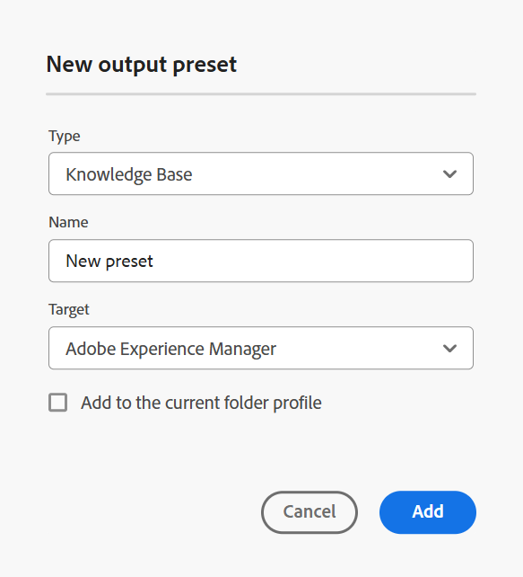

# Creare predefiniti di output per la Knowledge Base dall&#39;editor {#id218CL400JW3}

Per creare predefiniti di output per la mappa DITA, effettuate le seguenti operazioni:

1. Nell’interfaccia utente di Assets, individua il file di mappa da modificare.

1. Per ottenere un blocco esclusivo sul file mappa, selezionare il file mappa e selezionare **Estrai**.

1. Selezionare l&#39;opzione **Modifica argomenti** dal menu Azioni del file di mapping.

   Il file di mappa viene aperto per la modifica nell&#39;editor.

   >[!NOTE]
   >
   > Potete aggiungere o eliminare qualsiasi argomento dalla mappa utilizzando l&#39;Editor mappe avanzato. Per ulteriori dettagli, visualizzare [Utilizzare l&#39;Editor mappe avanzato](map-editor-advanced-map-editor.md#).

1. Seleziona l&#39;icona **Apri nella console delle mappe**. La mappa si apre nella console delle mappe.

1. Passare alla scheda **Predefiniti di output** e selezionare l&#39;icona + per creare un predefinito di output per la mappa DITA.

1. Selezionare **Knowledge Base** dal menu a discesa **Tipo**, immettere il nome e selezionare **Adobe Experience Manager** nella finestra di dialogo **Nuovo predefinito di output**.
1. Selezionare l&#39;opzione **Aggiungi al profilo cartella corrente** per creare un predefinito di output per il profilo cartella corrente. L&#39;icona  indica un predefinito a livello di profilo della cartella.

   Ulteriori informazioni su [Gestire i predefiniti di output globali e del profilo cartella](./web-editor-manage-output-presets.md).

1. Seleziona **Aggiungi**.

   Viene creato il predefinito per la Knowledge Base.

   

Una volta creato il predefinito, è possibile generare l&#39;output per articoli specifici della knowledge base. A tale scopo, passare alla scheda **Articoli** e selezionare gli argomenti per i quali si desidera generare l&#39;output.
1. Seleziona **Genera output** nella parte superiore per generare l&#39;output.

   

1. Nel prompt **Conferma file per la pubblicazione**, selezionare i file da pubblicare e confermare selezionando **Pubblica**.

   

Viene visualizzato lo stato del processo di generazione dell&#39;output. Nella colonna **Argomenti** sono elencati gli argomenti per i quali viene generato l&#39;output mentre nella colonna **Stato** è visualizzato lo stato di pubblicazione di ciascun argomento.

Per visualizzare l&#39;output, chiudere la finestra di dialogo Output generato e selezionare **Visualizza output** nella pagina predefinita.

>[!NOTE]
>
> È inoltre possibile rinominare, duplicare o eliminare un predefinito di output esistente dal menu Opzioni.

**Argomento padre:**[ Pubblicazione basata su articolo dall&#39;editor](web-editor-article-publishing.md)
