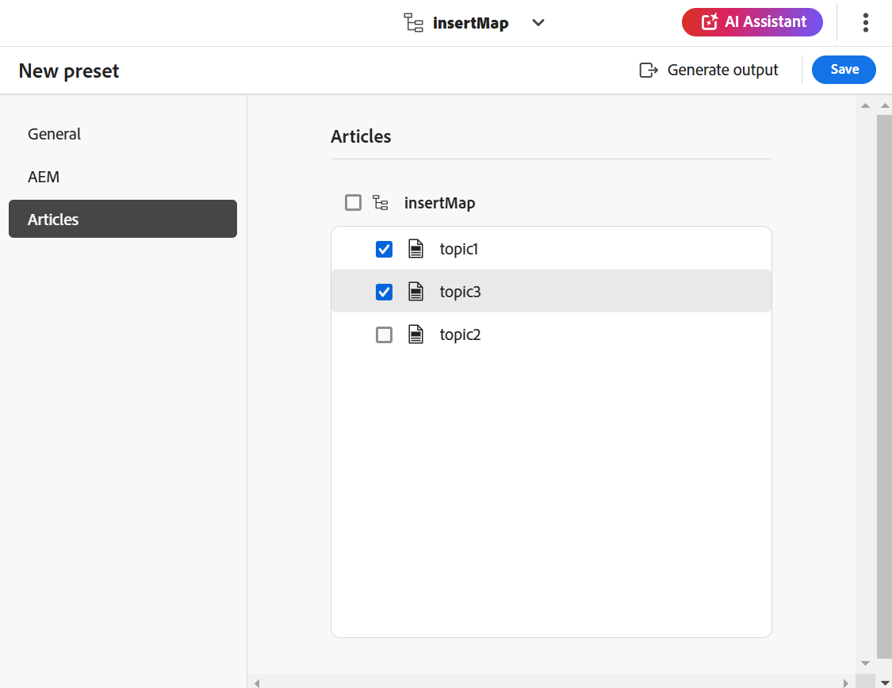

# Creare predefiniti di output dall’editor web {#id218CL400JW3}

Per creare predefiniti di output per la mappa DITA, effettuate le seguenti operazioni:

1. Nell’interfaccia utente Assets, individua il file di mappa da modificare.

1. Per ottenere un blocco esclusivo sul file mappa, selezionare il file mappa e fare clic su **Estrai**.

1. Seleziona la **Modifica argomenti** dal menu azione del file mappa.

   Il file mappa viene aperto per la modifica nell&#39;editor Web.

   >[!NOTE]
   >
   > Potete aggiungere o eliminare qualsiasi argomento dalla mappa utilizzando l&#39;Editor mappe avanzato. Per ulteriori dettagli, consulta [Utilizzare l’Editor di mappe avanzato](map-editor-advanced-map-editor.md#).

1. In **Output** , selezionare l&#39;icona + per creare un predefinito di output per la mappa DITA.

   {width="350" align="left"}

1. Immettete il nome del predefinito nella finestra di dialogo Aggiungi predefinito, quindi fate clic su **Aggiungi**.

1. Immetti i seguenti dettagli di configurazione.

   1. Seleziona le opzioni richieste in **Generale** scheda. Potete scegliere di creare un predefinito di output con o senza condizioni. È inoltre possibile utilizzare un file DITVAL. Le guide AEM consentono inoltre di selezionare una baseline per la pubblicazione di una versione specifica della mappa DITA.
   1. Immetti i dettagli del sito AEM in **AEM** scheda. **Sito** visualizza l’elenco dell’AEM Sites disponibile nell’archivio AEM. **Categoria**, **Modello sezione**, e **Modello articolo** sono i componenti strutturali utilizzati per organizzare l’aspetto dell’output. Sono predefiniti nel modello del sito AEM.

      >[!NOTE]
      >
      > Aggiorna ciascun menu a discesa per ottenere l’ulteriore classificazione nel menu a discesa successivo.

   1. Dalla sezione **Articoli** , selezionare gli argomenti per i quali si desidera generare l&#39;output.
1. Seleziona la **Genera predefinito** nella parte superiore per generare l’output.

   {width="800" align="left"}

1. Viene visualizzato lo stato del processo di generazione dell’output. Il **Argomenti** nella colonna sono elencati gli argomenti per i quali viene generato l&#39;output durante la **Stato** In questa colonna viene visualizzato lo stato di pubblicazione di ciascun argomento.

   Per visualizzare l&#39;output, posizionare il puntatore del mouse sull&#39;argomento e fare clic su Visualizza output.

   {width="800" align="left"}

>[!NOTE]
>
> Potete anche modificare, rinominare, duplicare o eliminare un predefinito di output esistente dal menu Opzioni (Options).

{width="550" align="left"}

**Argomento padre:**[ Pubblicazione basata su articolo dall’editor web](web-editor-article-publishing.md)
