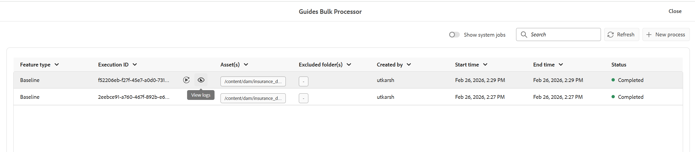

# Nuova linea di base (Beta) in Experience Manager Guides

>[!NOTE]
>
> Questo articolo si applica alla nuova linea di base , attualmente disponibile come funzionalità *Beta*, che offre prestazioni e stabilità migliorate disponibili con la versione 2026.03.0 di Experience Manager Guides. Per abilitare la nuova funzione di base nella configurazione, contatta il team Customer Success.

La nuova funzione di base affronta i problemi critici di affidabilità e prestazioni associati a mappe grandi e complesse. Viene fornito con un’architettura di base riprogettata che offre un’esperienza di base più veloce, più stabile e più coerente.

Il nuovo modello di base rafforza la gestione della linea di base affrontando i punti critici comuni:

- Caricamento lento e scarsa reattività quando si utilizzano linee di base di grandi dimensioni
- Stati della linea di base incoerenti causati da aggiornamenti parziali o convalide non riuscite
- Visibilità e controllo limitati nella gestione di contenuti di base estesi
- Colli di bottiglia delle prestazioni durante la creazione della linea di base, gli aggiornamenti o le ricostruzioni

Le sezioni seguenti descrivono il nuovo modello di base, inclusi i miglioramenti introdotti, le modifiche di comportamento chiave da considerare prima della migrazione e le istruzioni per la migrazione a e l’utilizzo della nuova linea di base:

- [Miglioramenti principali introdotti nella nuova linea di base](#key-enhancements-introduced-in-the-new-baseline)
- [Il comportamento cambia da sapere prima di migrare alla nuova linea di base](#behavior-changes-to-know-before-migrating-to-the-new-baseline)
- [Migra alla nuova linea di base](#migrate-to-new-baseline)
- [Utilizza la nuova linea di base](#use-the-new-baseline)

## Miglioramenti principali introdotti nella nuova linea di base

La nuova linea di base introduce miglioramenti significativi che rendono la gestione della linea di base più rapida e semplice da scalare senza modificare il modo di lavorare. Prendere in considerazione il passaggio alla nuova linea di base per:

- **Prestazioni e scalabilità migliorate:** Il modello dati della linea di base e il comportamento di rendering sono stati ottimizzati per adattarsi in modo efficiente a linee di base di grandi dimensioni, utilizzando un caricamento incrementale e una struttura dati semplificata per migliorare la reattività.
- **Interfaccia utente e coerenza back-end più solide:** Qualsiasi modifica apportata a una linea di base (ad esempio aggiornamenti della versione o delle dipendenze) ora viene applicata nell&#39;interfaccia utente solo dopo la convalida back-end riuscita, impedendo la creazione di linee di base non valide.
- **Filtro, ordinamento e navigazione:** Le baseline supportano il filtraggio completo tra più attributi, inclusi lo stato del documento, le etichette, il tipo di file, il tipo di riferimento e la ricerca basata su GUID nell&#39;intera baseline. L’impaginazione è supportata per le linee di base di grandi dimensioni, con un’opzione per includere file privi di etichette.
- **Viene visualizzata un&#39;anteprima dell&#39;impatto della dipendenza:** L&#39;impatto della dipendenza (per le dipendenze aggiunte o rimosse) prima dell&#39;applicazione delle modifiche alla versione, consentendo di esaminare le modifiche prima di applicarle.
- **Gestione più flessibile delle etichette:** Le etichette possono essere spostate tra le versioni all&#39;interno di una linea di base, fornendo maggiore flessibilità durante la gestione delle etichette tra diverse versioni dell&#39;argomento.
- **Comportamento deterministico di modifica e salvataggio:** le modifiche della linea di base supportano gli aggiornamenti a livello di riga, caricano i dati a uso intensivo di risorse (ad esempio gli alberi delle versioni e le differenze di dipendenza) solo durante gli aggiornamenti delle versioni e completano le operazioni di salvataggio in modo deterministico in un unico passaggio, riducendo gli errori di salvataggio imprevisti e gli aggiornamenti parziali.
- **Creazione della linea di base più affidabile:** le linee di base vengono create utilizzando dati di riferimento archiviati anziché l&#39;analisi in fase di esecuzione. Le informazioni sulla versione richieste vengono convalidate in anticipo per evitare linee di base incomplete o non valide.
- **Supporto API e automazione:** Il nuovo modello di base è completamente supportato tramite le API REST e Java SDK, consentendo l&#39;automazione e l&#39;integrazione con i flussi di lavoro esterni.

## Il comportamento cambia da sapere prima di migrare alla nuova linea di base

Prima di eseguire la migrazione al nuovo modello della linea di base, esaminare le seguenti modifiche di comportamento. Queste modifiche influiscono sul modo in cui vengono create, aggiornate e gestite le linee di base e possono influenzare i flussi di lavoro esistenti.

| Area | Modifica (descrizione) |
|------|-------------|
| **Risoluzione riferimento** | I riferimenti a mappe dirette sono classificati come **DIRETTI**. I riferimenti non validi vengono ignorati e i riferimenti da `reltable` continuano a essere esclusi. |
| **Scegli automaticamente** | La selezione della versione viene valutata immediatamente prima della risoluzione dei riferimenti diretti, garantendo una risoluzione accurata della versione. |
| **Regole di creazione della linea di base** | Versione **1.0** obbligatoria. Le linee di base con versioni mancanti o ambigue possono risolversi in modo diverso dopo la migrazione. |
| **Gestione della migrazione** | I riferimenti non validi vengono ignorati. **I riferimenti DIRETTI** hanno la precedenza, i riferimenti non bloccati vengono spostati alla versione più recente e metadati aggiuntivi vengono aggiunti dalla versione **5.0** in poi. |
| **Modello dati di base** | Il nuovo modello di baseline basato su grafico rimuove i campi mutabili e non è compatibile con le versioni precedenti del modello di baseline precedente. |
| **Utilizzo API** | Le operazioni della linea di base sono supportate tramite API REST e Java SDK. Gli oggetti della linea di base non elaborati non sono più esposti. |
| **Eliminazione versione** | Dopo la migrazione, l’eliminazione della versione considera solo le baseline memorizzate nel nuovo archivio della baseline. |

## Migra a nuova linea di base

Dopo aver abilitato la funzione dal team Customer Success, devi migrare le linee di base esistenti alla nuova linea di base.

Per migrare la baseline esistente alla nuova baseline, effettuare le seguenti operazioni.

1. Seleziona il logo Adobe Experience Manager nella parte superiore e scegli **Strumenti**.
1. Nel pannello **Strumenti** seleziona **Guide**.
1. Selezionare il riquadro **Processore di massa**.

   {align="left"}

   Viene visualizzata la pagina **Guide per il processore in blocco**.

1. Seleziona **Nuovo processo** dall&#39;angolo superiore destro della pagina per avviare una nuova attività di elaborazione.

   Viene visualizzata la finestra di dialogo **Nuovo processo**.

1. Fornisci i seguenti dettagli nella finestra di dialogo:

   1. **Tipo di funzionalità**: seleziona **Linea di base** dal menu a discesa.
   1. **Selezionare cartelle e file**: spostarsi e scegliere una o più cartelle e file da elaborare.
   1. **Selezionare le cartelle da ignorare**: è possibile selezionare sottocartelle all&#39;interno della cartella principale selezionata da escludere dalla migrazione.

   {align="left"}

1. Seleziona **Crea**.

Viene visualizzato un pop-up che mostra **Elaborazione risorsa attivata correttamente**. Puoi visualizzare lo stato dell’attività di elaborazione nella pagina.

Puoi anche selezionare **Visualizza registri** per controllare e scaricare i registri per l&#39;attività di migrazione.

{align="left"}

Il rapporto del registro fornisce dettagli sulla migrazione, tra cui il numero di mappe migrate, le linee di base migrate correttamente e i dettagli correlati.

{align="left"}

>[!NOTE]
>
> Durante la migrazione, in particolare nelle copie di lavoro, non deve essere apportata alcuna modifica della linea di base per evitare errori. Dopo la migrazione, alcune linee di base potrebbero richiedere la ricostruzione se mancano delle versioni.

## Utilizza la nuova linea di base

Il nuovo modello di baseline utilizza gli stessi flussi di lavoro e la stessa interfaccia utente della feature di baseline esistente in Experience Manager Guides. Puoi continuare a [Creare e gestire la linea di base dalla console Mappa](./web-editor-baseline.md) utilizzando le opzioni disponibili.

>[!NOTE]
>
> Il nuovo modello di baseline non supporta la creazione e la gestione delle baseline dal dashboard Mappa (Map).

In questa sezione vengono descritte solo le modifiche e i miglioramenti introdotti con il nuovo modello di base. I flussi di lavoro della linea di base comuni rimangono invariati, a meno che non vengano esplicitamente menzionati.

**Opzioni nuove/migliorate disponibili nella nuova interfaccia utente della linea di base**

I seguenti aggiornamenti si applicano quando si lavora con le linee di base create utilizzando il **nuovo modello di base**:

- L&#39;opzione **Esporta previsione** nel menu Opzioni viene rinominata in **Scarica** per le previsioni create utilizzando aggiornamenti manuali e automatici.

  

- Le baseline dinamiche possono essere aperte direttamente dal pannello **Baseline** e gestite tramite le azioni disponibili nel menu Opzioni.

  

  È inoltre possibile utilizzare le nuove opzioni introdotte per le baseline dinamiche create utilizzando il nuovo modello di baseline:
   - **Modifica proprietà**: consente di modificare le proprietà di una baseline esistente.
   - **Rigenera**: consente di rigenerare una baseline dinamica ogni volta che si verificano modifiche.

     {align="left"}

- L&#39;azione **Download** supporta i download impaginati. Tutto il contenuto della linea di base che corrisponde ai filtri applicati viene incluso nel download, non solo il contenuto visibile nella pagina corrente.
- Filtra i file in base al GUID, oltre ai nomi dei file o alla posizione dei file. È inoltre disponibile un&#39;opzione aggiuntiva per **Filtrare i file senza etichette**.

  
- Il nuovo modello della linea di base supporta la modifica deterministica, che consente di aggiornare un riferimento alla volta con una risoluzione di dipendenza convalidata.

  +++Passaggi per modificare i riferimenti di una nuova linea di base

  Per apportare modifiche a una baseline, effettuare le seguenti operazioni:

   - Aprire la baseline dal pannello **Baseline**.

     Viene visualizzata la vista tabulare dei riferimenti delle linee di base.

   - Passa il puntatore del mouse sul file da modificare.
   - Seleziona l&#39;icona **Modifica**.

     {align="left"}

     Viene visualizzata la finestra di dialogo **Modifica versione**.
   - Seleziona la versione richiesta dal menu a discesa **Versione** (ad esempio, passa dalla versione 1.0 alla versione 1.1).

     {align="left"}

     Le dipendenze aggiunte e rimosse vengono valutate e visualizzate in anteprima. Rivedi le modifiche prima di applicarle.

     

     Se non viene rilevata alcuna modifica della dipendenza, viene visualizzato un messaggio di stato vuoto.

   - Seleziona **Aggiorna** per applicare le modifiche.

  La linea di base viene aggiornata con la versione selezionata.
  +++
