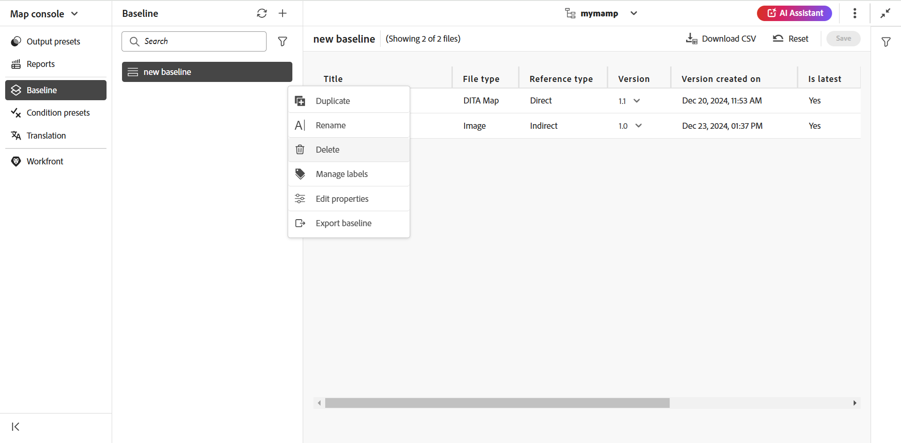

# Creare e gestire le linee di base dalla console Mappa {#id223MB0ZF043}

La funzione Baseline consente di creare una versione degli argomenti e delle risorse che può essere utilizzata per la pubblicazione o la traduzione. Se ad esempio la mappa DITA contiene `topicA` e `imageA`, è possibile creare una baseline per utilizzare la terza versione di `topicA`, ma la quarta versione di `ImageA`. Dopo aver impostato una baseline, è possibile pubblicare o tradurre argomenti di versioni diverse in un unico passaggio.

La selezione di una baseline è facoltativa per i predefiniti di output e una mappa DITA può avere più di una baseline. Tuttavia, ogni predefinito di output all&#39;interno di una mappa DITA può essere associato a una sola baseline. Se al momento della pubblicazione non è specificata alcuna linea di base, l’output viene pubblicato utilizzando la versione più recente del contenuto.

Allo stesso modo, la selezione di una linea di base per tradurre il contenuto è facoltativa. Tuttavia, se si sceglie di tradurre il contenuto utilizzando una baseline, il contenuto della baseline viene salvato insieme alle copie tradotte. Puoi quindi utilizzare la linea di base tradotta per eseguire ulteriori operazioni, come condividerla con editori esterni o archiviarla.

>[!TIP]
>
> Si consiglia di utilizzare questa funzione della linea di base dalla console Mappa. Tuttavia, puoi anche [utilizzare il dashboard delle mappe per creare e gestire le linee di base](./generate-output-use-baseline-for-publishing.md).

Nella scheda **Previsione** è possibile eseguire le azioni seguenti:

- [Creare una baseline](#create-a-baseline)
- [Gestisci linee di base](#manage-baselines)

## Creare una baseline

Puoi creare una baseline dalla console Mappa eseguendo i seguenti passaggi:

1. [Aprire il file mappa DITA nella console Mappa](./open-files-map-console.md).
1. Passa alla scheda **Previsione** e seleziona l&#39;icona + in alto a destra per iniziare a creare una previsione.
1. Nella finestra di dialogo **Nuova linea di base**, fornisci i dettagli seguenti:

   {width="500" align="left"}

   - Immettere un nome per la previsione nel campo **Nome**.
   - In **Configurazione**, scegliere [Aggiornamento manuale](#configuring-baseline-for-manual-update) o [Aggiornamento automatico](#configuring-baseline-for-automatic-update).
   - Selezionare **Applica**.

Viene creata la baseline. La creazione della linea di base avviene in modo asincrono, quindi puoi continuare a lavorare su altri file. Una volta creata la baseline, viene visualizzato un messaggio a comparsa che conferma la creazione della baseline e viene visualizzata una notifica della casella in entrata per la baseline.

### Configurazione della baseline per l&#39;aggiornamento manuale

È possibile creare manualmente una baseline statica con una versione specifica degli argomenti e del contenuto di riferimento disponibile in una data e un&#39;ora specifiche oppure con un&#39;etichetta definita per una versione degli argomenti:

In **Selezionare la versione basata su,** selezionare una delle opzioni seguenti:

- **Data**: seleziona la versione degli argomenti in base alla data e all&#39;ora specificate.
- **Etichetta**: selezionare questa opzione per scegliere gli argomenti in base all&#39;etichetta ad essi applicata. Se per gli argomenti sono specificate etichette, queste sono elencate nel menu a discesa. È possibile scegliere un&#39;etichetta dall&#39;elenco. È inoltre possibile aggiungere un&#39;etichetta nella casella di testo.

  >[!NOTE]
  >
  > Quando si selezionano le etichette, il caricatore delle etichette rimane visibile finché tutte le etichette non vengono recuperate e caricate completamente. Una volta caricate, le etichette vengono visualizzate in ordine alfabetico senza distinzione tra maiuscole e minuscole. Vengono recuperati in batch di 20, con scorrimento infinito abilitato nel menu a discesa per caricare batch aggiuntivi durante lo scorrimento.

  Per i riferimenti diretti nelle linee di base statiche, le etichette vengono estratte dall’ultima versione salvata della mappa. Ad esempio, se sono state create le etichette `Label Release 1.0` e `Label Release 1.1` per le versioni 1.0 e 1.1 dell&#39;Argomento A e quindi si aggiunge l&#39;Argomento A alla mappa salvata come versione 1.0. In questo caso, è possibile visualizzare le etichette `Label Release 1.0` e `Label Release 1.1` nel menu a discesa per le etichette della linea di base statica.

  Quando selezioni **Etichetta,** puoi scegliere i riferimenti diretti e indiretti.
   - Per i riferimenti diretti all&#39;interno della mappa DITA, è possibile utilizzare la versione più recente degli argomenti a cui non è stata applicata l&#39;etichetta specificata.

     >[!NOTE]
     >
     > Se si immette un&#39;etichetta che non esiste e si seleziona l&#39;opzione **Non creare una baseline**, la creazione della baseline non riesce e viene visualizzato un messaggio di errore accanto al nome della baseline nel pannello Baseline.

   - Per i riferimenti indiretti all&#39;interno della mappa DITA, è disponibile un&#39;opzione aggiuntiva che consente di utilizzare la versione più recente degli argomenti a cui non è applicata l&#39;etichetta specificata. Puoi anche scegliere di **selezionare automaticamente** per il contenuto a cui si fa riferimento e il sistema seleziona automaticamente la versione del contenuto a cui si fa riferimento corrispondente alla versione del contenuto a cui si fa riferimento.

Dopo aver selezionato un&#39;etichetta o una versione come alla data, tutti gli argomenti e i file multimediali a cui si fa riferimento nella mappa vengono selezionati di conseguenza. Questa selezione di argomenti non viene visualizzata nell&#39;interfaccia utente, ma viene salvata nel back-end.

### Configurazione della baseline per l&#39;aggiornamento automatico

Selezionate questa opzione per la creazione della baseline per scegliere automaticamente gli argomenti in base all&#39;etichetta ad essi applicata.

Le baseline create mediante la configurazione di aggiornamento automatico vengono aggiornate in modo dinamico. Se si genera una baseline, si scarica una baseline o si crea un progetto di traduzione utilizzando una baseline, i file vengono selezionati in modo dinamico in base alle etichette aggiornate. Ad esempio, se è stata utilizzata la versione 1.2 di un argomento con Label Release 1.0 per la baseline e successivamente è stata aggiornata la versione 1.5 con Label Release 1.0, la baseline verrà aggiornata dinamicamente e verrà utilizzata la versione 1.5.

{width="300" align="left"}

- **Etichette**: se per gli argomenti sono state specificate etichette, utilizzare il menu a discesa **Etichette** per scegliere tra le [etichette elencate](#labels-list).

  Alle etichette selezionate per prime viene assegnata una priorità maggiore rispetto a quelle successive.

  >[!NOTE]
  >
  >Quando le etichette vengono estratte, viene visualizzato un caricatore e il menu a discesa è disattivato.

  Per le baseline dinamiche, le etichette vengono estratte dall&#39;ultima versione salvata e dalla copia di lavoro corrente della mappa. Ad esempio, se hai creato le etichette   `Label Release A.1.0 ` e `Label Release A.1.1` per le versioni 1.0 e 1.1 dell&#39;Argomento A ed etichette `Label Release B.1.0` e `Label Release B.1.1` per le versioni 1.0 e 1.1 dell&#39;Argomento B. È quindi possibile aggiungere l&#39;argomento A alla mappa A nella versione 1.0 e l&#39;argomento B alla mappa A nella versione 1.0* (copia di lavoro). In questo caso, è possibile visualizzare `Label Release A.1.0 `, `Label Release A.1.1`, `Label Release B.1.0` e `Label Release B.1.1` nel menu a discesa delle etichette della linea di base dinamica.
- **Riferimenti indiretti**: per i riferimenti indiretti all&#39;interno della mappa DITA, sono disponibili le seguenti opzioni:

   - **Scegli automaticamente**: puoi scegliere di **Scegli automaticamente** per il contenuto a cui si fa riferimento e il sistema seleziona automaticamente la versione del contenuto a cui si fa riferimento corrispondente alla versione del contenuto a cui si fa riferimento.
   - **Usa etichetta selezionata**: è possibile creare una baseline con l&#39;etichetta selezionata definita per una versione degli argomenti.
   - **Utilizzare la versione più recente o la copia di lavoro**: utilizzare la versione più recente degli argomenti a cui non è stata applicata l&#39;etichetta specificata oppure, se non è stata creata alcuna versione, utilizzare la copia di lavoro degli argomenti per creare la baseline.

## Gestisci linee di base

Potete gestire le baseline esistenti utilizzando le varie funzioni del dashboard Baseline.

- Potete cercare una baseline esistente utilizzando la casella di testo nel pannello Baseline. Utilizzare l&#39;icona **Applica filtro** per visualizzare tutte le baseline o elencarle con lo stato di creazione Completato, In corso o Non riuscito.
- Utilizzare l&#39;icona **Aggiorna** nel pannello Baseline per verificare nuovamente tutte le baseline e visualizzare un nuovo elenco di baseline per la mappa DITA aperta nella vista Mappa.
- Selezionare la baseline per visualizzare o modificare il contenuto di una baseline statica esistente nel pannello **Baseline**. Nella finestra di modifica della baseline vengono visualizzati il file di mappa DITA, il contenuto o gli argomenti della mappa e il contenuto di riferimento.

  >[!NOTE]
  >
  >L&#39;operazione di modifica per le baseline statiche è consigliata solo per un numero limitato di modifiche di riferimento. L&#39;operazione di modifica non è consigliata per modificare la versione della mappa DITA principale in quanto deve ricalcolare tutti i riferimenti. Ciò potrebbe causare un errore di aggiornamento della linea di base per le mappe DITA di grandi dimensioni. Per le mappe DITA più grandi, potete creare una nuova linea di base o modificarne le proprietà.
  >
  >L&#39;operazione di modifica in caso di baseline dinamica consente di modificare le proprietà della baseline in quanto i riferimenti per le baseline dinamiche vengono generati in fase di esecuzione utilizzando le etichette.

  {width="500" align="left"}

### Azioni disponibili per una baseline esistente

È inoltre possibile eseguire le operazioni riportate di seguito sulla baseline dal menu Opzioni.

**Duplicare una baseline**

È possibile duplicare una baseline e modificarla in base alle proprie esigenze.

{width="300" align="left"}
*Duplicare una baseline in base a un&#39;etichetta o creare una copia esatta.*

1. Selezionare **Duplica** dal menu Opzioni di una baseline. Viene visualizzata la finestra di dialogo **Duplica baseline**.
>[!NOTE]
>
>Il nome predefinito della baseline è `<selected baseline name>`_suffix (come sample-baseline_1). Puoi modificare il nome in base alle tue esigenze.

   In **Seleziona la versione basata su**, puoi scegliere l&#39;opzione **Copia esatta** o l&#39;opzione **Etichetta**:

   - **Copia esatta**: Experience Manager Guides seleziona la stessa versione di tutti gli argomenti e crea una copia esatta della baseline duplicata.
   - **Etichetta**: utilizzando il menu a discesa, puoi scegliere una delle [etichette elencate](#labels-list). Experience Manager Guides seleziona le versioni degli argomenti con l’etichetta selezionata definita per esse, mentre per gli argomenti rimanenti seleziona la versione dalla linea di base duplicata. Se ad esempio si seleziona l&#39;etichetta `Release 1.0` dal menu a discesa, verranno selezionate le versioni degli argomenti per cui è stata definita l&#39;etichetta. Per tutti gli altri argomenti, seleziona la versione dalla baseline duplicata.
1. Seleziona **Duplica**.

- **Rinomina** o **Elimina** una baseline esistente**.
- **Gestisci le etichette** che ti consentono di aggiungere, rimuovere o modificare le etichette esistenti per le baseline statiche. Se l’amministratore ha configurato delle etichette predefinite, queste vengono visualizzate nell’elenco a discesa Aggiungi etichetta. Per ulteriori informazioni sull&#39;aggiunta di etichette, visualizzare [Usa etichette](web-editor-use-label.md#).

  >[!NOTE]
  >
  > Il processo di aggiunta o rimozione delle etichette viene eseguito in modo asincrono, quindi puoi continuare a lavorare su altri file. Una volta aggiunta o rimossa l’etichetta, viene visualizzato un messaggio a comparsa che conferma che l’etichetta è stata aggiunta o rimossa e che si riceve anche una notifica nella casella in entrata per la stessa etichetta.

- **Modificare le proprietà** di una baseline statica esistente impostata durante la creazione della baseline.
- L&#39;opzione **Esporta baseline** esporta uno snapshot della baseline nel file di Microsoft Excel, inclusi tutti i dettagli essenziali quali titolo, nome file, tipo di file, numero di versione, stato del documento e altre informazioni rilevanti.

### Elenco delle etichette {#labels-list}

Le etichette elencate nel menu a discesa si basano sui seguenti criteri:
- Le etichette devono essere aggiunte a una delle versioni degli argomenti nella mappa DITA (in cui viene creata la linea di base).
- Per la selezione delle etichette vengono considerati solo i riferimenti di primo livello (argomenti o mappe secondarie) della mappa DITA.

## Filtri della linea di base

Utilizzando l&#39;icona Filtri nel pannello **Filtri linea di base** è possibile applicare filtri alla linea di base aperta nella finestra di modifica della linea di base:

{width="300" align="left"}

- Filtra i file in base ai nomi o alla posizione.
- Filtrare i file in base ai valori per colonne diverse, ad esempio Tipo file, Tipo riferimento e così via.
- Scegliere le colonne da visualizzare nella finestra di modifica della baseline.

>[!NOTE]
>
> È possibile selezionare un&#39;intestazione di colonna e ordinare i file in base alle colonne nella finestra di modifica della baseline.

**Salvare o reimpostare una baseline**

Dopo aver modificato la baseline, selezionare **Salva** per salvare le modifiche. È possibile selezionare **Reimposta** se non si desidera salvare la modifica e reimpostare la previsione. Quando si seleziona **Reimposta**, viene visualizzato un avviso che segnala la perdita delle modifiche non salvate.

**Argomento padre:**[ Generazione output](generate-output.md)

