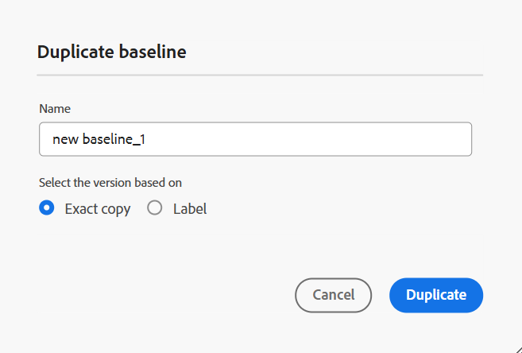

# Creare e gestire le baseline dall&#39;editor Web {#id223MB0ZF043}

>[!TIP]
>
> Si consiglia di utilizzare questa funzione della linea di base dell’editor web se è stato effettuato l’aggiornamento alla versione di marzo as a Cloud Service delle guide AEM o successiva.

Le guide AEM forniscono la funzione Baseline integrata nell’editor web che consente agli utenti di creare linee di base e utilizzarle per pubblicare o tradurre argomenti di versioni diverse. Possono inoltre pubblicare in parallelo più predefiniti di output della stessa mappa DITA.

## Creare una baseline

È possibile creare una baseline dall&#39;editor Web eseguendo le operazioni riportate di seguito.

1. Nel pannello Repository, aprire il file mappa DITA in Vista mappa.
1. Fai clic su **Gestisci** scheda. Il **Linea di base** Nel pannello vengono visualizzate le linee di base della mappa DITA.

   {width="800" align="left"}

1. Il giorno **Linea di base** per iniziare a creare una baseline, seleziona l’icona + in alto a destra.
1. Immettere un nome per la baseline in **Nome**.
1. In entrata **Configurazione**, puoi scegliere **Aggiornamento manuale** opzione o **Aggiornamento automatico** opzione:

   **Aggiornamento manuale**: è possibile creare manualmente una linea di base statica con una versione specifica degli argomenti e del contenuto di riferimento disponibile in una data e un&#39;ora specifiche oppure con un&#39;etichetta definita per una versione degli argomenti:

   - In entrata **Seleziona la versione in base a,** selezionare una delle opzioni seguenti:

      1. **Data** &lt;time stamp=&quot;&quot;>: seleziona la versione degli argomenti in base alla data e all’ora specificate.
      1. **Etichetta**: seleziona questa opzione per scegliere gli argomenti in base all’etichetta ad essi applicata. Se per gli argomenti sono specificate etichette, queste sono elencate nel menu a discesa. È possibile scegliere un&#39;etichetta dall&#39;elenco. È inoltre possibile aggiungere un&#39;etichetta nella casella di testo.

         Per i riferimenti diretti nelle linee di base statiche, le etichette vengono estratte dall’ultima versione salvata della mappa. Ad esempio, se hai creato le etichette `Label Release 1.0` e `Label Release 1.1` per le versioni 1.0 e 1.1 dell’Argomento A, quindi aggiungi l’Argomento A alla mappa salvata come versione 1.0. In questo caso, è possibile visualizzare le etichette `Label Release 1.0` e `Label Release 1.1` nel menu a discesa per le etichette della linea di base statica.

         Quando selezioni **Etichetta** potete scegliere i riferimenti diretti e indiretti.
         - Per i riferimenti diretti all&#39;interno della mappa DITA, è possibile utilizzare la versione più recente degli argomenti a cui non è stata applicata l&#39;etichetta specificata.

           >[!NOTE]
           >
           > Se si immette un&#39;etichetta che non esiste e si seleziona l&#39;opzione **Non creare una baseline** la creazione della baseline ha esito negativo e viene visualizzato un messaggio di errore accanto al nome della baseline nel pannello Baseline.

         - Per i riferimenti indiretti all&#39;interno della mappa DITA, è disponibile un&#39;opzione aggiuntiva che consente di utilizzare la versione più recente degli argomenti a cui non è applicata l&#39;etichetta specificata. Puoi anche scegliere di **Scegli automaticamente** per il contenuto a cui si fa riferimento e il sistema seleziona automaticamente la versione del contenuto a cui si fa riferimento corrispondente alla versione del contenuto in cui viene fatto riferimento.

         Dopo aver selezionato un&#39;etichetta o una versione come alla data, tutti gli argomenti e i file multimediali a cui si fa riferimento nella mappa vengono selezionati di conseguenza. Questa selezione di argomenti non viene visualizzata nell&#39;interfaccia utente, ma viene salvata nel back-end.

   **Aggiornamento automatico**: selezionare questa opzione per la creazione della linea di base per scegliere automaticamente gli argomenti in base all&#39;etichetta ad essi applicata.

   Le baseline create mediante la configurazione di aggiornamento automatico vengono aggiornate in modo dinamico. Se si genera una baseline, si scarica una baseline o si crea un progetto di traduzione utilizzando una baseline, i file vengono selezionati in modo dinamico in base alle etichette aggiornate. Ad esempio, se è stata utilizzata la versione 1.2 di un argomento con Label Release 1.0 per la baseline e successivamente è stata aggiornata la versione 1.5 con Label Release 1.0, la baseline verrà aggiornata dinamicamente e verrà utilizzata la versione 1.5.

   {width="300" align="left"}

   - **Seleziona etichette**: se per gli argomenti sono state specificate etichette, utilizzare **Seleziona etichette** menu a discesa per scegliere [etichette elencate](#labels-list).
Alle etichette selezionate per prime viene assegnata una priorità maggiore rispetto a quelle successive.

     Per le baseline dinamiche, le etichette vengono estratte dall&#39;ultima versione salvata e dalla copia di lavoro corrente della mappa. Ad esempio, se hai creato le etichette   `Label Release A.1.0 ` e `Label Release A.1.1` per le versioni 1.0 e 1.1 dell’Argomento A ed etichette `Label Release B.1.0` e `Label Release B.1.1` per le versioni 1.0 e 1.1 dell’argomento B . È quindi possibile aggiungere l&#39;argomento A alla mappa A nella versione 1.0 e l&#39;argomento B alla mappa A nella versione 1.0* (copia di lavoro). In questo caso, puoi visualizzare  `Label Release A.1.0 `, `Label Release A.1.1`, `Label Release B.1.0`, e `Label Release B.1.1` nel menu a discesa delle etichette della baseline dinamica.

1. **Riferimenti indiretti**: per i riferimenti indiretti all&#39;interno della mappa DITA, sono disponibili le seguenti opzioni:

   - **Scegli automaticamente**: puoi scegliere di **Scegli automaticamente** per il contenuto a cui si fa riferimento e il sistema seleziona automaticamente la versione del contenuto a cui si fa riferimento corrispondente alla versione del contenuto in cui viene fatto riferimento.

   - **Usa etichetta selezionata**: è possibile creare una baseline con l&#39;etichetta selezionata definita per una versione degli argomenti.
   - **Usa la versione più recente o la copia di lavoro**: utilizzare la versione più recente degli argomenti a cui non è applicata l&#39;etichetta specificata oppure, se non è stata creata alcuna versione, utilizzare la copia di lavoro degli argomenti per creare la baseline.
1. Fai clic su **Applica**.

Viene creata la baseline. La creazione della baseline viene eseguita in modo asincrono, pertanto è possibile continuare a lavorare su altri file nell&#39;editor Web. Una volta creata la baseline, viene visualizzato un messaggio a comparsa che conferma la creazione della baseline e viene visualizzata una notifica della casella in entrata per la baseline.

## Gestisci linee di base

Potete gestire le baseline esistenti utilizzando le varie funzioni del dashboard Baseline.

- Potete cercare una baseline esistente utilizzando la casella di testo nel pannello Baseline. Utilizza il **Applica filtro** per visualizzare tutte le baseline o elencarle con lo stato di creazione Completato, In corso o Non riuscito.
- Utilizza il **Aggiorna** nel pannello Baseline per verificare nuovamente tutte le baseline e visualizzare un nuovo elenco di baseline per la mappa DITA aperta nella vista Mappa.
- È possibile visualizzare o modificare il contenuto di una baseline statica esistente facendo doppio clic sulla baseline dall&#39;elenco nella **Linea di base** pannello. Nella finestra di modifica della baseline al centro vengono visualizzati il file di mappa DITA, il contenuto o gli argomenti della mappa e il contenuto a cui si fa riferimento.

  >[!NOTE]
  >
  >L&#39;operazione di modifica per le baseline statiche è consigliata solo per un numero limitato di modifiche di riferimento. L&#39;operazione di modifica non è consigliata per modificare la versione della mappa DITA principale in quanto deve ricalcolare tutti i riferimenti. Ciò potrebbe causare un errore di aggiornamento della linea di base per le mappe DITA di grandi dimensioni. Per le mappe DITA più grandi, potete creare una nuova linea di base o modificarne le proprietà.
  >
  >L&#39;operazione di modifica in caso di baseline dinamica consente di modificare le proprietà della baseline in quanto i riferimenti per le baseline dinamiche vengono generati in fase di esecuzione utilizzando le etichette.

  {width="800" align="left"}

  È inoltre possibile eseguire le operazioni riportate di seguito sulla baseline dal menu Opzioni.

### Duplicare una baseline

È possibile duplicare una baseline e modificarla in base alle proprie esigenze.
{width="300" align="left"}
*Duplicare una linea di base basata su un&#39;etichetta o creare una copia esatta.*

1. Seleziona **Duplica** dal menu Opzioni di una baseline. Il **Linea di base duplicata** viene visualizzata.
>[!NOTE]
> >Il nome predefinito della baseline è `<selected baseline name>`_suffix (come sample-baseline_1). Puoi modificare il nome in base alle tue esigenze.

   In entrata **Seleziona la versione in base a**, è possibile scegliere **Copia esatta** o **Etichetta** opzione:

   - **Copia esatta**: Experience Manager Guides seleziona la stessa versione di tutti gli argomenti e crea una copia esatta della baseline duplicata.
   - **Etichetta**: dal menu a discesa, puoi scegliere uno dei [etichette elencate](#labels-list). Experience Manager Guide seleziona le versioni degli argomenti per le quali è stata definita l&#39;etichetta selezionata, mentre per gli argomenti rimanenti seleziona la versione dalla baseline duplicata. Ad esempio, puoi selezionare l’etichetta `Release 1.0` dal menu a discesa, seleziona le versioni degli argomenti per i quali hai definito questa etichetta. Per tutti gli altri argomenti, seleziona la versione dalla baseline duplicata.
1. Clic **Duplica**.

- **Rinomina**, o **Elimina** una baseline esistente.
- Aggiungi, rimuovi o modifica le etichette esistenti dal **Gestisci etichette** per le baseline statiche. Se l’amministratore ha configurato delle etichette predefinite, queste vengono visualizzate nell’elenco a discesa Aggiungi etichetta. Per ulteriori informazioni sull&#39;aggiunta di etichette, vedere [Usa etichette](web-editor-use-label.md#).

  >[!NOTE]
  >
  > Il processo di aggiunta o rimozione delle etichette viene eseguito in modo asincrono, pertanto è possibile continuare a lavorare su altri file nell&#39;editor Web. Una volta aggiunta o rimossa l’etichetta, viene visualizzato un messaggio a comparsa che conferma che l’etichetta è stata aggiunta o rimossa e che si riceve anche una notifica nella casella in entrata per la stessa etichetta.

- **Modifica proprietà** di una baseline statica esistente impostata durante la creazione della baseline.
- Esportare lo snapshot di una baseline in un file di Microsoft Excel con **Esporta previsione** opzione.

### Elenco delle etichette {#labels-list}

Le etichette elencate nel menu a discesa si basano sui seguenti criteri:
- Le etichette devono essere aggiunte a una delle versioni degli argomenti nella mappa DITA (in cui viene creata la linea di base).
- Per la selezione delle etichette vengono considerati solo i riferimenti di primo livello (argomenti o mappe secondarie) della mappa DITA.

## Filtri della linea di base

Utilizzo dell’icona Filtri in **Filtri linea di base** pannello puoi applicare filtri alla linea di base aperta nella finestra di modifica della linea di base:

{width="300" align="left"}

- Filtra i file in base ai nomi o alla posizione.
- Filtrare i file in base ai valori per colonne diverse, ad esempio Tipo file, Tipo riferimento e così via.
- Scegliere le colonne da visualizzare nella finestra di modifica della baseline.

>[!NOTE]
>
> È possibile fare clic sull&#39;intestazione di una colonna e ordinare i file in base alle colonne nella finestra di modifica della baseline.

**Salvare o reimpostare una baseline**

Dopo aver modificato la baseline, è possibile fare clic su **Salva** nella parte superiore per salvare le modifiche apportate alla baseline. Puoi fare clic su **Reimposta** se non si desidera salvare la modifica e reimpostare la previsione. Quando fai clic su **Reimposta** pulsante viene visualizzato un avviso che segnala la perdita delle modifiche non salvate.

**Argomento padre:**[ Utilizzare l’editor web](web-editor.md)

