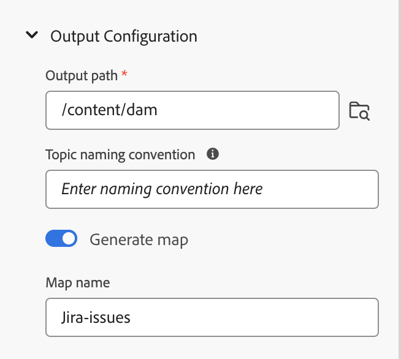

# Utilizzare dati dall’origine dati

A **origine dati** è un sistema in cui vengono memorizzati e gestiti i dati per la tua organizzazione. Si tratta di sistemi di record come JIRA, SQL Databases, PIM o PLM. Le guide AEM consentono di connettersi all’origine dati e di utilizzare i dati che ne derivano.

## Pannello Origini dati

Seleziona **Origini dati**  nel pannello a sinistra per visualizzare le origini dati collegate. Viene visualizzato il pannello Origini dati (Data Sources), in cui sono visualizzate tutte le origini dati collegate.

In base alla configurazione, l’amministratore può configurare un connettore dell’origine dati:

 Servizi cloud 

- Se utilizzi la versione di ottobre 2023 o successiva, scopri come [configurare un connettore origine dati dall’interfaccia utente](../cs-install-guide/conf-data-source-connector-tools.md) nella Guida all&#39;installazione e alla configurazione dei Cloud Service.

- Se utilizzi la versione di luglio 2023 o di settembre 2023, scopri come [configurare un connettore origine dati](../cs-install-guide/conf-data-source-connector.md) nella Guida all&#39;installazione e alla configurazione dei Cloud Service.

    

  Software on-premise 

- Se utilizzi la versione 4.3.1 o successiva, scopri come [configurare un connettore origine dati dall’interfaccia utente](../cs-install-guide/conf-data-source-connector-tools.md) nella Guida all’installazione e alla configurazione on-premise.

- Se utilizzi la versione 4.3, scopri come [configurare un connettore origine dati](../cs-install-guide/conf-data-source-connector.md) nella Guida all’installazione e alla configurazione on-premise.

>[!NOTE]
>
> Verranno visualizzate le origini dati per le quali l’amministratore ha configurato il connettore.

## Mostra vista elenco o vista affiancata

È possibile passare dalla Vista a elenco alla Vista a riquadri e viceversa per visualizzare le varie origini dati sotto forma di elenco o come riquadri.

Selezionare un&#39;origine dati per visualizzare i generatori di frammenti di contenuto e i generatori di argomenti disponibili per l&#39;origine dati selezionata.

### Vista a elenco  

{width="300" align="left"}

*Elenco delle origini dati connesse.*

### Vista affiancata   

{width="300" align="left"}

*Visualizzare le origini dati collegate come sezioni.*

È possibile utilizzare i dati delle origini dati in due modi:
- Inserire uno snippet di contenuto
- Creare un argomento

## Inserire uno snippet di contenuto dall&#39;origine dati

Le guide AEM forniscono la funzione di connessione all’origine dati. Puoi recuperare i dati, inserirli negli argomenti e modificarli. Puoi creare facilmente un frammento di contenuto utilizzando il generatore di frammenti di contenuto e riutilizzarlo all’interno degli argomenti.

Per creare uno snippet di contenuto utilizzando il generatore di snippet di contenuto e inserirlo nell’argomento, effettua le seguenti operazioni:

1. Seleziona **Origini dati**    nel pannello a sinistra per visualizzare le origini dati collegate.

1. Selezionare un&#39;origine dati per visualizzare i generatori di frammenti di contenuto disponibili per l&#39;origine dati selezionata.

   {width="300" align="left"}
   *Nel pannello Origini dati sono elencati i generatori di frammenti di contenuto disponibili.*

1. Seleziona **Aggiungi** per aggiungere un nuovo generatore di frammenti di contenuto. Il **Aggiungi generatore frammenti di contenuto** viene visualizzato il pannello.

1. Immettere la query nella casella di testo Query dati.
1. Seleziona il modello da mappare con l&#39;origine dati dall&#39; **Modello di mappatura dati** a discesa.
I modelli predefiniti per l’origine dati selezionata vengono visualizzati nel menu a discesa. Ad esempio, è possibile visualizzare il modello &quot;sql-table&quot; per l&#39;origine dati denominata &quot;PostgreSQL&quot;.

   >[!NOTE]
   >  
   > Se l’amministratore ha configurato dei modelli personalizzati, questi vengono visualizzati anche nell’elenco a discesa (in base alle configurazioni del percorso del modello eseguite dall’amministratore).
   >   
   >Puoi anche utilizzare gli strumenti Velocity nei modelli. Ulteriori informazioni su come [utilizzare gli strumenti Velocity](#use-velocity-tools).

1. Clic **Recupera** per recuperare i dati dall&#39;origine dati e applicare il modello ai dati risultanti dalla query SQL.

1. È possibile visualizzare i dati nell&#39;anteprima o nella vista origine DITA.

   1. L’anteprima mostra come verranno visualizzati i dati quando vengono inseriti nel contenuto. Nell&#39;anteprima viene visualizzata una piccola frazione di dati nel formato del modello selezionato.
Ad esempio:
      - Se è stato selezionato il modello di tabella SQL, è possibile visualizzare i dati SQL in formato tabulare.
      - Se hai selezionato il modello di elenco jira ordinato, puoi visualizzare un elenco ordinato per i problemi Jira.

   1. La vista origine mostra i dati nella vista origine DITA.
      {width="800" align="left"}
      *Aggiungi un generatore di frammenti di contenuto. Visualizza i dati in modalità di origine o anteprima.*

1. Per salvare i risultati della query, immettere il nome del generatore, quindi fare clic su **AGGIUNGI**.   All’elenco viene aggiunto un nuovo generatore di frammenti di contenuto.

   >[!NOTE]
   >
   > Devi seguire la convenzione di denominazione dei file per il nome del nuovo generatore di contenuti. Il nome del generatore di frammenti di contenuto non può contenere spazi. Inoltre, non è possibile salvare un nuovo generatore di contenuti con il nome di un generatore di contenuti esistente. Si verifica un errore.

### Opzioni per un generatore di frammenti di contenuto

Fai clic con il pulsante destro del mouse su un generatore di frammenti di contenuto per aprire Opzioni. Utilizzando le opzioni, potete effettuare le seguenti operazioni:

- **Anteprima**: utilizza questa opzione per aprire un riquadro e visualizzare una piccola frazione del modo in cui i dati vengono visualizzati nell’output.
- **Inserisci**: utilizza questa opzione per inserire lo snippet di contenuto selezionato nell’argomento aperto per la modifica nell’editor web. Poiché i dati vengono inseriti come frammento, è anche possibile modificare i dati all&#39;interno dell&#39;argomento nell&#39;Editor Web.

  >[!NOTE]
  > 
  > L&#39;opzione Inserisci viene visualizzata solo durante la modifica di un argomento.

- **Modifica**: utilizza questa opzione per apportare modifiche al generatore di frammenti di contenuto e salvarlo.
- **Elimina**: utilizza questa opzione per eliminare il generatore di frammenti di contenuto selezionato.
- **Duplica**: utilizza questa opzione per creare un duplicato o una copia del generatore di frammenti di contenuto selezionato. Per impostazione predefinita, il duplicato viene creato con un suffisso (come generator_1).

### Inserire uno snippet di query

È inoltre possibile utilizzare **Inserisci frammento di query**    dalla barra degli strumenti principale per inserire lo snippet di dati negli argomenti.  Puoi selezionare un generatore dal menu a discesa, modificare la query o modificare il modello e inserire i dati nell’argomento.

{width="800" align="left"}

*Modifica e inserisci uno snippet di dati.*

## Creare un argomento utilizzando il generatore di argomenti

Un generatore di argomenti consente di creare argomenti contenenti dati provenienti dalle origini. È possibile creare rapidamente un generatore di argomenti e quindi generare gli argomenti utilizzando il generatore. Ogni argomento può contenere dati in vari formati, ad esempio tabelle, elenchi e paragrafi.   In un argomento, ad esempio, è possibile aggiungere una tabella che include i dettagli di tutti i nuovi prodotti e un elenco di tutti i prodotti che verranno dismessi per la vendita.

Il generatore di argomenti può creare gli argomenti contenenti i dati e una mappa DITA per tutti gli argomenti. È inoltre possibile: `<conref>` questi argomenti nel contenuto. In questo modo è possibile mantenere i dati sincronizzati con l&#39;origine dati e aggiornarli facilmente.

### Creare un argomento

Per creare un argomento utilizzando il generatore di argomenti, effettuare le seguenti operazioni:

1. Selezionare un&#39;origine dati per visualizzare i generatori di frammenti di contenuto e i generatori di argomenti disponibili per l&#39;origine dati selezionata.

   {width="300" align="left"}

   *Aggiungere un generatore di argomenti per un&#39;origine dati connessa.*

1. Seleziona **Aggiungi**  e seleziona **Generatore di argomenti** dal menu a discesa, per aggiungere un nuovo generatore di argomenti. Il **Aggiungi generatore di argomenti** viene visualizzato il pannello.

1. Immetti i valori nei campi sotto le tre schede seguenti della **Aggiungi generatore di argomenti** pannello:

   **Recupera configurazione**

   {width="300" align="left"}

   *Aggiungi i dettagli di Query dati, Modello di mappatura dati e Nodo principale per il generatore di argomenti e assegnagli un nome univoco nel pannello Recupera configurazione.*

   1. Immetti la query nel **Query dati** casella di testo.
   1. Seleziona il modello da mappare con l&#39;origine dati dall&#39; **Modello di mappatura dati** a discesa.

      >[!NOTE]
      >
      > Se l’amministratore ha configurato dei modelli personalizzati, questi vengono visualizzati anche nell’elenco a discesa (in base alle configurazioni del percorso del modello eseguite dall’amministratore). È ad esempio possibile creare un modello di argomento contenente un elenco ordinato, tabelle, paragrafi o altri elementi DITA.

   1. Inserisci il **Nodo principale**. Questo è il nodo in cui desideri accedere ai tuoi dati. Il generatore di argomenti crea quindi ogni argomento al livello definito nel nodo principale. Ad esempio, puoi aggiungere &quot;problemi&quot; come nodo principale in Jira. Pertanto, se una query restituisce 13 problemi, riceverai 13 argomenti, uno per ogni problema.

   1. Clic **Recupera** per recuperare i dati dall&#39;origine dati e applicare il modello ai dati risultanti dalla query SQL. L&#39;anteprima mostra una piccola frazione di come l&#39;argomento viene visualizzato nel formato del modello selezionato. Ad esempio, puoi visualizzare un singolo problema Jira con tutti i campi risultanti dalla query.
   1. Immettere il nome del generatore di argomenti.

      >[!NOTE]
      > 
      > È necessario seguire la convenzione di denominazione dei file per il nome del nuovo generatore di argomenti. Non è possibile inserire uno spazio nel nome del generatore di argomenti. Inoltre, non è possibile salvare un nuovo generatore di argomenti con il nome di un generatore di argomenti esistente. Si verifica un errore.

   **Configurazione di output**

   {width="300" align="left"}

   *Immettete i dettagli del percorso di output e della convenzione di denominazione degli argomenti nel pannello Configurazione output. Generare una mappa DITA e denominarla.*

   1. Inserisci il **Percorso di output** dettagli in cui salvare gli argomenti.
   1. In **Convenzione di denominazione argomento**, puoi immettere un valore o una variabile con i tag di velocità. I nuovi temi seguiranno la Convenzione. Ad esempio, puoi immettere `$key` per creare argomenti in base ai tasti Jira.
   1. Abilita l’opzione **Generare una mappa** se si desidera creare una mappa che contenga tutti gli argomenti generati.
   1. Immettere il nome della nuova mappa DITA.

   >[!NOTE]
   >
   > Il generatore di argomenti genera la mappa DITA sullo stesso percorso di output degli argomenti.

   **Metadati**

   Seleziona le proprietà dei metadati dal menu a discesa da passare agli argomenti. **Nome** nel menu a discesa sono elencate sia le proprietà personalizzate che quelle predefinite.

   Ad esempio, nella schermata seguente: `dc:description`, `dc:language`, `dc:title`, e `docstate` sono le proprietà predefinite per le quali è possibile definire i valori. Puoi creare una proprietà personalizzata come Author e definirne il valore.

   {width="300" align="left"}

   *Aggiungi le proprietà dei metadati nel pannello Metadati per passare agli argomenti.*

1. Inserisci il nome del generatore e fai clic su **Salva** per salvare i risultati della query. Un nuovo generatore di argomenti viene aggiunto all&#39;elenco.

1. Clic **Salva e genera** per salvare il generatore di argomenti e generare nuovi argomenti dal generatore.

   {width="650" align="left"}

   *Genera nuovi argomenti da un generatore di argomenti esistente.*

   >[!NOTE]
   >
   > Se gli argomenti esistono già, il generatore aggiorna i dati contenuti negli argomenti esistenti.

### Opzioni per un generatore di argomenti

Fare clic con il pulsante destro del mouse su un generatore di argomenti per aprire **Opzioni**. Utilizzando le opzioni, potete effettuare le seguenti operazioni:

- **Genera**: questa opzione genera gli argomenti per il generatore di argomenti selezionato. È inoltre possibile utilizzare questa opzione per aggiornare gli argomenti esistenti. Si connette all’origine dati e recupera i dati aggiornati. Durante la generazione del contenuto, questa opzione è disabilitata e viene visualizzato un caricatore.
  >[!NOTE]
  >
  >Se l&#39;argomento esiste già, è possibile sovrascrivere i dati nell&#39;argomento o salvarli come nuova versione.

  

  *Genera un argomento e, se il file esiste già, salvalo come nuova versione o sovrascrivilo.*
- **Visualizza registro**: seleziona questa opzione per visualizzare il file di registro di generazione del contenuto. Il file di registro viene aperto in una nuova scheda. È possibile visualizzare gli errori, gli avvisi, i messaggi di informazione e le eccezioni nel file di registro. Questa opzione è abilitata se hai generato il contenuto per il generatore di argomenti selezionato.

- **Anteprima**: utilizza questa opzione per aprire un riquadro e visualizzare una piccola frazione del modo in cui i dati vengono visualizzati nell’output.

- **Modifica**: utilizza questa opzione per modificare e salvare il generatore di argomenti. Questa opzione è disabilitata durante la generazione del contenuto.
- **Elimina**: utilizza questa opzione per eliminare il generatore di argomenti selezionato. Questa opzione è disabilitata durante la generazione del contenuto.
- **Duplica**: questa opzione crea un duplicato o una copia del generatore di argomenti selezionato. Il duplicato viene creato con un suffisso (come `topic-sample_1`) per default.

## Utilizzare gli strumenti Velocity nei modelli di origini dati {#use-velocity-tools}

I modelli di Experience Manager supportano anche gli strumenti Velocity (versione 2.0). Questi strumenti consentono di applicare varie funzioni ai dati recuperati dalle origini dati. Ulteriori informazioni sull&#39;utilizzo di [Strumenti Velocity](https://velocity.apache.org/tools/2.0/generic.html) e le funzioni che puoi applicare.

Per utilizzare uno strumento Velocity in un modello, effettuate le seguenti operazioni:
1. Modifica un modello Velocity nell’editor web.
1. Aggiungere uno strumento e la relativa funzione nella `<tool.function>` formato. Ad esempio:
   - Per generare un numero casuale utilizzando lo strumento matematica, utilizzate `$mathTool.random`.
   - Per generare la somma dei numeri utilizzando lo strumento matematica, utilizzare `$mathTool.add(num1, num2)`.
1. Utilizza il modello per creare uno snippet di contenuto o un argomento.
1. Dopo aver applicato il modello ai dati, è possibile visualizzare i dati nell&#39;anteprima o nella vista origine DITA.

Puoi utilizzare i seguenti strumenti nei modelli Velocity per applicare varie funzioni ai dati recuperati dal connettore: -`$alternatorTool`
- `$classTool`
- `$contextTool`
- `$conversionTool`
- `$dateTool`
- `$comparisonDateTool`
- `$displayTool`
- `$escapeTool`
- `$fieldTool`
- `$loopTool`
- `$linkTool`
- `$listTool`
- `$mathTool`
- `$numberTool`
- `$renderTool`
- `$resourceTool`
- `$sortTool`
