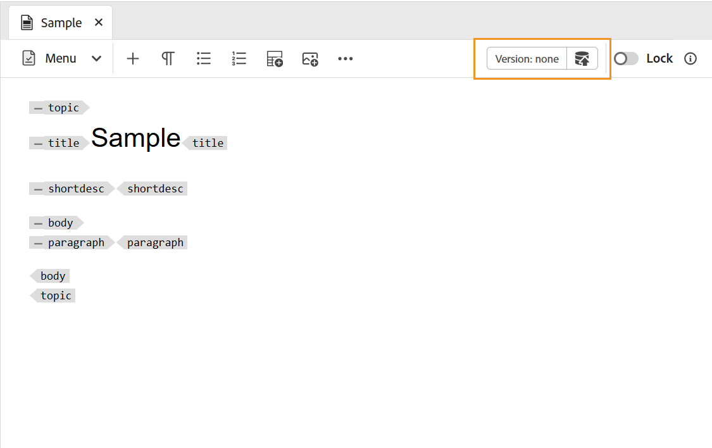

# Crea argomenti {#id2056AL00O5Z}

Adobe Experience Manager Guides consente di creare argomenti DITA di tipo topic, task, concept, reference, glossary, DITAVAL, Markdown e altro ancora. Oltre a creare argomenti basati su modelli predefiniti, puoi anche definire modelli personalizzati. Questi modelli devono essere aggiunti al profilo della cartella per essere visualizzati nella blueprint e nell’editor di selezione dei modelli.

>[!NOTE]
>
> La configurazione del profilo Globale e Cartella è disponibile solo per gli utenti amministratori a livello di cartella. Per informazioni dettagliate sulla configurazione dei profili globali e a livello di cartella, visualizza *Configurare i modelli di authoring* in Installare e configurare Adobe Experience Manager Guides per la configurazione.

In Experience Manager Guides è possibile creare argomenti in due modi:

- [Creare argomenti dall’editor](#create-topics-from-the-editor)
- [Creare argomenti dall’interfaccia utente di Assets](#create-topics-from-the-assets-ui)

## Creare argomenti dall’editor

Per creare un argomento dall’editor, effettua le seguenti operazioni:

1. Nel pannello Archivio, seleziona l&#39;icona **Nuovo file**, quindi seleziona **Argomento** dal menu a discesa.

   {width="500" align="left"}

   È inoltre possibile accedere a questa opzione dalla [home page di Experience Manager Guides](./intro-home-page.md) e dal menu delle opzioni di una cartella nella vista Archivio.

2. Viene visualizzata la finestra di dialogo **Nuovo argomento**.

3. Nella finestra di dialogo **Nuovo argomento**, fornisci i seguenti dettagli:
   - Titolo per l&#39;argomento.
   - \(Facoltativo\)* Nome file dell&#39;argomento. Il nome del file viene suggerito automaticamente in base al Titolo dell’argomento. Se l’amministratore ha abilitato i nomi di file automatici in base all’impostazione UUID, il campo Nome non verrà visualizzato.
   - Modello su cui verrà basato l&#39;argomento. Ad esempio, per una configurazione predefinita, puoi scegliere tra i modelli Vuoto, Concetto, DITAVAL, Riferimento, Attività, Argomento, Markdown, Glossario e Risoluzione dei problemi. Se nella cartella è configurato un profilo di cartella, verranno visualizzati solo i modelli di argomento configurati nel profilo di cartella.
   - Percorso in cui salvare il file dell&#39;argomento. Per impostazione predefinita, il percorso della cartella attualmente selezionata nell’archivio viene visualizzato nel campo Percorso.

4. Seleziona **Crea**.

   {width="300" align="left"}

L&#39;argomento viene creato nel percorso specificato. Inoltre, l’argomento viene aperto nell’Editor per la modifica.

{align="left"}

## Creare argomenti dall’interfaccia utente di Assets

Per creare un argomento dall’interfaccia utente di Assets, effettua le seguenti operazioni:

1. Nell’interfaccia utente di Assets, individua il percorso in cui desideri creare l’argomento.

1. Per creare un nuovo argomento, selezionare **Crea** \> **Argomento DITA**.

1. Nella pagina Blueprint selezionare il tipo di documento DITA che si desidera creare e selezionare **Successivo**.

   {align="left"}

   Per impostazione predefinita, Experience Manager Guides fornisce i modelli di argomenti DITA più utilizzati. Puoi configurare altri modelli di argomento in base ai requisiti organizzativi, visualizzare *Configurare i modelli di authoring* in Installare e configurare Adobe Experience Manager Guides per la configurazione.

   >[!NOTE]
   >
   > Nella vista a elenco dell&#39;interfaccia utente di Assets, il tipo di argomento DITA viene visualizzato nella colonna Tipo come Argomento, Attività, Concetto, Riferimento, Glossentry, Markdown o DITAVAL. La mappa DITA viene visualizzata come Mappa.

1. Nella pagina Proprietà specificare il documento **Titolo**.

1. \(Facoltativo\) Specificare il file **Name**.

   Se l’amministratore ha configurato il nome file automatico in base all’impostazione UUID, non visualizzerai l’opzione per specificare il nome file. Al file viene automaticamente assegnato un nome di file basato su UUID.

   Se l&#39;opzione di denominazione file è disponibile, anche il nome viene suggerito automaticamente in base al **Titolo** del documento. Se si desidera specificare manualmente il nome del documento, verificare che il **Nome** non contenga spazi, apostrofi o parentesi graffe e termini con .xml o .dita. Per impostazione predefinita, Experience Manager Guides sostituisce tutti i caratteri speciali con trattini. Per informazioni sulle procedure consigliate per la denominazione dei file DITA, vedere la sezione Nomi di file nella guida alle best practice.

1. Seleziona **Crea**. Viene visualizzato il messaggio Topic Created (Creazione argomento).

   È possibile scegliere di aprire l&#39;argomento per la modifica nell&#39;editor o salvare il file dell&#39;argomento nel repository di Adobe Experience Manager.

**Ulteriori informazioni**

1. A ogni nuovo argomento creato dall&#39;interfaccia utente di Assets **Crea** \> **Argomento DITA** o dall&#39;editor viene assegnato un ID argomento univoco. Il valore di questo ID è il nome del file stesso. Inoltre, un nuovo documento viene salvato come ultima copia di lavoro dell’argomento in DAM. Fino a quando non si salva una revisione di un argomento appena creato, nella Cronologia versioni non verrà visualizzato alcun numero di versione. Se apri l’argomento per la modifica, le informazioni sulla versione vengono visualizzate nell’angolo superiore destro della barra degli strumenti:

   {width="550" align="left"}

2. Le informazioni sulla versione per un argomento appena creato vengono visualizzate come *none*. Quando salvi una nuova versione, ad essa viene assegnato il numero di versione 1.0.

3. Se l&#39;amministratore ha configurato l&#39;editor in modo da bloccare i file prima della modifica, non sarà possibile modificare un file finché non viene bloccato. Analogamente, se configurato, ti verrà chiesto di sbloccare eventuali file bloccati prima di chiuderlo.

4. Dopo aver creato l&#39;argomento DITA, salvare le modifiche apportate alla copia di lavoro e creare una nuova versione una volta completati gli aggiornamenti all&#39;argomento.

**Argomento padre:**&#x200B;[&#x200B; Crea e visualizza in anteprima argomenti](create-preview-topics.md)
