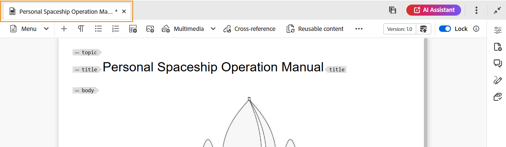
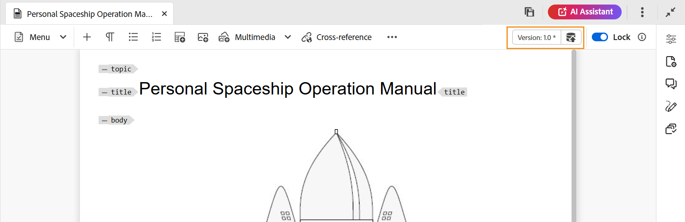

# Modifica argomenti nell&#39;editor {#id2056B040VUI}

L&#39;editor è dotato di una serie di funzioni di modifica che consentono di creare o modificare facilmente i file degli argomenti. Per modificare un argomento nell’Editor, è necessario eseguire in generale i seguenti passaggi.

>[!IMPORTANT]
>
> Se riscontri un errore dell’applicazione durante l’utilizzo dell’editor, aggiorna la pagina per continuare a lavorare.

1. Per apportare modifiche all&#39;argomento, fare clic all&#39;interno del bordo del testo dell&#39;elemento richiesto e iniziare ad apportare modifiche.

1. Per inserire un elemento specifico, sposta il cursore alla fine dell’elemento dopo il quale desideri inserire il nuovo elemento e seleziona l’icona dell’elemento richiesto nella barra degli strumenti. È inoltre possibile utilizzare la scelta rapida da tastiera `Alt+1` per richiamare il popup **Inserisci elemento**.

   Viene visualizzato un elenco di elementi che è possibile utilizzare nell&#39;argomento. Experience Manager Guides esegue un posizionamento intelligente degli elementi in base alla loro posizione valida nell’argomento.

   >[!NOTE]
   >
   > È inoltre possibile scegliere quale icona visualizzare nella barra degli strumenti configurando il file `ui_config.json` che si trova in - `/etc/designs/fmdita/clientlibs/xmleditor/`. Per ulteriori informazioni sulla personalizzazione delle funzionalità, contattare l&#39;amministratore di sistema.

1. Dopo aver modificato il documento, selezionare **Salva tutto**.

   >[!NOTE]
   >
   > Se non desideri eseguire il commit delle modifiche nell&#39;archivio di Adobe Experience Manager, seleziona **Chiudi**, quindi seleziona **Chiudi senza salvare** nella finestra di dialogo Modifiche non salvate.

## Selezione parziale del contenuto tra gli elementi

Experience Manager Guides consente inoltre di selezionare il contenuto tra gli elementi. Dopo aver selezionato il contenuto, puoi eseguire le operazioni seguenti:

- Formattazione ed eliminazione: applica al contenuto selezionato il grassetto, il corsivo, la sottolineatura o persino l’eliminazione. Il contenuto dei tag aperti validi viene quindi unito e visualizzato sotto un singolo elemento. È ad esempio possibile selezionare il contenuto di un paragrafo ed estendere la selezione a un altro paragrafo. Quindi, se rendi in grassetto il contenuto selezionato, tutto il contenuto in grassetto dei tag aperti viene unito e visualizzato sotto un singolo elemento di paragrafo.

Allo stesso modo, se elimini il contenuto selezionato, il contenuto rimanente dopo l’eliminazione nei tag aperti viene unito.

- Racchiudi il contenuto in un elemento valido: per racchiuderlo in un elemento valido, effettua le seguenti operazioni:

   - Seleziona il contenuto all’interno di un elemento.
   - Seleziona l&#39;icona  dalla barra degli strumenti nella parte superiore per visualizzare la finestra di dialogo **Inserisci elemento**. Nella finestra di dialogo sono elencati gli elementi validi per il contenuto selezionato.
     >[!NOTE]
     >
     > È inoltre possibile visualizzare la finestra di dialogo Inserisci elemento selezionando il menu di scelta rapida del contenuto selezionato.

   - Selezionate un elemento dalla finestra di dialogo. Il contenuto selezionato viene racchiuso sotto tale elemento. Se ad esempio si seleziona il contenuto di un paragrafo e quindi si sceglie l&#39;elemento `<note>` dalla finestra di dialogo **Inserisci elemento**, il contenuto selezionato verrà visualizzato in una nota.

      {width="300" align="left"}

## Aggiorna il browser durante la modifica dei file

Experience Manager Guides fornisce il supporto per aggiornare il browser mentre modifichi il contenuto nell’editor. Questa funzione consente di continuare a modificare il contenuto in caso di errore dell’applicazione durante il lavoro. Se si preme il pulsante di aggiornamento del browser mentre uno o più file con modifiche non salvate vengono aperti per la modifica, viene visualizzato un avviso che segnala che le modifiche non salvate potrebbero andare perse. È possibile annullare l&#39;operazione di aggiornamento e salvare i file per mantenere le modifiche.

Anche durante l’aggiornamento del browser, le visualizzazioni dei pannelli sinistro e destro vengono mantenute nell’editor. Experience Manager Guides ripristina l&#39;ultimo stato salvato dei file aperti nell&#39;editor quando si aggiorna il browser. Ad esempio, i file aperti nel pannello Repository vengono aperti nuovamente. Il pannello mappa viene mantenuto insieme alla mappa aperta in precedenza.

L&#39;argomento attivo o la mappa DITA viene riaperto nell&#39;area di modifica del contenuto.

Anche il pannello di destra viene riaperto e visualizza la stessa vista di prima dell’aggiornamento.

## Indicatore copia di lavoro

Experience Manager Guides fornisce l’indicatore della copia di lavoro che indica se la \(copia di lavoro\) corrente del file è sincronizzata o meno con la versione salvata. Se sono state apportate modifiche alla copia corrente e il file non è stato salvato, nella scheda File dell&#39;argomento verrà visualizzato il simbolo \* insieme al titolo. Questo indicatore funge da promemoria per il salvataggio delle modifiche e scompare quando si salva il file.

{width="550" align="left"}

Experience Manager Guides indica anche se l’ultima copia salvata \(working\) del file è sincronizzata o meno con la versione salvata. Se sono presenti modifiche non salvate tra la copia in modifica e l&#39;ultima versione salvata, viene visualizzato un segno \* insieme alle informazioni sulla versione visualizzate nell&#39;angolo superiore destro della scheda del file dell&#39;argomento. Questo indicatore funge da promemoria per salvare e creare una versione dalla copia \(working\) corrente del file.

{width="550" align="left"}

## Accedere ai file bloccati in modalità Autore e Source

Quando un file DITA o Markdown viene bloccato o estratto da un altro utente, non è possibile modificare o modificare il contenuto. Tuttavia, è ancora possibile visualizzare il file in formato di sola lettura sia nella modalità **Autore** che nella modalità **Source**, oltre alla modalità **Anteprima**.

Nella modalità di sola lettura è possibile visualizzare il contenuto, i tag e gli attributi nelle modalità **Autore** o **Source**. È inoltre possibile modificare le proprietà del file.

>[!NOTE]
>
> In qualità di amministratore, puoi accedere alla funzionalità **Forza sblocco** che ti consente di sbloccare un file bloccato da un altro utente.

<!-- This is no more available -->
<!--
The toolbar displays the following icons for read-only access:

- Toggle Tags view
- Version History
- Version Label

Experience Manager Guides also displays a **Read only access** indicator near the version number.
 

You can access the **Layout** view for read-only DITA maps. This view lets you see the DITA map and its properties but prevents edits.

>[!NOTE]
>
> Your folder-level administrative users must update *ui_config.json* so that you can harmoniously access the read-only files in the  Author, Source, and Layout modes.

 -->

## Individuare un file aperto in Esplora risorse

Quando si apre un file nell&#39;editor, Experience Manager Guides fornisce la funzione di individuare il file in Esplora risorse. Ad esempio, individua l&#39;argomento corrente durante la modifica.

È possibile disattivare la funzionalità per individuare il file con l&#39;opzione **Individua sempre i file in Esplora risorse** dalla scheda **Aspetto** delle **Preferenze utente**.

>[!NOTE]
>
>A partire dalla versione 2025.11.0, l&#39;impostazione **Individua sempre i file nel repository** viene rinominata in **Individua sempre i file nel Explorer**. Per la configurazione on-premise, continua a essere disponibile come sempre individua i file nell’archivio fino alla versione 5.1 di Experience Manager Guides.

**Argomento padre:**[ Utilizzare l&#39;editor](web-editor.md)
