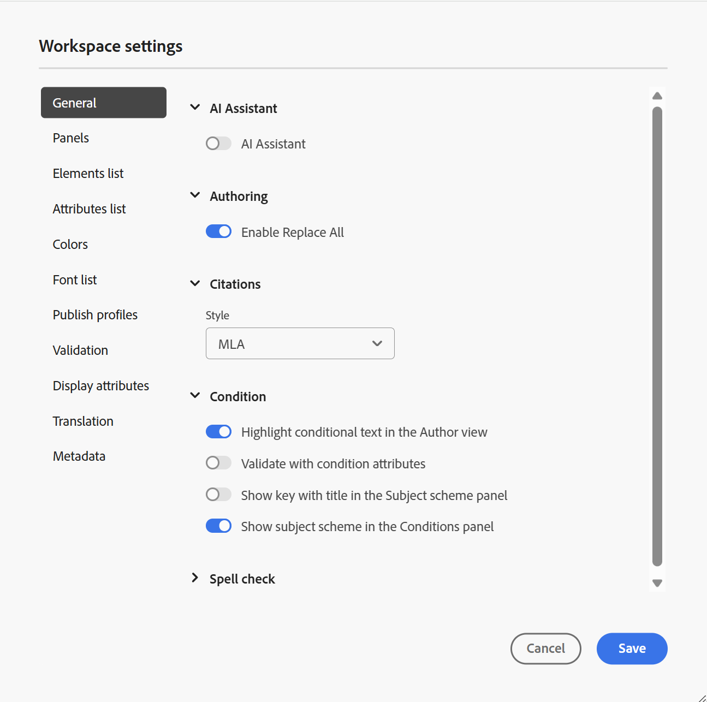
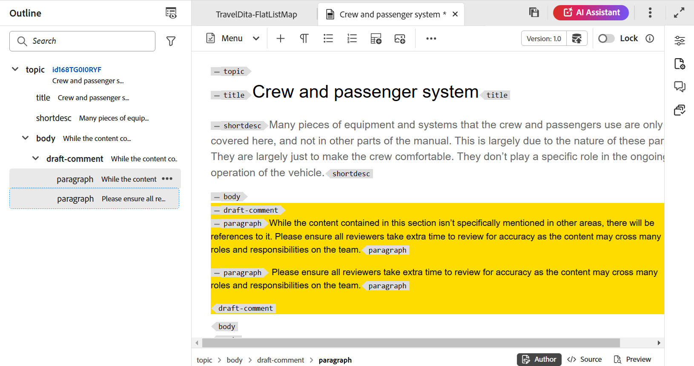
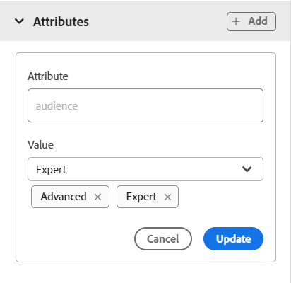

# Conoscere le funzioni dell’editor web {#id176NC500V5Z}

Questa sezione descrive le varie funzioni disponibili nell&#39;Editor Web. L’editor web può essere suddiviso nelle sezioni o aree seguenti:

- [Barra degli strumenti principale](#id2051EA0G05Z)
- [Barra degli strumenti secondaria](#id2051EA0J0Y4)
- [Pannello sinistro](#id2051EA0M0HS)
- [Area di modifica dei contenuti](#id2051EB000UI)
- [Pannello a destra](#id2051EB003YK)

La sottosezione seguente descrive in dettaglio le varie sezioni dell’Editor web.

## Barra degli strumenti principale {#id2051EA0G05Z}

La barra degli strumenti principale si trova nella parte superiore dell’interfaccia dell’editor web e fornisce funzioni a livello di file e varie modalità di authoring disponibili nell’editor web. Le funzioni disponibili nella barra degli strumenti superiore sono illustrate come segue:

**Salva tutto** - 

Salva le modifiche apportate in tutti gli argomenti aperti. Se nell&#39;editor Web sono aperti più argomenti, fare clic su **Salva tutto** o utilizzando **Crtl**+**S** i tasti di scelta rapida consentono di salvare tutti i documenti con un solo clic. Non è necessario salvare ogni documento singolarmente.

>[!NOTE]
>
> L&#39;operazione Salva non crea una nuova versione degli argomenti. Per creare una nuova versione, scegliere Salva come nuova versione.

**Salva come nuova versione** - 

Salva le modifiche apportate all&#39;argomento e crea una nuova versione dell&#39;argomento. Se stai lavorando su un argomento appena creato, le informazioni sulla versione vengono visualizzate come **nessuno**.

{width="800" align="left"}

Il numero di versione cambia con ogni nuova versione creata per il file di argomento o di mappa.

Quando scegli di salvare un argomento o una mappa utilizzando **Salva come nuova versione**, viene visualizzata la seguente finestra di dialogo:

{width="300" align="left"}

Inserisci commenti ed etichette di versione per identificare le modifiche e fai clic su **Salva** per creare una nuova versione del file.

Quando scegli il *Salva come nuova versione*, la prima versione dell&#39;argomento viene creata in DAM, che diventa anche la versione attualmente attiva dell&#39;argomento. In seguito, se si ripristina una versione precedente dell&#39;argomento, quella diventerà la versione attiva corrente dell&#39;argomento.

Se l’amministratore dispone di etichette di versione preconfigurate, le visualizzerai in un elenco a discesa. È possibile scegliere un&#39;etichetta dall&#39;elenco delle etichette disponibili e salvare il documento.

{width="300" align="left"}

Al momento del salvataggio di un argomento, è possibile aggiungere un commento specificando le modifiche apportate nell&#39;argomento. Questo commento viene visualizzato nella Cronologia versioni dell&#39;argomento.

Se l&#39;argomento è in revisione, i revisori riceveranno una notifica che indica che è disponibile una versione più recente dell&#39;argomento. Possono accedere facilmente alla revisione più recente del documento e continuare a rivedere la versione più recente dell&#39;argomento.

Quando si passa il puntatore sul titolo di un argomento, viene visualizzato il percorso del file e il numero di versione.

{width="800" align="left"}

>[!NOTE]
>
> Quando è disponibile una versione dell&#39;argomento, è anche possibile aggiungere etichette all&#39;argomento. Queste etichette possono quindi essere utilizzate per creare una baseline per la pubblicazione di una versione specifica del documento. Per ulteriori informazioni sull&#39;utilizzo delle etichette negli argomenti, vedere [Usa etichette](web-editor-use-label.md#).

**Annulla e Ripristina** -  / 

Annulla o ripristina l&#39;ultima azione.

**Elimina elemento** - 

Elimina l&#39;elemento attualmente selezionato o l&#39;elemento in cui è posizionato il cursore.

**Trova e sostituisci** - 

La funzione Trova e sostituisci è disponibile nelle modalità di visualizzazione Creazione e Origine. La barra di testo Trova e sostituisci viene visualizzata nella parte inferiore dell&#39;area di modifica dell&#39;argomento. È possibile utilizzare i tasti di scelta rapida **CTRL**+**F** per richiamare la barra Trova e sostituisci.

{width="800" align="left"}

Utilizzo dell&#39;icona delle impostazioni \(\), è possibile attivare/disattivare **Ignora maiuscole/minuscole** e **Solo parola intera** opzioni di ricerca. Per eseguire la ricerca senza distinzione tra maiuscole e minuscole, attiva \(o seleziona\) il **Ignora maiuscole/minuscole** opzione. Se invece si desidera eseguire la ricerca con distinzione tra maiuscole e minuscole, disattivare \(o deselezionare\) il **Ignora maiuscole/minuscole** opzione. È inoltre possibile scegliere di cercare una parola intera.

La ricerca è istantanea, il che significa che quando si digita la frase o la parola di ricerca nel **Trova** , il termine viene immediatamente cercato e selezionato nell&#39;argomento. Allo stesso modo, per sostituire un testo nell’argomento, inserisci il termine di ricerca e la sua sostituzione nei rispettivi campi e fai clic su **Sostituisci** o **Sostituisci tutto** pulsante.

Nella visualizzazione Origine, Trova e sostituisci è estremamente utile per la ricerca di un elemento o attributo specifico. Ad esempio, se desideri sostituire il valore di `@product` può essere eseguita facilmente dalla vista Origine. La visualizzazione Autore non consente di eseguire ricerche sulla base di un attributo o di un elemento. Tuttavia, è necessario prestare cautela durante l’utilizzo di **Sostituisci tutto** poiché potrebbe sovrascrivere il codice XML.

**Impostazioni editor** - 

Le impostazioni dell&#39;editor sono disponibili solo per gli utenti amministratori. Utilizzando le preferenze, un amministratore può configurare le seguenti impostazioni:

>[!NOTE]
>
> Se si stanno aggiornando le impostazioni predefinite, è necessario riaprire i documenti per rendere effettive le modifiche.

- **Generale**: le impostazioni Generali consentono di configurare il dizionario da utilizzare con l’editor web. Questa scheda contiene tre sezioni: **Controllo ortografia**, **Condizione**, e **Authoring**.

  {width="650" align="left"}

   - **Controllo ortografia**: sono disponibili due opzioni: **Controllo ortografia AEM** e **Controllo ortografia browser**. Per impostazione predefinita, l’editor utilizza la funzione Controllo ortografia del browser, in cui il controllo ortografico viene eseguito utilizzando il dizionario integrato del browser. È possibile passare a Controllo ortografia AEM per utilizzare il dizionario AEM, che può anche essere personalizzato per aggiungere un elenco di parole personalizzato. Per ulteriori informazioni sulla personalizzazione del dizionario AEM, vedi *Personalizza dizionario predefinito AEM* nella sezione Installare e configurare Adobe Experience Manager Guides as a Cloud Service.


   - **Condizione**

      - **Evidenzia testo condizionale nella vista Creazione**: seleziona questa opzione per evidenziare il testo condizionale nella vista dell’autore. Il contenuto condizionale viene evidenziato utilizzando il colore definito per la condizione.

      - **Convalida con attributi condizione**: selezionalo per consentire la convalida dei valori definiti per gli attributi. Questo impedisce l’aggiunta di valori errati.

      - **Mostra la chiave con il titolo nel pannello Schema soggetto**: seleziona questa opzione per mostrare i tasti e i titoli nello schema dell’oggetto. Se non si seleziona questa opzione, vengono visualizzati solo i titoli. Ad esempio, in questo caso, insieme ai titoli vengono visualizzati anche i tasti &quot;os&quot;, &quot;audience&quot; e &quot;other&quot;.

        {width="550" align="left"}

      - **Mostra schema soggetto nel pannello Condizioni**: selezionalo per visualizzare uno schema di soggetti nel pannello condizioni. Se deselezionate questa opzione, le condizioni definite vengono visualizzate nel pannello condizioni.

   - **Authoring**

      - **Abilita Sostituisci Tutto**: seleziona questa opzione per visualizzare l’icona Sostituisci tutto nel pannello Trova e sostituisci.


   - **Citazioni**
Modificare lo stile delle citazioni. Scegli lo stile di citazione dal menu a discesa che desideri utilizzare nel progetto. Per ulteriori dettagli vedi [Modificare gli stili delle citazioni](./web-editor-apply-citations.md#change-citation-style).


**Pannelli**: questa impostazione controlla i pannelli visualizzati nel pannello sinistro dell’editor. È possibile attivare o disattivare l&#39;opzione per mostrare o nascondere il pannello desiderato.

{width="650" align="left"}

>[!NOTE]
>
> Se è stato configurato un pannello personalizzato, viene visualizzato anche nell’elenco dei pannelli. È possibile attivare o disattivare l&#39;opzione per mostrare o nascondere il pannello personalizzato. Per ulteriori dettagli sulla configurazione, vedi *Configurare un pannello personalizzato nel pannello a sinistra* nella sezione Installare e configurare Adobe Experience Manager Guides as a Cloud Service.

- **Elenco elementi**: in qualità di amministratore, puoi controllare l’elenco degli elementi che un autore può inserire utilizzando [Inserisci elemento](#id204SG30105Z) e definiscono anche il nome visualizzato dell&#39;elemento. L&#39;impostazione Elenco elementi consente di specificare il nome dell&#39;elemento in base alle specifiche DITA e un&#39;etichetta che si desidera utilizzare al posto del nome dell&#39;elemento definito DITA:

  {width="650" align="left"}

Nella schermata precedente, l’ `b` all&#39;elemento è stata assegnata un&#39;etichetta di grassetto, `codeblock` riceve un’etichetta di Blocco di codice insieme ad alcuni altri elementi. Se si seleziona la **Usa solo elementi sopra** , verranno visualizzati solo gli elementi validi \(al punto di inserimento corrente\) di questo elenco nella finestra a comparsa Inserisci elemento.

Nella schermata seguente, solo 3 su 4 elementi configurati dalla schermata precedente sono visualizzati nel contesto corrente:

{width="300" align="left"}

- **Lista Attributi**: simile all’Elenco elementi, puoi controllare l’elenco degli attributi e i relativi nomi visualizzati da visualizzare nell’elenco degli attributi di un elemento. Nella schermata seguente, solo 3 attributi sono stati configurati per essere visualizzati nell’elenco degli attributi di un elemento:

  {width="650" align="left"}

  Con questa impostazione, quando tenti di aggiungere un attributo a un elemento, visualizzi solo l’elenco degli attributi configurati nell’elenco.

  {width="300" align="left"}

- **Pubblica profilo**: contiene i profili di pubblicazione che possono essere utilizzati per pubblicare **Knowledge Base** output. È possibile creare un nuovo profilo per una knowledge base di destinazione. Ad esempio, Salesforce o ServiceNow.

   - **Creare un profilo di pubblicazione Salesforce**

     **Prerequisiti**

      - Crea un&#39;app connessa per Salesforce. Per ulteriori informazioni, consulta [Abilitare le impostazioni OAuth per l’integrazione API](https://help.salesforce.com/s/articleView?id=sf.connected_app_create_api_integration.htm&amp;type=5).

      - Durante la configurazione dell’app connessa, verifica quanto segue:

         - Specifica il callback.

           `URL: http://<server name>:<port>/bin/dxml/thirdparty/callback/salesforce`

         - Selezionate i seguenti ambiti OAuth:
            - Accesso completo (completo)
            - Seleziona Gestisci dati utente tramite API (api)

  Una volta configurata l’app, Salesforce fornisce una **Chiave consumer** e **Segreto consumer**.

  Questi possono essere utilizzati per creare il profilo di pubblicazione Salesforce.


   - Per creare un profilo di pubblicazione Salesforce, seleziona la **Salesforce** Knowledge Base da **Tipo di server** a discesa. Immettere un nome di profilo. In **URL sito**, immetti il sito consumer da utilizzare per pubblicare l&#39;output e quindi aggiungi **Chiave consumer** e **Segreto consumer** fornite dal sito consumer Salesforce. Allora, **Convalida** e **Salva** il nuovo profilo creato.
     {width="550" align="left"}

     >[!NOTE]
     >
     >Per configurare un proxy per Salesforce in Experience Manager Guides, utilizza la configurazione proxy dei componenti HTTP Apache nell’AEM. Scopri come [configurare il proxy per AEM Link Checker](https://helpx.adobe.com/experience-manager/kb/How-to-configure-proxy-for-the-AEM-Link-Checker-AEM.html).


   - **Creare un profilo di pubblicazione ServiceNow**

     **Prerequisiti**

     Configura il server ServiceNow per caricare le risorse.
      - Connetti a **ServiceNow** server.
      - Accedi a **Proprietà di sistema** > **Sicurezza**.
      - Deseleziona la seguente opzione:

        **Questa proprietà deve essere impostata per attivare il controllo del tipo MIME per i caricamenti (tutte le versioni Eureka e successive). Abilita (true) o disabilita (false) la convalida del tipo MIME per i file allegati. Le estensioni file configurate tramite glide.attachment.extensions verranno controllate per verificare la presenza di eventuali tipi MIME durante il caricamento.**

      - Fai clic su **Salva**.

     Dopo aver configurato l’app, crea il **ServiceNow** Pubblica profilo.
   - Per creare un profilo di pubblicazione, selezionare la Knowledge Base ServiceNow dal **Tipo di server** a discesa. Inserisci un profilo **Nome**. In **URL ServiceNow**, immetti il sito consumer da utilizzare per la pubblicazione dell&#39;output, quindi aggiungi **Nome utente** e **Password** fornite dal sito consumer ServiceNow. Allora, **Convalida** e **Salva** il nuovo profilo creato.

     {width="550" align="left"}

  Dopo la convalida, è possibile selezionare il profilo di pubblicazione nei predefiniti di output di una mappa DITA e utilizzarlo per generare l&#39;output in  **Salesforce** o **ServiceNow** server scelto.

  Ulteriori informazioni su [Knowledge Base](../user-guide/generate-output-knowledge-base.md) predefinito di output.


- **Convalida**: questa scheda contiene le opzioni per configurare le Convalide Schematron nell’editor web. È possibile attivare le seguenti funzionalità:

   - **Esegui il controllo di convalida prima di salvare il file**: seleziona questa opzione per eseguire le convalide Schematron utilizzando i file Schematron selezionati prima di qualsiasi operazione di salvataggio. Per aggiungere un file Schematron, fate clic sull&#39;icona +. Vengono elencati i file Schematron selezionati.

     >[!NOTE]
     >I file Schematron selezionati persisteranno per il profilo di cartella selezionato.

     {width="550" align="left"}
In questo modo si impedisce agli utenti di salvare qualsiasi file che non rispetti una regola definita nei file Schematron selezionati. Se questa opzione non è selezionata, il file non verrà convalidato prima di salvare le modifiche.

   - **Consenti a tutti gli utenti di aggiungere file schematron nel pannello di convalida**: selezionare questa opzione per consentire agli utenti di aggiungere qualsiasi file Schematron nel pannello Convalida dell&#39;editor Web. Questo consente agli utenti di aggiungere file Schematron e quindi convalidare gli argomenti rispetto al file Schematron. Se non è selezionato, **Aggiungi file di schema** non è disponibile per gli utenti in **Pannello di convalida** dell’editor web.


- **Visualizza attributi**: come l’elenco Attributi, puoi controllare l’elenco degli attributi da visualizzare nell’elenco degli attributi di un elemento. Per impostazione predefinita, quattro **Visualizza attributi** : pubblico, piattaforma, prodotto e proprietà sono stati configurati per essere visualizzati nell&#39;elenco degli attributi di un elemento. È inoltre possibile aggiungere un attributo di visualizzazione utilizzando **Aggiungi** nella parte superiore. È inoltre possibile eliminare qualsiasi attributo di visualizzazione utilizzando **Elimina** icona.

  Gli attributi definiti per un elemento vengono visualizzati nella vista Layout e Struttura.

  {width="550" align="left"}

- **Traduzione**: questa scheda contiene le opzioni per creare gruppi di lingue, propagare le etichette di origine alla versione di destinazione e ripulire il progetto di traduzione.
  {width="550" align="left"}

   - **Gruppi di lingue**: in qualità di amministratore, puoi creare un gruppo di lingue e utilizzarle come set per tradurre il contenuto.\
     Per creare un nuovo gruppo di lingue, effettuare le operazioni riportate di seguito.
      1. Seleziona la Aggiungi  icona.
      1. Immettere il nome del gruppo di lingue. Ogni lingua deve avere un nome univoco. È possibile visualizzare un errore se il campo del nome è vuoto o se il nome non è univoco.
      1. Seleziona le lingue dal menu a discesa. È possibile selezionare più lingue.

     Digita i primi caratteri della lingua o il codice della lingua per filtrare le lingue desiderate. Ad esempio, digita &quot;en&quot; per filtrare tutte le lingue che contengono &quot;en&quot; all’inizio del nome o del codice.
      1. Seleziona **Fine** per aggiungere le lingue selezionate al gruppo. Vengono visualizzate le lingue. Quando si aggiungono tre o più lingue, **Mostra altro** visualizzazioni. Puoi selezionare **Mostra altro** per visualizzare tutte le lingue presenti nel gruppo.
         >[!TIP]
         >
         > Attiva/Disattiva **Mostra altro** a **Mostra meno** e visualizzare solo alcune lingue.

      1. Passa il puntatore del mouse sulle lingue di un gruppo da modificare  o eliminare  i gruppi linguistici.
      1. Salva il **Impostazioni editor**.

         >[!NOTE]
         >
         >In qualità di utente, puoi visualizzare i gruppi di lingue configurati nel tuo profilo di cartella.

   - **Propaga le etichette della versione di origine alla versione di destinazione**: seleziona questa opzione per passare l’etichetta della versione del file di origine al file tradotto. Per impostazione predefinita, questa opzione è disabilitata.
   - **Pulizia del progetto di traduzione dopo il completamento**: seleziona questa opzione per configurare i progetti di traduzione affinché vengano disabilitati o eliminati automaticamente dopo la traduzione. Per impostazione predefinita, **Nessuno** è selezionato, quindi il progetto esiste dopo la traduzione.

     Puoi disattivare i progetti di traduzione se desideri utilizzarli in un secondo momento. L’eliminazione di un progetto comporta l’eliminazione definitiva di tutti i file e le cartelle presenti nel progetto.


- **Metadati**: puoi controllare i metadati della versione dell’argomento e i relativi valori da visualizzare nella **Cronologia versioni** .  Nel percorso metadati, specifica la posizione dei nodi da cui desideri scegliere i metadati. Puoi anche definire un nome personalizzato per i metadati come etichetta. Le proprietà predefinite sono Titolo, Stato documento e Tag.

  I metadati possono essere prelevati da qualsiasi proprietà sotto `/jcr:content` della risorsa, in modo da poter aggiungere il percorso della proprietà come percorso dei metadati.


  Se il percorso dei metadati è vuoto, viene visualizzato un errore. Se si lascia vuota l&#39;etichetta, l&#39;ultimo elemento viene scelto come etichetta.


  {width="550" align="left"}

  *Configurare i metadati per **Cronologia versioni**.*


  Puoi anche definire l’ordine in cui vengono visualizzati questi tag di metadati. Per modificare l’ordine predefinito di questi tag, seleziona le barre punteggiate per trascinare i tag nella posizione desiderata.
Le etichette dei metadati vengono visualizzate nella stessa sequenza in **Cronologia versioni** dell’editor web.


**Preferenze utente** - 

Le Preferenze utente sono disponibili per tutti gli autori. Utilizzando le preferenze, un autore può configurare le seguenti impostazioni:


- **Generale**: la scheda Generale consente di configurare le seguenti impostazioni:

  {width="550" align="left"}

   - **Profili cartella**: il profilo cartella controlla diverse configurazioni relative agli attributi condizionali, ai modelli di authoring, ai predefiniti di output e alle configurazioni dell’editor web. Il Profilo globale è visualizzato per impostazione predefinita. Inoltre, se l’amministratore ha configurato i profili delle cartelle nel sistema, anche tali profili vengono visualizzati nell’elenco Profili cartella.

     Le configurazioni dell’editor web che un amministratore può definire nel profilo della cartella includono: personalizzazione dell’interfaccia utente, incluse le icone della barra degli strumenti, il layout dell’editor web, snippet e mappa principale. Per ulteriori dettagli, consulta *Configurare profili globali o a livello di cartella* in Installare e configurare Adobe Experience Manager Guides as a Cloud Service.

     >[!NOTE]
     >
     > Il nome del profilo cartella corrente viene visualizzato come etichetta per l’icona Preferenze utente nella barra degli strumenti principale.

   - **Percorso base**: per impostazione predefinita, quando accedi all’archivio AEM dall’editor web, vengono visualizzate le risorse dalla posizione /content/dam. La cartella di lavoro potrebbe essere costituita da alcune cartelle all’interno della cartella /content/dam/. Ogni volta, occorrono alcuni clic per raggiungere la cartella di lavoro. È possibile impostare il Percorso base per la cartella di lavoro e la Vista archivio visualizza quindi in primo piano il contenuto di tale posizione. Questo riduce il tempo necessario per accedere alla cartella di lavoro. Inoltre, quando si inserisce un file di riferimento o multimediale nell&#39;argomento, il percorso di esplorazione dei file inizia con la cartella impostata nel Percorso base.

   - **Seleziona mappa principale**: selezionare un file di mapping DITA per risolvere i riferimenti chiave o le voci del glossario. La mappa principale selezionata ha la precedenza più alta per risolvere i riferimenti chiave. Per ulteriori dettagli, consulta [Risolvi riferimenti chiave](map-editor-other-features.md#id176GD01H05Z).

     >[!NOTE]
     >    
     > Se non desideri utilizzare alcuna mappa principale, assicurati che il **Seleziona mappa principale** il campo è vuoto.

- **Aspetto**: seleziona i temi per l’applicazione Editor web e la visualizzazione sorgente dell’area di modifica dei contenuti.

  {width="550" align="left"}

   - **Visualizza file per**: seleziona il modo predefinito per visualizzare i file nell’editor web. È possibile visualizzare l’elenco dei file in base ai titoli o ai nomi dei file dai vari pannelli della **Autore** visualizzazione.
     >[!NOTE]
     >
     > Per impostazione predefinita, i file vengono visualizzati per titolo nell&#39;editor Web.

   - **Tema applicazione**: puoi scegliere tra **Chiaro** o **Scuro** i temi dell’applicazione. Nel caso di **Chiaro** tema, le barre degli strumenti e i pannelli utilizzano uno sfondo grigio chiaro. Nel caso di **Scuro** tema, le barre degli strumenti e i pannelli utilizzano uno sfondo nero. Seleziona **Usa tema dispositivo** per consentire a Guide Experienci Manager di selezionare i temi chiaro e scuro in base al tema del dispositivo.  In tutti i temi, l&#39;area di modifica dei contenuti viene visualizzata con sfondo bianco nel **Autore** visualizzazione.

   - **Tema della vista Origine**: - È possibile scegliere tra **Chiaro** o **Scuro** temi per l&#39;area di modifica dei contenuti nella visualizzazione origine. Nel caso di **Chiaro** tema, l&#39;area di modifica dei contenuti utilizza uno sfondo grigio chiaro per la visualizzazione sorgente, mentre nel caso di **Scuro** tema, utilizza uno sfondo di colore nero. Seleziona **Usa tema dispositivo** per consentire a Guide Experienci Manager di selezionare i temi chiaro e scuro in base al tema del dispositivo.

   - **Individua sempre i file nel repository**: selezionare questa opzione per visualizzare la posizione di un file nel repository durante la modifica nell&#39;editor Web.

   - **Mostra indicatore di spazio unificatore in modalità di creazione**: seleziona questa opzione per visualizzare un indicatore per gli spazi unificatori durante la modifica nell’editor web. È attivata per impostazione predefinita.

**Modalità Author, Source e Preview**

Per informazioni dettagliate sulle varie modalità di authoring e visualizzazione dei documenti, consulta [Visualizzazioni dell’editor web](web-editor-views.md#).

## Barra degli strumenti secondaria {#id2051EA0J0Y4}

La barra degli strumenti secondaria viene visualizzata quando si apre un argomento per la modifica nell&#39;Editor Web. Le funzioni disponibili nella barra degli strumenti secondaria sono illustrate come segue:

**Inserisci elemento** - 

Inserisce un elemento valido nella posizione valida corrente o successiva. È inoltre possibile utilizzare la scelta rapida da tastiera ***Alt***+***Invio*** per aprire la finestra a comparsa Inserisci elemento. Ad esempio, stai modificando un paragrafo, quindi in **Inserisci elemento** a comparsa, viene visualizzato un elenco di elementi che possono essere inseriti nel paragrafo. Seleziona l’elemento da inserire. È possibile utilizzare la tastiera per scorrere l&#39;elenco degli elementi e premere ***Invio*** per inserire l’elemento richiesto.

Puoi visualizzare due tipi di elementi validi:

- **Elementi validi nella posizione corrente**: l’elenco mostra gli elementi che è possibile inserire nella posizione corrente del cursore.

- **Elementi validi esterni alla posizione corrente**: nell’elenco vengono visualizzati gli elementi che è possibile inserire dopo uno qualsiasi dei padri per l’elemento corrente all’interno della gerarchia degli elementi.


Ad esempio, se ti trovi all’interno del `<b>` , puoi inserire elementi come `<u>`, `<xref>`, `<i>` nella posizione corrente. Al contrario, puoi inserire elementi come `<table>` e `<topic>` all&#39;esterno della posizione corrente.

È inoltre possibile digitare un carattere o una stringa nella casella di ricerca e cercare gli elementi che iniziano con essa.


{width="300" align="left"}

*Immetti ‘t’ per cercare tutti gli elementi validi che iniziano con ‘t’.*

Se lavori all’interno di un elemento blocco come un `note`, quindi utilizza l’icona Inserisci elemento per inserire un nuovo elemento dopo il `note` elemento. Nella schermata seguente è stato inserito un elemento nota all’interno dell’elemento p \(paragrafo\):

{width="800" align="left"}

Se si preme Invio nell&#39;elemento nota, viene creato un nuovo paragrafo all&#39;interno dell&#39;elemento nota stesso. Per inserire un nuovo elemento all’esterno della nota, fai clic sull’elemento p \(evidenziato nella schermata\) nella breadcrumb degli elementi e fai clic sull’icona Inserisci elemento o premi ***Alt***+***Invio*** per aprire la finestra a comparsa Inserisci elemento. Quindi, selezionate l&#39;elemento desiderato e premete Invio per inserire l&#39;elemento selezionato dopo l&#39;elemento nota.

È inoltre possibile aggiungere un elemento tra due elementi quando viene visualizzato un cursore a blocchi lampeggiante.

{width="300" align="left"}

Ad esempio, se si sta lavorando su un argomento DITA e il cursore di blocco lampeggia tra la breve descrizione e il corpo, è possibile aggiungere `prolog` e quindi aggiungere il copyright, l&#39;autore e altri dettagli.

Un altro modo per immettere un nuovo elemento consiste nell’utilizzare il menu di scelta rapida. Fare clic con il pulsante destro del mouse in qualsiasi punto del documento per richiamare il menu di scelta rapida. Da questo menu scegli **Inserisci elemento** per visualizzare **Inserisci elemento** e scegliere l&#39;elemento da inserire.

{width="300" align="left"}

**Inserisci paragrafo** - 

Inserisce l&#39;elemento paragrafo nella posizione corrente o successiva valida.

**Inserisci/Rimuovi elenco numerato** - 

Crea un elenco numerato nel percorso valido corrente o successivo. Se fai clic su questa icona in un elenco numerato, l’elemento viene convertito in un paragrafo normale.

**Inserisci/Rimuovi elenco puntato** - 

Crea un elenco puntato nel percorso valido corrente o successivo. Se ti trovi in un elenco puntato e fai clic su questa icona, l’elemento viene convertito in un paragrafo normale.

>[!NOTE]
>
>È inoltre possibile selezionare **Elenco suddiviso** dal menu di scelta rapida di una voce di elenco per dividere l&#39;elenco corrente e iniziare un nuovo elenco allo stesso livello.

**Inserisci tabella** - 

Inserisce una tabella nella posizione valida corrente o successiva. Fai clic sull’icona Inserisci tabella per aprire la finestra di dialogo Inserisci tabella:

{width="550" align="left"}

È possibile specificare il numero di righe e colonne richieste nella tabella. Per mantenere la prima riga come intestazione di tabella, selezionare l&#39;opzione Imposta prima riga come intestazione. Per aggiungere un titolo alla tabella, immetterlo nel campo Titolo.

Una volta inserita una tabella, è possibile modificarla utilizzando il menu di scelta rapida.

{width="550" align="left"}

Utilizzando il menu di scelta rapida della tabella, è possibile:

- Inserisci celle, righe o colonne

- Unire le celle nelle direzioni destra e giù

- Dividi celle in orizzontale o in verticale

- Eliminare celle, righe o colonne

- Creare uno snippet dalla tabella

- Genera ID


È inoltre possibile definire attributi su più celle, righe intere o colonne di una tabella. Ad esempio, per allineare la cella della tabella, trascinare e selezionare la cella desiderata. Nel pannello Proprietà contenuto (a destra), la proprietà **Tipo** modifiche apportate a **Voce multipla**.

1. In **Attributi** , fare clic su **+Aggiungi**.
1. Seleziona la `@valign` attributo da **Attributo** elenco a discesa.
1. Dall&#39;elenco a discesa valore, selezionare l&#39;allineamento del testo che si desidera applicare alle celle di tabella selezionate.
1. Clic **Aggiungi.**

{width="800" align="left"}

**Inserisci immagine** - 

Inserisce un&#39;immagine nel percorso valido corrente o successivo. Fai clic sull’icona Inserisci immagine per aprire la finestra di dialogo Inserisci immagine, quindi cerca e seleziona l’immagine da inserire.

>[!NOTE]
>
> Puoi anche aggiungere un’immagine trascinandola dal sistema locale sull’articolo. In questo caso, il file di immagine viene aggiunto utilizzando **Carica risorse** flusso di lavoro.  Per ulteriori dettagli, vedi **Carica risorse** flusso di lavoro in [Pannello sinistro](web-editor-features.md#id2051EA0M0HS) sezione.


{width="650" align="left"}

Nella finestra di dialogo Inserisci immagine è possibile aggiungere titolo immagine/figura e testo alternativo per l’immagine.

È possibile cercare il file di immagine richiesto immettendo il nome del file nella barra Digitare per cercare nella parte superiore e filtrare i risultati della ricerca in base a Percorso \(per cercare in\), Raccolte, Tipo file e Tag. Dopo aver individuato il file di immagine richiesto, selezionarlo e fare clic su Seleziona per inserire l&#39;immagine nel documento. È possibile inserire vari formati di file di immagine, ad esempio `.png`, `.svg`, `.gif`, `.jpg`, `.eps`, `.ai`, `.psd`, e altro ancora.

Dopo aver inserito un&#39;immagine, potete modificarne l&#39;altezza, la larghezza, il posizionamento e gli attributi dal pannello Proprietà contenuto. Fai clic su un file di immagine, quindi apporta le modifiche desiderate nel pannello Proprietà contenuto nella barra a destra.

{width="800" align="left"}

Nel campo Sorgente viene visualizzato l’UUID del file immagine inserito. Per trovare il percorso completo del file di immagine inserito, posizionare il puntatore del mouse sul campo Sorgente. Il percorso viene visualizzato nella descrizione comando.

Per ridimensionare un&#39;immagine, specificate Altezza (Height) o Larghezza (Width) per il file di immagine. Le proporzioni dell&#39;immagine vengono mantenute automaticamente. Se lo desideri, puoi anche scegliere di non mantenere le proporzioni del file immagine facendo clic sull’icona del lucchetto \(di Mantieni proporzioni\) e fornendo i valori di Altezza e Larghezza.

Potete inoltre specificare l&#39;impostazione Posizionamento (Placement) per l&#39;immagine come In linea (Inline) o Interruzione (Break). Se si sceglie di utilizzare l&#39;opzione di posizionamento Interrompi, è possibile scegliere dove allineare l&#39;immagine (a sinistra, al centro o a destra).

È inoltre possibile aggiungere altre proprietà per un file di immagine selezionando le proprietà richieste nel **Attributi** campo.

>[!NOTE]
>
>Puoi anche definire le aree cliccabili \(mappa immagine\) nell’immagine. Per ulteriori dettagli, vedi **Inserisci/Modifica mappa immagine** descrizione della funzione in [Pannello sinistro](web-editor-features.md#id2051EA0M0HS) sezione.

**Menu di scelta rapida per file immagine o multimediali**

È inoltre possibile eseguire alcune operazioni comuni per immagini e file multimediali utilizzando il menu di scelta rapida. Fare clic con il pulsante destro del mouse in qualsiasi punto dell&#39;immagine per richiamare il menu di scelta rapida.

Il menu di scelta rapida fornisce le opzioni per tagliare, copiare o incollare l&#39;immagine o il supporto. Puoi inserire un elemento prima o dopo l’elemento selezionato. È inoltre possibile rinominare o decomprimere un elemento. Puoi individuare l’immagine o il supporto selezionato nell’archivio oppure visualizzare l’anteprima del file nell’interfaccia utente di Assets.

Le altre opzioni del menu di scelta rapida consentono di copiare il percorso, modificare una mappa immagine, creare uno snippet o generare gli ID per l’elemento selezionato.

**Inserisci file multimediali** - 

Inserisce diversi tipi di file multimediali. Fare clic sull&#39;icona Inserisci file multimediale e scegliere il tipo di file che si desidera inserire. I formati multimediali supportati sono:

- File audio
- File video
- YouTube
- Vimeo

Quando si seleziona l&#39;opzione File audio o video, viene visualizzata la vista del repository per sfogliare e selezionare il file desiderato. Se scegli YouTube o Vimeo, viene visualizzata la finestra di dialogo Inserisci file multimediali. Incollare il collegamento del file video nel campo Collegamento Web e fare clic su Inserisci per aggiungere il video nella posizione valida corrente o successiva nel documento.

>[!NOTE]
>
> Quando aggiungi un collegamento video YouTube, devi sostituire la stringa `watch?v=` con `embed` nell’URL. Ad esempio, per aggiungere un collegamento video YouTube: `https://www.youtube.com/**watch?v**=WlIKQOrmZcs`, è necessario aggiungerlo come: `https://www.youtube.com/**embed/**WlIKQOrmZcs`. Questa modifica garantisce che il video venga incorporato nel sito AEM e nell’output PDF.

È inoltre possibile aggiungere il file audio o video dalla finestra di dialogo Inserisci file multimediale. Selezionare l&#39;opzione File audio/video e fare clic sull&#39;icona Sfoglia per avviare la visualizzazione del repository. Selezionare il file audio o video dal repository e fare clic su Seleziona per aggiungere il collegamento del file nel campo File audio/video. Se scegliete un file video, nell&#39;area di anteprima viene visualizzata anche un&#39;anteprima del file. È possibile riprodurre il file video per visualizzarne l&#39;anteprima.

{width="650" align="left"}

**Inserisci riferimento incrociato** - 

Inserisci riferimenti di tipo: riferimento contenuto, riferimento chiave contenuto, riferimento chiave, riferimento file, collegamento web o collegamento e-mail.

Fai clic su **Seleziona file** icona \(per riferimento a contenuto e riferimento a file\) oppure **Seleziona mappa** icona \(per Riferimento chiave contenuto e Riferimento chiave\) e selezionare il file o il contenuto desiderato a cui collegarsi.

{width="650" align="left"}

Nel documento viene aggiunto un collegamento del riferimento selezionato. Il menu di scelta rapida sul collegamento consente di:

- **Inserisci elemento**: mostra un elenco di elementi validi che è possibile inserire nel contesto specificato.
- **Copia UUID**: copia l’UUID del riferimento inserito.
- **Copia percorso**: copia il percorso completo del riferimento inserito.
- **Crea snippet**: crea uno snippet riutilizzabile dal riferimento inserito.
- **Genera ID**: genera un ID univoco per il riferimento inserito.

Puoi anche eseguire ricerche utilizzando l’UUID del file a cui desideri fare riferimento. Per i collegamenti a Contenuto e Riferimento chiave, immetti l’UUID del file a cui vuoi collegare e il file viene automaticamente cercato e visualizzato nella sezione Anteprima. Quando si specifica l&#39;UUID del file, non è necessario indicare esplicitamente l&#39;estensione per i file con estensione xml. L&#39;estensione .xml viene aggiunta automaticamente all&#39;UUID.

{width="650" align="left"}

Se l’amministratore ha abilitato l’opzione UUIDs in *XMLEditorConfig*, quindi visualizzerai l’UUID del contenuto di riferimento nella **Collegamento** proprietà.

{width="800" align="left"}

>[!NOTE]
>
> Se il **Abilita UUID** non è abilitata, viene visualizzato il percorso relativo del contenuto a cui si fa riferimento.

>[!IMPORTANT]
>
> Anche se il percorso relativo del contenuto a cui si fa riferimento è mostrato in **Collegamento** internamente, il collegamento viene creato utilizzando l’UUID del contenuto di riferimento.

>[!TIP]
>
> Consulta la sezione Riferimenti nella guida alle best practice per le best practice sui riferimenti ai contenuti.

**Ricerca filtro**

Puoi cercare del testo nei file presenti nel percorso selezionato dell’archivio AEM. Ad esempio, la ricerca di &quot;generale&quot; viene eseguita nella schermata sottostante. Puoi anche restringere la ricerca utilizzando filtri avanzati. È possibile cercare tutti i file DITA come Argomenti DITA e Mappe DITA presenti nel percorso selezionato.

È possibile cercare file non DITA come i file immagine, i file multimediali e i documenti nel percorso selezionato. È inoltre possibile cercare valori specifici negli attributi degli elementi DITA. È inoltre possibile cercare i file estratti dall&#39;utente specificato.

{width="650" align="left"}

>[!NOTE]
>
> L’amministratore di sistema può anche configurare i filtri di testo e mostrare o nascondere altri filtri. Per ulteriori dettagli, consulta la sezione Configurare i filtri di testo in Installare e configurare le guide di Adobe Experience Manager as a Cloud Service.

Viene visualizzato l’elenco dei file filtrati che contengono il testo cercato. Ad esempio, nella schermata precedente sono elencati i file contenenti il testo &quot;generale&quot;. Puoi anche visualizzare in anteprima il contenuto del file.

**Inserisci contenuto riutilizzabile** - 

Riutilizzare il contenuto esistente in qualsiasi altro documento del progetto. È possibile inserire contenuto collegandolo direttamente al contenuto di un file o utilizzando un riferimento chiave, vedere [Risolvi riferimenti chiave](map-editor-other-features.md#id176GD01H05Z). Quando fai clic sull’icona Inserisci contenuto riutilizzabile, viene visualizzata la finestra di dialogo Riutilizza contenuto:

{width="650" align="left"}

Nella finestra di dialogo Riutilizza contenuto selezionare File DITA per i riferimenti di file o il file di mappa DITA contenente i riferimenti chiave. Una volta selezionati, l’argomento o i riferimenti chiave vengono visualizzati nella finestra di dialogo. È possibile selezionare l&#39;ID o la chiave dell&#39;argomento che si desidera inserire e fare clic su Fine per inserire il contenuto all&#39;interno dell&#39;argomento.

Per inserire un riferimento contenuto, puoi anche immettere l’UUID del file e il contenuto riutilizzabile da quel file è elencato nella sezione Anteprima.

In base all’impostazione per l’inserimento dei collegamenti, nel pannello Proprietà o nella vista Codice sorgente è possibile visualizzare l’UUID del contenuto inserito o il percorso relativo. Il collegamento viene sempre creato utilizzando l’UUID del contenuto di riferimento. Consulta Configurare collegamenti basati su UUID nell’as a Cloud Service Installare e configurare le guide di Adobe Experience Manager.

>[!NOTE]
>
> Per aggiungere contenuto prima o dopo il contenuto a cui si fa riferimento, utilizza *Alt*+*Sinistra* Freccia o Alt+*Destra* Tasti di direzione per spostare il cursore nella posizione desiderata.

Puoi anche incorporare il contenuto a cui si fa riferimento all’interno dell’argomento facendo clic con il pulsante destro del mouse sul contenuto a cui si fa riferimento e scegliendo **Sostituisci riferimento con contenuto** dal menu di scelta rapida.

**Inserisci caratteri speciali** -  

Inserisce caratteri speciali nell&#39;argomento. Fare clic sull&#39;icona Inserisci carattere speciale per aprire la finestra di dialogo Inserisci carattere speciale.

>[!NOTE]
>
> Le guide AEM forniscono finestre di dialogo mobili e ridimensionabili. Le finestre di dialogo con due linee trasversali nell&#39;angolo inferiore destro possono essere ridimensionate. Le linee trasversali nella finestra di dialogo Carattere speciale sono mostrate di seguito.

{width="550" align="left"}

Nella finestra di dialogo Inserisci carattere speciale è possibile cercare un carattere speciale utilizzando il nome. Tutti i caratteri speciali vengono memorizzati in varie categorie. Utilizzare l&#39;elenco a discesa Seleziona categoria e selezionare una categoria. Vengono visualizzati i caratteri speciali disponibili nella categoria selezionata. È possibile spostarsi nell&#39;elenco dei caratteri speciali utilizzando i tasti di direzione oppure fare clic sul carattere desiderato che si desidera inserire. Il nome e il codice esadecimale del carattere speciale selezionato vengono visualizzati sotto l&#39;elenco. Fare clic su Inserisci per inserire il carattere selezionato nel documento.

**Inserisci parola chiave** - 

Inserisci parola chiave definita nella mappa DITA. Fai clic sull’icona Inserisci parola chiave per aprire la finestra di dialogo Riferimento chiave.

{width="550" align="left"}

Le parole chiave sono elencate in ordine alfabetico ed è inoltre possibile cercare le parole chiave\(s\) digitando una stringa di ricerca nella casella Cerca. Il risultato della ricerca restituirà le parole chiave contenenti la stringa in ID o Value. Le parole chiave definite nella mappa DITA sono elencate in questa finestra di dialogo. Scegliere la parola chiave da inserire e fare clic su **Inserisci**.

È inoltre possibile modificare gli attributi della parola chiave inserita facendo clic con il pulsante destro del mouse sulla parola chiave e selezionando l&#39;opzione Attributi. Viene visualizzata la finestra di dialogo Attributi per parola chiave:

{width="550" align="left"}

È possibile modificare gli attributi della parola chiave o aggiungere un nuovo attributo alla parola chiave.

**Inserisci snippet** - 

Inserire uno snippet nella posizione valida corrente o successiva. Affinché questa funzione funzioni, è necessario che nel sistema siano definiti snippet. Per ulteriori informazioni sull&#39;aggiunta di uno snippet, vedere **Frammento** descrizione della funzione in [Pannello sinistro](web-editor-features.md#id2051EA0M0HS) sezione.

Facendo clic sull&#39;icona Inserisci frammento, viene visualizzato il catalogo Inserisci frammento. Il catalogo è sensibile al contesto, il che indica che i frammenti verranno visualizzati solo se sono consentiti nella posizione corrente.

Nell&#39;esempio seguente vengono illustrati due snippet preconfigurati: Warning ed Error che è possibile inserire nella posizione corrente del documento.

{width="300" align="left"}

Quando si sceglie un frammento dall&#39;elenco, questo viene inserito nella posizione valida corrente o successiva del documento. La schermata seguente mostra lo snippet di errore inserito nel documento:

{width="400" align="left"}

**Inserisci/Modifica mappa immagine** - 

Inserisce una mappa immagine nell&#39;immagine selezionata. Un&#39;immagine con aree cliccabili che si collegano ad argomenti o pagine Web è chiamata mappa immagine.

Selezionare un&#39;immagine nell&#39;argomento corrente e fare clic sull&#39;icona Inserisci/Modifica mappa immagine per aprire la finestra di dialogo Inserisci mappa immagine.

{width="650" align="left"}

Scegliere la forma preferita Rettangolo , Cerchio , o poligono  per definire un&#39;area sopra un&#39;immagine da utilizzare come collegamento. Dopo aver definito un’area, viene visualizzata la finestra di dialogo Riferimento in cui è necessario specificare il collegamento al contenuto interno o esterno:

{width="650" align="left"}

Se le aree si sovrappongono, è possibile portare la forma avanti o indietro facendo clic sulla relativa icona nella barra degli strumenti. È inoltre possibile rimuovere un&#39;area selezionandola e facendo clic sull&#39;icona Elimina. Facendo doppio clic su un’area si apre la finestra di dialogo Riferimento, in cui è possibile modificare il collegamento di destinazione. Dopo aver contrassegnato le aree richieste sull&#39;immagine, salvare le modifiche facendo clic su Fine.

**Check-out/Check-in** - / 

Estrae o archivia il file corrente. Il Check-Out di un file consente all&#39;utente di accedere in scrittura in modo esclusivo al file. Quando il file viene archiviato, le modifiche vengono salvate nella versione corrente del file.

Se vi trovate nella vista Mappa ed espandete la mappa padre, potete estrarre tutti i file della mappa con un solo clic. Espandere semplicemente il file di mappa padre e selezionare il file padre, in modo da selezionare tutti i file all&#39;interno della mappa. Quindi puoi selezionare **Estrai**   per bloccare tutti i file della mappa.

>[!NOTE]
>
> Quando si archivia un file contenente modifiche non salvate, viene richiesto di salvarle. Se le modifiche non vengono salvate, verrà archiviato solo il file.

La descrizione comando per il Check-In/Check-Out è determinata dalla proprietà title nella `ui_config.json` file.

Per ulteriori dettagli, vedi [Configurare il titolo per le icone Archivia ed Estrai](../install-guide/conf-checkin-checkout-title.md) nella Guida all’installazione e alla configurazione on-premise.


**Attiva/Disattiva visualizzazione tag** - 

I tag sono segnali visivi che indicano i limiti di un elemento. Un limite di elemento contrassegna l&#39;inizio e la fine di un elemento. È quindi possibile utilizzare questi limiti come spunto visivo per posizionare il punto di inserimento o selezionare il testo all&#39;interno di un limite. Se si desidera inserire un altro elemento prima o dopo un elemento nel documento, è possibile posizionare il punto di inserimento prima o dopo il limite di apertura o di chiusura dell&#39;elemento.

La schermata seguente mostra un documento con Visualizzazione tag su:

{width="650" align="left"}

Le seguenti operazioni possono essere eseguite in un documento con Vista tag su:

- **Seleziona un elemento**: fai clic sul tag di apertura o chiusura di un elemento per selezionarne il contenuto.

- **Espandi o comprimi tag**: fai clic sul segno + o - per accedere a un tag e espanderlo o comprimerlo.

- **Utilizzare il menu di scelta rapida**: il menu di scelta rapida fornisce opzioni per tagliare, copiare o incollare l’elemento selezionato. Puoi anche inserire un elemento prima o dopo l’elemento selezionato. Le altre opzioni consentono di generare ID o aprire il pannello Proprietà per l’elemento selezionato.

- **Trascinare gli elementi**: seleziona il tag di un elemento e trascinalo facilmente sul documento. Se la posizione di rilascio è una posizione valida in cui l’elemento è consentito, l’elemento viene posizionato nella posizione di rilascio.


>[!NOTE]
>
> Se un utente abilita la Visualizzazione tag dall’editor web, questa rimane abilitata anche in tutte le sessioni. Ciò significa che non è necessario abilitare nuovamente la visualizzazione Tag per accedervi in un secondo momento. Il valore predefinito per la visualizzazione Tag per la sessione di un nuovo utente è determinato dalla proprietà tagsView nel file ui\_config.json. Per ulteriori dettagli, vedi *Configura il valore predefinito per la vista Tag* sezione in Installare e configurare Adobe Experience Manager Guides as a Cloud Service.

**Attiva/Disattiva rilevamento modifiche** 

Per tenere traccia di tutti gli aggiornamenti apportati a un documento, attivare la modalità Revisioni. Dopo aver abilitato le modifiche di traccia, tutti gli inserimenti e le eliminazioni vengono acquisiti nel documento. Tutto il contenuto eliminato viene evidenziato con il metodo Barrato e tutti gli inserimenti vengono evidenziati in verde. Vengono inoltre visualizzate le barre di modifica sul bordo della pagina dell&#39;argomento. Anche in questo caso, viene visualizzata una barra rossa per il contenuto eliminato e una barra verde per il contenuto aggiunto. Nel caso in cui vi sia aggiunta ed eliminazione sulla stessa riga, vengono visualizzate entrambe le barre verdi e rosse.

La schermata seguente evidenzia il contenuto eliminato e inserito insieme alle barre di modifica:

{width="650" align="left"}

Un caso d’uso tipico per il tracciamento delle modifiche in un documento può essere la revisione tra pari. È possibile abilitare la funzione di rilevamento delle modifiche e condividere il documento per la revisione; il revisore apporta quindi le modifiche con la funzione di rilevamento delle modifiche ATTIVA. Quando ricevi il documento, dovresti disporre di un meccanismo per visualizzare gli aggiornamenti suggeriti e di un modo pratico per accettare o rifiutare le modifiche.

Le guide AEM forniscono la funzione Tracked Changes (Modifiche tracciate) che contiene informazioni sugli aggiornamenti effettuati nel documento. La funzione Tracked Changes (Modifiche tracciate) fornisce informazioni su quali aggiornamenti sono stati apportati, chi li ha apportati e in che momento. Utilizzando la funzione Revisioni, è inoltre possibile accettare o rifiutare facilmente gli aggiornamenti suggeriti nel documento.

Per accedere alla funzione, fate clic sull&#39;icona Revisioni tracciate nel pannello di destra.

{width="300" align="left"}

Quando si fa clic su una modifica, viene selezionato il contenuto modificato nel documento. Potete accettare una modifica selezionando l&#39;icona Accetta modifica (Accept Change) oppure rifiutarla selezionando Rifiuta modifica (Rifiuta change).

Per accettare o rifiutare tutte le modifiche con un solo clic, selezionare **Accetta tutto** o **Rifiuta tutto**.

>[!NOTE]
>
> La modalità Anteprima consente di visualizzare il documento con o senza i markup del contenuto modificato. Per ulteriori dettagli, vedi [Anteprima](web-editor-views.md#preview-mode-id19AAGL00163) modalità.

**Unisci** - 

Quando si lavora in un ambiente con più autori, diventa difficile tenere traccia delle modifiche apportate da altri autori in un argomento o in una mappa. La funzione di unione consente di controllare non solo le modifiche, ma anche le modifiche mantenute nell&#39;ultima versione del documento.

**Unisci file di argomenti**

Per unire le modifiche in un argomento, effettuare le seguenti operazioni:

1. Aprire un argomento nell&#39;Editor Web.

1. Clic **Unisci**.

   Viene visualizzata la finestra di dialogo Unisci.

   {width="550" align="left"}

1. *\(Facoltativo\)* È inoltre possibile sfogliare e selezionare un nuovo file da un&#39;altra posizione nel repository.

1. Selezionare una versione del file con cui si desidera confrontare la versione corrente del file.

1. In Opzioni, scegliere:

   - **Rileva modifiche dalla versione selezionata**: questa opzione mostra tutti gli aggiornamenti di contenuto sotto forma di revisioni. È quindi possibile scegliere di accettare o rifiutare le modifiche nel documento una alla volta o tutte contemporaneamente.

   - **Ripristina versione selezionata**: questa opzione ripristina la versione corrente del documento alla versione selezionata. Questa opzione non consente di controllare quale contenuto viene accettato o rifiutato.

1. Clic **Fine**.

1. Se hai selezionato **Traccia modificata dalla versione selezionata** , quindi tutte le modifiche dalla versione selezionata vengono visualizzate nella funzione Tracked Changes (Modifiche tracciate) del pannello di destra.

   Potete scegliere di accettare o rifiutare tutti i commenti dal pannello Revisioni tracciate o accettare o rifiutare un singolo commento.


**Unisci file mappa**

Per unire le modifiche in un file di mappa, effettuare le seguenti operazioni:

1. Aprire una mappa nell&#39;Editor Web.

1. Clic **Unisci**.

   Viene visualizzata la finestra di dialogo Unisci.

   {width="550" align="left"}

1. *\(Facoltativo\)* È inoltre possibile sfogliare e selezionare un nuovo file da un&#39;altra posizione nel repository.

1. Selezionare una versione del file con cui si desidera confrontare la versione corrente del file.

1. In Opzioni, scegliere:

   - **Rileva modifiche dalla versione selezionata**: questa opzione mostra tutti gli aggiornamenti di contenuto sotto forma di revisioni. È quindi possibile scegliere di accettare o rifiutare le modifiche nel documento una alla volta o tutte contemporaneamente.

   - **Ripristina versione selezionata**: questa opzione ripristina la versione corrente del documento alla versione selezionata. Questa opzione non consente di controllare quale contenuto viene accettato o rifiutato.

1. Clic **Fine**.

   1. Se hai selezionato **Traccia modificata dalla versione selezionata** , quindi tutte le modifiche dalla versione selezionata vengono visualizzate nel pannello Modifiche tracciate \(a destra\).

      Potete scegliere di accettare o rifiutare tutte le modifiche dal pannello Revisioni tracciate oppure accettare o rifiutare singole modifiche nel file di mappa.


**Cronologia versioni** - 


Il **Cronologia versioni** nell&#39;editor Web consente di controllare le versioni disponibili dei file DITA, confrontarli e ripristinare qualsiasi versione dall&#39;editor stesso.

Nella cronologia delle versioni è possibile confrontare il contenuto e i metadati della versione corrente (che può anche essere una copia di lavoro) con qualsiasi versione precedente dello stesso file. Puoi anche visualizzare le etichette e i commenti per le versioni confrontate.

Per accedere alla cronologia delle versioni e ripristinare una versione specifica dell&#39;argomento, effettuare le seguenti operazioni:

1. Aprire un argomento nell&#39;Editor Web.

1. Clic **Cronologia versioni**.

   Il **Cronologia versioni** viene visualizzata.

   {width="550" align="left"}
   *Visualizzare in anteprima le modifiche apportate alle diverse versioni di un argomento.*

1. Scegliere una versione dell&#39;argomento che si desidera confrontare o ripristinare in **Confronta con** elenco a discesa.

   >[!NOTE]
   >
   > Se a una versione sono applicate etichette, queste vengono visualizzate anche \(tra parentesi\) insieme al numero di versione.


1. Abilita **Visualizza etichette e commenti** per visualizzare le etichette e i commenti applicati alle versioni corrente e confrontata.

1. È inoltre possibile visualizzare le seguenti informazioni in **Cronologia versioni** finestra di dialogo:

   **Anteprima** scheda: il contenuto appena aggiunto è in verde e il contenuto eliminato è in rosso.

   **Metadati** scheda: i metadati appena aggiunti sono in verde e quelli eliminati in rosso.
   {width="550" align="left"}
   *Confrontare i metadati di diverse versioni nella cronologia delle versioni.*

   >[!NOTE]
   >
   > L’amministratore di sistema può modificare i metadati da visualizzare dalla scheda Metadati in Impostazioni editor.

   Puoi anche visualizzare i dettagli dell’utente e dell’ora della versione corrente e della versione confrontata.


1. Dopo aver scelto una versione dall’elenco a discesa, la **Opzione Ripristina versione selezionata** è reso disponibile. Nella finestra di anteprima vengono visualizzate le differenze tra la versione corrente e la versione selezionata dell&#39;argomento.


1. Clic **Ripristina versione selezionata** per ripristinare la copia di lavoro con la versione selezionata dell&#39;argomento.

   Viene visualizzata la finestra di dialogo Ripristina versione.

   {width="550" align="left"}

1. \(*Facoltativo*\) Fornisci un motivo per ripristinare una versione precedente. È inoltre possibile creare una nuova versione della copia di lavoro attiva dell&#39;argomento.

1. Clic **Conferma.**

   La copia di lavoro del file viene ripristinata alla versione selezionata. Se si sceglie di creare una nuova versione della copia di lavoro attiva, viene creata anche una nuova versione del file con tutte le modifiche di lavoro.


Quando si ripristina una versione precedente, viene visualizzato un segnale visivo che indica che la versione su cui si sta lavorando non è quella più recente.

{width="800" align="left"}

**Gestione etichette versione** -  

Le etichette consentono di identificare la fase in cui un particolare argomento si trova nel DDLC \(Document Development Life Cycle\). Ad esempio, quando si lavora su un argomento, è possibile impostare l&#39;etichetta come &quot;Approvato&quot;. Quando un argomento viene pubblicato e reso disponibile ai clienti, puoi assegnare l’etichetta &quot;Rilasciato&quot; a tale argomento.

Le guide AEM consentono di specificare etichette in formato testo libero o di utilizzare un insieme di etichette predefinite. L’etichetta personalizzata consente a qualsiasi autore nel sistema di specificare un’etichetta in base alla propria scelta. Questo offre flessibilità, ma introduce etichette non coerenti nel sistema. Per risolvere questo problema, gli amministratori possono configurare un set di etichette predefinite. Per ulteriori informazioni sulla configurazione di etichette predefinite, consulta *Configurazione e personalizzazione dell&#39;editor Web XML* in Installare e configurare Adobe Experience Manager Guides as a Cloud Service.

Queste etichette vengono visualizzate sotto forma di elenco a discesa agli autori ogni volta che devono specificare un’etichetta. In questo modo nel sistema verranno utilizzate solo etichette coerenti e predefinite.

Esistono diversi metodi per applicare le etichette agli argomenti: [Cronologia versioni](web-editor-use-label.md) pannello nell’interfaccia di Assets, [Linee di base](/help/product-guide/user-guide/generate-output-use-baseline-for-publishing.md) e Web Editor. La funzione Etichetta versione nell’editor web consente agli autori di assegnare etichette ai propri argomenti in modo rapido e semplice.

Per aggiungere etichette all&#39;argomento dall&#39;editor Web, effettuare le seguenti operazioni:

1. Aprire un argomento nell&#39;Editor Web.

1. Clic **Etichetta versione**.

   Viene visualizzata la finestra di dialogo Gestione etichette versione.

   {width="650" align="left"}

   La finestra di dialogo Gestione etichette versione è divisa in due parti: il pannello di sinistra contiene un elenco di versioni disponibili per l&#39;argomento, insieme all&#39;elenco a discesa delle etichette \(o a una casella di testo per immettere un&#39;etichetta\) e il pannello di destra con un&#39;anteprima dell&#39;argomento.

1. Selezionare la versione alla quale si desidera applicare le etichette.

   Quando si sceglie una versione diversa dell&#39;argomento dall&#39;elenco delle versioni, nel pannello di anteprima vengono visualizzate le modifiche tra la versione corrente e la versione selezionata dell&#39;argomento

   >[!NOTE]
   >
   > Se un&#39;etichetta è già applicata a una versione, viene visualizzata accanto al numero di versione nell&#39;elenco a discesa e sotto l&#39;elenco Seleziona versione. È possibile rimuovere un&#39;etichetta esistente facendo clic sul pulsante \(**x**\) accanto all&#39;etichetta.

1. Se l&#39;amministratore ha definito un elenco di etichette, viene visualizzato un elenco a discesa delle etichette da cui è possibile scegliere le etichette da applicare. Puoi selezionare più etichette dall’elenco a discesa.

   Viene inoltre visualizzata una casella di testo in cui è possibile immettere le etichette che si desidera aggiungere all&#39;argomento.

   >[!NOTE]
   >
   > Non è possibile applicare la stessa etichetta a più versioni di un argomento. Se si tenta di associare un&#39;etichetta esistente, è possibile rimuoverla dalla versione esistente e applicarla alla versione selezionata dell&#39;argomento.

1. Clic **Aggiungi etichetta**.

1. Nel messaggio di conferma Applica etichetta, seleziona la **Sposta etichetta** per spostare le etichette da una versione esistente alla versione selezionata. Se non si seleziona questa opzione e sono presenti etichette assegnate a una versione diversa dell&#39;argomento, tali etichette non verranno spostate nella versione dell&#39;argomento selezionato. Tali etichette vengono ignorate nel processo di applicazione delle etichette.


**Crea attività di revisione** -  

È possibile creare un&#39;attività di revisione dell&#39;argomento corrente o un file di mapping direttamente dall&#39;editor Web. Aprire il file per il quale si desidera creare l&#39;attività di revisione e fare clic su Crea attività di revisione per avviare il processo di creazione della revisione.

>[!NOTE]
>
> Puoi anche creare un’attività di revisione dal pannello Revisione \(a destra\).

Seguire le istruzioni fornite nella [Rivedi argomenti o mappe](review.md#) per ulteriori dettagli.

## Pannello sinistro {#id2051EA0M0HS}

Il pannello sinistro è persistente. Per espanderla o comprimerla, fai clic sull’icona Espandi barra laterale \(\). Nella visualizzazione espansa vengono visualizzati i nomi delle icone visualizzate come descrizioni comandi nella visualizzazione compressa.

>[!NOTE]
>
> Il pannello sinistro è ridimensionabile. Per ridimensionare il pannello, posiziona il cursore sul bordo del pannello. Il cursore si trasforma in una freccia a due punte, fai clic e trascina per ridimensionare la larghezza del pannello.

Il pannello sinistro consente di accedere alle seguenti funzioni:

**Preferiti** -  

Se si lavora su un insieme di file o cartelle, è possibile aggiungerli all&#39;elenco dei preferiti per accedervi rapidamente. L&#39;elenco Preferiti mostra l&#39;elenco dei documenti aggiunti e altri elenchi accessibili al pubblico dei documenti preferiti degli altri utenti.
Per impostazione predefinita, è possibile visualizzare i file in base ai titoli. Passando il puntatore del mouse su un file, potete visualizzare il titolo e il percorso del file come descrizione comando.
>[!NOTE]
>
> In qualità di amministratore, è inoltre possibile scegliere di visualizzare l&#39;elenco dei file in base ai nomi dei file nell&#39;Editor Web. Seleziona la **Nome file** opzione del **Visualizza file per** sezione in **Preferenze utente** .

Per creare un elenco o una raccolta preferita, fai clic sull’icona + accanto al pannello Preferiti per visualizzare il registro dei dati della nuova raccolta:

{width="300" align="left"}

Immetti un titolo e una descrizione per la raccolta preferita da creare. Se si seleziona **Pubblico**, quindi il preferito viene mostrato anche ad altri utenti.

Per aggiungere un file alla raccolta preferita, utilizzare uno dei metodi seguenti:

- Nella vista Archivio, individua il file o la cartella desiderata e fai clic sul pulsante *Opzioni* per aprire il menu di scelta rapida e scegliere **Aggiungi ai preferiti**. Nella finestra di dialogo Aggiungi ai preferiti, puoi scegliere di aggiungere il file o la cartella a un preferito esistente o crearne uno nuovo.

  {width="300" align="left"}

- Fai clic con il pulsante destro del mouse sulla scheda di un file nell’editor per aprire il menu di scelta rapida. Scegli **Aggiungi a** > **Preferiti** per aggiungere il file all&#39;elenco dei preferiti.

  {width="400" align="left"}

>[!NOTE]
>
> - Per rimuovere un elemento dall&#39;elenco Preferiti, selezionare l&#39;icona Opzioni accanto all&#39;elemento in un insieme Preferiti e scegliere **Rimuovi dai preferiti**.
> - Per visualizzare l&#39;anteprima del file senza aprirlo, selezionare un file, quindi selezionare **Anteprima** dal menu Opzioni.


**Menu Opzioni per la raccolta Preferiti**\
È inoltre possibile eseguire molte azioni utilizzando il menu Opzioni disponibile per un insieme Preferiti:

{width="400" align="left"}
- **Rinomina**: rinomina la raccolta selezionata.
- **Elimina**: elimina la raccolta selezionata.
- **Aggiorna**: ottieni un nuovo elenco di file e cartelle dal repository.
- **Visualizza nell’interfaccia utente Assets**: mostra il contenuto del file o della cartella nell’interfaccia utente di Assets.

>[!NOTE]
>
> Puoi anche aggiornare l’elenco utilizzando l’icona Aggiorna nella parte superiore.


**Vista archivio** - 

Facendo clic sull’icona Vista archivio, si ottiene un elenco di file e cartelle disponibili in DAM. Per impostazione predefinita, è possibile visualizzare i file in base ai titoli. Passando il cursore del mouse su un file, potete visualizzare il titolo e il nome del file come descrizione comando.

>[!NOTE]
>
> In qualità di amministratore, è inoltre possibile scegliere di visualizzare l&#39;elenco dei file in base ai nomi dei file nell&#39;Editor Web. Seleziona la **Nome file** opzione del **Visualizza file per** sezione in **Preferenze utente** .


Vengono caricati 75 file alla volta. Ogni volta che fai clic su **Carica di più**... vengono caricati 75 file e il pulsante smette di essere visualizzato quando tutti i file sono stati elencati. Questo caricamento batch è efficiente e consente di accedere ai file più rapidamente rispetto al caricamento di tutti i file esistenti in una cartella.

Puoi passare facilmente al file richiesto all’interno di DAM e aprirlo nell’editor web. Se si dispone dell&#39;accesso necessario per modificare il file, è possibile eseguire questa operazione.

È inoltre possibile fare clic su un file audio o video e riprodurlo nell&#39;editor Web. È possibile modificare il volume o la visualizzazione del video. Nel menu di scelta rapida sono inoltre disponibili le opzioni per il download, la modifica della velocità di riproduzione o la visualizzazione delle immagini nell&#39;immagine.


Seleziona una mappa e premi Invio o fai doppio clic per aprirla nella **Vista mappa**. Per ulteriori dettagli, vedi **Vista mappa** descrizione della funzione in [Pannello sinistro](web-editor-features.md#id2051EA0M0HS) sezione. Selezionare un argomento e premere Invio o fare doppio clic per aprirlo nel [Area di modifica dei contenuti](#id2051EB000UI). La possibilità di navigare e aprire un file direttamente dall’editor web consente di risparmiare tempo e di aumentare la produttività.

**Ricerca filtro**

L’editor web fornisce filtri migliorati per la ricerca di testo. È possibile cercare e filtrare un testo nei file presenti nel percorso selezionato dell&#39;archivio Adobe Experience Manager. La ricerca viene eseguita nel titolo, nel nome del file e nel contenuto dei file.


{width="300" align="left"}

*Applicare i filtri per cercare i file contenenti il testo`general purpose.`*

Seleziona la **Ricerca filtro** \(\) per aprire la finestra a comparsa Filtra per.

>[!NOTE]
>
> Quando si esegue una ricerca in un testo o si filtra un file, sulla **Ricerca filtro**  \(\) per indicare che ci si trova nel pannello di ricerca e che sono stati applicati alcuni filtri.


Per filtrare i file e limitare la ricerca nell’archivio Adobe Experience Manager, sono disponibili le seguenti opzioni:

- **File DITA**: puoi cercare tutti **Argomenti DITA** e **Mappe DITA** presente nel percorso selezionato. Questi sono selezionati per impostazione predefinita.
- **File non DITA**: puoi cercare **File Ditaval**,  **File immagine**, **Multimedia**, **Documenti**, e **Json** nel percorso selezionato.

 {width="300" align="left"}

*Utilizzare i filtri rapidi per cercare file DITA e non DITA.*

**Filtro avanzato**

Seleziona la **Filtro avanzato** per visualizzare **Filtro avanzato** .

È possibile visualizzare le seguenti opzioni sotto **Generale** e **Avanzate** schede.

 {width="800" align="left"}


**Generale**

- **I risultati della ricerca saranno i seguenti**: cerca del testo nei file presenti nel percorso selezionato dell’archivio Adobe Experience Manager. La ricerca viene eseguita nel titolo, nel nome del file e nel contenuto dei file.

È sincronizzato con la casella di ricerca nella finestra del repository. Ad esempio, se si digita `general purpose` nella casella di ricerca del pannello repository, viene visualizzato anche nel **Filtro avanzato** e viceversa.

- **Cerca in**: seleziona il percorso in cui desideri eseguire la ricerca nei file presenti nell’archivio Adobe Experience Manager.

- **Ritirato da**: è possibile cercare i file estratti dall&#39;utente specificato.
- **Ultima modifica**: puoi cercare i file che sono stati modificati l’ultima volta dopo una data selezionata, ma prima di una data selezionata.
- **Modificato prima del**: puoi cercare i file che sono stati modificati l’ultima volta prima di una data selezionata.
- **Intervallo temporale**: puoi anche cercare i file che sono stati modificati l’ultima volta nelle ultime due ore, l’ultima settimana, l’ultimo mese o l’ultimo anno.
- **Tag**: puoi cercare file a cui sono applicati tag specifici. Puoi digitare il tag o selezionarlo dall’elenco a discesa.

**Avanzate**

- **Elementi DITA**: è inoltre possibile cercare valori specifici negli attributi degli elementi DITA specificati.
   - Seleziona **Aggiungi elemento**  per aggiungere elementi, attributi e valori.
   - Applica i filtri selezionati.

- Seleziona **Cancella tutto** per cancellare tutti i filtri applicati.


- Seleziona la **Chiudi filtro**  per chiudere il filtro e tornare alla visualizzazione struttura dell&#39;archivio.
  >[!NOTE]
  >
  >L’amministratore di sistema può anche configurare i filtri di testo e mostrare o nascondere altri filtri. Per ulteriori dettagli vedi *Configurare i filtri di testo* nella sezione Installare e configurare Adobe Experience Manager Guides as a Cloud Service.

  Viene visualizzato l’elenco dei file filtrati che contengono il testo cercato. Ad esempio, i file contenenti il testo `general purpose` sono elencati nella schermata precedente. È possibile selezionare più file dall&#39;elenco filtrato per trascinarli in una mappa aperta per la modifica.


**Menu Opzioni**

Oltre ad aprire i file dal pannello di sinistra, è possibile eseguire molte azioni utilizzando il menu Opzioni disponibile nella Vista archivio. Verranno visualizzate opzioni diverse, a seconda che si scelga una cartella, un file argomento o un file multimediale.

**Opzioni per una cartella**

È possibile eseguire le azioni seguenti utilizzando il menu Opzioni disponibile per un *cartella* nella vista Archivio:

{width="550" align="left"}


- **Crea**: consente di creare un nuovo argomento DITA, una mappa DITA o una cartella. Per ulteriori dettagli, vedi  **Creare argomenti dalla vista Archivio** procedura in [Pannello sinistro](web-editor-features.md#id2051EA0M0HS) sezione.


- **Carica risorse**: carica un file dal sistema locale alla cartella selezionata nell’archivio di Adobe Experience Manager. È inoltre possibile trascinare i file dal sistema locale all&#39;argomento di lavoro corrente. Questa funzione è molto utile se si desidera inserire nell&#39;argomento immagini provenienti dal sistema locale.

  {width="550" align="left"}

  Puoi selezionare una cartella in cui desideri caricare il file e visualizzare anche un’anteprima dell’immagine. Se si desidera rinominare il file, è possibile farlo nella casella di testo Nome file. Fai clic su carica per completare il processo di caricamento dei file. Se hai trascinato e rilasciato un file di immagine su un argomento, il file di immagine viene aggiunto all’articolo e caricato.

  Se l’amministratore ha abilitato l’opzione UUIDs in *XMLEditorConfig*, quindi visualizzerai l’UUID dell’immagine caricata in **Sorgente** proprietà.

  {width="800" align="left"}

- **Trova file nella cartella**: sposta lo stato attivo sulla ricerca nel repository in cui è possibile immettere il termine di ricerca. La ricerca viene eseguita nella cartella selezionata nell’archivio. È inoltre possibile applicare un filtro per restituire file DITA, file di immagine o entrambi.

  {width="400" align="left"}

  Puoi anche eseguire ricerche utilizzando l’UUID di un file. In tal caso, i risultati della ricerca visualizzano il titolo del file DITA/XML e, nel caso in cui il file sia un file di immagine, viene visualizzato l&#39;UUID del file. Nell’esempio di ricerca seguente viene eseguita la ricerca dell’UUID di un file di immagine e nei risultati vengono visualizzati l’UUID del file di immagine originale e il titolo dell’argomento del file in cui si fa riferimento a tale immagine.

  {width="300" align="left"}

- **Comprimi tutto**: comprime tutte le cartelle aperte nel repository e mostra solo le cartelle a livello principale.

  >[!NOTE]
  >
  > Utilizza il **\>** accanto a una cartella per espanderla.

- **Aggiungi ai preferiti**: aggiunge la cartella selezionata ai preferiti. È possibile scegliere di aggiungerlo a una raccolta Preferiti esistente o nuova.

- **Aggiorna**: ottieni un nuovo elenco di file e cartelle dal repository.
- **Visualizza nell’interfaccia utente Assets**: mostra il contenuto della cartella nell’interfaccia utente Assets.

**Opzioni per un file**

Nel menu Opzioni vengono visualizzate opzioni diverse a seconda che si selezioni un file multimediale o un file DITA. Alcune opzioni comuni disponibili sia per i file multimediali che per i file DITA sono:

- Duplica
- Check-Out/Check-In
- Anteprima
- Sposta in
- Rinomina
- Eliminare
- Copiare
- Comprimi tutto
- Aggiungi ai preferiti
- Proprietà
- Visualizza nell’interfaccia utente Assets

{width="550" align="left"}

Di seguito sono illustrate le varie opzioni del menu Opzioni:

- **Modifica**: apri il file per la modifica. Nel caso di un file .ditamap/.bookmap, viene aperto nel [Editor mappe avanzato](map-editor-advanced-map-editor.md#) per la modifica.

- **Duplica**: utilizza questa opzione per creare un duplicato o una copia del file selezionato. Puoi anche rinominare il file duplicato nel prompt Duplica risorsa. Per impostazione predefinita, il file viene creato con il suffisso \(come nomefile\_1.extension\). Il titolo del file rimane invariato rispetto al file di origine e il nuovo file inizia con la versione 1.0. Tutti i riferimenti, i tag e i metadati vengono copiati mentre le baseline non vengono copiate nel file duplicato.
- **Estrai**: blocca il file selezionato per la modifica. Per un file bloccato, questa opzione diventa **Check-In**.

  >[!NOTE]
  >
  > - Se un file è bloccato o estratto da un utente, posizionando il puntatore del mouse sull&#39;icona del blocco viene visualizzato l&#39;utente \(name\) che ha bloccato il file.
  > - Quando si archivia un file contenente modifiche non salvate, viene richiesto di salvarle. Se le modifiche non vengono salvate, verrà archiviato solo il file.

- **Anteprima**: ottieni un’anteprima rapida del file (.dita, .xml, audio, video o immagine) senza aprirlo. È possibile ridimensionare il riquadro di anteprima. Se il contenuto contiene `<xref>` o `<conref>`, puoi selezionarlo per aprirlo in una nuova scheda. Il titolo del file viene visualizzato nella finestra. Se non è presente alcun titolo, viene visualizzato il nome del file. Per chiudere **Anteprima** , è possibile selezionare l&#39;icona di chiusura o fare clic in un punto qualsiasi all&#39;esterno del riquadro.

  {width="800" align="left"}

- **Rinomina**: utilizza questa opzione per rinominare il file selezionato. Immetti il nome del nuovo file in **Rinomina risorsa** .
   - È possibile rinominare un file di qualsiasi tipo.
   - Impossibile modificare l&#39;estensione di un file.
   - Due file non possono avere lo stesso nome. Pertanto, non è possibile rinominare un file con un nome già esistente. Viene visualizzato un errore.

- **Sposta in**: utilizza questa opzione per spostare il file selezionato in un’altra cartella.
   - È possibile digitare il nome della cartella di destinazione o scegliere **Seleziona percorso** per selezionare la cartella di destinazione.
   - È possibile spostare un file di qualsiasi tipo in qualsiasi destinazione all&#39;interno della cartella Contenuto.
   - Due file non possono avere lo stesso nome. Pertanto, non è possibile spostare un file in una cartella in cui esiste già un file con lo stesso nome.

  Se si tenta di spostare un file in una cartella in cui esiste un file con lo stesso nome ma con un titolo diverso, viene visualizzata la finestra di dialogo Rinomina e sposta file e sarà necessario rinominare il file prima di spostarlo. Il file spostato nella cartella di destinazione ha il nuovo nome file.

  {width="550" align="left"}

  >[!NOTE]
  > Puoi anche trascinare un file in un’altra cartella di destinazione.

  **Scenari di esclusione**

  Le guide AEM non consentono di rinominare o spostare un file nei seguenti scenari:

   - Non è possibile spostare o rinominare un file se fa parte di un flusso di lavoro di revisione o di traduzione.

   - Se un altro utente estrae il file, non è possibile rinominarlo o spostarlo, non verrà visualizzata l&#39;opzione Rinomina o Sposta in per il file.

  >[!NOTE]
  > Se l’amministratore ti ha assegnato le autorizzazioni per una cartella, solo allora **Rinomina** o **Sposta in** vengono visualizzate le opzioni.

  <details>
    <summary> Servizi cloud </summary>

  La ridenominazione o lo spostamento di un file non interrompe i riferimenti esistenti da o verso il file, in quanto ogni file ha un UUID univoco.
  </details>


- **Elimina**: utilizza questa opzione per eliminare il file selezionato. Viene visualizzata una richiesta di conferma prima di eliminare il file.

   - Viene visualizzata una richiesta di conferma prima di eliminare il file.
   - Se non viene fatto riferimento al file da alcun altro file, questo viene eliminato e viene visualizzato un messaggio di operazione riuscita.
   - Se il file è estratto, non è possibile eliminarlo e viene visualizzato un messaggio di errore.

     >[!NOTE]
     >
     > Se l&#39;amministratore ha impedito l&#39;eliminazione dei file estratti, viene visualizzato solo il messaggio di errore. Per ulteriori dettagli, consulta *Impedisci l&#39;eliminazione dei file estratti* nella sezione Installare e configurare Adobe Experience Manager Guides as a Cloud Service.

   - Se il file viene aggiunto a un insieme Preferiti, **Forza eliminazione** viene visualizzata una finestra di dialogo che puoi eliminare con forza.
   - Se si fa riferimento al file da un altro file, **Forza eliminazione** viene visualizzata una finestra di dialogo con il messaggio di conferma e puoi eliminare forzatamente il file:

     {width="550" align="left"}

     >[!NOTE]
     >
     > Se l&#39;amministratore ha concesso l&#39;autorizzazione per l&#39;eliminazione del file, **Forza eliminazione** è abilitato. Altrimenti, **Forza eliminazione** è disattivato e viene visualizzato un messaggio che informa che non disponi dell’autorizzazione per eliminare i file di riferimento. Per ulteriori dettagli, consulta *Impedisci l&#39;eliminazione dei file di riferimento* nella sezione Installare e configurare Adobe Experience Manager Guides as a Cloud Service.

   - Se si elimina un argomento di riferimento e si è aperto il file contenente riferimenti per la modifica, verrà visualizzato il collegamento interrotto per il file di riferimento.

  >[!NOTE]
  >
  > È inoltre possibile eliminare il file selezionato in modo simile utilizzando il tasto Elimina della tastiera.

- **Copia**: puoi scegliere tra le seguenti opzioni:

   - **Copia UUID**: copia negli Appunti l’UUID del file selezionato.

   - **Copia percorso**: copia negli Appunti il percorso completo del file selezionato.

- **Comprimi tutto**: comprime tutti i file nel repository. Vengono visualizzate solo le cartelle di livello superiore nell’archivio.
- **Aggiungi a**: puoi scegliere tra le seguenti opzioni:
   - **Preferiti**: aggiunge il file selezionato ai preferiti. È possibile scegliere di aggiungerlo a una raccolta Preferiti esistente o nuova.

   - **Contenuti riutilizzabili**: aggiunge il file selezionato all’elenco Contenuti riutilizzabili nel pannello a sinistra.

- **Proprietà**: consente di aprire la pagina delle proprietà del file selezionato. Per accedere a questa pagina delle proprietà dall’interfaccia utente Assets, seleziona un file e fai clic sull’icona Proprietà nella barra degli strumenti.

- **Apri dashboard mappa**: nel caso in cui il file selezionato sia una mappa DITA, questa opzione apre il dashboard della mappa.

- **Modifica in ossigeno**: seleziona questa opzione per modificare il file selezionato nel plug-in del connettore ossigeno. Il file viene aperto per la modifica.

  >[!NOTE]
  >
  >Contatta il team di successo del cliente per abilitare questa funzione nell’ambiente. Questa funzione non è abilitata come parte del supporto predefinito. Per ulteriori dettagli, vedi [Configurare l’opzione da modificare in Ossigeno](../cs-install-guide/conf-edit-in-oxygen.md) nella Guida all&#39;installazione e alla configurazione.


- **Visualizza nell’interfaccia utente Assets**: da utilizzare per visualizzare un’anteprima di un file .dita/.xml nell’interfaccia utente di Assets. Nel caso di un file .ditamap/.bookmap, tutti i file di argomenti all&#39;interno della mappa vengono visualizzati in un&#39;unica visualizzazione unificata pagina per pagina.

- **Scarica come PDF**: utilizza l’opzione per generare l’output PDF e scaricarlo.

- **Pubblica come**: utilizza l’opzione per pubblicare un argomento o gli elementi all’interno di un argomento in un frammento di contenuto.

- **Generazione rapida**: genera l’output per il file selezionato. L&#39;output può essere generato solo per i file che fanno parte di un predefinito di output. Per ulteriori dettagli, consulta [Pubblicazione basata su articolo dall’editor web](web-editor-article-publishing.md#id218CK0U019I).


**Creare argomenti dalla vista Archivio**

È possibile scegliere di creare un nuovo argomento, una nuova mappa o una nuova cartella dall&#39;icona + accanto al pannello Repository o dal menu di scelta rapida di una cartella nella Vista repository.

***Creare un argomento***

Quando scegli di *crea un nuovo argomento* dal menu viene visualizzata la seguente finestra di dialogo:

{width="300" align="left"}

In **Crea nuovo argomento** , fornisci i seguenti dettagli:

- Modello su cui verrà basato l&#39;argomento. Ad esempio, per una configurazione predefinita, puoi scegliere tra i modelli Vuoto, Concetto, DITAVAL, Riferimento, Task, Argomento e Risoluzione dei problemi.

  Se nella cartella è configurato un Profilo cartella, verranno visualizzati solo i modelli di argomento configurati nel Profilo cartella.

- Percorso in cui salvare il file dell&#39;argomento. Per impostazione predefinita, il percorso della cartella attualmente selezionata nell’archivio viene visualizzato nel campo Percorso.
- Titolo per l&#39;argomento.

- *\(Facoltativo\)* Nome di file dell&#39;argomento. Il nome del file viene suggerito automaticamente in base al Titolo dell’argomento.

  Se l’amministratore ha abilitato i nomi di file automatici in base all’impostazione UUID, il campo Nome non verrà visualizzato come mostrato nella schermata seguente:

  {width="300" align="left"}


Quando fai clic su **Crea**, l&#39;argomento viene creato nel percorso specificato. Inoltre, l&#39;argomento viene aperto nell&#39;Editor Web per la modifica.

***Creare una mappa DITA***

Quando scegli di *creare una nuova mappa DITA*, viene visualizzata la seguente finestra di dialogo:

{width="300" align="left"}

In **Crea nuova mappa** , fornisci i seguenti dettagli:

- Modello su cui verrà basata la mappa. Ad esempio, per un&#39;impostazione predefinita, è possibile scegliere tra i modelli di mappe di Bookmap o di mappe DITA.

- Percorso in cui si desidera salvare il file mappa. Per impostazione predefinita, il percorso della cartella attualmente selezionata nell’archivio viene visualizzato nel campo Percorso.
- A **Titolo** per la mappa.

- *\(Facoltativo\)* Il nome file della mappa. Il nome del file viene suggerito automaticamente in base al Titolo della mappa.

  Se l’amministratore ha abilitato i nomi di file automatici in base all’impostazione UUID, il campo Nome non viene visualizzato.


Quando fai clic su **Crea**, la mappa viene creata e aggiunta all’interno della cartella specificata nel campo Percorso. Inoltre, la mappa viene aperta nella vista Mappa. Potete aprire il file mappa nell&#39;Editor mappa e aggiungervi un argomento. Per ulteriori informazioni sull&#39;aggiunta di argomenti a un file di mapping, vedere [Creare una mappa](map-editor-create-map.md#).

***Creare una cartella***

Quando scegli di *crea una nuova cartella*, si ottiene il **Crea nuova cartella** finestra di dialogo:

{width="300" align="left"}

Immetti un **Titolo** per la cartella, che viene automaticamente convertita nel nome della cartella. Percorso è il percorso in cui si desidera salvare il file di mappa. Per impostazione predefinita, il percorso della cartella attualmente selezionata nell’archivio viene visualizzato nel campo Percorso. Quando fai clic su **Crea**, la cartella viene creata e aggiunta all’interno della cartella da cui è stata eseguita l’opzione Crea cartella.

**Vista mappa** -  

Quando si fa clic sull&#39;icona Vista mappa, viene visualizzato un elenco di argomenti all&#39;interno del file mappa. Se non è stato aperto alcun file di mappa, la vista Mappa appare vuota. Facendo doppio clic su un file di mappa, il file di mappa viene aperto in questa vista. È possibile fare doppio clic su qualsiasi file all&#39;interno della mappa per aprirlo nell&#39;editor Web.

Per impostazione predefinita, è possibile visualizzare i file in base ai titoli. Passando il puntatore del mouse su un file, potete visualizzare il titolo e il percorso del file come descrizione comando.
>[!NOTE]
>
>In qualità di amministratore, puoi anche scegliere di visualizzare il nome del file della mappa principale che è attualmente aperto nella vista mappa. Seleziona la **Nome file** opzione del **Visualizza file per** sezione in **Preferenze utente** .


Quando apri una mappa nella vista mappa, il titolo della mappa corrente viene visualizzato al centro della barra degli strumenti principale. Se il titolo è troppo lungo, vengono visualizzati dei puntini di sospensione e puoi anche passare il puntatore del mouse sul titolo per vedere il titolo completo nella descrizione comando.

Quando definite gli attributi chiave per i riferimenti argomento o mappa, potete visualizzare il titolo, l&#39;icona corrispondente e il tasto nel pannello sinistro. La chiave viene visualizzata come `keys=<key-name>`.

{width="300" align="left"}

Se si dispone dei diritti di modifica sui file di mappa, sarà possibile modificare anche i file. Per ulteriori informazioni sull&#39;apertura e la modifica di un argomento tramite mappa DITA, vedere [Modifica argomenti tramite mappa DITA](map-editor-advanced-map-editor.md#id17ACJ0F0FHS).


Potete eseguire le seguenti operazioni utilizzando il menu Opzioni (Options) del file di mappa:

{width="550" align="left"}

- **Modifica**: apri il file mappa per la modifica nell’Editor mappa avanzato.

- **Seleziona tutto**: seleziona tutti i file nella mappa.

- **Cancella selezione**: deseleziona i file selezionati nella mappa.

- **Pagamento e blocco**: estrai e blocca i file selezionati nella mappa.

- **Annulla estrazione e sblocco**: sblocca il file mappa e lo rende disponibile per la modifica. Le modifiche non vengono ripristinate alla versione precedente.

- **Salva come nuova versione e sblocca**: crea una versione più recente e rilascia il blocco sui file selezionati nella mappa.

- **Anteprima**: consente di aprire un&#39;anteprima del file mappa. In questa visualizzazione, tutti i file degli argomenti della mappa vengono visualizzati in un&#39;unica visualizzazione unificata pagina per pagina.

- **Copia**: puoi scegliere tra le seguenti opzioni:
   - **Copia UUID**: copia l’UUID del file di mappa negli Appunti.
   - **Copia percorso**: copia il percorso completo del file di mappa negli Appunti.

- **Individua nell’archivio**: mostra la posizione del file di mappa nel repository \(o DAM\).

- **Aggiungi a**: puoi scegliere tra le seguenti opzioni:
   - **Preferiti**: aggiunge il file mappa ai preferiti. È possibile scegliere di aggiungerlo a una raccolta Preferiti esistente o nuova.

   - **Contenuti riutilizzabili**: aggiunge il file mappa all’elenco Contenuti riutilizzabili nel pannello a sinistra.

- **Proprietà**: utilizza questa opzione per aprire la pagina delle proprietà del file di mappa. Per accedere a questa pagina delle proprietà dall’interfaccia utente Assets, seleziona un file e fai clic sull’icona Proprietà nella barra degli strumenti.

- **Apri dashboard mappa**: apri il dashboard delle mappe.

- **Visualizza nell’interfaccia utente Assets**: utilizza questa opzione per visualizzare un’anteprima del file di mappa nell’interfaccia utente Assets. In questa visualizzazione, tutti i file degli argomenti della mappa vengono visualizzati in un&#39;unica visualizzazione unificata pagina per pagina.
- **Scarica mappa**: seleziona questa opzione per aprire **Scarica mappa** .
In **Scarica mappa** , è possibile scegliere le opzioni seguenti:
   - **Usa linea di base**: selezionare questa opzione per ottenere un elenco di baseline create per la mappa DITA. Per scaricare il file mappa e il relativo contenuto in base a una baseline specifica, selezionare la baseline dall&#39;elenco a discesa. Per ulteriori dettagli sull&#39;utilizzo delle baseline, vedere [utilizzare la previsione](./generate-output-use-baseline-for-publishing.md).
   - **Flatten File Hierarchy**: seleziona questa opzione per salvare tutti gli argomenti e i file multimediali a cui si fa riferimento in un’unica cartella.

  È inoltre possibile scaricare il file mappa senza selezionare alcuna opzione. In tal caso, vengono scaricate le ultime versioni persistenti degli argomenti e dei file multimediali a cui si fa riferimento.


  Dopo aver fatto clic su **Scarica** , la richiesta del pacchetto di esportazione della mappa è in coda. Il **Completato** viene visualizzata se il pacchetto è stato creato correttamente.  Puoi fare clic su **Scarica** dal pulsante **Completato** .

  Se la mappa è pronta per il download, riceverai una notifica di pronto per il download. Se il download non riesce, viene inviata la notifica che indica che il download della mappa non è riuscito.

  Puoi accedere al collegamento per il download dalla casella in entrata delle notifiche AEM. Seleziona la notifica della mappa generata nella casella in entrata per scaricare la mappa in formato .zip.

  >[!NOTE]
  >
  >  Per impostazione predefinita, le mappe scaricate rimangono per cinque giorni nella casella in entrata delle notifiche AEM.

- **Genera output**: genera l’output per il file di mappa selezionato. L&#39;output può essere generato solo per i file che fanno parte di un predefinito di output. Per ulteriori dettagli, consulta [Pubblicazione basata su articolo dall’editor web](web-editor-article-publishing.md#id218CK0U019I).
- **Chiudi**: chiude il file mappa.


La schermata seguente mostra il menu Opzioni per un file nella vista mappa DITA:

{width="550" align="left"}

È possibile eseguire le azioni seguenti utilizzando il menu Opzioni:

- **Modifica**: apri il file per la modifica. Nel caso di un file .ditamap/.bookmap, viene aperto nel [Editor mappe avanzato](map-editor-advanced-map-editor.md#) per la modifica.

- **Estrai**: estrae il file selezionato. Per un file estratto, questa opzione diventa **Check-In**.


  >[!NOTE]
  >
  > - Se un file è bloccato o estratto da un utente, posizionando il puntatore del mouse sull&#39;icona del blocco viene visualizzato l&#39;utente \(name\) che ha bloccato il file.
  > - Quando si archivia un file, viene richiesto di salvare le modifiche. Se le modifiche non vengono salvate, verrà archiviato solo il file.

- **Anteprima**: ottieni un’anteprima rapida del file (.dita, .xml, audio, video o immagine) senza aprirlo. È possibile ridimensionare il riquadro di anteprima. Se il contenuto contiene `<xref>` o `<conref>`, puoi selezionarlo per aprirlo in una nuova scheda.  Il titolo del file viene visualizzato nella finestra. Se non è presente alcun titolo, viene visualizzato il nome del file. Per chiudere **Anteprima** , è possibile selezionare l&#39;icona di chiusura o fare clic in un punto qualsiasi all&#39;esterno del riquadro.
- **Copia**: puoi scegliere tra le seguenti opzioni:
   - **Copia UUID**: copia negli Appunti l’UUID del file selezionato.
   - **Copia percorso**: copia negli Appunti il percorso completo del file selezionato.


- **Individua nell’archivio**: mostra la posizione del file selezionato nel repository \(o DAM\).
- **Espandi tutto**: consente di espandere tutti gli argomenti nei file di mappa.

- **Comprimi tutto**: comprime tutti gli argomenti che fanno parte del file di mappa corrente.

- **Aggiungi a**: puoi scegliere tra le seguenti opzioni:
   - **Preferiti**: aggiunge il file selezionato ai preferiti. È possibile scegliere di aggiungerlo a una raccolta Preferiti esistente o nuova.

   - **Contenuti riutilizzabili**: aggiunge il file selezionato all’elenco Contenuti riutilizzabili nel pannello a sinistra.

- **Proprietà**: consente di aprire la pagina delle proprietà del file selezionato. Per accedere a questa pagina delle proprietà dall’interfaccia utente Assets, seleziona un file e fai clic sull’icona Proprietà nella barra degli strumenti.

- **Visualizza nell’interfaccia utente Assets**: da utilizzare per visualizzare un’anteprima di un file .dita/.xml nell’interfaccia utente di Assets. Nel caso di un file .ditamap/.bookmap, tutti i file di argomenti all&#39;interno della mappa vengono visualizzati in un&#39;unica visualizzazione unificata pagina per pagina.

- **Generazione rapida**: genera l’output per il file selezionato. L&#39;output può essere generato solo per i file che fanno parte di un predefinito di output. Per ulteriori dettagli, consulta [Pubblicazione basata su articolo dall’editor web](web-editor-article-publishing.md#id218CK0U019I).

>[!NOTE]
>
> È inoltre possibile aprire e modificare le proprietà degli argomenti selezionati in una mappa DITA dal **Altre opzioni** nella parte inferiore della Vista mappa.

**Visualizzazione Struttura** -  

Quando si fa clic sull&#39;icona Visualizzazione struttura, viene visualizzata la visualizzazione gerarchica degli elementi utilizzati nel documento.

{width="300" align="left"}

La vista Struttura offre le seguenti caratteristiche:

- Visualizzazione struttura di tutti gli elementi utilizzati nel documento.

- Se un elemento ha un ID, un attributo e un testo, puoi visualizzarli insieme all’elemento.

- Accedere alla visualizzazione Struttura sia nella visualizzazione Creazione che nella visualizzazione Origine.

- Utilizza l’elenco a discesa dei filtri per mostrare tutti gli elementi o solo i riferimenti interrotti:

- Quando si fa clic su un elemento nella visualizzazione Struttura, il contenuto dell&#39;elemento viene selezionato nella visualizzazione Creazione o Origine. La visualizzazione Struttura rimane sincronizzata con la visualizzazione Creazione e la visualizzazione Origine. Se si apportano modifiche in qualsiasi visualizzazione, è possibile visualizzarle nella visualizzazione Struttura. Ad esempio, se aggiungete un paragrafo o aggiornate un elemento nella vista Creazione, questo verrà visualizzato nella vista Struttura.

  {width="650" align="left"}

- Trascina gli elementi. Puoi sostituire facilmente un elemento rilasciandone un altro. Se trascini un elemento su un altro elemento e vedi una casella quadrata intorno all’elemento, questo indica che l’elemento verrà sostituito. Sostituisce l’elemento su cui viene rilasciato l’elemento.

  {width="300" align="left"}

  Se si trascina un elemento, un rettangolo tratteggiato indica che l&#39;elemento può essere posizionato nella posizione corrente. Se il trascinamento della selezione non è valido, viene visualizzato un messaggio di errore per indicare che l’operazione non è consentita.

  {width="300" align="left"}

- Il **Opzioni** menu in *Visualizzazione Struttura* consente di eseguire operazioni generiche come Taglia, Copia, Elimina, Genera ID, Inserisci elemento prima o dopo l’elemento corrente, Rinomina o sostituisci un elemento, Racchiudi un elemento, Annulla il wrapping di un elemento e crea uno snippet dall’elemento selezionato.

>[!NOTE]
>
>Per ulteriori dettagli su Genera ID, Inserisci elemento prima o dopo l’elemento corrente e Rimuovi wrapping da un elemento, vedi [Altre funzioni dell’editor web](web-editor-other-features.md#).

**Opzioni di visualizzazione per il pannello Visualizzazione struttura**

Utilizzando il menu a discesa Opzioni vista, puoi scegliere di visualizzare quanto segue, se l’elemento ne dispone:

- **Mostra ID**: mostra l’ID dell’elemento.
- **Mostra attributo**: mostra l’attributo e il relativo valore.
- **Mostra testo**: mostra il testo. Se il testo supera i 20 caratteri, viene visualizzato un puntino di sospensione.

Se un elemento blocco dispone di un proprio testo, viene visualizzato insieme a tale elemento blocco. Se non dispone di testo proprio, il testo del primo elemento figlio viene visualizzato insieme a tale elemento blocco.

{width="550" align="left"}

Se l&#39;amministratore ha creato un profilo per gli attributi, questi verranno ottenuti insieme ai relativi valori configurati. È inoltre possibile assegnare attributi di visualizzazione configurati dall&#39;amministratore in **Visualizza attributi** nelle impostazioni dell’editor. Gli attributi definiti per un elemento vengono visualizzati nella vista Layout e Struttura.


Per ulteriori dettagli, vedi *Visualizza attributi* all&#39;interno del *Impostazioni editor* descrizione della funzione in [Pannello sinistro](web-editor-features.md#id2051EA0M0HS) sezione.

**Funzione di ricerca**
Utilizzando la funzione di ricerca, puoi cercare un elemento in base al suo nome, ID, testo o valore dell’attributo.

La ricerca non distingue tra maiuscole e minuscole e corrisponde esattamente alla stringa. I risultati della ricerca vengono ordinati in base alla posizione dell&#39;elemento nel documento.

È possibile cercare una stringa nell&#39;elemento se è visualizzata nel pannello Visualizzazione struttura. Ad esempio, se la stringa &quot;Adobe&quot; è presente nel testo dell’elemento ed è visualizzata nel pannello Visualizzazione Struttura (come hai selezionato **Mostra testo** dal menu a discesa Opzioni vista), l’elemento che lo contiene viene filtrato. Ma se il testo non viene visualizzato nel pannello Visualizzazione Struttura (come non è stato selezionato) **Mostra testo** dall’elenco a discesa Opzioni visualizzazione), l’elemento che lo contiene non viene filtrato. Allo stesso modo, se li hai selezionati, troverai la stringa nell’ID o negli attributi.


**Contenuti riutilizzabili** -  

Una delle caratteristiche principali di DITA è la possibilità di riutilizzare i contenuti. Il pannello Contenuti riutilizzabili consente di memorizzare i file DITA da cui vengono generalmente inseriti i contenuti riutilizzabili. Una volta aggiunti, i file DITA rimangono nel pannello Contenuti riutilizzabili per tutte le sessioni. Ciò significa che non è necessario aggiungere di nuovo i file DITA per accedervi in un secondo momento.

Puoi semplicemente trascinare e rilasciare i contenuti riutilizzabili dal pannello sull’argomento corrente, per inserirli in modo semplice e rapido. È inoltre possibile ottenere un&#39;anteprima del contenuto prima di inserirlo nel documento.

Per impostazione predefinita, è possibile visualizzare i file in base ai titoli. Passando il puntatore del mouse su un file, potete visualizzare il titolo e il percorso del file come descrizione comando.
>[!NOTE]
>
> In qualità di amministratore, è inoltre possibile scegliere di visualizzare l&#39;elenco dei file in base ai nomi dei file nell&#39;Editor Web. Seleziona la **Nome file** opzione del **Visualizza file per** sezione in **Preferenze utente** .

Per aggiungere un file DITA al pannello Contenuti riutilizzabili, utilizzate uno dei metodi seguenti:

- Fai clic sull’icona + accanto a Contenuto riutilizzabile per aprire la finestra di dialogo Sfoglia file. Seleziona il file da aggiungere e fai clic su **Aggiungi** per completare il processo.

  {width="650" align="left"}

- Nella Vista archivio, fai clic sull’icona Opzioni del file desiderato e scegli **Aggiungi a contenuto riutilizzabile** dal menu di scelta rapida.

- Fai clic con il pulsante destro del mouse sulla scheda di un file nell’editor per aprire il menu di scelta rapida e scegli **Aggiungi a contenuto riutilizzabile**.


Una volta aggiunto il file, nel pannello Contenuto riutilizzabile potete visualizzare tutti gli elementi di contenuto riutilizzabile del file. Il contenuto riutilizzabile viene visualizzato con i relativi ID e nomi di elementi.

Quando aggiungi un file all’elenco Contenuti riutilizzabili, viene visualizzato il titolo del file invece dell’UUID del file. Per verificare l’UUID del file, passa il cursore del mouse sul titolo del file e nella descrizione comando viene visualizzato l’UUID del file.

{width="300" align="left"}

>[!NOTE]
>
> È possibile aggiungere più file all&#39;elenco dei contenuti riutilizzabili. È quindi possibile inserire nel documento il contenuto desiderato dal pannello Contenuto riutilizzabile.

**Aggiorna**: ricontrolla tutti i contenuti riutilizzabili e visualizza un nuovo elenco di contenuti riutilizzabili.

Per inserire contenuto dal pannello Contenuto riutilizzabile, utilizzate uno dei metodi seguenti:

- Posizionare il puntatore del mouse su un elemento che si desidera inserire, fare clic sull&#39;icona Opzioni e scegliere **Inserisci contenuto riutilizzabile**.

  {width="400" align="left"}

  >[!NOTE]
  >
  > Seleziona un file, quindi fai clic su **Anteprima** dal **Opzioni** per visualizzare in anteprima il file senza aprirlo. È inoltre possibile visualizzare in anteprima i riferimenti presenti in un argomento. L&#39;ID di riferimento viene visualizzato nella finestra.
  >
  > Il **Anteprima** è disponibile anche nel **Opzioni** di un elemento, che offre un’anteprima rapida dell’elemento prima di inserirlo.

- Trascinare l&#39;elemento di contenuto riutilizzabile dal pannello nella posizione desiderata nel documento.


**Glossario** -  

Le guide AEM consentono di creare e utilizzare in modo semplice documenti di tipo glossario. È possibile creare file di argomenti del glossario e quindi includerli in una mappa del glossario comune. Una volta aggiunta questa mappa come mappa principale, le voci del glossario vengono quindi visualizzate nel pannello Glossario.

{width="650" align="left"}

Per inserire un termine dal glossario, è sufficiente trascinare la voce dal pannello nella posizione desiderata nell’argomento. Il menu Opzioni di un termine del glossario consente di ottenere un **Anteprima** del termine di entrata, **Copia percorso** del file dei termini di voce, oppure individuare il file dei termini di voce nell&#39;archivio.

Per cercare termini di testo e sostituirli con abbreviazioni del glossario, effettuare le seguenti operazioni:

1. Aprire l&#39;argomento o la mappa DITA in cui si desidera cercare e convertire il testo o i termini.
1. Selezionare il pannello glossario per visualizzare i termini del glossario presenti nella mappa principale. È possibile trascinare questi termini per aggiungerli all&#39;argomento aperto.
1. Seleziona la **Punto attivo** tool \( \) nel pannello Glossario per cercare e convertire termini di testo specifici in abbreviazioni di glossario collegate. Inoltre, viceversa, è possibile utilizzarlo per cercare abbreviazioni del glossario e convertirle in termini di testo.

{width="300" align="left"}

È possibile configurare le seguenti impostazioni dello strumento Punto attivo:

{width="300" align="left"}

- **Tasti Glossario**: selezionare i tasti del glossario dalla mappa DITA da utilizzare per la ricerca nell&#39;argomento selezionato. I tasti selezionati verranno visualizzati di seguito. È possibile rimuovere una chiave selezionata facendo clic sul pulsante **Rimuovi** icona.

- **Argomenti**: scegli una delle seguenti opzioni: **Argomento corrente** aperto nell&#39;editor Web, tutte **Argomenti aperti** nella mappa corrente o **Mappa corrente** in corso di modifica nell’Editor mappa per cercare i termini.
- **Filtra argomenti per stato**: è possibile limitare la ricerca agli argomenti con lo stato del documento selezionato. Gli argomenti possono essere in stato Bozza, Modifica, In revisione, Approvato, Rivisto, Fine o in uno qualsiasi degli stati configurati dall’organizzazione.
- **Azione**: puoi scegliere di cercare nei tasti del glossario **Manualmente per ogni argomento** o **Automaticamente per tutti gli argomenti**. Se si sceglie **Manualmente per ogni argomento**, richiede di confermare prima di convertire ogni termine in ogni argomento. Se si sceglie **Automaticamente per tutti gli argomenti**, converte automaticamente tutti i termini in tutti gli argomenti.
- **Converti**: è possibile convertire una ricerca **Testo del termine del glossario** o **Glossario di testo.**
- **Opzioni**: puoi scegliere tra le seguenti opzioni:
   - **Corrispondenza con distinzione tra maiuscole e minuscole**: cerca un termine per trovare la corrispondenza con lo stesso involucro. Ad esempio, &#39;USB&#39; non corrisponderà a &#39;usb&#39;.
   - **Converti solo la prima istanza**: se in un argomento sono presenti più istanze del termine cercato, viene convertita solo la prima istanza.
   - **Estrai il file prima della conversione**: il file ricercato viene estratto prima della conversione dei termini.
   - **Crea una nuova versione dopo la conversione**: al termine della conversione dei termini viene creata una nuova versione dell’argomento.
- **Successivo** viene visualizzato se si seleziona **Manualmente per ogni argomento** opzione. Clic **Successivo** per convertire i termini di ogni argomento in base alle impostazioni selezionate. Richiede la conversione dei termini in ciascun argomento e passa al file successivo. Puoi scegliere di convertire un termine o saltarlo e passare al termine successivo.

  {width="300" align="left"}

- **Converti** viene visualizzato se si seleziona **Automaticamente per tutti gli argomenti** opzione. Seleziona **Converti** per convertire tutti i termini presenti nel documento in abbreviazioni di glossario collegate.

Un elenco dei **Argomenti aggiornati** con i termini convertiti e **Argomenti con errore** viene visualizzato. Passa il puntatore del mouse su \( \) accanto ad Argomenti con errore per visualizzare i dettagli dell&#39;errore.

{width="300" align="left"}

>[!NOTE]
>
> Aggiornare l&#39;argomento per visualizzare i termini convertiti.

**Condizioni** -  

Il pannello Condizioni visualizza gli attributi condizionali definiti dall&#39;amministratore nel profilo globale o a livello di cartella. Puoi aggiungere condizioni al contenuto semplicemente trascinando e rilasciando la condizione desiderata sul contenuto. Il contenuto condizionale viene evidenziato utilizzando il colore definito per la condizione per una facile identificazione.

Puoi anche applicare più condizioni a un elemento trascinando più condizioni su di esso. Quando applicate più condizioni a un elemento, il pannello Proprietà mostra le condizioni applicate separate da una virgola.

{width="800" align="left"}

Tuttavia, nella vista Codice le condizioni vengono separate utilizzando un delimitatore di spazio. Quando aggiungi o modifichi una condizione nella vista Codice, accertati che più condizioni siano separate utilizzando uno spazio.

>[!IMPORTANT]
>
> La schermata seguente è di un utente con privilegi di amministratore. In qualità di utente con privilegi di amministratore, puoi aggiungere, modificare ed eliminare condizioni. Altrimenti, in qualità di autore normale, avrai la possibilità di applicare solo le condizioni.

{width="800" align="left"}

Per aggiungere o definire una condizione, fai clic sull’icona + accanto al pannello Condizioni per visualizzare la finestra di dialogo Definisci condizione:

{width="400" align="left"}

Dall&#39;elenco Attributo (Attribute), selezionate l&#39;attributo condizionale da definire, immettete un valore per la condizione, quindi specificate l&#39;etichetta visualizzata nel pannello Condizioni (Conditions). Puoi anche definire un colore per la condizione. Questo colore viene impostato come colore di sfondo del contenuto a cui viene applicata la condizione

Per modificare una condizione, scegli **Modifica** dal menu Opzioni. Viene visualizzata la finestra di dialogo Modifica condizione:

{width="400" align="left"}

Specifica i dettagli nello stesso modo in cui sono configurati durante la definizione di una nuova condizione.

**Schema soggetto** -  

Le mappe di schema argomento sono una forma specializzata di mappe DITA utilizzate per definire soggetti tassonomici e valori controllati. A seconda delle esigenze, puoi creare una mappa dello schema di soggetti e farvi riferimento all’interno del file della mappa principale. Le guide AEM consentono di definire la gerarchia a livello nidificato delle definizioni dei soggetti nello schema dei soggetti.

È possibile creare e quindi utilizzare facilmente lo schema dell&#39;oggetto in una mappa dello schema dell&#39;oggetto. Una volta aggiunta questa mappa come mappa principale, lo schema soggetto viene visualizzato nel pannello Schema soggetto. Il pannello Schema soggetto visualizza lo schema soggetto disponibile in modo nidificato o gerarchico.

Le guide AEM supportano inoltre le mappe di schema soggetto a livello nidificato. Nella mappa di schema soggetto principale è possibile definire più schemi soggetto.

L’esempio seguente mostra come utilizzare lo schema soggetto nelle guide dell’AEM.

1. Creare un file dello schema soggetto in uno strumento desiderato. Il codice XML seguente crea uno schema soggetto che associa i valori per `platform` attributo.

   ```XML
   <?xml version="1.0" encoding="UTF-8"?>
   <!DOCTYPE subjectScheme PUBLIC "-//OASIS//DTD DITA Subject Scheme Map//EN" "subjectScheme.dtd">
   <subjectScheme id="GUID-4f942f63-9a20-4355-999f-eab7c6273270">
       <title>rw</title>
       <!-- Define new OS values that are merged with those in the unixOS scheme -->
       <subjectdef keys="os">
           <subjectdef keys="linux">    </subjectdef>
           <subjectdef keys="mswin">    </subjectdef>
           <subjectdef keys="zos">    </subjectdef>
       </subjectdef>
       <!-- Define application values -->
       <subjectdef keys="app" navtitle="Applications">
           <subjectdef keys="apacheserv">    </subjectdef>
           <subjectdef keys="mysql">    </subjectdef>
       </subjectdef>
       <!-- Define an enumeration of the platform attribute, equal to       each value in the OS subject. This makes the following values       valid for the platform attribute: linux, mswin, zos -->
       <enumerationdef>
           <attributedef name="platform">    </attributedef>
           <subjectdef keyref="os">    </subjectdef>
       </enumerationdef>
       <!-- Define an enumeration of the otherprops attribute, equal to       each value in the application subjects.       This makes the following values valid for the otherprops attribute:       apacheserv, mysql -->
       <enumerationdef>
           <attributedef name="otherprops">    </attributedef>
           <subjectdef keyref="app">    </subjectdef>
       </enumerationdef>
   </subjectScheme>
   ```

   {width="300" align="left"}

1. Salva il file con estensione a.ditamap e caricalo in qualsiasi cartella in DAM.

   >[!NOTE]
   >
   > È possibile aggiungere un riferimento al file dello schema soggetto nella mappa DITA padre.

   {width="550" align="left"}

1. Imposta la mappa principale come mappa principale in **Preferenze utente**. Una volta aggiunta questa mappa come mappa principale, lo schema soggetto viene visualizzato nel pannello Schema soggetto.

   {width="400" align="left"}

1. Nell&#39;editor Web aprire il file in cui si desidera utilizzare le definizioni dello schema dell&#39;oggetto.
1. Applica lo schema soggetto al contenuto semplicemente trascinando lo schema soggetto desiderato sul contenuto. Il contenuto viene quindi evidenziato nel colore definito.

   {width="650" align="left"}

**Gestione delle definizioni gerarchiche delle definizioni e delle enumerazioni dei soggetti**

Oltre a gestire le enumerazioni e le definizioni dei soggetti presenti nella stessa mappa, le guide AEM forniscono anche la funzione di definire enumerazioni e definizioni dei soggetti in due mappe separate. È possibile definire una o più definizioni di oggetto in una mappa e le definizioni di enumerazione in un&#39;altra mappa, quindi aggiungere il riferimento alla mappa. Ad esempio, il codice XML seguente crea definizioni di oggetti e definizioni di enumerazione in due mappe separate.

Le definizioni dei soggetti sono definite in `subject_scheme_map_1.ditamap`


```XML
  <?xml version="1.0" encoding="UTF-8"?> 
    <!DOCTYPE subjectScheme PUBLIC "-//OASIS//DTD DITA Subject Scheme Map//EN" "../dtd/libs/fmdita/dita_resources/DITA-1.3/dtd/subjectScheme/dtd/subjectScheme.dtd"> 
    <subjectScheme id="subject-scheme.ditamap_f0bfda58-377b-446f-bf49-e31bc87792b3"> 

    <title>subject_scheme_map_1</title> 
    
    <subjectdef keys="os" navtitle="Operating system">
        <subjectdef keys="linux" navtitle="Linux">
        <subjectdef keys="redhat" navtitle="RedHat Linux">
        </subjectdef>
        <subjectdef keys="suse" navtitle="SuSE Linux">
        </subjectdef>
        </subjectdef>
        <subjectdef keys="windows" navtitle="Windows">
        </subjectdef>
        <subjectdef keys="zos" navtitle="z/OS">
        </subjectdef>
        </subjectdef>
        <subjectdef keys="deliveryTargetValues">
        <subjectdef keys="print">
        </subjectdef>
        <subjectdef keys="online">
        </subjectdef>
    </subjectdef>
    <subjectdef keys="mobile" navtitle="Mobile">
        <subjectdef keys="android" navtitle="Android">
        </subjectdef>
        <subjectdef keys="ios" navtitle="iOS">
    </subjectdef>
    </subjectdef>
    <subjectdef keys="cloud" navtitle="Cloud">
        <subjectdef keys="aws" navtitle="Amazon Web Services">
        </subjectdef>
        <subjectdef keys="azure" navtitle="Microsoft Azure">
        </subjectdef>
        <subjectdef keys="gcp" navtitle="Google Cloud Platform">
        </subjectdef>
    </subjectdef>
    </subjectScheme>
```

La definizione di enumerazione è presente in subject_scheme_map_2.ditamap.

```XML
    ?xml version="1.0" encoding="UTF-8"?> 
        <!DOCTYPE subjectScheme PUBLIC "-//OASIS//DTD DITA Subject Scheme Map//EN" "../dtd/libs/fmdita/dita_resources/DITA-1.3/dtd/subjectScheme/dtd/subjectScheme.dtd"> 
        <subjectScheme id="subject-scheme.ditamap_17c433d9-0558-44d4-826e-3a3373a4c5ae"> 
        <title>subject_scheme_map_2</title> 
        <mapref format="ditamap" href="subject_scheme_map_1.ditamap" type="subjectScheme"> 
        </mapref> 
        <enumerationdef>
        <attributedef name="platform">
        </attributedef>
        <subjectdef keyref="mobile">
        </subjectdef>
        <subjectdef keyref="cloud">
        </subjectdef>
        </enumerationdef>
        </subjectScheme>
```

Qui le definizioni dei soggetti sono definite in `subject_scheme_map_1.ditamap`  mentre la definizione di enumerazione è presente in `subject_scheme_map_2.ditamap`. Il riferimento a `subject_scheme_map_1.ditamap` viene aggiunto anche in `subject_scheme_map_2.ditamap`.

>[!NOTE]
>
> Come `subject_scheme_map_1.ditamap` e `subject_scheme_map_2.ditamap` sono referenziati tra loro, quindi i modelli dei soggetti vengono risolti.

I riferimenti di enumerazione dei soggetti vengono risolti nel seguente ordine di priorità:

1. Stessa mappa
1. Mappa di riferimento


I riferimenti non vengono risolti se l’enumerazione non viene trovata nella stessa mappa e nella mappa di riferimento.


**Limita i valori a un elemento specifico**

È inoltre possibile limitare le condizioni ad alcuni elementi all&#39;interno di un argomento. Utilizza il `<elementdef>` per definire l’elemento e il tag `<attributedef>` per definire la condizione che può essere applicata all&#39;elemento.  Se non aggiungi il `<elementdef>` , puoi applicare le condizioni a tutti gli elementi.
Ad esempio, utilizza l’enumerazione seguente per limitare `@platform` attribuire a `<shortdesc>` elemento.  Le altre condizioni sono visibili per tutti gli elementi.

```XML
<enumerationdef>
    <elementdef name="shortdesc">
    </elementdef>
    <attributedef name="platform">
    </attributedef>
    <subjectdef keyref="deliveryTargetValues">
    </subjectdef>
    <subjectdef keyref="os">
    </subjectdef>
  </enumerationdef>
```

</details>


**Attributi** elenco a discesa

È inoltre possibile modificare il valore dello schema soggetto utilizzando **Attributi** a discesa dal menu **Proprietà contenuto** pannello in **Autore** visualizzazione.
{width="200" align="left"}
Per modificare il valore, effettua le seguenti operazioni:

1. Seleziona un attributo da **Attributo** a discesa.
1. Seleziona **Modifica** .
1. Seleziona il valore richiesto da **Valore** a discesa.
1. Fai clic su **Aggiorna**.


Puoi anche applicare valori a un attributo selezionando più valori dal menu a discesa.

**Vista origine**

È inoltre possibile modificare i valori dall&#39;elenco a discesa dell&#39;attributo nella Vista origine. La Vista origine impedisce inoltre di aggiungere valori errati.

{width="550" align="left"}

**Visualizzare e applicare lo schema soggetto dal pannello Condizioni**

Potete anche visualizzare e applicare lo schema soggetto dal pannello Condizioni.

Per visualizzare lo schema soggetto dal pannello Condizioni, l&#39;amministratore di sistema deve selezionare l&#39;opzione **Mostra schema soggetto nel pannello Condizioni** nella scheda Condizione in Impostazioni editor. Per maggiori dettagli vedi, [Scheda Condizione](#id21BMNE0602V).

Il pannello Condizioni visualizza la struttura verticale piatta delle definizioni dei soggetti all&#39;interno dello schema.

{width="300" align="left"}

Puoi aggiungere condizioni al contenuto trascinando e rilasciando la condizione desiderata sul contenuto. Il contenuto condizionale viene evidenziato utilizzando il colore definito per la condizione.

**Snippet** -  

I frammenti sono piccoli frammenti di contenuto che possono essere riutilizzati in vari argomenti nel progetto di documentazione. Il pannello Snippet mostra una raccolta di snippet di contenuto creati dall&#39;utente. Per inserire uno snippet, trascinarlo dal pannello nella posizione desiderata nell&#39;argomento. Il pannello Snippet consente di aggiungere, modificare, eliminare, visualizzare in anteprima e inserire uno snippet.

>[!IMPORTANT]
>
> La schermata seguente è di un utente con privilegi di amministratore. In qualità di utente con privilegi di amministratore, puoi aggiungere, modificare ed eliminare snippet. Altrimenti, in qualità di autore normale, avrai accesso solo alle opzioni per visualizzare in anteprima e inserire uno snippet.

{width="400" align="left"}

Per aggiungere uno snippet, utilizzare uno dei metodi seguenti:

- Fare clic sull&#39;icona + accanto a Snippet per aprire la finestra di dialogo Nuovo snippet.

  {width="550" align="left"}

  Nella finestra di dialogo Nuovo frammento, fornisci un titolo che viene visualizzato nel pannello Snippet, una descrizione e il codice XML del contenuto del frammento che desideri creare. Clic **Crea** per salvare e creare lo snippet.

- Nell’area di modifica del contenuto, fai clic con il pulsante destro del mouse sulla breadcrumb dell’elemento che desideri utilizzare come frammento e scegli **Crea snippet** dal menu di scelta rapida. Viene visualizzata la finestra di dialogo Nuovo snippet con il codice XML dell’elemento selezionato popolato nel **Contenuto** campo. Inserisci il **Titolo** e **Descrizione** per lo snippet e fare clic su **Crea** per salvare il frammento.

- Nell&#39;area di modifica del contenuto, fare clic con il pulsante destro del mouse in un punto qualsiasi del contenuto che si desidera utilizzare come frammento e scegliere **Crea snippet** dal menu di scelta rapida. Viene visualizzata la finestra di dialogo Nuovo snippet con il codice XML dell’elemento selezionato popolato nel **Contenuto** campo. Inserisci il **Titolo** e **Descrizione** per lo snippet e fare clic su **Crea** per salvare il frammento.

  La schermata seguente evidenzia la breadcrumb e l’area del contenuto da cui è possibile richiamare il menu di scelta rapida.

  {width="350" align="left"}


Per inserire uno snippet, utilizzare uno dei metodi seguenti:

- Selezionate uno snippet dal pannello Snippet e trascinatelo nella posizione desiderata nell&#39;argomento.

- Posizionare il punto di inserimento nel punto in cui si desidera inserire lo snippet. Scegliere Inserisci snippet dal menu Opzioni dello snippet desiderato.


>[!NOTE]
>
> Dal menu di scelta rapida di una voce di frammento, è inoltre possibile scegliere di modificare, eliminare, ottenere un&#39;anteprima o inserire uno snippet.

**Modelli** -  

Il pannello Modelli è disponibile solo per gli amministratori. Utilizzando questo pannello, l’amministratore può creare e gestire facilmente modelli che possono quindi essere utilizzati dagli autori. Per impostazione predefinita, i modelli sono classificati in *Mappa* e *Argomento* modelli di testo.

{width="550" align="left"}

Per impostazione predefinita, è possibile visualizzare i file in base ai titoli. Passando il puntatore del mouse su un modello, è possibile visualizzare il titolo e il nome del file come descrizione comando.

>[!NOTE]
>
> In qualità di amministratore, è inoltre possibile scegliere di visualizzare l&#39;elenco dei file nell&#39;Editor Web. Seleziona la **Nome file** opzione del **Visualizza file per** sezione in **Preferenze utente** .

Per creare un modello, fai clic sull’icona + accanto a Modelli e scegli il modello da creare. Se si seleziona **Modello argomento**, viene visualizzata la finestra di dialogo Crea nuovo modello di argomento:

{width="400" align="left"}

Scegli il tipo di modello da creare dal **Modello** elenco a discesa. Fornisci **Titolo**, visualizzato nel pannello Modelli. Il **Nome** del modello viene suggerito automaticamente in base al titolo, tuttavia è possibile fornire un nome file diverso.

>[!NOTE]
>
> Se l’amministratore ha abilitato i nomi di file automatici in base all’impostazione UUID, il campo Nome non viene visualizzato.

Una volta creato il modello, è necessario aggiungerlo al profilo globale o a livello di cartella. Dopo l’aggiunta del modello, gli autori inizieranno a visualizzare il nuovo modello nel processo di creazione dell’argomento o della mappa.

Utilizzando il menu Opzioni di un modello esistente, è possibile scegliere di **Modifica** o **Duplica** ... In caso di duplicazione, la struttura e il tipo \(di documento\) del modello vengono mantenuti ed è possibile riutilizzarli per creare un altro modello da esso.

**Revisione** -  

Le guide AEM consentono di visualizzare tutte le attività di revisione nei progetti. Puoi visualizzare tutti i progetti di revisione e le attività di revisione attive all’interno dei progetti di revisione di cui fai parte dal **Revisione** pannello.  È quindi possibile aprire le attività di revisione per visualizzare i commenti dei vari revisori.
Nel pannello Revisione vengono visualizzate le attività di revisione. Per impostazione predefinita, è possibile visualizzare i file in base ai titoli. Passando il puntatore del mouse su un file, potete visualizzare il titolo e il percorso del file come descrizione comando.
>[!NOTE]
>
> In qualità di amministratore, è inoltre possibile scegliere di visualizzare l&#39;elenco dei file in base ai nomi dei file nell&#39;Editor Web. Seleziona la **Nome file** opzione del **Visualizza file per** sezione in **Preferenze utente** .

In qualità di autore, è possibile indirizzare i commenti in un argomento utilizzando l&#39;Editor Web.


Per visualizzare i commenti di revisione nelle attività di revisione attive presenti nei progetti, effettuare le seguenti operazioni:

1. Seleziona revisione    nel pannello sinistro. Il **Revisione** viene visualizzato il pannello.  Vengono visualizzati tutti i progetti di revisione e le attività di revisione attive all&#39;interno dei progetti di revisione di cui fai parte.

   {width="300" align="left"}
1. Selezionare un progetto di revisione e quindi selezionare un&#39;attività di revisione dall&#39;elenco per aprirla.
1. Puoi anche filtrare i progetti nei seguenti modi:

   - Immetti il termine o il testo da cercare nel titolo del progetto. Quindi premere Invio per eseguire la ricerca. Ad esempio, puoi cercare tutti i progetti il cui titolo contiene il termine &quot;spazio&quot;.

   - Seleziona   per aprire **Filtro** . Puoi selezionare tutti o solo progetti specifici. I progetti selezionati sono elencati in **Revisione** pannello.
     {width="300" align="left"}

     Il **Attività avviate da me** è attivata per impostazione predefinita. Ti consente di visualizzare solo le attività avviate.

1. Per impostazione predefinita, nel progetto di revisione viene visualizzato un elenco semplice di argomenti a cui sono associati commenti. Applica i filtri richiesti dalla barra a sinistra per filtrare gli argomenti in base ai commenti di revisione presenti in essi:

   - **Visualizza tutti gli argomenti**: elenca tutti gli argomenti presenti nei progetti.
   - **Visualizza argomenti con commenti**: elenca solo gli argomenti contenenti commenti di revisione.
1. È inoltre possibile immettere il termine di ricerca o il testo che si desidera trovare nel titolo o nel percorso del file dell&#39;argomento. Vengono elencati gli argomenti che contengono il termine nel titolo o nel percorso del file.
1. Fare doppio clic su un argomento per aprirlo nella visualizzazione Autore. È possibile visualizzare i commenti in **Commenti** pannello.
   {width="800" align="left"}


   >[!NOTE]
   > 
   > Il **Revisione** e **Commenti** sono sempre sincronizzati. Nel pannello Commenti, i commenti vengono caricati in base all&#39;attività di revisione caricata nel pannello Revisione.
   > Per ulteriori informazioni su come gestire i commenti, vedere [Commenti sulla revisione degli indirizzi](review-address-review-comments.md#).

**Trova e sostituisci** -  

L’icona Trova e sostituisci si trova nella parte inferiore del pannello a sinistra. Il pannello Trova e sostituisci consente di cercare e sostituire il testo tra i file di una mappa o di una cartella all’interno dell’archivio. Puoi trovare e sostituire in tutti gli argomenti di una mappa così come gli argomenti presenti nelle mappe secondarie all&#39;interno della mappa.

{width="800" align="left"}

Per impostazione predefinita, è possibile visualizzare i file in base ai titoli. Passando il puntatore del mouse su un file, potete visualizzare il titolo e il percorso del file come descrizione comando.
>[!NOTE]
>
> In qualità di amministratore, è inoltre possibile scegliere di visualizzare l&#39;elenco dei nomi di file nell&#39;Editor Web. Seleziona la **Nome file** opzione del **Visualizza file per** sezione in **Preferenze utente** .

Per eseguire la ricerca e la sostituzione globali, effettuare le seguenti operazioni:

1. Apri il pannello globale **Trova e sostituisci** pannello.
1. Fai clic su **Cerca in** a discesa, seleziona una delle seguenti opzioni per eseguire la ricerca.
   - **Mappa corrente**: per eseguire ricerche nella mappa attualmente aperta

     >[!NOTE]
     >
     > Questa opzione viene visualizzata se avete già aperto una mappa per la modifica.

   - **Percorso**: per eseguire una ricerca nel percorso selezionato
   - **Seleziona mappa**: per eseguire ricerche nella mappa selezionata

1. Puoi fare clic su **Opzioni** e scegli tra le seguenti opzioni:

   - **Estrai file prima della sostituzione**: seleziona questa opzione se desideri estrarre automaticamente un file prima di sostituire il termine di ricerca. Questa impostazione è più rilevante nel caso in cui l&#39;amministratore abbia abilitato la configurazione per l&#39;estrazione di un file prima della modifica. Con l’impostazione di back-end attivata, seleziona questa opzione. In questo modo, la finestra di dialogo per l&#39;estrazione dei file non richiederà di estrarre ogni file prima di apportare qualsiasi modifica. Se non si seleziona questa opzione, prima di aprire un file per la modifica verrà visualizzato un messaggio.
   - **Solo parola intera**: seleziona questa opzione se desideri cercare l’intera stringa di ricerca. Ad esempio, se si immette nella stringa di ricerca, il risultato della ricerca restituirà tutti i file contenenti parole come over e overview. Se si desidera limitare la ricerca per restituire il termine specificato, selezionare questa opzione.
   - **Crea nuova versione dopo la sostituzione**: selezionare questa opzione se si desidera creare una nuova versione dell&#39;argomento in cui si sceglie di sostituire il testo. Puoi anche fornire commenti sulla versione che verranno aggiunti a ogni file aggiornato.

     Se non si seleziona questa opzione, le modifiche verranno salvate nella versione corrente dell&#39;argomento e non verrà creata alcuna nuova versione.

   - **Includi riferimento indiretto**: seleziona questa opzione se desideri cercare la stringa nei riferimenti indiretti anche all’interno della mappa DITA. Per impostazione predefinita, questa opzione è disabilitata, pertanto la ricerca viene eseguita solo sui riferimenti diretti.

1. Immettere il termine di ricerca o il testo che si desidera trovare.
1. Immettere il testo con cui si desidera sostituire il termine di ricerca.
1. Premi Invio o seleziona **Ricerca** icona \( \) per eseguire la ricerca.
1. Selezionare un file dall&#39;elenco dei risultati della ricerca. Il file viene aperto nell&#39;area di modifica del contenuto con il termine cercato evidenziato nel contenuto.
1. Apri il pannello globale **Trova e sostituisci** pannello.
1. Fai clic su **Cerca in** a discesa, seleziona una delle seguenti opzioni per eseguire la ricerca.

   - **Mappa corrente**: per eseguire ricerche nella mappa attualmente aperta

     >[!NOTE]
     >
     > Questa opzione viene visualizzata se avete già aperto una mappa per la modifica.

   - **Percorso**: per eseguire una ricerca nel percorso selezionato
   - **Seleziona mappa**: per eseguire ricerche nella mappa selezionata

1. Puoi fare clic su **Opzioni** e scegli tra le seguenti opzioni:

   - **Estrai file prima della sostituzione**: seleziona questa opzione se desideri estrarre automaticamente un file prima di sostituire il termine di ricerca. Questa impostazione è più rilevante nel caso in cui l&#39;amministratore abbia abilitato la configurazione per l&#39;estrazione di un file prima della modifica. Con l’impostazione di back-end attivata, seleziona questa opzione. In questo modo, la finestra di dialogo per l&#39;estrazione dei file non richiederà di estrarre ogni file prima di apportare qualsiasi modifica. Se non si seleziona questa opzione, prima di aprire un file per la modifica verrà visualizzato un messaggio.

   - **Solo parola intera**: seleziona questa opzione se desideri cercare l’intera stringa di ricerca. Ad esempio, se si immette nella stringa di ricerca, il risultato della ricerca restituirà tutti i file contenenti parole come over e overview. Se si desidera limitare la ricerca per restituire il termine specificato, selezionare questa opzione.

   - **Crea nuova versione dopo la sostituzione**: selezionare questa opzione se si desidera creare una nuova versione dell&#39;argomento in cui si sceglie di sostituire il testo. Puoi anche fornire commenti sulla versione che verranno aggiunti a ogni file aggiornato.

     Se non si seleziona questa opzione, le modifiche verranno salvate nella versione corrente dell&#39;argomento e non verrà creata alcuna nuova versione.

   - **Includi riferimento indiretto**: seleziona questa opzione se desideri cercare la stringa nei riferimenti indiretti anche all’interno della mappa DITA. Per impostazione predefinita, questa opzione è disabilitata, pertanto la ricerca viene eseguita solo sui riferimenti diretti.

1. Immettere il termine di ricerca o il testo che si desidera trovare.

1. Immettere il testo con cui si desidera sostituire il termine di ricerca.

1. Premi Invio o seleziona **Ricerca** icona \( \) per eseguire la ricerca.
1. Selezionare un file dall&#39;elenco dei risultati della ricerca. Il file viene aperto nell&#39;area di modifica del contenuto con il termine cercato evidenziato nel contenuto.

1. Clic **Sostituisci occorrenza singola** \( \) per sostituire il termine di ricerca attualmente evidenziato nell&#39;argomento o fare clic su Corrispondenza successiva  o  Corrispondenza precedente per passare all&#39;occorrenza successiva o precedente del testo.

1. Clic **Sostituisci tutto nel file** \( \)per sostituire tutte le occorrenze del termine ricercato in un singolo file con il termine sostitutivo in un singolo clic. Dopo la sostituzione di tutte le occorrenze nel file selezionato, viene visualizzata una notifica.

   >[!NOTE]
   >
   > Passa il puntatore del mouse su un file dall&#39;elenco dei risultati di ricerca per visualizzare l&#39;icona Sostituisci tutto nel file sulla destra. Viene inoltre visualizzata l&#39;icona Ignora file per rimuovere il file dal risultato della ricerca. I file ignorati vengono rimossi dall&#39;elenco e il termine ricercato non viene sostituito.

1. Clic **Sostituisci tutto** \( \) a destra nella parte superiore dell&#39;elenco per sostituire tutte le occorrenze del termine cercato in tutti i file con il termine sostitutivo in un solo clic.

   >[!NOTE]
   >
   > Per attivare **Sostituisci tutto** , l&#39;amministratore di sistema deve selezionare l&#39;opzione **Abilita Sostituisci Tutto** sotto **Generale** scheda in **Impostazioni editor**.


È possibile eseguire una sola operazione di sostituzione alla volta nell&#39;intero sistema e finché l&#39;operazione non viene eseguita, verrà visualizzato lo stato &quot;Sostituisci tutto in corso&quot;. Puoi anche interrompere l’operazione Sostituisci tutto tra o visualizzare il rapporto del registro. Se si interrompe l&#39;operazione, si riceverà una notifica nella Posta in arrivo. Dopo la sostituzione di tutte le occorrenze nel file selezionato, verrà visualizzata una notifica di esito positivo.

{width="400" align="left"}

È inoltre possibile utilizzare **Trova nella mappa** opzione dalla **Opzioni** menu di una mappa per trovare e sostituire il testo in una mappa. Questa opzione viene visualizzata per una mappa aperta nel pannello del repository o nella vista mappa.

{width="550" align="left"}

## Area di modifica dei contenuti {#id2051EB000UI}

Nell&#39;area di modifica del contenuto viene visualizzato il contenuto dell&#39;argomento o della mappa. In quest’area vengono apportate tutte le modifiche al contenuto. Offre una visualizzazione WYSIWYG del contenuto che si sta modificando. È possibile aprire più argomenti contemporaneamente, che vengono visualizzati nelle rispettive schede.

Per impostazione predefinita, è possibile visualizzare i titoli dei file nelle schede. Passando il puntatore del mouse su un file, potete visualizzare il titolo e il percorso del file come descrizione comando.
>[!NOTE]
>
> In qualità di amministratore, puoi anche scegliere di visualizzare l’elenco dei file per nome nelle schede. Seleziona la **Nome file** opzione del **Visualizza file per** sezione in **Preferenze utente** .

Sotto la scheda del file, la breadcrumb dell’elemento si trova nella posizione corrente del cursore. Nell&#39;angolo superiore destro dell&#39;area di modifica dei contenuti viene visualizzato il numero di versione dell&#39;argomento corrente.

{width="650" align="left"}

## Pannello a destra {#id2051EB003YK}

Il pannello di destra è un pannello persistente che contiene informazioni sul documento attualmente selezionato.

>[!NOTE]
>
> Il pannello a destra è ridimensionabile. Per ridimensionare il pannello, posiziona il cursore sul bordo del pannello. Il cursore si trasforma in una freccia a due punte, fai clic e trascina per ridimensionare la larghezza del pannello.

Il pannello a destra consente di accedere alle seguenti funzioni:

**Proprietà contenuto** -  

È possibile accedere a **Proprietà contenuto** selezionando la funzionalità **Proprietà contenuto** nel pannello di destra. Il **Proprietà contenuto** Il pannello contiene informazioni sul tipo di elemento attualmente selezionato nel documento e i relativi attributi.

**Tipo**: puoi visualizzare e selezionare i tag della gerarchia completa per il tag corrente dal menu a discesa.

**Attributi**: Il **Attributi** Il pannello a discesa è disponibile nelle visualizzazioni Layout, Autore e Origine. Puoi aggiungere, modificare o eliminare facilmente gli attributi.

1. Clic **+ Aggiungi**.

   {width="300" align="left"}

1. In **Attributo** nel pannello a discesa, seleziona l’attributo dall’elenco a discesa e specifica il valore di un attributo.  Quindi fai clic su **Aggiungi**.

   {width="300" align="left"}

1. Per modificare l’attributo, passa il puntatore del mouse su di esso e seleziona **Modifica** .
   {width="300" align="left"}

1. Per eliminare l’attributo, passa il puntatore del mouse su di esso e seleziona **Elimina** .


>[!NOTE]
>
> Anche se l&#39;argomento contiene contenuto di riferimento, è possibile aggiungervi attributi utilizzando il pannello delle proprietà.

Se l’amministratore ha creato un profilo per gli attributi, questi vengono ottenuti insieme ai relativi valori configurati. Utilizzando il pannello delle proprietà del contenuto, potete scegliere questi attributi e assegnarli al contenuto pertinente nell&#39;argomento. In questo modo puoi anche creare contenuto condizionale, che può quindi essere utilizzato per creare l’output condizionale. Per ulteriori informazioni sulla generazione dell&#39;output tramite i predefiniti condizionali, consultate [Utilizzare i predefiniti per le condizioni](generate-output-use-condition-presets.md#).


**Proprietà file** -  

Visualizzare le proprietà del file selezionato facendo clic su Proprietà file  nel pannello di destra. La funzione Proprietà file è disponibile in tutte e quattro le modalità o visualizzazioni: Layout, Autore, Origine e Anteprima.

Le proprietà del file sono suddivise nelle due sezioni seguenti:

**Generale**

La sezione Generale consente di accedere alle seguenti funzioni:

{width="300" align="left"}

- **Nome**: visualizza il nome del file dell&#39;argomento selezionato. Il nome del file viene collegato alla pagina delle proprietà del file selezionato.
- **ID**: visualizza l’ID dell’argomento selezionato.
- **Tag**: questi sono i tag di metadati dell’argomento. Vengono impostati dal campo tag della pagina delle proprietà. Puoi digitarli o selezionarli dal menu a discesa.  I tag vengono visualizzati sotto il menu a discesa. Per eliminare un tag, seleziona l’icona a forma di croce accanto al tag.
- **Modifica altre proprietà**: puoi modificare altre proprietà dalla pagina delle proprietà del file.
- **Lingua**: mostra la lingua dell’argomento. Viene impostato dal campo della lingua nella pagina delle proprietà.
- **Creato il**: visualizza la data e l&#39;ora di creazione dell&#39;argomento.
- **Ritirato da**: mostra l&#39;utente che ha estratto l&#39;argomento.
- **Stato documento**: puoi selezionare e aggiornare lo stato del documento dell’argomento attualmente aperto. Per ulteriori dettagli, consulta [Stato documento ](web-editor-document-states.md#)*.*

**Nota:** È possibile copiare negli Appunti i valori degli attributi dei vari campi delle proprietà File.

**Riferimenti**

La sezione Riferimenti (References) consente di accedere alle seguenti funzioni:

{width="300" align="left"}

- **Utilizzato in**: i riferimenti Utilizzati in elencano i documenti in cui viene fatto riferimento o utilizzato il file corrente.
- **Collegamenti in uscita:** Collegamenti in uscita elenca i documenti a cui si fa riferimento nel documento corrente.

Per impostazione predefinita, è possibile visualizzare i file in base ai titoli. Passando il puntatore del mouse su un file, potete visualizzare il titolo e il percorso del file come descrizione comando.
>[!NOTE]
>
> In qualità di amministratore, è inoltre possibile scegliere di visualizzare l&#39;elenco dei file in base ai nomi dei file nell&#39;Editor Web. Seleziona la **Nome file** opzione del **Visualizza file per** sezione in **Preferenze utente** .

**Nota:** Tutti i riferimenti utilizzati in e in uscita sono collegati ai documenti. È possibile aprire e modificare facilmente i documenti collegati.

Oltre ad aprire i file, è possibile eseguire molte azioni utilizzando **Opzioni** nella sezione Riferimenti. Alcune delle azioni che puoi eseguire includono Modifica, Anteprima, Copia UUID, Copia percorso, Aggiungi a preferiti, Proprietà e Apri dashboard mappa.

**Revisione** -  

Facendo clic sull&#39;icona Revisione viene aperto il pannello Revisione in cui è possibile creare un&#39;attività di revisione per il documento aperto.

{width="300" align="left"}

Se hai creato più progetti di revisione, puoi selezionarne uno dal menu a discesa e accedere ai relativi commenti.

Il pannello Revisione consente di visualizzare e pubblicare le risposte ai commenti sull&#39;argomento. È possibile accettare o rifiutare i commenti singolarmente.

Per ulteriori informazioni, consulta [Commenti sulla revisione degli indirizzi](review-address-review-comments.md#).

**Modifiche tracciate** -  

Utilizzando la funzione Tracked Changes (Modifiche tracciate) del pannello di destra, potete visualizzare le informazioni di tutti gli aggiornamenti effettuati in un documento. È inoltre possibile cercare qualsiasi aggiornamento specifico apportato al documento.

>[!NOTE]
>
> La funzione Tracciamento delle modifiche mostra tutti gli aggiornamenti tracciati mediante la funzione Attiva/Disattiva rilevamento modifiche della barra degli strumenti principale. Per ulteriori dettagli, consulta [Attiva/Disattiva rilevamento modifiche](#id205DF0203Y4).

**Argomento padre:**[ Utilizzare l’editor web](web-editor.md)
