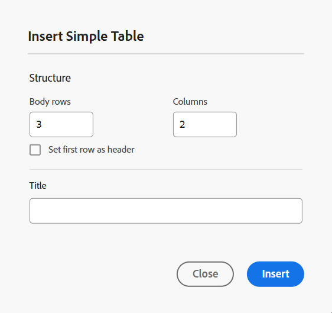
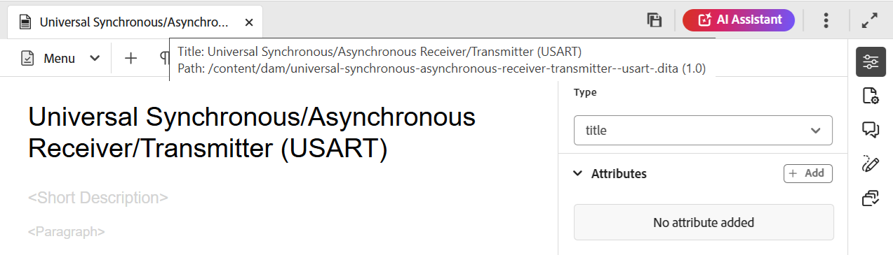
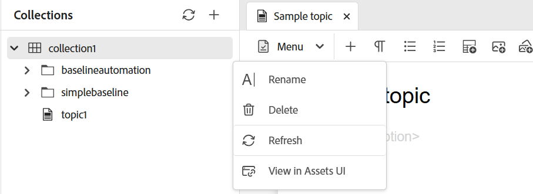
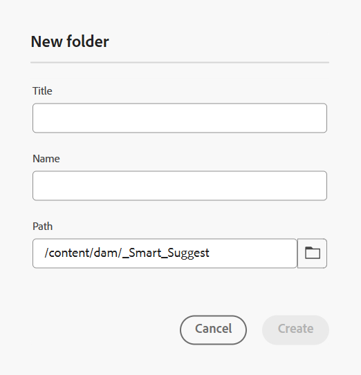
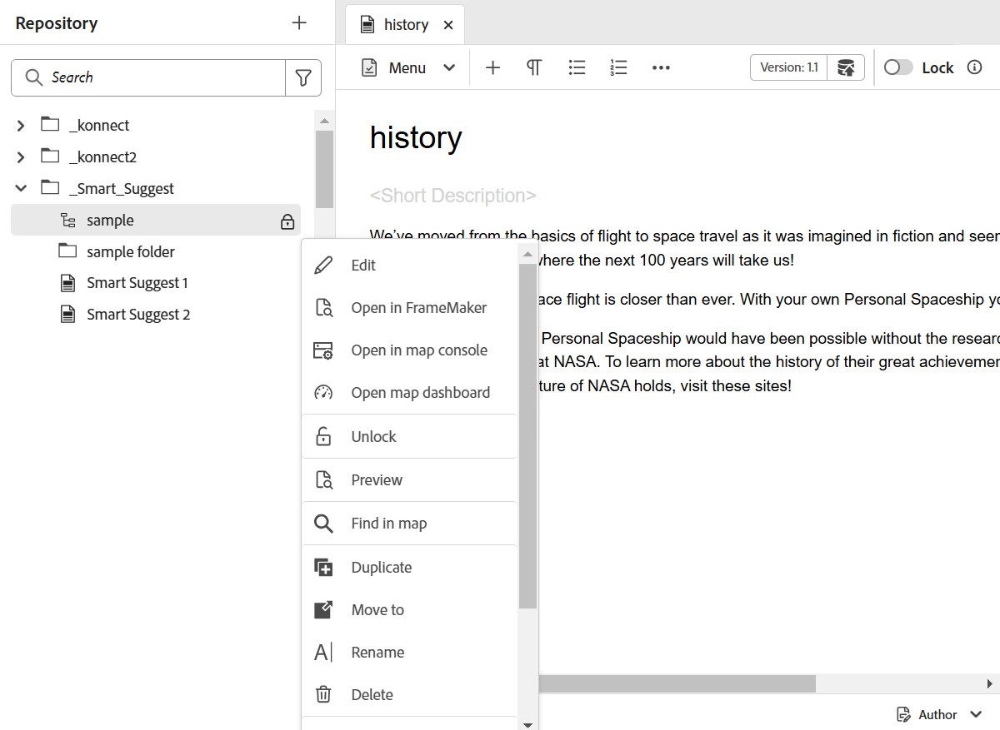
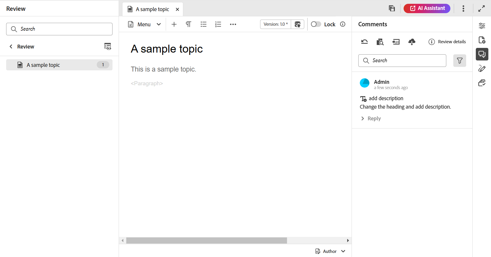
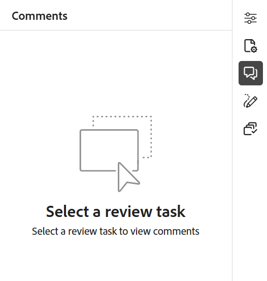

# Conoscere le funzioni dell’editor {#id176NC500V5Z}

Questa sezione descrive le varie funzioni disponibili nell’Editor. L’editor può essere suddiviso nelle sezioni o aree seguenti:

- [Barra intestazione](#header-bar)
- [Barra delle schede](#tab-bar)
- [Barra degli strumenti](#toolbar)
- [Pannello sinistro](#left-panel)
- [Area di modifica dei contenuti](#content-editing-area)
- [Pannello a destra](#right-panel)

La seguente sottosezione descrive in dettaglio le varie sezioni dell’Editor.

## Barra intestazione

La barra dell’intestazione è la barra superiore dell’editor che visualizza il logo Adobe Experience Manager (o Unified Shell se utilizzi Unified Shell come interfaccia utente di Experience Manager Guides). Quando selezioni il logo, viene visualizzata la pagina di navigazione di Experience Manager.


Utilizza l&#39;icona **Espandi** nella barra degli strumenti per nascondere la barra dell&#39;intestazione e ingrandire l&#39;area del contenuto. Per ripristinare la visualizzazione standard, selezionare **Esci dalla visualizzazione espansa**.


## Barra delle schede

La barra delle schede si trova nella parte superiore dell’interfaccia dell’editor e consente di accedere alle seguenti funzioni:


**Schede**

Visualizza gli argomenti correntemente aperti nell&#39;Editor sotto forma di schede di file. È possibile aprire più argomenti contemporaneamente, che vengono visualizzati nelle rispettive schede nella barra delle schede. Per impostazione predefinita, è possibile visualizzare i titoli dei file nelle schede. Passando il puntatore del mouse su un file, potete visualizzare il titolo e il percorso del file come descrizione comando.

>[!NOTE]
>
> In qualità di amministratore, puoi anche scegliere di visualizzare l’elenco dei file per nome nelle schede. Selezionare l&#39;opzione **Nome file** della sezione **Configurazione di visualizzazione file editor** in [Preferenze utente](./intro-home-page.md#user-preferences).

Selezionando la scheda file si apre un menu di scelta rapida con le opzioni Salva come nuova versione, Copia, Individua in, Aggiungi a, Proprietà, Dividi, Scarica come PDF e Chiudi.

**Salva tutto**

Salva le modifiche apportate in tutti gli argomenti aperti. Se nell&#39;editor sono aperti più argomenti, se si seleziona **Salva tutto** o si utilizzano i tasti di scelta rapida **Ctrl**+**S** tutti i documenti vengono salvati con un solo clic. Non è necessario salvare ogni documento singolarmente.

>[!NOTE]
>
> L&#39;operazione **Salva tutto** non crea una nuova versione degli argomenti. Per creare una nuova versione, utilizzare l&#39;opzione **Salva come nuova versione**.

**Assistente IA**

Uno strumento potente e basato sull’intelligenza artificiale progettato per migliorare la produttività tramite funzioni di assistenza e authoring intelligenti. Riunisce due solide funzionalità di intelligenza artificiale, **Authoring** e **Guida**, nell&#39;interfaccia di Experience Manager Guides, consentendo di creare contenuti e accedere alle informazioni dalla documentazione di Experience Manager Guides in modo più rapido ed efficiente.

>[!NOTE]
>
>La funzione Assistente IA è attualmente disponibile per Adobe Experience Manager Guides as a Cloud Service.

**Espandi visualizzazione**: consente di espandere la visualizzazione della pagina utilizzando l&#39;icona **Espandi**. In questa visualizzazione, la barra dell&#39;intestazione contenente il logo Adobe Experience Manager è nascosta. In questo modo si ottimizza lo spazio del contenuto per la modifica. Per tornare alla visualizzazione standard, utilizzare l&#39;icona **Esci dalla visualizzazione espansa**.

**Altre azioni**: ti consente di passare alle **Assets** e **Impostazioni**.

L&#39;opzione **Assets** ti porta a una destinazione basata sulla configurazione:

- **Servizi cloud**: se utilizzi Servizi cloud, quando selezioni l&#39;opzione **Assets** vieni reindirizzato alla pagina di navigazione di AEM.

- **Software on-premise**: se si utilizza Adobe Experience Manager Guides (4.2.1 e versioni successive), se si seleziona l&#39;opzione **Assets**, verrà visualizzato il percorso del file corrente nell&#39;interfaccia utente di Assets.


L&#39;opzione **Impostazioni** è disponibile solo per gli amministratori e gli amministratori dei profili di cartella e consente di configurare le impostazioni seguenti:

>[!NOTE]
>
> Se si stanno aggiornando le impostazioni predefinite, è necessario riaprire i documenti per rendere effettive le modifiche.

- **Generale**: le impostazioni generali consentono di configurare il dizionario da utilizzare con l&#39;editor. Questa scheda contiene quattro sezioni: **Controllo ortografico**, **Condizione**, **Authoring** e **Citazioni**.

  {width="650" align="left"}

   - **Controllo ortografico**: sono disponibili due opzioni: **Controllo ortografico AEM** e **Controllo ortografico browser**. Per impostazione predefinita, l’editor utilizza la funzione di controllo ortografico del browser, in cui il controllo ortografico viene eseguito utilizzando il dizionario integrato del browser. Puoi passare al controllo ortografico di AEM per utilizzare il dizionario Adobe Experience Manager, che può anche essere personalizzato per aggiungere un elenco di parole personalizzato. Per ulteriori informazioni sulla personalizzazione del dizionario AEM, vedere la sezione [Personalizzare il dizionario predefinito di AEM](../cs-install-guide/customize-aem-custom-dictionary.md) nell&#39;area Installare e configurare Adobe Experience Manager Guides as a Cloud Service.

   - **Condizione**

      - **Evidenzia testo condizionale nella visualizzazione Autore**: selezionare questa opzione per evidenziare il testo condizionale nella visualizzazione Autore. Il contenuto condizionale viene evidenziato utilizzando il colore definito per la condizione.

      - **Convalida con attributi di condizione**: selezionare questa opzione per consentire la convalida dei valori definiti per gli attributi. Questo impedisce l’aggiunta di valori errati.

      - **Mostra chiave con titolo nel pannello Schema soggetti**: selezionare questa opzione per visualizzare i tasti insieme ai titoli nello schema soggetti. Se non si seleziona questa opzione, vengono visualizzati solo i titoli. Ad esempio, in questo caso, insieme ai titoli vengono visualizzati anche i tasti &quot;os&quot;, &quot;audience&quot; e &quot;other&quot;.

        {width="550" align="left"}

      - **Mostra schema soggetto nel pannello Condizioni**: selezionare questa opzione per visualizzare uno schema soggetto nel pannello Condizioni. Se deselezionate questa opzione, le condizioni definite vengono visualizzate nel pannello condizioni.

   - **Authoring**

      - **Abilita Sostituisci Tutto**: selezionare questa opzione per visualizzare l&#39;icona **Sostituisci Tutto** nel pannello **Trova e sostituisci**.

   - **Citazioni**
Modificare lo stile delle citazioni. Scegli lo stile di citazione dal menu a discesa che desideri utilizzare nel progetto. Per ulteriori dettagli, visualizzare [Modifica stili citazione](./web-editor-apply-citations.md#change-citation-style).

   - **Assistente IA**
Selezionare questa opzione per abilitare la funzionalità [Assistente AI](./ai-assistant.md) in Experience Manager Guides. Deselezionate questa opzione per disattivare la feature.

**Pannelli**: questa impostazione controlla i pannelli visualizzati nei pannelli sinistro e destro dell&#39;editor e della console Mappa. Puoi attivare o disattivare il pulsante per mostrare o nascondere il pannello desiderato.

{width="650" align="left"}

Potete anche definire l&#39;ordine di visualizzazione delle feature presenti nei pannelli. Per modificare l&#39;ordine di default delle feature disponibili nei pannelli, selezionate le barre punteggiate per trascinare e rilasciare le linguette delle feature nella posizione desiderata. Una funzione può anche essere spostata dalla sezione **Altro** alla sezione principale di un pannello e viceversa in base al requisito. Una volta riordinate, le feature vengono visualizzate nella stessa sequenza nei rispettivi pannelli destro e sinistro.

{width="650" align="left"}


È possibile visualizzare fino a otto pannelli alla volta. Tutte le modifiche apportate alle impostazioni del pannello vengono applicate immediatamente.


>[!NOTE]
>
> Se è stato configurato un pannello personalizzato, viene visualizzato anche nell’elenco dei pannelli. È possibile attivare o disattivare l&#39;opzione per mostrare o nascondere il pannello personalizzato.

- **Elenco elementi**: in qualità di amministratore, puoi controllare l&#39;elenco di elementi che un autore può inserire in un file e definire il nome visualizzato per l&#39;elemento. L&#39;impostazione dell&#39;elenco Elementi consente di specificare il nome dell&#39;elemento in base alle specifiche DITA e un&#39;etichetta che si desidera utilizzare al posto del nome dell&#39;elemento definito DITA:

  {width="650" align="left"}

Nella schermata precedente, all&#39;elemento `p` è stata assegnata un&#39;etichetta di Paragrafo e a `codeblock` viene assegnata un&#39;etichetta di Blocco di codice insieme ad alcuni altri elementi. Se si seleziona l&#39;opzione **Usa solo elementi superiori**, nella finestra di dialogo **Inserisci elemento** verranno visualizzati solo gli elementi validi \(al punto di inserimento corrente\) di questo elenco.

Nella schermata seguente, solo 3 su 4 elementi configurati dalla schermata precedente sono visualizzati nel contesto corrente:

{width="300" align="left"}

- **Elenco attributi**: simile all&#39;elenco degli elementi, è possibile controllare l&#39;elenco degli attributi e i relativi nomi visualizzati da visualizzare nell&#39;elenco degli attributi di un elemento. Nella schermata seguente, solo 3 attributi sono stati configurati per essere visualizzati nell’elenco degli attributi di un elemento:

  {width="650" align="left"}

  Con questa impostazione, quando si tenta di aggiungere un attributo a un elemento, viene visualizzato solo l’elenco degli attributi configurati nell’elenco.

  {width="300" align="left"}

- **Colori**: visualizza un elenco di colori di sfondo preconfigurati per **Condizioni**. Gli utenti possono selezionare un colore di sfondo quando applicano una condizione a un argomento. In qualità di amministratore, puoi anche creare e aggiungere colori di sfondo personalizzati all’elenco. Per aggiungere un nuovo colore, immettere il nome desiderato nel campo **Nome colore**, scegliere un colore personalizzato e selezionare l&#39;icona **+**. Il colore personalizzato verrà visualizzato alla fine dell&#39;elenco dei colori.

- **Profili di pubblicazione**: contiene i profili utilizzabili per pubblicare l&#39;output **Knowledge Base**. È possibile creare un nuovo profilo per una knowledge base di destinazione. Ad esempio, Salesforce o ServiceNow.

   - **Crea un profilo Salesforce**

     **Prerequisiti**

      - Crea un&#39;app connessa per Salesforce. Per ulteriori dettagli, consulta [Abilitare le impostazioni OAuth per l&#39;integrazione API](https://help.salesforce.com/s/articleView?id=sf.connected_app_create_api_integration.htm&type=5).

      - Durante la configurazione dell’app connessa, verifica quanto segue:

         - Specifica il callback.

           `URL: http://<server name>:<port>/bin/dxml/thirdparty/callback/salesforce`

         - Selezionate i seguenti ambiti OAuth:
            - Accesso completo (completo)
            - Seleziona Gestisci dati utente tramite API (api)

     Una volta configurata l&#39;app, Salesforce fornisce **Chiave consumer** e **Segreto consumer**. Possono essere utilizzati per creare il profilo Salesforce.


   - Per creare un profilo Salesforce, selezionare la Knowledge Base **Salesforce** dal menu a discesa **Tipo di server**. Immettere un nome di profilo. Nell&#39;**URL sito**, immettere il sito consumer da utilizzare per pubblicare l&#39;output, quindi aggiungere la **Chiave consumer** e il **Segreto consumer** forniti dal sito consumer di Salesforce. Quindi **Convalida** e **Salva** il nuovo profilo creato.

     {width="550" align="left"}

     >[!NOTE]
     >
     >Per configurare un proxy per Salesforce in Experience Manager Guides, utilizza la configurazione proxy dei componenti HTTP Apache in AEM. Scopri come [configurare il proxy per AEM Link Checker](https://helpx.adobe.com/experience-manager/kb/How-to-configure-proxy-for-the-AEM-Link-Checker-AEM.html).


   - **Creare un profilo ServiceNow**

     **Prerequisiti**

     Configura il server ServiceNow per caricare le risorse.
      - Connetti al server **ServiceNow**.
      - Passa a **Proprietà di sistema** > **Sicurezza**.
      - Deseleziona la seguente opzione:

        **Questa proprietà deve essere impostata per attivare la verifica del tipo MIME per i caricamenti (tutte le versioni Eureka e successive). Abilita (true) o disabilita (false) la convalida del tipo MIME per i file allegati. Le estensioni file configurate tramite glide.attachment.extensions verranno controllate per verificare la presenza di tipi MIME durante il caricamento.**

      - Seleziona **Salva**.

     Dopo aver configurato l&#39;app, crea il profilo **ServiceNow**.

   - Per creare un profilo, selezionare la Knowledge Base ServiceNow dal menu a discesa **Tipo di server**. Immetti un profilo **Nome**. Nell&#39;**URL ServiceNow**, immettere il sito consumer da utilizzare per la pubblicazione dell&#39;output, quindi aggiungere **Nome utente** e **Password** forniti dal sito consumer ServiceNow. Quindi **Convalida** e **Salva** il nuovo profilo creato.

     {width="550" align="left"}

  Dopo la convalida, è possibile selezionare il profilo di pubblicazione nei predefiniti di output di una mappa DITA e utilizzarlo per generare l&#39;output nel server **Salesforce** o **ServiceNow** scelto.

  Ulteriori informazioni sul predefinito di output [Knowledge Base](../user-guide/generate-output-knowledge-base.md).


- **Convalida**: questa scheda contiene le opzioni per configurare le convalide Schematron nell&#39;Editor. È possibile attivare le seguenti funzionalità:

   - **Eseguire il controllo di convalida prima di salvare il file**: selezionare questa opzione per eseguire le convalide Schematron utilizzando i file Schematron selezionati prima di eseguire qualsiasi operazione di salvataggio. Potete aggiungere un file Schematron selezionando l&#39;icona +. Vengono elencati i file Schematron selezionati.

     >[!NOTE]
     >
     >I file Schematron selezionati persisteranno per il profilo di cartella selezionato.

     {width="550" align="left"}

     In questo modo si impedisce agli utenti di salvare qualsiasi file che non rispetti una regola definita nei file Schematron selezionati. Se questa opzione non è selezionata, il file non verrà convalidato prima di salvare le modifiche.

   - **Consenti a tutti gli utenti di aggiungere file schematron nel pannello di convalida**: selezionare questa opzione per consentire agli utenti di aggiungere qualsiasi file Schematron nel pannello di convalida dell&#39;editor. Questo consente agli utenti di aggiungere file Schematron e quindi convalidare gli argomenti rispetto al file Schematron. Se questa opzione non è selezionata, l&#39;opzione per aggiungere il file schematron **Aggiungi file schematron** non è disponibile per gli utenti nel **pannello di convalida** dell&#39;editor.


- **Visualizza attributi**: come l&#39;elenco Attributi, è possibile controllare l&#39;elenco degli attributi da visualizzare nell&#39;elenco degli attributi di un elemento. Per impostazione predefinita, quattro **Attributi di visualizzazione**: pubblico, piattaforma, prodotto e proprietà sono stati configurati per essere visualizzati nell&#39;elenco degli attributi di un elemento. Puoi anche aggiungere un attributo di visualizzazione utilizzando l&#39;icona **Aggiungi** nella parte superiore. Puoi anche eliminare gli attributi di visualizzazione utilizzando l&#39;icona **Elimina**.

  Gli attributi definiti per un elemento vengono visualizzati nella vista Layout e Struttura.

  {width="550" align="left"}

- **Traduzione**: questa scheda contiene le opzioni per creare gruppi di lingue, propagare le etichette di origine alla versione di destinazione e ripulire il progetto di traduzione.

  {width="550" align="left"}

   - **Gruppi di lingue**: in qualità di amministratore, puoi creare un gruppo di lingue e utilizzarle come set per tradurre il contenuto.

     Per creare un nuovo gruppo di lingue, effettuare le operazioni riportate di seguito.

      1. Seleziona **Aggiungi**.
      1. Immettere il nome del gruppo di lingue. Ogni lingua deve avere un nome univoco. È possibile visualizzare un errore se il campo del nome è vuoto o se il nome non è univoco.
      1. Seleziona le lingue dal menu a discesa. È possibile selezionare più lingue.

         Digita i primi caratteri della lingua o il codice della lingua per filtrare le lingue desiderate. Digitare ad esempio &#39;en&#39; per filtrare tutte le lingue che contengono &#39;en&#39; all&#39;inizio del nome o del codice.

      1. Selezionate l&#39;icona Fine (Done) per aggiungere le lingue selezionate al gruppo. Vengono visualizzate le lingue. Quando si aggiungono tre o più lingue, viene visualizzata l&#39;opzione **Mostra altro**. È possibile selezionare **Mostra altro** per visualizzare tutte le lingue presenti nel gruppo.

         >[!TIP]
         >
         >Attiva **Mostra altro** in **Mostra meno** e visualizza solo alcune lingue.

      1. Passa il puntatore del mouse sulle lingue di un gruppo per modificare  o eliminare  i gruppi di lingue.
      1. Salva le **impostazioni**.

         >[!NOTE]
         >
         >In qualità di utente, puoi visualizzare i gruppi di lingue configurati nel tuo profilo di cartella.

   - **Propagare le etichette della versione di origine alla versione di destinazione**: selezionare questa opzione per passare l&#39;etichetta della versione del file di origine al file tradotto. Per impostazione predefinita, questa opzione è disabilitata.
   - **Pulizia del progetto di traduzione dopo il completamento**: seleziona questa opzione per configurare i progetti di traduzione da disabilitare o eliminare automaticamente dopo la traduzione. Per impostazione predefinita, è selezionato **Nessuno**, in modo che il progetto esista dopo la traduzione.

     Puoi disattivare i progetti di traduzione se desideri utilizzarli in un secondo momento. L’eliminazione di un progetto comporta l’eliminazione definitiva di tutti i file e le cartelle presenti nel progetto.


- **Metadati**: è possibile controllare i metadati della versione dell&#39;argomento e i relativi valori da visualizzare nella finestra di dialogo **Cronologia versioni**.  Nel percorso metadati, specifica la posizione dei nodi da cui desideri scegliere i metadati. Puoi anche definire un nome personalizzato per i metadati come etichetta. Le proprietà predefinite sono Titolo, Stato documento e Tag.

  I metadati possono essere scelti da qualsiasi proprietà sotto il nodo `/jcr:content` della risorsa, in modo da poter aggiungere il percorso della proprietà come percorso dei metadati.


  Se il percorso dei metadati è vuoto, viene visualizzato un errore. Se si lascia vuota l&#39;etichetta, l&#39;ultimo elemento viene scelto come etichetta.


  {width="550" align="left"}

  *Configurare i metadati per la finestra di dialogo **Cronologia versioni**.*


  Puoi anche definire l’ordine in cui vengono visualizzati questi tag di metadati. Per modificare l’ordine predefinito di questi tag, seleziona le barre punteggiate per trascinare i tag nella posizione desiderata.
Le etichette metadati vengono visualizzate nella stessa sequenza nella finestra di dialogo **Cronologia versioni** dell&#39;editor.

## Barra degli strumenti

La barra degli strumenti viene visualizzata quando si apre un argomento o una mappa per la modifica nell&#39;editor. Le funzioni disponibili nella barra degli strumenti sono le seguenti:

- [Menu a discesa](#menu-dropdown)
- [Opzioni di inserimento contenuti](#content-insertion-options)
- [Informazioni sulla versione e pulsante Salva come nuova versione](#save-as-new-version)
- [Blocca/sblocca](#lockunlock)

>[!NOTE]
>
> Le funzioni elencate sopra sono applicabili solo ai file di argomento. Quando si lavora con un file mappa, nella barra degli strumenti vengono visualizzate opzioni diverse in base alla vista dell’editor mappa corrente. Scopri le opzioni della barra degli strumenti dell&#39;editor mappe nel documento [Funzioni dell&#39;editor mappe](./map-editor-advanced-map-editor.md).

### Menu a discesa

Il menu a discesa consente di accedere alle azioni di modifica, Trova e sostituisci, Cronologia versioni, Etichetta versione, Unione, Crea attività di revisione, Traccia modifiche e Funzione tag.

La spiegazione dettagliata di queste caratteristiche è la seguente:

**Modifica delle azioni**

Durante la modifica di un argomento nell&#39;editor, accedere alle varie azioni di modifica, ad esempio **Taglia** o ***Ctrl***+***X*** , **Copia** o ***Ctrl***+***C*** , **Annulla** o ***Ctrl***+***Z*** , **Ripristina** o ***Ctrl***+***Y*** e **Elimina** presente nel menu a discesa.


**Trova e sostituisci**

La funzionalità **Trova e sostituisci** è disponibile nelle modalità di visualizzazione Creazione e Source. Quando questa opzione è attivata, la barra di testo Trova e sostituisci viene visualizzata nella parte inferiore dell&#39;area di modifica dell&#39;argomento. È possibile utilizzare i tasti di scelta rapida **CTRL**+**F** per richiamare la barra Trova e sostituisci.

{align="left"}

Utilizzando l&#39;icona delle impostazioni \(\), è possibile attivare/disattivare le opzioni di ricerca **Ignora maiuscole/minuscole** e **Solo parole intere**. Per eseguire la ricerca senza distinzione tra maiuscole e minuscole, attivare o selezionare l&#39;opzione **Ignora maiuscole/minuscole**. Altrimenti, se si desidera eseguire la ricerca con distinzione tra maiuscole e minuscole, disattivare (o deselezionare) l&#39;opzione **Ignora maiuscole/minuscole**. È inoltre possibile scegliere di cercare una parola intera.

La ricerca è istantanea, il che significa che quando si digita la frase o la parola di ricerca nel campo **Trova**, il termine viene immediatamente cercato e selezionato nell&#39;argomento. Analogamente, per sostituire un testo nell&#39;argomento, immettere il termine di ricerca e la sua sostituzione nei rispettivi campi e selezionare il pulsante **Sostituisci** o **Sostituisci tutto**.

Nella visualizzazione Source, la funzionalità **Trova e sostituisci** è estremamente utile per la ricerca di un elemento o un attributo specifico. Ad esempio, se desideri sostituire il valore dell&#39;attributo `@product`, puoi eseguirlo facilmente dalla vista Source. La visualizzazione Autore non consente di eseguire ricerche sulla base di un attributo o di un elemento. Tuttavia, è necessario prestare attenzione quando si utilizza la funzionalità **Sostituisci tutto**, in quanto potrebbe sovrascrivere il codice XML.

**Cronologia versioni**

La funzionalità **Cronologia versioni** nell&#39;editor consente di controllare le versioni disponibili dei file DITA, confrontarli e ripristinare qualsiasi versione dall&#39;editor stesso. Puoi confrontare il contenuto e i metadati della versione corrente (che può anche essere una copia di lavoro) con qualsiasi versione precedente dello stesso file. Puoi anche visualizzare le etichette e i commenti per le versioni confrontate.

>[!NOTE]
>
> Le opzioni della cronologia delle versioni vengono visualizzate solo se sono state apportate modifiche alla prima versione dell&#39;argomento o della mappa.

Per accedere alla cronologia delle versioni e ripristinare una versione specifica dell&#39;argomento, effettuare le seguenti operazioni:

1. Aprire un argomento nell&#39;editor.
1. Seleziona **Cronologia versioni** dal menu a discesa **Menu**.

   Viene visualizzata la finestra di dialogo **Cronologia versioni**.

   {width="550" align="left"}

   *Visualizzare in anteprima le modifiche nelle diverse versioni di un argomento.*

1. Scegliere una versione dell&#39;argomento da confrontare o ripristinare nell&#39;elenco a discesa **Confronta con**.

   >[!NOTE]
   >
   > Se a una versione sono applicate etichette, queste vengono visualizzate anche \(tra parentesi\) insieme al numero di versione.

1. Abilita l&#39;opzione **Visualizza etichette e commenti** per visualizzare le etichette e i commenti applicati alle versioni corrente e confrontata.
1. È inoltre possibile visualizzare le informazioni seguenti nella finestra di dialogo **Cronologia versioni**:

   Scheda **Anteprima**: il contenuto appena aggiunto è in verde e il contenuto eliminato in rosso.

   Scheda **Metadati**: i metadati appena aggiunti sono in verde e quelli eliminati in rosso.

   {width="550" align="left"}

   *Confrontare i metadati di diverse versioni nella cronologia delle versioni.*

   >[!NOTE]
   >
   > L&#39;amministratore di sistema può modificare i metadati da visualizzare dalla scheda Metadati in **Impostazioni**. Per ulteriori informazioni, consulta la sezione **Altre azioni** della [Barra delle schede](#tab-bar).

   Puoi anche visualizzare i dettagli dell’utente e dell’ora della versione corrente e della versione confrontata.

   Dopo aver scelto una versione dall&#39;elenco a discesa, è disponibile l&#39;opzione **Ripristina versione selezionata**. Nella finestra di anteprima vengono visualizzate le differenze tra la versione corrente e la versione selezionata dell&#39;argomento.

1. Seleziona **Ripristina la versione selezionata** per ripristinare la copia di lavoro con la versione selezionata dell&#39;argomento.

   Viene visualizzata la finestra di dialogo Ripristina versione.

   {width="550" align="left"}

1. \(*Facoltativo*\) Fornire un motivo per ripristinare una versione precedente. È inoltre possibile creare una nuova versione della copia di lavoro attiva dell&#39;argomento.

1. Seleziona **Conferma.**

   La copia di lavoro del file viene ripristinata alla versione selezionata. Se si sceglie di creare una nuova versione della copia di lavoro attiva, viene creata anche una nuova versione del file con tutte le modifiche di lavoro.

   Quando si ripristina una versione precedente, viene visualizzato un segnale visivo che indica che la versione su cui si sta lavorando non è quella più recente.

   {align="left"}

**Etichette versione**

Le etichette consentono di identificare la fase in cui un particolare argomento si trova nel DDLC (Document Development Life Cycle). Ad esempio, quando si lavora su un argomento, è possibile impostare l&#39;etichetta come &quot;Approvato&quot;. Quando un argomento viene pubblicato e reso disponibile ai clienti, puoi assegnare l’etichetta &quot;Rilasciato&quot; a tale argomento.

Experience Manager Guides consente di specificare etichette in formato testo libero o di utilizzare un set di etichette predefinite. L’etichetta personalizzata consente a qualsiasi autore nel sistema di specificare un’etichetta in base alla propria scelta. Questo offre flessibilità, ma introduce etichette non coerenti nel sistema. Per risolvere questo problema, gli amministratori possono configurare un set di etichette predefinite. Per ulteriori informazioni sulla configurazione delle etichette predefinite, visualizzare *Configurare e personalizzare l&#39;editor Web XML* in Installare e configurare Adobe Experience Manager Guides as a Cloud Service.

Queste etichette vengono visualizzate sotto forma di elenco a discesa agli autori ogni volta che devono specificare un’etichetta. In questo modo nel sistema verranno utilizzate solo etichette coerenti e predefinite.

Esistono diversi metodi tramite i quali è possibile applicare etichette agli argomenti: [Pannello Cronologia versioni](web-editor-use-label.md) nell&#39;interfaccia utente di Assets, [Interfaccia baseline](/help/product-guide/user-guide/generate-output-use-baseline-for-publishing.md) e nell&#39;editor. La funzione Etichetta versione nell’editor consente agli autori di assegnare etichette ai loro argomenti in modo rapido e semplice.

Per aggiungere etichette all&#39;argomento dall&#39;editor, effettuare le seguenti operazioni:

1. Aprire un argomento nell&#39;editor.

1. Seleziona **Etichette versione** dal menu a discesa.

   Viene visualizzata la finestra di dialogo Gestione etichette versione.

   {width="650" align="left"}

   La finestra di dialogo Gestione etichette versione è suddivisa in due parti: nel pannello a sinistra è disponibile un elenco di versioni per l&#39;argomento con l&#39;elenco a discesa delle etichette \(o una casella di testo per immettere un&#39;etichetta\) e nel pannello a destra con un&#39;anteprima dell&#39;argomento.

1. Selezionare la versione alla quale si desidera applicare le etichette.

   Quando si sceglie una versione diversa dell&#39;argomento dall&#39;elenco delle versioni, nel pannello di anteprima vengono visualizzate le modifiche tra la versione corrente e la versione selezionata dell&#39;argomento

   >[!NOTE]
   >
   > Se un&#39;etichetta è già applicata a una versione, viene visualizzata accanto al numero di versione nell&#39;elenco a discesa e sotto l&#39;elenco Seleziona versione. È possibile rimuovere un&#39;etichetta esistente selezionando l&#39;icona \(**x**\) accanto all&#39;etichetta.

1. Se l&#39;amministratore ha definito un elenco di etichette, viene visualizzato un elenco a discesa delle etichette da cui è possibile scegliere le etichette da applicare. Puoi selezionare più etichette dall’elenco a discesa.

   Viene inoltre visualizzata una casella di testo in cui è possibile immettere le etichette che si desidera aggiungere all&#39;argomento.

   >[!NOTE]
   >
   > Non è possibile applicare la stessa etichetta a più versioni di un argomento. Se si tenta di associare un&#39;etichetta esistente, è possibile rimuoverla dalla versione esistente e applicarla alla versione selezionata dell&#39;argomento.

1. Selezionare **Aggiungi etichetta**.

1. Nel messaggio di conferma Applica etichetta, selezionare l&#39;opzione **Sposta etichetta (se utilizzata in un&#39;altra versione)** per spostare le etichette da una versione esistente alla versione selezionata. Se non si seleziona questa opzione e sono presenti etichette assegnate a una versione diversa dell&#39;argomento, tali etichette non verranno spostate nella versione dell&#39;argomento selezionato. Tali etichette vengono ignorate nel processo di applicazione delle etichette.

**Unisci**

Quando si lavora in un ambiente con più autori, diventa difficile tenere traccia delle modifiche apportate da altri autori in un argomento o in una mappa. La funzione di unione consente di controllare non solo le modifiche, ma anche le modifiche mantenute nell&#39;ultima versione del documento.

- **Unisci file argomenti**

  Per unire le modifiche in un argomento, effettuare le seguenti operazioni:

   1. Aprire un argomento nell&#39;editor.

   1. Seleziona **Unisci**.

      Viene visualizzata la finestra di dialogo Unisci.

      {width="550" align="left"}

   1. *\(Facoltativo\)* È inoltre possibile sfogliare e selezionare un nuovo file da un&#39;altra posizione nell&#39;archivio.

   1. Selezionare una versione del file con cui si desidera confrontare la versione corrente del file.

   1. In Opzioni, scegliere:

      - **Rileva modifiche dalla versione selezionata**: questa opzione mostra tutti gli aggiornamenti di contenuto sotto forma di revisioni. È quindi possibile scegliere di accettare o rifiutare le modifiche nel documento una alla volta o tutte contemporaneamente.

      - **Ripristina la versione selezionata**: questa opzione ripristina la versione corrente del documento alla versione selezionata. Questa opzione non consente di controllare quale contenuto viene accettato o rifiutato.

   1. Seleziona **Fine**.

   1. Se hai selezionato l&#39;opzione **Rileva modifiche dalla versione selezionata**, tutte le modifiche dalla versione selezionata vengono visualizzate nella funzione Tracciamento modifiche nel pannello di destra.

      Potete scegliere di accettare o rifiutare tutti i commenti dal pannello Modifiche tracciate oppure accettare o rifiutare un singolo commento.


- **Unisci file mappa**

  Per unire le modifiche in un file di mappa, effettuare le seguenti operazioni:

   1. Apri una mappa nell’editor.

   1. Seleziona **Unisci**.

      Viene visualizzata la finestra di dialogo Unisci (Merge).

      {width="550" align="left"}

   1. *\(Facoltativo\)* È inoltre possibile sfogliare e selezionare un nuovo file da un&#39;altra posizione nell&#39;archivio.

   1. Selezionare una versione del file con cui si desidera confrontare la versione corrente del file.

   1. In Opzioni, scegliere:

      - **Rileva modifiche dalla versione selezionata**: questa opzione mostra tutti gli aggiornamenti del contenuto sotto forma di revisioni. È quindi possibile scegliere di accettare o rifiutare le modifiche nel documento una alla volta o tutte contemporaneamente.

      - **Ripristina la versione selezionata**: questa opzione ripristina la versione corrente del documento alla versione selezionata. Questa opzione non consente di controllare quale contenuto viene accettato o rifiutato.

   1. Seleziona **Fine**.

   1. Se hai selezionato l&#39;opzione **Rileva modifiche dalla versione selezionata**, tutte le modifiche dalla versione selezionata vengono visualizzate nel pannello Revisioni \(a destra\).

      Potete scegliere di accettare o rifiutare tutte le modifiche dal pannello Revisioni tracciate oppure accettare o rifiutare singole modifiche nel file di mappa.


**Crea attività di revisione**

Puoi [creare un&#39;attività di revisione](./review-send-topics-for-review.md) dell&#39;argomento corrente o mappare il file direttamente dall&#39;editor. Aprire il file per il quale si desidera creare l&#39;attività di revisione e selezionare **Crea attività di revisione** dal menu a discesa per avviare il processo di creazione della revisione.

**Rileva modifiche**

È possibile tenere traccia di tutti gli aggiornamenti apportati a un documento abilitando la modalità Revisioni. Dopo aver abilitato le modifiche di traccia, tutti gli inserimenti e le eliminazioni vengono acquisiti nel documento. Tutto il contenuto eliminato viene evidenziato con il metodo Barrato e tutti gli inserimenti vengono evidenziati in verde. Vengono inoltre visualizzate le barre di modifica sul bordo della pagina dell&#39;argomento. Di nuovo, viene visualizzata una barra rossa per il contenuto eliminato e una barra verde per il contenuto aggiunto. Nel caso in cui vi sia un&#39;aggiunta e un&#39;eliminazione sulla stessa riga, vengono visualizzate entrambe le barre verdi e rosse.

La schermata seguente evidenzia il contenuto eliminato e inserito insieme alle barre di modifica:

{width="650" align="left"}

Un caso d’uso tipico per il tracciamento delle modifiche in un documento può essere la revisione tra pari. È possibile abilitare la registrazione delle modifiche e condividere il documento per la revisione, quindi il revisore apporta le modifiche con la registrazione delle modifiche attivata. Quando ricevi il documento, dovresti disporre di un meccanismo per visualizzare gli aggiornamenti suggeriti e di un modo pratico per accettare o rifiutare le modifiche.

In Experience Manager Guides è disponibile la funzione Tracked changes che contiene informazioni sugli aggiornamenti apportati nel documento. La funzione Tracked changes (Modifiche tracciate) fornisce informazioni sugli aggiornamenti effettuati, su chi li ha effettuati e in quale momento. Tramite la funzione Modifiche rilevate, è inoltre possibile accettare o rifiutare facilmente gli aggiornamenti suggeriti nel documento.

Per accedere alla funzione, seleziona l&#39;icona **Rileva modifiche** nel pannello di destra.

{width="300" align="left"}

Se si seleziona una revisione, viene selezionato il contenuto modificato nel documento. Potete accettare una modifica selezionando l&#39;icona Accetta modifica (Accept Change) oppure rifiutarla selezionando Rifiuta modifica (Rifiuta change).

Per accettare o rifiutare tutte le modifiche con un solo clic, selezionare **Accetta tutte le modifiche** o **Rifiuta tutte le modifiche**.

>[!NOTE]
>
> La modalità Anteprima consente di visualizzare il documento con o senza i markup del contenuto modificato. Per ulteriori dettagli, visualizzare la modalità [Anteprima](web-editor-views.md#preview-mode-id19AAGL00163).

**Tag**

La funzionalità **Tag** nell&#39;editor è un interruttore che controlla la visibilità degli elementi DITA. Quando questa opzione è attivata, visualizza i tag strutturali all&#39;interno del contenuto, consentendo di visualizzare e gestire gli elementi DITA sottostanti in modo più efficace. Se l’opzione è disabilitata, l’editor nasconde questi tag, fornendo un ambiente di authoring più pulito e mirato.

La schermata seguente mostra un documento con la vista Tag abilitata:

{width="650" align="left"}

In un documento con tag è possibile eseguire le operazioni seguenti:

- **Seleziona un elemento**: seleziona il tag di apertura o chiusura di un elemento per selezionarne il contenuto.

- **Espandere o comprimere i tag**: selezionare il segno + o - per espandere o comprimere un tag.

- **Utilizza il menu di scelta rapida**: il menu di scelta rapida fornisce le opzioni per tagliare, copiare o incollare l&#39;elemento selezionato. Puoi anche inserire un elemento prima o dopo l’elemento selezionato. Le altre opzioni consentono di generare ID o aprire il pannello Proprietà per l’elemento selezionato.

- **Trascina gli elementi**: seleziona il tag di un elemento e trascinalo facilmente sul documento. Se la posizione di rilascio è una posizione valida in cui l’elemento è consentito, l’elemento viene posizionato nella posizione di rilascio.


>[!NOTE]
>
> Se un utente abilita la vista Tag dall’editor, questa rimane abilitata anche nelle sessioni. Ciò significa che non è necessario abilitare nuovamente la visualizzazione Tag per accedervi in un secondo momento. Il valore predefinito per la visualizzazione Tag per una nuova sessione utente è determinato dalla proprietà `tagsView` nel file `ui\_config.json`. Per ulteriori dettagli, vedi la sezione [Configurare il valore predefinito per la visualizzazione Tag](../cs-install-guide/configure-default-value-tags-view.md) in Installare e configurare Adobe Experience Manager Guides as a Cloud Service.

### Opzioni di inserimento contenuti

**Elemento** - 

Inserisce un elemento valido nella posizione valida corrente o successiva. È inoltre possibile utilizzare la scelta rapida da tastiera ***Alt***+***Invio*** per aprire la finestra di dialogo Elemento. Ad esempio, si sta modificando un paragrafo, quindi nella finestra di dialogo **Elemento** viene visualizzato un elenco di elementi che è possibile inserire nel paragrafo. Seleziona l’elemento da inserire. Puoi usare la tastiera per scorrere l&#39;elenco degli elementi e premere ***Invio*** per inserire l&#39;elemento richiesto.

Puoi visualizzare due tipi di elementi validi:

- **Elementi validi nella posizione corrente**: nell&#39;elenco vengono visualizzati gli elementi che è possibile inserire nella posizione corrente del cursore.

- **Elementi validi al di fuori del percorso corrente**: nell&#39;elenco vengono visualizzati gli elementi che è possibile inserire dopo qualsiasi elemento padre per l&#39;elemento corrente all&#39;interno della gerarchia degli elementi.

Ad esempio, se ti trovi all&#39;interno dell&#39;elemento in linea `<b>`, puoi inserire elementi come `<u>`, `<xref>`, `<i>` nella posizione corrente. È invece possibile inserire elementi come `<table>` e `<topic>` al di fuori del percorso corrente.

È inoltre possibile digitare un carattere o una stringa nella casella di ricerca e cercare gli elementi che iniziano con essa.

{width="300" align="left"}

*Immettere &#39;t&#39; per cercare tutti gli elementi validi che iniziano con &#39;t&#39;.*

Se si lavora all&#39;interno di un elemento blocco come `note`, utilizzare l&#39;icona Inserisci elemento per inserire un nuovo elemento dopo l&#39;elemento `note`. Nella schermata seguente è stato inserito un elemento nota all’interno dell’elemento p \(paragrafo\):

{align="left"}

Se si preme Invio nell&#39;elemento nota, viene creato un nuovo paragrafo all&#39;interno dell&#39;elemento nota stesso. Per inserire un nuovo elemento all&#39;esterno di una nota, seleziona l&#39;elemento p \(evidenziato nella schermata\) nella breadcrumb degli elementi, quindi seleziona l&#39;icona Elemento o premi ***Alt***+***Invio*** per aprire la finestra di dialogo Inserisci elemento. Quindi, selezionate l&#39;elemento desiderato e premete Invio per inserire l&#39;elemento selezionato dopo l&#39;elemento nota.

È inoltre possibile aggiungere un elemento tra due elementi quando viene visualizzato un cursore a blocchi lampeggiante.


{width="300" align="left"}

Ad esempio, se si sta lavorando su un argomento DITA e il cursore di blocco lampeggia tra la breve descrizione e il corpo, è possibile aggiungere l&#39;elemento `prolog` e quindi aggiungere il copyright, l&#39;autore e altri dettagli.

Un altro modo per immettere un nuovo elemento consiste nell’utilizzare il menu di scelta rapida. Fare clic con il pulsante destro del mouse in qualsiasi punto del documento per richiamare il menu di scelta rapida. Da questo menu scegliere **Inserisci elemento** per visualizzare la finestra di dialogo **Inserisci elemento** e scegliere l&#39;elemento che si desidera inserire.

{width="300" align="left"}

**Paragrafo** - 

Inserisce l&#39;elemento paragrafo nella posizione corrente o successiva valida.

**Elenco puntato** - 

Crea un elenco puntato nel percorso valido corrente o successivo. Se ti trovi in un elenco puntato e fai clic su questa icona, l’elemento viene convertito in un paragrafo normale.

**Elenco numerato** - 

Crea un elenco numerato nel percorso valido corrente o successivo. Se fai parte di un elenco numerato e fai clic su questa icona, l’elemento viene convertito in un paragrafo normale.

>[!NOTE]
>
>È inoltre possibile selezionare l&#39;opzione **Dividi elenco** dal menu di scelta rapida di una voce di elenco per dividere l&#39;elenco corrente e iniziare un nuovo elenco allo stesso livello.

**Tabella** - 

Inserisce una tabella nella posizione valida corrente o successiva. Selezionare l&#39;icona Tabella per aprire la finestra di dialogo Inserisci tabella semplice.

{width="550" align="left"}

>[!NOTE]
>
> È inoltre possibile copiare una tabella da MS Word o Excel e incollarla nel file degli argomenti di Experience Manager Guides. La tabella copiata verrà incollata come `<simpletable>` o `<tgroup>` a seconda delle impostazioni configurate nella configurazione dell&#39;editor XML. Per ulteriori dettagli, visualizzare [Configurare la visualizzazione delle tabelle incollate](../cs-install-guide/conf-pasted-tables.md).

È possibile specificare il numero di righe e colonne richieste nella tabella. Se si desidera mantenere la prima riga come intestazione di tabella, selezionare l&#39;opzione **Imposta prima riga come intestazione**. Per aggiungere un titolo alla tabella, immetterlo nel campo Titolo.

Una volta inserita una tabella, è possibile modificarla utilizzando il menu di scelta rapida.

{width="550" align="left"}


Utilizzando il menu di scelta rapida della tabella, è possibile:

- Inserisci celle, righe o colonne

- Unire le celle nelle direzioni destra e giù

- Dividi celle in orizzontale o in verticale

- Eliminare celle, righe o colonne

- Genera ID


È inoltre possibile definire attributi su più celle, righe intere o colonne di una tabella. Ad esempio, per allineare la cella della tabella, trascinare e selezionare la cella desiderata. Nel pannello Proprietà contenuto (a destra), la proprietà **Type** diventa **entry**.

1. Nella sezione **Attributi**, seleziona **+Aggiungi**.
1. Selezionare l&#39;attributo `@valign` dall&#39;elenco a discesa **Attributo**.
1. Dall&#39;elenco a discesa valore, selezionare l&#39;allineamento del testo che si desidera applicare alle celle di tabella selezionate.
1. Seleziona **Aggiungi.**

{align="left"}

**Immagine** - 

Inserisce un&#39;immagine nel percorso valido corrente o successivo. Selezionare l&#39;icona Immagine per aprire la finestra di dialogo Inserisci immagine, quindi cercare e selezionare l&#39;immagine da inserire.

>[!NOTE]
>
> Puoi anche aggiungere un’immagine trascinandola dal sistema locale sull’articolo. In questo caso, il file di immagine viene aggiunto utilizzando il flusso di lavoro **Carica Assets**.  Per ulteriori dettagli, visualizza il flusso di lavoro **Carica Assets** nella sezione [Pannello sinistro](#left-panel).


{width="650" align="left"}

Potete aggiungere un titolo immagine/figura e un testo alternativo per l&#39;immagine nella finestra di dialogo Inserisci immagine.

>[!NOTE]
>
> Quando si inserisce un&#39;immagine e si specifica un testo alternativo per lo stesso elemento, questo viene aggiunto all&#39;interno dell&#39;elemento `<alt>` in conformità agli standard DITA più recenti. L&#39;utilizzo dell&#39;attributo `@alt` per il testo alternativo è obsoleto, ma rimane supportato nelle versioni DITA precedenti.

Utilizzando l&#39;opzione **Seleziona file**, è possibile cercare il file di immagine richiesto in base al nome del file. Puoi anche filtrare i risultati della ricerca per Percorso \(per cercare in\), Raccolte, Tipo file e Tag. Dopo aver trovato il file di immagine richiesto, selezionare il file e scegliere **Seleziona** per inserire l&#39;immagine nel documento. È possibile inserire vari formati di file immagine, ad esempio `.png`, `.svg`, `.gif`, `.jpg`, `.eps`, `.ai`, `.psd` e altri.

Dopo aver inserito un&#39;immagine, potete modificarne l&#39;altezza, la larghezza, il posizionamento e gli attributi dal pannello Proprietà contenuto. Seleziona il file di immagine e apporta le modifiche desiderate nel pannello Proprietà contenuto nel pannello di destra.

{align="left"}

Nel campo Source viene visualizzato l’UUID del file immagine inserito. Per trovare il percorso completo del file immagine inserito, posizionare il puntatore del mouse sul campo Source. Il percorso viene visualizzato nella descrizione comando.

Per ridimensionare un&#39;immagine, specificate Altezza (Height) o Larghezza (Width) per il file di immagine. Le proporzioni dell&#39;immagine vengono mantenute automaticamente. Se lo desideri, puoi anche scegliere di non mantenere le proporzioni del file di immagine selezionando l’icona del lucchetto \(di Mantieni proporzioni\) e fornendo i valori di Altezza e Larghezza.

Potete inoltre specificare l&#39;impostazione Posizionamento (Placement) per l&#39;immagine come In linea (Inline) o Interruzione (Break). Se si sceglie di utilizzare l&#39;opzione di posizionamento Interrompi, è possibile scegliere dove allineare l&#39;immagine (a sinistra, al centro o a destra).

Puoi anche aggiungere altre proprietà per un file di immagine selezionando le proprietà richieste nel campo **Attributi**.

>[!NOTE]
>
>Puoi anche definire le aree cliccabili \(mappa immagine\) nell’immagine. Per ulteriori dettagli, visualizzare la descrizione della funzione **Inserisci/Modifica mappa immagine** nella sezione [Pannello sinistro](web-editor-features.md#left-panel).

**Menu di scelta rapida per file immagine o multimediali**

È inoltre possibile eseguire alcune operazioni comuni per immagini e file multimediali utilizzando il menu di scelta rapida. Fare clic con il pulsante destro del mouse in qualsiasi punto dell&#39;immagine per richiamare il menu di scelta rapida.

Il menu di scelta rapida fornisce le opzioni per tagliare, copiare o incollare l&#39;immagine o il supporto. Puoi inserire un elemento prima o dopo l’elemento selezionato. È inoltre possibile rinominare o decomprimere un elemento. Puoi individuare l’immagine o il supporto selezionato nell’archivio oppure visualizzare l’anteprima del file nell’interfaccia utente di Assets.

Le altre opzioni del menu di scelta rapida consentono di copiare un percorso, modificare una mappa immagine, rinominare un elemento, creare uno snippet o generare ID per l’elemento selezionato.

**Inserisci/Modifica mappa immagine**

Inserisce una mappa immagine nell&#39;immagine selezionata. Un&#39;immagine con aree cliccabili che si collegano ad argomenti o pagine Web è chiamata mappa immagine.

Selezionate un&#39;immagine nell&#39;argomento corrente e fate clic sull&#39;icona Inserisci/Modifica mappa immagine per aprire la finestra di dialogo Inserisci mappa immagine.

{width="650" align="left"}

Scegliere la forma preferita Rettangolo , Cerchio  o Poligono  per definire un&#39;area su un&#39;immagine che si desidera utilizzare come collegamento. Dopo aver definito un’area, viene visualizzata la finestra di dialogo Riferimento in cui è necessario specificare il collegamento al contenuto interno o esterno:

{width="650" align="left"}

Se le aree si sovrappongono, è possibile portare la forma avanti o indietro facendo clic sulla relativa icona nella barra degli strumenti. È inoltre possibile rimuovere un&#39;area selezionandola e facendo clic sull&#39;icona Elimina. Facendo doppio clic su un’area si apre la finestra di dialogo Riferimento, in cui è possibile modificare il collegamento di destinazione. Dopo aver contrassegnato le aree richieste nell&#39;immagine, salvare le modifiche selezionando **Fine**.


**File multimediali**

Inserisce diversi tipi di file multimediali. Seleziona l’icona a discesa Multimedia e scegli il tipo di file da inserire. I formati multimediali supportati sono:

- File audio
- File video
- YouTube
- Vimeo

Quando si seleziona l&#39;opzione File audio o video, viene visualizzata la vista del repository per sfogliare e selezionare il file desiderato. Se scegli YouTube o Vimeo, viene visualizzata la finestra di dialogo Inserisci file multimediali. Incollare il collegamento del file video nel campo Collegamento Web e selezionare Inserisci per aggiungere il video nella posizione valida corrente o successiva nel documento.

>[!NOTE]
>
> Durante l&#39;aggiunta di un collegamento video YouTube, è necessario sostituire la stringa `watch?v=` con `embed` nell&#39;URL. Per aggiungere ad esempio un collegamento video YouTube: `https://www.youtube.com/**watch?v**=WlIKQOrmZcs`, è necessario aggiungerlo come: `https://www.youtube.com/**embed/**WlIKQOrmZcs`. Questa modifica garantisce che il video venga incorporato nell’output del sito AEM e di PDF.

È inoltre possibile aggiungere il file audio o video dalla finestra di dialogo Inserisci file multimediale. Selezionare l&#39;opzione File audio/video, quindi selezionare l&#39;icona Sfoglia per avviare la visualizzazione del repository. Selezionare il file audio o video dal repository e selezionare **Seleziona** per aggiungere il collegamento del file nel campo File audio/video. Se scegliete un file video, nell&#39;area di anteprima viene visualizzata anche un&#39;anteprima del file. È possibile riprodurre il file video per visualizzarne l&#39;anteprima.

{width="650" align="left"}

**Riferimento incrociato**

Inserisci riferimenti di tipo: riferimento contenuto, riferimento chiave contenuto, riferimento chiave, riferimento file, collegamento web o collegamento e-mail.

Selezionare l&#39;icona **Seleziona file** \(per riferimento contenuto e riferimento file\) o **Seleziona mappa radice** \(per riferimento chiave contenuto e riferimento chiave\) e selezionare il file o il contenuto desiderato da collegare.

{width="650" align="left"}

Nel documento viene aggiunto un collegamento del riferimento selezionato. Il menu di scelta rapida sul collegamento consente di:

- **Inserisci elemento**: mostra un elenco di elementi validi che è possibile inserire nel contesto specificato.
- **Copia UUID**: copia l&#39;UUID del riferimento inserito.
- **Copia percorso**: copia il percorso completo del riferimento inserito.
- **Genera ID**: genera un ID univoco per il riferimento inserito.

Puoi anche eseguire ricerche utilizzando l’UUID del file a cui desideri fare riferimento. Per i collegamenti a Contenuto e Riferimento chiave, immetti l’UUID del file a cui vuoi collegare e il file viene automaticamente cercato e visualizzato nella sezione Anteprima. Quando si specifica l&#39;UUID del file, non è necessario indicare esplicitamente l&#39;estensione per i file con estensione xml. L&#39;estensione .xml viene aggiunta automaticamente all&#39;UUID.

{width="650" align="left"}

Se l&#39;amministratore ha abilitato l&#39;opzione UUIDs in *XMLEditorConfig*, l&#39;UUID del contenuto a cui si fa riferimento verrà visualizzato nella proprietà **Link**.

{align="left"}

>[!NOTE]
>
> Se l&#39;opzione **Abilita UUID** non è abilitata, viene visualizzato il percorso relativo del contenuto a cui si fa riferimento.

>[!IMPORTANT]
>
> Anche se il percorso relativo del contenuto a cui si fa riferimento è visualizzato nella proprietà **Link**, internamente il collegamento viene creato utilizzando l&#39;UUID del contenuto a cui si fa riferimento.

>[!TIP]
>
> Consulta la sezione Riferimenti nella guida alle best practice per le best practice sui riferimenti ai contenuti.

**Ricerca filtro**

Puoi cercare del testo nei file presenti nel percorso selezionato dell’archivio AEM. Ad esempio, la ricerca di &quot;generale&quot; viene eseguita nella schermata seguente. Puoi anche restringere la ricerca utilizzando filtri avanzati. È possibile cercare tutti i file DITA come Argomenti DITA e Mappe DITA presenti nel percorso selezionato.

È possibile cercare file non DITA come i file immagine, i file multimediali e i documenti nel percorso selezionato. È inoltre possibile cercare valori specifici negli attributi degli elementi DITA. È inoltre possibile cercare i file estratti dall&#39;utente specificato.

{width="650" align="left"}

>[!NOTE]
>
> L’amministratore di sistema può anche configurare i filtri di testo e mostrare o nascondere altri filtri. Per ulteriori dettagli, visualizzare la sezione *Configurare i filtri di testo* nella sezione Installare e configurare Adobe Experience Manager Guides as a Cloud Service.

Viene visualizzato l’elenco dei file filtrati che contengono il testo cercato. Ad esempio, nella schermata precedente sono elencati i file contenenti il testo &quot;generale&quot;. Puoi anche visualizzare in anteprima il contenuto del file.


**Contenuto riutilizzabile** - 

Riutilizzare il contenuto esistente in qualsiasi altro documento del progetto. È possibile inserire contenuto collegando direttamente al contenuto di un file oppure utilizzando un riferimento chiave, visualizzare [Risolvi riferimenti chiave](map-editor-other-features.md#id176GD01H05Z). Quando si seleziona l&#39;icona Contenuto riutilizzabile, viene visualizzata la finestra di dialogo Riutilizza contenuto:

{width="650" align="left"}

Nella finestra di dialogo Riutilizza contenuto selezionare il file DITA per i riferimenti di file o il file mappa DITA contenente i riferimenti chiave. Una volta selezionati, l’argomento o i riferimenti chiave vengono visualizzati nella finestra di dialogo. È possibile selezionare l&#39;ID o la chiave dell&#39;argomento che si desidera inserire e selezionare **Fine** per inserire il contenuto nell&#39;argomento.

Per inserire un riferimento contenuto, puoi anche immettere l’UUID del file e il contenuto riutilizzabile da quel file è elencato nella sezione Anteprima.

In base all’impostazione per l’inserimento dei collegamenti, puoi visualizzare l’UUID del contenuto inserito o il percorso relativo nel pannello Proprietà o nella vista Codice di Source. Il collegamento viene sempre creato utilizzando l’UUID del contenuto di riferimento. Visualizza *Configurare i collegamenti basati su UUID* in Installare e configurare Adobe Experience Manager Guides as a Cloud Service.

>[!NOTE]
>
> Per aggiungere contenuto prima o dopo il contenuto a cui si fa riferimento, utilizzare i tasti freccia *Alt*+*Left* o Alt+*Right* per spostare il cursore nella posizione desiderata.

È inoltre possibile incorporare il contenuto di riferimento all&#39;interno dell&#39;argomento facendo clic con il pulsante destro del mouse sul contenuto di riferimento e scegliendo **Sostituisci riferimento con contenuto** dal menu di scelta rapida.

**Simbolo** - 

Inserisce caratteri speciali nell&#39;argomento. Selezionate l&#39;icona Simbolo per aprire la finestra di dialogo Inserisci carattere speciale.

>[!NOTE]
>
> Experience Manager Guides fornisce finestre di dialogo mobili e ridimensionabili. Le finestre di dialogo con due linee trasversali nell&#39;angolo inferiore destro possono essere ridimensionate. Le linee trasversali nella finestra di dialogo Carattere speciale sono mostrate di seguito.

{width="550" align="left"}

Nella finestra di dialogo Inserisci carattere speciale è possibile cercare un carattere speciale utilizzando il relativo nome. Tutti i caratteri speciali vengono memorizzati in varie categorie. Utilizzare l&#39;elenco a discesa Seleziona categoria e selezionare una categoria. Vengono visualizzati i caratteri speciali disponibili nella categoria selezionata. È possibile spostarsi nell&#39;elenco dei caratteri speciali utilizzando i tasti di direzione o selezionare il carattere desiderato che si desidera inserire. Il nome e il codice esadecimale del carattere speciale selezionato vengono visualizzati sotto l&#39;elenco. Selezionare **Inserisci** per inserire il carattere selezionato nel documento.

**Parola chiave** - 

Inserisci parola chiave definita nella mappa DITA. Selezionate l&#39;opzione Parola chiave per aprire la finestra di dialogo Riferimento chiave (Key Reference).

{width="550" align="left"}

Le parole chiave sono elencate in ordine alfabetico ed è inoltre possibile cercare le parole chiave\(s\) digitando una stringa di ricerca nella casella Cerca. Il risultato della ricerca restituirà le parole chiave contenenti la stringa in ID o Value. Le parole chiave definite nella mappa DITA sono elencate in questa finestra di dialogo. Scegliere la parola chiave da inserire e selezionare **Inserisci**.

È inoltre possibile modificare gli attributi della parola chiave inserita facendo clic con il pulsante destro del mouse sulla parola chiave e selezionando l&#39;opzione Attributi. Viene visualizzata la finestra di dialogo **Attributi per parola chiave:

{width="550" align="left"}

È possibile modificare gli attributi della parola chiave o aggiungere un nuovo attributo alla parola chiave.

**Snippet** - 

Inserire uno snippet nella posizione valida corrente o successiva. Affinché questa funzione funzioni, è necessario che nel sistema siano definiti snippet. Per ulteriori informazioni sull&#39;aggiunta di uno snippet, vedere la descrizione della funzionalità **Snippet** nella sezione [Pannello sinistro](web-editor-features.md#left-panel).

Quando selezionate l&#39;opzione Snippet, viene visualizzato il catalogo Inserisci snippet. Il catalogo è sensibile al contesto, il che indica che i frammenti verranno visualizzati solo se sono consentiti nella posizione corrente.

Nell&#39;esempio seguente vengono illustrati due snippet preconfigurati: Warning ed Error che è possibile inserire nella posizione corrente del documento.

{width="300" align="left"}

Quando si sceglie un frammento dall&#39;elenco, questo viene inserito nella posizione valida corrente o successiva del documento. La schermata seguente mostra lo snippet di errore inserito nel documento:

{width="400" align="left"}

**Citazioni** - 

Crea citazioni e aggiungile al contenuto. Scopri come [aggiungere e gestire le citazioni nel contenuto](./web-editor-apply-citations.md).

**Query dati** - 

Connettiti con la tua origine dati e utilizza i dati per creare contenuti. Scopri come [utilizzare dati dall’origine dati](./web-editor-content-snippet.md).

### Informazioni sulla versione e Salva come nuova versione

La funzionalità **Informazioni sulla versione e salvataggio come nuova versione** combina il monitoraggio della versione e il salvataggio dei contenuti in un&#39;unica funzionalità.

- Nelle informazioni sulla versione viene visualizzata la versione corrente dell&#39;argomento o della mappa. Accanto al numero di versione viene visualizzato un asterisco (*) per indicare le modifiche non salvate.

  Il numero di versione cambia con ogni nuova versione creata per il file di argomento o di mappa. Se si sta lavorando su un documento appena creato, le informazioni sulla versione vengono visualizzate come **none**.

  {align="left"}


- **Salva come nuova versione** è un pulsante che consente di salvare le modifiche apportate nell&#39;argomento e di creare una nuova versione dell&#39;argomento.

  {align="left"}


Quando scegli di salvare un argomento o una mappa utilizzando **Salva come nuova versione**, viene visualizzata la seguente finestra di dialogo:

{width="300" align="left"}

Immetti i commenti e le etichette di versione per identificare le modifiche e seleziona **Salva** per creare una nuova versione del file.

Quando si sceglie l&#39;opzione **Salva come nuova versione**, la prima versione dell&#39;argomento viene creata in DAM, che diventa anche la versione attualmente attiva dell&#39;argomento. In seguito, se si ripristina una versione precedente dell&#39;argomento, quella diventerà la versione attiva corrente dell&#39;argomento.

Se l’amministratore dispone di etichette di versione preconfigurate, le visualizzerai in un elenco a discesa. È possibile scegliere un&#39;etichetta dall&#39;elenco delle etichette disponibili e salvare il documento.

{width="300" align="left"}

Al momento del salvataggio di un argomento, è possibile aggiungere un commento specificando le modifiche apportate nell&#39;argomento. Questo commento viene visualizzato nella Cronologia versioni dell&#39;argomento.

Se l&#39;argomento è in revisione, i revisori riceveranno una notifica che indica che è disponibile una versione più recente dell&#39;argomento. Possono accedere facilmente alla revisione più recente del documento e continuare a rivedere la versione più recente dell&#39;argomento.

Quando si posiziona il puntatore del mouse sul titolo di un argomento, vengono visualizzati il titolo del file, il percorso e il numero di versione.

{align="left"}

>[!NOTE]
>
> Quando è disponibile una versione dell&#39;argomento, è anche possibile aggiungere etichette all&#39;argomento. Queste etichette possono quindi essere utilizzate per creare una baseline per la pubblicazione di una versione specifica del documento. Per ulteriori informazioni sull&#39;utilizzo delle etichette negli argomenti, visualizzare [Usa etichette](web-editor-use-label.md#).

### Blocca/sblocca

Blocca o sblocca il file corrente. Il blocco di un file consente di accedere in scrittura in modo esclusivo al file. Questo impedisce ad altri utenti di modificare il file. Sblocca il file se vuoi che altri utenti abbiano accesso in modifica. Quando il file viene sbloccato, le modifiche vengono salvate nella versione corrente del file.

{align="left"}

Se ti trovi nella vista Mappa ed espandi la mappa principale, puoi bloccare tutti i file nella mappa con un solo clic. Espandere semplicemente il file di mappa padre e selezionare il file padre, in modo da selezionare tutti i file all&#39;interno della mappa. Quindi puoi selezionare **Blocca**  per ottenere il blocco su tutti i file all&#39;interno della mappa.

Nel pannello Repository, i file bloccati vengono visualizzati con un&#39;icona di blocco. Quando passi il cursore sull’icona del lucchetto, il comando Bloccato da te/nome utente viene visualizzato come descrizione comando.

{width="350" align="left"}

Se un file è bloccato da un altro utente, passa il cursore sull’icona del lucchetto nel repository e viene visualizzato il nome dell’utente che lo ha bloccato. In questo caso, il file viene aperto in modalità di sola lettura, con **Accesso di sola lettura** visualizzato accanto alle informazioni sulla versione.

In qualità di amministratore, puoi anche accedere alla funzionalità **Forza sblocco** che ti consente di sbloccare il file bloccato da altri utenti. Utilizzare questa funzione per accedere ai diritti di modifica su un file bloccato da altri utenti.

{width="350" align="left"}

## Pannello sinistro

Il pannello a sinistra consente di accedere rapidamente alle raccolte, alla vista Archivio, alla vista Mappa e ad altre funzioni. Puoi espandere il pannello selezionando l&#39;icona **Espandi** posta nell&#39;angolo inferiore sinistro dell&#39;interfaccia. Una volta espanso, utilizza l&#39;icona **Comprimi** per comprimere il pannello. Nella visualizzazione espansa vengono visualizzati i nomi delle icone visualizzate come descrizioni comandi nella visualizzazione compressa.

>[!NOTE]
>
> Il pannello sinistro è ridimensionabile. Per ridimensionare il pannello, posiziona il cursore sul bordo del pannello. Il cursore si trasforma in una freccia a due punte, seleziona e trascina per ridimensionare la larghezza del pannello.

Il pannello sinistro consente di accedere alle seguenti funzioni:

- [Raccolte](#collections)
- [Archivio](#repository)
- [Mappa](#map)
- [Contenuto riutilizzabile](#reusable-content)
- [Struttura](#outline)

Alcune delle funzionalità nel pannello a sinistra sono disponibili nella sezione **Altro**. Selezionare l&#39;icona Altro  per accedere alle funzionalità seguenti:

- [Glossario](#glossary)
- [Condizioni](#conditions)
- [Schema soggetto](#subject-scheme)
- [Snippet](#snippets)
- [Modelli](#templates)
- [Citazioni](#citations)
- [Variabili di lingua](#language-variables)
- [Variabili](#variables)
- [Trova e sostituisci](#find-and-replace)
- [Modelli PDF](#pdf-templates)
- [Rivedere](#review)


Nel pannello a sinistra viene visualizzata anche un&#39;opzione aggiuntiva etichettata come **Workfront**, se Adobe Workfront è configurato.

Per ulteriori dettagli, visualizzare [Integrazione Workfront](./workfront-integration.md).

>[!NOTE]
>
> Le funzioni disponibili nel pannello a sinistra vengono gestite dall’amministratore, consentendo loro di abilitare o disabilitare le singole funzioni presenti nel pannello a sinistra. Nel pannello a sinistra vengono visualizzate solo le feature abilitate. Per ulteriori dettagli, visualizzare la sezione **Panels** di [Tab bar](#tab-bar).

La spiegazione dettagliata delle funzioni del pannello sinistro è la seguente:

### Raccolte

Se si lavora su un insieme di file o cartelle, è possibile aggiungerli all&#39;elenco dei preferiti per accedervi rapidamente. **Le raccolte** mostrano l&#39;elenco dei documenti aggiunti e altri elenchi di documenti accessibili al pubblico degli altri utenti.

Per impostazione predefinita, è possibile visualizzare i file in base ai titoli. Passando il puntatore del mouse su un file, potete visualizzare il titolo e il percorso del file come descrizione comando.

>[!NOTE]
>
> In qualità di amministratore, puoi anche scegliere di visualizzare l’elenco dei file in base ai nomi dei file nell’Editor. Selezionare l&#39;opzione **Nome file** della sezione **Configurazione di visualizzazione dei file dell&#39;editor** in **Preferenze utente**.

Per creare una nuova raccolta, seleziona l&#39;icona + accanto al pannello Raccolte per visualizzare la finestra di dialogo **Nuova raccolta**:

{width="300" align="left"}

Immetti un titolo e una descrizione per la raccolta da creare. Se selezioni **Pubblico**, questo preferito verrà mostrato anche ad altri utenti.

>[!NOTE]
>
> Puoi anche creare una raccolta dalla home page di Experience Manager Guides. Apri la home page, passa al widget **Raccolte** nella [sezione Panoramica](./intro-home-page.md#overview) e seleziona **Nuova raccolta**.

Per aggiungere un file alle raccolte, utilizzare uno dei metodi seguenti:

- Passa al file o alla cartella richiesti nella vista Archivio, seleziona l&#39;icona *Opzioni* per aprire il menu di scelta rapida e scegli **Aggiungi a** > **Raccolte**. Nella finestra di dialogo **Aggiungi a raccolte** puoi scegliere di aggiungere il file o la cartella a un preferito esistente o crearne uno nuovo.

  {width="300" align="left"}

- Fai clic con il pulsante destro del mouse sulla scheda di un file nell’editor per aprire il menu di scelta rapida. Scegli **Aggiungi a** > **Raccolte** per aggiungere il file all&#39;elenco dei preferiti.

  {align="left"}


>[!NOTE]
>
> - Per rimuovere un elemento dall&#39;elenco dei preferiti, selezionare l&#39;icona Opzioni accanto all&#39;elemento in una raccolta Preferiti e scegliere **Rimuovi da raccolte**.
> - Per visualizzare l&#39;anteprima del file senza aprirlo, selezionare un file e quindi **Anteprima** dal menu Opzioni.

**Menu Opzioni per una raccolta**

Puoi anche eseguire molte azioni utilizzando il menu Opzioni disponibile per una raccolta:

{width="650" align="left"}

- **Rinomina**: rinomina la raccolta selezionata.
- **Elimina**: elimina la raccolta selezionata.
- **Aggiorna**: ottieni un nuovo elenco di file e cartelle dall&#39;archivio.
- **Visualizza nell&#39;interfaccia utente di Assets**: visualizza il contenuto del file o della cartella nell&#39;interfaccia utente di Assets.

>[!NOTE]
>
> Puoi anche aggiornare l’elenco utilizzando l’icona Aggiorna nella parte superiore.


### Archivio

Quando selezioni l’icona Archivio, ottieni un elenco di file e cartelle disponibili in DAM. Per impostazione predefinita, è possibile visualizzare i file in base ai titoli. Passando il cursore del mouse su un file, potete visualizzare il titolo e il nome del file come descrizione comando.

>[!NOTE]
>
> In qualità di amministratore, puoi anche scegliere di visualizzare l’elenco dei file in base ai nomi dei file nell’Editor. Selezionare l&#39;opzione **Nome file** della sezione **Configurazione di visualizzazione dei file dell&#39;editor** in **Preferenze utente**.

Vengono caricati 75 file alla volta. Ogni volta che si seleziona **Carica altri**... vengono caricati 75 file e il pulsante non viene più visualizzato quando tutti i file sono elencati. Questo caricamento batch è efficiente e consente di accedere ai file più rapidamente rispetto al caricamento di tutti i file esistenti in una cartella.

Puoi passare facilmente al file richiesto all’interno di DAM e aprirlo nell’editor. Se si dispone dell&#39;accesso necessario per modificare il file, è possibile eseguire questa operazione.

È inoltre possibile selezionare e riprodurre un file audio o video nell&#39;editor. È possibile modificare il volume o
la visualizzazione del video. Nel menu di scelta rapida sono inoltre disponibili le opzioni per il download, la modifica della riproduzione
o di visualizzare immagini nell&#39;immagine.

Selezionare una mappa e premere Invio o fare doppio clic per aprirla nella **vista mappa**. Per ulteriori dettagli, visualizzare la descrizione della funzione **Visualizzazione mappa** nella sezione [Pannello sinistro](#left-panel). Selezionare un argomento e premere Invio o fare doppio clic per aprirlo nell&#39;[area di modifica dei contenuti](#content-editing-area). La possibilità di navigare e aprire un file direttamente dall’editor consente di risparmiare tempo e di aumentare la produttività.

**Ricerca filtro nel repository**

L’editor fornisce filtri migliorati per la ricerca di testo. È possibile cercare e filtrare un testo nei file presenti nel percorso selezionato dell&#39;archivio Adobe Experience Manager. La ricerca viene eseguita nel titolo, nel nome del file e nel contenuto dei file.


{width="300" align="left"}

*Applicare i filtri per cercare i file contenenti il testo`personal spaceship.`*

Seleziona l&#39;icona **Ricerca filtro** \(\) per aprire il popup Filtro.

>[!NOTE]
>
> Quando si esegue una ricerca in un testo o si filtra un file, sull&#39;icona \(**Icona filtro di ricerca**\) di  viene visualizzato un punto blu per indicare che si trova nel pannello di ricerca e che sono stati applicati alcuni filtri.


Per filtrare i file e limitare la ricerca nell’archivio Adobe Experience Manager, sono disponibili le seguenti opzioni:

- **File DITA**: è possibile cercare tutti i **argomenti DITA** e le **mappe DITA** presenti nel percorso selezionato. Questi sono selezionati per impostazione predefinita.
- **File non DITA**: è possibile cercare **File Ditaval**, **File immagine**, **File multimediali**, **Documenti** e **JSON** nel percorso selezionato.

   {width="300" align="left"}

  *Utilizza i filtri rapidi per cercare file DITA e non DITA.*

**Filtro avanzato**

Seleziona l&#39;icona **Filtro avanzato** per visualizzare la finestra di dialogo **Filtro avanzato**.

Puoi visualizzare le seguenti opzioni nelle schede **Generale** e **Avanzate**.

 {width="650" align="left"}


**Generale**

- **Risultati della ricerca con**: cercare del testo nei file presenti nel percorso selezionato dell&#39;archivio Adobe Experience Manager. La ricerca viene eseguita nel titolo, nel nome del file e nel contenuto dei file.

È sincronizzato con la casella di ricerca nella finestra del repository. Se ad esempio si digita `general purpose` nella casella di ricerca nel pannello del repository, verrà visualizzato anche nella finestra di dialogo **Filtro avanzato** e viceversa.

- **Cerca in**: selezionare il percorso in cui si desidera eseguire la ricerca nei file presenti nell&#39;archivio di Adobe Experience Manager.

**Avanzate**

- **Elementi DITA**: è inoltre possibile cercare valori specifici negli attributi degli elementi DITA specificati.
   - Selezionare **Aggiungi elemento** per aggiungere elementi, attributi e valori.
   - Applica i filtri selezionati.

- Selezionare **Cancella tutto** per cancellare tutti i filtri applicati.


- Seleziona l&#39;icona **Chiudi filtro**  per chiudere il filtro e tornare alla visualizzazione struttura dell&#39;archivio.

  >[!NOTE]
  >
  >L’amministratore di sistema può anche configurare i filtri di testo e mostrare o nascondere altri filtri. Per ulteriori dettagli, visualizzare la sezione *Configurare i filtri di testo* nella sezione Installare e configurare Adobe Experience Manager Guides as a Cloud Service.
  >
  >Viene visualizzato l’elenco dei file filtrati che contengono il testo cercato. I file contenenti il testo `personal spaceship` sono elencati nella schermata precedente. È possibile selezionare più file dall&#39;elenco filtrato per trascinarli in una mappa aperta per la modifica.

**Menu Opzioni**

Oltre ad aprire i file dal pannello di sinistra, è possibile eseguire molte azioni utilizzando il menu Opzioni disponibile nella vista Archivio. Verranno visualizzate opzioni diverse, a seconda che si scelga una cartella, un file argomento o un file multimediale.

**Opzioni per una cartella**

Puoi eseguire le seguenti azioni utilizzando il menu Opzioni disponibile per una *cartella* nella vista Archivio:

{width="550" align="left"}


- **Nuovo**: creare un nuovo argomento DITA, una mappa DITA o una cartella.

  Passaggi per creare un nuovo argomento:
   1. Seleziona **Nuovo** > **Argomento**.
   2. Viene visualizzata la finestra di dialogo **Nuovo argomento**.

      {width="300" align="left"}

   3. Nella finestra di dialogo **Nuovo argomento**, fornisci i seguenti dettagli:
      - Titolo per l&#39;argomento.
      - \(Facoltativo\)* Nome file dell&#39;argomento. Il nome del file viene suggerito automaticamente in base al Titolo dell’argomento. Se l’amministratore ha abilitato i nomi di file automatici in base all’impostazione UUID, il campo Nome non verrà visualizzato.
      - Modello su cui verrà basato l&#39;argomento. Ad esempio, per una configurazione predefinita, puoi scegliere tra i modelli Vuoto, Concetto, DITAVAL, Riferimento, Attività, Argomento, Markdown, Glossario e Risoluzione dei problemi. Se nella cartella è configurato un profilo di cartella, verranno visualizzati solo i modelli di argomento configurati nel profilo di cartella.

      - Percorso in cui salvare il file dell&#39;argomento. Per impostazione predefinita, il percorso della cartella attualmente selezionata nell’archivio viene visualizzato nel campo Percorso.

   4. Seleziona **Crea**. L&#39;argomento viene creato nel percorso specificato. Inoltre, l’argomento viene aperto nell’Editor per la modifica.

  Passaggi per creare una nuova mappa DITA:

   1. Selezionare **Nuovo** > **Mappa DITA**.
   2. Viene visualizzata la finestra di dialogo **Nuova mappa**.

      {width="300" align="left"}

   3. Nella finestra di dialogo **Nuova mappa**, fornisci i seguenti dettagli:
      - Un Titolo per la mappa.
      - *\(Facoltativo\)* Il nome file per la mappa. Il nome del file viene suggerito automaticamente in base al titolo della mappa. Se l’amministratore ha abilitato i nomi di file automatici in base all’impostazione UUID, il campo Nome non verrà visualizzato.
      - Modello su cui verrà basata la mappa. Ad esempio, per un&#39;impostazione predefinita, è possibile scegliere tra i modelli di mappe di Bookmap o di mappe DITA.
      - Percorso in cui si desidera salvare il file mappa. Per impostazione predefinita, il percorso della cartella attualmente selezionata nell’archivio viene visualizzato nel campo Percorso.
   4. Seleziona **Crea**. La mappa viene creata e aggiunta all’interno della cartella specificata nel campo Percorso. Inoltre, la mappa viene aperta nella vista Mappa. Potete aprire il file mappa nell&#39;Editor mappa e aggiungervi un argomento. Per ulteriori informazioni sull&#39;aggiunta di argomenti a un file di mapping, vedere [Creare un mapping](map-editor-create-map.md#). In alternativa, selezionare **Apri nella console delle mappe** per aprire la mappa nella console delle mappe.

  Passaggi per creare una nuova cartella:

   1. Selezionare **Nuovo** > **Cartella**.
   2. Viene visualizzata la finestra di dialogo **Nuova cartella**.

      {width="300" align="left"}

   3. Nella finestra di dialogo **Nuova cartella**, fornisci i dettagli seguenti:
      - Titolo della cartella, che viene automaticamente convertito nel nome della cartella.
      - Percorso in cui desideri salvare la cartella. Per impostazione predefinita, il percorso della cartella attualmente selezionata nell’archivio viene visualizzato nel campo Percorso.
   4. Seleziona **Crea**. La cartella viene creata e aggiunta all’interno della cartella da cui è stata eseguita l’opzione Crea cartella.

- **Carica Assets**: carica un file dal sistema locale alla cartella selezionata nell&#39;archivio Adobe Experience Manager. È inoltre possibile trascinare i file dal sistema locale all&#39;argomento di lavoro corrente. Questa funzione è molto utile se si desidera inserire nell&#39;argomento immagini provenienti dal sistema locale.

  {width="300" align="left"}

  Puoi selezionare una cartella in cui desideri caricare il file e visualizzare anche un’anteprima dell’immagine. Se si desidera rinominare il file, è possibile farlo nella casella di testo Nome file. Seleziona **Carica** per completare il processo di caricamento dei file. Se hai trascinato e rilasciato un file di immagine su un argomento, il file di immagine viene aggiunto all’articolo e caricato.

  Se l&#39;amministratore ha abilitato l&#39;opzione UUID in *XMLEditorConfig*, l&#39;UUID dell&#39;immagine caricata verrà visualizzato nella proprietà **Source**.

  {align="left"}

- **Trova file nella cartella**: sposta lo stato attivo sulla ricerca del repository in cui è possibile immettere il termine di ricerca. La ricerca viene eseguita nella cartella selezionata nell’archivio. È inoltre possibile applicare un filtro per restituire file DITA, file di immagine o entrambi.

  {width="300" align="left"}

  Puoi anche eseguire ricerche utilizzando l’UUID di un file. In tal caso, i risultati della ricerca visualizzano il titolo del file DITA/XML e, nel caso in cui il file sia un file di immagine, viene visualizzato l&#39;UUID del file. Nell’esempio di ricerca seguente viene eseguita la ricerca dell’UUID di un file di immagine e nei risultati vengono visualizzati l’UUID del file di immagine originale e il titolo dell’argomento del file in cui si fa riferimento a tale immagine.

  {width="300" align="left"}

- **Comprimi**: comprimi la cartella selezionata nell&#39;archivio.

  >[!NOTE]
  >
  > Utilizza l&#39;icona **\>** accanto a una cartella per espanderla.

- **Aggiungi a raccolte**: aggiunge la cartella selezionata ai preferiti. Puoi scegliere di aggiungerlo a una raccolta esistente o nuova.

- **Aggiorna**: ottieni un nuovo elenco di file e cartelle dal repository.
- **Visualizza nell&#39;interfaccia utente di Assets**: visualizza il contenuto della cartella nell&#39;interfaccia utente di Assets.

**Opzioni per un file**

Accedere a diverse opzioni del menu Opzioni a seconda che sia stato selezionato un file multimediale o un file DITA. Alcune opzioni comuni disponibili sia per i file multimediali che per i file DITA sono:

- Modifica
- Apri in FrameMaker
- Duplica
- Blocca/sblocca
- Anteprima
- Sposta in
- Rinomina
- Eliminare
- Genera
- Scarica come PDF
- Aggiungi a
- Copia
- Visualizza nell’interfaccia di Assets
- Proprietà


{width="550" align="left"}

Di seguito sono illustrate le varie opzioni del menu Opzioni:

- **Modifica**: apri il file per la modifica. Nel caso di un file .ditamap/.bookmap, viene aperto nell&#39;[Editor mappe](map-editor-advanced-map-editor.md#) per la modifica.

- **Duplicato**: utilizzare questa opzione per creare un duplicato o una copia del file selezionato. Puoi anche rinominare il file duplicato nel prompt Duplica risorsa. Per impostazione predefinita, il file viene creato con il suffisso \(come nomefile\_1.extension\). Il titolo del file rimane invariato rispetto al file di origine e il nuovo file inizia con la versione 1.0. Tutti i riferimenti, i tag e i metadati vengono copiati mentre le baseline non vengono copiate nel file duplicato.
- **Blocco**: ottieni un blocco sul file selezionato per la modifica. Se il file è bloccato, posizionando il puntatore del mouse sull&#39;icona del lucchetto viene visualizzato **Bloccato da te** se è stato bloccato oppure **Bloccato da [username]** se è stato bloccato da un altro utente.

- **Anteprima**: consente di ottenere un&#39;anteprima rapida del file (.dita, .xml, audio, video o immagine) senza aprirlo. È possibile ridimensionare il riquadro di anteprima. Se il contenuto contiene `<xref>` o `<conref>`, è possibile selezionarlo per aprirlo in una nuova scheda. Il titolo del file viene visualizzato nella finestra. Se non è presente alcun titolo, viene visualizzato il nome del file. Per chiudere il pannello **Anteprima**, è possibile selezionare l&#39;icona di chiusura o selezionare un punto qualsiasi all&#39;esterno del riquadro.

  {align="left"}

- **Rinomina**: utilizzare questa opzione per rinominare il file selezionato. Immettere il nome del nuovo file nella finestra di dialogo **Rinomina risorsa**.
   - È possibile rinominare un file di qualsiasi tipo.
   - Impossibile modificare l&#39;estensione di un file.
   - Due file non possono avere lo stesso nome. Pertanto, non è possibile rinominare un file con un nome già esistente. Viene visualizzato un errore.

- **Sposta in**: utilizzare questa opzione per spostare il file selezionato in un&#39;altra cartella.
   - È possibile digitare il nome della cartella di destinazione oppure scegliere **Seleziona percorso** per selezionare la cartella di destinazione.
   - È possibile spostare un file di qualsiasi tipo in qualsiasi destinazione all&#39;interno della cartella Contenuto.
   - Due file non possono avere lo stesso nome. Pertanto, non è possibile spostare un file in una cartella in cui esiste già un file con lo stesso nome.

  Se si tenta di spostare un file in una cartella in cui esiste un file con lo stesso nome ma con un titolo diverso, viene visualizzata la finestra di dialogo Rinomina e sposta file e sarà necessario rinominare il file prima di spostarlo. Il file spostato nella cartella di destinazione ha il nuovo nome file.

  {width="550" align="left"}

  >[!NOTE]
  >
  > Puoi anche trascinare un file in un’altra cartella di destinazione.

  **Scenari di esclusione**

  Experience Manager Guides non consente di rinominare o spostare un file nei seguenti scenari:

   - Non è possibile spostare o rinominare un file se fa parte di un flusso di lavoro di revisione o di traduzione.

   - Se un altro utente blocca il file, non è possibile rinominarlo o spostarlo, non verrà visualizzata l&#39;opzione Rinomina o Sposta in per il file.

  >[!NOTE]
  >
  > Se l&#39;amministratore ti ha concesso le autorizzazioni per una cartella, verranno visualizzate solo le opzioni **Rinomina** o **Sposta in**.

  <details>
    <summary> Servizi cloud </summary>

  La ridenominazione o lo spostamento di un file non interrompe i riferimenti esistenti da o verso il file, in quanto ogni file ha un UUID univoco.
  </details>

- **Elimina**: utilizzare questa opzione per eliminare il file selezionato. Viene visualizzata una richiesta di conferma prima di eliminare il file.

   - Viene visualizzata una richiesta di conferma prima di eliminare il file.
   - Se non viene fatto riferimento al file da alcun altro file, questo viene eliminato e viene visualizzato un messaggio di operazione riuscita.
   - Se il file è bloccato, non è possibile eliminarlo e viene visualizzato un messaggio di errore.

     >[!NOTE]
     >
     > Se l&#39;amministratore ha impedito l&#39;eliminazione dei file bloccati, viene visualizzato solo il messaggio di errore. Per ulteriori dettagli, visualizzare la sezione *Impedisci l&#39;eliminazione dei file estratti* nella sezione Installare e configurare Adobe Experience Manager Guides as a Cloud Service.

   - Se il file viene aggiunto a una raccolta, viene visualizzata la finestra di dialogo **Forza eliminazione**, che è possibile eliminare forzatamente.
   - Se il file è referenziato da un altro file, viene visualizzata la finestra di dialogo **Forza eliminazione** con il messaggio di conferma ed è possibile eliminare forzatamente il file:

     {width="300" align="left"}

     >[!NOTE]
     >
     > Se l&#39;amministratore ha concesso l&#39;autorizzazione per l&#39;eliminazione del file, **Forza eliminazione** è abilitato. In caso contrario, **Forza eliminazione** è disabilitato e viene visualizzato un messaggio che informa che non si dispone dell&#39;autorizzazione per eliminare i file di riferimento. Per ulteriori dettagli, visualizzare la sezione *Impedisci l&#39;eliminazione dei file a cui si fa riferimento* nella sezione Installare e configurare Adobe Experience Manager Guides as a Cloud Service.

   - Se si elimina un argomento di riferimento e si è aperto il file contenente riferimenti per la modifica, verrà visualizzato il collegamento interrotto per il file di riferimento.

  >[!NOTE]
  >
  > È inoltre possibile eliminare il file selezionato in modo simile utilizzando il tasto Elimina della tastiera.

- **Copia**: puoi scegliere tra le seguenti opzioni:

   - **Copia UUID**: copia l&#39;UUID del file selezionato negli Appunti.

   - **Copia percorso**: copia il percorso completo del file selezionato negli Appunti.

- **Aggiungi a**: puoi scegliere tra le seguenti opzioni:
   - **Raccolte**: aggiunge il file selezionato alle raccolte. Puoi scegliere di aggiungerlo a una raccolta esistente o nuova.

   - **Contenuto riutilizzabile**: aggiunge il file selezionato all&#39;elenco Contenuto riutilizzabile nel pannello sinistro.

- **Proprietà**: utilizzare questa proprietà per aprire la pagina delle proprietà del file selezionato. È inoltre possibile accedere a questa pagina delle proprietà dall’interfaccia utente di Assets selezionando un file e quindi l’icona Proprietà nella barra degli strumenti.

- **Apri nel dashboard delle mappe**: se il file selezionato è una mappa DITA, questa opzione apre il dashboard delle mappe.

- **Apri nella console delle mappe**: se il file selezionato è una mappa DITA, questa opzione apre la console delle mappe.

- **Modifica in ossigeno**: selezionare questa opzione per modificare il file selezionato nel plug-in del connettore di ossigeno. Il file viene aperto per la modifica.

  >[!NOTE]
  >
  >Contatta il team di successo del cliente per abilitare questa funzione nell’ambiente. Questa funzione non è abilitata come parte del supporto predefinito. Per ulteriori dettagli, vedere la sezione [Configurare l&#39;opzione da modificare in Ossigeno](../cs-install-guide/conf-edit-in-oxygen.md) nella Guida all&#39;installazione e alla configurazione.


- **Visualizza nell&#39;interfaccia utente di Assets**: consente di visualizzare un&#39;anteprima di un file .dita/.xml nell&#39;interfaccia utente di Assets. Nel caso di un file .ditamap/.bookmap, tutti i file di argomenti all&#39;interno della mappa vengono visualizzati in un&#39;unica visualizzazione unificata pagina per pagina.

- **Scarica come PDF**: utilizza l&#39;opzione per generare l&#39;output di PDF e scaricarlo.

- **Genera**: utilizza l&#39;opzione per pubblicare una mappa o argomenti all&#39;interno di una mappa in una pagina Sites, in un frammento di contenuto o in un frammento di esperienza.

### Mappa

Quando si seleziona l&#39;icona della vista Mappa, viene visualizzata la vista Mappa in cui viene visualizzato un elenco di argomenti all&#39;interno del file mappa. Se non è stato aperto alcun file di mappa, la vista Mappa appare vuota. Facendo doppio clic su un file di mappa, il file di mappa viene aperto in questa vista. Puoi fare doppio clic su qualsiasi file all’interno della mappa per aprirlo nell’editor.

Per impostazione predefinita, è possibile visualizzare i file in base ai titoli. Passando il puntatore del mouse su un file, potete visualizzare il titolo e il percorso del file come descrizione comando.

>[!NOTE]
>
>In qualità di amministratore, puoi anche scegliere di visualizzare il nome del file della mappa principale che è attualmente aperto nella vista mappa. Selezionare l&#39;opzione **Nome file** della sezione **Configurazione di visualizzazione dei file dell&#39;editor** in **Preferenze utente**.


Quando apri una mappa nella vista mappa, il titolo della mappa corrente viene visualizzato al centro della barra della scheda. Se il titolo è troppo lungo, vengono visualizzati dei puntini di sospensione e puoi anche passare il puntatore del mouse sul titolo per visualizzare il titolo completo nella descrizione comando.

Quando definite gli attributi chiave per i riferimenti argomento o mappa, potete visualizzare il titolo, l&#39;icona corrispondente e il tasto nel pannello sinistro. La chiave viene visualizzata come `keys=<key-name>`.

{width="300" align="left"}

Se si dispone dei diritti di modifica sui file di mappa, sarà possibile modificare anche i file. Per ulteriori informazioni sull&#39;apertura e la modifica di un argomento tramite mappa DITA, visualizzare [Modifica argomenti tramite mappa DITA](map-editor-advanced-map-editor.md#id17ACJ0F0FHS).

Per un file di mappa nella vista Mappa sono disponibili le seguenti opzioni:

- **Apri nella console mappe**: apre il file mappa nella console Mappa.
- **Modifica**: apre il file mappa per la modifica.
- **Opzioni**: apre il menu di scelta rapida per il file di mapping selezionato.

Potete eseguire le seguenti operazioni utilizzando il menu Opzioni (Options) del file di mappa:

{align="left"}

- **Modifica**: apri il file mappa per la modifica nell&#39;editor mappa.

- **Seleziona tutti**: seleziona tutti i file nella mappa.

- **Cancella selezione**: deseleziona i file selezionati nella mappa.

- **Blocco**: ottieni un blocco per i file selezionati nella mappa.

- **Sblocca**: sblocca il file mappa e lo rende disponibile per la modifica. Le modifiche non vengono ripristinate alla versione precedente.

- **Salva come nuova versione e sblocca**: crea una versione più recente e rilascia il blocco sui file selezionati nella mappa.

- **Anteprima**: consente di aprire un&#39;anteprima del file di mapping. In questa visualizzazione, tutti i file degli argomenti della mappa vengono visualizzati in un&#39;unica visualizzazione unificata pagina per pagina.

- **Copia**: puoi scegliere tra le seguenti opzioni:
   - **Copia UUID**: copia l&#39;UUID del file di mappa negli Appunti.
   - **Copia percorso**: copia il percorso completo del file di mappa negli Appunti.

- **Individua nel repository**: mostra la posizione del file di mapping nel repository \(o DAM\).

- **Aggiungi a**: puoi scegliere tra le seguenti opzioni:
   - **Raccolte**: aggiunge il file di mapping alle raccolte. Puoi scegliere di aggiungerlo a una raccolta esistente o nuova.

   - **Contenuto riutilizzabile**: aggiunge il file mappa all&#39;elenco Contenuto riutilizzabile nel pannello sinistro.

- **Proprietà**: utilizzare questa proprietà per aprire la pagina delle proprietà del file di mappa. Puoi accedere a questa pagina delle proprietà anche dall’interfaccia utente di Assets selezionando un file e facendo clic sull’icona Proprietà nella barra degli strumenti.

- **Apri dashboard mappe**: apre il dashboard delle mappe.

- **Visualizza nell&#39;interfaccia utente di Assets**: consente di visualizzare un&#39;anteprima del file mappa nell&#39;interfaccia utente di Assets. In questa visualizzazione, tutti i file degli argomenti della mappa vengono visualizzati in un&#39;unica visualizzazione unificata pagina per pagina.
- **Scarica mappa**: selezionare questa opzione per aprire la finestra di dialogo **Scarica mappa**.

  Nella finestra di dialogo **Scarica mappa** puoi scegliere le seguenti opzioni:

  **Usa baseline**: selezionare questa opzione per ottenere un elenco delle baseline create per la mappa DITA. Per scaricare il file mappa e il relativo contenuto in base a una baseline specifica, selezionare la baseline dall&#39;elenco a discesa. Per ulteriori dettagli sull&#39;utilizzo delle baseline, visualizzare [Utilizzo delle baseline](./generate-output-use-baseline-for-publishing.md).

  **Flatten File Hierarchy**: selezionare questa opzione per salvare tutti gli argomenti e i file multimediali di riferimento in un&#39;unica cartella.

  È inoltre possibile scaricare il file mappa senza selezionare alcuna opzione. In tal caso, vengono scaricate le ultime versioni persistenti degli argomenti e dei file multimediali a cui si fa riferimento.

  Dopo aver selezionato il pulsante **Scarica**, la richiesta del pacchetto di esportazione della mappa è in coda. Se il pacchetto viene creato correttamente, viene visualizzata la finestra di dialogo **Operazione riuscita**.  Puoi selezionare il pulsante **Scarica** nella finestra di dialogo **Operazione riuscita**.

  Se la mappa è pronta per il download, riceverai una notifica di pronto per il download. Se il download non riesce, viene inviata la notifica che indica che il download della mappa non è riuscito.

  Puoi accedere al collegamento per il download dalla casella in entrata delle notifiche Adobe Experience Manager. Seleziona la notifica della mappa generata nella casella in entrata per scaricare la mappa in formato .zip.

  >[!NOTE]
  >
  >  Per impostazione predefinita, le mappe scaricate rimangono per cinque giorni nella casella in entrata delle notifiche Adobe Experience Manager.

- **Chiudi contesto mappa**: chiude il file mappa.

La schermata seguente mostra il menu Opzioni per un file nella vista mappa:

{align="left"}

È possibile eseguire le azioni seguenti utilizzando il menu Opzioni:

- **Modifica**: apri il file per la modifica. Nel caso di un file .ditamap/.bookmap, viene aperto nell&#39;[Editor mappe](map-editor-advanced-map-editor.md#) per la modifica.

- **Blocca**: blocca il file selezionato. Per un file bloccato, questa opzione diventa **Sblocca**.


  >[!NOTE]
  >
  > - Se un file è bloccato da un utente, posizionando il puntatore del mouse sull&#39;icona del blocco viene visualizzato l&#39;utente \(name\) che ha bloccato il file.
  > - Quando si archivia un file, viene richiesto di salvare le modifiche. Se le modifiche non vengono salvate, verrà archiviato solo il file.

- **Anteprima**: consente di ottenere un&#39;anteprima rapida del file (.dita, .xml, audio, video o immagine) senza aprirlo. È possibile ridimensionare il riquadro di anteprima. Se il contenuto contiene `<xref>` o `<conref>`, è possibile selezionarlo per aprirlo in una nuova scheda.  Il titolo del file viene visualizzato nella finestra. Se non è presente alcun titolo, viene visualizzato il nome del file. Per chiudere il riquadro **Anteprima**, è possibile selezionare l&#39;icona di chiusura o selezionare un punto qualsiasi all&#39;esterno del riquadro.
- **Copia**: puoi scegliere tra le seguenti opzioni:
   - **Copia UUID**: copia l&#39;UUID del file selezionato negli Appunti.
   - **Copia percorso**: copia il percorso completo del file selezionato negli Appunti.


- **Individua nel repository**: mostra la posizione del file selezionato nel repository \(o DAM\).
- **Espandi tutto**: consente di espandere tutti gli argomenti nei file di mappa.

- **Comprimi tutto**: comprimi tutti gli argomenti che fanno parte del file di mapping corrente.

- **Aggiungi a**: puoi scegliere tra le seguenti opzioni:
   - **Raccolte**: aggiunge il file selezionato alle raccolte. Puoi scegliere di aggiungerlo a una raccolta esistente o nuova.

   - **Contenuto riutilizzabile**: aggiunge il file selezionato all&#39;elenco Contenuto riutilizzabile nel pannello sinistro.

- **Proprietà**: utilizzare questa proprietà per aprire la pagina delle proprietà del file selezionato. Puoi accedere a questa pagina delle proprietà anche dall’interfaccia utente di Assets selezionando un file e facendo clic sull’icona Proprietà nella barra degli strumenti.

- **Visualizza nell&#39;interfaccia utente di Assets**: consente di visualizzare un&#39;anteprima di un file .dita/.xml nell&#39;interfaccia utente di Assets. Nel caso di un file .ditamap/.bookmap, tutti i file di argomenti all&#39;interno della mappa vengono visualizzati in un&#39;unica visualizzazione unificata pagina per pagina.

- **Genera**: genera l&#39;output per il file selezionato nella pagina Sites, nel frammento di contenuto o nel frammento di esperienza.

>[!NOTE]
>
> È inoltre possibile aprire e modificare le proprietà degli argomenti selezionati in una mappa DITA dal menu **Altre opzioni** in Riferimenti.

### Contenuto riutilizzabile

Una delle caratteristiche principali di DITA è la possibilità di riutilizzare i contenuti. Il pannello **Contenuto riutilizzabile** può memorizzare i file DITA da cui vengono generalmente inseriti i contenuti riutilizzabili. Una volta aggiunti, i file DITA rimangono nel pannello Contenuto riutilizzabile per più sessioni. Ciò significa che non è necessario aggiungere di nuovo i file DITA per accedervi in un secondo momento.

Puoi semplicemente trascinare e rilasciare i contenuti riutilizzabili dal pannello sull’argomento corrente, per inserirli in modo semplice e rapido. È inoltre possibile ottenere un&#39;anteprima del contenuto prima di inserirlo nel documento.

Per impostazione predefinita, è possibile visualizzare i file in base ai titoli. Passando il puntatore del mouse su un file, potete visualizzare il titolo e il percorso del file come descrizione comando.

>[!NOTE]
>
> In qualità di amministratore, puoi anche scegliere di visualizzare l’elenco dei file in base ai nomi dei file nell’Editor. Selezionare l&#39;opzione **Nome file** della sezione **Configurazione di visualizzazione dei file dell&#39;editor** in **Preferenze utente**.

Per aggiungere un file DITA al pannello Contenuto riutilizzabile, utilizzare uno dei metodi seguenti:

- Selezionare l&#39;icona **+** accanto a Contenuto riutilizzabile per aprire la finestra di dialogo Sfoglia file. Selezionare il file da aggiungere, quindi selezionare **Aggiungi** per completare il processo.

- Nella vista Archivio, selezionare l&#39;icona **Opzioni** del file desiderato e scegliere **Aggiungi a** > **Contenuto riutilizzabile** dal menu di scelta rapida.

- Fare clic con il pulsante destro del mouse sulla scheda di un file nell&#39;editor per aprire il menu di scelta rapida e scegliere **Aggiungi a** > **Contenuto riutilizzabile**.


Una volta aggiunto il file, nel pannello Contenuto riutilizzabile è possibile visualizzare tutti gli elementi di contenuto riutilizzabili dal file. Il contenuto riutilizzabile viene visualizzato con i relativi ID e nomi di elementi.

Quando aggiungi un file all’elenco Contenuto riutilizzabile, viene visualizzato il titolo del file invece dell’UUID del file. Per verificare l’UUID del file, passa il cursore del mouse sul titolo del file e nella descrizione comando viene visualizzato l’UUID del file.

{width="400" align="left"}

>[!NOTE]
>
> È possibile aggiungere più file all&#39;elenco dei contenuti riutilizzabili. È quindi possibile inserire nel documento il contenuto desiderato dal pannello Contenuto riutilizzabile.

**Aggiorna**: verifica nuovamente tutti i contenuti riutilizzabili e visualizza un nuovo elenco di contenuti riutilizzabili.

Per inserire contenuto dal pannello Contenuto riutilizzabile, utilizzate uno dei seguenti metodi:

- Passa il puntatore del mouse su un elemento da inserire, seleziona l&#39;icona **Opzioni** e scegli **Inserisci contenuto riutilizzabile** dal menu a discesa.

  {width="400" align="left"}

  >[!NOTE]
  >
  > Selezionare un file, quindi selezionare **Anteprima** dal menu **Opzioni** per visualizzare l&#39;anteprima del file senza aprirlo. È inoltre possibile visualizzare in anteprima i riferimenti presenti in un argomento. L&#39;ID di riferimento viene visualizzato nella finestra.
  >
  > L&#39;opzione **Anteprima** è disponibile anche nel menu **Opzioni** di un elemento, che offre un&#39;anteprima rapida dell&#39;elemento prima di inserirlo.

- Trascinare l&#39;elemento di contenuto riutilizzabile dal pannello nella posizione desiderata nel documento.

### Struttura

Quando si seleziona l&#39;icona **Struttura**, viene visualizzata la visualizzazione gerarchica degli elementi utilizzati nel documento.

{width="300" align="left"}

La vista Struttura offre le seguenti caratteristiche:

- Visualizzazione struttura di tutti gli elementi utilizzati nel documento.

- Se un elemento ha un ID, un attributo e un testo, puoi visualizzarli insieme all’elemento.

- Accedi alla vista Struttura sia nella vista Autore che in quella Source.

- Utilizza l’elenco a discesa dei filtri per mostrare tutti gli elementi o solo i riferimenti interrotti:

- Quando si sceglie un elemento nella visualizzazione Struttura, viene selezionato il contenuto dell&#39;elemento nella visualizzazione Autore o Source. La visualizzazione Struttura rimane sincronizzata con le visualizzazioni Autore e Source. Se si apportano modifiche in qualsiasi visualizzazione, è possibile visualizzarle nella visualizzazione Struttura. Ad esempio, se aggiungete un paragrafo o aggiornate un elemento nella vista Creazione, questo verrà visualizzato nella vista Struttura.

  {width="650" align="left"}

- Trascina gli elementi. Puoi sostituire facilmente un elemento rilasciandone un altro. Se trascini un elemento su un altro elemento e visualizzi una casella rettangolare tratteggiata intorno all’elemento, questo indica che l’elemento verrà sostituito. Sostituisce l’elemento su cui viene rilasciato l’elemento.

  {align="left"}

  Se si trascina un elemento, un rettangolo tratteggiato indica che l&#39;elemento può essere posizionato nella posizione corrente. Se il trascinamento della selezione non è valido, viene visualizzato un messaggio di errore per indicare che l’operazione non è consentita.

  {align="left"}

- Il menu **Opzioni** nella visualizzazione *Struttura* consente di eseguire operazioni generiche quali Taglia, Copia, Elimina, Genera ID, Inserisci elemento prima o dopo l&#39;elemento corrente, Rinomina o sostituisci un elemento, Racchiudi un elemento, Annulla il wrapping di un elemento e crea uno snippet dall&#39;elemento selezionato.

>[!NOTE]
>
>Per ulteriori dettagli su Genera ID, Inserisci elemento prima o dopo l&#39;elemento corrente e Annulla wrapping di un elemento, visualizza [Altre funzionalità nell&#39;editor](web-editor-other-features.md#).

**Visualizza configurazione**

Utilizzando l&#39;opzione **Visualizza configurazione**, è possibile scegliere di visualizzare:

- **Mostra ID**: mostra l&#39;ID dell&#39;elemento.
- **Mostra attributo**: visualizza l&#39;attributo insieme al relativo valore.
- **Mostra testo**: visualizza il testo. Se il testo supera i 20 caratteri, viene visualizzato un puntino di sospensione.

Se un elemento blocco dispone di un proprio testo, viene visualizzato insieme a tale elemento blocco. Se non dispone di testo proprio, il testo del primo elemento figlio viene visualizzato insieme a tale elemento blocco.

{width="550" align="left"}

Se l&#39;amministratore ha creato un profilo per gli attributi, questi verranno ottenuti insieme ai relativi valori configurati. Puoi anche assegnare gli attributi di visualizzazione configurati dall&#39;amministratore nella scheda **Attributi di visualizzazione** delle **Impostazioni**. Gli attributi definiti per un elemento vengono visualizzati nella vista Layout e Struttura.


Per ulteriori dettagli, visualizzare gli *attributi di visualizzazione* nella descrizione della funzionalità *Impostazioni* nella sezione [Pannello sinistro](#left-panel).

**Funzione di ricerca**

Utilizzando la funzione di ricerca, puoi cercare un elemento in base al suo nome, ID, testo o valore dell’attributo.

La ricerca non distingue tra maiuscole e minuscole e corrisponde esattamente alla stringa. I risultati della ricerca vengono ordinati in base alla posizione dell&#39;elemento nel documento.

È possibile cercare una stringa nell&#39;elemento se è visualizzata nella visualizzazione **Struttura**. Se, ad esempio, la stringa &quot;Adobe&quot; è presente nel testo dell&#39;elemento ed è visualizzata nel pannello Visualizzazione Struttura (come hai selezionato **Mostra testo** dal menu a discesa Opzioni visualizzazione), l&#39;elemento che la contiene viene filtrato. Tuttavia, se il testo non viene visualizzato nel pannello Visualizzazione Struttura (poiché non è stato selezionato **Mostra testo** dal menu a discesa Opzioni di visualizzazione), l&#39;elemento che lo contiene non viene filtrato. Allo stesso modo, se li hai selezionati, troverai la stringa nell’ID o negli attributi.

### Glossario

Experience Manager Guides consente di creare e utilizzare facilmente i documenti di tipo glossario. È possibile creare file di argomenti del glossario e quindi includerli in una mappa del glossario comune. Una volta aggiunta questa mappa come mappa principale, le voci del glossario vengono quindi visualizzate nel pannello Glossario.

{width="650" align="left"}

Per inserire un termine dal glossario, è sufficiente trascinare la voce dal pannello nella posizione desiderata nell’argomento. Il menu Opzioni di un termine del glossario ti consente di ottenere una **Anteprima** rapida del termine di ingresso, **Copia percorso** del file del termine di ingresso, oppure di individuare il file del termine di ingresso nell&#39;archivio.

Per cercare termini di testo e sostituirli con abbreviazioni del glossario, effettuare le seguenti operazioni:

1. Aprire l&#39;argomento o la mappa DITA in cui si desidera cercare e convertire il testo o i termini.
1. Selezionare il pannello glossario per visualizzare i termini del glossario presenti nella mappa principale. È possibile trascinare questi termini per aggiungerli all&#39;argomento aperto.
1. Selezionare lo strumento **Punto attivo** \( \) nel pannello Glossario per cercare e convertire termini di testo specifici in abbreviazioni di glossario collegate. Inoltre, viceversa, è possibile utilizzarlo per cercare abbreviazioni del glossario e convertirle in termini di testo.


È possibile configurare le seguenti impostazioni dello strumento Punto attivo:

{width="300" align="left"}


- **Tasti glossario**: Selezionare i tasti del glossario dalla mappa DITA che si desidera utilizzare per la ricerca nell&#39;argomento selezionato. I tasti selezionati verranno visualizzati di seguito. È possibile rimuovere una chiave selezionata selezionando l&#39;icona **Rimuovi**.

- **Argomenti**: scegliere l&#39;**Argomento corrente** aperto nell&#39;editor, tutti i **Argomenti aperti** nella mappa corrente oppure la **Mappa corrente** modificata nell&#39;editor mappe per cercare i termini.
- **Filtra argomenti per stato**: è possibile limitare la ricerca agli argomenti con lo stato del documento selezionato. Gli argomenti possono essere in stato Bozza, Modifica, In revisione, Approvato, Rivisto, Fine o in uno qualsiasi degli stati configurati dall’organizzazione.
- **Azione**: è possibile scegliere di cercare manualmente le chiavi del glossario **per ogni argomento** o **Automaticamente per tutti gli argomenti**. Se si sceglie **Manualmente per ogni argomento**, verrà richiesto di confermare prima di convertire ogni termine in ogni argomento. Se si sceglie **Automaticamente per tutti gli argomenti**, tutti i termini in tutti gli argomenti verranno convertiti automaticamente.
- **Converti**: è possibile convertire un **testo cercato in termine glossario** o un **termine glossario in testo.**
- **Opzioni**: è possibile selezionare una delle opzioni seguenti:
   - **Corrispondenza con distinzione tra maiuscole e minuscole**: cerca un termine per trovare la corrispondenza con lo stesso carattere. Ad esempio, &#39;USB&#39; non corrisponderà a &#39;usb&#39;.
   - **Converti solo la prima istanza**: se in un argomento sono presenti più istanze del termine cercato, viene convertita solo la prima istanza.
   - **Blocca il file prima della conversione**: il file cercato viene bloccato prima della conversione dei termini.
   - **Crea una nuova versione dopo la conversione**: viene creata una nuova versione dell&#39;argomento al termine della conversione dei termini.
- Il pulsante **Avanti** viene visualizzato se si seleziona **Manualmente per ogni argomento**. Seleziona **Successivo** per convertire i termini di ogni argomento in base alle impostazioni selezionate. Richiede la conversione dei termini in ciascun argomento e passa al file successivo. Puoi scegliere di convertire un termine o saltarlo e passare al termine successivo.

  {width="300" align="left"}

- Il pulsante **Converti** viene visualizzato se si seleziona **Automaticamente per tutti gli argomenti**. Selezionare **Converti** per convertire tutti i termini presenti nel documento in abbreviazioni di glossario collegate.

Viene visualizzato un elenco di **argomenti aggiornati** con i termini convertiti e **argomenti con errore**. Passa il cursore del mouse sull’icona delle informazioni accanto ad Argomenti con errore per visualizzare i dettagli dell’errore.

>[!NOTE]
>
> Aggiornare l&#39;argomento per visualizzare i termini convertiti.

### Condizioni

Il pannello Condizioni visualizza gli attributi condizionali definiti dall&#39;amministratore nel profilo globale o a livello di cartella. Puoi aggiungere condizioni al contenuto semplicemente trascinando e rilasciando la condizione desiderata sul contenuto. Il contenuto condizionale viene evidenziato utilizzando il colore definito per la condizione per una facile identificazione.

Puoi anche applicare più condizioni a un elemento trascinando più condizioni su di esso. Quando applicate più condizioni a un elemento, il pannello Proprietà mostra le condizioni applicate separate da una virgola.

{align="left"}

Tuttavia, nella vista Codice le condizioni vengono separate utilizzando un delimitatore di spazio. Quando aggiungi o modifichi una condizione nella vista Codice, accertati che più condizioni siano separate utilizzando uno spazio.

>[!IMPORTANT]
>
> La schermata seguente è di un utente con privilegi di amministratore. In qualità di utente con privilegi di amministratore, puoi aggiungere, modificare ed eliminare condizioni. Altrimenti, in qualità di autore normale, avrai la possibilità di applicare solo le condizioni.

{align="left"}

Per aggiungere o definire una condizione, seleziona l’icona + accanto al pannello Condizioni per visualizzare la finestra di dialogo Definisci condizione:

{width="400" align="left"}

Dall&#39;elenco Attributo (Attribute), selezionate l&#39;attributo condizionale da definire, immettete un valore per la condizione, quindi specificate l&#39;etichetta visualizzata nel pannello Condizioni (Conditions). Definisci un gruppo per la condizione. È possibile aggiungere più condizioni a un gruppo. Puoi anche definire un colore per la condizione. Questo colore viene impostato come colore di sfondo del contenuto a cui viene applicata la condizione.

Puoi raggruppare le condizioni e strutturarle in cartelle nidificate. I gruppi consentono di creare condizioni a più livelli e di organizzarle meglio per l’utilizzo nel contenuto.

Ad esempio, puoi creare gruppi di condizioni di prodotti come *Acrobat* e *AEM Guides*. È possibile selezionare gli attributi condizionali per entrambi i gruppi. In ogni gruppo, puoi avere valori specifici come *Utente*, *Amministratore*, *Revisore* e *Autore*.

>[!NOTE]
>
> Digitare per creare un nuovo gruppo o selezionare un gruppo esistente per un determinato attributo.

È possibile utilizzare `/` e definire sottogruppi come `AEM Guides/Cloud Service`.


{width="300" align="left"}


Per modificare una condizione, scegliere **Modifica** dal menu Opzioni. Viene visualizzata la finestra di dialogo Modifica condizione:

{width="400" align="left"}

Specifica i dettagli nello stesso modo in cui sono configurati durante la definizione di una nuova condizione.

### Schema soggetto

Le mappe di schema argomento sono una forma specializzata di mappe DITA utilizzate per definire soggetti tassonomici e valori controllati. A seconda delle esigenze, puoi creare una mappa dello schema di soggetti e farvi riferimento all’interno del file della mappa principale. Experience Manager Guides consente di definire la gerarchia a livello nidificato delle definizioni dei soggetti nello schema dei soggetti.

È possibile creare e quindi utilizzare facilmente lo schema dell&#39;oggetto in una mappa dello schema dell&#39;oggetto. Una volta aggiunta questa mappa come mappa principale, lo schema soggetto viene visualizzato nel pannello Schema soggetto. Il pannello Schema soggetto visualizza lo schema soggetto disponibile in modo nidificato o gerarchico.

Experience Manager Guides supporta inoltre le mappe di schema soggetto di livello nidificato ed è possibile definire più schemi soggetto nella mappa di schema soggetto principale.

Nell&#39;esempio seguente viene illustrato come utilizzare lo schema soggetto in Experience Manager Guides.

1. Creare un file dello schema soggetto in uno strumento desiderato. Il codice XML seguente crea uno schema soggetto che associa i valori per l&#39;attributo `platform`.

```XML
<?xml version="1.0" encoding="UTF-8"?>
    <!DOCTYPE subjectScheme PUBLIC "-//OASIS//DTD DITA Subject Scheme Map//EN" "subjectScheme.dtd">
    <subjectScheme id="GUID-4f942f63-9a20-4355-999f-eab7c6273270">
        <title>rw</title>
        <!-- Define new OS values that are merged with those in the unixOS scheme -->
        <subjectdef keys="os">
            <subjectdef keys="linux">    </subjectdef>
            <subjectdef keys="mswin">    </subjectdef>
            <subjectdef keys="zos">    </subjectdef>
        </subjectdef>
        <!-- Define application values -->
        <subjectdef keys="app" navtitle="Applications">
            <subjectdef keys="apacheserv">    </subjectdef>
            <subjectdef keys="mysql">    </subjectdef>
        </subjectdef>
        <!-- Define an enumeration of the platform attribute, equal to       each value in the OS subject. This makes the following values       valid for the platform attribute: linux, mswin, zos -->
        <enumerationdef>
            <attributedef name="platform">    </attributedef>
            <subjectdef keyref="os">    </subjectdef>
        </enumerationdef>
        <!-- Define an enumeration of the otherprops attribute, equal to       each value in the application subjects.       This makes the following values valid for the otherprops attribute:       apacheserv, mysql -->
        <enumerationdef>
            <attributedef name="otherprops">    </attributedef>
            <subjectdef keyref="app">    </subjectdef>
        </enumerationdef>
    </subjectScheme>
```

{width="300" align="left"}

1. Salva il file con estensione a.ditamap e caricalo in qualsiasi cartella in DAM.

   >[!NOTE]
   >
   > È possibile aggiungere un riferimento al file dello schema soggetto nella mappa DITA padre.

   {width="550" align="left"}

1. Imposta la mappa padre come mappa radice nelle **Preferenze utente**. Una volta aggiunta questa mappa come mappa principale, lo schema soggetto viene visualizzato nel pannello Schema soggetto.

   {width="650" align="left"}


1. Nell&#39;editor aprire il file in cui si desidera utilizzare le definizioni dello schema di oggetti.
1. Applica lo schema soggetto al contenuto semplicemente trascinando lo schema soggetto desiderato sul contenuto. Il contenuto viene quindi evidenziato nel colore definito.


**Gestione delle definizioni gerarchiche delle enumerazioni e delle definizioni dei soggetti**

Oltre a gestire le enumerazioni e le definizioni dei soggetti presenti nella stessa mappa, Experience Manager Guides fornisce anche la funzione di definire enumerazioni e definizioni dei soggetti in due mappe separate. È possibile definire una o più definizioni di oggetto in una mappa e le definizioni di enumerazione in un&#39;altra mappa, quindi aggiungere il riferimento alla mappa. Ad esempio, il codice XML seguente crea definizioni di oggetti e definizioni di enumerazione in due mappe separate.

Le definizioni dell&#39;oggetto sono definite in `subject_scheme_map_1.ditamap`


```XML
<?xml version="1.0" encoding="UTF-8"?> 
    <!DOCTYPE subjectScheme PUBLIC "-//OASIS//DTD DITA Subject Scheme Map//EN" "../dtd/libs/fmdita/dita_resources/DITA-1.3/dtd/subjectScheme/dtd/subjectScheme.dtd"> 
    <subjectScheme id="subject-scheme.ditamap_f0bfda58-377b-446f-bf49-e31bc87792b3"> 

    <title>subject_scheme_map_1</title> 
    
    <subjectdef keys="os" navtitle="Operating system">
        <subjectdef keys="linux" navtitle="Linux">
        <subjectdef keys="redhat" navtitle="RedHat Linux">
        </subjectdef>
        <subjectdef keys="suse" navtitle="SuSE Linux">
        </subjectdef>
        </subjectdef>
        <subjectdef keys="windows" navtitle="Windows">
        </subjectdef>
        <subjectdef keys="zos" navtitle="z/OS">
        </subjectdef>
        </subjectdef>
        <subjectdef keys="deliveryTargetValues">
        <subjectdef keys="print">
        </subjectdef>
        <subjectdef keys="online">
        </subjectdef>
    </subjectdef>
    <subjectdef keys="mobile" navtitle="Mobile">
        <subjectdef keys="android" navtitle="Android">
        </subjectdef>
        <subjectdef keys="ios" navtitle="iOS">
    </subjectdef>
    </subjectdef>
    <subjectdef keys="cloud" navtitle="Cloud">
        <subjectdef keys="aws" navtitle="Amazon Web Services">
        </subjectdef>
        <subjectdef keys="azure" navtitle="Microsoft Azure">
        </subjectdef>
        <subjectdef keys="gcp" navtitle="Google Cloud Platform">
        </subjectdef>
    </subjectdef>
    </subjectScheme>
```

La definizione di enumerazione è presente in    subject_scheme_map_2.ditamap.

```XML
<?xml version="1.0" encoding="UTF-8"?> 
        <!DOCTYPE subjectScheme PUBLIC "-//OASIS//DTD DITA Subject Scheme Map//EN" "../dtd/libs/fmdita/dita_resources/DITA-1.3/dtd/subjectScheme/dtd/subjectScheme.dtd"> 
        <subjectScheme id="subject-scheme.ditamap_17c433d9-0558-44d4-826e-3a3373a4c5ae"> 
        <title>subject_scheme_map_2</title> 
        <mapref format="ditamap" href="subject_scheme_map_1.ditamap" type="subjectScheme"> 
        </mapref> 
        <enumerationdef>
        <attributedef name="platform">
        </attributedef>
        <subjectdef keyref="mobile">
        </subjectdef>
        <subjectdef keyref="cloud">
        </subjectdef>
        </enumerationdef>
        </subjectScheme>
```

Qui le definizioni dei soggetti sono definite in `subject_scheme_map_1.ditamap` mentre la definizione dell&#39;enumerazione è presente in `subject_scheme_map_2.ditamap`. Il riferimento a `subject_scheme_map_1.ditamap` è stato aggiunto anche in `subject_scheme_map_2.ditamap`.

>[!NOTE]
>
> Poiché `subject_scheme_map_1.ditamap` e `subject_scheme_map_2.ditamap` sono referenziati tra loro, gli schemi soggetto vengono risolti.

I riferimenti di enumerazione dei soggetti vengono risolti nel seguente ordine di priorità:

1. Stessa mappa
1. Mappa di riferimento


I riferimenti non vengono risolti se l’enumerazione non viene trovata nella stessa mappa e nella mappa di riferimento.

**Limita i valori a un elemento specifico**

È inoltre possibile limitare le condizioni ad alcuni elementi all&#39;interno di un argomento. Utilizzare il tag `<elementdef>` per definire l&#39;elemento e il tag `<attributedef>` per definire la condizione che può essere applicata all&#39;elemento.  Se non aggiungi il tag `<elementdef>`, puoi applicare le condizioni a tutti gli elementi.
Utilizzare ad esempio l&#39;enumerazione seguente per limitare l&#39;attributo `@platform` all&#39;elemento `<shortdesc>`.  Le altre condizioni sono visibili per tutti gli elementi.

```XML
<enumerationdef>
    <elementdef name="shortdesc">
    </elementdef>
    <attributedef name="platform">
    </attributedef>
    <subjectdef keyref="deliveryTargetValues">
    </subjectdef>
    <subjectdef keyref="os">
    </subjectdef>
  </enumerationdef>
```


Elenco a discesa **Attributi**

Puoi anche modificare il valore dello schema dell&#39;oggetto utilizzando il menu a discesa **Attributi** dal pannello **Proprietà contenuto** nella visualizzazione **Autore**.

Per modificare il valore, effettua le seguenti operazioni:

1. Selezionare un attributo dal menu a discesa **Attributo**.
1. Seleziona **Modifica**.
1. Seleziona il valore richiesto dal menu a discesa **Valore**.
1. Seleziona **Aggiorna**.

Puoi anche applicare valori a un attributo selezionando più valori dal menu a discesa.

**Visualizzazione Source**

Puoi anche modificare i valori dal menu a discesa dell’attributo nella vista Source. La vista Source impedisce inoltre di aggiungere valori errati.

{width="550" align="left"}

**Visualizza e applica lo schema soggetto dal pannello Condizioni**

Potete anche visualizzare e applicare lo schema soggetto dal pannello Condizioni.

Per visualizzare lo schema soggetto dal pannello Condizioni, l&#39;amministratore di sistema deve selezionare l&#39;opzione **Mostra schema soggetto nel pannello Condizioni** nella scheda Generale in Impostazioni. Per ulteriori dettagli, visualizzare la sezione **Impostazioni** nella [Barra delle schede](#tab-bar).

Il pannello Condizioni visualizza la struttura verticale piatta delle definizioni dei soggetti all&#39;interno dello schema.

Puoi aggiungere condizioni al contenuto trascinando e rilasciando la condizione desiderata sul contenuto. Il contenuto condizionale viene evidenziato utilizzando il colore definito per la condizione.

### Snippet

I frammenti sono piccoli frammenti di contenuto che possono essere riutilizzati in vari argomenti nel progetto di documentazione. Il pannello Snippet mostra una raccolta di snippet di contenuto creati dall&#39;utente. Per inserire uno snippet, trascinarlo dal pannello nella posizione desiderata nell&#39;argomento. Il pannello Snippet consente di aggiungere, modificare, eliminare, visualizzare in anteprima e inserire uno snippet.

>[!IMPORTANT]
>
> La schermata seguente è di un utente con privilegi di amministratore. In qualità di utente con privilegi di amministratore, puoi aggiungere, modificare ed eliminare snippet. Altrimenti, in qualità di autore normale, avrai accesso solo alle opzioni per visualizzare in anteprima e inserire uno snippet.

{align="left"}

Per aggiungere uno snippet, utilizzare uno dei metodi seguenti:

- Seleziona l&#39;icona **+** accanto a Snippet per aprire la finestra di dialogo **Nuovo snippet**.

  {width="300" align="left"}

  Nella finestra di dialogo Nuovo frammento, specificate un titolo da visualizzare nel pannello Frammenti, una descrizione e il codice XML del contenuto del frammento che desiderate creare. Seleziona **Crea** per salvare e creare lo snippet.

- Nell&#39;area di modifica del contenuto fare clic con il pulsante destro del mouse sulla breadcrumb dell&#39;elemento che si desidera utilizzare come frammento e scegliere **Crea frammento** dal menu di scelta rapida. Viene visualizzata la finestra di dialogo Nuovo frammento con il codice XML dell&#39;elemento selezionato popolato nel campo **Contenuto**. Immetti il **Titolo** e la **Descrizione** per lo snippet e seleziona **Crea** per salvare lo snippet.

- Nell&#39;area di modifica del contenuto fare clic con il pulsante destro del mouse in un punto qualsiasi del contenuto che si desidera utilizzare come frammento e scegliere **Crea frammento** dal menu di scelta rapida. Viene visualizzata la finestra di dialogo Nuovo frammento con il codice XML dell&#39;elemento selezionato popolato nel campo **Contenuto**. Immetti il **Titolo** e la **Descrizione** per lo snippet e seleziona **Crea** per salvare lo snippet.

  La schermata seguente evidenzia la breadcrumb e l’area del contenuto da cui è possibile richiamare il menu di scelta rapida.

  {width="350" align="left"}


Per inserire uno snippet, utilizzare uno dei metodi seguenti:

- Selezionate uno snippet dal pannello Snippet e trascinatelo nella posizione desiderata nell&#39;argomento.

- Posizionare il punto di inserimento nel punto in cui si desidera inserire lo snippet. Scegliere Inserisci snippet dal menu Opzioni dello snippet desiderato.


>[!NOTE]
>
> Dal menu di scelta rapida di una voce di frammento, è inoltre possibile scegliere di modificare, eliminare, ottenere un&#39;anteprima o inserire uno snippet.

### Modelli

Il pannello Modelli è disponibile solo per gli amministratori. Utilizzando questo pannello, l’amministratore può creare e gestire facilmente modelli che possono quindi essere utilizzati dagli autori. Per impostazione predefinita, i modelli sono classificati nei modelli di tipo *map* e *topic*.

{width="300" align="left"}

Per impostazione predefinita, è possibile visualizzare i file in base ai titoli. Passando il puntatore del mouse su un modello, è possibile visualizzare il titolo e il nome del file come descrizione comando.

>[!NOTE]
>
> In qualità di amministratore, puoi anche scegliere di visualizzare l’elenco dei file nell’editor. Selezionare l&#39;opzione **Nome file** della sezione **Configurazione di visualizzazione dei file dell&#39;editor** in **Preferenze utente**.

Per informazioni su come creare modelli personalizzati, visualizzare [Creare mappe in base a modelli personalizzati](./create-maps-customized-templates.md).

### Citazioni

In Experience Manager Guides, puoi aggiungere e importare citazioni e applicarle al contenuto. È possibile aggiungere queste citazioni da qualsiasi origine di libri, siti Web e giornali.

Per informazioni dettagliate, visualizza [Aggiungi e gestisci le citazioni nel contenuto](./web-editor-apply-citations.md).

### Variabili di lingua

Experience Manager Guides fornisce la funzione di utilizzare le variabili di lingua nell’output del PDF nativo. È possibile utilizzare le variabili di lingua per definire stringhe localizzate nell’output di PDF o per localizzare qualsiasi testo statico nei modelli di output. È possibile utilizzare gli stili CSS per localizzare le stringhe provenienti da un CSS.

Per ulteriori dettagli, visualizzare [Supporto per le variabili di lingua](../native-pdf/native-pdf-language-variables.md).

### Variabili

Experience Manager Guides consente di creare e gestire le variabili per la pubblicazione PDF nativa. Per ulteriori dettagli, visualizzare [Variabili nell&#39;output di PDF](../native-pdf/native-pdf-variables.md).


### Trova e sostituisci

L’icona Trova e sostituisci si trova nella parte inferiore del pannello a sinistra. Il pannello Trova e sostituisci consente di cercare e sostituire il testo tra i file di una mappa o di una cartella all’interno dell’archivio. Puoi trovare e sostituire in tutti gli argomenti di una mappa così come gli argomenti presenti nelle mappe secondarie all&#39;interno della mappa.

{align="left"}

Per impostazione predefinita, è possibile visualizzare i file in base ai titoli. Passando il puntatore del mouse su un file, potete visualizzare il titolo e il percorso del file come descrizione comando.

>[!NOTE]
>
> In qualità di amministratore, puoi anche scegliere di visualizzare l’elenco dei nomi dei file nell’Editor. Selezionare l&#39;opzione **Nome file** della sezione **Configurazione di visualizzazione dei file dell&#39;editor** in **Preferenze utente**.

Per eseguire la ricerca e la sostituzione globali, effettuare le seguenti operazioni:

1. Apri il pannello **Trova e sostituisci** globale.
1. Selezionare il menu a discesa **Cerca in** e selezionare una delle opzioni seguenti per eseguire la ricerca.

   - **Mappa corrente**: per eseguire ricerche nella mappa aperta

     >[!NOTE]
     >
     > Questa opzione viene visualizzata se avete già aperto una mappa per la modifica.

   - **Percorso**: per eseguire una ricerca nel percorso selezionato
   - **Seleziona mappa**: per eseguire una ricerca nella mappa selezionata

1. Puoi utilizzare il menu a discesa **Opzioni** e scegliere tra le seguenti opzioni:

   - **Blocca il file prima di sostituirlo**: selezionare questa opzione se si desidera bloccare automaticamente un file prima di sostituire il termine di ricerca. Questa impostazione è più rilevante nel caso in cui l’amministratore abbia abilitato la configurazione per bloccare un file prima della modifica. Con l’impostazione di back-end attivata, seleziona questa opzione. In questo modo, la finestra di dialogo relativa al blocco dei file non richiederà di bloccare ogni file prima di apportare qualsiasi modifica. Se non si seleziona questa opzione, prima di aprire un file per la modifica verrà visualizzato un messaggio.
   - **Solo parole intere**: selezionare questa opzione per cercare l&#39;intera stringa di ricerca. Ad esempio, se si immette nella stringa di ricerca, il risultato della ricerca restituirà tutti i file contenenti parole come over e overview. Se si desidera limitare la ricerca per restituire il termine specificato, selezionare questa opzione.
   - **Crea nuova versione dopo la sostituzione**: selezionare questa opzione se si desidera creare una nuova versione dell&#39;argomento in cui si sceglie di sostituire il testo. Puoi anche fornire commenti sulla versione che verranno aggiunti a ogni file aggiornato.

     Se non si seleziona questa opzione, le modifiche verranno salvate nella versione corrente dell&#39;argomento e non verrà creata alcuna nuova versione.

   - **Includi riferimenti indiretti**: selezionare questa opzione se si desidera cercare la stringa nei riferimenti indiretti anche all&#39;interno della mappa DITA. Per impostazione predefinita, questa opzione è disabilitata, pertanto la ricerca viene eseguita solo sui riferimenti diretti.

1. Immettere il termine di ricerca o il testo che si desidera trovare.
1. Immettere il testo con cui si desidera sostituire il termine di ricerca.
1. Premi Invio o seleziona l&#39;icona **Cerca** \( \) per eseguire la ricerca.
1. Selezionare un file dall&#39;elenco dei risultati della ricerca. Il file viene aperto nell&#39;area di modifica del contenuto con il termine cercato evidenziato nel contenuto.

1. Selezionare **Sostituisci occorrenza singola** \( \) per sostituire il termine di ricerca attualmente evidenziato nell&#39;argomento oppure selezionare Corrispondenza successiva  o Corrispondenza precedente  per passare all&#39;occorrenza successiva o precedente del testo.
1. Selezionare **Sostituisci tutto** \( \) per sostituire tutte le occorrenze del termine cercato in un singolo file con il termine sostitutivo in un solo clic. Dopo la sostituzione di tutte le occorrenze nel file selezionato, verrà visualizzata una notifica.

Per abilitare l&#39;icona **Sostituisci tutto**, l&#39;amministratore di sistema deve selezionare l&#39;opzione **Abilita Sostituisci tutto** nella scheda **Generale** in **Impostazioni**.

>[!NOTE]
>
> Passa il puntatore del mouse su un file dall&#39;elenco dei risultati di ricerca per visualizzare l&#39;icona Sostituisci tutto nel file sulla destra. Viene inoltre visualizzata l&#39;icona Ignora file per rimuovere il file dal risultato della ricerca. I file ignorati vengono rimossi dall&#39;elenco e il termine ricercato non viene sostituito.

È possibile eseguire una sola operazione di sostituzione alla volta nell&#39;intero sistema e, fino a quando non viene eseguita, verrà visualizzato lo stato &quot;Sostituisci tutto in corso&quot;. Puoi anche interrompere l’operazione Sostituisci tutto tra o visualizzare il rapporto del registro. Se si interrompe l&#39;operazione, si riceverà una notifica nella Posta in arrivo. Dopo la sostituzione di tutte le occorrenze nel file selezionato, verrà visualizzata una notifica di esito positivo.

{width="300" align="left"}

È inoltre possibile utilizzare l&#39;opzione **Trova in mappa** dal menu **Opzioni** di una mappa per trovare e sostituire il testo in una mappa. Questa opzione viene visualizzata per una mappa aperta nel pannello del repository o nella vista mappa.

{width="550" align="left"}

### Modelli PDF

Consente di utilizzare diversi modelli di PDF. Per ulteriori dettagli, visualizzare [modelli di PDF](../native-pdf/pdf-template.md).

### Rivedere

In Experience Manager Guides è disponibile la funzione che consente di visualizzare tutte le attività di revisione nei progetti. Puoi visualizzare tutti i progetti di revisione e le attività di revisione attive nei progetti di revisione di cui fai parte dal pannello **Revisione**.  È quindi possibile aprire le attività di revisione per visualizzare i commenti dei vari revisori.

Nel pannello Revisione vengono visualizzate le attività di revisione. Per impostazione predefinita, è possibile visualizzare i file in base ai titoli. Passando il puntatore del mouse su un file, potete visualizzare il titolo e il percorso del file come descrizione comando.

>[!NOTE]
>
> In qualità di amministratore, puoi anche scegliere di visualizzare l’elenco dei file in base ai nomi dei file nell’Editor. Selezionare l&#39;opzione **Nome file** della sezione **Configurazione di visualizzazione dei file dell&#39;editor** in **Preferenze utente**.

In qualità di autore, puoi indirizzare i commenti in un argomento utilizzando l’Editor.

Per visualizzare i commenti di revisione nelle attività di revisione attive presenti nei progetti, effettuare le seguenti operazioni:

1. Seleziona Revisione nel pannello a sinistra. Viene aperto il pannello **Rivedi**.  Vengono visualizzati tutti i progetti di revisione e le attività di revisione attive all&#39;interno dei progetti di revisione di cui fai parte.

   {width="300" align="left"}
1. Selezionare un progetto di revisione e quindi selezionare un&#39;attività di revisione dall&#39;elenco per aprirla.
1. Puoi anche filtrare i progetti nei seguenti modi:

   - Immetti il termine o il testo da cercare nel titolo del progetto. Quindi premere Invio per eseguire la ricerca. Ad esempio, puoi cercare tutti i progetti il cui titolo contiene il termine &quot;spazio&quot;.

   - Selezionare  per aprire la finestra di dialogo **Filtro**. Puoi selezionare tutti o solo progetti specifici. I progetti selezionati sono elencati nel pannello **Rivedi**.

     {width="300" align="left"}

     Abilita l&#39;opzione **Attività avviate da me** per visualizzare solo le attività avviate. Lo stato di attivazione o disattivazione di questa opzione viene mantenuto anche dopo l’aggiornamento della pagina. Abilita l&#39;opzione **Mostra solo attività attive** per filtrare l&#39;elenco dei progetti in modo da visualizzare le attività attualmente attive.

1. Per impostazione predefinita, nel progetto di revisione viene visualizzato un elenco semplice di argomenti a cui sono associati commenti. Applica i filtri richiesti dalla barra a sinistra per filtrare gli argomenti in base ai commenti di revisione presenti in essi:

   - **Visualizza tutti gli argomenti**: elenca tutti gli argomenti presenti nei progetti.
   - **Visualizza argomenti con commenti**: elenca solo gli argomenti contenenti commenti di revisione.
1. È inoltre possibile immettere il termine di ricerca o il testo che si desidera trovare nel titolo o nel percorso del file dell&#39;argomento. Vengono elencati gli argomenti che contengono il termine nel titolo o nel percorso del file.
1. Fare doppio clic su un argomento per aprirlo nella visualizzazione Autore. Puoi visualizzare i commenti nel pannello **Commenti**.

   {align="left"}

   >[!NOTE]
   > 
   > Il pannello **Rivedi** e il pannello **Commenti** sono sempre sincronizzati. Nel pannello Commenti, i commenti vengono caricati in base all&#39;attività di revisione caricata nel pannello Revisione.
   >È possibile visualizzare le attività di revisione chiuse nella barra a sinistra del Pannello revisione insieme alle attività di revisione attive.
   >Inoltre, per un&#39;attività di revisione chiusa è possibile visualizzare i commenti di revisione nel pannello Commenti a destra, ma i pulsanti **Importa commenti** e **Ripristina versione** sono disabilitati.
   >Per ulteriori informazioni su come gestire i commenti, visualizzare [Commenti sulla revisione degli indirizzi](review-address-review-comments.md#).


## Area di modifica dei contenuti

Nell&#39;area di modifica del contenuto viene visualizzato il contenuto dell&#39;argomento o della mappa. In quest’area vengono apportate tutte le modifiche al contenuto. Offre una visualizzazione WYSIWYG del contenuto che si sta modificando.

Nella parte inferiore sinistra dell’area di modifica dei contenuti è presente la breadcrumb dell’elemento nella posizione corrente del cursore. Nell’angolo in basso a destra vengono visualizzate le viste dell’Editor disponibili.

{align="left"}

Per ulteriori informazioni sulle visualizzazioni dell&#39;editor disponibili per un file di argomento nell&#39;area di modifica del contenuto, visualizzare [Visualizzazioni dell&#39;editor](./web-editor-views.md).

>[!NOTE]
>
> Se stai lavorando su un file mappa, nell&#39;area di modifica del contenuto vengono visualizzate opzioni o viste diverse, inclusa una visualizzazione **Layout** per il file mappa. Per ulteriori dettagli, visualizzare [le funzionalità dell&#39;editor di mappe](./map-editor-advanced-map-editor.md).

## Pannello a destra

Il pannello di destra contiene informazioni sul documento attualmente selezionato.

>[!NOTE]
>
> Il pannello a destra è ridimensionabile. Per ridimensionare il pannello, posiziona il cursore sul bordo del pannello. Il cursore si trasforma in una freccia a due punte, seleziona e trascina per ridimensionare la larghezza del pannello.

Il pannello a destra consente di accedere alle seguenti funzioni:

- [Proprietà contenuto](#content-properties)
- [Proprietà file](#file-properties)
- [Rivedere](#review-1)
- [Rileva modifiche](#track-changes)
- [Schematron](#schematron)

### Proprietà contenuto

Puoi accedere alla funzione **Proprietà contenuto** selezionando l&#39;icona **Proprietà contenuto** nel pannello di destra. Il pannello **Proprietà contenuto** contiene informazioni sul tipo di elemento attualmente selezionato nel documento e sui relativi attributi.

**Tipo**: è possibile visualizzare e selezionare i tag della gerarchia completa per il tag corrente dal menu a discesa.

**Attributi**: il pannello a discesa **Attributi** è disponibile nelle visualizzazioni Layout, Autore e Source. Puoi aggiungere, modificare o eliminare facilmente gli attributi.

1. Seleziona **Aggiungi**.

   {width="300" align="left"}

1. Nel pannello a discesa **Attributo**, seleziona l&#39;attributo dall&#39;elenco a discesa e specifica il valore di un attributo.  Quindi seleziona **Aggiungi**.

   {width="300" align="left"}

1. Per modificare l&#39;attributo, passa il puntatore su di esso e seleziona **Modifica** .

1. Per eliminare l&#39;attributo, posizionare il puntatore del mouse su di esso e selezionare **Elimina** .


>[!NOTE]
>
> Anche se l&#39;argomento contiene contenuto di riferimento, è possibile aggiungervi attributi utilizzando il pannello delle proprietà.

Se l’amministratore ha creato un profilo per gli attributi, questi vengono ottenuti insieme ai relativi valori configurati. Utilizzando il pannello delle proprietà del contenuto, potete scegliere questi attributi e assegnarli al contenuto pertinente nell&#39;argomento. In questo modo puoi anche creare contenuto condizionale, che può quindi essere utilizzato per creare l’output condizionale. Per ulteriori informazioni sulla generazione dell&#39;output utilizzando i predefiniti condizionali, visualizzare [Usa predefiniti condizione](generate-output-use-condition-presets.md#).

### Proprietà file

Visualizzare le proprietà del file selezionato selezionando l&#39;icona Proprietà file nel pannello di destra. La funzione Proprietà file è disponibile in tutte e quattro le modalità o visualizzazioni: Layout, Autore, Source e Anteprima.

Le proprietà File sono suddivise nelle due sezioni seguenti:

**Generale**

La sezione Generale consente di accedere alle seguenti funzioni:

{width="300" align="left"}

- **Nome file**: visualizza il nome del file dell&#39;argomento selezionato. Il nome del file viene collegato alla pagina delle proprietà del file selezionato.
- **ID**: visualizza l&#39;ID dell&#39;argomento selezionato.
- **Tag**: questi sono i tag di metadati dell&#39;argomento. Vengono impostati dal campo tag della pagina delle proprietà. Puoi digitarli o selezionarli dal menu a discesa.  I tag vengono visualizzati sotto il menu a discesa. Per eliminare un tag, seleziona l’icona a forma di croce accanto al tag.
- **Modifica altre proprietà**: è possibile modificare altre proprietà dalla pagina delle proprietà del file.
- **Lingua**: mostra la lingua dell&#39;argomento. Viene impostato dal campo della lingua nella pagina delle proprietà.
- **Data creazione**: visualizza la data e l&#39;ora di creazione dell&#39;argomento.
- **Modificato il**: visualizza la data e l&#39;ora di modifica dell&#39;argomento.
- **Bloccato da**: mostra l&#39;utente che ha bloccato l&#39;argomento.
- **Stato documento**: è possibile selezionare e aggiornare lo stato del documento dell&#39;argomento attualmente aperto. Per ulteriori dettagli, visualizzare [Stato documento](web-editor-document-states.md#).

>[!NOTE]
>
> È possibile copiare negli Appunti i valori degli attributi dei vari campi delle proprietà File.

**Riferimenti**

La sezione Riferimenti (References) consente di accedere alle seguenti funzioni:

{width="300" align="left"}

- **Usato in**: Usato nei riferimenti elenca i documenti in cui viene fatto riferimento o utilizzato il file corrente.
- **Collegamenti in uscita:** I collegamenti in uscita elencano i documenti a cui si fa riferimento nel documento corrente.

Per impostazione predefinita, è possibile visualizzare i file in base ai titoli. Passando il puntatore del mouse su un file, potete visualizzare il titolo e il percorso del file come descrizione comando.

>[!NOTE]
>
> In qualità di amministratore, puoi anche scegliere di visualizzare l’elenco dei file in base ai nomi dei file nell’Editor. Selezionare l&#39;opzione **Nome file** della sezione **Configurazione di visualizzazione dei file dell&#39;editor** in **Preferenze utente**.

>[!NOTE]
>
> Tutti i riferimenti utilizzati in e in uscita sono collegati ai documenti. È possibile aprire e modificare facilmente i documenti collegati.

Oltre ad aprire i file, è possibile eseguire molte azioni utilizzando il menu **Opzioni** nella sezione Riferimenti. Alcune delle azioni che puoi eseguire includono Modifica, Anteprima, Copia UUID, Copia percorso, Aggiungi a raccolte, Proprietà.

### Rivedere

Se si seleziona l&#39;icona Revisione, viene aperto il pannello Revisione in cui è possibile selezionare un task di revisione per il documento aperto e visualizzare i commenti.

{width="300" align="left"}

Se hai creato più progetti di revisione, puoi selezionarne uno dal menu a discesa e accedere ai relativi commenti.

Il pannello Revisione consente di visualizzare e pubblicare le risposte ai commenti sull&#39;argomento. È possibile accettare o rifiutare i commenti singolarmente.

>[!NOTE]
>
> La casella dei commenti e la casella delle risposte supportano le voci su più righe e consentono agli utenti di espanderle in base alle esigenze per fornire commenti completi e risposte dettagliate ai commenti. È possibile utilizzare **Maiusc** + **Invio** per passare alla riga successiva durante la scrittura dei commenti o delle risposte.

Per ulteriori informazioni, visualizzare [Commenti sulla revisione degli indirizzi](review-address-review-comments.md#).

### Rileva modifiche

Utilizzando la funzione Tracked changes (Modifiche tracciate) del pannello di destra, potete visualizzare le informazioni di tutti gli aggiornamenti apportati in un documento. È inoltre possibile cercare qualsiasi aggiornamento specifico apportato al documento.

>[!NOTE]
>
> La funzionalità delle modifiche rilevate mostra tutti gli aggiornamenti rilevati tramite la funzionalità Attiva/Disattiva rilevamento modifiche della [barra delle schede](#tab-bar).

### Schematron

&quot;Schematron&quot; si riferisce a un linguaggio di convalida basato su regole utilizzato per definire test per un file XML. L&#39;editor supporta i file Schematron. Potete importare i file Schematron e modificarli nell&#39;Editor. Utilizzando un file Schematron è possibile definire determinate regole e quindi convalidarle per un argomento o una mappa DITA.

Scopri come utilizzare i file Schematron in Experience Manager Guides. Fai riferimento a [Supporto per i file Schematron](./support-schematron-file.md).


**Argomento padre**: [Introduzione all&#39;editor](web-editor.md)
